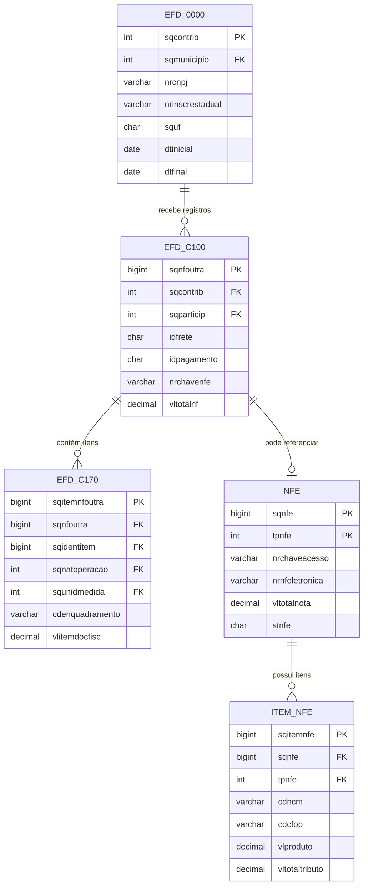

# Diagrama ER do Modelo BDFISC

Este documento apresenta um diagrama entidade-relacionamento (MER) em Mermaid com base nos scripts SQL da pasta BDFISC, especialmente nos arquivos que definem as tabelas `NFE`, `ITEM_NFE`, `EFD_0000`, `EFD_C100` e `EFD_C170`.

## Diagrama Mermaid

## Explicação do diagrama

O modelo representa a relação entre os principais blocos de informação fiscal:

- `EFD_0000` funciona como a entidade de abertura da Escrituração Fiscal Digital, identificando o contribuinte e o período de apuração.
- `EFD_C100` representa os registros principais de documentos fiscais (como notas e demais documentos que compõem a escrituração).
- `EFD_C170` representa os itens associados a esses documentos, armazenando detalhes como quantidade, valor, CST, CFOP e tributos.
- `NFE` representa as notas fiscais eletrônicas, com informações gerais do documento.
- `ITEM_NFE` representa os itens contidos em cada NFE.

### Relações principais

1. `EFD_0000` para `EFD_C100`
   - Um registro de abertura da EFD pode ter vários registros `C100` associados.
   - Isso expressa a ideia de que uma escrituração reúne diversos documentos fiscais.

2. `EFD_C100` para `EFD_C170`
   - Cada documento fiscal pode ter vários itens.
   - O relacionamento mostra a composição do documento em linhas de detalhe.

3. `NFE` para `ITEM_NFE`
   - Uma nota fiscal eletrônica pode possuir diversos itens.
   - Essa relação é essencial para representar a estrutura da NF-e em nível detalhado.

4. `EFD_C100` para `NFE`
   - Em alguns cenários, o registro da EFD pode referenciar ou se relacionar com uma NFE, reforçando a ligação entre a escrituração e o documento fiscal eletrônico.

### Objetivo didático

Esse diagrama ajuda a visualizar como os dados fiscais estão organizados em camadas: cabeçalho, detalhe, documentos e itens. Ele é útil para compreender a modelagem do banco e para apoiar a análise de integridade, auditoria tributária e cruzamento de informações.
