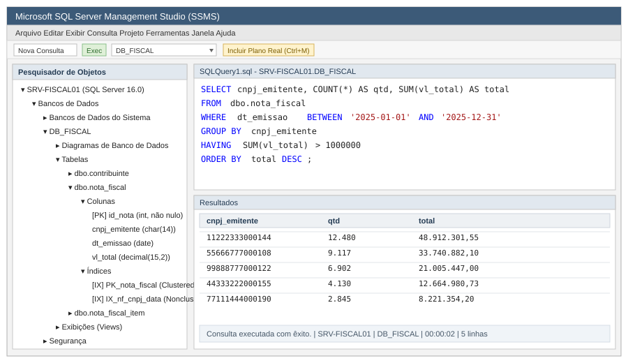
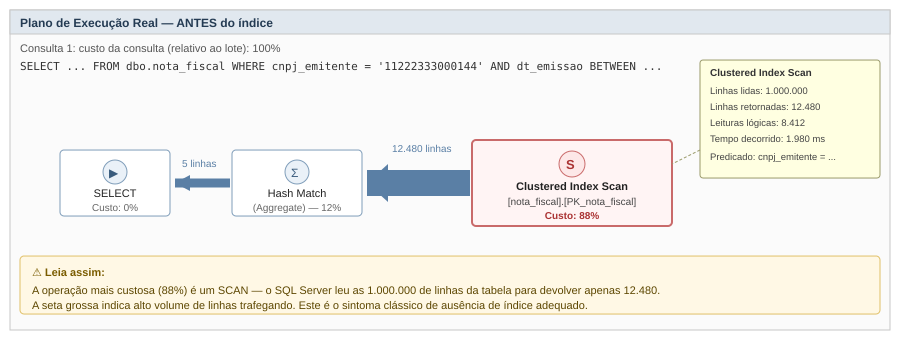
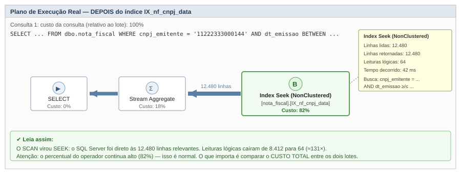
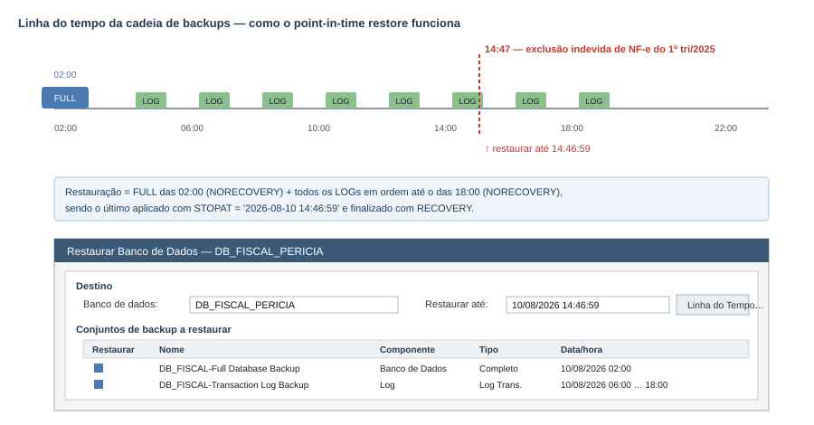
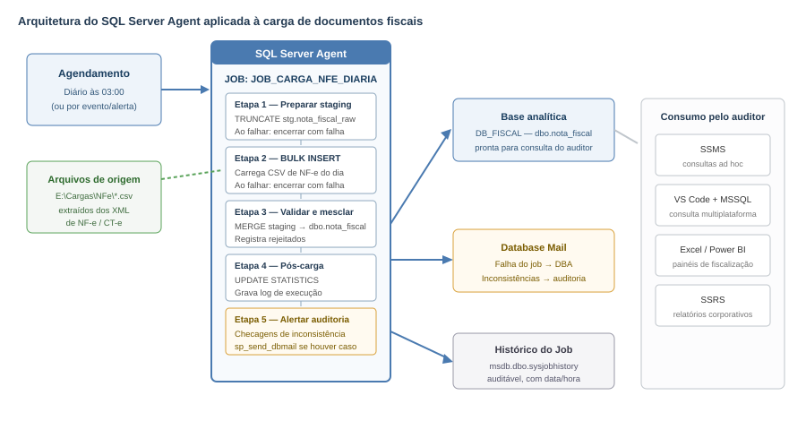
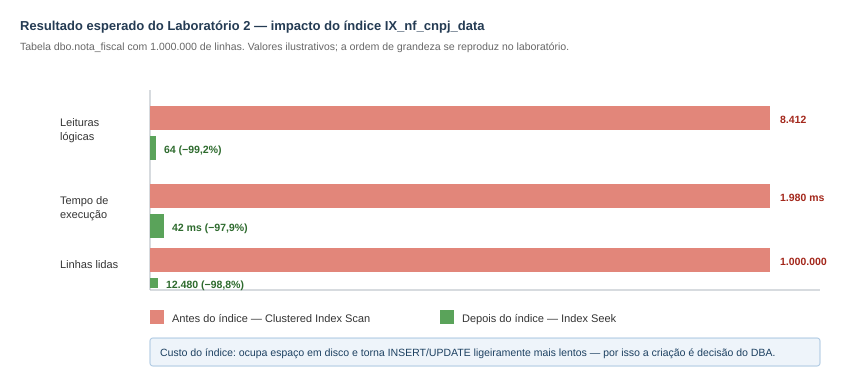
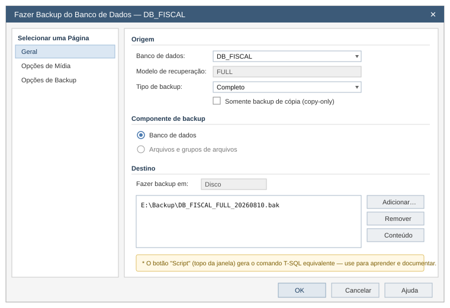
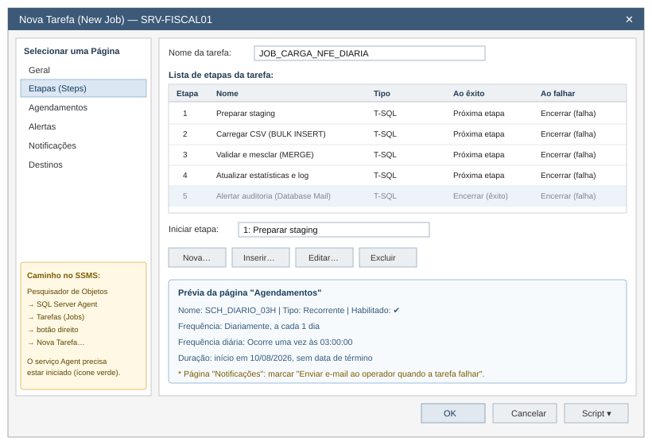
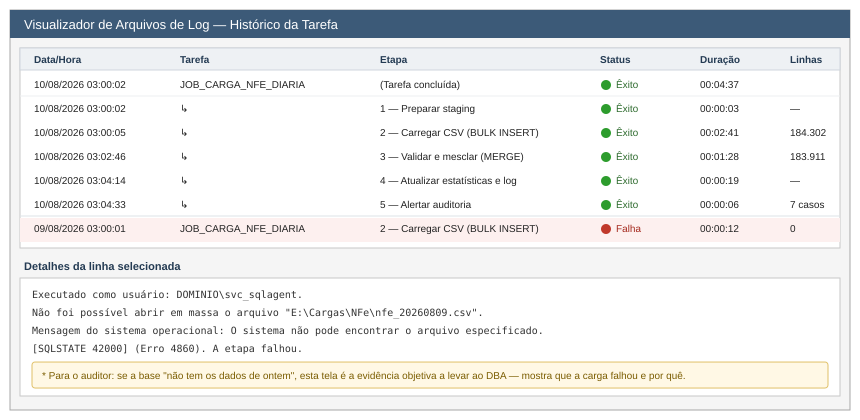

# Módulo 2 – SQL Server Administrativo

## Apostila para Auditores da Receita Estadual

> **Versão 2 — edição com laboratórios práticos.**
> Todos os roteiros desta apostila foram escritos para serem executados em um **ambiente de treinamento**, nunca em bases de produção.

---

## Apresentação do módulo

Este módulo apresenta os conceitos e ferramentas administrativas do SQL Server que são relevantes para quem usa o banco de dados como **ferramenta de análise fiscal**, não para quem o administra.

O público deste curso — auditores fiscais — não realizará instalação, configuração de servidores, tuning avançado ou rotinas de backup na prática: essas tarefas continuam sob responsabilidade do administrador de banco de dados (DBA). O objetivo aqui é outro: dar ao auditor **vocabulário técnico e senso crítico** para

- entender o que o DBA faz e por que isso afeta o seu trabalho (ex.: por que uma consulta está lenta, por que uma base foi restaurada, por que um job noturno atualiza os dados às 6h);
- usar utilitários administrativos de forma segura para inspecionar estrutura de dados, checar o andamento de cargas de informação e diagnosticar problemas simples em suas próprias consultas;
- reconhecer oportunidades de **automação** que a equipe de TI pode implementar para apoiar rotinas de fiscalização (importação de arquivos fiscais, atualização de bases analíticas, alertas de inconsistências).

A apostila está dividida em duas partes:

- **Parte I — Conceitos** (seções 1 a 8): o que o auditor precisa reconhecer e saber pedir.
- **Parte II — Laboratórios** (seções 9 a 16): roteiros passo a passo, com scripts prontos, para serem executados em sala de aula sobre uma base fiscal fictícia (`DB_FISCAL`).

---

## Sumário

**Parte I — Conceitos**

1. Atividades gerais de administração de bancos de dados no SQL Server
2. Gestão de recursos
3. Otimização de bancos de dados
4. Utilitários de gestão
5. Recuperação e backup
6. Automação de tarefas administrativas
7. Automações aplicadas à fiscalização: cenários práticos
8. Boas práticas e limites de atuação do auditor

**Parte II — Laboratórios práticos**

9. Laboratório 0 — Montagem do ambiente `DB_FISCAL`
10. Laboratório 1 — Explorando a base com o SSMS
11. Laboratório 2 — Índices e plano de execução: medindo o ganho
12. Laboratório 3 — Query Store: histórico de desempenho
13. Laboratório 4 — Backup e restauração *point-in-time*
14. Laboratório 5 — Carga automática com `BULK INSERT`
15. Laboratório 6 — Automatizando a carga com um Job do SQL Server Agent
16. Laboratório 7 — Alerta automático de inconsistências fiscais

**Anexos**

17. Checklist de encerramento e limpeza do ambiente
18. Glossário
19. Referências

---

# PARTE I — CONCEITOS

## 1. Atividades gerais de administração de bancos de dados no SQL Server

Um DBA de SQL Server trabalha, em linhas gerais, em quatro frentes: **instalar e configurar** a instância, **proteger** os dados (segurança e backup), **manter a performance** (otimização e monitoramento) e **automatizar** rotinas repetitivas. O auditor não executa essas tarefas, mas precisa reconhecer a estrutura que elas produzem, porque é dentro dela que ele vai trabalhar todos os dias.

### 1.1 Hierarquia de objetos que o auditor encontra

| Nível | O que é | Exemplo no contexto fiscal |
|---|---|---|
| **Instância** | Um "servidor" SQL Server instalado, com sua própria porta e configuração | Instância `SRV-FISCAL01` |
| **Banco de dados (database)** | Container lógico de dados, com seu próprio arquivo de dados e log | `DB_FISCAL`, `SPED_CONTRIBUINTES` |
| **Esquema (schema)** | Agrupamento lógico de objetos dentro de um banco | `dbo`, `stg` (staging), `fiscal` |
| **Tabela / View** | Onde os dados residem ou são consultados | `dbo.nota_fiscal`, `vw_apuracao_icms` |
| **Login / Usuário** | Identidade de acesso à instância e ao banco | Login `dominio\auditor.silva` |

Essa hierarquia é exatamente o que aparece no **Pesquisador de Objetos** do SSMS (Figura 1) e será o ponto de partida do Laboratório 1.



*Figura 1 — Janela do SSMS: Pesquisador de Objetos (esquerda), editor de consultas (topo) e grade de resultados (base). É a tela em que o auditor passará a maior parte do tempo.*

### 1.2 O que muda quando existe um DBA dedicado

Como a equipe de TI cuida da administração, o auditor deve saber **a quem e o que pedir**:

- solicitar acesso de leitura (`db_datareader`) a um banco ou schema específico, em vez de acesso administrativo;
- pedir a criação de uma *view* consolidada quando uma consulta analítica se repete com frequência entre a equipe;
- reportar lentidão de consulta com evidências (texto da consulta, horário, tempo de execução, plano de execução) em vez de tentar ajustar configurações do servidor;
- solicitar a restauração de uma base histórica para análise de período anterior (ver seção 5 e Laboratório 4).

---

## 2. Gestão de recursos

Gestão de recursos trata de como o SQL Server distribui **memória, CPU, E/S de disco e conexões** entre os bancos e usuários. O DBA configura esses limites; o auditor não mexe neles, mas precisa entender os sintomas que eles produzem.

### 2.1 Por que isso importa para o auditor

- **Concorrência**: se muitos auditores rodam consultas pesadas simultaneamente sobre a mesma base transacional, todos sentem lentidão. Por isso a TI costuma disponibilizar uma **base analítica separada** (réplica, data warehouse ou banco somente leitura), isolada do sistema que recebe as notas fiscais em tempo real.
- **Bloqueios (locks)**: uma consulta de leitura sobre uma tabela em atualização pode "esperar" a atualização terminar. A consulta não travou — está aguardando a liberação de um recurso.
- **Resource Governor**: recurso que permite ao DBA limitar quanto de CPU/memória um grupo de usuários pode consumir. Se essa política for aplicada à conta dos auditores, consultas muito pesadas podem ser automaticamente restringidas.

### 2.2 Como o auditor verifica o que está acontecendo agora

Um comando útil e inofensivo (somente leitura) para entender se a lentidão é sua ou do servidor:

```sql
-- O que está sendo executado neste momento na instância?
-- Requer permissão VIEW SERVER STATE (peça ao DBA se não tiver).
SELECT
    r.session_id,
    r.status,
    r.wait_type,                       -- NULL = está executando; preenchido = está esperando algo
    r.blocking_session_id,             -- <> 0 significa que outra sessão está bloqueando esta
    r.cpu_time,
    r.total_elapsed_time / 1000 AS segundos,
    DB_NAME(r.database_id) AS banco,
    t.text AS comando
FROM sys.dm_exec_requests AS r
CROSS APPLY sys.dm_exec_sql_text(r.sql_handle) AS t
WHERE r.session_id <> @@SPID
ORDER BY r.total_elapsed_time DESC;
```

**Como ler:** se `blocking_session_id` for diferente de zero, sua consulta está bloqueada por outra sessão — é informação objetiva para levar ao DBA. Se `wait_type` começar com `PAGEIOLATCH`, o gargalo é leitura de disco (tipicamente falta de índice, tema da seção 3).

### 2.3 Boas práticas do lado do auditor

- filtrar por período e por contribuinte o quanto antes na consulta (`WHERE` restritivo);
- evitar `SELECT *` em tabelas muito grandes;
- preferir horários de menor concorrência (fora do processamento noturno de cargas) para consultas muito pesadas.

---

## 3. Otimização de bancos de dados

Para o auditor, o recorte relevante é **entender por que uma consulta está lenta e como formulá-la melhor** — não recriar índices ou reescrever o mecanismo de otimização.

### 3.1 Índices

Um índice funciona como o índice remissivo de um livro: em vez de ler a tabela inteira, o SQL Server consulta uma estrutura auxiliar ordenada e vai direto às linhas. Duas operações aparecem no plano de execução e resumem tudo:

| Operador | O que significa | Sinal |
|---|---|---|
| **Index Scan / Table Scan** | Leu a estrutura inteira e filtrou depois | ⚠ Custoso em tabelas grandes |
| **Index Seek** | Foi diretamente às linhas que atendem ao filtro | ✔ Desejável |

Se uma consulta recorrente do time está lenta, vale reportar ao DBA **quais colunas são usadas nos filtros (`WHERE`), junções (`JOIN`) e agrupamentos (`GROUP BY`)** — esse é o principal insumo para o DBA avaliar a criação de um índice.

### 3.2 Plano de execução

O **plano de execução** é a "receita" que o SQL Server monta para responder a uma consulta. No SSMS:

- **Ctrl+L** — plano *estimado* (não executa a consulta);
- **Ctrl+M** — liga o plano *real* (executa e mostra o que de fato aconteceu).

As Figuras 2 e 3 mostram a mesma consulta antes e depois da criação de um índice — é exatamente o que será reproduzido no Laboratório 2.



*Figura 2 — Antes do índice: o operador dominante é um **Clustered Index Scan** (88% do custo). A seta grossa entre operadores indica alto volume de linhas trafegando.*



*Figura 3 — Depois do índice: o scan virou **Index Seek**, e as leituras lógicas caem de 8.412 para 64.*

**Três coisas a observar em qualquer plano:**

1. o operador com **maior percentual de custo** — é onde começar a olhar;
2. a **espessura das setas** — setas grossas significam muitas linhas sendo movidas;
3. a diferença entre **linhas estimadas e linhas reais** (visível ao passar o mouse sobre o operador) — uma diferença grande indica estatísticas desatualizadas.

### 3.3 Query Store

O **Query Store** grava automaticamente o histórico de desempenho das consultas de um banco. Para o auditor, permite ver, direto no SSMS, quais consultas mais consomem recursos ou pioraram ao longo do tempo, sem qualquer conhecimento de tuning: os relatórios já vêm prontos no menu do banco → **Query Store**. Ver Laboratório 3.

### 3.4 Estatísticas

O otimizador decide o plano com base em estatísticas de distribuição dos dados. Quando uma base recebe carga em grande volume (ex.: importação mensal de SPED) e as consultas ficam lentas logo depois, o sintoma típico é **estatísticas desatualizadas** — motivo pelo qual um bom job de carga termina com `UPDATE STATISTICS` (ver Laboratório 6).

---

## 4. Utilitários de gestão

### 4.1 SQL Server Management Studio (SSMS)

Ferramenta administrativa oficial e gratuita, e a mais completa para tarefas administrativas (jobs do Agent, segurança, backup) e também para consultas analíticas. Recursos mais úteis ao auditor:

- **Pesquisador de Objetos** — navega pela estrutura das bases sem comandos;
- **Editor de consultas** — escreve e executa T-SQL, exporta resultados para Excel/CSV;
- **Planos de execução e Query Store** (seção 3);
- **Relatórios Padrão** (botão direito no banco → *Relatórios* → *Relatórios Padrão*) — uso de disco, atividade recente e objetos do banco;
- **Botão "Script"** — presente em quase todas as janelas de configuração; gera o T-SQL equivalente ao que foi preenchido na tela. É o melhor recurso de aprendizado da ferramenta.

### 4.2 Visual Studio Code + extensão MSSQL

A Microsoft descontinuou o **Azure Data Studio** (último lançamento em junho de 2025, suporte encerrado em fevereiro de 2026). A recomendação oficial passou a ser a extensão **MSSQL para Visual Studio Code**, multiplataforma e mais leve que o SSMS. Para o auditor que só precisa **consultar dados**, é hoje a melhor alternativa. Tarefas administrativas (Jobs do Agent, backup pela interface) continuam exigindo o SSMS.

### 4.3 `sqlcmd` e `bcp`

Utilitários de linha de comando. O auditor raramente os usa diretamente, mas é útil saber que existem porque muitas rotinas automatizadas são construídas sobre eles:

```bat
:: Executa uma consulta e grava o resultado em CSV
sqlcmd -S SRV-FISCAL01 -E -d DB_FISCAL -Q "SELECT TOP 100 * FROM dbo.nota_fiscal" -s ";" -W -o "E:\Saida\amostra.csv"

:: Exporta uma tabela inteira (bcp é mais rápido para grandes volumes)
bcp DB_FISCAL.dbo.nota_fiscal out "E:\Saida\nota_fiscal.txt" -S SRV-FISCAL01 -T -c -t ";"
```

### 4.4 Outras ferramentas de consumo

- **Excel** com conexão ODBC/OLE DB — consulta o SQL Server direto da planilha;
- **Power BI** — dashboards de acompanhamento fiscal alimentados pelo banco;
- **SQL Server Reporting Services (SSRS)** — relatórios corporativos padronizados publicados pela TI.

---

## 5. Recuperação e backup

Dois conceitos aqui têm impacto direto na fiscalização: **preservação de evidência** e **reconstituição de cenário histórico**.

### 5.1 Modelos de recuperação

| Modelo | Backup de log possível? | Point-in-time restore? | Uso típico |
|---|---|---|---|
| **SIMPLE** | Não | Não | Bases analíticas recarregáveis |
| **FULL** | Sim | Sim | Bases fiscais / de produção |
| **BULK_LOGGED** | Sim (com restrições) | Parcial | Janelas de carga massiva |

Só é possível restaurar um banco para um **instante exato do passado** se ele estiver em modelo `FULL` (ou `BULK_LOGGED`) **e** houver backups de log encadeados.

### 5.2 Tipos de backup

- **Completo (full)**: cópia integral do banco em um momento específico. É a base de qualquer restauração.
- **Diferencial**: apenas o que mudou desde o último full. Reduz o tempo de restauração.
- **Log de transações**: registro das operações desde o último backup de log. É o que permite o *point-in-time restore*.



*Figura 4 — Cadeia de backups e restauração até um instante exato, imediatamente anterior a um incidente. Reproduzido no Laboratório 4.*

### 5.3 RPO e RTO

- **RPO (Recovery Point Objective)**: quanto de dado a organização aceita perder — define a frequência dos backups de log.
- **RTO (Recovery Time Objective)**: quanto tempo se aceita levar para restaurar o serviço.

### 5.4 Por que isso importa para a fiscalização

- **Reconstituir uma base em data específica.** Se uma auditoria precisa analisar como os dados estavam antes de uma retificação ou de uma exclusão suspeita, o mecanismo técnico é o *point-in-time restore*. Saber que essa capacidade existe permite pedir formalmente ao DBA a restauração "como estava em 15/03 às 14h".
- **Cadeia de custódia de evidência digital.** Um banco restaurado a partir de backup, com hash/checksum documentado, é frequentemente usado como evidência técnica. Ao usar dados restaurados como prova, solicite a documentação da restauração: arquivo de origem, data/hora do backup, `STOPAT` utilizado, responsável e hash do arquivo `.bak`.
- **Restauração em base separada.** Uma boa prática (adotada no Laboratório 4) é **nunca sobrescrever a base original**: restaura-se para um banco novo, com outro nome (`DB_FISCAL_PERICIA`), preservando o ambiente produtivo.
- **Retenção.** Confirme com a TI a política de retenção antes de presumir que uma base de anos anteriores ainda pode ser restaurada.

---

## 6. Automação de tarefas administrativas

### 6.1 SQL Server Agent

Serviço do SQL Server responsável por executar **jobs** — conjuntos ordenados de etapas (T-SQL, procedures, scripts, pacotes SSIS) — em horários programados ou disparados por eventos. Cada job pode notificar por e-mail (via **Database Mail**) em caso de sucesso ou falha, e todo o histórico fica registrado em `msdb`.



*Figura 5 — Arquitetura completa de um job de carga de documentos fiscais: agendamento, etapas, saídas e consumo pelo auditor. Essa é a estrutura construída nos Laboratórios 5 a 7.*

**Componentes de um job:**

| Componente | Função |
|---|---|
| **Job (tarefa)** | Unidade de trabalho, com nome e proprietário |
| **Step (etapa)** | Cada passo executado, com ação definida para êxito e para falha |
| **Schedule (agendamento)** | Quando executar (diário, semanal, ao iniciar o Agent, quando a CPU estiver ociosa) |
| **Operator (operador)** | Pessoa/lista que recebe notificações |
| **Alert (alerta)** | Condição monitorada que dispara um job ou uma notificação |
| **Proxy** | Credencial alternativa usada por etapas que acessam recursos externos (ex.: pasta de rede) |

### 6.2 Outros mecanismos de automação relevantes

| Mecanismo | Para que serve | Relevância para o auditor |
|---|---|---|
| **`BULK INSERT` / `bcp`** | Carga rápida de arquivos texto para dentro do banco | Motor da importação diária de arquivos de NF-e/SPED |
| **SSIS** | Automatiza processos de ETL mais complexos (múltiplas fontes, transformações, XML) | Usado quando a origem são XML de NF-e, e não CSV |
| **Alerts do Agent** | Dispara ações quando uma condição é detectada | Avisa a equipe quando uma carga falha ou atrasa |
| **Change Data Capture (CDC)** | Registra automaticamente todas as alterações feitas em uma tabela | Rastreia quem alterou um registro fiscal e quando |
| **Change Tracking** | Versão mais leve do CDC — registra apenas quais linhas mudaram | Sincroniza apenas dados novos/alterados entre sistemas |
| **Database Mail** | Envio de e-mail a partir do próprio SQL Server | Entrega automática de alertas e planilhas de apuração |
| **PowerShell + Agent** | Manipulação de arquivos, FTP, compactação | Prepara os arquivos antes da carga |

---

## 7. Automações aplicadas à fiscalização: cenários práticos

Como os mecanismos da seção 6 podem ser combinados para apoiar rotinas de fiscalização. O auditor não implementa nada disso sozinho — mas reconhecer as possibilidades permite **pedir à TI, com precisão, a automação certa**.

1. **Importação automática de documentos fiscais eletrônicos.** Jobs do Agent, acionando `BULK INSERT` ou pacotes SSIS, leem diariamente os arquivos de NF-e, NFC-e e CT-e recebidos e os carregam em uma base estruturada, pronta para consulta em SQL. *(Laboratórios 5 e 6.)*

2. **Consolidação de bases analíticas (data warehouse fiscal).** Um job noturno consolida dados de múltiplas origens (SEFAZ, ERP, SPED) em uma base única e padronizada, evitando que cada análise precise cruzar manualmente fontes diferentes.

3. **Alertas automáticos de inconsistência.** Um job agendado roda rotinas de checagem — notas com valor muito acima da média do CNAE, lacunas na sequência de numeração, divergência entre valor declarado e apurado — e dispara e-mail para a equipe de fiscalização, funcionando como triagem prévia. *(Laboratório 7.)*

4. **Rastreamento de alterações em bases de contribuintes (CDC).** Quando a base recebe retificações, o CDC reconstrói automaticamente o histórico — quem, quando e o que mudou — sem comparação manual de versões.

5. **Atualização programada de relatórios e dashboards.** Jobs disparam a atualização de relatórios do SSRS ou datasets do Power BI logo após a carga diária, garantindo que o painel da reunião da manhã já reflita os documentos do dia anterior.

6. **Rotinas de amostragem periódica.** Um job extrai automaticamente uma amostra estatística de notas fiscais (por setor, faixa de valor ou contribuinte) para compor a base de trabalho semanal da equipe.

7. **Exportação automática de relatórios de apuração.** Scripts agendados geram e enviam por e-mail, todo início de mês, planilhas consolidadas de apuração prontas para revisão.

Em todos os cenários, o papel do auditor é **especificar a regra de negócio** (o que checar, com que frequência, o que é "suspeito"); a implementação continua sendo do DBA.

---

## 8. Boas práticas e limites de atuação do auditor

- Solicitar sempre acesso de **leitura** (`db_datareader`), nunca administrativo, às bases de trabalho.
- Preferir consultar **views ou bases analíticas** disponibilizadas pela TI em vez da base transacional de produção.
- Reportar lentidão ou erro com evidências: texto da consulta, horário, mensagem de erro e, se possível, o plano de execução salvo (`.sqlplan`).
- Não executar comandos que alteram dados ou estrutura (`INSERT`, `UPDATE`, `DELETE`, `DROP`, `BACKUP`, `RESTORE`) fora do ambiente de treinamento.
- Ao usar dados restaurados de backup como evidência, sempre solicitar a documentação formal da restauração.
- Ao identificar uma consulta ou relatório repetitivo no time, propor à TI que seja automatizado (job ou view), em vez de repetir o trabalho manual toda semana.

---

# PARTE II — LABORATÓRIOS PRÁTICOS

> ### ⚠ Aviso importante
>
> Os laboratórios a seguir **criam, alteram e apagam dados**, incluindo um banco inteiro. Execute-os exclusivamente em uma **instância de treinamento**, onde você seja `sysadmin`. Nunca execute em produção.
>
> **Pré-requisitos:**
> - SQL Server 2019 ou superior (Developer ou Express) instalado localmente;
> - SSMS 20 ou superior;
> - permissão `sysadmin` na instância de treinamento;
> - as pastas abaixo criadas no disco, com permissão de escrita para a conta de serviço do SQL Server e do SQL Server Agent:
>   - `E:\Backup`
>   - `E:\Dados`
>   - `E:\Cargas\NFe`
>   - `E:\Cargas\NFe\rejeitados`
>   - `E:\Cargas\NFe\processados`
>
> Se sua máquina não tiver a unidade `E:`, substitua por `C:\Treinamento\...` em **todos** os scripts.

---

## 9. Laboratório 0 — Montagem do ambiente `DB_FISCAL`

**Objetivo:** criar uma base fiscal fictícia com 1 milhão de notas fiscais, que servirá de cenário para todos os demais laboratórios.
**Tempo estimado:** 10 a 15 minutos (a carga de 1 milhão de linhas leva alguns minutos).

### Passo 1 — Criar o banco e os schemas

```sql
USE master;
GO

IF DB_ID('DB_FISCAL') IS NOT NULL
BEGIN
    ALTER DATABASE DB_FISCAL SET SINGLE_USER WITH ROLLBACK IMMEDIATE;
    DROP DATABASE DB_FISCAL;
END
GO

CREATE DATABASE DB_FISCAL
ON PRIMARY (
    NAME = N'DB_FISCAL',
    FILENAME = N'E:\Dados\DB_FISCAL.mdf',
    SIZE = 512MB, FILEGROWTH = 128MB
)
LOG ON (
    NAME = N'DB_FISCAL_log',
    FILENAME = N'E:\Dados\DB_FISCAL_log.ldf',
    SIZE = 256MB, FILEGROWTH = 64MB
);
GO

-- Durante a carga inicial usamos SIMPLE para não inflar o log.
-- No Laboratório 4 mudaremos para FULL.
ALTER DATABASE DB_FISCAL SET RECOVERY SIMPLE;
GO

USE DB_FISCAL;
GO

CREATE SCHEMA stg AUTHORIZATION dbo;   -- área de staging (dados brutos importados)
GO
```

### Passo 2 — Criar as tabelas

```sql
USE DB_FISCAL;
GO

CREATE TABLE dbo.contribuinte (
    cnpj                CHAR(14)      NOT NULL,
    razao_social        VARCHAR(120)  NOT NULL,
    uf                  CHAR(2)       NOT NULL,
    cnae                CHAR(7)       NOT NULL,
    regime_tributario   VARCHAR(20)   NOT NULL,
    dt_inicio_atividade DATE          NULL,
    CONSTRAINT PK_contribuinte PRIMARY KEY CLUSTERED (cnpj)
);
GO

CREATE TABLE dbo.nota_fiscal (
    id_nota           BIGINT        IDENTITY(1,1) NOT NULL,
    chave_acesso      CHAR(44)      NOT NULL,
    cnpj_emitente     CHAR(14)      NOT NULL,
    cnpj_destinatario CHAR(14)      NULL,
    dt_emissao        DATE          NOT NULL,
    vl_total          DECIMAL(15,2) NOT NULL,
    vl_icms           DECIMAL(15,2) NOT NULL,
    uf_destino        CHAR(2)       NOT NULL,
    situacao          TINYINT       NOT NULL,   -- 1=autorizada 2=cancelada 3=denegada
    dt_carga          DATETIME2(0)  NOT NULL
        CONSTRAINT DF_nf_dt_carga DEFAULT (SYSDATETIME()),
    CONSTRAINT PK_nota_fiscal PRIMARY KEY CLUSTERED (id_nota)
);
GO

-- Chave de negócio: garante que a mesma NF-e não seja importada duas vezes.
CREATE UNIQUE NONCLUSTERED INDEX UX_nf_chave_acesso
    ON dbo.nota_fiscal (chave_acesso);
GO

-- Tabela de log das cargas automatizadas (usada nos Laboratórios 5 e 6)
CREATE TABLE dbo.log_carga (
    id_log        INT IDENTITY(1,1) NOT NULL CONSTRAINT PK_log_carga PRIMARY KEY,
    dt_execucao   DATETIME2(0)  NOT NULL CONSTRAINT DF_log_dt DEFAULT (SYSDATETIME()),
    arquivo       NVARCHAR(400) NULL,
    linhas_lidas  INT           NULL,
    linhas_novas  INT           NULL,
    linhas_atualizadas INT      NULL,
    linhas_rejeitadas  INT      NULL,
    situacao      VARCHAR(20)   NOT NULL,
    mensagem      NVARCHAR(2000) NULL
);
GO
```

### Passo 3 — Popular a tabela de contribuintes (5.000 CNPJs)

```sql
USE DB_FISCAL;
GO

;WITH n AS (
    SELECT TOP (5000)
           ROW_NUMBER() OVER (ORDER BY (SELECT NULL)) AS i
    FROM sys.all_objects a CROSS JOIN sys.all_objects b
)
INSERT INTO dbo.contribuinte (cnpj, razao_social, uf, cnae, regime_tributario, dt_inicio_atividade)
SELECT
    RIGHT(REPLICATE('0', 14) + CAST(n.i AS VARCHAR(14)), 14),
    CONCAT('CONTRIBUINTE FICTICIO ', n.i, ' LTDA'),
    CHOOSE((n.i % 6) + 1, 'SP', 'MG', 'RJ', 'PR', 'BA', 'RS'),
    CHOOSE((n.i % 5) + 1, '4711302', '4530703', '1091101', '4930202', '6201501'),
    CHOOSE((n.i % 3) + 1, 'SIMPLES', 'LUCRO PRESUMIDO', 'LUCRO REAL'),
    DATEADD(DAY, -(n.i % 7000), CAST('2026-01-01' AS DATE))
FROM n;
GO

SELECT COUNT(*) AS qtd_contribuintes FROM dbo.contribuinte;   -- esperado: 5000
```

### Passo 4 — Gerar 1.000.000 de notas fiscais

> Este passo é o mais demorado (2 a 5 minutos, dependendo da máquina). A distribuição é **propositalmente desbalanceada**: o CNPJ `00000000000001` concentra cerca de 12.500 notas, o que torna o efeito do índice bem visível no Laboratório 2.

```sql
USE DB_FISCAL;
GO
SET NOCOUNT ON;

;WITH nums AS (
    SELECT TOP (1000000)
           ROW_NUMBER() OVER (ORDER BY (SELECT NULL)) AS i
    FROM sys.all_objects a
    CROSS JOIN sys.all_objects b
    CROSS JOIN sys.all_objects c
)
INSERT INTO dbo.nota_fiscal
    (chave_acesso, cnpj_emitente, cnpj_destinatario, dt_emissao,
     vl_total, vl_icms, uf_destino, situacao)
SELECT
    RIGHT(REPLICATE('0', 44) + CAST(n.i AS VARCHAR(44)), 44)                    AS chave_acesso,
    CASE WHEN n.i % 80 = 0
         THEN '00000000000001'                                                   -- emitente "grande"
         ELSE RIGHT(REPLICATE('0', 14)
              + CAST(((CAST(n.i AS BIGINT) * 7919) % 5000) + 1 AS VARCHAR(14)), 14)
    END                                                                          AS cnpj_emitente,
    RIGHT(REPLICATE('0', 14)
        + CAST(((CAST(n.i AS BIGINT) * 104729) % 5000) + 1 AS VARCHAR(14)), 14)  AS cnpj_destinatario,
    DATEADD(DAY, n.i % 730, CAST('2024-01-01' AS DATE))                          AS dt_emissao,
    v.vl_total,
    CAST(v.vl_total * 0.18 AS DECIMAL(15,2))                                     AS vl_icms,
    CHOOSE((n.i % 6) + 1, 'SP', 'MG', 'RJ', 'PR', 'BA', 'RS')                    AS uf_destino,
    CASE WHEN n.i % 137 = 0 THEN 2 ELSE 1 END                                    AS situacao
FROM nums AS n
CROSS APPLY (
    SELECT CAST(((ABS(CHECKSUM(NEWID())) % 900000) / 100.0) + 50.00 AS DECIMAL(15,2)) AS vl_total
) AS v;
GO

SELECT COUNT(*) AS qtd_notas FROM dbo.nota_fiscal;   -- esperado: 1000000
```

> **Se der erro de "TOP não retornou linhas suficientes"** em uma instância muito enxuta, troque `sys.all_objects` por `sys.all_columns` na cláusula `FROM` — há muito mais linhas nessa visão de catálogo.

### Passo 5 — Verificar o ambiente

```sql
USE DB_FISCAL;
GO

SELECT
    (SELECT COUNT(*) FROM dbo.contribuinte)  AS contribuintes,
    (SELECT COUNT(*) FROM dbo.nota_fiscal)   AS notas_fiscais,
    (SELECT MIN(dt_emissao) FROM dbo.nota_fiscal) AS primeira_emissao,
    (SELECT MAX(dt_emissao) FROM dbo.nota_fiscal) AS ultima_emissao;

-- Quais são os 5 maiores emitentes por quantidade de notas?
SELECT TOP (5)
       cnpj_emitente,
       COUNT(*)        AS qtd_notas,
       SUM(vl_total)   AS valor_total
FROM dbo.nota_fiscal
GROUP BY cnpj_emitente
ORDER BY qtd_notas DESC;
```

✅ **Resultado esperado:** 5.000 contribuintes, 1.000.000 de notas, emissões entre 01/01/2024 e 30/12/2025, e o CNPJ `00000000000001` no topo com ~12.500 notas.

---

## 10. Laboratório 1 — Explorando a base com o SSMS

**Objetivo:** localizar-se em uma base desconhecida usando apenas a interface e comandos de catálogo — a primeira coisa que um auditor faz ao receber acesso a uma nova base.
**Tempo estimado:** 10 minutos.

### Passo 1 — Navegar pelo Pesquisador de Objetos

1. No SSMS, conecte-se à instância de treinamento.
2. Expanda **Bancos de Dados → DB_FISCAL → Tabelas**.
3. Expanda **dbo.nota_fiscal → Colunas** e observe tipos e nulidade.
4. Expanda **dbo.nota_fiscal → Índices** — no momento existem apenas `PK_nota_fiscal` e `UX_nf_chave_acesso`.

Compare a árvore obtida com a Figura 1.

### Passo 2 — Descobrir a estrutura por comando

Nem sempre a interface está disponível (ex.: acesso via VS Code). Estes comandos resolvem:

```sql
USE DB_FISCAL;
GO

-- Estrutura completa de uma tabela: colunas, tipos, índices e chaves
EXEC sp_help 'dbo.nota_fiscal';

-- Todas as tabelas do banco, com contagem de linhas e espaço ocupado
SELECT
    s.name  AS esquema,
    t.name  AS tabela,
    p.rows  AS linhas,
    CAST(SUM(a.total_pages) * 8 / 1024.0 AS DECIMAL(10,2)) AS tamanho_mb
FROM sys.tables       AS t
JOIN sys.schemas      AS s  ON s.schema_id = t.schema_id
JOIN sys.indexes      AS ix ON ix.object_id = t.object_id
JOIN sys.partitions   AS p  ON p.object_id = t.object_id AND p.index_id = ix.index_id
JOIN sys.allocation_units AS a ON a.container_id = p.partition_id
WHERE ix.index_id <= 1
GROUP BY s.name, t.name, p.rows
ORDER BY linhas DESC;

-- Onde existe uma coluna chamada "cnpj..." em todo o banco?
SELECT
    OBJECT_SCHEMA_NAME(c.object_id) AS esquema,
    OBJECT_NAME(c.object_id)        AS objeto,
    c.name                          AS coluna,
    TYPE_NAME(c.user_type_id)       AS tipo
FROM sys.columns AS c
WHERE c.name LIKE '%cnpj%'
ORDER BY objeto, coluna;

-- Quais índices existem hoje na tabela de notas?
SELECT
    i.name          AS indice,
    i.type_desc     AS tipo,
    i.is_unique     AS unico,
    STRING_AGG(c.name, ', ') WITHIN GROUP (ORDER BY ic.key_ordinal) AS colunas_chave
FROM sys.indexes AS i
JOIN sys.index_columns AS ic ON ic.object_id = i.object_id AND ic.index_id = i.index_id
JOIN sys.columns AS c ON c.object_id = ic.object_id AND c.column_id = ic.column_id
WHERE i.object_id = OBJECT_ID('dbo.nota_fiscal')
  AND ic.is_included_column = 0
GROUP BY i.name, i.type_desc, i.is_unique;
```

### Passo 3 — Usar os Relatórios Padrão

Botão direito em **DB_FISCAL** → **Relatórios** → **Relatórios Padrão** → **Uso de Disco pelas Principais Tabelas**.

Esse relatório responde em segundos à pergunta "quais são as tabelas realmente grandes deste banco?" — útil antes de escrever qualquer consulta pesada.

### Passo 4 — Exportar um resultado para Excel

1. Execute uma consulta qualquer.
2. Na grade de resultados, clique no canto superior esquerdo (seleciona tudo) → botão direito → **Copiar com Cabeçalhos**.
3. Cole no Excel.

> Para volumes maiores, use **Botão direito no banco → Tarefas → Exportar Dados** (assistente de exportação), ou o `sqlcmd` mostrado na seção 4.3.

---

## 11. Laboratório 2 — Índices e plano de execução: medindo o ganho

**Objetivo:** medir objetivamente o impacto de um índice sobre uma consulta típica de fiscalização, e aprender a ler o plano de execução.
**Tempo estimado:** 15 minutos.

### Passo 1 — Preparar a medição

```sql
USE DB_FISCAL;
GO

-- Limpa o cache de planos e de dados para que a medição seja justa.
-- ⚠ Só faça isso em ambiente de treinamento — em produção prejudica todos os usuários.
DBCC FREEPROCCACHE;
DBCC DROPCLEANBUFFERS;
GO

-- Liga a medição de leituras e de tempo
SET STATISTICS IO ON;
SET STATISTICS TIME ON;
GO
```

No SSMS, pressione **Ctrl+M** (ou clique em *Incluir Plano de Execução Real*) antes de executar as consultas seguintes.

### Passo 2 — Executar a consulta SEM índice

A consulta abaixo é típica de uma fiscalização: todas as notas de um contribuinte em um período.

```sql
USE DB_FISCAL;
GO

SELECT
    nf.cnpj_emitente,
    COUNT(*)            AS qtd_notas,
    SUM(nf.vl_total)    AS valor_total,
    SUM(nf.vl_icms)     AS icms_total
FROM dbo.nota_fiscal AS nf
WHERE nf.cnpj_emitente = '00000000000001'
  AND nf.dt_emissao BETWEEN '2025-01-01' AND '2025-12-31'
  AND nf.situacao = 1
GROUP BY nf.cnpj_emitente;
GO
```

**Anote os três números** (aba *Mensagens* e aba *Plano de Execução*):

| Métrica | Onde encontrar |
|---|---|
| Leituras lógicas | Aba **Mensagens**: `Tabela 'nota_fiscal'. Contagem de verificação 1, leituras lógicas NNNN...` |
| Tempo de CPU e decorrido | Aba **Mensagens**: `Tempos de execução do SQL Server: tempo de CPU = N ms, tempo decorrido = N ms` |
| Operador dominante | Aba **Plano de Execução**: o retângulo com o maior `Custo:` |

Você deverá ver um **Clustered Index Scan** consumindo a quase totalidade do custo, como na Figura 2. Passe o mouse sobre ele e compare **"Número de linhas lidas"** com **"Número real de linhas"**: o SQL Server leu 1.000.000 de linhas para devolver ~6.000.

### Passo 3 — Perguntar ao próprio SQL Server qual índice falta

O SQL Server registra os índices que julgou faltar. Esta consulta é somente leitura e é excelente evidência para levar ao DBA:

```sql
SELECT TOP (10)
    DB_NAME(mid.database_id) AS banco,
    OBJECT_NAME(mid.object_id, mid.database_id) AS tabela,
    migs.user_seeks + migs.user_scans AS vezes_que_ajudaria,
    CAST(migs.avg_user_impact AS DECIMAL(5,2)) AS ganho_estimado_pct,
    mid.equality_columns  AS colunas_igualdade,
    mid.inequality_columns AS colunas_faixa,
    mid.included_columns  AS colunas_incluidas
FROM sys.dm_db_missing_index_group_stats AS migs
JOIN sys.dm_db_missing_index_groups      AS mig ON mig.index_group_handle = migs.group_handle
JOIN sys.dm_db_missing_index_details     AS mid ON mid.index_handle = mig.index_handle
WHERE mid.database_id = DB_ID('DB_FISCAL')
ORDER BY migs.avg_user_impact DESC;
```

> **Cuidado pedagógico importante:** esta DMV *sugere*, não *decide*. Ela não considera índices já existentes nem o custo de manutenção. A criação do índice é sempre decisão do DBA.

### Passo 4 — Criar o índice

```sql
USE DB_FISCAL;
GO

CREATE NONCLUSTERED INDEX IX_nf_cnpj_data
    ON dbo.nota_fiscal (cnpj_emitente, dt_emissao)
    INCLUDE (vl_total, vl_icms, situacao)
    WITH (DATA_COMPRESSION = PAGE, ONLINE = OFF);
GO
```

**Por que essas colunas nessa ordem?**

- `cnpj_emitente` primeiro: é o filtro de **igualdade**, o mais seletivo;
- `dt_emissao` em segundo: é o filtro de **faixa** (`BETWEEN`) — filtros de faixa vêm sempre depois dos de igualdade;
- `INCLUDE`: carrega as colunas apenas retornadas (não filtradas) para dentro do índice, tornando-o um **índice de cobertura** — o SQL Server responde à consulta inteira sem tocar na tabela.

### Passo 5 — Executar a MESMA consulta e comparar

```sql
DBCC FREEPROCCACHE;
DBCC DROPCLEANBUFFERS;
GO

SELECT
    nf.cnpj_emitente,
    COUNT(*)            AS qtd_notas,
    SUM(nf.vl_total)    AS valor_total,
    SUM(nf.vl_icms)     AS icms_total
FROM dbo.nota_fiscal AS nf
WHERE nf.cnpj_emitente = '00000000000001'
  AND nf.dt_emissao BETWEEN '2025-01-01' AND '2025-12-31'
  AND nf.situacao = 1
GROUP BY nf.cnpj_emitente;
GO
```

Preencha o quadro comparativo:

| Métrica | Sem índice | Com índice | Redução |
|---|---|---|---|
| Leituras lógicas | | | |
| Tempo decorrido (ms) | | | |
| Linhas lidas | | | |
| Operador dominante | Clustered Index Scan | Index Seek | — |



*Figura 6 — Ordem de grandeza esperada do ganho. Os números exatos variam por máquina, mas a proporção se reproduz.*

O plano agora deve ser um **Index Seek (NonClustered)**, como na Figura 3.

> **⚠ Armadilha clássica de leitura de planos:** o percentual mostrado em cada operador é **relativo ao lote**, não absoluto. Depois do índice, o Index Seek aparece com 82% — mas isso não significa que piorou. Para comparar de fato, coloque as duas consultas no **mesmo lote** (uma após a outra, com Ctrl+M ligado): o SSMS mostrará "Custo da consulta (relativo ao lote): 3% / 97%", e aí a comparação é válida.

### Passo 6 — Verificar se o índice está sendo usado ao longo do tempo

```sql
SELECT
    OBJECT_NAME(s.object_id) AS tabela,
    i.name                   AS indice,
    s.user_seeks             AS buscas,
    s.user_scans             AS varreduras,
    s.user_updates           AS manutencoes,     -- custo do índice
    s.last_user_seek         AS ultima_busca
FROM sys.dm_db_index_usage_stats AS s
JOIN sys.indexes AS i
     ON i.object_id = s.object_id AND i.index_id = s.index_id
WHERE s.database_id = DB_ID('DB_FISCAL')
  AND OBJECT_NAME(s.object_id) = 'nota_fiscal';
```

Um índice com muitas `manutencoes` e poucas `buscas` é candidato a remoção — outra informação valiosa para o DBA.

### Passo 7 — Exercício

Escreva a consulta abaixo e repita o ciclo (medir → analisar plano → propor índice):

> *"Liste os 20 contribuintes de SP, do regime LUCRO REAL, com maior valor total emitido em 2025."*

Dica: essa consulta exige `JOIN` entre `nota_fiscal` e `contribuinte`. Observe qual operador de junção o SQL Server escolheu (`Hash Match`, `Merge Join` ou `Nested Loops`) e o que acontece com o plano se você criar um índice em `dbo.contribuinte (uf, regime_tributario)`.

### Passo 8 — Desfazer (opcional, para repetir o laboratório)

```sql
DROP INDEX IF EXISTS IX_nf_cnpj_data ON dbo.nota_fiscal;
GO
SET STATISTICS IO OFF;
SET STATISTICS TIME OFF;
GO
```

---

## 12. Laboratório 3 — Query Store: histórico de desempenho

**Objetivo:** usar o Query Store para identificar, sem qualquer conhecimento de tuning, quais consultas mais consomem recursos.
**Tempo estimado:** 10 minutos.

### Passo 1 — Ativar o Query Store

```sql
USE master;
GO
ALTER DATABASE DB_FISCAL SET QUERY_STORE = ON;
GO
ALTER DATABASE DB_FISCAL SET QUERY_STORE (
    OPERATION_MODE       = READ_WRITE,
    QUERY_CAPTURE_MODE   = AUTO,          -- ignora consultas insignificantes
    DATA_FLUSH_INTERVAL_SECONDS = 60,
    INTERVAL_LENGTH_MINUTES     = 5,      -- granularidade dos intervalos
    MAX_STORAGE_SIZE_MB         = 512,
    SIZE_BASED_CLEANUP_MODE     = AUTO,
    STALE_QUERY_THRESHOLD_DAYS  = 30
);
GO
```

> Em bancos de produção, quem ativa e dimensiona o Query Store é o DBA. A partir do SQL Server 2022 ele já vem habilitado por padrão em bancos novos.

### Passo 2 — Gerar carga de trabalho

Execute algumas vezes as consultas do Laboratório 2 (com e sem índice), e mais estas, para haver o que analisar:

```sql
USE DB_FISCAL;
GO

-- Consulta A: apuração mensal (pesada, agrega o ano inteiro)
SELECT
    YEAR(dt_emissao)  AS ano,
    MONTH(dt_emissao) AS mes,
    COUNT(*)          AS qtd,
    SUM(vl_icms)      AS icms
FROM dbo.nota_fiscal
WHERE situacao = 1
GROUP BY YEAR(dt_emissao), MONTH(dt_emissao)
ORDER BY ano, mes;
GO

-- Consulta B: notas canceladas por UF
SELECT uf_destino, COUNT(*) AS canceladas
FROM dbo.nota_fiscal
WHERE situacao = 2
GROUP BY uf_destino;
GO

-- Consulta C: ranking de emitentes (usa o índice criado no Lab 2)
SELECT TOP (20) cnpj_emitente, SUM(vl_total) AS total
FROM dbo.nota_fiscal
WHERE dt_emissao >= '2025-01-01'
GROUP BY cnpj_emitente
ORDER BY total DESC;
GO
```

### Passo 3 — Ler os relatórios pela interface

No Pesquisador de Objetos: **DB_FISCAL → Repositório de Consultas (Query Store)**. Os relatórios mais úteis:

| Relatório | Responde à pergunta |
|---|---|
| **Consultas com Maior Consumo de Recursos** | Quais consultas mais pesam no servidor? |
| **Consultas Regressivas** | Que consulta estava rápida e ficou lenta? |
| **Consultas com Planos Forçados** | Algum plano foi fixado manualmente pelo DBA? |
| **Estatísticas de Espera de Consulta** | Minhas consultas estão esperando CPU, disco ou bloqueio? |

Na parte superior de cada relatório é possível trocar a métrica exibida (duração, CPU, leituras lógicas, memória) e o intervalo de tempo.

### Passo 4 — Ler o Query Store por comando

```sql
USE DB_FISCAL;
GO

SELECT TOP (15)
    qt.query_sql_text,
    q.query_id,
    p.plan_id,
    rs.count_executions                              AS execucoes,
    CAST(rs.avg_duration      / 1000.0 AS DECIMAL(12,2)) AS duracao_media_ms,
    CAST(rs.avg_cpu_time      / 1000.0 AS DECIMAL(12,2)) AS cpu_media_ms,
    CAST(rs.avg_logical_io_reads      AS DECIMAL(12,0))  AS leituras_logicas_medias,
    rs.last_execution_time                           AS ultima_execucao
FROM sys.query_store_query          AS q
JOIN sys.query_store_query_text     AS qt ON qt.query_text_id = q.query_text_id
JOIN sys.query_store_plan           AS p  ON p.query_id = q.query_id
JOIN sys.query_store_runtime_stats  AS rs ON rs.plan_id = p.plan_id
ORDER BY rs.avg_logical_io_reads DESC;
```

**Uso prático para o auditor:** ao reportar lentidão ao DBA, anexe o `query_id` e a `duracao_media_ms` obtidos aqui. É muito mais eficaz do que dizer "o sistema está lento".

---

## 13. Laboratório 4 — Backup e restauração *point-in-time*

**Objetivo:** executar o ciclo completo backup → incidente → restauração até um instante exato, simulando a reconstituição de uma base para fins periciais.
**Tempo estimado:** 20 minutos.

**Cenário:** às 14h47 de hoje, cerca de 1.500 notas fiscais do 1º trimestre de 2025 de um contribuinte foram excluídas indevidamente da base. A auditoria precisa da base **como estava imediatamente antes da exclusão**, sem perturbar o ambiente atual.

### Passo 1 — Colocar o banco em modelo FULL e fazer o backup completo

```sql
USE master;
GO

ALTER DATABASE DB_FISCAL SET RECOVERY FULL;
GO

BACKUP DATABASE DB_FISCAL
TO DISK = N'E:\Backup\DB_FISCAL_FULL.bak'
WITH
    INIT,                              -- sobrescreve o arquivo (use NOINIT para acrescentar)
    NAME        = N'DB_FISCAL - Backup Completo',
    DESCRIPTION = N'Backup base do laboratorio de recuperacao',
    CHECKSUM,                          -- valida a integridade das páginas gravadas
    COMPRESSION,                       -- reduz tamanho e tempo (Standard/Enterprise/Developer)
    STATS = 10;                        -- mostra progresso a cada 10%
GO
```

> **Equivalente na interface:** botão direito em `DB_FISCAL` → **Tarefas → Fazer Backup…** (Figura 7). Preencha e, antes de clicar em OK, use o botão **Script → Nova Janela do Editor de Consultas** para ver o T-SQL gerado. É a melhor forma de aprender a sintaxe.



*Figura 7 — Janela "Fazer Backup do Banco de Dados". Note o modelo de recuperação FULL, o tipo "Completo" e o destino em disco.*

### Passo 2 — Validar o backup (etapa que muitos pulam)

Um backup que não pode ser lido não é um backup.

```sql
-- Confere se o arquivo está íntegro e legível
RESTORE VERIFYONLY
FROM DISK = N'E:\Backup\DB_FISCAL_FULL.bak'
WITH CHECKSUM;

-- Lista os conjuntos de backup existentes dentro do arquivo
RESTORE HEADERONLY
FROM DISK = N'E:\Backup\DB_FISCAL_FULL.bak';

-- Descobre os NOMES LÓGICOS dos arquivos — necessário para a cláusula MOVE no Passo 6
RESTORE FILELISTONLY
FROM DISK = N'E:\Backup\DB_FISCAL_FULL.bak';
```

Anote os valores da coluna `LogicalName` retornados pelo `FILELISTONLY` (devem ser `DB_FISCAL` e `DB_FISCAL_log`).

### Passo 3 — Fazer um primeiro backup de log

```sql
BACKUP LOG DB_FISCAL
TO DISK = N'E:\Backup\DB_FISCAL_LOG_01.trn'
WITH INIT, CHECKSUM, NAME = N'DB_FISCAL - Log 01';
GO
```

### Passo 4 — Simular movimentação normal e depois o incidente

```sql
USE DB_FISCAL;
GO

-- Movimentação normal: 500 notas novas chegam
;WITH n AS (SELECT TOP (500) ROW_NUMBER() OVER (ORDER BY (SELECT NULL)) AS i FROM sys.all_objects)
INSERT INTO dbo.nota_fiscal
    (chave_acesso, cnpj_emitente, cnpj_destinatario, dt_emissao, vl_total, vl_icms, uf_destino, situacao)
SELECT
    RIGHT(REPLICATE('9', 44) + CAST(n.i AS VARCHAR(44)), 44),
    '00000000000001', '00000000000002',
    CAST('2026-08-10' AS DATE),
    1000.00, 180.00, 'SP', 1
FROM n;
GO

-- ⏱ REGISTRE O INSTANTE ANTES DO INCIDENTE. Copie o valor retornado!
SELECT SYSDATETIME() AS instante_antes_do_incidente;
GO

WAITFOR DELAY '00:00:10';   -- separa claramente os dois momentos na linha do tempo
GO

-- 💥 O INCIDENTE: exclusão indevida
DELETE FROM dbo.nota_fiscal
WHERE cnpj_emitente = '00000000000001'
  AND dt_emissao BETWEEN '2025-01-01' AND '2025-03-31';

SELECT @@ROWCOUNT AS linhas_excluidas_indevidamente;
GO
```

### Passo 5 — Fazer o backup de log que contém o incidente

Este é o passo crucial: o *point-in-time restore* só funciona se o log **posterior** ao incidente também tiver sido salvo.

```sql
BACKUP LOG DB_FISCAL
TO DISK = N'E:\Backup\DB_FISCAL_LOG_02.trn'
WITH INIT, CHECKSUM, NAME = N'DB_FISCAL - Log 02 (contem o incidente)';
GO
```

### Passo 6 — Restaurar para uma base nova, até o instante anterior ao incidente

> **Regra de ouro:** restaure sempre para um **banco novo**. A base original permanece intacta e disponível para os demais usuários.

```sql
USE master;
GO

-- 6.1 — Restaura o backup completo, deixando o banco em estado "restaurando"
RESTORE DATABASE DB_FISCAL_PERICIA
FROM DISK = N'E:\Backup\DB_FISCAL_FULL.bak'
WITH
    MOVE N'DB_FISCAL'     TO N'E:\Dados\DB_FISCAL_PERICIA.mdf',
    MOVE N'DB_FISCAL_log' TO N'E:\Dados\DB_FISCAL_PERICIA_log.ldf',
    NORECOVERY,          -- NÃO libera o banco: haverá mais arquivos a aplicar
    STATS = 10;
GO

-- 6.2 — Aplica o primeiro log, integralmente
RESTORE LOG DB_FISCAL_PERICIA
FROM DISK = N'E:\Backup\DB_FISCAL_LOG_01.trn'
WITH NORECOVERY, STATS = 10;
GO

-- 6.3 — Aplica o segundo log PARANDO no instante anterior ao incidente
--        ⚠ Substitua a data/hora abaixo pelo valor anotado no Passo 4.
RESTORE LOG DB_FISCAL_PERICIA
FROM DISK = N'E:\Backup\DB_FISCAL_LOG_02.trn'
WITH
    STOPAT   = N'2026-08-10T14:46:59',
    RECOVERY,           -- agora sim: libera o banco para uso
    STATS = 10;
GO
```


*Figura 8 — Equivalente na interface: botão direito em **Bancos de Dados → Restaurar Banco de Dados…**, informando o destino, os conjuntos de backup e o campo "Restaurar até" (botão **Linha do Tempo…**).*

### Passo 7 — Provar que a restauração funcionou

```sql
SELECT
    'ORIGINAL (com o incidente)' AS base,
    COUNT(*) AS notas_do_1o_trim_2025
FROM DB_FISCAL.dbo.nota_fiscal
WHERE cnpj_emitente = '00000000000001'
  AND dt_emissao BETWEEN '2025-01-01' AND '2025-03-31'

UNION ALL

SELECT
    'PERICIA (restaurada antes do incidente)',
    COUNT(*)
FROM DB_FISCAL_PERICIA.dbo.nota_fiscal
WHERE cnpj_emitente = '00000000000001'
  AND dt_emissao BETWEEN '2025-01-01' AND '2025-03-31';
```

✅ **Resultado esperado:** `ORIGINAL` = 0 linhas; `PERICIA` ≈ 1.500 linhas (o número exato varia conforme a geração aleatória do Laboratório 0 — o que importa é que a base restaurada tem os registros e a original não). Os dados excluídos foram reconstituídos.

### Passo 8 — Documentar a restauração (evidência)

Consulte o histórico oficial de backup e restauração mantido pelo próprio SQL Server em `msdb` — é a documentação técnica que acompanha a evidência:

```sql
-- Histórico de backups
SELECT TOP (20)
    bs.database_name        AS banco,
    bs.type                 AS tipo,      -- D=Completo, I=Diferencial, L=Log
    bs.backup_start_date    AS inicio,
    bs.backup_finish_date   AS fim,
    bs.first_lsn, bs.last_lsn,
    bmf.physical_device_name AS arquivo,
    bs.user_name            AS executado_por
FROM msdb.dbo.backupset AS bs
JOIN msdb.dbo.backupmediafamily AS bmf ON bmf.media_set_id = bs.media_set_id
WHERE bs.database_name = 'DB_FISCAL'
ORDER BY bs.backup_start_date DESC;

-- Histórico de restaurações
SELECT TOP (20)
    rh.destination_database_name AS banco_destino,
    rh.restore_date              AS data_restauracao,
    rh.restore_type              AS tipo,
    rh.stop_at                   AS ponto_no_tempo,
    rh.user_name                 AS executado_por
FROM msdb.dbo.restorehistory AS rh
ORDER BY rh.restore_date DESC;
```

Para completar a cadeia de custódia, gere o hash do arquivo de backup no PowerShell e registre-o no processo:

```powershell
Get-FileHash -Algorithm SHA256 "E:\Backup\DB_FISCAL_FULL.bak" | Format-List
```

### Passo 9 — Limpeza

```sql
USE master;
GO
ALTER DATABASE DB_FISCAL_PERICIA SET SINGLE_USER WITH ROLLBACK IMMEDIATE;
DROP DATABASE DB_FISCAL_PERICIA;
GO
```

---

## 14. Laboratório 5 — Carga automática com `BULK INSERT`

**Objetivo:** importar um arquivo de documentos fiscais para dentro do banco usando `BULK INSERT`, com área de staging, tratamento de rejeitados e consolidação por `MERGE`. Este é o miolo técnico da automação que será agendada no Laboratório 6.
**Tempo estimado:** 20 minutos.

### Passo 1 — Gerar o arquivo CSV de origem

Execute no **PowerShell** (não no SSMS). O script cria 5.000 registros fictícios, sendo alguns propositalmente inválidos para exercitar o tratamento de erros:

```powershell
$pasta = "E:\Cargas\NFe"
New-Item -ItemType Directory -Force -Path $pasta, "$pasta\rejeitados", "$pasta\processados" | Out-Null

$data    = Get-Date -Format "yyyyMMdd"
$arquivo = Join-Path $pasta "nfe_$data.csv"

$linhas = New-Object System.Collections.Generic.List[string]
$linhas.Add("chave_acesso;cnpj_emitente;cnpj_destinatario;dt_emissao;vl_total;vl_icms;uf_destino;situacao")

$ufs = @("SP","MG","RJ","PR","BA","RS")
for ($i = 1; $i -le 5000; $i++) {
    $chave = ("7" + $i.ToString().PadLeft(43, "0"))
    $emit  = (($i * 7919) % 5000 + 1).ToString().PadLeft(14, "0")
    $dest  = (($i * 104729) % 5000 + 1).ToString().PadLeft(14, "0")
    $dt    = (Get-Date).AddDays(-1).ToString("yyyy-MM-dd")
    $total = [math]::Round((Get-Random -Minimum 5000 -Maximum 900000) / 100, 2)
    $icms  = [math]::Round($total * 0.18, 2)
    $uf    = $ufs[$i % 6]
    $sit   = if ($i % 137 -eq 0) { 2 } else { 1 }
    $linhas.Add("$chave;$emit;$dest;$dt;$total;$icms;$uf;$sit")
}

# 3 linhas propositalmente defeituosas, para exercitar MAXERRORS/ERRORFILE
$linhas.Add("700000000000000000000000000000000000009001;00000000000001;00000000000002;2026-13-45;ABC;XYZ;SP;1")
$linhas.Add("700000000000000000000000000000000000009002;00000000000001;00000000000002;2026-08-09;-500,00;90,00;SP;9")
$linhas.Add("LINHA_CURTA;123")

# UTF-8 sem BOM e quebra de linha CRLF
[System.IO.File]::WriteAllLines($arquivo, $linhas, (New-Object System.Text.UTF8Encoding($false)))
Write-Host "Arquivo gerado: $arquivo  ($($linhas.Count) linhas)"
```

### Passo 2 — Criar a tabela de staging

> **Regra de ouro do staging:** todas as colunas como texto (`VARCHAR`). Se a tabela de destino já exigir tipos corretos, uma única linha defeituosa derruba a carga inteira. Com staging em texto, a linha ruim entra e é rejeitada na etapa de validação, com registro do motivo.

```sql
USE DB_FISCAL;
GO

DROP TABLE IF EXISTS stg.nota_fiscal_raw;
GO

CREATE TABLE stg.nota_fiscal_raw (
    chave_acesso      VARCHAR(60)  NULL,
    cnpj_emitente     VARCHAR(20)  NULL,
    cnpj_destinatario VARCHAR(20)  NULL,
    dt_emissao        VARCHAR(20)  NULL,
    vl_total          VARCHAR(30)  NULL,
    vl_icms           VARCHAR(30)  NULL,
    uf_destino        VARCHAR(5)   NULL,
    situacao          VARCHAR(5)   NULL
);
GO

-- Tabela para guardar as linhas rejeitadas, com o motivo
DROP TABLE IF EXISTS stg.nota_fiscal_rejeitada;
GO

CREATE TABLE stg.nota_fiscal_rejeitada (
    id_rejeicao   INT IDENTITY(1,1) NOT NULL PRIMARY KEY,
    dt_carga      DATETIME2(0) NOT NULL CONSTRAINT DF_rej_dt DEFAULT (SYSDATETIME()),
    arquivo       NVARCHAR(400) NULL,
    motivo        VARCHAR(200)  NOT NULL,
    chave_acesso      VARCHAR(60) NULL,
    cnpj_emitente     VARCHAR(20) NULL,
    dt_emissao        VARCHAR(20) NULL,
    vl_total          VARCHAR(30) NULL,
    situacao          VARCHAR(5)  NULL
);
GO
```

### Passo 3 — Executar o `BULK INSERT`

```sql
USE DB_FISCAL;
GO

TRUNCATE TABLE stg.nota_fiscal_raw;
GO

BULK INSERT stg.nota_fiscal_raw
FROM 'E:\Cargas\NFe\nfe_20260810.csv'          -- ⚠ ajuste a data do nome do arquivo
WITH (
    FIRSTROW        = 2,                        -- pula a linha de cabeçalho
    FIELDTERMINATOR = ';',
    ROWTERMINATOR   = '0x0d0a',                 -- CRLF (Windows). Use '0x0a' para arquivos Linux
    CODEPAGE        = '65001',                  -- UTF-8
    TABLOCK,                                    -- bloqueia a tabela: carga muito mais rápida
    MAXERRORS       = 100,                      -- tolera até 100 linhas defeituosas
    ERRORFILE       = 'E:\Cargas\NFe\rejeitados\nfe_erros.log'
);
GO

SELECT COUNT(*) AS linhas_carregadas FROM stg.nota_fiscal_raw;
SELECT TOP (5) * FROM stg.nota_fiscal_raw;
```

**Parâmetros que mais causam dor de cabeça — e a regra prática:**

| Parâmetro | Erro típico se estiver errado | Como acertar |
|---|---|---|
| `ROWTERMINATOR` | Tudo entra em uma única linha gigante | `0x0d0a` para Windows, `0x0a` para Linux/Unix |
| `CODEPAGE` | Acentos viram `?` ou caracteres estranhos | `65001` para UTF-8; `ACP` para ANSI/Windows-1252 |
| `FIRSTROW` | Cabeçalho vira uma linha de dados | `2` quando há cabeçalho |
| `ERRORFILE` | Erro "o arquivo já existe" | O arquivo **não pode existir**: apague-o antes, ou use nome com data |
| `FIELDTERMINATOR` | Todas as colunas em uma só | Confira se é `;`, `,` ou `\t` abrindo o CSV no Bloco de Notas |

> **Permissões necessárias:** `ADMINISTER BULK OPERATIONS` (ou membro de `bulkadmin`) **e** a conta de serviço do SQL Server precisa ter permissão de leitura na pasta. Se o arquivo estiver em pasta de rede (`\\servidor\compartilhamento`), a conta de serviço precisa de acesso à rede — este é o motivo nº 1 de falha de cargas agendadas.

### Passo 4 — Validar e separar os rejeitados

```sql
USE DB_FISCAL;
GO

DECLARE @arquivo NVARCHAR(400) = N'E:\Cargas\NFe\nfe_20260810.csv';

INSERT INTO stg.nota_fiscal_rejeitada
    (arquivo, motivo, chave_acesso, cnpj_emitente, dt_emissao, vl_total, situacao)
SELECT
    @arquivo,
    CASE
        WHEN r.chave_acesso IS NULL OR LEN(r.chave_acesso) <> 44
             THEN 'Chave de acesso ausente ou com tamanho invalido'
        WHEN r.cnpj_emitente IS NULL OR LEN(r.cnpj_emitente) <> 14
             THEN 'CNPJ do emitente invalido'
        WHEN TRY_CONVERT(DATE, r.dt_emissao, 23) IS NULL
             THEN 'Data de emissao invalida'
        WHEN TRY_CONVERT(DECIMAL(15,2), r.vl_total) IS NULL
             THEN 'Valor total nao numerico'
        WHEN TRY_CONVERT(DECIMAL(15,2), r.vl_total) <= 0
             THEN 'Valor total menor ou igual a zero'
        WHEN TRY_CONVERT(TINYINT, r.situacao) NOT IN (1, 2, 3)
             THEN 'Codigo de situacao desconhecido'
        ELSE 'Motivo nao classificado'
    END,
    r.chave_acesso, r.cnpj_emitente, r.dt_emissao, r.vl_total, r.situacao
FROM stg.nota_fiscal_raw AS r
WHERE r.chave_acesso IS NULL
   OR LEN(r.chave_acesso) <> 44
   OR r.cnpj_emitente IS NULL
   OR LEN(r.cnpj_emitente) <> 14
   OR TRY_CONVERT(DATE, r.dt_emissao, 23) IS NULL
   OR TRY_CONVERT(DECIMAL(15,2), r.vl_total) IS NULL
   OR TRY_CONVERT(DECIMAL(15,2), r.vl_total) <= 0
   OR TRY_CONVERT(TINYINT, r.situacao) NOT IN (1, 2, 3);

SELECT @@ROWCOUNT AS linhas_rejeitadas;
GO

SELECT motivo, COUNT(*) AS qtd
FROM stg.nota_fiscal_rejeitada
GROUP BY motivo;
```

> `TRY_CONVERT` é a função-chave desta etapa: em vez de gerar erro, devolve `NULL` quando a conversão é impossível. É o que permite validar sem derrubar a carga.

### Passo 5 — Consolidar na tabela definitiva com `MERGE`

O `MERGE` resolve em uma única operação os três casos que ocorrem em toda carga fiscal: **nota nova** (insere), **nota retificada ou cancelada** (atualiza) e **nota já existente e inalterada** (ignora). A junção é feita pela **chave de acesso**, que é a chave de negócio da NF-e.

A cláusula `OUTPUT $action INTO` grava o que aconteceu com cada linha, permitindo contabilizar inserções e atualizações — informação que vai para a tabela de log.

```sql
USE DB_FISCAL;
GO

CREATE TABLE #acoes (acao NVARCHAR(10));

MERGE dbo.nota_fiscal AS destino
USING (
    SELECT
        CAST(r.chave_acesso      AS CHAR(44))     AS chave_acesso,
        CAST(r.cnpj_emitente     AS CHAR(14))     AS cnpj_emitente,
        CAST(r.cnpj_destinatario AS CHAR(14))     AS cnpj_destinatario,
        TRY_CONVERT(DATE, r.dt_emissao, 23)       AS dt_emissao,
        TRY_CONVERT(DECIMAL(15,2), r.vl_total)    AS vl_total,
        TRY_CONVERT(DECIMAL(15,2), r.vl_icms)     AS vl_icms,
        CAST(r.uf_destino        AS CHAR(2))      AS uf_destino,
        TRY_CONVERT(TINYINT, r.situacao)          AS situacao
    FROM stg.nota_fiscal_raw AS r
    WHERE LEN(r.chave_acesso)  = 44
      AND LEN(r.cnpj_emitente) = 14
      AND TRY_CONVERT(DATE, r.dt_emissao, 23) IS NOT NULL
      AND TRY_CONVERT(DECIMAL(15,2), r.vl_total) > 0
      AND TRY_CONVERT(TINYINT, r.situacao) IN (1, 2, 3)
) AS origem
    ON destino.chave_acesso = origem.chave_acesso
WHEN MATCHED AND (destino.situacao <> origem.situacao OR destino.vl_total <> origem.vl_total)
    THEN UPDATE SET destino.situacao = origem.situacao,
                    destino.vl_total = origem.vl_total,
                    destino.vl_icms  = origem.vl_icms,
                    destino.dt_carga = SYSDATETIME()
WHEN NOT MATCHED BY TARGET
    THEN INSERT (chave_acesso, cnpj_emitente, cnpj_destinatario, dt_emissao,
                 vl_total, vl_icms, uf_destino, situacao)
         VALUES (origem.chave_acesso, origem.cnpj_emitente, origem.cnpj_destinatario,
                 origem.dt_emissao, origem.vl_total, origem.vl_icms,
                 origem.uf_destino, origem.situacao)
OUTPUT $action INTO #acoes(acao);

SELECT
    SUM(CASE WHEN acao = 'INSERT' THEN 1 ELSE 0 END) AS inseridas,
    SUM(CASE WHEN acao = 'UPDATE' THEN 1 ELSE 0 END) AS atualizadas
FROM #acoes;

DROP TABLE #acoes;
GO
```

### Passo 6 — Fechar a carga

```sql
USE DB_FISCAL;
GO

-- Estatísticas devem ser atualizadas após carga em volume,
-- senão os planos de execução das consultas dos auditores ficam ruins.
UPDATE STATISTICS dbo.nota_fiscal WITH FULLSCAN;
GO

SELECT COUNT(*) AS total_apos_carga FROM dbo.nota_fiscal;
```

### Passo 7 — Nome de arquivo dinâmico (necessário para o Job)

`BULK INSERT` **não aceita variável** no `FROM`. Como o Job precisa carregar o arquivo do dia, é obrigatório usar SQL dinâmico:

```sql
USE DB_FISCAL;
GO

DECLARE @pasta   NVARCHAR(200) = N'E:\Cargas\NFe\';
DECLARE @arquivo NVARCHAR(400) = @pasta + N'nfe_'
                                + FORMAT(CAST(GETDATE() AS DATE), 'yyyyMMdd') + N'.csv';
DECLARE @erros   NVARCHAR(400) = N'E:\Cargas\NFe\rejeitados\erros_'
                                + FORMAT(GETDATE(), 'yyyyMMdd_HHmmss') + N'.log';

-- Se o arquivo do dia não existir, encerra com erro claro (será capturado pelo Job)
DECLARE @existe INT;
EXEC master.dbo.xp_fileexist @arquivo, @existe OUTPUT;

IF @existe = 0
BEGIN
    RAISERROR('Arquivo de carga nao encontrado: %s', 16, 1, @arquivo);
    RETURN;
END

DECLARE @sql NVARCHAR(MAX) = N'
BULK INSERT stg.nota_fiscal_raw
FROM ''' + @arquivo + N'''
WITH (
    FIRSTROW        = 2,
    FIELDTERMINATOR = '';'',
    ROWTERMINATOR   = ''0x0d0a'',
    CODEPAGE        = ''65001'',
    TABLOCK,
    MAXERRORS       = 100,
    ERRORFILE       = ''' + @erros + N'''
);';

EXEC sys.sp_executesql @sql;

PRINT 'Carregado: ' + @arquivo + ' | linhas: ' + CAST(@@ROWCOUNT AS VARCHAR(20));
GO
```

---

## 15. Laboratório 6 — Automatizando a carga com um Job do SQL Server Agent

**Objetivo:** transformar o roteiro manual do Laboratório 5 em uma rotina automática, agendada, com tratamento de falhas, notificação e histórico auditável.
**Tempo estimado:** 25 minutos.

### Passo 1 — Verificar se o SQL Server Agent está ativo

```sql
SELECT
    servicename        AS servico,
    startup_type_desc  AS tipo_de_inicializacao,
    status_desc        AS situacao,
    service_account    AS conta_de_servico
FROM sys.dm_server_services;
```

O serviço `SQL Server Agent (...)` deve aparecer com `status_desc = 'Running'`. No Pesquisador de Objetos, o ícone do **SQL Server Agent** aparece com uma seta verde. Se estiver parado, inicie-o pelo *SQL Server Configuration Manager*.

> **Atenção:** o SQL Server **Express não inclui** o SQL Server Agent. Para este laboratório, use a edição **Developer** (gratuita para não produção).

### Passo 2 — Entender a estrutura do Job que será criado



*Figura 9 — Janela "Nova Tarefa" no SSMS, página **Etapas**, com as cinco etapas do job de carga e a prévia do agendamento diário às 03:00.*

**Caminho na interface:** Pesquisador de Objetos → **SQL Server Agent → Tarefas (Jobs)** → botão direito → **Nova Tarefa…**

| Página da janela | O que preencher |
|---|---|
| **Geral** | Nome (`JOB_CARGA_NFE_DIARIA`), proprietário, descrição, categoria |
| **Etapas** | Uma etapa por passo, com a ação em caso de êxito e de falha |
| **Agendamentos** | Diário às 03:00 |
| **Alertas** | (opcional) condições que disparam o job |
| **Notificações** | E-mail ao operador quando o job falhar |

### Passo 3 — Criar as procedures que o Job vai chamar

> **Boa prática essencial:** o Job deve chamar **procedures**, não conter scripts longos colados. Assim o código fica versionável, testável isoladamente e legível no Pesquisador de Objetos.

```sql
USE DB_FISCAL;
GO

-- ETAPA 1: preparar a área de staging
CREATE OR ALTER PROCEDURE dbo.usp_carga_nfe_preparar
AS
BEGIN
    SET NOCOUNT ON;
    TRUNCATE TABLE stg.nota_fiscal_raw;
    PRINT 'Staging preparada em ' + CONVERT(VARCHAR(19), SYSDATETIME(), 120);
END;
GO

-- ETAPA 2: carregar o arquivo do dia
CREATE OR ALTER PROCEDURE dbo.usp_carga_nfe_bulkinsert
    @data_referencia DATE = NULL
AS
BEGIN
    SET NOCOUNT ON;
    SET @data_referencia = ISNULL(@data_referencia, CAST(GETDATE() AS DATE));

    DECLARE @arquivo NVARCHAR(400) =
        N'E:\Cargas\NFe\nfe_' + FORMAT(@data_referencia, 'yyyyMMdd') + N'.csv';
    DECLARE @erros NVARCHAR(400) =
        N'E:\Cargas\NFe\rejeitados\erros_' + FORMAT(SYSDATETIME(), 'yyyyMMdd_HHmmss') + N'.log';

    DECLARE @existe INT;
    EXEC master.dbo.xp_fileexist @arquivo, @existe OUTPUT;

    IF @existe = 0
    BEGIN
        INSERT INTO dbo.log_carga (arquivo, situacao, mensagem)
        VALUES (@arquivo, 'FALHA', 'Arquivo de carga nao encontrado.');
        RAISERROR('Arquivo de carga nao encontrado: %s', 16, 1, @arquivo);
        RETURN;
    END

    DECLARE @sql NVARCHAR(MAX) = N'
        BULK INSERT stg.nota_fiscal_raw
        FROM ''' + @arquivo + N'''
        WITH (FIRSTROW = 2, FIELDTERMINATOR = '';'', ROWTERMINATOR = ''0x0d0a'',
              CODEPAGE = ''65001'', TABLOCK, MAXERRORS = 100,
              ERRORFILE = ''' + @erros + N''');';

    EXEC sys.sp_executesql @sql;

    DECLARE @lidas INT = (SELECT COUNT(*) FROM stg.nota_fiscal_raw);

    INSERT INTO dbo.log_carga (arquivo, linhas_lidas, situacao, mensagem)
    VALUES (@arquivo, @lidas, 'CARREGADO', 'BULK INSERT concluido.');

    PRINT CONCAT('Arquivo carregado: ', @arquivo, ' | linhas: ', @lidas);
END;
GO

-- ETAPA 3: validar, rejeitar e consolidar
CREATE OR ALTER PROCEDURE dbo.usp_carga_nfe_consolidar
AS
BEGIN
    SET NOCOUNT ON;

    DECLARE @rejeitadas INT = 0, @inseridas INT = 0, @atualizadas INT = 0;

    BEGIN TRY
        BEGIN TRANSACTION;

        -- Rejeitados
        INSERT INTO stg.nota_fiscal_rejeitada
            (motivo, chave_acesso, cnpj_emitente, dt_emissao, vl_total, situacao)
        SELECT
            CASE
                WHEN r.chave_acesso IS NULL OR LEN(r.chave_acesso) <> 44
                     THEN 'Chave de acesso invalida'
                WHEN r.cnpj_emitente IS NULL OR LEN(r.cnpj_emitente) <> 14
                     THEN 'CNPJ do emitente invalido'
                WHEN TRY_CONVERT(DATE, r.dt_emissao, 23) IS NULL
                     THEN 'Data de emissao invalida'
                WHEN TRY_CONVERT(DECIMAL(15,2), r.vl_total) IS NULL
                     THEN 'Valor total nao numerico'
                WHEN TRY_CONVERT(DECIMAL(15,2), r.vl_total) <= 0
                     THEN 'Valor total menor ou igual a zero'
                ELSE 'Codigo de situacao desconhecido'
            END,
            r.chave_acesso, r.cnpj_emitente, r.dt_emissao, r.vl_total, r.situacao
        FROM stg.nota_fiscal_raw AS r
        WHERE r.chave_acesso IS NULL OR LEN(r.chave_acesso) <> 44
           OR r.cnpj_emitente IS NULL OR LEN(r.cnpj_emitente) <> 14
           OR TRY_CONVERT(DATE, r.dt_emissao, 23) IS NULL
           OR TRY_CONVERT(DECIMAL(15,2), r.vl_total) IS NULL
           OR TRY_CONVERT(DECIMAL(15,2), r.vl_total) <= 0
           OR TRY_CONVERT(TINYINT, r.situacao) NOT IN (1, 2, 3);

        SET @rejeitadas = @@ROWCOUNT;

        -- Consolidação
        CREATE TABLE #acoes (acao NVARCHAR(10));

        MERGE dbo.nota_fiscal AS destino
        USING (
            SELECT
                CAST(r.chave_acesso      AS CHAR(44))  AS chave_acesso,
                CAST(r.cnpj_emitente     AS CHAR(14))  AS cnpj_emitente,
                CAST(r.cnpj_destinatario AS CHAR(14))  AS cnpj_destinatario,
                TRY_CONVERT(DATE, r.dt_emissao, 23)    AS dt_emissao,
                TRY_CONVERT(DECIMAL(15,2), r.vl_total) AS vl_total,
                TRY_CONVERT(DECIMAL(15,2), r.vl_icms)  AS vl_icms,
                CAST(r.uf_destino        AS CHAR(2))   AS uf_destino,
                TRY_CONVERT(TINYINT, r.situacao)       AS situacao
            FROM stg.nota_fiscal_raw AS r
            WHERE LEN(r.chave_acesso)  = 44
              AND LEN(r.cnpj_emitente) = 14
              AND TRY_CONVERT(DATE, r.dt_emissao, 23) IS NOT NULL
              AND TRY_CONVERT(DECIMAL(15,2), r.vl_total) > 0
              AND TRY_CONVERT(TINYINT, r.situacao) IN (1, 2, 3)
        ) AS origem
            ON destino.chave_acesso = origem.chave_acesso
        WHEN MATCHED AND (destino.situacao <> origem.situacao
                       OR destino.vl_total <> origem.vl_total)
            THEN UPDATE SET destino.situacao = origem.situacao,
                            destino.vl_total = origem.vl_total,
                            destino.vl_icms  = origem.vl_icms,
                            destino.dt_carga = SYSDATETIME()
        WHEN NOT MATCHED BY TARGET
            THEN INSERT (chave_acesso, cnpj_emitente, cnpj_destinatario, dt_emissao,
                         vl_total, vl_icms, uf_destino, situacao)
                 VALUES (origem.chave_acesso, origem.cnpj_emitente, origem.cnpj_destinatario,
                         origem.dt_emissao, origem.vl_total, origem.vl_icms,
                         origem.uf_destino, origem.situacao)
        OUTPUT $action INTO #acoes(acao);

        SELECT
            @inseridas   = SUM(CASE WHEN acao = 'INSERT' THEN 1 ELSE 0 END),
            @atualizadas = SUM(CASE WHEN acao = 'UPDATE' THEN 1 ELSE 0 END)
        FROM #acoes;

        DROP TABLE #acoes;

        COMMIT TRANSACTION;

        INSERT INTO dbo.log_carga
            (linhas_novas, linhas_atualizadas, linhas_rejeitadas, situacao, mensagem)
        VALUES (@inseridas, @atualizadas, @rejeitadas, 'SUCESSO', 'Consolidacao concluida.');
    END TRY
    BEGIN CATCH
        IF @@TRANCOUNT > 0 ROLLBACK TRANSACTION;

        INSERT INTO dbo.log_carga (situacao, mensagem)
        VALUES ('FALHA', LEFT(ERROR_MESSAGE(), 2000));

        THROW;   -- propaga o erro para que o Job registre falha
    END CATCH
END;
GO

-- ETAPA 4: manutenção pós-carga
CREATE OR ALTER PROCEDURE dbo.usp_carga_nfe_poscarga
AS
BEGIN
    SET NOCOUNT ON;
    UPDATE STATISTICS dbo.nota_fiscal;
    PRINT 'Estatisticas atualizadas em ' + CONVERT(VARCHAR(19), SYSDATETIME(), 120);
END;
GO
```

Teste cada procedure isoladamente **antes** de criar o Job:

```sql
USE DB_FISCAL;
EXEC dbo.usp_carga_nfe_preparar;
EXEC dbo.usp_carga_nfe_bulkinsert;
EXEC dbo.usp_carga_nfe_consolidar;
EXEC dbo.usp_carga_nfe_poscarga;
SELECT TOP (10) * FROM dbo.log_carga ORDER BY id_log DESC;
```

### Passo 4 — Criar o Job por script

O script abaixo é exatamente o que o botão **Script** da janela "Nova Tarefa" geraria — e é a forma recomendada de versionar jobs.

```sql
USE msdb;
GO

-- Remove o job se já existir (para permitir repetir o laboratório)
IF EXISTS (SELECT 1 FROM msdb.dbo.sysjobs WHERE name = N'JOB_CARGA_NFE_DIARIA')
    EXEC msdb.dbo.sp_delete_job @job_name = N'JOB_CARGA_NFE_DIARIA', @delete_unused_schedule = 1;
GO

-- 4.1 — Categoria (organiza a lista de jobs)
IF NOT EXISTS (SELECT 1 FROM msdb.dbo.syscategories WHERE name = N'Cargas Fiscais')
    EXEC msdb.dbo.sp_add_category
         @class = N'JOB', @type = N'LOCAL', @name = N'Cargas Fiscais';
GO

-- 4.2 — O job
EXEC msdb.dbo.sp_add_job
     @job_name    = N'JOB_CARGA_NFE_DIARIA',
     @enabled     = 1,
     @description = N'Carga diaria de documentos fiscais eletronicos (NF-e) para DB_FISCAL.',
     @category_name       = N'Cargas Fiscais',
     @owner_login_name    = N'sa',
     @notify_level_eventlog = 2;      -- registra no log de eventos quando falhar
GO

-- 4.3 — Etapas
--  @on_success_action: 1=encerrar com exito  2=encerrar com falha  3=ir para proxima etapa
--  @on_fail_action:    idem
--  @retry_attempts / @retry_interval: tentativas e intervalo em minutos

EXEC msdb.dbo.sp_add_jobstep
     @job_name   = N'JOB_CARGA_NFE_DIARIA',
     @step_id    = 1,
     @step_name  = N'01 - Preparar staging',
     @subsystem  = N'TSQL',
     @database_name = N'DB_FISCAL',
     @command    = N'EXEC dbo.usp_carga_nfe_preparar;',
     @on_success_action = 3,
     @on_fail_action    = 2;

EXEC msdb.dbo.sp_add_jobstep
     @job_name   = N'JOB_CARGA_NFE_DIARIA',
     @step_id    = 2,
     @step_name  = N'02 - Carregar CSV (BULK INSERT)',
     @subsystem  = N'TSQL',
     @database_name = N'DB_FISCAL',
     @command    = N'EXEC dbo.usp_carga_nfe_bulkinsert;',
     @retry_attempts = 3,             -- o arquivo pode ainda estar sendo gravado
     @retry_interval = 5,             -- espera 5 minutos entre tentativas
     @on_success_action = 3,
     @on_fail_action    = 2;

EXEC msdb.dbo.sp_add_jobstep
     @job_name   = N'JOB_CARGA_NFE_DIARIA',
     @step_id    = 3,
     @step_name  = N'03 - Validar e consolidar (MERGE)',
     @subsystem  = N'TSQL',
     @database_name = N'DB_FISCAL',
     @command    = N'EXEC dbo.usp_carga_nfe_consolidar;',
     @on_success_action = 3,
     @on_fail_action    = 2;

EXEC msdb.dbo.sp_add_jobstep
     @job_name   = N'JOB_CARGA_NFE_DIARIA',
     @step_id    = 4,
     @step_name  = N'04 - Pos-carga (estatisticas)',
     @subsystem  = N'TSQL',
     @database_name = N'DB_FISCAL',
     @command    = N'EXEC dbo.usp_carga_nfe_poscarga;',
     @on_success_action = 1,          -- ultima etapa: encerrar com exito
     @on_fail_action    = 2;
GO

-- 4.4 — Agendamento diário às 03:00
--  @freq_type: 4=diario  8=semanal  16=mensal
EXEC msdb.dbo.sp_add_schedule
     @schedule_name    = N'SCH_DIARIO_03H',
     @enabled          = 1,
     @freq_type        = 4,
     @freq_interval    = 1,
     @active_start_time = 030000;     -- formato HHMMSS
GO

EXEC msdb.dbo.sp_attach_schedule
     @job_name      = N'JOB_CARGA_NFE_DIARIA',
     @schedule_name = N'SCH_DIARIO_03H';
GO

-- 4.5 — Vincula o job ao servidor local (sem isso, o job nunca executa!)
EXEC msdb.dbo.sp_add_jobserver
     @job_name    = N'JOB_CARGA_NFE_DIARIA',
     @server_name = N'(LOCAL)';
GO
```

> **Erro mais comum de quem cria job por script:** esquecer o `sp_add_jobserver`. O job aparece na lista, mas nunca dispara.

### Passo 5 — Executar o Job manualmente e acompanhar

```sql
-- Dispara imediatamente (não espera o agendamento)
EXEC msdb.dbo.sp_start_job @job_name = N'JOB_CARGA_NFE_DIARIA';

-- Situação atual da execução
EXEC msdb.dbo.sp_help_job
     @job_name          = N'JOB_CARGA_NFE_DIARIA',
     @job_aspect        = N'JOB';
```

Na interface: botão direito no job → **Iniciar Tarefa em Etapas…** permite escolher a etapa inicial (útil para reprocessar apenas a consolidação, por exemplo).

### Passo 6 — Ler o histórico de execução



*Figura 10 — Visualizador de histórico: cada etapa com duração, status e mensagem. A linha em vermelho mostra a falha do dia anterior e o motivo exato.*

**Na interface:** botão direito no job → **Exibir Histórico**.

**Por comando** — versão já traduzida para data/hora legível:

```sql
USE msdb;
GO

SELECT TOP (50)
    j.name                                   AS job,
    h.step_id                                AS etapa,
    h.step_name                              AS nome_da_etapa,
    CASE h.run_status
        WHEN 0 THEN 'Falha'
        WHEN 1 THEN 'Exito'
        WHEN 2 THEN 'Nova tentativa'
        WHEN 3 THEN 'Cancelado'
        WHEN 4 THEN 'Em andamento'
    END                                      AS situacao,
    msdb.dbo.agent_datetime(h.run_date, h.run_time) AS inicio,
    STUFF(STUFF(RIGHT('000000' + CAST(h.run_duration AS VARCHAR(6)), 6), 5, 0, ':'), 3, 0, ':')
                                             AS duracao_hhmmss,
    h.message                                AS mensagem
FROM msdb.dbo.sysjobhistory AS h
JOIN msdb.dbo.sysjobs       AS j ON j.job_id = h.job_id
WHERE j.name = N'JOB_CARGA_NFE_DIARIA'
ORDER BY h.instance_id DESC;
```

E o log de negócio, escrito pelas próprias procedures:

```sql
USE DB_FISCAL;
SELECT TOP (20) * FROM dbo.log_carga ORDER BY id_log DESC;
```

> **Valor prático para o auditor:** quando a base "não tem os dados de ontem", esta consulta é a evidência objetiva a apresentar ao DBA — mostra se o job rodou, quando, quantas linhas entraram e, em caso de falha, a mensagem exata do erro.

### Passo 7 — Testar o comportamento em caso de falha

```sql
-- Renomeie/remova o arquivo do dia e execute o job novamente
EXEC msdb.dbo.sp_start_job @job_name = N'JOB_CARGA_NFE_DIARIA';
```

Aguarde e reveja o histórico: a etapa 02 deve tentar 3 vezes (`@retry_attempts = 3`) e depois encerrar o job com falha, sem executar as etapas 03 e 04 — impedindo que estatísticas sejam atualizadas sobre uma carga que não aconteceu.

### Passo 8 — Configurar notificação por e-mail (opcional)

Requer Database Mail configurado na instância.

```sql
USE msdb;
GO

-- Cria o operador que receberá as notificações
EXEC msdb.dbo.sp_add_operator
     @name          = N'EQUIPE_FISCALIZACAO',
     @enabled       = 1,
     @email_address = N'fiscalizacao@receita.uf.gov.br';
GO

-- Associa o operador ao job, apenas em caso de falha
--  @notify_level_email: 1=ao ter exito  2=ao falhar  3=sempre
EXEC msdb.dbo.sp_update_job
     @job_name           = N'JOB_CARGA_NFE_DIARIA',
     @notify_level_email = 2,
     @notify_email_operator_name = N'EQUIPE_FISCALIZACAO';
GO
```

### Passo 9 — Inventário de jobs (consulta útil no dia a dia)

```sql
USE msdb;
GO

SELECT
    j.name                    AS job,
    j.enabled                 AS habilitado,
    c.name                    AS categoria,
    s.name                    AS agendamento,
    CASE s.freq_type
        WHEN 4  THEN 'Diario'
        WHEN 8  THEN 'Semanal'
        WHEN 16 THEN 'Mensal'
        ELSE 'Outro'
    END                       AS frequencia,
    STUFF(STUFF(RIGHT('000000' + CAST(s.active_start_time AS VARCHAR(6)), 6), 5, 0, ':'), 3, 0, ':')
                              AS horario,
    ja.next_scheduled_run_date AS proxima_execucao
FROM msdb.dbo.sysjobs            AS j
LEFT JOIN msdb.dbo.syscategories AS c  ON c.category_id = j.category_id
LEFT JOIN msdb.dbo.sysjobschedules AS js ON js.job_id = j.job_id
LEFT JOIN msdb.dbo.sysschedules  AS s  ON s.schedule_id = js.schedule_id
LEFT JOIN msdb.dbo.sysjobactivity AS ja ON ja.job_id = j.job_id
ORDER BY j.name;
```

---

## 16. Laboratório 7 — Alerta automático de inconsistências fiscais

**Objetivo:** implementar o cenário nº 3 da seção 7 — uma triagem automática que roda após a carga e avisa a equipe de fiscalização quando encontra indícios que merecem análise humana.
**Tempo estimado:** 15 minutos.

### Passo 1 — Criar a tabela de ocorrências

```sql
USE DB_FISCAL;
GO

DROP TABLE IF EXISTS dbo.ocorrencia_fiscal;
GO

CREATE TABLE dbo.ocorrencia_fiscal (
    id_ocorrencia  INT IDENTITY(1,1) NOT NULL CONSTRAINT PK_ocorrencia PRIMARY KEY,
    dt_deteccao    DATETIME2(0) NOT NULL CONSTRAINT DF_oco_dt DEFAULT (SYSDATETIME()),
    regra          VARCHAR(60)   NOT NULL,
    cnpj_emitente  CHAR(14)      NOT NULL,
    referencia     VARCHAR(60)   NULL,
    valor          DECIMAL(15,2) NULL,
    detalhe        VARCHAR(400)  NULL,
    situacao       VARCHAR(20)   NOT NULL CONSTRAINT DF_oco_sit DEFAULT ('ABERTA')
);
GO
```

### Passo 2 — Escrever as regras de triagem

Estas são as **regras de negócio definidas pelo auditor** — a parte que não cabe ao DBA decidir.

```sql
USE DB_FISCAL;
GO

CREATE OR ALTER PROCEDURE dbo.usp_triagem_fiscal
    @data_referencia DATE = NULL
AS
BEGIN
    SET NOCOUNT ON;
    SET @data_referencia = ISNULL(@data_referencia, CAST(DATEADD(DAY, -1, GETDATE()) AS DATE));

    ------------------------------------------------------------------
    -- REGRA 1: nota com valor muito acima do padrão histórico do emitente
    --          (mais de 10x a média dos últimos 12 meses)
    ------------------------------------------------------------------
    ;WITH media_historica AS (
        SELECT
            cnpj_emitente,
            AVG(vl_total) AS media_12m,
            COUNT(*)      AS qtd_historico
        FROM dbo.nota_fiscal
        WHERE dt_emissao >= DATEADD(MONTH, -12, @data_referencia)
          AND dt_emissao <  @data_referencia
          AND situacao = 1
        GROUP BY cnpj_emitente
        HAVING COUNT(*) >= 30      -- só compara quem tem histórico relevante
    )
    INSERT INTO dbo.ocorrencia_fiscal (regra, cnpj_emitente, referencia, valor, detalhe)
    SELECT
        'VALOR_ATIPICO',
        nf.cnpj_emitente,
        nf.chave_acesso,
        nf.vl_total,
        CONCAT('Valor ', FORMAT(nf.vl_total, 'N2'),
               ' contra media historica de ', FORMAT(mh.media_12m, 'N2'))
    FROM dbo.nota_fiscal AS nf
    JOIN media_historica AS mh ON mh.cnpj_emitente = nf.cnpj_emitente
    WHERE nf.dt_emissao = @data_referencia
      AND nf.situacao   = 1
      AND nf.vl_total   > mh.media_12m * 10;

    ------------------------------------------------------------------
    -- REGRA 2: alíquota efetiva de ICMS fora da faixa esperada
    ------------------------------------------------------------------
    INSERT INTO dbo.ocorrencia_fiscal (regra, cnpj_emitente, referencia, valor, detalhe)
    SELECT
        'ALIQUOTA_DIVERGENTE',
        nf.cnpj_emitente,
        nf.chave_acesso,
        nf.vl_icms,
        CONCAT('Aliquota efetiva de ',
               FORMAT(nf.vl_icms / NULLIF(nf.vl_total, 0) * 100, 'N2'), '%')
    FROM dbo.nota_fiscal AS nf
    WHERE nf.dt_emissao = @data_referencia
      AND nf.situacao   = 1
      AND nf.vl_total   > 0
      AND (nf.vl_icms / nf.vl_total) NOT BETWEEN 0.07 AND 0.25;

    ------------------------------------------------------------------
    -- REGRA 3: taxa de cancelamento anormal no dia
    ------------------------------------------------------------------
    INSERT INTO dbo.ocorrencia_fiscal (regra, cnpj_emitente, referencia, valor, detalhe)
    SELECT
        'CANCELAMENTO_EXCESSIVO',
        nf.cnpj_emitente,
        CONVERT(VARCHAR(10), @data_referencia, 103),
        NULL,
        CONCAT(SUM(CASE WHEN nf.situacao = 2 THEN 1 ELSE 0 END), ' cancelamentos em ',
               COUNT(*), ' notas (',
               FORMAT(100.0 * SUM(CASE WHEN nf.situacao = 2 THEN 1 ELSE 0 END) / COUNT(*), 'N1'), '%)')
    FROM dbo.nota_fiscal AS nf
    WHERE nf.dt_emissao = @data_referencia
    GROUP BY nf.cnpj_emitente
    HAVING COUNT(*) >= 20
       AND 1.0 * SUM(CASE WHEN nf.situacao = 2 THEN 1 ELSE 0 END) / COUNT(*) > 0.30;

    ------------------------------------------------------------------
    -- REGRA 4: contribuinte que emitiu nota mas está sem cadastro
    ------------------------------------------------------------------
    INSERT INTO dbo.ocorrencia_fiscal (regra, cnpj_emitente, referencia, detalhe)
    SELECT DISTINCT
        'EMITENTE_SEM_CADASTRO',
        nf.cnpj_emitente,
        CONVERT(VARCHAR(10), @data_referencia, 103),
        'Emitente nao localizado na tabela de contribuintes'
    FROM dbo.nota_fiscal AS nf
    WHERE nf.dt_emissao = @data_referencia
      AND NOT EXISTS (
            SELECT 1 FROM dbo.contribuinte AS c
            WHERE c.cnpj = nf.cnpj_emitente
      );

    SELECT COUNT(*) AS ocorrencias_do_dia
    FROM dbo.ocorrencia_fiscal
    WHERE CAST(dt_deteccao AS DATE) = CAST(SYSDATETIME() AS DATE);
END;
GO
```

Teste (use uma data com movimento, ex.: `2025-06-15`):

```sql
EXEC dbo.usp_triagem_fiscal @data_referencia = '2025-06-15';

SELECT regra, COUNT(*) AS qtd
FROM dbo.ocorrencia_fiscal
GROUP BY regra
ORDER BY qtd DESC;
```

### Passo 3 — Enviar o alerta por e-mail

```sql
USE DB_FISCAL;
GO

CREATE OR ALTER PROCEDURE dbo.usp_alertar_auditoria
AS
BEGIN
    SET NOCOUNT ON;

    DECLARE @qtd INT = (
        SELECT COUNT(*)
        FROM dbo.ocorrencia_fiscal
        WHERE situacao = 'ABERTA'
          AND CAST(dt_deteccao AS DATE) = CAST(SYSDATETIME() AS DATE)
    );

    IF @qtd = 0
    BEGIN
        PRINT 'Nenhuma ocorrencia detectada hoje. Nenhum e-mail enviado.';
        RETURN;
    END

    DECLARE @assunto NVARCHAR(200) =
        CONCAT(N'[Triagem Fiscal] ', @qtd, N' ocorrencia(s) em ',
               FORMAT(GETDATE(), 'dd/MM/yyyy'));

    DECLARE @corpo NVARCHAR(MAX) =
        N'A triagem automatica identificou ' + CAST(@qtd AS NVARCHAR(10))
      + N' ocorrencia(s) que requerem analise. A planilha em anexo detalha os casos.'
      + CHAR(13) + CHAR(10) + CHAR(13) + CHAR(10)
      + N'Mensagem gerada automaticamente pelo JOB_CARGA_NFE_DIARIA. Nao responda este e-mail.';

    EXEC msdb.dbo.sp_send_dbmail
        @profile_name = N'PerfilFiscal',              -- perfil configurado pelo DBA
        @recipients   = N'fiscalizacao@receita.uf.gov.br',
        @subject      = @assunto,
        @body         = @corpo,
        @query        = N'
            SET NOCOUNT ON;
            SELECT regra, cnpj_emitente, referencia, valor, detalhe
            FROM DB_FISCAL.dbo.ocorrencia_fiscal
            WHERE situacao = ''ABERTA''
              AND CAST(dt_deteccao AS DATE) = CAST(SYSDATETIME() AS DATE)
            ORDER BY regra, valor DESC;',
        @attach_query_result_as_file = 1,
        @query_attachment_filename   = N'ocorrencias.csv',
        @query_result_separator      = N';',
        @query_result_no_padding     = 1,
        @query_result_header         = 1;
END;
GO
```

> Se o Database Mail não estiver configurado no ambiente de treinamento, substitua a chamada `sp_send_dbmail` por um `SELECT` e demonstre apenas a lógica. A configuração do perfil de e-mail é tarefa do DBA (**Gerenciamento → Database Mail → Configurar Database Mail**).

### Passo 4 — Acoplar a triagem ao Job

```sql
USE msdb;
GO

EXEC msdb.dbo.sp_add_jobstep
     @job_name   = N'JOB_CARGA_NFE_DIARIA',
     @step_id    = 5,
     @step_name  = N'05 - Triagem fiscal e alerta',
     @subsystem  = N'TSQL',
     @database_name = N'DB_FISCAL',
     @command    = N'EXEC dbo.usp_triagem_fiscal;
                     EXEC dbo.usp_alertar_auditoria;',
     @on_success_action = 1,          -- agora esta é a última etapa
     @on_fail_action    = 2;
GO

-- A etapa 4 deixa de ser a última: passa a apontar para a próxima
EXEC msdb.dbo.sp_update_jobstep
     @job_name = N'JOB_CARGA_NFE_DIARIA',
     @step_id  = 4,
     @on_success_action = 3;          -- ir para a próxima etapa
GO

-- Conferir a estrutura final
EXEC msdb.dbo.sp_help_jobstep @job_name = N'JOB_CARGA_NFE_DIARIA';
```

O job agora corresponde exatamente à Figura 5 (arquitetura) e à Figura 9 (janela de etapas).

### Passo 5 — Discussão em sala

Perguntas para fechar o módulo:

1. Quais outras regras de triagem fariam sentido na sua rotina de fiscalização? Como você as descreveria para o DBA implementar?
2. Qual a frequência adequada para cada regra — diária, semanal, mensal? Por quê?
3. Que risco existe em uma regra automática com muitos falsos positivos? Como calibrá-la?
4. Que informação precisaria constar no e-mail para que a ocorrência já chegue "pronta para análise"?

---

# ANEXOS

## 17. Checklist de encerramento e limpeza do ambiente

Ao final da turma, para devolver a máquina ao estado inicial:

```sql
-- 1. Remover o job
USE msdb;
IF EXISTS (SELECT 1 FROM msdb.dbo.sysjobs WHERE name = N'JOB_CARGA_NFE_DIARIA')
    EXEC msdb.dbo.sp_delete_job @job_name = N'JOB_CARGA_NFE_DIARIA', @delete_unused_schedule = 1;
GO

-- 2. Remover o operador
IF EXISTS (SELECT 1 FROM msdb.dbo.sysoperators WHERE name = N'EQUIPE_FISCALIZACAO')
    EXEC msdb.dbo.sp_delete_operator @name = N'EQUIPE_FISCALIZACAO';
GO

-- 3. Remover os bancos
USE master;
GO
IF DB_ID('DB_FISCAL_PERICIA') IS NOT NULL
BEGIN
    ALTER DATABASE DB_FISCAL_PERICIA SET SINGLE_USER WITH ROLLBACK IMMEDIATE;
    DROP DATABASE DB_FISCAL_PERICIA;
END
IF DB_ID('DB_FISCAL') IS NOT NULL
BEGIN
    ALTER DATABASE DB_FISCAL SET SINGLE_USER WITH ROLLBACK IMMEDIATE;
    DROP DATABASE DB_FISCAL;
END
GO
```

Depois, apague manualmente as pastas `E:\Backup`, `E:\Dados` e `E:\Cargas`.

### Quadro-resumo: o que o auditor faz e o que o DBA faz

| Tarefa | Auditor | DBA |
|---|---|---|
| Escrever consultas analíticas | ✔ | |
| Ler plano de execução para entender lentidão | ✔ | |
| Consultar Query Store e histórico de jobs | ✔ | |
| Especificar regras de triagem fiscal | ✔ | |
| Criar índices | | ✔ |
| Configurar Resource Governor / memória / CPU | | ✔ |
| Executar backup e restore | | ✔ |
| Criar e agendar jobs do SQL Server Agent | | ✔ |
| Configurar Database Mail e operadores | | ✔ |
| Conceder permissões | | ✔ |

---

## 18. Glossário

| Termo | Definição resumida |
|---|---|
| **Instância** | Instalação do motor SQL Server, com sua própria configuração e conjunto de bancos |
| **Schema** | Agrupamento lógico de objetos dentro de um banco de dados |
| **Staging** | Área intermediária onde dados brutos são carregados antes de serem validados e consolidados |
| **Índice** | Estrutura auxiliar que acelera a localização de linhas em uma tabela |
| **Index Seek / Index Scan** | Busca direcionada (rápida) / varredura completa (lenta) de um índice |
| **Índice de cobertura** | Índice que contém todas as colunas de que a consulta precisa, dispensando acesso à tabela |
| **Plano de execução** | Sequência de operações que o SQL Server usa para responder a uma consulta |
| **Leituras lógicas** | Número de páginas de 8 KB lidas da memória — a melhor métrica para comparar consultas |
| **Query Store** | Recurso que registra automaticamente o histórico de desempenho das consultas |
| **Estatísticas** | Resumo da distribuição dos dados usado pelo otimizador para escolher o plano |
| **Resource Governor** | Mecanismo que limita CPU/memória por grupo de usuários |
| **Lock (bloqueio)** | Mecanismo de controle de concorrência entre consultas simultâneas |
| **Modelo de recuperação** | Configuração (`SIMPLE`/`FULL`/`BULK_LOGGED`) que define se é possível backup de log |
| **RPO / RTO** | Perda de dado aceitável / tempo de restauração aceitável |
| **Point-in-time restore** | Restauração do banco para um instante exato do passado (`STOPAT`) |
| **NORECOVERY / RECOVERY** | Deixa o banco aguardando mais arquivos / libera o banco para uso |
| **SQL Server Agent** | Serviço responsável por agendar e executar jobs automatizados |
| **Job / Step / Schedule** | Tarefa automatizada / etapa dela / agendamento que a dispara |
| **Operator (operador)** | Destinatário cadastrado das notificações do Agent |
| **`BULK INSERT`** | Comando de carga rápida de arquivos texto para dentro de uma tabela |
| **`MERGE`** | Comando que insere, atualiza ou exclui em uma única operação, comparando origem e destino |
| **`TRY_CONVERT`** | Conversão que devolve `NULL` em vez de erro — base da validação de dados importados |
| **SSIS** | Ferramenta de automação de processos de ETL (extração, transformação e carga) |
| **CDC (Change Data Capture)** | Recurso que registra automaticamente alterações feitas em uma tabela |
| **Database Mail** | Mecanismo de envio automático de e-mails a partir do SQL Server |
| **`msdb`** | Banco de sistema onde ficam jobs, histórico de execuções e histórico de backups |
| **DMV** | *Dynamic Management View* — visão de sistema que expõe o estado interno do SQL Server |

---

## 19. Referências

PETKOVIC, Dusan. **Microsoft SQL Server 2019: A Beginner's Guide**. 7. ed. New York: McGraw-Hill Education, 2020.

BRUSINO, Rudi. **Microsoft SQL Server 2019: A Beginner's Guide**. 6. ed. [S.l.]: McGraw-Hill Education, 2020.

MICROSOFT. **Documentação do SQL Server**. Microsoft Learn. Disponível em: https://learn.microsoft.com/pt-br/sql/. Tópicos consultados: *Query Store*, *SQL Server Agent*, *BULK INSERT*, *Backup and Restore of SQL Server Databases*, *Change Data Capture*, *Database Mail*.

MICROSOFT. **What's Happening with Azure Data Studio**. Microsoft Learn, 2025. Disponível em: https://learn.microsoft.com/en-us/sql/tools/whats-happening-azure-data-studio.

MICROSOFT. **Azure Data Studio Retirement**. Azure SQL Blog / Microsoft Community Hub, fev. 2025. Disponível em: https://techcommunity.microsoft.com/blog/azuresqlblog/azure-data-studio-retirement/4371009.
