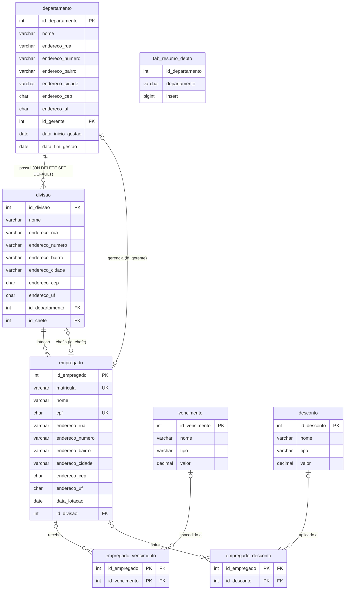

# Roteiro de Laboratorio - Folha do Aluno (SQL Server)

## Tema

Views analiticas, trigger de integridade e procedure de cadastro no schema `departamentos`.

## Objetivos da pratica

- Construir visoes agregadas de folha salarial.
- Aplicar regras de integridade com trigger.
- Automatizar cadastro com procedure.

## Preparacao do ambiente

### Diagrama do banco de dados — schema `departamentos`



> **Observacao sobre dependencias circulares:** `departamento` referencia `empregado` (gerente) e `empregado` referencia `divisao`, que referencia `departamento`. Por isso as FKs de `id_gerente` e `id_chefe` sao adicionadas via `ALTER TABLE` separado no script, apos todas as tabelas ja existirem.

---

1. Restaurar estrutura usando o arquivo `aulas/scripts_exemplos/sql_server/departamentos_bpk.sql`.
2. Restaurar dados usando o arquivo `aulas/scripts_exemplos/sql_server/departamentos_dados.sql`.
3. Conferir se as tabelas possuem dados.

Consulta de conferencia:

```sql
SELECT 'departamento' AS tabela, COUNT(*) AS qtd FROM departamentos.departamento
UNION ALL
SELECT 'divisao', COUNT(*) FROM departamentos.divisao
UNION ALL
SELECT 'empregado', COUNT(*) FROM departamentos.empregado
UNION ALL
SELECT 'empregado_vencimento', COUNT(*) FROM departamentos.empregado_vencimento
UNION ALL
SELECT 'empregado_desconto', COUNT(*) FROM departamentos.empregado_desconto;
```

---

## Questao 1 - View de salarios por departamento

### Enunciado

Crie uma view que apresente, por departamento:

- total de salarios brutos
- total de salarios liquidos
- media salarial liquida
- quantidade de empregados

### Passos sugeridos

1. Calcular total de vencimentos por empregado.
2. Calcular total de descontos por empregado.
3. Consolidar salario bruto e liquido por empregado usando o caminho `empregado -> divisao -> departamento`.
4. Agregar por departamento.

### Espaco para implementacao

```sql
CREATE OR ALTER VIEW departamentos.vw_salarios_departamento
AS
WITH venc_por_emp AS (
  
),
desc_por_emp AS (
  
),
salario_emp AS (
    SELECT
        e.id_empregado,
        dv.id_departamento,
        ISNULL(vpe.total_vencimentos, 0) AS salario_bruto,
        ISNULL(dpe.total_descontos, 0) AS total_descontos,
        ISNULL(vpe.total_vencimentos, 0) - ISNULL(dpe.total_descontos, 0) AS salario_liquido
    FROM departamentos.empregado e
    JOIN departamentos.divisao dv
      ON dv.id_divisao = e.id_divisao
    LEFT JOIN venc_por_emp vpe
      ON vpe.id_empregado = e.id_empregado
    LEFT JOIN desc_por_emp dpe
      ON dpe.id_empregado = e.id_empregado
)
SELECT
    d.id_departamento,
    d.nome AS departamento,
    ROUND(SUM(se.salario_bruto), 2) AS total_salario_bruto,
    ROUND(SUM(se.salario_liquido), 2) AS total_salario_liquido,
    ROUND(AVG(se.salario_liquido), 2) AS media_salarial,
    COUNT(*) AS quantidade_empregados
FROM salario_emp se
JOIN departamentos.departamento d
  ON d.id_departamento = se.id_departamento
GROUP BY d.id_departamento, d.nome;
GO
```

### Validacao

```sql
SELECT *
FROM departamentos.vw_salarios_departamento
ORDER BY id_departamento;
```

---

## Questao 2 - View de salarios por divisao

### Enunciado

Crie uma view que apresente, por divisao:

- total de salarios brutos
- total de salarios liquidos
- media salarial liquida
- quantidade de empregados

### Passos sugeridos

1. Reaproveitar a logica de calculo por empregado.
2. Alterar a agregacao para nivel de divisao.
3. Exibir tambem o id do departamento da divisao.

### Espaco para implementacao

```sql
CREATE OR ALTER VIEW departamentos.vw_salarios_divisao
AS
WITH venc_por_emp AS (
    -- TODO
),
desc_por_emp AS (
    -- TODO
),
salario_emp AS (
    -- TODO
)
SELECT
    -- TODO
FROM salario_emp se
JOIN departamentos.divisao dv
  ON dv.id_divisao = se.id_divisao
GROUP BY
    -- TODO
;
GO
```

### Validacao

```sql
SELECT *
FROM departamentos.vw_salarios_divisao
ORDER BY id_divisao;
```

---

## Questao 3 - Trigger de integridade

### Enunciado

Implemente uma regra para garantir que nao exista departamento sem divisao.

Sugestao:

- Ao inserir departamento, criar uma divisao default automaticamente.
- Ao remover (ou mover) a ultima divisao de um departamento, criar uma divisao default.

### Passos sugeridos

1. Criar trigger `AFTER INSERT` em `departamento`.
2. Criar trigger `AFTER DELETE, UPDATE` em `divisao`.

### Espaco para implementacao

```sql
CREATE OR ALTER TRIGGER departamentos.trg_departamento_cria_divisao_default
ON departamentos.departamento
AFTER INSERT
AS
BEGIN
    SET NOCOUNT ON;

    -- TODO
END;
GO
```

```sql
CREATE OR ALTER TRIGGER departamentos.trg_divisao_garante_minimo_uma_por_departamento
ON departamentos.divisao
AFTER DELETE, UPDATE
AS
BEGIN
    SET NOCOUNT ON;

    -- TODO
END;
GO
```

### Validacao

1. Inserir um novo departamento e verificar a divisao default.
2. Tentar excluir a unica divisao de um departamento e verificar se o trigger cria nova divisao.

---

## Questao 4 - Procedure de cadastro de empregado

### Enunciado

Crie uma procedure para inserir empregado e, automaticamente:

- vincular o vencimento minimo base (`Salario Base`)
- vincular o desconto de INSS (`Contribuicao INSS`)

### Passos sugeridos

1. Buscar o id do vencimento base.
2. Buscar o id do desconto INSS.
3. Inserir empregado.
4. Inserir vinculos em `empregado_vencimento` e `empregado_desconto`.

### Espaco para implementacao

```sql
CREATE OR ALTER PROCEDURE departamentos.prc_inserir_empregado_com_base_inss
    @p_matricula       VARCHAR(20),
    @p_nome            VARCHAR(150),
    @p_cpf             CHAR(11),
    @p_endereco_rua    VARCHAR(150),
    @p_endereco_numero VARCHAR(4),
    @p_endereco_bairro VARCHAR(100),
    @p_endereco_cidade VARCHAR(100),
    @p_endereco_cep    CHAR(8),
    @p_endereco_uf     CHAR(2),
    @p_id_divisao      INT,
    @p_data_lotacao    DATE = NULL
AS
BEGIN
    SET NOCOUNT ON;

    DECLARE @v_id_empregado INT;
    DECLARE @v_id_venc_base INT;
    DECLARE @v_id_desc_inss INT;

    -- TODO
END;
GO
```

### Validacao

```sql
EXEC departamentos.prc_inserir_empregado_com_base_inss
    @p_matricula = '008',
    @p_nome = 'Aluno Teste',
    @p_cpf = '88888888888',
    @p_endereco_rua = 'Rua H',
    @p_endereco_numero = '10',
    @p_endereco_bairro = 'Centro',
    @p_endereco_cidade = 'Cuite',
    @p_endereco_cep = '58043000',
    @p_endereco_uf = 'PB',
    @p_id_divisao = 1,
    @p_data_lotacao = CAST(GETDATE() AS DATE);
```

```sql
SELECT e.id_empregado, e.nome, e.matricula, v.nome AS vencimento, d.nome AS desconto
FROM departamentos.empregado e
LEFT JOIN departamentos.empregado_vencimento ev ON ev.id_empregado = e.id_empregado
LEFT JOIN departamentos.vencimento v ON v.id_vencimento = ev.id_vencimento
LEFT JOIN departamentos.empregado_desconto ed ON ed.id_empregado = e.id_empregado
LEFT JOIN departamentos.desconto d ON d.id_desconto = ed.id_desconto
WHERE e.matricula = '008';
```

---

## Entrega esperada

- Script com as duas views criadas.
- Script com os triggers criados.
- Script com a procedure criada.
- Evidencias de execucao das consultas de validacao.
