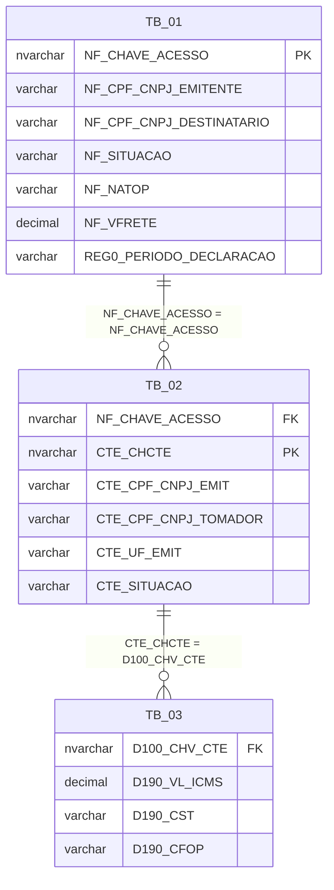
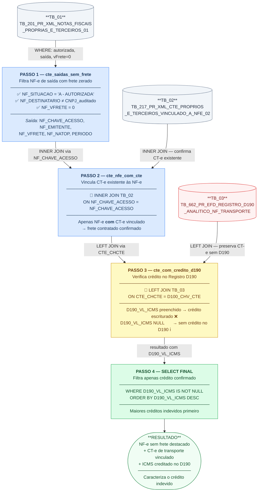

# Exercício de Análise 01 — Auditoria de Crédito Indevido de ICMS sobre Frete (EFD D190)

**Módulo:** Consultas e Subconsultas em T-SQL
**Tema:** Construção de Consultas Analíticas — Auditoria Fiscal de Documentos Fiscais
**SGBD:** Microsoft SQL Server (T-SQL) — Schema: `fisc`

---

### Contexto

A Escrituração Fiscal Digital (EFD) do contribuinte auditado contém o **Registro D190**, que registra o ICMS decorrente da contratação de serviço de transporte de cargas. Quando o frete é contratado na modalidade **CIF (Cost, Insurance and Freight)**, a responsabilidade pelo pagamento do frete é do **remetente/tomador** — ou seja, o próprio contribuinte emissor da NF-e.

Nessa modalidade, o valor do frete **deve estar destacado no campo `vFrete` da NF-e de saída**. Se o campo `NF_VFRETE` for **zero ou nulo** na NF-e, mas o contribuinte tiver escriturado crédito de ICMS sobre frete no Registro D190 (vinculado a um CT-e de terceiros), há **aproveitamento indevido de crédito** — pois o frete não foi destacado no documento fiscal que acobertou a saída da mercadoria.

---

## Objetivo do Exercício

Construir uma consulta SQL que identifique os casos em que o contribuinte auditado:

1. Emitiu **NF-e de saída** (modelo 55) para destinatários diferentes de si próprio, com **valor de frete zerado** (`NF_VFRETE = 0`);
2. Possui um **CT-e de terceiros** vinculado a essas NF-e (frete contratado, modalidade CIF);
3. Escriturou no **Registro D190 da EFD** um valor de ICMS sobre esse frete (`D190_VL_ICMS > 0`), caracterizando **crédito apropriado indevidamente**.

---

## Tabelas Utilizadas


| Alias   | Nome da Tabela                                                                         | Conteúdo                                                                                                                 |
| --------- | ---------------------------------------------------------------------------------------- | --------------------------------------------------------------------------------------------------------------------------- |
| `TB_01` | `fisc.TB_201_PR_XML_NOTAS_FISCAIS_PROPRIAS_E_TERCEIROS_01`                             | Documentos fiscais modelo 55 (NF-e) próprios e de terceiros — contém os campos da nota fiscal eletrônica              |
| `TB_02` | `fisc.TB_217_PR_XML_CTE_PROPRIOS_E_TERCEIROS_VINCULADO_A_NFE_02`                       | CT-e (modelo 57) próprios e de terceiros vinculados a NF-e — relaciona o CT-e à chave de acesso da NF-e correspondente |
| `TB_03` | `fisc.TB_662_PR_EFD_REGISTRO_D190_ANALITICO_NOTA_FISCAL_TRANSPORTE_CST_CFOP_ALIQ_ICMS` | Escrituração do Registro D190 da EFD — contém a chave do CT-e e o valor de ICMS sobre o frete escriturado             |

### Relacionamentos entre as tabelas



---

## Colunas Selecionadas


| Coluna                     | Tabela de Origem | Significado                                                                                   |
| ---------------------------- | ------------------ | ----------------------------------------------------------------------------------------------- |
| `REG0_PERIODO_DECLARACAO`  | TB_01            | Período de apuração da EFD (mês/ano de referência)                                       |
| `NF_CPF_CNPJ_EMITENTE`     | TB_01            | CNPJ do emitente da NF-e (o contribuinte auditado)                                            |
| `NF_SITUACAO`              | TB_01            | Situação da NF-e (filtrada para "A - AUTORIZADA DENTRO DO PRAZO")                           |
| `NF_CHAVE_ACESSO`          | TB_01            | Chave de acesso da NF-e (44 dígitos — chave única do documento)                            |
| `NF_CPF_CNPJ_DESTINATARIO` | TB_01            | CNPJ do destinatário da NF-e (usado para excluir operações de entrada)                     |
| `NF_NATOP`                 | TB_01            | Natureza da operação descrita na NF-e                                                       |
| `NF_VFRETE`                | TB_01            | Valor do frete destacado na NF-e (filtrado para`= 0`, evidenciando a ausência do destaque)   |
| `CTE_CHCTE`                | TB_02            | Chave de acesso do CT-e vinculado à NF-e                                                     |
| `D100_CHV_CTE`             | TB_03            | Chave do CT-e escriturado no Registro D100/D190 da EFD                                        |
| `D190_VL_ICMS`             | TB_03            | Valor do ICMS sobre o frete escriturado no Registro D190 (o crédito potencialmente indevido) |

---

## Exercício

Com base na descrição acima, escreva uma consulta T-SQL que:

1. Selecione as colunas listadas na tabela acima.
2. Una as três tabelas usando `RIGHT OUTER JOIN`, tendo `TB_01` como tabela principal.
3. Aplique os seguintes filtros no `WHERE`:
   - `NF_SITUACAO = 'A - AUTORIZADA DENTRO DO PRAZO'` — apenas notas autorizadas.
   - `NF_CPF_CNPJ_DESTINATARIO <> '<CNPJ_DO_CONTRIBUINTE>'` — excluir documentos de entrada (destinatário é o próprio contribuinte).z
   - `NF_VFRETE = 0` — frete não destacado na NF-e.
   - `CTE_CHCTE IS NOT NULL` — existe CT-e vinculado à NF-e.

---

## Gabarito

```sql
SELECT
    -- (1) Período de apuração: identifica o mês de referência da EFD do contribuinte
    fisc.TB_201_PR_XML_NOTAS_FISCAIS_PROPRIAS_E_TERCEIROS_01.REG0_PERIODO_DECLARACAO,

    -- (2) CNPJ do emitente: confirma que a nota é de emissão própria do auditado
    fisc.TB_201_PR_XML_NOTAS_FISCAIS_PROPRIAS_E_TERCEIROS_01.NF_CPF_CNPJ_EMITENTE,

    -- (3) Situação da NF-e: será filtrado para apenas notas autorizadas no WHERE
    fisc.TB_201_PR_XML_NOTAS_FISCAIS_PROPRIAS_E_TERCEIROS_01.NF_SITUACAO,

    -- (4) Chave de acesso da NF-e: identificador único do documento fiscal de saída
    fisc.TB_201_PR_XML_NOTAS_FISCAIS_PROPRIAS_E_TERCEIROS_01.NF_CHAVE_ACESSO,

    -- (5) CNPJ do destinatário: usado no WHERE para excluir operações de entrada
    --     (quando destinatário = auditado, é uma nota de entrada, não de saída)
    fisc.TB_201_PR_XML_NOTAS_FISCAIS_PROPRIAS_E_TERCEIROS_01.NF_CPF_CNPJ_DESTINATARIO,

    -- (6) Natureza da operação: evidencia o tipo de saída (venda, remessa, etc.)
    fisc.TB_201_PR_XML_NOTAS_FISCAIS_PROPRIAS_E_TERCEIROS_01.NF_NATOP,

    -- (7) Valor do frete na NF-e: será filtrado para = 0 no WHERE,
    --     provando que o frete não foi destacado no documento fiscal de saída
    fisc.TB_201_PR_XML_NOTAS_FISCAIS_PROPRIAS_E_TERCEIROS_01.NF_VFRETE,

    -- (8) Chave do CT-e (TB_02): confirma a existência do CT-e vinculado à NF-e
    --     Esse campo estará preenchido apenas se há CT-e relacionado a esta NF-e
    fisc.TB_217_PR_XML_CTE_PROPRIOS_E_TERCEIROS_VINCULADO_A_NFE_02.CTE_CHCTE,

    -- (9) Chave do CT-e na EFD (TB_03): confirma que esse CT-e foi escriturado no D190
    fisc.TB_662_PR_EFD_REGISTRO_D190_ANALITICO_NOTA_FISCAL_TRANSPORTE_CST_CFOP_ALIQ_ICMS.D100_CHV_CTE,

    -- (10) Valor do ICMS escriturado no D190: este é o valor do crédito potencialmente indevido
    --      Se > 0 e NF_VFRETE = 0, o contribuinte creditou ICMS de frete sem destaque na NF-e
    fisc.TB_662_PR_EFD_REGISTRO_D190_ANALITICO_NOTA_FISCAL_TRANSPORTE_CST_CFOP_ALIQ_ICMS.D190_VL_ICMS

FROM
    -- Tabela âncora (TB_03 — EFD D190): escrituração do crédito de ICMS sobre frete
    fisc.TB_662_PR_EFD_REGISTRO_D190_ANALITICO_NOTA_FISCAL_TRANSPORTE_CST_CFOP_ALIQ_ICMS

    -- 1º JOIN: TB_03 RIGHT OUTER JOIN TB_02
    -- RIGHT OUTER JOIN preserva todos os CT-e da TB_02, mesmo que não
    -- haja registro D190 correspondente na TB_03.
    -- Relacionamento: chave do CT-e (D100_CHV_CTE = CTE_CHCTE)
    RIGHT OUTER JOIN
        fisc.TB_217_PR_XML_CTE_PROPRIOS_E_TERCEIROS_VINCULADO_A_NFE_02
        ON fisc.TB_662_PR_EFD_REGISTRO_D190_ANALITICO_NOTA_FISCAL_TRANSPORTE_CST_CFOP_ALIQ_ICMS.D100_CHV_CTE
         = fisc.TB_217_PR_XML_CTE_PROPRIOS_E_TERCEIROS_VINCULADO_A_NFE_02.NF_CHAVE_ACESSO

    -- 2º JOIN: (TB_03 + TB_02) RIGHT OUTER JOIN TB_01
    -- RIGHT OUTER JOIN preserva todas as NF-e da TB_01 (tabela principal),
    -- mesmo que não haja CT-e vinculado ainda.
    -- Relacionamento: chave de acesso da NF-e (NF_CHAVE_ACESSO = NF_CHAVE_ACESSO)
    RIGHT OUTER JOIN
        fisc.TB_201_PR_XML_NOTAS_FISCAIS_PROPRIAS_E_TERCEIROS_01
        ON fisc.TB_217_PR_XML_CTE_PROPRIOS_E_TERCEIROS_VINCULADO_A_NFE_02.NF_CHAVE_ACESSO
         = fisc.TB_201_PR_XML_NOTAS_FISCAIS_PROPRIAS_E_TERCEIROS_01.NF_CHAVE_ACESSO

WHERE
    -- Filtro 1: exclui o próprio contribuinte auditado como destinatário
    -- Isso garante que só aparecem operações de SAÍDA (o auditado é o emitente,
    -- não o destinatário). CNPJ '02357659000206' = o contribuinte auditado.
    (fisc.TB_201_PR_XML_NOTAS_FISCAIS_PROPRIAS_E_TERCEIROS_01.NF_CPF_CNPJ_DESTINATARIO
        <> '02357659000206')

    -- Filtro 2: apenas NF-e autorizadas dentro do prazo
    -- Exclui notas canceladas, denegadas ou com outros status,
    -- garantindo que o crédito analisado corresponde a documentos válidos
    AND (fisc.TB_201_PR_XML_NOTAS_FISCAIS_PROPRIAS_E_TERCEIROS_01.NF_SITUACAO
        = 'A - AUTORIZADA DENTRO DO PRAZO')

    -- Filtro 3: valor do frete zerado na NF-e
    -- Esta é a condição central do crédito indevido:
    -- o frete existe (há CT-e), mas NÃO foi destacado no documento fiscal de saída
    AND (fisc.TB_201_PR_XML_NOTAS_FISCAIS_PROPRIAS_E_TERCEIROS_01.NF_VFRETE = 0)

    -- Filtro 4: CT-e vinculado à NF-e deve existir (não nulo)
    -- Garante que há efetivamente um serviço de transporte contratado
    -- e registrado via CT-e para esta NF-e, confirmando o frete CIF
    AND (fisc.TB_217_PR_XML_CTE_PROPRIOS_E_TERCEIROS_VINCULADO_A_NFE_02.CTE_CHCTE
        IS NOT NULL);
```

---

## Explicação da Estratégia dos `RIGHT OUTER JOIN`

A cadeia de `RIGHT OUTER JOIN` foi construída com **TB_01 como âncora final** (tabela mais à direita), porque o objetivo é listar **todas as NF-e de saída** e trazer — quando existirem — o CT-e vinculado e o registro D190 correspondente.

```
TB_03  RIGHT JOIN  TB_02  RIGHT JOIN  TB_01
 └── preserva tudo de TB_02    └── preserva tudo de TB_01
```

- Se uma NF-e não tiver CT-e vinculado → `CTE_CHCTE` vem `NULL` (filtrado no `WHERE`).
- Se um CT-e existir mas não tiver registro D190 → `D190_VL_ICMS` vem `NULL`.
- Ao final, o filtro `CTE_CHCTE IS NOT NULL` garante que só ficam NF-e **que possuem CT-e vinculado**, e os registros com `D190_VL_ICMS > 0` (ou `IS NOT NULL`) indicam o crédito escriturado.

> **Nota técnica:** a mesma lógica poderia ser reescrita com `TB_01` na cláusula `FROM` seguida de `LEFT OUTER JOIN` para TB_02 e TB_03, o que é considerado mais legível. Os `RIGHT OUTER JOIN` em cadeia são equivalentes, apenas escritos na ordem inversa.

---

## Resumo do Raciocínio de Auditoria


| Condição                          | Evidência Fiscal                                                             |
| ------------------------------------- | ------------------------------------------------------------------------------- |
| `NF_VFRETE = 0` na NF-e de saída   | O frete**não foi destacado** no documento que acobertou a saída             |
| `CTE_CHCTE IS NOT NULL`             | Há um CT-e confirmando que o frete**foi contratado e pago**                  |
| `D190_VL_ICMS` preenchido na EFD    | O contribuinte**creditou o ICMS** desse frete na sua escrituração           |
| Regime CIF (remetente paga o frete) | O contribuinte é o**responsável pelo frete** — deveria destacá-lo na NF-e |

A combinação dessas condições caracteriza o **crédito indevido**: há serviço de transporte, há escrituração de crédito, mas o frete não foi destacado no documento fiscal obrigatório — violando a condição para legitimidade do crédito conforme a legislação do ICMS.

---

## Construção Passo a Passo com CTEs

Esta seção reconstrói a mesma consulta final usando **CTEs (`WITH`)**, decompondo o problema em etapas nomeadas e testáveis individualmente. Cada bloco pode ser executado de forma isolada para validar seu resultado antes de avançar.

> **Por que usar CTE aqui?**
> A consulta original encadeia três tabelas com nomes longos em `RIGHT OUTER JOIN` sucessivos, misturando filtros de negócio diferentes em um único `WHERE`. Com CTEs, cada regra fica no bloco que lhe diz respeito — e o analista pode rodar cada `SELECT` de teste separadamente para confirmar o resultado parcial.

---

### Passo 1 — Isolar as NF-e de saída com frete zerado

Primeiro bloco: parte da TB_01 filtrando apenas NF-e autorizadas, cujo destinatário não é o próprio auditado e cujo valor de frete é zero — a condição central do crédito indevido.

```sql
WITH cte_saidas_sem_frete AS (
    SELECT
        nf.REG0_PERIODO_DECLARACAO,
        nf.NF_CPF_CNPJ_EMITENTE,
        nf.NF_CHAVE_ACESSO,
        nf.NF_CPF_CNPJ_DESTINATARIO,
        nf.NF_SITUACAO,
        nf.NF_NATOP,
        nf.NF_VFRETE
    FROM fisc.TB_201_PR_XML_NOTAS_FISCAIS_PROPRIAS_E_TERCEIROS_01 AS nf
    WHERE nf.NF_SITUACAO             = 'A - AUTORIZADA DENTRO DO PRAZO'
      AND nf.NF_CPF_CNPJ_DESTINATARIO <> '02357659000206'  -- exclui entradas
      AND nf.NF_VFRETE                = 0                  -- frete não destacado
)
-- Teste isolado: quantas NF-e de saída têm frete zerado?
SELECT COUNT(*) AS qtd_nfe_sem_frete FROM cte_saidas_sem_frete;
```

**O que este passo produz:** o universo de NF-e de saída válidas onde o valor do frete não foi informado — base para investigar se há CT-e e crédito de ICMS associados.

---

### Passo 2 — Vincular os CT-e existentes a essas NF-e

Segundo bloco: acumula o Passo 1 e junta os CT-e da TB_02 que estejam vinculados às NF-e identificadas. Usa `INNER JOIN` aqui para trazer apenas NF-e que **de fato possuem CT-e** — o `IS NOT NULL` do gabarito original é substituído pela semântica do `INNER JOIN`.

```sql
WITH cte_saidas_sem_frete AS (
    SELECT
        nf.REG0_PERIODO_DECLARACAO,
        nf.NF_CPF_CNPJ_EMITENTE,
        nf.NF_CHAVE_ACESSO,
        nf.NF_CPF_CNPJ_DESTINATARIO,
        nf.NF_SITUACAO,
        nf.NF_NATOP,
        nf.NF_VFRETE
    FROM fisc.TB_201_PR_XML_NOTAS_FISCAIS_PROPRIAS_E_TERCEIROS_01 AS nf
    WHERE nf.NF_SITUACAO             = 'A - AUTORIZADA DENTRO DO PRAZO'
      AND nf.NF_CPF_CNPJ_DESTINATARIO <> '02357659000206'
      AND nf.NF_VFRETE                = 0
),
cte_nfe_com_cte AS (
    SELECT
        sf.REG0_PERIODO_DECLARACAO,
        sf.NF_CPF_CNPJ_EMITENTE,
        sf.NF_CHAVE_ACESSO,
        sf.NF_CPF_CNPJ_DESTINATARIO,
        sf.NF_NATOP,
        sf.NF_VFRETE,
        ct.CTE_CHCTE              -- chave do CT-e: confirma existência do frete contratado
    FROM cte_saidas_sem_frete AS sf
    -- INNER JOIN: apenas NF-e que possuem CT-e vinculado
    INNER JOIN fisc.TB_217_PR_XML_CTE_PROPRIOS_E_TERCEIROS_VINCULADO_A_NFE_02 AS ct
        ON ct.NF_CHAVE_ACESSO = sf.NF_CHAVE_ACESSO
)
-- Teste isolado: NF-e sem frete destacado que possuem CT-e de transporte
SELECT COUNT(*) AS qtd_nfe_com_cte FROM cte_nfe_com_cte;
```

**O que este passo produz:** NF-e de saída com frete zerado **mas** com CT-e de transporte vinculado — evidência de que o frete existiu, foi contratado, mas não foi informado na nota.

---

### Passo 3 — Verificar o crédito escriturado no Registro D190

Terceiro bloco: cruza os CT-e do Passo 2 com a TB_03 (EFD D190) para identificar quais tiveram ICMS creditado na escrituração. O `LEFT JOIN` preserva CT-e sem registro D190 — o `D190_VL_ICMS` virá `NULL` nesses casos.

```sql
WITH cte_saidas_sem_frete AS (
    SELECT
        nf.REG0_PERIODO_DECLARACAO,
        nf.NF_CPF_CNPJ_EMITENTE,
        nf.NF_CHAVE_ACESSO,
        nf.NF_CPF_CNPJ_DESTINATARIO,
        nf.NF_NATOP,
        nf.NF_VFRETE
    FROM fisc.TB_201_PR_XML_NOTAS_FISCAIS_PROPRIAS_E_TERCEIROS_01 AS nf
    WHERE nf.NF_SITUACAO             = 'A - AUTORIZADA DENTRO DO PRAZO'
      AND nf.NF_CPF_CNPJ_DESTINATARIO <> '02357659000206'
      AND nf.NF_VFRETE                = 0
),
cte_nfe_com_cte AS (
    SELECT
        sf.REG0_PERIODO_DECLARACAO,
        sf.NF_CPF_CNPJ_EMITENTE,
        sf.NF_CHAVE_ACESSO,
        sf.NF_CPF_CNPJ_DESTINATARIO,
        sf.NF_NATOP,
        sf.NF_VFRETE,
        ct.CTE_CHCTE
    FROM cte_saidas_sem_frete AS sf
    INNER JOIN fisc.TB_217_PR_XML_CTE_PROPRIOS_E_TERCEIROS_VINCULADO_A_NFE_02 AS ct
        ON ct.NF_CHAVE_ACESSO = sf.NF_CHAVE_ACESSO
),
cte_com_credito_d190 AS (
    SELECT
        nc.REG0_PERIODO_DECLARACAO,
        nc.NF_CPF_CNPJ_EMITENTE,
        nc.NF_CHAVE_ACESSO,
        nc.NF_CPF_CNPJ_DESTINATARIO,
        nc.NF_NATOP,
        nc.NF_VFRETE,
        nc.CTE_CHCTE,
        d190.D100_CHV_CTE,
        d190.D190_VL_ICMS      -- valor do crédito escriturado (NULL = sem crédito no D190)
    FROM cte_nfe_com_cte AS nc
    -- LEFT JOIN: mantém todos os CT-e, mesmo sem registro D190
    LEFT JOIN fisc.TB_662_PR_EFD_REGISTRO_D190_ANALITICO_NOTA_FISCAL_TRANSPORTE_CST_CFOP_ALIQ_ICMS AS d190
        ON d190.D100_CHV_CTE = nc.CTE_CHCTE
)
-- Teste isolado: distribuição por situação de crédito no D190
SELECT
    CASE
        WHEN D190_VL_ICMS IS NULL THEN 'SEM crédito no D190'
        WHEN D190_VL_ICMS  > 0   THEN 'COM crédito indevido no D190'
        ELSE 'D190 zerado'
    END AS situacao_credito,
    COUNT(*) AS qtd
FROM cte_com_credito_d190
GROUP BY
    CASE
        WHEN D190_VL_ICMS IS NULL THEN 'SEM crédito no D190'
        WHEN D190_VL_ICMS  > 0   THEN 'COM crédito indevido no D190'
        ELSE 'D190 zerado'
    END;
```

**O que este passo produz:** a visão completa do problema — CT-e existente, frete não destacado na NF-e e, para os registros com `D190_VL_ICMS > 0`, o crédito de ICMS que foi apropriado sem o respectivo destaque no documento fiscal.

---

### Passo 4 — Consulta Final com CTEs (versão completa)

Todos os blocos reunidos. A consulta final filtra apenas os registros com crédito efetivamente escriturado no D190 (`D190_VL_ICMS IS NOT NULL`), ordenando pelo maior valor de crédito indevido.

```sql
WITH
-- Bloco 1: NF-e de saída autorizadas com frete não destacado
cte_saidas_sem_frete AS (
    SELECT
        nf.REG0_PERIODO_DECLARACAO,
        nf.NF_CPF_CNPJ_EMITENTE,
        nf.NF_CHAVE_ACESSO,
        nf.NF_CPF_CNPJ_DESTINATARIO,
        nf.NF_NATOP,
        nf.NF_VFRETE
    FROM fisc.TB_201_PR_XML_NOTAS_FISCAIS_PROPRIAS_E_TERCEIROS_01 AS nf
    WHERE nf.NF_SITUACAO             = 'A - AUTORIZADA DENTRO DO PRAZO'
      AND nf.NF_CPF_CNPJ_DESTINATARIO <> '02357659000206'
      AND nf.NF_VFRETE                = 0
),
-- Bloco 2: vincula o CT-e existente a cada NF-e de saída sem frete
cte_nfe_com_cte AS (
    SELECT
        sf.REG0_PERIODO_DECLARACAO,
        sf.NF_CPF_CNPJ_EMITENTE,
        sf.NF_CHAVE_ACESSO,
        sf.NF_CPF_CNPJ_DESTINATARIO,
        sf.NF_NATOP,
        sf.NF_VFRETE,
        ct.CTE_CHCTE
    FROM cte_saidas_sem_frete AS sf
    INNER JOIN fisc.TB_217_PR_XML_CTE_PROPRIOS_E_TERCEIROS_VINCULADO_A_NFE_02 AS ct
        ON ct.NF_CHAVE_ACESSO = sf.NF_CHAVE_ACESSO
),
-- Bloco 3: cruza CT-e com EFD D190 para identificar o crédito escriturado
cte_com_credito_d190 AS (
    SELECT
        nc.REG0_PERIODO_DECLARACAO,
        nc.NF_CPF_CNPJ_EMITENTE,
        nc.NF_CHAVE_ACESSO,
        nc.NF_CPF_CNPJ_DESTINATARIO,
        nc.NF_NATOP,
        nc.NF_VFRETE,
        nc.CTE_CHCTE,
        d190.D100_CHV_CTE,
        d190.D190_VL_ICMS
    FROM cte_nfe_com_cte AS nc
    LEFT JOIN fisc.TB_662_PR_EFD_REGISTRO_D190_ANALITICO_NOTA_FISCAL_TRANSPORTE_CST_CFOP_ALIQ_ICMS AS d190
        ON d190.D100_CHV_CTE = nc.CTE_CHCTE
)
-- Consulta final: apenas os casos com crédito indevido confirmado no D190
SELECT
    REG0_PERIODO_DECLARACAO,
    NF_CPF_CNPJ_EMITENTE,
    NF_CHAVE_ACESSO,
    NF_CPF_CNPJ_DESTINATARIO,
    NF_NATOP,
    NF_VFRETE,
    CTE_CHCTE,
    D100_CHV_CTE,
    D190_VL_ICMS
FROM cte_com_credito_d190
WHERE D190_VL_ICMS IS NOT NULL   -- apenas onde há crédito escriturado
ORDER BY D190_VL_ICMS DESC;      -- maiores créditos indevidos primeiro
```

---

### Diagrama de construção por blocos



---

### Comparativo: versão original × versão CTE


| Aspecto                       | Versão original (`RIGHT OUTER JOIN` encadeados)        | Versão com CTEs                                                                      |
| ------------------------------- | --------------------------------------------------------- | --------------------------------------------------------------------------------------- |
| **Testabilidade**             | Só é possível testar a consulta inteira              | Cada CTE pode ser executada isoladamente para validação                             |
| **Legibilidade**              | Nomes de tabela de 60+ caracteres repetidos em cada`ON` | Aliases curtos (`sf`, `nc`, `d190`) definidos uma vez no bloco                        |
| **Transparência da lógica** | Filtros de negócio misturados no`WHERE` único         | Cada regra de negócio está no bloco CTE que lhe corresponde                         |
| **Tipo de JOIN**              | `RIGHT OUTER JOIN` em cadeia — menos intuitivo         | `INNER JOIN` e `LEFT JOIN` a partir da tabela principal — sentido natural de leitura |
| **Desempenho**                | O otimizador gera plano equivalente                     | O otimizador geralmente gera o mesmo plano; CTEs não materializam dados              |
| **Depuração**               | Difícil isolar qual JOIN produz linhas inesperadas     | Executa-se o`SELECT` de cada CTE separadamente para inspecionar o resultado parcial   |
