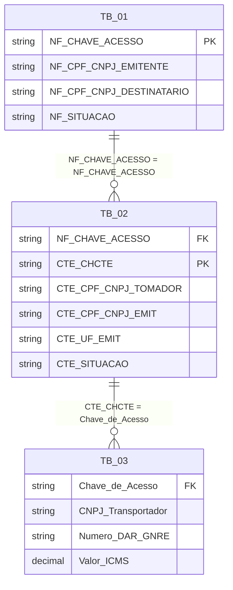
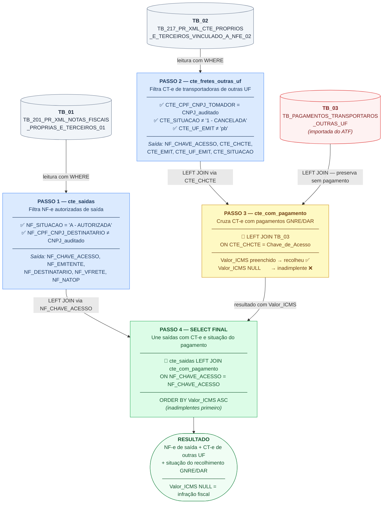

# Exercício de Análise 02 — Auditoria de Recolhimento de ICMS sobre Frete por Transportadoras de Outras UF

**Módulo:** Consultas e Subconsultas em T-SQL
**Tema:** Construção de Consultas Analíticas — Auditoria Fiscal de Documentos Fiscais
**SGBD:** Microsoft SQL Server (T-SQL) — Schema: `fisc`

---

## Contexto

Quando uma transportadora **estabelecida em outra Unidade da Federação (UF)** realiza a prestação de serviço de transporte cujo **início ocorre no estado da Paraíba**, o ICMS sobre o frete é devido **ao estado da Paraíba**. Nesse caso, a transportadora deve recolher o imposto mediante **GNRE (Guia Nacional de Recolhimento de Tributos Estaduais)** ou **DAR**, antes de iniciar a prestação.

O contribuinte auditado figura como **tomador/remetente** do serviço de transporte — ou seja, contratou e pagou o frete (modalidade CIF). Cabe à auditoria fiscal verificar se as transportadoras de outras UF que prestaram serviço a este contribuinte **efetivamente recolheram o ICMS à Paraíba**.

Esta consulta cruza os CT-e emitidos por transportadoras de outras UF vinculados às NF-e de saída do contribuinte auditado com a tabela de pagamentos (GNRE/DAR) importada do ATF, identificando os casos em que o **ICMS sobre o frete não foi recolhido**.

---

## Objetivo do Exercício

Construir uma consulta SQL que:

1. Relacione as **NF-e de saída** do contribuinte auditado (TB_01) com os **CT-e emitidos por transportadoras de outras UF** que têm o auditado como tomador (TB_02);
2. Traga os **pagamentos de GNRE/DAR** realizados pelas transportadoras em relação a esses CT-e (TB_03), importada do sistema ATF;
3. Permita identificar CT-e **sem pagamento correspondente** (`Valor_ICMS` nulo), evidenciando o não recolhimento do ICMS à Paraíba.

---

## Tabelas Utilizadas


| Alias   | Nome da Tabela                                                   | Origem          | Conteúdo                                                                                                                                 |
| --------- | ------------------------------------------------------------------ | ----------------- | ------------------------------------------------------------------------------------------------------------------------------------------- |
| `TB_01` | `fisc.TB_201_PR_XML_NOTAS_FISCAIS_PROPRIAS_E_TERCEIROS_01`       | BDFISC          | NF-e (modelo 55) próprias e de terceiros — documentos fiscais de saída do contribuinte                                                 |
| `TB_02` | `fisc.TB_217_PR_XML_CTE_PROPRIOS_E_TERCEIROS_VINCULADO_A_NFE_02` | BDFISC          | CT-e (modelo 57) vinculados a NF-e — inclui UF do emitente e CNPJ do tomador                                                             |
| `TB_03` | `fisc.TB_PAGAMENTOS_TRANSPORTAROS_OUTRAS_UF`                     | ATF (importada) | Pagamentos de GNRE/DAR das transportadoras — contém CNPJ do transportador, número do DAR/GNRE, chave do CT-e e valor de ICMS recolhido |

### Estrutura mínima exigida para a TB_03 (importada do ATF)


| Coluna                  | Conteúdo                                                      |
| ------------------------- | ---------------------------------------------------------------- |
| CNPJ do transportador   | Identificação da transportadora que efetuou o recolhimento   |
| Número do DAR/GNRE     | Número do documento de arrecadação                          |
| Chave de acesso do CT-e | Vincula o pagamento ao CT-e correspondente (`Chave_de_Acesso`) |
| Valor do ICMS recolhido | Valor principal recolhido ao estado (`Valor_ICMS`)             |

### Relacionamentos entre as tabelas

```
TB_01 (NF-e de saída)
  └── NF_CHAVE_ACESSO ──── NF_CHAVE_ACESSO ──── TB_02 (CT-e de transportadoras outras UF)
                                                   └── CTE_CHCTE ──── Chave_de_Acesso ──── TB_03 (Pagamentos GNRE/DAR)
```



---

## Colunas Selecionadas


| Coluna                     | Tabela | Significado                                                                                    |
| ---------------------------- | -------- | ------------------------------------------------------------------------------------------------ |
| `NF_CPF_CNPJ_EMITENTE`     | TB_01  | CNPJ do emitente da NF-e — confirma que é o contribuinte auditado emitindo a nota de saída  |
| `CTE_CPF_CNPJ_TOMADOR`     | TB_02  | CNPJ do tomador do serviço de transporte — deve coincidir com o CNPJ do auditado (frete CIF) |
| `NF_SITUACAO`              | TB_01  | Situação da NF-e — filtrada para notas autorizadas                                          |
| `NF_CHAVE_ACESSO`          | TB_01  | Chave de acesso da NF-e de saída (44 dígitos)                                                |
| `NF_CPF_CNPJ_DESTINATARIO` | TB_01  | CNPJ do destinatário — usado para excluir documentos de entrada                              |
| `CTE_CPF_CNPJ_EMIT`        | TB_02  | CNPJ da transportadora emitente do CT-e (de outra UF)                                          |
| `CTE_UF_EMIT`              | TB_02  | UF da transportadora emitente — filtrada para`<> 'PB'`, confirmando que é de outra UF        |
| `CTE_CHCTE`                | TB_02  | Chave de acesso do CT-e — chave de relacionamento com a tabela de pagamentos (TB_03)          |
| `CTE_SITUACAO`             | TB_02  | Situação do CT-e — filtrada para excluir cancelados                                         |
| `Valor_ICMS`               | TB_03  | Valor do ICMS recolhido via GNRE/DAR —`NULL` indica ausência de recolhimento                 |

---

## Filtros da Consulta


| Filtro                                           | Tabela | Valor            | Finalidade                                                                              |
| -------------------------------------------------- | -------- | ------------------ | ----------------------------------------------------------------------------------------- |
| `NF_CPF_CNPJ_DESTINATARIO <> '02357659000125'`   | TB_01  | CNPJ do auditado | Exclui entradas — quando o auditado é o destinatário, é uma compra, não uma saída |
| `NF_SITUACAO = 'A - AUTORIZADA DENTRO DO PRAZO'` | TB_01  | —               | Apenas notas fiscalmente válidas                                                       |
| `CTE_CPF_CNPJ_TOMADOR = '02357659000125'`        | TB_02  | CNPJ do auditado | Garante que o auditado é o contratante do frete (tomador CIF)                          |
| `CTE_SITUACAO <> '1 - CANCELADA'`                | TB_02  | —               | Exclui CT-e cancelados — documentos sem validade fiscal                                |
| `CTE_UF_EMIT <> 'pb'`                            | TB_02  | —               | Restringe a transportadoras de**outras UF** — estas devem recolher ICMS à PB via GNRE |

---

## Exercício

Com base na descrição acima, escreva uma consulta T-SQL que:

1. Selecione as colunas listadas na tabela **Colunas Selecionadas**.
2. Una as três tabelas observando a seguinte lógica de `JOIN`:
   - **TB_02 LEFT OUTER JOIN TB_03**: preserva todos os CT-e de transportadoras de outras UF, mesmo que não haja pagamento de GNRE — exatamente os casos de não recolhimento que queremos identificar.
   - **(TB_02 + TB_03) RIGHT OUTER JOIN TB_01**: preserva todas as NF-e de saída, mesmo que não haja CT-e vinculado.
3. Aplique os filtros da tabela acima no `WHERE`.

---

## Gabarito

```sql
SELECT
    -- (1) CNPJ do emitente da NF-e: confirma a identidade do contribuinte auditado
    --     como responsável pelas operações de saída analisadas
    fisc.TB_201_PR_XML_NOTAS_FISCAIS_PROPRIAS_E_TERCEIROS_01.NF_CPF_CNPJ_EMITENTE,

    -- (2) CNPJ do tomador do CT-e: deve ser igual ao CNPJ do auditado (filtrado no WHERE)
    --     confirma que o auditado contratou o frete (modalidade CIF)
    fisc.TB_217_PR_XML_CTE_PROPRIOS_E_TERCEIROS_VINCULADO_A_NFE_02.CTE_CPF_CNPJ_TOMADOR,

    -- (3) Situação da NF-e: filtrada no WHERE para apenas autorizadas
    fisc.TB_201_PR_XML_NOTAS_FISCAIS_PROPRIAS_E_TERCEIROS_01.NF_SITUACAO,

    -- (4) Chave de acesso da NF-e: identificador único do documento fiscal de saída,
    --     é o campo de ligação entre TB_01 e TB_02
    fisc.TB_201_PR_XML_NOTAS_FISCAIS_PROPRIAS_E_TERCEIROS_01.NF_CHAVE_ACESSO,

    -- (5) CNPJ do destinatário da NF-e: usado no WHERE para excluir entradas
    --     (quando destinatário = auditado, é uma nota de entrada, não de saída)
    fisc.TB_201_PR_XML_NOTAS_FISCAIS_PROPRIAS_E_TERCEIROS_01.NF_CPF_CNPJ_DESTINATARIO,

    -- (6) CNPJ da transportadora emitente do CT-e: identifica qual empresa de transporte
    --     prestou o serviço — utilizada para localizar a transportadora inadimplente
    fisc.TB_217_PR_XML_CTE_PROPRIOS_E_TERCEIROS_VINCULADO_A_NFE_02.CTE_CPF_CNPJ_EMIT,

    -- (7) UF da transportadora: filtrada no WHERE para <> 'pb'
    --     Transportadoras de outras UF com início de prestação na PB
    --     são obrigadas a recolher ICMS à Paraíba via GNRE
    fisc.TB_217_PR_XML_CTE_PROPRIOS_E_TERCEIROS_VINCULADO_A_NFE_02.CTE_UF_EMIT,

    -- (8) Chave de acesso do CT-e: identificador único do conhecimento de transporte,
    --     é o campo de ligação entre TB_02 e TB_03 (pagamentos GNRE/DAR)
    fisc.TB_217_PR_XML_CTE_PROPRIOS_E_TERCEIROS_VINCULADO_A_NFE_02.CTE_CHCTE,

    -- (9) Situação do CT-e: filtrada no WHERE para excluir cancelados
    fisc.TB_217_PR_XML_CTE_PROPRIOS_E_TERCEIROS_VINCULADO_A_NFE_02.CTE_SITUACAO,

    -- (10) Valor do ICMS recolhido via GNRE/DAR (TB_03, importada do ATF)
    --      NULL indica ausência de pagamento — evidência do não recolhimento à PB
    fisc.TB_PAGAMENTOS_TRANSPORTAROS_OUTRAS_UF.Valor_ICMS

FROM
    -- Tabela âncora do primeiro JOIN: TB_02 (CT-e vinculados às NF-e de saída)
    fisc.TB_217_PR_XML_CTE_PROPRIOS_E_TERCEIROS_VINCULADO_A_NFE_02

    -- 1º JOIN: TB_02 LEFT OUTER JOIN TB_03
    -- LEFT OUTER JOIN preserva TODOS os CT-e de TB_02, mesmo que NÃO haja
    -- pagamento de GNRE/DAR correspondente na TB_03.
    -- Isso é essencial: os CT-e sem pagamento (Valor_ICMS = NULL) são
    -- exatamente os casos de não recolhimento que a auditoria quer identificar.
    -- Relacionamento: chave do CT-e (CTE_CHCTE = Chave_de_Acesso)
    LEFT OUTER JOIN
        fisc.TB_PAGAMENTOS_TRANSPORTAROS_OUTRAS_UF
        ON fisc.TB_217_PR_XML_CTE_PROPRIOS_E_TERCEIROS_VINCULADO_A_NFE_02.CTE_CHCTE
         = fisc.TB_PAGAMENTOS_TRANSPORTAROS_OUTRAS_UF.Chave_de_Acesso

    -- 2º JOIN: (TB_02 + TB_03) RIGHT OUTER JOIN TB_01
    -- RIGHT OUTER JOIN preserva TODAS as NF-e de TB_01 (tabela principal de saídas),
    -- mesmo que não haja CT-e vinculado a elas.
    -- Relacionamento: chave de acesso da NF-e (NF_CHAVE_ACESSO = NF_CHAVE_ACESSO)
    RIGHT OUTER JOIN
        fisc.TB_201_PR_XML_NOTAS_FISCAIS_PROPRIAS_E_TERCEIROS_01
        ON fisc.TB_217_PR_XML_CTE_PROPRIOS_E_TERCEIROS_VINCULADO_A_NFE_02.NF_CHAVE_ACESSO
         = fisc.TB_201_PR_XML_NOTAS_FISCAIS_PROPRIAS_E_TERCEIROS_01.NF_CHAVE_ACESSO

WHERE
    -- Filtro 1: exclui o próprio contribuinte como destinatário
    -- Garante que só aparecem NF-e de SAÍDA — quando o auditado
    -- é o destinatário, trata-se de uma nota de entrada (compra), não de saída
    (fisc.TB_201_PR_XML_NOTAS_FISCAIS_PROPRIAS_E_TERCEIROS_01.NF_CPF_CNPJ_DESTINATARIO
        <> '02357659000125')

    -- Filtro 2: apenas NF-e autorizadas dentro do prazo
    -- Exclui notas canceladas, denegadas ou inutilizadas,
    -- trabalhando somente com documentos com validade jurídica
    AND (fisc.TB_201_PR_XML_NOTAS_FISCAIS_PROPRIAS_E_TERCEIROS_01.NF_SITUACAO
        = 'A - AUTORIZADA DENTRO DO PRAZO')

    -- Filtro 3: o tomador do CT-e deve ser o próprio contribuinte auditado
    -- Garante que o auditado contratou o frete (é o responsável pelo frete CIF),
    -- excluindo fretes contratados por terceiros não relacionados à auditoria
    AND (fisc.TB_217_PR_XML_CTE_PROPRIOS_E_TERCEIROS_VINCULADO_A_NFE_02.CTE_CPF_CNPJ_TOMADOR
        = N'02357659000125')

    -- Filtro 4: exclui CT-e cancelados
    -- CT-e cancelados não têm efeito fiscal — incluí-los distorceria
    -- a análise de obrigação de recolhimento
    AND (fisc.TB_217_PR_XML_CTE_PROPRIOS_E_TERCEIROS_VINCULADO_A_NFE_02.CTE_SITUACAO
        <> '1 - CANCELADA')

    -- Filtro 5: apenas transportadoras de UF diferente da Paraíba
    -- Transportadoras sediadas na PB recolhem pelo regime normal de apuração do ICMS;
    -- as de outras UF, com início de prestação na PB, devem recolher via GNRE
    AND (fisc.TB_217_PR_XML_CTE_PROPRIOS_E_TERCEIROS_VINCULADO_A_NFE_02.CTE_UF_EMIT
        <> N'pb');
```

---

## Explicação da Estratégia dos JOINs

A cadeia de JOINs combina dois tipos distintos, cada um com papel específico na análise:

```
TB_02  LEFT JOIN  TB_03        →  preserva todos os CT-e, com ou sem pagamento
  (resultado)  RIGHT JOIN  TB_01  →  preserva todas as NF-e de saída
```

### Por que `LEFT OUTER JOIN` entre TB_02 e TB_03?

O `LEFT OUTER JOIN` é a peça central da auditoria: ao preservar todos os CT-e mesmo quando não há pagamento correspondente na TB_03, os registros com `Valor_ICMS = NULL` **identificam diretamente as transportadoras que não recolheram o ICMS à Paraíba**. Um `INNER JOIN` aqui eliminaria exatamente esses casos — o oposto do objetivo.

### Por que `RIGHT OUTER JOIN` entre (TB_02 + TB_03) e TB_01?

O `RIGHT OUTER JOIN` garante que o resultado parta de **todas as NF-e de saída** do contribuinte. NF-e sem CT-e vinculado aparecem com as colunas de TB_02 e TB_03 como `NULL`, permitindo que o analista visualize o universo completo de saídas e identifique também as operações sem frete contratado via CT-e.

> **Nota técnica:** a mesma lógica pode ser reescrita iniciando o `FROM` com `TB_01`, usando `LEFT OUTER JOIN TB_02` e depois `LEFT OUTER JOIN TB_03`. Essa forma é geralmente mais legível:
>
> ```sql
> FROM fisc.TB_201_... AS tb01
> LEFT JOIN fisc.TB_217_... AS tb02 ON tb02.NF_CHAVE_ACESSO = tb01.NF_CHAVE_ACESSO
> LEFT JOIN fisc.TB_PAGAMENTOS_... AS tb03 ON tb03.Chave_de_Acesso = tb02.CTE_CHCTE
> ```

---

## Resumo do Raciocínio de Auditoria


| Condição verificada                         | Evidência fiscal                                                                                                     |
| ----------------------------------------------- | ----------------------------------------------------------------------------------------------------------------------- |
| `CTE_UF_EMIT <> 'pb'`                         | A transportadora é de**outra UF** — obrigada a recolher ICMS à PB via GNRE quando a prestação inicia na Paraíba |
| `CTE_CPF_CNPJ_TOMADOR = CNPJ_auditado`        | O contribuinte auditado é o**tomador/remetente** — contratou e pagou o frete (CIF)                                  |
| `CTE_SITUACAO <> 'CANCELADA'`                 | O CT-e tem**validade fiscal** — a prestação de serviço ocorreu                                                    |
| `Valor_ICMS IS NULL` (resultado do LEFT JOIN) | A transportadora**não efetuou o recolhimento** do ICMS à Paraíba para este CT-e                                    |
| `NF_VFRETE` (campo disponível em TB_01)      | Pode ser cruzado para confirmar o**valor do frete** destacado na NF-e de saída                                       |

A combinação dessas condições caracteriza a **infração**: a transportadora de outra UF prestou serviço de transporte com início na Paraíba, o contribuinte auditado foi o tomador, o CT-e é válido — mas não há GNRE/DAR correspondente na tabela de pagamentos, indicando que o **ICMS não foi recolhido ao estado da Paraíba**.

---

## Construção Passo a Passo com CTEs

Esta seção reconstrói a mesma consulta final usando **CTEs (`WITH`)**, decompondo o problema em etapas nomeadas e independentes. O objetivo é mostrar como chegar à consulta complexa a partir de blocos simples e verificáveis individualmente.

> **Por que usar CTE aqui?**
> A consulta original mistura filtros, JOINs e lógica de negócio em uma única instrução. Com CTEs, cada etapa pode ser testada isoladamente — o analista valida o resultado de cada bloco antes de avançar para o próximo, reduzindo erros e facilitando a manutenção.

---

### Passo 1 — Isolar as NF-e de saída válidas

Primeiro bloco: filtra apenas as NF-e autorizadas cujo destinatário **não é** o próprio contribuinte auditado (saídas).

```sql
WITH cte_saidas AS (
    SELECT
        nf.NF_CPF_CNPJ_EMITENTE,
        nf.NF_CHAVE_ACESSO,
        nf.NF_CPF_CNPJ_DESTINATARIO,
        nf.NF_SITUACAO,
        nf.NF_NATOP,
        nf.NF_VFRETE
    FROM fisc.TB_201_PR_XML_NOTAS_FISCAIS_PROPRIAS_E_TERCEIROS_01 AS nf
    WHERE nf.NF_SITUACAO        = 'A - AUTORIZADA DENTRO DO PRAZO'
      AND nf.NF_CPF_CNPJ_DESTINATARIO <> '02357659000125'  -- exclui entradas
)
-- Teste isolado: verificar quantas NF-e de saída válidas existem
SELECT COUNT(*) AS qtd_saidas FROM cte_saidas;
```

**O que este passo produz:** o universo de NF-e de saída autorizadas do contribuinte auditado — a base de todas as análises seguintes.

---

### Passo 2 — Isolar os CT-e de transportadoras de outras UF

Segundo bloco: filtra CT-e válidos emitidos por transportadoras de UF diferente da PB, cujo tomador é o contribuinte auditado.

```sql
WITH cte_saidas AS (
    SELECT
        nf.NF_CPF_CNPJ_EMITENTE,
        nf.NF_CHAVE_ACESSO,
        nf.NF_CPF_CNPJ_DESTINATARIO,
        nf.NF_SITUACAO,
        nf.NF_NATOP,
        nf.NF_VFRETE
    FROM fisc.TB_201_PR_XML_NOTAS_FISCAIS_PROPRIAS_E_TERCEIROS_01 AS nf
    WHERE nf.NF_SITUACAO             = 'A - AUTORIZADA DENTRO DO PRAZO'
      AND nf.NF_CPF_CNPJ_DESTINATARIO <> '02357659000125'
),
cte_fretes_outras_uf AS (
    SELECT
        ct.NF_CHAVE_ACESSO,       -- chave da NF-e à qual o CT-e está vinculado
        ct.CTE_CHCTE,             -- chave do próprio CT-e
        ct.CTE_CPF_CNPJ_EMIT,     -- CNPJ da transportadora
        ct.CTE_UF_EMIT,           -- UF da transportadora (filtrada <> 'pb')
        ct.CTE_CPF_CNPJ_TOMADOR,  -- deve ser o auditado
        ct.CTE_SITUACAO
    FROM fisc.TB_217_PR_XML_CTE_PROPRIOS_E_TERCEIROS_VINCULADO_A_NFE_02 AS ct
    WHERE ct.CTE_CPF_CNPJ_TOMADOR = N'02357659000125'  -- auditado é o tomador (CIF)
      AND ct.CTE_SITUACAO        <> '1 - CANCELADA'    -- exclui cancelados
      AND ct.CTE_UF_EMIT         <> N'pb'              -- apenas outras UF
)
-- Teste isolado: quantos CT-e de outras UF estão vinculados ao contribuinte?
SELECT COUNT(*) AS qtd_cte_outras_uf FROM cte_fretes_outras_uf;
```

**O que este passo produz:** apenas os CT-e de transportadoras de outras UF que têm obrigação de recolher ICMS à Paraíba via GNRE.

---

### Passo 3 — Cruzar CT-e com os pagamentos de GNRE/DAR

Terceiro bloco: traz os pagamentos (quando existirem) para cada CT-e identificado no passo anterior. O `LEFT JOIN` preserva CT-e sem pagamento — os inadimplentes.

```sql
WITH cte_saidas AS (
    SELECT
        nf.NF_CPF_CNPJ_EMITENTE,
        nf.NF_CHAVE_ACESSO,
        nf.NF_CPF_CNPJ_DESTINATARIO,
        nf.NF_SITUACAO,
        nf.NF_NATOP,
        nf.NF_VFRETE
    FROM fisc.TB_201_PR_XML_NOTAS_FISCAIS_PROPRIAS_E_TERCEIROS_01 AS nf
    WHERE nf.NF_SITUACAO             = 'A - AUTORIZADA DENTRO DO PRAZO'
      AND nf.NF_CPF_CNPJ_DESTINATARIO <> '02357659000125'
),
cte_fretes_outras_uf AS (
    SELECT
        ct.NF_CHAVE_ACESSO,
        ct.CTE_CHCTE,
        ct.CTE_CPF_CNPJ_EMIT,
        ct.CTE_UF_EMIT,
        ct.CTE_CPF_CNPJ_TOMADOR,
        ct.CTE_SITUACAO
    FROM fisc.TB_217_PR_XML_CTE_PROPRIOS_E_TERCEIROS_VINCULADO_A_NFE_02 AS ct
    WHERE ct.CTE_CPF_CNPJ_TOMADOR = N'02357659000125'
      AND ct.CTE_SITUACAO        <> '1 - CANCELADA'
      AND ct.CTE_UF_EMIT         <> N'pb'
),
cte_com_pagamento AS (
    SELECT
        fr.NF_CHAVE_ACESSO,
        fr.CTE_CHCTE,
        fr.CTE_CPF_CNPJ_EMIT,
        fr.CTE_UF_EMIT,
        fr.CTE_CPF_CNPJ_TOMADOR,
        fr.CTE_SITUACAO,
        pg.Valor_ICMS             -- NULL quando não há pagamento correspondente
    FROM cte_fretes_outras_uf AS fr
    -- LEFT JOIN: mantém todos os CT-e, mesmo sem GNRE/DAR
    LEFT JOIN fisc.TB_PAGAMENTOS_TRANSPORTAROS_OUTRAS_UF AS pg
        ON pg.Chave_de_Acesso = fr.CTE_CHCTE
)
-- Teste isolado: quantos CT-e têm pagamento e quantos não têm?
SELECT
    CASE WHEN Valor_ICMS IS NULL THEN 'SEM PAGAMENTO' ELSE 'COM PAGAMENTO' END AS status_gnre,
    COUNT(*) AS qtd
FROM cte_com_pagamento
GROUP BY CASE WHEN Valor_ICMS IS NULL THEN 'SEM PAGAMENTO' ELSE 'COM PAGAMENTO' END;
```

**O que este passo produz:** todos os CT-e de outras UF com o campo `Valor_ICMS` preenchido (recolheu) ou `NULL` (não recolheu). O agrupamento do teste revela de imediato a dimensão do problema.

---

### Passo 4 — Consulta Final com CTEs (versão completa)

Todos os blocos anteriores são combinados na consulta final. A CTE `cte_saidas` é unida ao resultado de `cte_com_pagamento` para compor o relatório completo com os dados da NF-e e do CT-e lado a lado.

```sql
WITH
-- Bloco 1: NF-e de saída autorizadas do contribuinte auditado
cte_saidas AS (
    SELECT
        nf.NF_CPF_CNPJ_EMITENTE,
        nf.NF_CHAVE_ACESSO,
        nf.NF_CPF_CNPJ_DESTINATARIO,
        nf.NF_SITUACAO,
        nf.NF_NATOP,
        nf.NF_VFRETE
    FROM fisc.TB_201_PR_XML_NOTAS_FISCAIS_PROPRIAS_E_TERCEIROS_01 AS nf
    WHERE nf.NF_SITUACAO             = 'A - AUTORIZADA DENTRO DO PRAZO'
      AND nf.NF_CPF_CNPJ_DESTINATARIO <> '02357659000125'
),
-- Bloco 2: CT-e de transportadoras de outras UF com o auditado como tomador
cte_fretes_outras_uf AS (
    SELECT
        ct.NF_CHAVE_ACESSO,
        ct.CTE_CHCTE,
        ct.CTE_CPF_CNPJ_EMIT,
        ct.CTE_UF_EMIT,
        ct.CTE_CPF_CNPJ_TOMADOR,
        ct.CTE_SITUACAO
    FROM fisc.TB_217_PR_XML_CTE_PROPRIOS_E_TERCEIROS_VINCULADO_A_NFE_02 AS ct
    WHERE ct.CTE_CPF_CNPJ_TOMADOR = N'02357659000125'
      AND ct.CTE_SITUACAO        <> '1 - CANCELADA'
      AND ct.CTE_UF_EMIT         <> N'pb'
),
-- Bloco 3: CT-e cruzados com pagamentos GNRE/DAR (LEFT JOIN preserva inadimplentes)
cte_com_pagamento AS (
    SELECT
        fr.NF_CHAVE_ACESSO,
        fr.CTE_CHCTE,
        fr.CTE_CPF_CNPJ_EMIT,
        fr.CTE_UF_EMIT,
        fr.CTE_CPF_CNPJ_TOMADOR,
        fr.CTE_SITUACAO,
        pg.Valor_ICMS
    FROM cte_fretes_outras_uf AS fr
    LEFT JOIN fisc.TB_PAGAMENTOS_TRANSPORTAROS_OUTRAS_UF AS pg
        ON pg.Chave_de_Acesso = fr.CTE_CHCTE
)
-- Consulta final: une NF-e de saída com CT-e e situação de pagamento
SELECT
    s.NF_CPF_CNPJ_EMITENTE,
    s.NF_SITUACAO,
    s.NF_CHAVE_ACESSO,
    s.NF_CPF_CNPJ_DESTINATARIO,
    s.NF_NATOP,
    s.NF_VFRETE,
    cp.CTE_CPF_CNPJ_TOMADOR,
    cp.CTE_CPF_CNPJ_EMIT,
    cp.CTE_UF_EMIT,
    cp.CTE_CHCTE,
    cp.CTE_SITUACAO,
    cp.Valor_ICMS
FROM cte_saidas AS s
-- LEFT JOIN: preserva NF-e de saída mesmo sem CT-e de outras UF vinculado
LEFT JOIN cte_com_pagamento AS cp
    ON cp.NF_CHAVE_ACESSO = s.NF_CHAVE_ACESSO
ORDER BY
    -- CT-e sem pagamento aparecem primeiro (prioridade de auditoria)
    cp.Valor_ICMS ASC,
    s.NF_CHAVE_ACESSO;
```

---

### Diagrama de construção por blocos



### Comparativo: versão original × versão CTE


| Aspecto           | Versão original (JOINs encadeados)                              | Versão com CTEs                                                                    |
| ------------------- | ------------------------------------------------------------------ | ------------------------------------------------------------------------------------- |
| **Testabilidade** | Só é possível testar a consulta inteira                       | Cada CTE pode ser executada isoladamente para validação                           |
| **Legibilidade**  | Nomes de tabela longos repetidos em cada`ON`                     | Aliases curtos (`s`, `fr`, `cp`) definidos uma vez                                  |
| **Manutenção**  | Alterar um filtro exige localizar a condição no meio dos JOINs | Cada regra de negócio está no bloco nomeado correspondente                        |
| **Desempenho**    | O otimizador gera plano equivalente                              | O otimizador geralmente gera o mesmo plano; CTEs não criam tabelas temporárias    |
| **Depuração**   | Difícil isolar qual JOIN está produzindo linhas inesperadas    | Executa-se o`SELECT` de cada CTE separadamente para inspecionar o resultado parcial |
