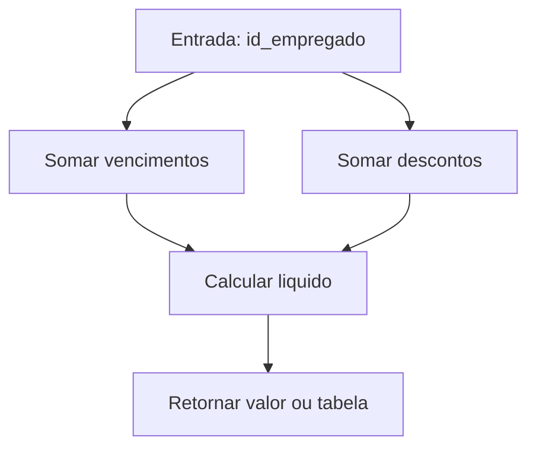
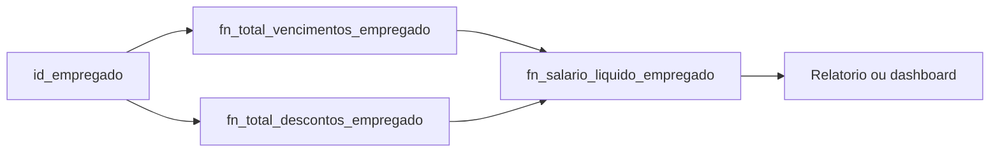

# Apostila Completa - Functions SQL

## Curso de Banco de Dados Relacional

**Modulo:** Programacao no Banco (Functions)  
**SGBDs abordados:** PostgreSQL e SQL Server  
**Base pratica usada nesta apostila:** banco Aulas, schema departamentos

---

## Sumario

1. O que e uma function
2. Quando usar function
3. Function x Stored Procedure x Trigger
4. PostgreSQL x SQL Server
5. Modelo de dados dos exemplos
6. Functions em PostgreSQL
7. Functions em SQL Server
8. Caso principal: calcular remuneracao liquida do empregado
9. Boas praticas
10. Erros comuns
11. Roteiro de laboratorio
12. Exercicios propostos

---

## 1. O que e uma function

Function e um objeto de banco que recebe parametros, executa uma logica SQL e retorna um valor, uma linha, ou um conjunto de linhas.

Tipos mais comuns:

1. Scalar function: retorna um unico valor.
2. Table-valued function: retorna uma tabela.

Uso tipico:

1. Encapsular calculos de negocio.
2. Padronizar validacoes reutilizaveis.
3. Evitar repeticao de expressoes longas em consultas.

---

## 2. Quando usar function

### Use function quando

1. O calculo e reutilizado em varios relatorios.
2. A regra e deterministica e focada em retorno de dados.
3. Voce precisa de uma API SQL reutilizavel para consultas.

### Evite function quando

1. A rotina faz processo transacional complexo com varios INSERT/UPDATE/DELETE e regras de fluxo.
2. O objetivo principal e orquestrar operacoes (nesse caso, prefira procedure).

---

## 3. Function x Stored Procedure x Trigger

| Recurso | Retorno | Disparo | Melhor uso |
|---|---|---|---|
| Function | Valor/tabela | Chamada explicita em SQL | Calculo e consulta reutilizavel |
| Stored Procedure | Output/result sets | Chamada explicita via CALL/EXEC | Processo de negocio transacional |
| Trigger | Sem chamada direta | Evento DML (INSERT/UPDATE/DELETE) | Reacao automatica a evento de dados |

Resumo:

1. Function responde pergunta.
2. Procedure executa processo.
3. Trigger vigia evento.

---

## 4. PostgreSQL x SQL Server

| Tema | PostgreSQL | SQL Server |
|---|---|---|
| Criacao | CREATE FUNCTION | CREATE FUNCTION |
| Linguagem | SQL ou plpgsql | T-SQL |
| Retorno escalar | RETURNS tipo | RETURNS tipo |
| Retorno tabela | RETURNS TABLE (...) | RETURNS TABLE (inline ou multi-statement) |
| Chamada em SELECT | Direta | Direta |
| Fluxo condicional | IF/CASE em plpgsql | IF/CASE em T-SQL |

---

## 5. Modelo de dados dos exemplos

Tabelas usadas:

1. departamentos.empregado
2. departamentos.vencimento
3. departamentos.desconto
4. departamentos.empregado_vencimento
5. departamentos.empregado_desconto

Objetivo funcional dos exemplos:

1. Calcular total de vencimentos por empregado.
2. Calcular total de descontos por empregado.
3. Calcular salario liquido.
4. Retornar ficha funcional consolidada.
5. Verificar se o empregado possui vencimento Salario Minimo.

---

## 6. Functions em PostgreSQL

### Exemplo 1 - total de vencimentos por empregado

**Contexto:** relatorios de folha precisam somar rapidamente proventos do empregado.

**Regra aplicada:** somar todos os valores de vencimento vinculados ao empregado.

```sql
CREATE OR REPLACE FUNCTION departamentos.fn_total_vencimentos_empregado(
	p_id_empregado INT
)
RETURNS NUMERIC(12,2)
LANGUAGE plpgsql
AS $$
DECLARE
	v_total NUMERIC(12,2);
BEGIN
	SELECT COALESCE(SUM(v.valor), 0)
	  INTO v_total
	  FROM departamentos.empregado_vencimento ev
	  JOIN departamentos.vencimento v
		ON v.id_vencimento = ev.id_vencimento
	 WHERE ev.id_empregado = p_id_empregado;

	RETURN v_total;
END;
$$;
```

### Exemplo 2 - total de descontos por empregado

**Contexto:** o liquido depende do total de descontos ativos.

**Regra aplicada:** somar todos os descontos vinculados ao empregado.

```sql
CREATE OR REPLACE FUNCTION departamentos.fn_total_descontos_empregado(
	p_id_empregado INT
)
RETURNS NUMERIC(12,2)
LANGUAGE plpgsql
AS $$
DECLARE
	v_total NUMERIC(12,2);
BEGIN
	SELECT COALESCE(SUM(d.valor), 0)
	  INTO v_total
	  FROM departamentos.empregado_desconto ed
	  JOIN departamentos.desconto d
		ON d.id_desconto = ed.id_desconto
	 WHERE ed.id_empregado = p_id_empregado;

	RETURN v_total;
END;
$$;
```

### Exemplo 3 - salario liquido do empregado (funcao principal)

**Contexto:** varias consultas precisam do mesmo calculo liquido e o ideal e evitar repeticao de SQL.

**Regra aplicada:** liquido = total_vencimentos - total_descontos.

```sql
CREATE OR REPLACE FUNCTION departamentos.fn_salario_liquido_empregado(
	p_id_empregado INT
)
RETURNS NUMERIC(12,2)
LANGUAGE plpgsql
AS $$
DECLARE
	v_total_venc NUMERIC(12,2);
	v_total_desc NUMERIC(12,2);
BEGIN
	v_total_venc := departamentos.fn_total_vencimentos_empregado(p_id_empregado);
	v_total_desc := departamentos.fn_total_descontos_empregado(p_id_empregado);

	RETURN v_total_venc - v_total_desc;
END;
$$;
```

### Exemplo 4 - ficha financeira (table function)

**Contexto:** dashboards de RH precisam de uma visao unica por empregado.

**Regra aplicada:** retornar nome e totais ja calculados.

```sql
CREATE OR REPLACE FUNCTION departamentos.fn_ficha_financeira_empregado(
	p_id_empregado INT
)
RETURNS TABLE (
	id_empregado INT,
	nome VARCHAR,
	total_vencimentos NUMERIC(12,2),
	total_descontos NUMERIC(12,2),
	salario_liquido NUMERIC(12,2)
)
LANGUAGE sql
AS $$
	SELECT
		e.id_empregado,
		e.nome,
		departamentos.fn_total_vencimentos_empregado(e.id_empregado) AS total_vencimentos,
		departamentos.fn_total_descontos_empregado(e.id_empregado) AS total_descontos,
		departamentos.fn_salario_liquido_empregado(e.id_empregado) AS salario_liquido
	FROM departamentos.empregado e
	WHERE e.id_empregado = p_id_empregado;
$$;
```

### Exemplo 5 - verificar vencimento Salario Minimo

**Contexto:** regra de conformidade da folha exige confirmar se o empregado possui o vencimento obrigatorio.

**Regra aplicada:** retornar true quando houver vinculo a um vencimento com nome Salario Minimo.

```sql
CREATE OR REPLACE FUNCTION departamentos.fn_empregado_tem_salario_minimo(
	p_id_empregado INT
)
RETURNS BOOLEAN
LANGUAGE sql
AS $$
	SELECT EXISTS (
		SELECT 1
		FROM departamentos.empregado_vencimento ev
		JOIN departamentos.vencimento v
		  ON v.id_vencimento = ev.id_vencimento
		WHERE ev.id_empregado = p_id_empregado
		  AND v.nome = 'Salario Minimo'
	);
$$;
```

### Chamadas de uso (PostgreSQL)

```sql
SELECT departamentos.fn_total_vencimentos_empregado(1);
SELECT departamentos.fn_total_descontos_empregado(1);
SELECT departamentos.fn_salario_liquido_empregado(1);
SELECT * FROM departamentos.fn_ficha_financeira_empregado(1);
SELECT departamentos.fn_empregado_tem_salario_minimo(1);
```

Fluxo geral das funcoes de calculo:



---

## 7. Functions em SQL Server

### Exemplo 1 - total de vencimentos (scalar)

```sql
CREATE OR ALTER FUNCTION departamentos.fn_total_vencimentos_empregado (
	@id_empregado INT
)
RETURNS DECIMAL(12,2)
AS
BEGIN
	DECLARE @total DECIMAL(12,2);

	SELECT @total = ISNULL(SUM(v.valor), 0)
	FROM departamentos.empregado_vencimento ev
	JOIN departamentos.vencimento v
	  ON v.id_vencimento = ev.id_vencimento
	WHERE ev.id_empregado = @id_empregado;

	RETURN ISNULL(@total, 0);
END;
GO
```

### Exemplo 2 - total de descontos (scalar)

```sql
CREATE OR ALTER FUNCTION departamentos.fn_total_descontos_empregado (
	@id_empregado INT
)
RETURNS DECIMAL(12,2)
AS
BEGIN
	DECLARE @total DECIMAL(12,2);

	SELECT @total = ISNULL(SUM(d.valor), 0)
	FROM departamentos.empregado_desconto ed
	JOIN departamentos.desconto d
	  ON d.id_desconto = ed.id_desconto
	WHERE ed.id_empregado = @id_empregado;

	RETURN ISNULL(@total, 0);
END;
GO
```

### Exemplo 3 - salario liquido (scalar principal)

```sql
CREATE OR ALTER FUNCTION departamentos.fn_salario_liquido_empregado (
	@id_empregado INT
)
RETURNS DECIMAL(12,2)
AS
BEGIN
	DECLARE @venc DECIMAL(12,2);
	DECLARE @desc DECIMAL(12,2);

	SET @venc = departamentos.fn_total_vencimentos_empregado(@id_empregado);
	SET @desc = departamentos.fn_total_descontos_empregado(@id_empregado);

	RETURN ISNULL(@venc, 0) - ISNULL(@desc, 0);
END;
GO
```

### Exemplo 4 - ficha financeira (inline TVF)

```sql
CREATE OR ALTER FUNCTION departamentos.fn_ficha_financeira_empregado (
	@id_empregado INT
)
RETURNS TABLE
AS
RETURN
(
	SELECT
		e.id_empregado,
		e.nome,
		departamentos.fn_total_vencimentos_empregado(e.id_empregado) AS total_vencimentos,
		departamentos.fn_total_descontos_empregado(e.id_empregado) AS total_descontos,
		departamentos.fn_salario_liquido_empregado(e.id_empregado) AS salario_liquido
	FROM departamentos.empregado e
	WHERE e.id_empregado = @id_empregado
);
GO
```

### Exemplo 5 - verificar vencimento Salario Minimo

```sql
CREATE OR ALTER FUNCTION departamentos.fn_empregado_tem_salario_minimo (
	@id_empregado INT
)
RETURNS BIT
AS
BEGIN
	DECLARE @tem BIT = 0;

	IF EXISTS (
		SELECT 1
		FROM departamentos.empregado_vencimento ev
		JOIN departamentos.vencimento v
		  ON v.id_vencimento = ev.id_vencimento
		WHERE ev.id_empregado = @id_empregado
		  AND v.nome = 'Salario Minimo'
	)
		SET @tem = 1;

	RETURN @tem;
END;
GO
```

### Chamadas de uso (SQL Server)

```sql
SELECT departamentos.fn_total_vencimentos_empregado(1) AS total_venc;
SELECT departamentos.fn_total_descontos_empregado(1) AS total_desc;
SELECT departamentos.fn_salario_liquido_empregado(1) AS salario_liquido;
SELECT * FROM departamentos.fn_ficha_financeira_empregado(1);
SELECT departamentos.fn_empregado_tem_salario_minimo(1) AS tem_salario_minimo;
```

---

## 8. Caso principal: calcular remuneracao liquida do empregado

### Contexto

Nos relatorios de RH, o valor liquido e utilizado em varias consultas. Sem function, o mesmo bloco de join e soma tende a ser repetido, aumentando risco de erro.

### Situacao que dispara o uso

1. Painel de folha por empregado.
2. Consulta de conferencias para auditoria interna.
3. Integracao com relatorio gerencial mensal.

### Regra aplicada

1. Vencimentos somam creditos.
2. Descontos somam debitos.
3. Liquido e a diferenca entre eles.

Diagrama da solucao:



---

## 9. Boas praticas

1. Nomeie funcoes por dominio e intencao de negocio.
2. Retorne tipos precisos, especialmente em valores monetarios.
3. Use COALESCE/ISNULL para evitar null indesejado em calculo.
4. Evite logica procedural excessiva dentro de function simples.
5. Documente parametros e regra de retorno.
6. Mantenha funcoes pequenas e compostas, como feito nos exemplos.

---

## 10. Erros comuns

1. Colocar regra com efeito colateral em function de consulta.
2. Ignorar null e quebrar o calculo final.
3. Duplicar a mesma logica em consultas sem encapsular.
4. Nao testar com empregado sem vencimentos ou sem descontos.
5. Retornar tipo inadequado para valores financeiros.

---

## 11. Roteiro de laboratorio

### Objetivo

Implementar e validar um conjunto de functions para consulta financeira do empregado.

### Etapas

1. Criar function de total de vencimentos.
2. Criar function de total de descontos.
3. Criar function de salario liquido usando as duas anteriores.
4. Criar table function de ficha financeira.
5. Criar function booleana para verificar Salario Minimo.

### Testes minimos

1. Empregado com vencimentos e descontos.
2. Empregado sem descontos.
3. Empregado sem vencimentos.
4. Empregado com/sem vencimento Salario Minimo.

### Evidencias

1. Scripts executados.
2. Resultados de SELECT para cada function.
3. Comentario sobre comportamento em casos limite.

---

## 12. Exercicios propostos

1. Criar function para retornar percentual de descontos sobre vencimentos.
2. Criar function para listar todos os empregados com salario liquido abaixo de um valor limite.
3. Criar function para validar se o empregado possui pelo menos 2 vencimentos ativos.
4. Criar function que retorne um status textual: SEM_VENCIMENTO, SOMENTE_BASE, COMPLETO.
5. Adaptar os exemplos para aceitar filtro por divisao.

---

## Encerramento

Functions SQL sao essenciais para padronizar calculos e transformar regras de negocio em componentes reutilizaveis no banco. No dominio desta apostila, elas reduzem duplicacao, aumentam consistencia de relatorios e melhoram a manutencao do modelo de folha do schema departamentos.

