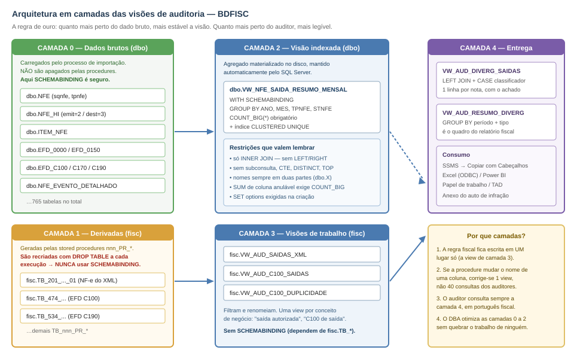
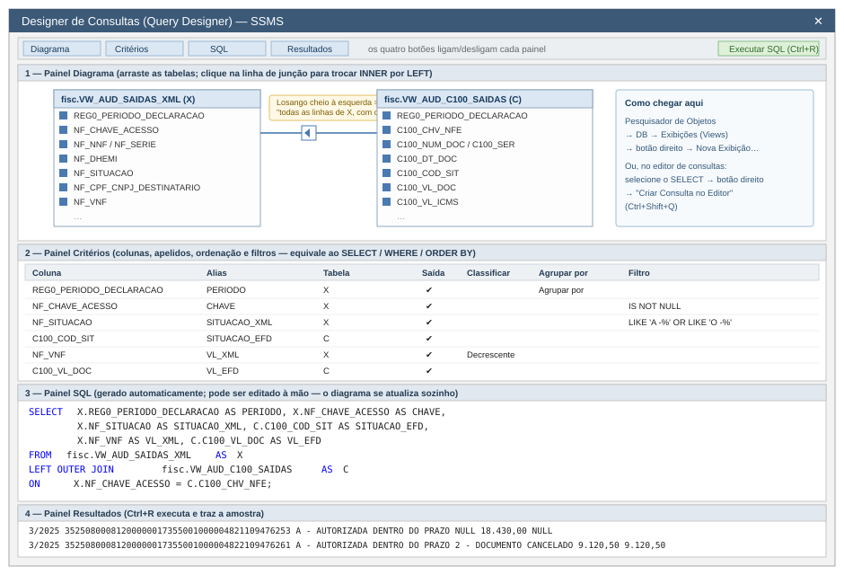
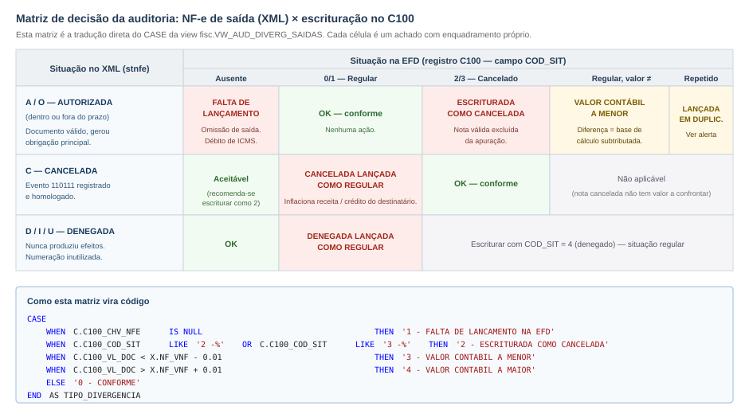
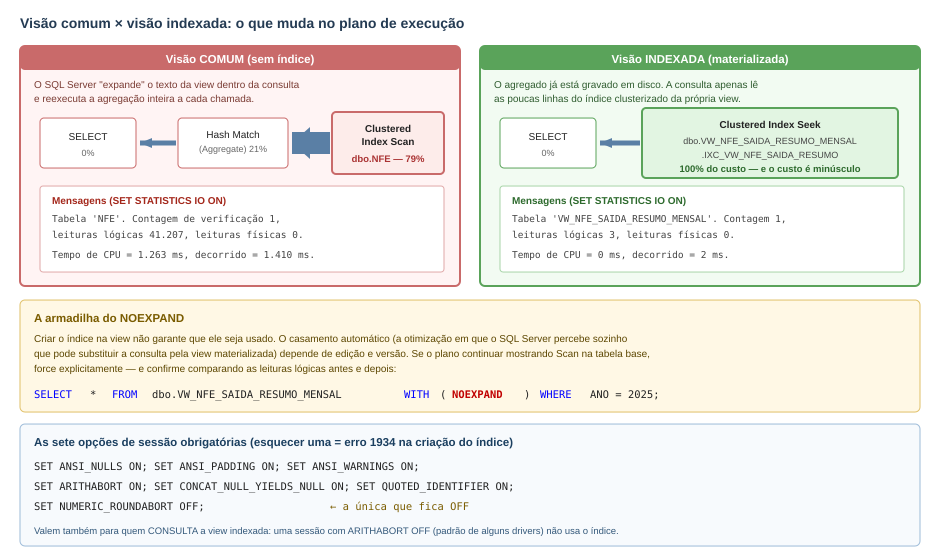

# Módulo 3 — Construção de Visões para Auditoria Fiscal

## Roteiro guiado de 2 horas no SQL Server Management Studio

### Base de trabalho: BDFISC — auditoria de saídas (NF-e × EFD registro C100)

---

## 1. Objetivo e produto final da oficina

Ao final de duas horas o auditor terá construído, com as próprias mãos, um **conjunto de visões (views) reutilizáveis** que responde a uma pergunta concreta de fiscalização:

> *"Todas as notas fiscais de saída (emissão própria) que o contribuinte emitiu e teve autorizadas foram escrituradas na EFD, pelo valor correto, e sem terem sido indevidamente marcadas como canceladas?"*

O produto final é uma consulta única, `fisc.VW_AUD_DIVERG_SAIDAS`, que devolve **uma linha por nota fiscal com o achado já classificado**, e um resumo por período pronto para virar quadro do relatório de auditoria.

O que se aprende no caminho:


| Competência                                                         | Onde é exercitada |
| ---------------------------------------------------------------------- | -------------------- |
| Reconhecer a estrutura do BDFISC (dados brutos × tabelas derivadas) | Etapa 0            |
| Construir views no**Designer de Consultas** do SSMS                  | Etapas 1 e 2       |
| Traduzir uma regra fiscal em`LEFT JOIN` + `CASE`                     | Etapa 3            |
| Consolidar achados em quadro gerencial                               | Etapa 4            |
| Proteger views com`WITH SCHEMABINDING`                               | Etapa 5            |
| Materializar agregados com**view indexada**                          | Etapa 6            |
| Criar índices de apoio e**medir** o ganho                           | Etapa 7            |
| Exportar o papel de trabalho                                         | Etapa 8            |

### Cronograma sugerido


| Horário       | Etapa                                                                   | Duração |
| ---------------- | ------------------------------------------------------------------------- | ----------- |
| 00:00 – 00:15 | **Etapa 0** — Reconhecimento da base                                   | 15 min    |
| 00:15 – 00:35 | **Etapa 1** — Primeira view no Designer de Consultas (saídas do XML)  | 20 min    |
| 00:35 – 00:50 | **Etapa 2** — View da escrituração (C100)                            | 15 min    |
| 00:50 – 01:15 | **Etapa 3** — View de divergência (o coração da auditoria)          | 25 min    |
| 01:15 – 01:25 | **Etapa 4** — View de resumo por período                              | 10 min    |
| 01:25 – 01:35 | **Etapa 5** — `WITH SCHEMABINDING`: o que protege e onde **não** usar | 10 min    |
| 01:35 – 01:50 | **Etapa 6** — View indexada de controle                                | 15 min    |
| 01:50 – 02:00 | **Etapa 7 e 8** — Índices de apoio, medição e exportação          | 10 min    |

### Pré-requisitos

- SSMS 20 ou superior conectado à instância que hospeda o banco da auditoria;
- o banco da auditoria **já restaurado e com as procedures `nnn_PR_*` executadas** (as tabelas `fisc.TB_*` precisam existir e estar populadas);
- permissão para criar objetos no schema `fisc` (`CREATE VIEW`, `ALTER SCHEMA::fisc`). Se você só tiver leitura, peça ao DBA a criação de um schema próprio (ex.: `aud`) e substitua `fisc.` por `aud.` em todos os scripts.

> **Convenção desta apostila:** cada banco corresponde a **um contribuinte auditado** (o nome do banco carrega a inscrição estadual e as datas da carga). Por isso nenhuma view filtra por CNPJ — o recorte por contribuinte já está dado pela escolha do banco.

---

## 2. Etapa 0 — Reconhecimento da base (15 min)

### 2.1 As duas naturezas de tabela no BDFISC

O BDFISC tem cerca de **765 tabelas** e **199 stored procedures**, distribuídas em dois schemas com papéis completamente diferentes. Entender essa divisão é o que separa um auditor que sabe usar a base de um que fica perdido nela.



*Figura 1 — As camadas do BDFISC e onde cada tipo de view se encaixa.*


|                | Schema`dbo` — **dados brutos**                                 | Schema`fisc` — **tabelas derivadas**                                        |
| ---------------- | ----------------------------------------------------------------- | ------------------------------------------------------------------------------ |
| Origem         | Importação dos XML de NF-e/CT-e e dos arquivos da EFD         | Geradas pelas procedures`dbo.nnn_PR_*`                                       |
| Nomes          | `NFE`, `ITEM_NFE`, `EFD_C100`, `EFD_C170`, `EFD_E110`…         | `TB_201_PR_...`, `TB_474_PR_...`, `TB_137_PR_...`                            |
| Formato        | Normalizado, colunas técnicas (`sqnfe`, `stnfe`, `tpoperacao`) | Achatado, colunas em "português fiscal" (`NF_CHAVE_ACESSO`, `C100_COD_SIT`) |
| Estabilidade   | Permanentes                                                     | **Apagadas e recriadas (`DROP TABLE`) a cada execução da procedure**       |
| Uso na oficina | Base da view indexada (Etapa 6)                                 | Base das views de trabalho (Etapas 1 a 4)                                    |

Essa última linha é a mais importante e vai reaparecer na Etapa 5.

### 2.2 Passo a passo

**Passo 0.1 — Localizar as tabelas do tema.** Abra uma nova consulta (Ctrl+N) e execute:

```sql
-- Quais tabelas derivadas existem, e quantas linhas cada uma tem?
SELECT
    s.name                                       AS esquema,
    t.name                                       AS tabela,
    p.rows                                       AS linhas,
    CAST(SUM(a.total_pages) * 8 / 1024.0 AS DECIMAL(12,2)) AS tamanho_mb
FROM sys.tables            AS t
JOIN sys.schemas           AS s  ON s.schema_id  = t.schema_id
JOIN sys.indexes           AS ix ON ix.object_id = t.object_id
JOIN sys.partitions        AS p  ON p.object_id  = t.object_id AND p.index_id = ix.index_id
JOIN sys.allocation_units  AS a  ON a.container_id = p.partition_id
WHERE ix.index_id <= 1
  AND (t.name LIKE 'TB_201%' OR t.name LIKE 'TB_474%' OR t.name IN ('NFE','EFD_C100','NFE_HI','EFD_0000'))
GROUP BY s.name, t.name, p.rows
ORDER BY linhas DESC;
```

**Passo 0.2 — Confirmar o período e o contribuinte auditados.**

```sql
-- Quem é o contribuinte e quais períodos foram entregues?
SELECT
    z.nrinscrestadual  AS inscricao_estadual,
    z.nrcnpj           AS cnpj,
    z.nocontribuinte   AS razao_social,
    z.dtinicial,
    z.dtfinal,
    CONCAT(MONTH(z.dtinicial), '/', YEAR(z.dtinicial)) AS periodo_declaracao
FROM dbo.EFD_0000 AS z
ORDER BY z.dtinicial;
```

> **Anote o formato do período.** A coluna `REG0_PERIODO_DECLARACAO`, que aparece em quase todas as tabelas `fisc.TB_*`, é montada exatamente assim: `CONCAT(MONTH(dtinicial),'/',YEAR(dtinicial))`. Isso produz **`3/2025`, e não `03/2025`** — ou seja, é um texto **sem zero à esquerda**. Ordenar por essa coluna coloca outubro (`10/2025`) antes de março (`3/2025`). Guarde essa armadilha: ela será resolvida na Etapa 4.

**Passo 0.3 — Espiar as duas tabelas que serão usadas.**

```sql
-- Notas fiscais próprias extraídas do XML (a tabela _01 é a de emissão própria;
-- a _02 traz as de terceiros)
SELECT TOP (20)
       REG0_PERIODO_DECLARACAO, NF_CHAVE_ACESSO, NF_MOD, NF_SERIE, NF_NNF,
       NF_DHEMI, NF_SITUACAO, NF_TPNF, TIPO_EMISSAO,
       NF_CPF_CNPJ_DESTINATARIO, NF_UF_DESTINATARIO, NF_VNF, ALERTA_EFD
FROM fisc.TB_201_PR_XML_NOTAS_FISCAIS_PROPRIAS_E_TERCEIROS_01;

-- Registro C100 da EFD (identificação do documento fiscal escriturado)
SELECT TOP (20)
       REG0_PERIODO_DECLARACAO, C100_IND_OPER, C100_IND_EMIT, C100_COD_MOD,
       C100_COD_SIT, C100_SER, C100_NUM_DOC, C100_CHV_NFE,
       C100_DT_DOC, C100_VL_DOC, C100_VL_BC_ICMS, C100_VL_ICMS
FROM fisc.TB_474_PR_EFD_REGISTRO_C100_IDENTIFICACAO_DOC_FISCAL;
```

**Passo 0.4 — Aprender os domínios.** Os valores abaixo estão codificados nas procedures do BDFISC e serão usados como filtro em todas as views. Vale copiá-los para o caderno:


| Coluna                             | Valores possíveis                                                                                                                                                                                                                                                                                                                                                                             |
| ------------------------------------ | ------------------------------------------------------------------------------------------------------------------------------------------------------------------------------------------------------------------------------------------------------------------------------------------------------------------------------------------------------------------------------------------------ |
| `NF_SITUACAO` (de `dbo.NFE.stnfe`) | `A - AUTORIZADA DENTRO DO PRAZO` · `O - AUTORIZADA FORA DO PRAZO` · `C - CANCELADA` · `D - DENEGADA POR IRREGULARIDADE DO EMITENTE` · `I - DENEGADA POR IRREGULARIDADE DO DESTINATARIO` · `U - DENEGACAO POR DESTINATARIO NAO HABILITADO A OPERAR NA UF`                                                                                                                                  |
| `NF_TPNF` (de `tpoperacao`)        | `0 - ENTRADA` · `1 - SAIDA`                                                                                                                                                                                                                                                                                                                                                                   |
| `NF_MOD` (de `tpnfe`)              | `55 - NFE` (tpnfe = 1) · `65 - NFCE` (tpnfe = 2) · `55 - NFAE` (tpnfe = 3)                                                                                                                                                                                                                                                                                                                   |
| `TIPO_EMISSAO`                     | `PROPRIA` (tabela `_01`) · `TERCEIROS` (tabela `_02`)                                                                                                                                                                                                                                                                                                                                         |
| `C100_IND_EMIT`                    | `0 - EMISSAO PROPRIA` · `1 - TERCEIROS`                                                                                                                                                                                                                                                                                                                                                       |
| `C100_IND_OPER`                    | `0 - ENTRADA` · `1 - SAIDA`                                                                                                                                                                                                                                                                                                                                                                   |
| `C100_COD_SIT`                     | `0 - DOCUMENTO REGULAR` · `1 - ESCRITURACAO EXTEMPORANEA DE DOCUMENTO REGULAR` · `2 - DOCUMENTO CANCELADO` · `3 - ESCRITURACAO EXTEMPORANEA DE DOCUMENTO CANCELADO` · `4 - NF-E, NFC-E OU CT-E - DENEGADO` · `5 - NUMERACAO INUTILIZADA` · `6 - DOCUMENTO FISCAL COMPLEMENTAR` · `7 - ESCRITURACAO EXTEMPORANEA DE DOCUMENTO COMPLEMENTAR` · `8 - REGIME ESPECIAL OU NORMA ESPECIFICA` |
| `ALERTA_EFD`                       | `-` · `NOTA FISCAL LANCADA MAIS DE UMA VEZ NA EFD`                                                                                                                                                                                                                                                                                                                                            |

**Passo 0.5 — Fechar o total de controle.** Antes de cruzar qualquer coisa, saiba o tamanho do universo:

```sql
SELECT
    (SELECT COUNT(*) FROM fisc.TB_201_PR_XML_NOTAS_FISCAIS_PROPRIAS_E_TERCEIROS_01
      WHERE NF_TPNF = '1 - SAIDA')                                  AS saidas_no_xml,
    (SELECT COUNT(*) FROM fisc.TB_474_PR_EFD_REGISTRO_C100_IDENTIFICACAO_DOC_FISCAL
      WHERE C100_IND_OPER = '1 - SAIDA' AND C100_IND_EMIT = '0 - EMISSAO PROPRIA' 
  	AND REG0_PERIODO_DECLARACAO not like '%2025%')
                                                                    AS saidas_escrituradas_c100;
```

Se os dois números já forem muito diferentes, a auditoria começa com uma hipótese forte antes mesmo da primeira view.

---

## 3. Etapa 1 — Primeira view no Designer de Consultas (20 min)

**Objetivo:** criar `fisc.VW_AUD_SAIDAS_XML` — o universo de notas de saída próprias efetivamente autorizadas.

### 3.1 O Designer de Consultas



*Figura 2 — Os quatro painéis do Designer de Consultas do SSMS e como cada um corresponde a uma parte do comando SQL.*

**Como abrir (dois caminhos):**

1. **Pelo Pesquisador de Objetos** (é o caminho desta etapa): expanda o banco → botão direito em **Exibições** (Views) → **Nova Exibição…**. Abre-se a janela "Adicionar Tabela".
2. **Pelo editor de consultas**: escreva ou selecione um `SELECT`, clique com o botão direito e escolha **Criar Consulta no Editor** (`Ctrl+Shift+Q`). Útil para "abrir no diagrama" uma consulta que você já tem.

Os quatro painéis são ligados/desligados pelos botões da barra e se sincronizam entre si:


| Painel         | Equivale a                                | Para que serve                                       |
| ---------------- | ------------------------------------------- | ------------------------------------------------------ |
| **Diagrama**   | `FROM` e `JOIN`                           | Arrastar tabelas, desenhar junções, marcar colunas |
| **Critérios** | `SELECT`, `WHERE`, `GROUP BY`, `ORDER BY` | Grade de colunas, apelidos, filtros e ordenação    |
| **SQL**        | O comando inteiro                         | Ver e editar o texto gerado                          |
| **Resultados** | —                                        | Amostra dos dados (Ctrl+R)                           |

> **Limite conhecido do Designer:** ele não entende CTEs (`WITH`), `UNION` complexos, `PIVOT`, funções de janela nem `OUTER APPLY`. Ao encontrá-los, exibe *"A consulta não pode ser representada graficamente"*. Isso **não é erro** — é apenas o diagrama desistindo. O painel SQL continua funcionando. A estratégia desta oficina é usar o Designer para montar o esqueleto e finalizar as partes sofisticadas no editor.

### 3.2 Construção passo a passo

**Passo 1.1** — Pesquisador de Objetos → **Exibições** → botão direito → **Nova Exibição…**

**Passo 1.2** — Na janela "Adicionar Tabela", vá à aba **Tabelas**, localize `TB_201_PR_XML_NOTAS_FISCAIS_PROPRIAS_E_TERCEIROS_01`, clique em **Adicionar** e depois em **Fechar**.

**Passo 1.3** — No **painel Diagrama**, marque a caixinha das colunas abaixo (elas vão aparecendo na grade de Critérios na ordem em que você clica — clique nesta ordem):

```
REG0_PERIODO_DECLARACAO   NF_ANO      NF_MES
NF_CHAVE_ACESSO           NF_MOD      NF_SERIE      NF_NNF
NF_DHEMI                  NF_SITUACAO NF_TPNF       TIPO_EMISSAO
NF_CPF_CNPJ_DESTINATARIO  NF_XNOME_DESTINATARIO     NF_UF_DESTINATARIO
NF_NATOP                  NF_VNF      NF_VBC        NF_VICMS
ALERTA_EFD
```

**Passo 1.4** — No **painel Critérios**, preencha a coluna **Filtro**:


| Coluna            | Filtro                                                                  |
| ------------------- | ------------------------------------------------------------------------- |
| `NF_TPNF`         | `= '1 - SAIDA'`                                                         |
| `TIPO_EMISSAO`    | `= 'PROPRIA'`                                                           |
| `NF_SITUACAO`     | `IN ('A - AUTORIZADA DENTRO DO PRAZO', 'O - AUTORIZADA FORA DO PRAZO')` |
| `NF_CHAVE_ACESSO` | `IS NOT NULL`                                                           |

**Passo 1.5** — Ainda em Critérios, preencha a coluna **Alias** para dar nomes curtos e estáveis: `PERIODO`, `ANO`, `MES`, `CHAVE_ACESSO`, `MODELO`, `SERIE`, `NUMERO`, `DT_EMISSAO`, `SITUACAO_XML`, `TIPO_OPERACAO`, `EMISSAO`, `CNPJ_CPF_DEST`, `NOME_DEST`, `UF_DEST`, `NATUREZA_OPERACAO`, `VL_NOTA`, `VL_BC_ICMS`, `VL_ICMS`, `ALERTA_EFD`.

**Passo 1.6** — Pressione **Ctrl+R** para ver a amostra no painel Resultados. Confira se aparecem apenas saídas autorizadas.

**Passo 1.7** — Confira o painel SQL. Deve estar equivalente ao script abaixo. Salve a view com **Ctrl+S**, dando o nome `VW_AUD_SAIDAS_XML` (o SSMS a criará no schema padrão — se for `dbo`, ajuste depois com `ALTER SCHEMA fisc TRANSFER dbo.VW_AUD_SAIDAS_XML;`).

**Script equivalente** (use este se preferir não passar pelo Designer, ou para versionar a view):

```sql
USE [<coloque_aqui_o_nome_do_banco_da_auditoria>];
GO

CREATE OR ALTER VIEW fisc.VW_AUD_SAIDAS_XML
AS
/*  Universo de notas fiscais de SAÍDA, de emissão PRÓPRIA, efetivamente
    AUTORIZADAS pela SEFAZ (dentro ou fora do prazo).
    Fonte: fisc.TB_201_..._01 (tabela derivada da procedure 201_PR_XML_...).
    Autor: <turma>   Data: <data>                                            */
SELECT
    T.REG0_PERIODO_DECLARACAO           AS PERIODO,
    T.NF_ANO                            AS ANO,
    T.NF_MES                            AS MES,
    T.NF_CHAVE_ACESSO                   AS CHAVE_ACESSO,
    T.NF_MOD                            AS MODELO,
    T.NF_SERIE                          AS SERIE,
    T.NF_NNF                            AS NUMERO,
    T.NF_DHEMI                          AS DT_EMISSAO,
    T.NF_SITUACAO                       AS SITUACAO_XML,
    T.NF_TPNF                           AS TIPO_OPERACAO,
    T.TIPO_EMISSAO                      AS EMISSAO,
    T.NF_CPF_CNPJ_DESTINATARIO          AS CNPJ_CPF_DEST,
    T.NF_XNOME_DESTINATARIO             AS NOME_DEST,
    T.NF_UF_DESTINATARIO                AS UF_DEST,
    T.NF_NATOP                          AS NATUREZA_OPERACAO,
    T.NF_VNF                            AS VL_NOTA,
    T.NF_VBC                            AS VL_BC_ICMS,
    T.NF_VICMS                          AS VL_ICMS,
    T.ALERTA_EFD                        AS ALERTA_EFD
FROM fisc.TB_201_PR_XML_NOTAS_FISCAIS_PROPRIAS_E_TERCEIROS_01 AS T
WHERE T.NF_TPNF        = '1 - SAIDA'
  AND T.TIPO_EMISSAO   = 'PROPRIA'
  AND T.NF_SITUACAO   IN ('A - AUTORIZADA DENTRO DO PRAZO',
                          'O - AUTORIZADA FORA DO PRAZO')
  AND T.NF_CHAVE_ACESSO IS NOT NULL;
GO
```

**Passo 1.8 — Validar:**

```sql
SELECT COUNT(*) AS qt_saidas_autorizadas, SUM(VL_NOTA) AS vl_total
FROM fisc.VW_AUD_SAIDAS_XML;

SELECT PERIODO, COUNT(*) AS qt, SUM(VL_NOTA) AS vl
FROM fisc.VW_AUD_SAIDAS_XML
GROUP BY PERIODO
ORDER BY MIN(ANO), MIN(MES);
```

> **Por que criar uma view em vez de repetir o `SELECT`?** Porque a definição de "saída autorizada própria" passa a existir em **um único lugar**. Se amanhã a equipe decidir que `O - AUTORIZADA FORA DO PRAZO` deve ser tratada à parte, muda-se uma view — não as vinte consultas que cada auditor guardou na própria pasta.

---

## 4. Etapa 2 — View da escrituração: registro C100 (15 min)

**Objetivo:** criar `fisc.VW_AUD_C100_SAIDAS` — o que o contribuinte declarou ter emitido.

Repita o procedimento da Etapa 1 no Designer, agora sobre `TB_474_PR_EFD_REGISTRO_C100_IDENTIFICACAO_DOC_FISCAL`, ou aplique o script:

```sql
CREATE OR ALTER VIEW fisc.VW_AUD_C100_SAIDAS
AS
/*  Documentos fiscais de SAÍDA, de emissão PRÓPRIA, escriturados no
    registro C100 da EFD ICMS/IPI. Modelos 55 (NF-e) e 65 (NFC-e).       */
SELECT
    C.REG0_PERIODO_DECLARACAO    AS PERIODO,
    C.REG0_IE                    AS IE_CONTRIBUINTE,
    C.C100_CHV_NFE               AS CHAVE_ACESSO,
    C.C100_COD_MOD               AS MODELO,
    C.C100_SER                   AS SERIE,
    C.C100_NUM_DOC               AS NUMERO,
    C.C100_DT_DOC                AS DT_DOCUMENTO,
    C.C100_DT_E_S                AS DT_ENTRADA_SAIDA,
    C.C100_COD_SIT               AS SITUACAO_EFD,
    C.C100_IND_OPER              AS TIPO_OPERACAO,
    C.C100_IND_EMIT              AS EMISSAO,
    C.REG0150_CNPJ_PART          AS CNPJ_PARTICIPANTE,
    C.REG0150_NOME_PART          AS NOME_PARTICIPANTE,
    C.C100_VL_DOC                AS VL_DOCUMENTO,
    C.C100_VL_MERC               AS VL_MERCADORIA,
    C.C100_VL_BC_ICMS            AS VL_BC_ICMS,
    C.C100_VL_ICMS               AS VL_ICMS,
    C.C100_VL_BC_ICMS_ST         AS VL_BC_ICMS_ST,
    C.C100_VL_ICMS_ST            AS VL_ICMS_ST
FROM fisc.TB_474_PR_EFD_REGISTRO_C100_IDENTIFICACAO_DOC_FISCAL AS C
WHERE C.C100_IND_OPER = '1 - SAIDA'
  AND C.C100_IND_EMIT = '0 - EMISSAO PROPRIA'
  AND C.C100_COD_MOD IN ('55', '65')
  AND C.REG0_PERIODO_DECLARACAO not like '%2025%'
  AND C.C100_COD_SIT = '0 - DOCUMENTO REGULAR';
GO
```

### 4.1 View auxiliar: duplicidade de escrituração

A mesma nota lançada duas vezes infla o valor contábil declarado. Esta view isola o problema — e é o primeiro `GROUP BY … HAVING` da oficina:

```sql
CREATE OR ALTER VIEW fisc.VW_AUD_C100_DUPLICIDADE_Tab
AS
select 
    C100_CHV_NFE,
    COUNT(*)              AS QT_LANCAMENTOS,
    SUM(C100_VL_DOC)   AS VL_SOMADO,
    MIN(REG0_PERIODO_DECLARACAO)        AS PRIMEIRO_PERIODO,
    MAX(REG0_PERIODO_DECLARACAO)        AS ULTIMO_PERIODO
from fisc.TB_474_PR_EFD_REGISTRO_C100_IDENTIFICACAO_DOC_FISCAL
where REG0_PERIODO_DECLARACAO not like '%2025%' and C100_CHV_NFE is not null
and C100_CHV_NFE not like '%-%' and C100_COD_SIT = '0 - DOCUMENTO REGULAR'
group by C100_CHV_NFE
having COUNT(*) >1;
```

**Validação da etapa:**

```sql
SELECT COUNT(*) AS qt_c100_saidas, SUM(VL_DOCUMENTO) AS vl_total
FROM fisc.VW_AUD_C100_SAIDAS;

SELECT COUNT(*) AS chaves_duplicadas
FROM fisc.VW_AUD_C100_DUPLICIDADE;
```

> **Cuidado ao montar `GROUP BY` no Designer:** ao clicar no botão **Agrupar por** (ícone Σ da barra), o painel Critérios ganha a coluna "Agrupar por". Colunas marcadas como `Agrupar por` entram no `GROUP BY`; as marcadas com uma função (`Contagem`, `Soma`) entram como agregação. Filtros lançados na linha de uma coluna agregada viram `HAVING`, não `WHERE` — exatamente a distinção que a maioria das pessoas erra escrevendo à mão.

---

## 5. Etapa 3 — A view de divergência (25 min)

Esta é a etapa central. Aqui a regra fiscal vira código.

### 5.1 A matriz de decisão



*Figura 3 — Cruzamento entre a situação da nota no XML e a situação declarada no C100. Cada célula vermelha é um achado de auditoria.*

### 5.2 Montando no Designer

**Passo 3.1** — Nova Exibição → adicione **as duas views** já criadas: `VW_AUD_SAIDAS_XML` e `VW_AUD_C100_SAIDAS` (elas aparecem na aba **Exibições** da janela "Adicionar Tabela").

**Passo 3.2** — No painel Diagrama, **arraste** a coluna `CHAVE_ACESSO` da primeira view sobre a coluna `CHAVE_ACESSO` da segunda. Surge a linha de junção.

**Passo 3.3** — **Este é o clique decisivo da oficina.** Clique com o botão direito sobre a linha de junção → **Selecionar Todas as Linhas de VW_AUD_SAIDAS_XML**. O losango da junção muda de forma e o SQL passa de `INNER JOIN` para `LEFT OUTER JOIN`.


| Tipo de junção          | Diagrama                     | O que responde                                                                   |
| --------------------------- | ------------------------------ | ---------------------------------------------------------------------------------- |
| `INNER JOIN`              | losango vazio dos dois lados | "notas que estão nos dois lugares" — esconde justamente a falta de lançamento |
| `LEFT JOIN` (todas de X)  | losango cheio à esquerda    | **"todas as notas autorizadas, escrituradas ou não"** ← é o que queremos      |
| `RIGHT JOIN` (todas de C) | losango cheio à direita     | "tudo que foi escriturado, inclusive sem nota autorizada correspondente"         |

> **Regra prática de auditoria:** *a divergência mora sempre no `NULL` do `LEFT JOIN`.* Se você usar `INNER JOIN`, a consulta fica mais rápida e perde exatamente as notas omitidas — o achado de maior valor.

**Passo 3.4** — Marque as colunas de interesse dos dois lados e execute (Ctrl+R) para conferir que aparecem linhas com `SITUACAO_EFD` nulo.

**Passo 3.5** — O `CASE` classificador o Designer não monta. Copie o texto do painel SQL, feche o Designer e finalize no editor de consultas com o script abaixo.

### 5.3 A view completa

```sql
CREATE OR ALTER VIEW fisc.VW_AUD_DIVERG_SAIDAS
AS
/*  ============================================================================
    AUDITORIA DE SAÍDAS — confronto NF-e autorizada (XML) × escrituração C100.
    Uma linha por nota fiscal de saída autorizada, com a divergência já
    classificada e o valor do reflexo apurado.
    Fontes: fisc.VW_AUD_SAIDAS_XML, fisc.VW_AUD_C100_SAIDAS
    ============================================================================ */
SELECT
    X.PERIODO,
    X.ANO,
    X.MES,
    X.CHAVE_ACESSO,
    X.MODELO,
    X.SERIE,
    X.NUMERO,
    X.DT_EMISSAO,
    X.CNPJ_CPF_DEST,
    X.NOME_DEST,
    X.UF_DEST,
    X.NATUREZA_OPERACAO,

    -- lado XML (o que a SEFAZ autorizou)
    X.SITUACAO_XML,
    X.VL_NOTA          AS VL_XML,
    X.VL_ICMS          AS VL_ICMS_XML,

    -- lado EFD (o que o contribuinte declarou)
    C.SITUACAO_EFD,
    C.PERIODO          AS PERIODO_ESCRITURACAO,
    C.VL_DOCUMENTO     AS VL_EFD,
    C.VL_ICMS          AS VL_ICMS_EFD,

    -- classificação do achado
    CASE
        WHEN C.CHAVE_ACESSO IS NULL
             THEN '1 - FALTA DE LANCAMENTO NA EFD'
        WHEN C.SITUACAO_EFD LIKE '2 -%' OR C.SITUACAO_EFD LIKE '3 -%'
             THEN '2 - ESCRITURADA COMO CANCELADA'
        WHEN C.SITUACAO_EFD LIKE '5 -%'
             THEN '5 - ESCRITURADA COMO NUMERACAO INUTILIZADA'
        WHEN C.VL_DOCUMENTO < X.VL_NOTA - 0.01
             THEN '3 - VALOR CONTABIL A MENOR'
        WHEN C.VL_DOCUMENTO > X.VL_NOTA + 0.01
             THEN '4 - VALOR CONTABIL A MAIOR'
        WHEN X.ALERTA_EFD = 'NOTA FISCAL LANCADA MAIS DE UMA VEZ NA EFD'
             THEN '6 - LANCADA EM DUPLICIDADE'
        ELSE '0 - CONFORME'
    END                AS TIPO_DIVERGENCIA,

    -- reflexo financeiro: quanto de valor contábil deixou de ser declarado
    CASE
        WHEN C.CHAVE_ACESSO IS NULL                                 THEN X.VL_NOTA
        WHEN C.SITUACAO_EFD LIKE '2 -%' OR C.SITUACAO_EFD LIKE '3 -%' THEN X.VL_NOTA
        WHEN C.SITUACAO_EFD LIKE '5 -%'                             THEN X.VL_NOTA
        WHEN C.VL_DOCUMENTO < X.VL_NOTA - 0.01 THEN X.VL_NOTA - C.VL_DOCUMENTO
        ELSE 0.00
    END                AS VL_DIFERENCA_APURADA,

    -- reflexo em ICMS destacado
    CASE
        WHEN C.CHAVE_ACESSO IS NULL                                 THEN X.VL_ICMS
        WHEN C.SITUACAO_EFD LIKE '2 -%' OR C.SITUACAO_EFD LIKE '3 -%' THEN X.VL_ICMS
        WHEN X.VL_ICMS > ISNULL(C.VL_ICMS, 0) + 0.01
             THEN X.VL_ICMS - ISNULL(C.VL_ICMS, 0)
        ELSE 0.00
    END                AS VL_ICMS_DIFERENCA,

    X.ALERTA_EFD
FROM fisc.VW_AUD_SAIDAS_XML AS X
LEFT OUTER JOIN fisc.VW_AUD_C100_SAIDAS AS C
     ON C.CHAVE_ACESSO = X.CHAVE_ACESSO;
GO
```

> **⚠ Efeito da duplicidade sobre a contagem.** Se a mesma chave foi escriturada duas vezes no C100, o `LEFT JOIN` devolve **duas linhas para a mesma nota** — e um `COUNT(*)` sobre a view passa a contar notas a mais. Isso é tecnicamente correto (há de fato dois lançamentos), mas precisa ser dito no relatório. Para conferir o impacto:
>
> ```sql
> SELECT
>     COUNT(*)                        AS linhas_na_view,
>     COUNT(DISTINCT CHAVE_ACESSO)    AS notas_distintas,
>     COUNT(*) - COUNT(DISTINCT CHAVE_ACESSO) AS linhas_extras_por_duplicidade
> FROM fisc.VW_AUD_DIVERG_SAIDAS;
> ```
>
> Se a diferença for relevante, trate os dois fenômenos separadamente: a view de divergência para os achados de valor, e `fisc.VW_AUD_C100_DUPLICIDADE` para o achado de duplicidade.

### 5.4 Uso imediato

```sql
-- Panorama dos achados
SELECT
    TIPO_DIVERGENCIA,
    COUNT(*)                     AS QT_NOTAS,
    SUM(VL_DIFERENCA_APURADA)    AS VL_REFLEXO,
    SUM(VL_ICMS_DIFERENCA)       AS VL_ICMS_REFLEXO
FROM fisc.VW_AUD_DIVERG_SAIDAS
GROUP BY TIPO_DIVERGENCIA
ORDER BY TIPO_DIVERGENCIA;

-- As 50 notas de maior reflexo — é por onde a fiscalização começa
SELECT TOP (50)
    TIPO_DIVERGENCIA, PERIODO, NUMERO, SERIE, DT_EMISSAO,
    NOME_DEST, UF_DEST, VL_XML, VL_EFD, VL_DIFERENCA_APURADA
FROM fisc.VW_AUD_DIVERG_SAIDAS
WHERE TIPO_DIVERGENCIA <> '0 - CONFORME'
ORDER BY VL_DIFERENCA_APURADA DESC;

-- Concentração por destinatário: uma omissão sistemática costuma ter dono
SELECT
    CNPJ_CPF_DEST, NOME_DEST, UF_DEST,
    COUNT(*)                  AS QT_NOTAS_COM_ACHADO,
    SUM(VL_DIFERENCA_APURADA) AS VL_REFLEXO
FROM fisc.VW_AUD_DIVERG_SAIDAS
WHERE TIPO_DIVERGENCIA <> '0 - CONFORME'
GROUP BY CNPJ_CPF_DEST, NOME_DEST, UF_DEST
HAVING SUM(VL_DIFERENCA_APURADA) > 0
ORDER BY VL_REFLEXO DESC;
```

### 5.5 Três armadilhas desta etapa

**1. `NULL` em comparação nunca é verdadeiro.** Escrever `WHERE C.SITUACAO_EFD <> '2 - DOCUMENTO CANCELADO'` **elimina silenciosamente** as notas não escrituradas, porque `NULL <> '...'` não é verdadeiro — é desconhecido. Foi para evitar isso que a classificação está toda dentro de um `CASE` ordenado, com `IS NULL` em primeiro lugar.

**2. Centavos.** Comparar `decimal` com `=` funciona, mas divergências de um centavo por arredondamento poluem o relatório. Daí a tolerância `± 0.01`. Ajuste conforme a orientação da sua coordenação.

**3. Nunca envolva a coluna de junção em função.** `ON LTRIM(RTRIM(C.CHAVE_ACESSO)) = X.CHAVE_ACESSO` funciona, mas **impede o uso de índice** e transforma a consulta em varredura completa. Se houver espaços ou zeros à esquerda no dado, a solução correta é normalizar **na origem** (na view de camada 3, ou com uma coluna computada persistida) — não dentro do `ON`.

---

## 6. Etapa 4 — View de resumo por período (10 min)

O quadro que vai para o relatório precisa estar em ordem cronológica correta — e aqui a armadilha do `3/2025` cobra o preço.

```sql
CREATE OR ALTER VIEW fisc.VW_AUD_RESUMO_DIVERG_SAIDAS
AS
/*  Quadro-resumo por período e tipo de divergência.
    Note a coluna ORDEM_PERIODO: a coluna PERIODO é texto sem zero à esquerda
    ('3/2025'), o que produz ordenação alfabética errada. ANO*100+MES resolve. */
SELECT
    D.ANO,
    D.MES,
    (D.ANO * 100) + D.MES              AS ORDEM_PERIODO,
    D.PERIODO,
    D.TIPO_DIVERGENCIA,
    COUNT(*)                           AS QT_NOTAS,
    SUM(D.VL_XML)                      AS VL_TOTAL_XML,
    SUM(ISNULL(D.VL_EFD, 0))           AS VL_TOTAL_EFD,
    SUM(D.VL_DIFERENCA_APURADA)        AS VL_REFLEXO,
    SUM(D.VL_ICMS_DIFERENCA)           AS VL_ICMS_REFLEXO,
    CAST(100.0 * COUNT(*)
         / NULLIF(SUM(COUNT(*)) OVER (PARTITION BY D.ANO, D.MES), 0)
         AS DECIMAL(6,2))              AS PCT_DO_PERIODO
FROM fisc.VW_AUD_DIVERG_SAIDAS AS D
GROUP BY D.ANO, D.MES, D.PERIODO, D.TIPO_DIVERGENCIA;
GO
```

```sql
-- O quadro pronto para o relatório
SELECT PERIODO, TIPO_DIVERGENCIA, QT_NOTAS, VL_REFLEXO, VL_ICMS_REFLEXO, PCT_DO_PERIODO
FROM fisc.VW_AUD_RESUMO_DIVERG_SAIDAS
ORDER BY ORDEM_PERIODO, TIPO_DIVERGENCIA;
```

> **Observação sobre o Designer:** a função de janela `SUM(...) OVER (PARTITION BY ...)` **não é representável no diagrama**. Ao abrir esta view no Designer você verá a mensagem de "não pode ser representada graficamente" — e tudo bem. Views a partir deste nível de complexidade vivem no editor de texto.

---

## 7. Etapa 5 — `WITH SCHEMABINDING`: o que protege e onde **não** usar (10 min)

### 7.1 O problema que ele resolve

Uma view comum guarda apenas o **texto** da consulta. Se alguém apagar ou renomear uma coluna que ela usa, a view continua existindo e só quebra quando alguém tentar executá-la — provavelmente no meio de uma auditoria.

`WITH SCHEMABINDING` **amarra** a view às tabelas de origem: o SQL Server passa a impedir qualquer alteração que quebre a view.

**Demonstração (2 minutos, alto impacto didático):**

```sql
-- 1) Uma view amarrada sobre uma tabela de dados brutos
CREATE OR ALTER VIEW dbo.VW_NFE_SAIDA_BASE
WITH SCHEMABINDING
AS
SELECT
    N.sqnfe,
    N.tpnfe,
    N.nrchaveacesso,
    N.dhemissao,
    N.vltotalnota
FROM dbo.NFE AS N              -- nome em DUAS PARTES: obrigatório
WHERE N.tpoperacao = 1;
GO

-- 2) Tente derrubar a coluna. O SQL Server recusa.
--    ⚠ Execute apenas para ver a mensagem de erro; não confirme nada.
ALTER TABLE dbo.NFE DROP COLUMN vltotalnota;
/*  Msg 5074 — O objeto 'VW_NFE_SAIDA_BASE' depende da coluna 'vltotalnota'.
    Msg 4922 — ALTER TABLE DROP COLUMN vltotalnota falhou porque um ou mais
    objetos acessam essa coluna.                                            */
```

### 7.2 As quatro exigências do `SCHEMABINDING`

1. **Nomes em duas partes**: `dbo.NFE`, nunca `NFE` nem `banco.dbo.NFE`;
2. **Sem `SELECT *`** — todas as colunas explícitas;
3. **Objetos no mesmo banco de dados**;
4. Funções escalares referenciadas também precisam ser `SCHEMABINDING`.

### 7.3 ⚠ Onde **não** usar no BDFISC

> Esta é a regra específica desta base — e ela não está em nenhum manual de SQL Server.

As tabelas `fisc.TB_*` são **recriadas do zero** pelas procedures `nnn_PR_*`, que começam com um `DROP TABLE IF EXISTS fisc.TB_...`. Se você criar uma view `WITH SCHEMABINDING` sobre uma delas, o `DROP TABLE` passará a **falhar**, e a procedure de geração de tabelas derivadas quebrará para toda a equipe:

```
Msg 3729 — Não é possível DROP TABLE 'fisc.TB_474_...' porque está sendo
referenciada pelo objeto 'VW_AUD_C100_SAIDAS'.
```


| Camada       | Objeto                                             | `SCHEMABINDING`?                                 |
| -------------- | ---------------------------------------------------- | -------------------------------------------------- |
| Dados brutos | views sobre`dbo.NFE`, `dbo.EFD_C100`, `dbo.NFE_HI` | **Sim** — as tabelas são permanentes           |
| Derivadas    | views sobre`fisc.TB_*`                             | **Não** — as tabelas são apagadas e recriadas |

Se, mesmo assim, for preciso remover uma tabela amarrada, o caminho é desamarrar antes:

```sql
ALTER VIEW fisc.VW_EXEMPLO AS SELECT ... ;   -- recria sem SCHEMABINDING
-- ou
DROP VIEW fisc.VW_EXEMPLO;
```

---

## 8. Etapa 6 — View indexada de controle (15 min)

**Objetivo:** materializar em disco o total de notas de saída por mês e situação — o "controle de fechamento" que o auditor consulta dezenas de vezes por dia.



*Figura 4 — Diferença no plano de execução e o papel das opções de sessão e da dica `NOEXPAND`.*

### 8.1 O que é uma view indexada

Uma view comum é apenas um apelido: a cada consulta o SQL Server reexecuta a agregação inteira. Ao criar um **índice clusterizado único** sobre uma view `SCHEMABINDING`, o resultado passa a ser **gravado fisicamente em disco** e mantido automaticamente pelo motor a cada `INSERT`/`UPDATE`/`DELETE` nas tabelas de origem.

Como no BDFISC as tabelas `dbo.*` são carregadas uma vez e depois apenas consultadas, o custo de manutenção é praticamente zero e o benefício de leitura é enorme — é o cenário ideal para essa técnica.

### 8.2 Passo 6.1 — Ajustar as opções de sessão

```sql
SET ANSI_NULLS ON;
SET ANSI_PADDING ON;
SET ANSI_WARNINGS ON;
SET ARITHABORT ON;
SET CONCAT_NULL_YIELDS_NULL ON;
SET QUOTED_IDENTIFIER ON;
SET NUMERIC_ROUNDABORT OFF;     -- a única que fica OFF
GO
```

> Esquecer qualquer uma delas produz o **erro 1934** na hora de criar o índice. E elas valem também para quem **consulta** a view depois: uma sessão com `ARITHABORT OFF` (padrão de alguns drivers ODBC antigos e do Excel) simplesmente não usa o índice.

### 8.3 Passo 6.2 — Criar a view com `SCHEMABINDING`

```sql
CREATE OR ALTER VIEW dbo.VW_NFE_SAIDA_RESUMO_MENSAL
WITH SCHEMABINDING
AS
/*  Controle de fechamento: quantidade e valor de notas de SAÍDA por
    mês de emissão, modelo e situação. Base: dbo.NFE (dados brutos).      */
SELECT
    YEAR(N.dhemissao)                  AS ANO,
    MONTH(N.dhemissao)                 AS MES,
    N.tpnfe                            AS TP_NFE,      -- 1=NF-e 2=NFC-e 3=NFA-e
    N.stnfe                            AS ST_NFE,      -- A/O/C/D/I/U
    COUNT_BIG(*)                       AS QT_NOTAS,
    COUNT_BIG(N.vltotalnota)           AS QT_COM_VALOR,
    SUM(ISNULL(N.vltotalnota, 0))      AS VL_TOTAL,
    SUM(ISNULL(N.vlicms, 0))           AS VL_ICMS
FROM dbo.NFE AS N
WHERE N.tpoperacao = 1                 -- saídas
  AND N.dhemissao IS NOT NULL
GROUP BY
    YEAR(N.dhemissao),
    MONTH(N.dhemissao),
    N.tpnfe,
    N.stnfe;
GO
```

**Por que cada detalhe está aí:**


| Detalhe                                                      | Motivo                                                                            |
| -------------------------------------------------------------- | ----------------------------------------------------------------------------------- |
| `COUNT_BIG(*)`                                               | **Obrigatório** em qualquer view indexada com `GROUP BY`. `COUNT(*)` não serve. |
| `COUNT_BIG(N.vltotalnota)`                                   | Exigido quando se usa`SUM` sobre coluna que aceita `NULL`                         |
| `ISNULL(..., 0)`                                             | Torna a expressão não anulável e evita o aviso "valor nulo eliminado"          |
| `dbo.NFE` (duas partes)                                      | Exigência do`SCHEMABINDING`                                                      |
| Sem`ORDER BY`, `TOP`, `DISTINCT`, subconsulta ou `LEFT JOIN` | Todos proibidos em view indexada                                                  |

### 8.4 Passo 6.3 — Criar o índice clusterizado único

```sql
CREATE UNIQUE CLUSTERED INDEX IXC_VW_NFE_SAIDA_RESUMO
    ON dbo.VW_NFE_SAIDA_RESUMO_MENSAL (ANO, MES, TP_NFE, ST_NFE);
GO
```

A chave precisa ser **exatamente o conjunto de colunas do `GROUP BY`** — é isso que garante a unicidade exigida.

Índice não clusterizado adicional, opcional, para consultas que filtram só por situação:

```sql
CREATE NONCLUSTERED INDEX IX_VW_NFE_SAIDA_RESUMO_SIT
    ON dbo.VW_NFE_SAIDA_RESUMO_MENSAL (ST_NFE, ANO, MES)
    INCLUDE (QT_NOTAS, VL_TOTAL);
GO
```

### 8.5 Passo 6.4 — Comprovar o ganho

```sql
SET STATISTICS IO ON;
SET STATISTICS TIME ON;
GO

-- (A) direto na tabela base — como era antes
SELECT YEAR(dhemissao) AS ANO, MONTH(dhemissao) AS MES,
       COUNT_BIG(*) AS QT, SUM(ISNULL(vltotalnota,0)) AS VL
FROM dbo.NFE
WHERE tpoperacao = 1 AND stnfe IN ('A','O')
GROUP BY YEAR(dhemissao), MONTH(dhemissao);

-- (B) na view materializada, forçando o uso do índice
SELECT ANO, MES, SUM(QT_NOTAS) AS QT, SUM(VL_TOTAL) AS VL
FROM dbo.VW_NFE_SAIDA_RESUMO_MENSAL WITH (NOEXPAND)
WHERE ST_NFE IN ('A','O')
GROUP BY ANO, MES;
GO

SET STATISTICS IO OFF;
SET STATISTICS TIME OFF;
GO
```

Preencha o quadro comparativo com o que aparecer na aba **Mensagens**:


| Métrica             | (A) tabela base              | (B) view indexada                 | Redução |
| ---------------------- | ------------------------------ | ----------------------------------- | ----------- |
| Leituras lógicas    |                              |                                   |           |
| Tempo decorrido (ms) |                              |                                   |           |
| Operador dominante   | Clustered Index Scan em`NFE` | Clustered Index Seek/Scan na view | —        |

### 8.6 Sobre o `NOEXPAND`

Criar o índice **não garante** que ele seja usado: o casamento automático (o otimizador perceber sozinho que pode trocar a consulta pela view materializada) depende de edição e versão do SQL Server. A dica `WITH (NOEXPAND)` obriga o uso e é a forma segura de escrever consultas que dependem da view indexada.

```sql
SELECT * FROM dbo.VW_NFE_SAIDA_RESUMO_MENSAL WITH (NOEXPAND) WHERE ANO = 2025;
```

### 8.7 Conferir o que foi criado

```sql
SELECT
    OBJECT_SCHEMA_NAME(v.object_id) AS esquema,
    v.name                          AS view_name,
    v.is_schema_bound               AS tem_schemabinding,
    i.name                          AS indice,
    i.type_desc                     AS tipo_indice,
    p.rows                          AS linhas_materializadas
FROM sys.views       AS v
LEFT JOIN sys.indexes    AS i ON i.object_id = v.object_id
LEFT JOIN sys.partitions AS p ON p.object_id = v.object_id AND p.index_id = i.index_id
WHERE v.name LIKE 'VW_%'
ORDER BY esquema, view_name, i.index_id;
```

---

## 9. Etapa 7 — Índices de apoio e medição (7 min)

### 9.1 Índices nas tabelas de dados brutos (`dbo`) — permanentes

```sql
-- Junção por chave de acesso: é o índice que sustenta todo o confronto
CREATE NONCLUSTERED INDEX IX_NFE_chaveacesso
    ON dbo.NFE (nrchaveacesso)
    INCLUDE (sqnfe, tpnfe, stnfe, tpoperacao, dhemissao, vltotalnota, vlicms)
    WITH (DATA_COMPRESSION = PAGE);

-- Recorte "saídas autorizadas por período": igualdade primeiro, faixa depois
CREATE NONCLUSTERED INDEX IX_NFE_saida_situacao_emissao
    ON dbo.NFE (tpoperacao, stnfe, dhemissao)
    INCLUDE (nrchaveacesso, nrnfeletronica, nrserienfe, tpnfe, vltotalnota, vlicms)
    WITH (DATA_COMPRESSION = PAGE);

-- Lado da escrituração
CREATE NONCLUSTERED INDEX IX_EFD_C100_chavenfe
    ON dbo.EFD_C100 (nrchavenfe)
    INCLUDE (sqnfoutra, sqcontrib, cdsitdocfisc, idoperacao, idemitente,
             cdmoddocfisc, dtemissao, vltotalnf, vlicms)
    WITH (DATA_COMPRESSION = PAGE);

CREATE NONCLUSTERED INDEX IX_EFD_C100_oper_emit_sit
    ON dbo.EFD_C100 (idoperacao, idemitente, cdsitdocfisc)
    INCLUDE (nrchavenfe, dtemissao, vltotalnf)
    WITH (DATA_COMPRESSION = PAGE);

-- Emitente e destinatário de cada nota (tphinfe: 2 = emitente, 3 = destinatário)
CREATE NONCLUSTERED INDEX IX_NFE_HI_nota_tipo
    ON dbo.NFE_HI (sqnfe, tpnfe, tphinfe)
    INCLUDE (nrcnpj, nrcpf, norazaosocial, sguf, nrinscricao, nomunic)
    WITH (DATA_COMPRESSION = PAGE);
```

**A lógica da ordem das colunas** — vale memorizar, porque se aplica a qualquer índice:

1. colunas usadas com **igualdade** (`=`, `IN`) vêm primeiro, da mais seletiva para a menos;
2. colunas usadas em **faixa** (`BETWEEN`, `>=`, `<`) vêm depois;
3. colunas apenas **retornadas** (nunca filtradas) vão no `INCLUDE` — assim o índice "cobre" a consulta e o SQL Server não precisa voltar à tabela.

### 9.2 Índices nas tabelas derivadas (`fisc.TB_*`) — precisam ser recriados

> **Atenção:** como as procedures `nnn_PR_*` executam `DROP TABLE`, **os índices criados nessas tabelas desaparecem a cada geração**. Guarde o script abaixo e execute-o logo após rodar as procedures. É exatamente o que o próprio BDFISC já faz internamente para algumas tabelas (ex.: `CREATE INDEX I_132_01 ON fisc.TB_132_...`).

```sql
-- Execute SEMPRE após rodar as procedures 201_PR_... e 474_PR_...
IF OBJECT_ID('fisc.TB_201_PR_XML_NOTAS_FISCAIS_PROPRIAS_E_TERCEIROS_01') IS NOT NULL
   AND NOT EXISTS (SELECT 1 FROM sys.indexes
                   WHERE name = 'IX_TB201_01_chave'
                     AND object_id = OBJECT_ID('fisc.TB_201_PR_XML_NOTAS_FISCAIS_PROPRIAS_E_TERCEIROS_01'))
BEGIN
    CREATE NONCLUSTERED INDEX IX_TB201_01_chave
        ON fisc.TB_201_PR_XML_NOTAS_FISCAIS_PROPRIAS_E_TERCEIROS_01 (NF_CHAVE_ACESSO)
        INCLUDE (NF_TPNF, TIPO_EMISSAO, NF_SITUACAO, NF_ANO, NF_MES,
                 NF_VNF, NF_VICMS, ALERTA_EFD);

    CREATE NONCLUSTERED INDEX IX_TB201_01_recorte
        ON fisc.TB_201_PR_XML_NOTAS_FISCAIS_PROPRIAS_E_TERCEIROS_01
           (NF_TPNF, TIPO_EMISSAO, NF_SITUACAO)
        INCLUDE (NF_CHAVE_ACESSO, NF_ANO, NF_MES, NF_NNF, NF_SERIE, NF_VNF);
END
GO

IF OBJECT_ID('fisc.TB_474_PR_EFD_REGISTRO_C100_IDENTIFICACAO_DOC_FISCAL') IS NOT NULL
   AND NOT EXISTS (SELECT 1 FROM sys.indexes
                   WHERE name = 'IX_TB474_chave'
                     AND object_id = OBJECT_ID('fisc.TB_474_PR_EFD_REGISTRO_C100_IDENTIFICACAO_DOC_FISCAL'))
BEGIN
    CREATE NONCLUSTERED INDEX IX_TB474_chave
        ON fisc.TB_474_PR_EFD_REGISTRO_C100_IDENTIFICACAO_DOC_FISCAL (C100_CHV_NFE)
        INCLUDE (C100_IND_OPER, C100_IND_EMIT, C100_COD_MOD, C100_COD_SIT,
                 REG0_PERIODO_DECLARACAO, C100_DT_DOC, C100_VL_DOC, C100_VL_ICMS);

    CREATE NONCLUSTERED INDEX IX_TB474_recorte
        ON fisc.TB_474_PR_EFD_REGISTRO_C100_IDENTIFICACAO_DOC_FISCAL
           (C100_IND_OPER, C100_IND_EMIT, C100_COD_MOD)
        INCLUDE (C100_CHV_NFE, C100_COD_SIT, C100_VL_DOC, C100_VL_ICMS);
END
GO

-- Estatísticas atualizadas: sem isso o otimizador escolhe planos ruins
UPDATE STATISTICS fisc.TB_201_PR_XML_NOTAS_FISCAIS_PROPRIAS_E_TERCEIROS_01 WITH FULLSCAN;
UPDATE STATISTICS fisc.TB_474_PR_EFD_REGISTRO_C100_IDENTIFICACAO_DOC_FISCAL WITH FULLSCAN;
GO
```

### 9.3 Medir antes e depois

```sql
DBCC FREEPROCCACHE;            -- ⚠ só em ambiente de treinamento
DBCC DROPCLEANBUFFERS;
GO
SET STATISTICS IO ON;
SET STATISTICS TIME ON;
GO

SELECT TIPO_DIVERGENCIA, COUNT(*) AS QT, SUM(VL_DIFERENCA_APURADA) AS VL
FROM fisc.VW_AUD_DIVERG_SAIDAS
GROUP BY TIPO_DIVERGENCIA;
GO
```

Com **Ctrl+M** ligado, observe no plano de execução:

- o operador de junção escolhido (`Hash Match`, `Merge Join` ou `Nested Loops`);
- se as tabelas `TB_*` aparecem com **Seek** (bom) ou **Scan** (falta índice);
- setas grossas indicando grande volume de linhas trafegando.

Depois rode a seção 9.2 e repita a medição.

**Pergunte ao próprio SQL Server o que falta:**

```sql
SELECT TOP (10)
    OBJECT_NAME(mid.object_id, mid.database_id)  AS tabela,
    migs.user_seeks + migs.user_scans            AS vezes_que_ajudaria,
    CAST(migs.avg_user_impact AS DECIMAL(5,2))   AS ganho_estimado_pct,
    mid.equality_columns                         AS colunas_igualdade,
    mid.inequality_columns                       AS colunas_faixa,
    mid.included_columns                         AS colunas_incluidas
FROM sys.dm_db_missing_index_group_stats AS migs
JOIN sys.dm_db_missing_index_groups      AS mig ON mig.index_group_handle = migs.group_handle
JOIN sys.dm_db_missing_index_details     AS mid ON mid.index_handle = mig.index_handle
WHERE mid.database_id = DB_ID()
ORDER BY migs.avg_user_impact DESC;
```

> A DMV **sugere**, não decide. Ela ignora índices já existentes e o custo de manutenção. A criação em ambiente compartilhado é sempre decisão do DBA.

---

## 10. Etapa 8 — Papel de trabalho e exportação (3 min)

```sql
-- Consulta final do papel de trabalho: um achado por linha, pronto para o Excel
SELECT
    D.PERIODO,
    D.TIPO_DIVERGENCIA,
    D.MODELO,
    D.SERIE,
    D.NUMERO,
    D.CHAVE_ACESSO,
    CONVERT(VARCHAR(10), D.DT_EMISSAO, 103)  AS DT_EMISSAO,
    D.CNPJ_CPF_DEST,
    D.NOME_DEST,
    D.UF_DEST,
    D.SITUACAO_XML,
    ISNULL(D.SITUACAO_EFD, 'NAO ESCRITURADA') AS SITUACAO_EFD,
    D.VL_XML,
    ISNULL(D.VL_EFD, 0)                      AS VL_EFD,
    D.VL_DIFERENCA_APURADA,
    D.VL_ICMS_DIFERENCA
FROM fisc.VW_AUD_DIVERG_SAIDAS AS D
WHERE D.TIPO_DIVERGENCIA <> '0 - CONFORME'
ORDER BY D.ANO, D.MES, D.TIPO_DIVERGENCIA, D.VL_DIFERENCA_APURADA DESC;
```

**Como exportar:**

- **Amostra até alguns milhares de linhas:** clique no canto superior esquerdo da grade → botão direito → **Copiar com Cabeçalhos** → colar no Excel.
- **Volume maior:** botão direito no banco → **Tarefas → Exportar Dados…** → origem `SQL Server Native Client`, destino `Microsoft Excel` ou `Arquivo Simples`, e cole a consulta acima como origem.
- **Reaproveitamento diário:** conecte o Excel diretamente (Dados → Obter Dados → De Banco de Dados → SQL Server) apontando para a view `fisc.VW_AUD_DIVERG_SAIDAS`. A planilha passa a atualizar sozinha.

### Checklist de encerramento

- [ ]  As cinco views foram criadas: `VW_AUD_SAIDAS_XML`, `VW_AUD_C100_SAIDAS`, `VW_AUD_C100_DUPLICIDADE`, `VW_AUD_DIVERG_SAIDAS`, `VW_AUD_RESUMO_DIVERG_SAIDAS`
- [ ]  A view indexada `dbo.VW_NFE_SAIDA_RESUMO_MENSAL` existe e tem índice clusterizado único
- [ ]  O total de saídas autorizadas da Etapa 0 bate com `SUM(QT_NOTAS)` da view de resumo
- [ ]  Os índices de apoio foram criados e as estatísticas atualizadas
- [ ]  O script de recriação de índices das tabelas `fisc.TB_*` foi salvo em arquivo `.sql` versionado
- [ ]  Os achados de maior valor foram exportados para o papel de trabalho
- [ ]  Nenhuma view sobre `fisc.TB_*` ficou com `WITH SCHEMABINDING`

**Verificação final desta última linha** — rode antes de sair:

```sql
SELECT
    OBJECT_SCHEMA_NAME(v.object_id) AS esquema,
    v.name                          AS view_name,
    v.is_schema_bound               AS tem_schemabinding
FROM sys.views AS v
WHERE v.is_schema_bound = 1
ORDER BY esquema, view_name;
-- Só devem aparecer views do schema dbo. Nenhuma do schema fisc.
```

---

## 11. Exercícios de continuidade

Cada um reaproveita a estrutura montada e rende uma nova oficina de 2 horas:

1. **Entradas.** Espelhe as Etapas 1 a 4 usando `fisc.TB_201_..._02` (notas de terceiros) e o C100 de entrada (`C100_IND_OPER = '0 - ENTRADA'`, `C100_IND_EMIT = '1 - TERCEIROS'`). Encontra crédito escriturado sobre nota cancelada pelo emitente.
2. **Itens.** Desça um nível: confronte `fisc.TB_202_...` (itens do XML) com `fisc.TB_506_...` (registro C170) para achar divergência de quantidade, CFOP ou CST no nível do produto.
3. **Analítico por CFOP/CST.** Some `fisc.TB_534_...` (registro C190) por período e confronte com a apuração `fisc.TB_736_...` (E110). Divergência aqui é erro de transporte para a apuração.
4. **Cancelamento tardio.** Use `dbo.NFE_EVENTO_DETALHADO` (`tpEvento = '110111'`) para medir o intervalo entre `dhEmi` e `dhEvento` e listar cancelamentos fora do prazo regulamentar.
5. **Sequência numérica.** Reproduza a lógica de `fisc.TB_103_PR_AUSENCIA_SEQUENCIAL_...` em views próprias, com funções de janela (`LAG`) para achar buracos na numeração por série.

---

## 12. Referência rápida

### Regras de view indexada (as que mais derrubam a criação)


| Regra                                                                                   | Consequência de violar |
| ----------------------------------------------------------------------------------------- | ------------------------- |
| `WITH SCHEMABINDING` obrigatório                                                       | Erro 1939               |
| `COUNT_BIG(*)` presente quando há `GROUP BY`                                           | Erro 10138              |
| Nomes em duas partes                                                                    | Erro 4512               |
| Sem`LEFT`/`RIGHT`/`FULL JOIN`, subconsulta, CTE, `DISTINCT`, `TOP`, `UNION`, `ORDER BY` | Erro 10109 e variantes  |
| `SUM` sobre coluna anulável exige `COUNT_BIG(coluna)`                                  | Erro 10127              |
| Sete opções`SET` corretas na criação                                                | Erro 1934               |
| Índice precisa ser`UNIQUE CLUSTERED` e ser o primeiro                                  | Erro 1940               |
| Sem funções não determinísticas (`GETDATE()`, `NEWID()`)                            | Erro 10133              |

### Comandos úteis do dia a dia

```sql
-- Ver o texto de qualquer view
EXEC sp_helptext 'fisc.VW_AUD_DIVERG_SAIDAS';

-- Estrutura de colunas de uma view ou tabela
EXEC sp_help 'fisc.VW_AUD_DIVERG_SAIDAS';

-- O que depende do quê (antes de alterar qualquer coisa)
SELECT
    OBJECT_SCHEMA_NAME(d.referencing_id) AS esquema_dependente,
    OBJECT_NAME(d.referencing_id)        AS objeto_dependente,
    d.referenced_schema_name             AS esquema_referenciado,
    d.referenced_entity_name             AS objeto_referenciado
FROM sys.sql_expression_dependencies AS d
WHERE d.referenced_entity_name IN
      ('TB_201_PR_XML_NOTAS_FISCAIS_PROPRIAS_E_TERCEIROS_01',
       'TB_474_PR_EFD_REGISTRO_C100_IDENTIFICACAO_DOC_FISCAL',
       'NFE', 'EFD_C100');

-- Remover tudo o que foi criado nesta oficina
DROP VIEW IF EXISTS fisc.VW_AUD_RESUMO_DIVERG_SAIDAS;
DROP VIEW IF EXISTS fisc.VW_AUD_DIVERG_SAIDAS;
DROP VIEW IF EXISTS fisc.VW_AUD_C100_DUPLICIDADE;
DROP VIEW IF EXISTS fisc.VW_AUD_C100_SAIDAS;
DROP VIEW IF EXISTS fisc.VW_AUD_SAIDAS_XML;
DROP VIEW IF EXISTS dbo.VW_NFE_SAIDA_RESUMO_MENSAL;   -- o índice cai junto
DROP VIEW IF EXISTS dbo.VW_NFE_SAIDA_BASE;
```

### Mapa das tabelas usadas


| Objeto                     | Papel                                                                        |
| ---------------------------- | ------------------------------------------------------------------------------ |
| `dbo.NFE`                  | NF-e/NFC-e próprias, dados do XML. PK`(sqnfe, tpnfe)`                       |
| `dbo.NFE_HI`               | Participantes da nota.`tphinfe = 2` emitente, `= 3` destinatário            |
| `dbo.EFD_C100`             | Registro C100 bruto da EFD. Liga-se a`EFD_0000` por `sqcontrib`              |
| `dbo.EFD_0000`             | Cabeçalho da EFD: contribuinte, IE, CNPJ e período (`dtinicial`/`dtfinal`) |
| `dbo.EFD_0150`             | Cadastro de participantes da EFD                                             |
| `dbo.NFE_EVENTO_DETALHADO` | Eventos da NF-e (cancelamento, CC-e, manifestação)                         |
| `fisc.TB_201_..._01`       | NF-e**próprias** achatadas do XML (gerada pela proc. `201_PR_...`)          |
| `fisc.TB_201_..._02`       | NF-e de**terceiros** achatadas do XML                                        |
| `fisc.TB_474_...`          | Registro C100 achatado (gerada pela proc.`474_PR_...`)                       |
| `fisc.TB_506_...`          | Registro C170 — itens do documento fiscal                                   |
| `fisc.TB_534_...`          | Registro C190 — analítico por CST/CFOP/alíquota                           |
| `fisc.TB_736_...`          | Registro E110 — apuração do ICMS                                          |

---

## 13. Referências

PETKOVIC, Dusan. **Microsoft SQL Server 2019: A Beginner's Guide**. 7. ed. New York: McGraw-Hill Education, 2020. (cap. sobre *Views* e *Indexed Views*)

BRUSINO, Rudi. **Microsoft SQL Server 2019: A Beginner's Guide**. 6. ed. [S.l.]: McGraw-Hill Education, 2020.

MICROSOFT. **Create Indexed Views**. Microsoft Learn. Disponível em: https://learn.microsoft.com/pt-br/sql/relational-databases/views/create-indexed-views.

MICROSOFT. **CREATE VIEW (Transact-SQL)** e **Query and Text Designer Tools**. Microsoft Learn. Disponível em: https://learn.microsoft.com/pt-br/sql/.

BRASIL. **Guia Prático da Escrituração Fiscal Digital — EFD ICMS/IPI**. Ato COTEPE/ICMS. (definição dos registros 0000, 0150, C100, C170, C190 e dos códigos `COD_SIT`, `IND_OPER`, `IND_EMIT`)
