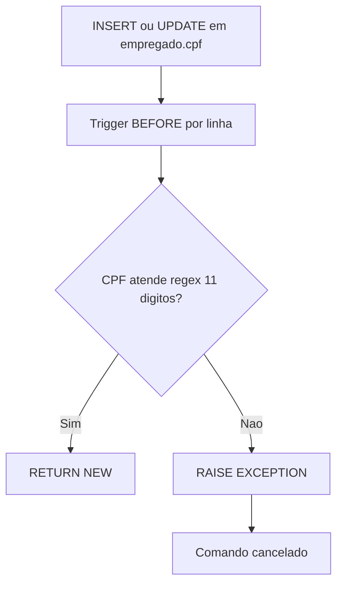
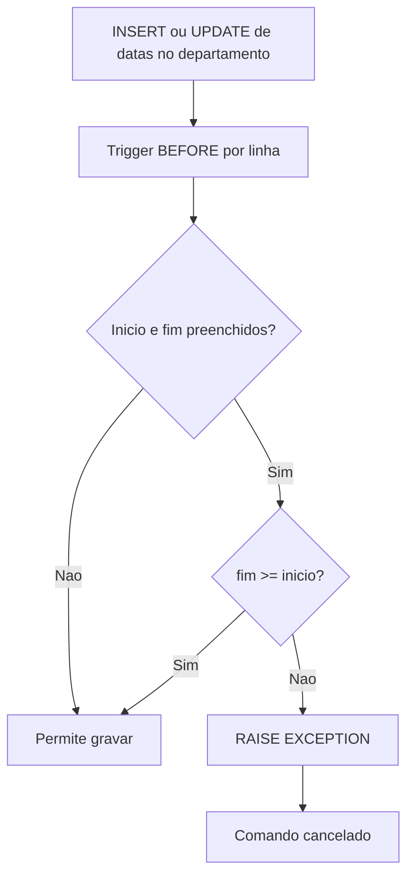
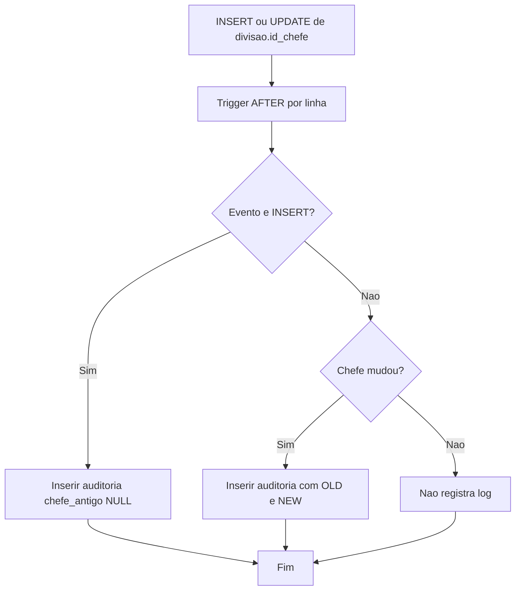
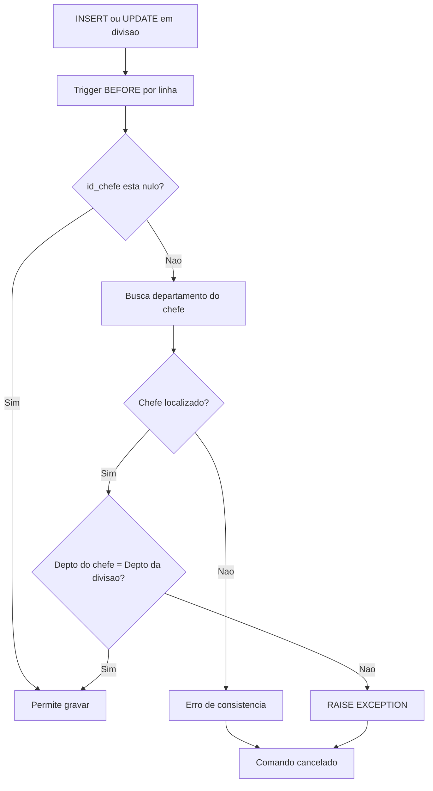
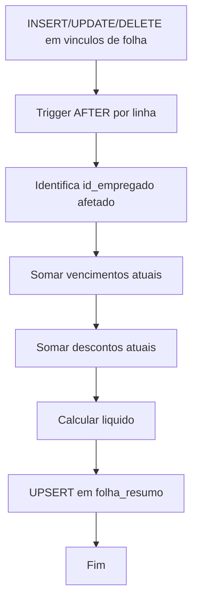
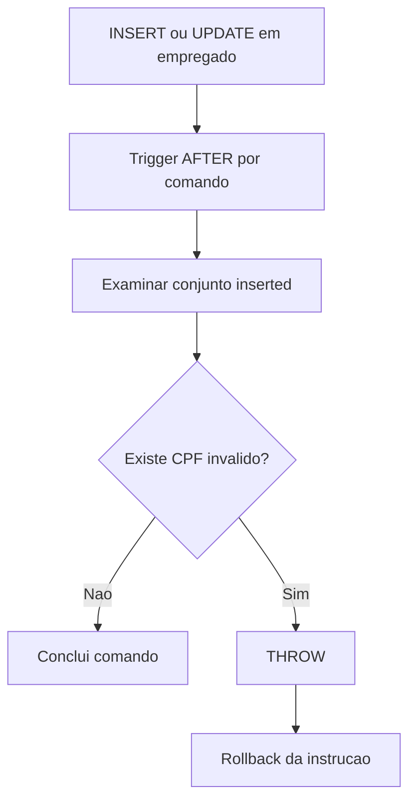
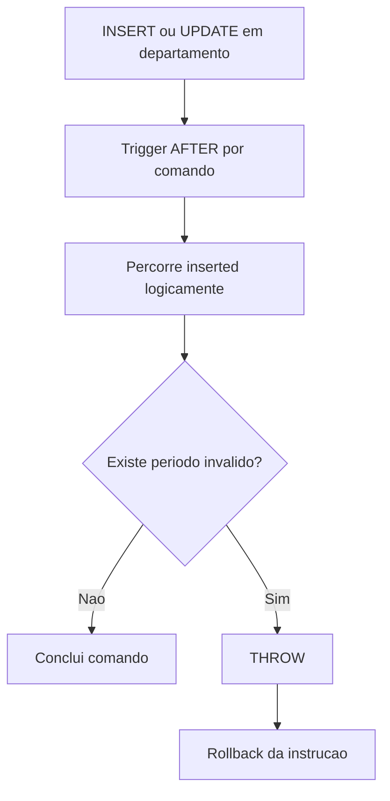
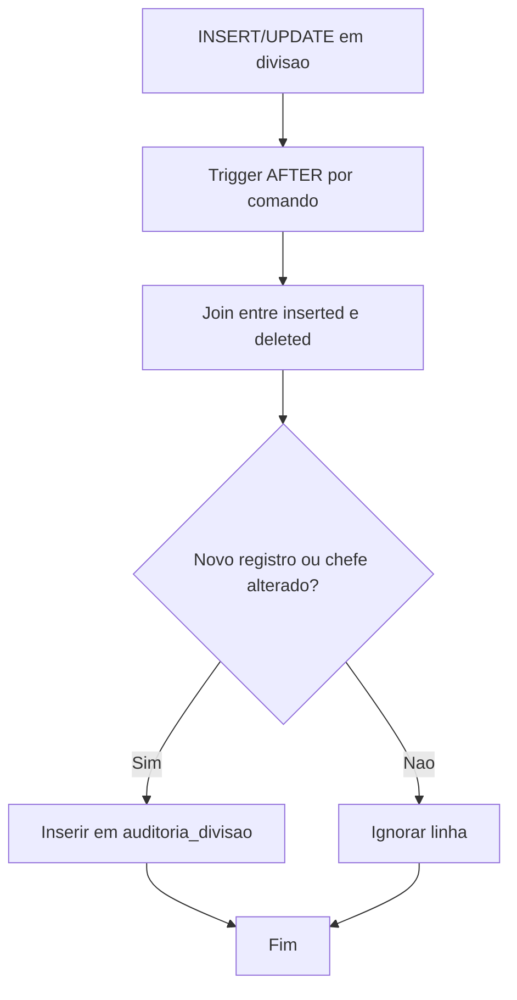
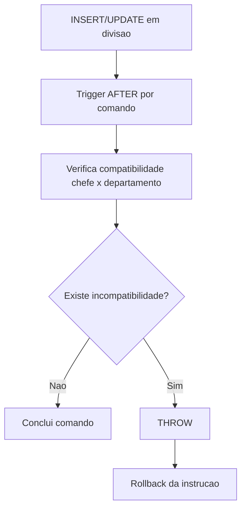
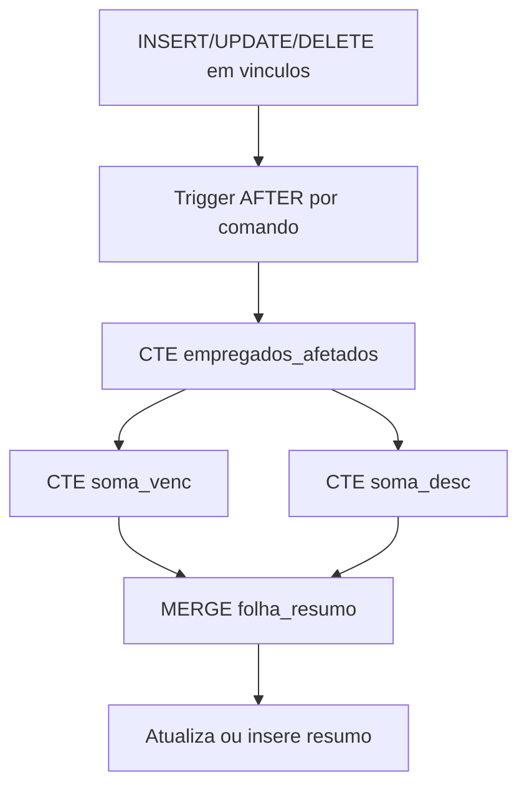

# Apostila Completa - Triggers SQL

## Curso de Banco de Dados Relacional

**Modulo:** Programacao no Banco (Triggers)  
**SGBDs abordados:** PostgreSQL e SQL Server  
**Base pratica usada nesta apostila:** banco `Aulas`, schema `departamentos` (PostgreSQL)

---

## Sumario

1. O que sao triggers e quando usar
2. Anatomia de uma trigger
3. PostgreSQL x SQL Server: diferencas essenciais
4. Modelo de dados da base `departamentos`
5. Preparacao do ambiente de laboratorio
6. Exemplos completos em PostgreSQL
7. Exemplos equivalentes em SQL Server
8. Boas praticas
9. Erros comuns e como evitar
10. Roteiro de testes
11. Exercicios propostos
12. Gabarito resumido

---

## 1. O que sao triggers e quando usar

Trigger e um objeto do banco que executa automaticamente quando um evento ocorre em tabela ou view.

Eventos mais comuns:

- `INSERT`
- `UPDATE`
- `DELETE`

Casos de uso classicos:

- Validar regra de negocio que depende de outras tabelas.
- Auditar alteracoes (quem alterou, quando alterou, valor antigo x novo).
- Impedir operacoes proibidas em dados sensiveis.
- Manter tabela de resumo sincronizada.

Quando evitar trigger:

- Regra simples que pode ser feita com `CHECK`, `UNIQUE` ou `FOREIGN KEY`.
- Logica muito pesada que prejudique desempenho de transacoes OLTP.

---

## 2. Anatomia de uma trigger

Uma trigger tem 4 elementos centrais:

1. Evento: `INSERT`, `UPDATE`, `DELETE`.
2. Momento: `BEFORE`, `AFTER` (PostgreSQL), ou `AFTER` / `INSTEAD OF` (SQL Server).
3. Granularidade:
   - PostgreSQL: por linha (`FOR EACH ROW`) ou por comando (`FOR EACH STATEMENT`).
   - SQL Server: por comando (sempre set-based, usando `inserted` e `deleted`).
4. Acao: bloco SQL que sera executado.

---

## 3. PostgreSQL x SQL Server: diferencas essenciais

| Tema | PostgreSQL | SQL Server |
|---|---|---|
| Definicao da trigger | `CREATE TRIGGER ... EXECUTE FUNCTION` | `CREATE TRIGGER ... AS BEGIN ... END` |
| Funcao separada | Sim (funcao `RETURNS trigger`) | Nao (corpo fica na trigger) |
| Linha antiga/nova | `OLD` e `NEW` | Tabelas virtuais `deleted` e `inserted` |
| Granularidade | Linha ou comando | Comando |
| Trigger antes da escrita | `BEFORE` | Nao ha `BEFORE` em tabela (usar `INSTEAD OF` quando aplicavel) |
| Evitar mensagens sem rollback | `RAISE EXCEPTION` | `THROW` ou `RAISERROR` |

Regra mental importante:

- No PostgreSQL, pense linha a linha quando usar `FOR EACH ROW`.
- No SQL Server, pense em conjunto de linhas sempre.

---

## 4. Modelo de dados da base `departamentos`

Esta apostila usa o schema real levantado no banco `Aulas`:

- `departamentos.departamento`
- `departamentos.divisao`
- `departamentos.empregado`
- `departamentos.vencimento`
- `departamentos.desconto`
- `departamentos.empregado_vencimento`
- `departamentos.empregado_desconto`

Campos-chave usados nas regras:

- `departamento.id_gerente`
- `departamento.data_inicio_gestao`, `departamento.data_fim_gestao`
- `divisao.id_departamento`, `divisao.id_chefe`
- `empregado.id_divisao`, `empregado.cpf`

---

## 5. Preparacao do ambiente de laboratorio

### 5.1 Tabelas auxiliares de auditoria (PostgreSQL)

```sql
CREATE TABLE IF NOT EXISTS departamentos.auditoria_divisao (
	id_auditoria BIGSERIAL PRIMARY KEY,
	id_divisao INT NOT NULL,
	chefe_antigo INT NULL,
	chefe_novo INT NULL,
	alterado_em TIMESTAMP NOT NULL DEFAULT NOW(),
	alterado_por TEXT NOT NULL DEFAULT CURRENT_USER
);

CREATE TABLE IF NOT EXISTS departamentos.folha_resumo (
	id_empregado INT PRIMARY KEY,
	total_vencimentos NUMERIC(12,2) NOT NULL DEFAULT 0,
	total_descontos NUMERIC(12,2) NOT NULL DEFAULT 0,
	salario_liquido NUMERIC(12,2) NOT NULL DEFAULT 0,
	atualizado_em TIMESTAMP NOT NULL DEFAULT NOW(),
	CONSTRAINT fk_folha_resumo_empregado
		FOREIGN KEY (id_empregado)
		REFERENCES departamentos.empregado(id_empregado)
);
```

### 5.2 Tabelas auxiliares de auditoria (SQL Server)

```sql
IF OBJECT_ID('departamentos.auditoria_divisao','U') IS NULL
BEGIN
	CREATE TABLE departamentos.auditoria_divisao (
		id_auditoria BIGINT IDENTITY(1,1) PRIMARY KEY,
		id_divisao INT NOT NULL,
		chefe_antigo INT NULL,
		chefe_novo INT NULL,
		alterado_em DATETIME2 NOT NULL DEFAULT SYSDATETIME(),
		alterado_por SYSNAME NOT NULL DEFAULT SUSER_SNAME()
	);
END;
GO

IF OBJECT_ID('departamentos.folha_resumo','U') IS NULL
BEGIN
	CREATE TABLE departamentos.folha_resumo (
		id_empregado INT PRIMARY KEY,
		total_vencimentos DECIMAL(12,2) NOT NULL DEFAULT 0,
		total_descontos DECIMAL(12,2) NOT NULL DEFAULT 0,
		salario_liquido DECIMAL(12,2) NOT NULL DEFAULT 0,
		atualizado_em DATETIME2 NOT NULL DEFAULT SYSDATETIME(),
		CONSTRAINT fk_folha_resumo_empregado
			FOREIGN KEY (id_empregado)
			REFERENCES departamentos.empregado(id_empregado)
	);
END;
GO
```

---

## 6. Exemplos completos em PostgreSQL

### Exemplo 1 - Validar CPF numerico no cadastro de empregado

```sql
CREATE OR REPLACE FUNCTION departamentos.fn_trg_empregado_valida_cpf()
RETURNS trigger
LANGUAGE plpgsql
AS $$
BEGIN
	IF NEW.cpf IS NULL OR NEW.cpf !~ '^[0-9]{11}$' THEN
		RAISE EXCEPTION 'CPF invalido. Informe exatamente 11 digitos numericos.';
	END IF;
	RETURN NEW;
END;
$$;

DROP TRIGGER IF EXISTS trg_empregado_valida_cpf ON departamentos.empregado;

CREATE TRIGGER trg_empregado_valida_cpf
BEFORE INSERT OR UPDATE OF cpf
ON departamentos.empregado
FOR EACH ROW
EXECUTE FUNCTION departamentos.fn_trg_empregado_valida_cpf();
```

**Explicacao detalhada (PostgreSQL):**

1. A funcao `fn_trg_empregado_valida_cpf` roda antes de gravar (`BEFORE`) e enxerga a linha nova em `NEW`.
2. A validacao usa regex `^[0-9]{11}$` para garantir exatamente 11 digitos numericos.
3. Se o CPF vier nulo, com letra ou com tamanho diferente, o `RAISE EXCEPTION` aborta a operacao.
4. Como e `FOR EACH ROW`, cada linha de um `INSERT` em lote e validada individualmente.
5. `RETURN NEW` confirma que a linha pode continuar para o `INSERT` ou `UPDATE`.

Resultado pratico: impede CPF malformado de entrar na tabela `empregado`, protegendo a qualidade cadastral na origem.

**Contexto de negocio:**

Em cadastros de RH, CPF invalido gera erros em folha, beneficios e integracoes com sistemas externos.

**Situacao que gera o gatilho:**

- Insercao de novo empregado.
- Alteracao do campo `cpf` de empregado existente.

**Regra aplicada:**

- O CPF deve conter exatamente 11 caracteres numericos.
- Qualquer violacao bloqueia a gravacao.



### Exemplo 2 - Garantir periodo de gestao valido no departamento

```sql
CREATE OR REPLACE FUNCTION departamentos.fn_trg_departamento_periodo_gestao()
RETURNS trigger
LANGUAGE plpgsql
AS $$
BEGIN
	IF NEW.data_inicio_gestao IS NOT NULL
	   AND NEW.data_fim_gestao IS NOT NULL
	   AND NEW.data_fim_gestao < NEW.data_inicio_gestao THEN
		RAISE EXCEPTION 'Data fim de gestao nao pode ser menor que data inicio.';
	END IF;
	RETURN NEW;
END;
$$;

DROP TRIGGER IF EXISTS trg_departamento_periodo_gestao ON departamentos.departamento;

CREATE TRIGGER trg_departamento_periodo_gestao
BEFORE INSERT OR UPDATE OF data_inicio_gestao, data_fim_gestao
ON departamentos.departamento
FOR EACH ROW
EXECUTE FUNCTION departamentos.fn_trg_departamento_periodo_gestao();
```

**Explicacao detalhada (PostgreSQL):**

1. A trigger dispara quando uma nova linha e inserida ou quando uma das datas de gestao e alterada.
2. A regra so compara datas quando ambas estao preenchidas (nao nulas).
3. Se `data_fim_gestao` for menor que `data_inicio_gestao`, a operacao e bloqueada por excecao.
4. Essa validacao evita periodos invertidos, que quebram relatorios historicos de chefia.

Resultado pratico: toda faixa de gestao gravada em `departamento` permanece cronologicamente coerente.

**Contexto de negocio:**

Departamentos precisam de historico de gestao consistente para auditoria administrativa e relatorios de governanca.

**Situacao que gera o gatilho:**

- Cadastro de departamento com datas de gestao.
- Ajuste de data de inicio e/ou fim da gestao em registro existente.

**Regra aplicada:**

- Se as duas datas existirem, a data final nao pode ser menor que a inicial.



### Exemplo 3 - Auditar troca de chefe de divisao

```sql
CREATE OR REPLACE FUNCTION departamentos.fn_trg_divisao_audita_chefe()
RETURNS trigger
LANGUAGE plpgsql
AS $$
BEGIN
	IF TG_OP = 'INSERT' OR (TG_OP = 'UPDATE' AND NEW.id_chefe IS DISTINCT FROM OLD.id_chefe) THEN
		INSERT INTO departamentos.auditoria_divisao (
			id_divisao,
			chefe_antigo,
			chefe_novo,
			alterado_em,
			alterado_por
		)
		VALUES (
			NEW.id_divisao,
			CASE WHEN TG_OP = 'INSERT' THEN NULL ELSE OLD.id_chefe END,
			NEW.id_chefe,
			NOW(),
			CURRENT_USER
		);
	END IF;

	RETURN NEW;
END;
$$;

DROP TRIGGER IF EXISTS trg_divisao_audita_chefe ON departamentos.divisao;

CREATE TRIGGER trg_divisao_audita_chefe
AFTER INSERT OR UPDATE OF id_chefe
ON departamentos.divisao
FOR EACH ROW
EXECUTE FUNCTION departamentos.fn_trg_divisao_audita_chefe();
```

**Explicacao detalhada (PostgreSQL):**

1. A trigger e `AFTER`, portanto registra auditoria somente depois da alteracao ser aceita.
2. Em `INSERT`, a funcao grava um log inicial da divisao, com `chefe_antigo = NULL`.
3. Em `UPDATE`, ela so registra quando realmente houve troca (`NEW.id_chefe IS DISTINCT FROM OLD.id_chefe`).
4. O uso de `IS DISTINCT FROM` trata corretamente comparacoes com `NULL`.
5. A linha de auditoria guarda: divisao alterada, chefe anterior, chefe novo, horario e usuario.

Resultado pratico: cria trilha de auditoria confiavel para rastrear nomeacoes e substituicoes de chefia.

**Contexto de negocio:**

Mudancas de chefia impactam aprovacoes, responsabilidades e trilha de responsabilizacao.

**Situacao que gera o gatilho:**

- Criacao de divisao com chefe inicial.
- Troca do campo `id_chefe` em uma divisao.

**Regra aplicada:**

- Registrar evento de auditoria apenas quando houver insercao inicial ou mudanca real de chefe.



### Exemplo 4 - Impedir chefe de divisao fora do mesmo departamento

Regra:

- A divisao pertence a um departamento.
- O chefe da divisao deve ser empregado lotado em divisao do mesmo departamento.

```sql
CREATE OR REPLACE FUNCTION departamentos.fn_trg_divisao_valida_chefe_departamento()
RETURNS trigger
LANGUAGE plpgsql
AS $$
DECLARE
	v_departamento_chefe INT;
BEGIN
	IF NEW.id_chefe IS NULL THEN
		RETURN NEW;
	END IF;

	SELECT d.id_departamento
	  INTO v_departamento_chefe
	  FROM departamentos.empregado e
	  JOIN departamentos.divisao d
		ON d.id_divisao = e.id_divisao
	 WHERE e.id_empregado = NEW.id_chefe;

	IF v_departamento_chefe IS NULL THEN
		RAISE EXCEPTION 'Chefe informado nao existe ou nao esta lotado em divisao valida.';
	END IF;

	IF v_departamento_chefe <> NEW.id_departamento THEN
		RAISE EXCEPTION 'Chefe da divisao deve pertencer ao mesmo departamento da divisao.';
	END IF;

	RETURN NEW;
END;
$$;

DROP TRIGGER IF EXISTS trg_divisao_valida_chefe_departamento ON departamentos.divisao;

CREATE TRIGGER trg_divisao_valida_chefe_departamento
BEFORE INSERT OR UPDATE OF id_chefe, id_departamento
ON departamentos.divisao
FOR EACH ROW
EXECUTE FUNCTION departamentos.fn_trg_divisao_valida_chefe_departamento();
```

**Explicacao detalhada (PostgreSQL):**

1. Se `id_chefe` for nulo, a trigger permite a gravacao (divisao sem chefe temporariamente).
2. Quando existe chefe informado, a funcao busca o departamento dele via `empregado -> divisao`.
3. Se nao encontrar empregado/divisao validos, gera erro de consistencia.
4. Se encontrar, compara o departamento do chefe com `NEW.id_departamento` da divisao alterada.
5. Se forem diferentes, a alteracao e bloqueada.

Resultado pratico: evita nomear como chefe um empregado lotado em departamento diferente do da divisao.

**Contexto de negocio:**

Chefia fora da estrutura do departamento quebra a hierarquia formal e pode invalidar fluxos internos.

**Situacao que gera o gatilho:**

- Insercao de divisao com `id_chefe` preenchido.
- Mudanca de chefe ou mudanca de departamento da divisao.

**Regra aplicada:**

- O chefe informado precisa estar lotado em divisao vinculada ao mesmo departamento da divisao alterada.



### Exemplo 5 - Recalcular folha resumo apos mudancas de vencimentos/descontos

```sql
CREATE OR REPLACE FUNCTION departamentos.fn_recalcula_folha_resumo(p_id_empregado INT)
RETURNS void
LANGUAGE plpgsql
AS $$
DECLARE
	v_total_venc NUMERIC(12,2);
	v_total_desc NUMERIC(12,2);
BEGIN
	SELECT COALESCE(SUM(v.valor),0)
	  INTO v_total_venc
	  FROM departamentos.empregado_vencimento ev
	  JOIN departamentos.vencimento v
		ON v.id_vencimento = ev.id_vencimento
	 WHERE ev.id_empregado = p_id_empregado;

	SELECT COALESCE(SUM(d.valor),0)
	  INTO v_total_desc
	  FROM departamentos.empregado_desconto ed
	  JOIN departamentos.desconto d
		ON d.id_desconto = ed.id_desconto
	 WHERE ed.id_empregado = p_id_empregado;

	INSERT INTO departamentos.folha_resumo (
		id_empregado,
		total_vencimentos,
		total_descontos,
		salario_liquido,
		atualizado_em
	)
	VALUES (
		p_id_empregado,
		v_total_venc,
		v_total_desc,
		v_total_venc - v_total_desc,
		NOW()
	)
	ON CONFLICT (id_empregado)
	DO UPDATE
	   SET total_vencimentos = EXCLUDED.total_vencimentos,
		   total_descontos = EXCLUDED.total_descontos,
		   salario_liquido = EXCLUDED.salario_liquido,
		   atualizado_em = NOW();
END;
$$;
```

Trigger para `empregado_vencimento`:

```sql
CREATE OR REPLACE FUNCTION departamentos.fn_trg_empregado_vencimento_recalcula()
RETURNS trigger
LANGUAGE plpgsql
AS $$
BEGIN
	PERFORM departamentos.fn_recalcula_folha_resumo(COALESCE(NEW.id_empregado, OLD.id_empregado));
	RETURN COALESCE(NEW, OLD);
END;
$$;

DROP TRIGGER IF EXISTS trg_empregado_vencimento_recalcula ON departamentos.empregado_vencimento;

CREATE TRIGGER trg_empregado_vencimento_recalcula
AFTER INSERT OR UPDATE OR DELETE
ON departamentos.empregado_vencimento
FOR EACH ROW
EXECUTE FUNCTION departamentos.fn_trg_empregado_vencimento_recalcula();
```

Trigger para `empregado_desconto`:

```sql
CREATE OR REPLACE FUNCTION departamentos.fn_trg_empregado_desconto_recalcula()
RETURNS trigger
LANGUAGE plpgsql
AS $$
BEGIN
	PERFORM departamentos.fn_recalcula_folha_resumo(COALESCE(NEW.id_empregado, OLD.id_empregado));
	RETURN COALESCE(NEW, OLD);
END;
$$;

DROP TRIGGER IF EXISTS trg_empregado_desconto_recalcula ON departamentos.empregado_desconto;

CREATE TRIGGER trg_empregado_desconto_recalcula
AFTER INSERT OR UPDATE OR DELETE
ON departamentos.empregado_desconto
FOR EACH ROW
EXECUTE FUNCTION departamentos.fn_trg_empregado_desconto_recalcula();
```

**Explicacao detalhada (PostgreSQL):**

1. A funcao `fn_recalcula_folha_resumo` centraliza o calculo para evitar duplicar logica.
2. Ela soma vencimentos e descontos nas tabelas relacionais e calcula liquido = vencimentos - descontos.
3. O `ON CONFLICT (id_empregado)` transforma a operacao em upsert: cria ou atualiza o resumo.
4. As duas triggers (`empregado_vencimento` e `empregado_desconto`) chamam a mesma funcao apos `INSERT/UPDATE/DELETE`.
5. `COALESCE(NEW.id_empregado, OLD.id_empregado)` garante o id correto inclusive em `DELETE`.

Resultado pratico: a tabela `folha_resumo` fica sincronizada automaticamente com as alteracoes de proventos e descontos.

**Contexto de negocio:**

Folha resumo e usada para consulta rapida de totais sem recalcular tudo a cada tela/relatorio.

**Situacao que gera o gatilho:**

- Inserir, alterar ou excluir vinculo em `empregado_vencimento`.
- Inserir, alterar ou excluir vinculo em `empregado_desconto`.

**Regra aplicada:**

- Recalcular totais de vencimentos e descontos do empregado afetado.
- Persistir no resumo com comportamento de upsert.



---

## 7. Exemplos equivalentes em SQL Server

> Observacao: em SQL Server, a trigger trabalha com conjuntos de linhas afetadas por comando.

### Exemplo 1 - Validar CPF numerico no cadastro de empregado

```sql
CREATE OR ALTER TRIGGER departamentos.trg_empregado_valida_cpf
ON departamentos.empregado
AFTER INSERT, UPDATE
AS
BEGIN
	SET NOCOUNT ON;

	IF EXISTS (
		SELECT 1
		  FROM inserted i
		 WHERE i.cpf IS NULL
			OR i.cpf LIKE '%[^0-9]%'
			OR LEN(i.cpf) <> 11
	)
	BEGIN
		THROW 50001, 'CPF invalido. Informe exatamente 11 digitos numericos.', 1;
	END;
END;
GO
```

**Explicacao detalhada (SQL Server):**

1. A trigger roda apos `INSERT` e `UPDATE`, analisando o conjunto de linhas em `inserted`.
2. A validacao identifica CPF nulo, com caractere nao numerico (`LIKE '%[^0-9]%'`) ou tamanho diferente de 11.
3. Se qualquer linha violar, `THROW` interrompe o comando inteiro e o SQL Server faz rollback da instrucao.
4. O desenho e set-based: funciona para uma ou mil linhas no mesmo comando.

Resultado pratico: nenhuma linha com CPF invalido e persistida em `departamentos.empregado`.

**Contexto de negocio:**

No SQL Server, operacoes de carga podem inserir varias linhas de uma vez; por isso a validacao precisa ser set-based.

**Situacao que gera o gatilho:**

- Comando `INSERT` em lote na tabela de empregados.
- Comando `UPDATE` em lote alterando CPF.

**Regra aplicada:**

- Se existir qualquer linha invalida em `inserted`, o lote inteiro e rejeitado.



### Exemplo 2 - Garantir periodo de gestao valido no departamento

```sql
CREATE OR ALTER TRIGGER departamentos.trg_departamento_periodo_gestao
ON departamentos.departamento
AFTER INSERT, UPDATE
AS
BEGIN
	SET NOCOUNT ON;

	IF EXISTS (
		SELECT 1
		  FROM inserted i
		 WHERE i.data_inicio_gestao IS NOT NULL
		   AND i.data_fim_gestao IS NOT NULL
		   AND i.data_fim_gestao < i.data_inicio_gestao
	)
	BEGIN
		THROW 50002, 'Data fim de gestao nao pode ser menor que data inicio.', 1;
	END;
END;
GO
```

**Explicacao detalhada (SQL Server):**

1. A trigger avalia todas as linhas novas/alteradas presentes em `inserted`.
2. A condicao usa `IS NOT NULL` nas duas datas para validar apenas periodos completos.
3. Se houver uma unica linha com fim menor que inicio, o comando inteiro e abortado por `THROW`.

Resultado pratico: evita periodos de gestao inconsistentes mesmo em atualizacoes em lote.

**Contexto de negocio:**

Atualizacoes em massa de dados historicos podem introduzir inconsistencias de datas se nao houver guarda no banco.

**Situacao que gera o gatilho:**

- Insercao de varios departamentos.
- Atualizacao em lote de datas de gestao.

**Regra aplicada:**

- Nao aceitar nenhuma linha onde fim < inicio quando ambas as datas estiverem preenchidas.



### Exemplo 3 - Auditar troca de chefe de divisao

```sql
CREATE OR ALTER TRIGGER departamentos.trg_divisao_audita_chefe
ON departamentos.divisao
AFTER INSERT, UPDATE
AS
BEGIN
	SET NOCOUNT ON;

	INSERT INTO departamentos.auditoria_divisao (
		id_divisao,
		chefe_antigo,
		chefe_novo,
		alterado_em,
		alterado_por
	)
	SELECT
		i.id_divisao,
		d.id_chefe,
		i.id_chefe,
		SYSDATETIME(),
		SUSER_SNAME()
	FROM inserted i
	LEFT JOIN deleted d
	  ON d.id_divisao = i.id_divisao
	WHERE d.id_chefe IS NULL
	   OR ISNULL(i.id_chefe, -1) <> ISNULL(d.id_chefe, -1);
END;
GO
```

**Explicacao detalhada (SQL Server):**

1. `inserted` representa o estado novo, `deleted` representa o estado anterior (no `UPDATE`).
2. O `LEFT JOIN` por `id_divisao` alinha antes e depois para cada registro afetado.
3. O `WHERE` registra apenas insercao nova (`d.id_chefe IS NULL`) ou troca real de chefe.
4. `ISNULL(..., -1)` padroniza comparacao quando algum valor e nulo.
5. A auditoria grava data/hora (`SYSDATETIME`) e usuario (`SUSER_SNAME`).

Resultado pratico: todo movimento de chefia em `divisao` fica historizado para rastreabilidade.

**Contexto de negocio:**

Em auditorias de governanca, e necessario saber quem era o chefe antes e depois de cada alteracao.

**Situacao que gera o gatilho:**

- Insercao de nova divisao com chefe.
- Atualizacao de `id_chefe` em uma ou varias divisoes.

**Regra aplicada:**

- Registrar somente criacao inicial ou mudanca real de valor, ignorando atualizacao sem alteracao de chefe.



### Exemplo 4 - Impedir chefe de divisao fora do mesmo departamento

```sql
CREATE OR ALTER TRIGGER departamentos.trg_divisao_valida_chefe_departamento
ON departamentos.divisao
AFTER INSERT, UPDATE
AS
BEGIN
	SET NOCOUNT ON;

	IF EXISTS (
		SELECT 1
		FROM inserted i
		JOIN departamentos.empregado e
		  ON e.id_empregado = i.id_chefe
		JOIN departamentos.divisao d_chefe
		  ON d_chefe.id_divisao = e.id_divisao
		WHERE i.id_chefe IS NOT NULL
		  AND d_chefe.id_departamento <> i.id_departamento
	)
	BEGIN
		THROW 50003, 'Chefe da divisao deve pertencer ao mesmo departamento da divisao.', 1;
	END;
END;
GO
```

**Explicacao detalhada (SQL Server):**

1. A trigger verifica se algum chefe informado em `inserted` pertence a departamento diferente.
2. Para isso, busca a lotacao atual do chefe em `empregado` e depois identifica o departamento da divisao dele.
3. Se achar incompatibilidade, `THROW` cancela o comando.
4. Como a regra usa `EXISTS`, basta uma linha inconsistente para reprovar todo o lote.

Resultado pratico: garante coerencia organizacional entre divisao e chefia em operacoes unitarias ou em massa.

**Contexto de negocio:**

Nomeacoes indevidas de chefia em departamento incorreto podem gerar autorizacoes administrativas invalidas.

**Situacao que gera o gatilho:**

- Lote de atualizacao de chefes.
- Remanejamento de divisao para outro departamento com chefe ja definido.

**Regra aplicada:**

- Se qualquer linha violar correspondencia de departamento, a instrucao inteira deve falhar.



### Exemplo 5 - Recalcular folha resumo apos mudancas em vencimentos/descontos

Trigger em `empregado_vencimento`:

```sql
CREATE OR ALTER TRIGGER departamentos.trg_empregado_vencimento_recalcula
ON departamentos.empregado_vencimento
AFTER INSERT, UPDATE, DELETE
AS
BEGIN
	SET NOCOUNT ON;

	;WITH empregados_afetados AS (
		SELECT id_empregado FROM inserted
		UNION
		SELECT id_empregado FROM deleted
	),
	soma_venc AS (
		SELECT ev.id_empregado, SUM(v.valor) AS total_vencimentos
		FROM departamentos.empregado_vencimento ev
		JOIN departamentos.vencimento v
		  ON v.id_vencimento = ev.id_vencimento
		WHERE ev.id_empregado IN (SELECT id_empregado FROM empregados_afetados)
		GROUP BY ev.id_empregado
	),
	soma_desc AS (
		SELECT ed.id_empregado, SUM(d.valor) AS total_descontos
		FROM departamentos.empregado_desconto ed
		JOIN departamentos.desconto d
		  ON d.id_desconto = ed.id_desconto
		WHERE ed.id_empregado IN (SELECT id_empregado FROM empregados_afetados)
		GROUP BY ed.id_empregado
	)
	MERGE departamentos.folha_resumo AS alvo
	USING (
		SELECT ea.id_empregado,
			   ISNULL(sv.total_vencimentos, 0) AS total_vencimentos,
			   ISNULL(sd.total_descontos, 0) AS total_descontos
		FROM empregados_afetados ea
		LEFT JOIN soma_venc sv ON sv.id_empregado = ea.id_empregado
		LEFT JOIN soma_desc sd ON sd.id_empregado = ea.id_empregado
	) AS src
	ON alvo.id_empregado = src.id_empregado
	WHEN MATCHED THEN
		UPDATE SET
			alvo.total_vencimentos = src.total_vencimentos,
			alvo.total_descontos = src.total_descontos,
			alvo.salario_liquido = src.total_vencimentos - src.total_descontos,
			alvo.atualizado_em = SYSDATETIME()
	WHEN NOT MATCHED THEN
		INSERT (id_empregado, total_vencimentos, total_descontos, salario_liquido, atualizado_em)
		VALUES (
			src.id_empregado,
			src.total_vencimentos,
			src.total_descontos,
			src.total_vencimentos - src.total_descontos,
			SYSDATETIME()
		);
END;
GO
```

Trigger em `empregado_desconto`:

```sql
CREATE OR ALTER TRIGGER departamentos.trg_empregado_desconto_recalcula
ON departamentos.empregado_desconto
AFTER INSERT, UPDATE, DELETE
AS
BEGIN
	SET NOCOUNT ON;

	;WITH empregados_afetados AS (
		SELECT id_empregado FROM inserted
		UNION
		SELECT id_empregado FROM deleted
	),
	soma_venc AS (
		SELECT ev.id_empregado, SUM(v.valor) AS total_vencimentos
		FROM departamentos.empregado_vencimento ev
		JOIN departamentos.vencimento v
		  ON v.id_vencimento = ev.id_vencimento
		WHERE ev.id_empregado IN (SELECT id_empregado FROM empregados_afetados)
		GROUP BY ev.id_empregado
	),
	soma_desc AS (
		SELECT ed.id_empregado, SUM(d.valor) AS total_descontos
		FROM departamentos.empregado_desconto ed
		JOIN departamentos.desconto d
		  ON d.id_desconto = ed.id_desconto
		WHERE ed.id_empregado IN (SELECT id_empregado FROM empregados_afetados)
		GROUP BY ed.id_empregado
	)
	MERGE departamentos.folha_resumo AS alvo
	USING (
		SELECT ea.id_empregado,
			   ISNULL(sv.total_vencimentos, 0) AS total_vencimentos,
			   ISNULL(sd.total_descontos, 0) AS total_descontos
		FROM empregados_afetados ea
		LEFT JOIN soma_venc sv ON sv.id_empregado = ea.id_empregado
		LEFT JOIN soma_desc sd ON sd.id_empregado = ea.id_empregado
	) AS src
	ON alvo.id_empregado = src.id_empregado
	WHEN MATCHED THEN
		UPDATE SET
			alvo.total_vencimentos = src.total_vencimentos,
			alvo.total_descontos = src.total_descontos,
			alvo.salario_liquido = src.total_vencimentos - src.total_descontos,
			alvo.atualizado_em = SYSDATETIME()
	WHEN NOT MATCHED THEN
		INSERT (id_empregado, total_vencimentos, total_descontos, salario_liquido, atualizado_em)
		VALUES (
			src.id_empregado,
			src.total_vencimentos,
			src.total_descontos,
			src.total_vencimentos - src.total_descontos,
			SYSDATETIME()
		);
END;
GO
```

**Explicacao detalhada (SQL Server):**

1. A CTE `empregados_afetados` unifica ids vindos de `inserted` e `deleted`, cobrindo os tres eventos.
2. As CTEs `soma_venc` e `soma_desc` recalculam os totais atuais a partir das tabelas de detalhe.
3. O `MERGE` aplica upsert em `folha_resumo`: atualiza se existe, insere se nao existe.
4. O liquido e recalculado sempre por diferenca, evitando acumulacao incorreta.
5. O mesmo padrao aparece nas duas triggers para manter sincronia quando muda vencimento ou desconto.

Resultado pratico: os saldos da folha resumo ficam corretos automaticamente apos qualquer manutencao nas tabelas de vinculo.

**Contexto de negocio:**

Operacoes de RH normalmente acontecem em lote; o resumo precisa refletir o estado final consistente do conjunto.

**Situacao que gera o gatilho:**

- Ajuste em massa de vinculos de vencimento/desconto.
- Carga inicial de rubricas para varios empregados.

**Regra aplicada:**

- Recalcular com base no estado atual das tabelas de vinculo e aplicar upsert no resumo por empregado afetado.



---

## 8. Boas praticas

- Escreva trigger com foco set-based (principalmente no SQL Server).
- Evite trigger com chamada remota ou IO pesado.
- Nao use trigger para substituir todas as regras de aplicacao.
- Nomeie com padrao claro: `trg_<tabela>_<acao>`.
- Documente regra de negocio no cabecalho da trigger.
- Crie testes de regressao para `INSERT`, `UPDATE`, `DELETE`.
- Monitore lock e tempo de execucao em producao.

---

## 9. Erros comuns e como evitar

1. Assumir uma linha so no SQL Server.
   Solucao: sempre considerar multiplas linhas em `inserted` e `deleted`.

2. Gerar recursao involuntaria.
   Solucao: evitar trigger que atualiza a mesma tabela sem controle.

3. Duplicar regra que ja esta em `CHECK`.
   Solucao: use trigger apenas para regra entre tabelas ou auditoria.

4. Mensagem de erro vaga.
   Solucao: usar texto objetivo e acionavel para o usuario.

---

## 10. Roteiro de testes

### 10.1 Testar CPF invalido

```sql
-- PostgreSQL (schema departamentos)
INSERT INTO departamentos.empregado (
	matricula,
	nome,
	cpf,
	id_divisao
)
VALUES ('M999','Teste CPF','123ABC',1);
```

Esperado: erro de CPF invalido.

### 10.2 Testar periodo de gestao invalido

```sql
UPDATE departamentos.departamento
   SET data_inicio_gestao = DATE '2026-12-31',
	   data_fim_gestao = DATE '2026-01-01'
 WHERE id_departamento = 1;
```

Esperado: bloqueio da atualizacao.

### 10.3 Testar auditoria de chefe

```sql
UPDATE departamentos.divisao
   SET id_chefe = 3
 WHERE id_divisao = 1;

SELECT *
  FROM departamentos.auditoria_divisao
 ORDER BY id_auditoria DESC;
```

Esperado: novo registro de auditoria com chefe antigo e novo.

### 10.4 Testar recalculo de folha

```sql
INSERT INTO departamentos.empregado_vencimento (id_empregado, id_vencimento)
VALUES (1, 1);

INSERT INTO departamentos.empregado_desconto (id_empregado, id_desconto)
VALUES (1, 1);

SELECT *
  FROM departamentos.folha_resumo
 WHERE id_empregado = 1;
```

Esperado: `total_vencimentos`, `total_descontos` e `salario_liquido` atualizados.

---

## 11. Exercicios propostos

1. Criar trigger para impedir exclusao de departamento com divisao ativa, retornando mensagem personalizada.
2. Criar trigger de auditoria de alteracao de `empregado.id_divisao` (lotacao antiga x nova).
3. Criar trigger que bloqueie cadastro de `vencimento` com `valor <= 0` (mesmo havendo check).
4. Criar trigger que preencha log de alteracao de endereco de departamento.
5. Adaptar os exemplos para schema `dbo` no SQL Server.

### Roteiro de laboratorio - Garantir ao menos um vencimento por empregado

**Objetivo:** implementar uma trigger para impedir que um empregado fique sem vencimento associado.

**Contexto:** na base `departamentos`, os vinculos de vencimentos ficam na tabela `empregado_vencimento`. A regra de negocio e: todo empregado ativo no cadastro deve possuir pelo menos um registro de vencimento.

**Situacoes a controlar:**

1. Exclusao de um vinculo em `empregado_vencimento` que deixe o empregado sem nenhum vencimento.
2. Atualizacao de `id_empregado` em `empregado_vencimento` que remova o ultimo vencimento de um empregado de origem.

**Atividades do laboratorio:**

1. Criar trigger no PostgreSQL (`BEFORE DELETE OR UPDATE`) em `departamentos.empregado_vencimento`.
2. Na trigger, validar se a operacao deixara o empregado de origem com zero vencimentos.
3. Se violar a regra, bloquear com `RAISE EXCEPTION` e mensagem clara.
4. Repetir a implementacao equivalente no SQL Server usando `AFTER DELETE, UPDATE` e tabelas `deleted`/`inserted`.
5. Testar com os cenarios abaixo.

**Cenarios de teste obrigatorios:**

1. Empregado com 2 vencimentos: excluir 1 deve ser permitido.
2. Empregado com 1 vencimento: excluir o unico deve ser bloqueado.
3. Update transferindo o unico vencimento de empregado A para empregado B: deve ser bloqueado para A.

**Entregaveis:**

1. Script da trigger PostgreSQL.
2. Script da trigger SQL Server.
3. Evidencias de teste (comandos SQL e resultado esperado/obtido).

---

## 12. Gabarito resumido

1. Use trigger `BEFORE DELETE` (PostgreSQL) e `INSTEAD OF DELETE` ou `AFTER DELETE` com rollback (SQL Server), consultando `divisao`.
2. Em PostgreSQL, usar `OLD.id_divisao` e `NEW.id_divisao`; em SQL Server, comparar `deleted` x `inserted` por `id_empregado`.
3. Validar `NEW.valor <= 0` e `RAISE EXCEPTION` (PostgreSQL) ou `THROW` (SQL Server).
4. Registrar em tabela de auditoria apenas quando houver mudanca real (`IS DISTINCT FROM` no PostgreSQL, `ISNULL` no SQL Server).
5. Trocar prefixo de schema e ajustar funcoes nativas (`NOW` x `SYSDATETIME`, `CURRENT_USER` x `SUSER_SNAME`).

---

## Encerramento

Com esta apostila, voce tem um guia completo para modelar, implementar e testar triggers em PostgreSQL e SQL Server, usando um mesmo dominio funcional (`departamentos`) e comparando os dois dialetos de forma pratica.

