# Apostila Completa — Módulo 01
## Fundamentos de Banco de Dados, Modelagem Conceitual e Prática Inicial

**Curso:** Banco de Dados Relacionais
**Professor:** Dr. Fábio Leite
**Instituição:** Universidade Estadual da Paraíba (UEPB), Campus I — Campina Grande, PB

Este documento reúne, em um único arquivo, todo o conteúdo do Módulo 01, organizado na mesma sequência em que os arquivos originais aparecem na pasta `modulo_01`:

1. Introdução a Bancos de Dados
2. Serviços de um SGBD
3. Prático Inicial de Banco de Dados
4. Projeto Conceitual e Modelagem Entidade-Relacionamento
5. Exercícios de Modelagem Entidade-Relacionamento


<div class="page-break"></div>

# Parte 01 — Introdução a Bancos de Dados

## INTRODUÇÃO A BANCOS DE DADOS
*Apresentação: Dr. Fábio Leite*

## BANCO DE DADOS

* Por que usar?

* Quais as vantagens e desvantagens?

Banco de dados é uma coleção de **dados estruturados e relacionados**.
O termo "estruturado" se refere a um formato bem definido e organizado. O SGBD (Sistema de Gerenciamento de Banco de Dados) é o software que permite aos usuários criar e manter essa coleção de dados. A característica "relacionado" é fundamental: os dados devem possuir um significado implícito e lógico, representando fatos conhecidos do "mundo real" que foram registrados.

Embora um banco de dados possa ser teoricamente não-computadorizado, o foco principal é em bancos de dados computadorizados. O SGBD, ao gerenciar esses **dados armazenados eletronicamente**, utiliza estruturas de armazenamento eficientes e mecanismos de controle para garantir que eles sejam manipulados de forma segura, correta e rápida.

Ele permite o gerenciamento eficiente de grandes volumes de informações, facilitando a **inserção, consulta, atualização e remoção de dados**.
 Estas quatro operações (inserção, consulta, atualização e remoção) são conhecidas coletivamente como as operações básicas de manipulação de dados. 

O SGBD facilita essas operações ao fornecer:

- **Linguagens de Consulta:** Como o SQL, que são de alto nível e fáceis de usar para os usuários finais e programadores.
- **Otimização:** O SGBD utiliza otimizadores de consulta e índices para garantir que a consulta e a recuperação (busca) dos dados sejam realizadas de forma a minimizar o tempo de resposta, mesmo em grandes volumes.

## ELEMENTOS DE UM SGBD

O SGBD lida com diversos **Usuários e Programas** (os Atores, como o DBA, Designers e Usuários Finais) que acessam o sistema para executar suas requisições. 

O ponto central dessa interação é a **Consulta (Query)**. Estas requisições são processadas pelo Processador de Consultas, que tem a função de analisar a sintaxe (geralmente SQL), traduzir e otimizar a solicitação, gerando um plano de execução eficiente para máxima performance na recuperação dos dados. Sendo assim, são tratadas por todos os elementos do SGBD para retornar o que foi requerido.

Para alterações seguras, o SGBD utiliza **Transações**, que são unidades de execução regidas pelas propriedades ACID: Atomicidade (ou completa, ou desfeita), Consistência (mantém o estado válido), Isolamento (execução independente) e Durabilidade (alterações permanentes). O SGBD garante o cumprimento do ACID por meio de seus módulos de Controle de Concorrência e Recuperação de falhas.

<div align="center">
    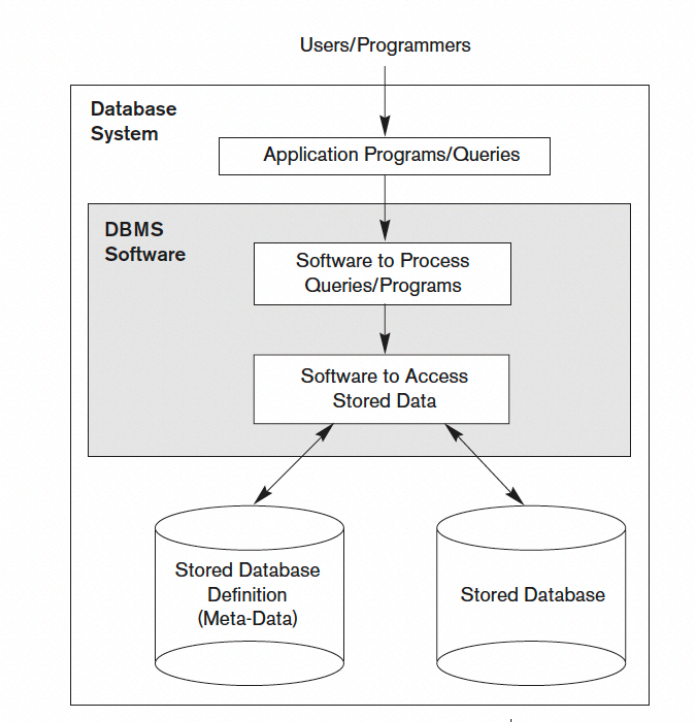
</div>


## PROJETO DE BANCO DE DADOS

* **Definir** um banco de dados envolve especificar: 
    * Tipos de dados 
    * Estruturas 
    * Restrições sobre os dados armazenados 


* **Construir** um banco de dados é a fase de implementação do esquema, utilizando a Linguagem de Definição de Dados (DDL) para criar a estrutura. Em seguida, os dados são armazenados no meio físico, com o SGBD controlando esses detalhes para abstrair o usuário dos pormenores de armazenamento.
* **Manipular** os dados é a execução das operações básicas de Inserção, Remoção, Modificação e Recuperação (Consultas). Essa manipulação é feita através da Linguagem de Manipulação de Dados (DML), permitindo a recuperação da informação (incluindo a geração de relatórios) e garantindo a evolução segura dos dados mantidos por meio de Transações ACID.

## FORMAS DE ACESSO OFERECIDAS PELO SGBD

Um **SGBD** provê acesso aos dados de forma:

* **Eficiente**: O SGBD usa estruturas de armazenamento eficientes e um Otimizador de Consultas para o acesso rápido aos dados.
* **Confiável:** O sistema impõe Restrições de Integridade e usa subsistemas de Recuperação e Backup para proteger a base contra falhas, garantindo a durabilidade e a validade dos dados.
* **Conveniente:** O SGBD oferece abstração da visão física e usa linguagens de alto nível (DML) para simplificar a interação do usuário.
* **Acesso concorrente e multi-usuários:** Esta é uma função vital do SGBD, gerenciada pelo Sistema de Controle de Concorrência para garantir o Isolamento das transações e permitir que múltiplos usuários trabalhem ao mesmo tempo.
* **Massiva e persistente:** O SGBD é inerentemente projetado para lidar com grandes volumes de dados (massivo) e garantir que as alterações confirmadas sejam permanentes (persistente).


## SERVIÇOS DE UM SGBD

Sendo assim, os principais serviços são:

* Persistência
* Segurança
* Backup e recuperação de falhas
* Otimização de consultas
* Logging
* Performance Tunning
* Replicação
* Suporte a aplicações avançadas:
    * Data warehouse e mining
    * Machine learning
    * Business Intelligence

## HISTORIA DE SGBDS

A história dos Sistemas Gerenciadores de Banco de Dados (SGBDs) começou na década de 1950 com o ineficiente Processamento de Arquivos individualizados. A necessidade de centralizar dados levou à criação dos primeiros SGBDs de Primeira Geração nos anos 1960 (Modelos Hierárquico e de Rede). A verdadeira revolução veio nos anos 1970 com o Modelo Relacional de E.F. Codd, dando origem aos SGBDs de Segunda Geração, que utilizam tabelas e a linguagem SQL, separando a lógica dos dados do seu armazenamento físico. A evolução continuou com os modelos Objeto-Relacionais nos anos 80/90 (Terceira Geração) e, mais recentemente, com o surgimento dos sistemas NoSQL, que oferecem alta escalabilidade para lidar com o volume e a variedade do Big Data moderno.


<div style="display: flex; gap: 20px;" align="center">
    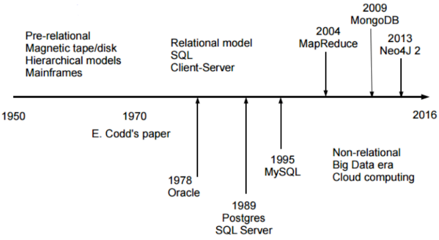
    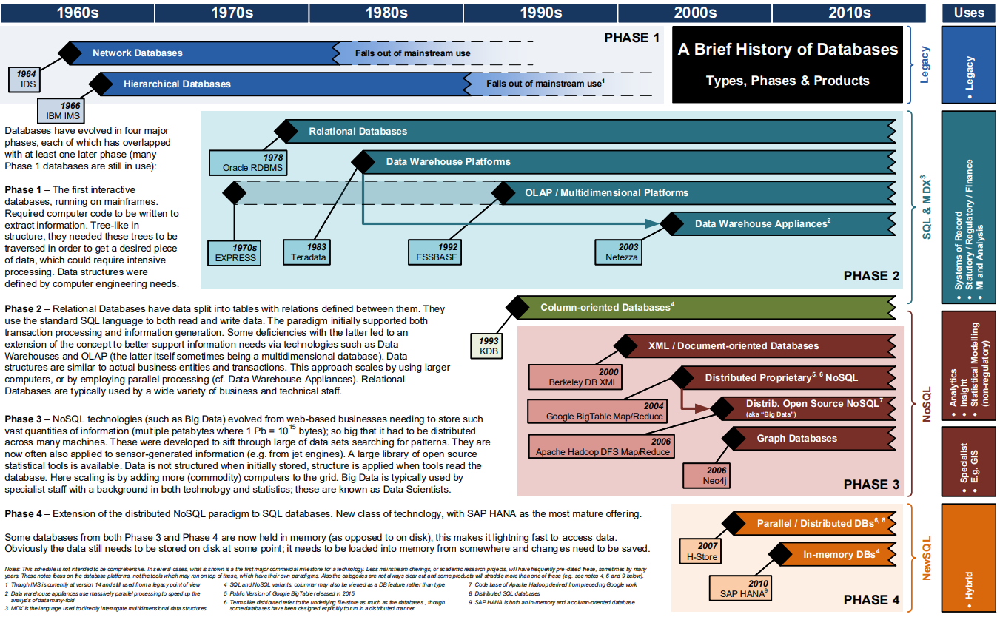
</div>

---

## CLASSIFICAÇÃO QUANTO AO PROPÓSITO


### PRODUÇÃO 

* Bancos de dados que armazenam os dados para manter as aplicações e sistemas funcionando.
* É conhecido como **Online Transaction Processing (OLTP)**.
* Podem ser **relacionais, NoSQL, Graph DB, entre outros**.

### ANALÍTICO

* Bancos de dados para análise e apoio à tomada de decisão.
* São **Fontes de dados para modelos de ML** (Machine Learning).
* Podem ser: **Data warehouses, Data Lakes ou Lakehouses**.

### OPERACIONAL (MONITORAMENTO)

* Bancos de dados montados para provê suporte à aplicações de **monitoramento, logs, segurança, entre outros**.
* Podem ser: **key-value stores, time series, logs + search DBs**.

### TIPOS DE PLAYERS NO MERCADO 

<div align="center">
    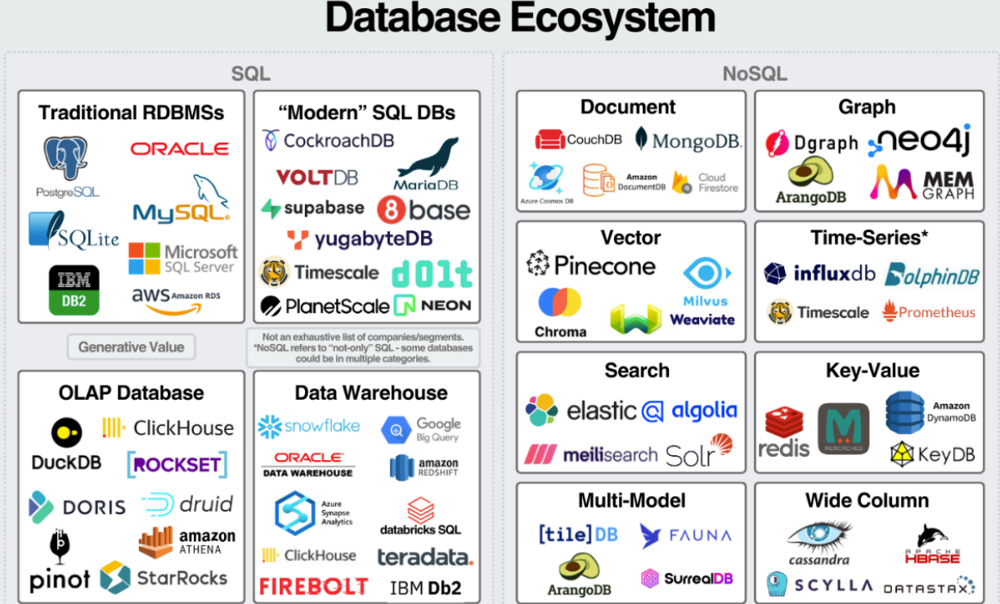
</div>

## NÍVEIS DE ABSTRAÇÃO

O SGBD utiliza uma arquitetura de três esquemas para garantir a independência de dados, separando as diferentes formas como o banco de dados é visto e implementado.

* **Visões do usuário**
    * **Módulos do sistema:** O SGBD permite que cada grupo de usuários (como programadores ou usuários finais) tenha uma visão personalizada do banco de dados, que é apenas uma parte do banco de dados real.
    * **Linguagem voltada aos stakeholders:** As visões escondem dados irrelevantes e a complexidade do banco de dados real (o Esquema Conceitual), garantindo que cada usuário acesse apenas o que é necessário para sua aplicação, o que é crucial para a segurança e a conveniência.

* **Conceitual**
    * **Entidades e relacionamentos entre os dados:** Este esquema descreve a estrutura do banco de dados inteiro para uma comunidade de usuários.
    * **Visão simplificada:** É uma visão totalmente lógica da base de dados. Ela descreve quais dados são armazenados e os relacionamentos entre eles, e todas as restrições de integridade que devem ser aplicadas. Este nível é independente tanto do armazenamento físico quanto das visões externas dos usuários.

* **Físico**
    * **Nível de implementação no SGBD** Este nível especifica a organização física dos dados armazenados.
    * **Estruturas de dados, registros, arquivos, índices, etc..** Ele detalha como os dados são realmente armazenados e gerenciados.


<div align="center">
    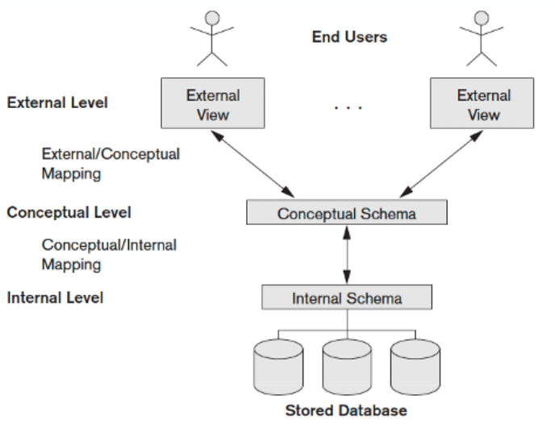
</div>

## PRINCÍPIO DA INDEPENDÊNCIA DE DADOS

*"Deve ser possível que esquemas de dados possam mudar sem afetar as definições de esquemas de níveis superiores."*

Edgar F. Codd

---

### Independência física de dados

* Capacidade de modificar o **esquema físico** sem a necessidade de reescrever os programas aplicativos que usam a base. As modificações no nível físico são ocasionalmente necessárias para melhorar o desempenho ou estruturas internas.


### Independência lógica de dados

* Capacidade de modificar o **esquema conceitual** sem a necessidade de reescrever os programas que acessam os dados. As modificações no nível conceitual são necessárias quanto a **estrutura lógica** do banco de dados é alterada.

### PRINCÍPIO DA INDEPENDÊNCIA DE DADOS 


**Modelo Conceitual**

* **Descrição de maneira independente ao SGBD**, ou seja, define os dados a serem registrados no BD, porém sem se importar com a implementação que se dará ao BD.
* Uma das técnicas mais utilizadas dentre os profissionais da área é a **abordagem entidade-relacionamento (ER)**, onde o modelo é representado graficamente através do **Diagrama Entidade-Relacionamento (DER)**.


**Modelo Lógico**

* Descreve o BD no nível do SGBD, ou seja, depende do tipo particular de SGBD que será usado. O tipo de SGBD que o modelo lógico trata é se o mesmo é relacional, orientado a objetos, hierárquico, etc.

<div align="center">
    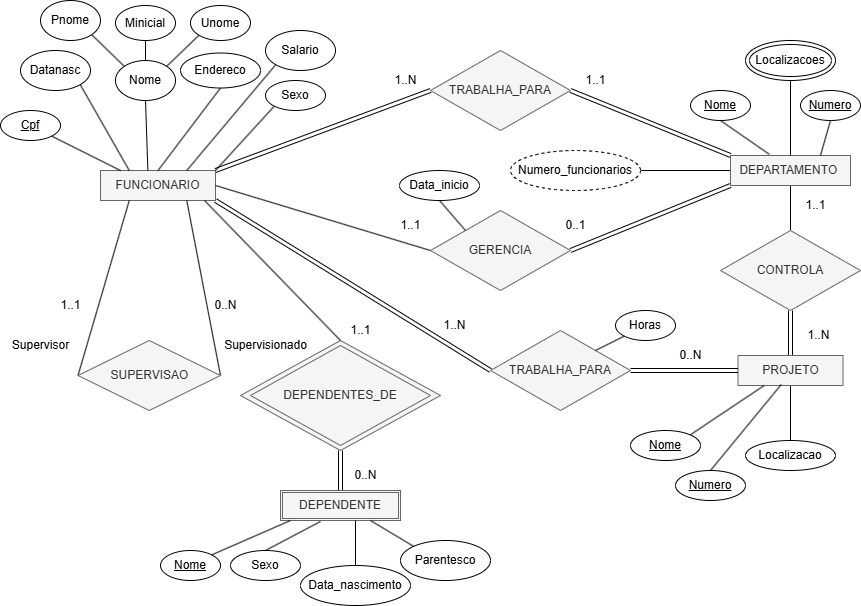
</div>


<h2 id="tabelas-do-modelo-relacional">TABELAS DO MODELO RELACIONAL</h2>
<table style="width:100%; border: none; border-collapse: collapse;">
<tr>
<td style="width:25%; vertical-align: top; padding: 10px; border: none;">
<h4>Departamento</h4>
      
| CodDepto | Nome |
| :---: | :---: |
| 1 | D1 |
| 2 | D2 |
| 3 | D3 |

</td>
<td style="width:35%; vertical-align: top; padding: 10px; border: none;">
<h4>Empregado</h4>
      
| CodEmp | Nome | CodDepto |
| :---: | :---: | :---: |
| 1 | José | 3 |
| 2 | Maria | 2 |
| 3 | João | 2 |
| 4 | João | 1 |
| 5 | Pedro | 3 |
| 6 | Ana | 2 |

</td>
<td style="width:40%; vertical-align: top; padding: 10px; border: none;">
<h4>Dependente</h4>
      
| CodDep | Nome | CodEmp |
| :---: | :---: | :---: |
| 1 | Francisco | 3 |
| 2 | Juliana | 3 |
| 3 | Juliana | 4 |
| 4 | Manuel | 1 |
| 5 | Miguel | 3 |
| 6 | Hugo | 2 |
| 7 | Marcos | 6 |
| 8 | Daniela | 1 |
| 9 | Marieta | 2 |
</td>
  </tr>
</table>

## VANTAGENS DE USAR SGBDS

* Controle de redundância
* Restrição de acesso desautorizado
* Armazenamento Persistente para objetos dos programas
* Estruturas de armazenamento e técnicas de buscas para processamento eficiente de consultas
* Backup e restauração
* Múltiplas interfaces de usuários
* Representação de relacionamentos complexos entre os dados
* Garantia de restrições de integridade
* Permite inferência e ações automáticas usando regras e gatilhos

## DESVANTAGENS DE USAR SGBDS

* Controle de redundância
* Restrição de acesso desautorizado
* Armazenamento Persistente para objetos dos programas
* Estruturas de armazenamento e técnicas de buscas para processamento eficiente de consultas
* Backup e restauração
* Múltiplas interfaces de usuários
* Representação de relacionamentos complexos entre os dados
* Garantia de restrições de integridade
* Permite inferência e ações automáticas usando regras e gatilhos

### Resumo das Desvantagens de um SGBD

| Desvantagem | Impacto |
|-------------|---------|
| Alto custo | Licenças, hardware e suporte. |
| Complexidade | Exige configuração, administração e gerenciamento do banco de dados. |
| Consumo de recursos | Maior utilização de CPU, memória RAM e espaço em disco. |
| Necessidade de especialistas | Requer DBAs e desenvolvedores com conhecimento em bancos de dados. |
| Sobrecarga (Overhead) | O controle de transações, concorrência e segurança pode reduzir o desempenho em alguns cenários. |
| Dependência do fornecedor | Pode dificultar a migração para outro SGBD devido a recursos proprietários. |
| Implantação mais lenta | Exige planejamento, modelagem e configuração antes do uso. |
| Ponto único de falha | A indisponibilidade do banco pode interromper diversos sistemas que dependem dele. |
| Manutenção contínua | Necessita de backups, atualizações, monitoramento e otimização periódicos. |
| Curva de aprendizagem | Exige conhecimento em SQL, modelagem de dados, transações, índices e otimização de consultas. |

## REFERÊNCIAS BIBLIOGRÁFICAS

* **ELMASRI, Ramez; NAVATHE, Shamkant.** *Fundamentals of Database Systems*. 7th ed., 2021. 
* **GAMES, Pete; THOMAS.COM.** *A Brief History of Databases: Types, Phases & Products*. (2017-2018). Disponível sob Licença Creative Commons Attribution 4.0 International. 

## CONTATO

* **Telefone:** +55 83 996577959 
* **E-mail:** fabioleite@servidor.uepb.edu.br 
* **Endereço:** Universidade Estadual da Paraíba, Campus I - Campina Grande, PB


<div class="page-break"></div>

# Parte 02 — Serviços de um SGBD

## 03.07 – Serviços de um SGBD

> **Observação:** Este capítulo apresenta os principais serviços oferecidos por um Sistema Gerenciador de Banco de Dados (SGBD).

### Conteúdo

1. Introdução
2. Persistência
3. Segurança
4. Backup e recuperação de falhas
5. Logging
6. Otimização de consultas
7. Performance Tuning
8. Replicação
9. Suporte a aplicações avançadas
10. Data Warehouse
11. Data Mining
12. Machine Learning
13. Business Intelligence
14. Exercícios Propostos
15. Referências

---

## Introdução

Um SGBD moderno oferece muito mais do que armazenamento de dados. Entre seus serviços estão persistência, segurança, recuperação de falhas, otimização de consultas, replicação, suporte analítico e integração com BI e Machine Learning.

> **Este arquivo é um modelo estruturado para o capítulo.** Expanda cada seção conforme o material do curso.

### 2. Persistência

Persistência refere-se à forma como os dados são armazenados de maneira durável em disco e recuperados pelo SGBD. Componentes importantes:

- Storage engine: gerencia páginas (8 KB no SQL Server), extents (conjunto de páginas) e alocação de espaço.
- Transações e ACID: Atomicidade, Consistência, Isolamento e Durabilidade garantem integridade mesmo em falhas.
- MVCC vs locking: mecanismos para controlar concorrência e visibilidade de versões.

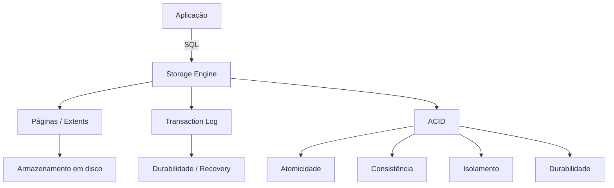
```mermaid
flowchart TD
    A[Aplicação] -->|SQL| B[Storage Engine]
    B --> C[Páginas / Extents]
    C --> D[Armazenamento em disco]
    B --> E[Transaction Log]
    E --> F[Durabilidade / Recovery]
    B --> G[ACID]
    G --> H[Atomicidade]
    G --> I[Consistência]
    G --> J[Isolamento]
    G --> K[Durabilidade]
```

Exemplo prático (SQL Server): transação com rollback/commit

```sql
BEGIN TRANSACTION;
INSERT INTO Clientes (Nome, Email) VALUES ('Ana', 'ana@exemplo.com');
-- validar alterações
IF (@@ERROR = 0)
	COMMIT TRANSACTION;
ELSE
	ROLLBACK TRANSACTION;
```

Boas práticas: projetar transações curtas, escolher esquema de armazenamento adequado (heap vs clustered), e manter estatísticas atualizadas.

### 3. Segurança

Segurança em SGBD cobre autenticação, autorização, criptografia e auditoria.

- Autenticação: login de usuários (Windows Auth vs SQL Auth no SQL Server).
- Autorização: permissões (GRANT/REVOKE), roles e separation of duties.
- Roles: agrupar permissões (ex.: db_datareader, db_datawriter, custom roles).
- Criptografia: TDE (Transparent Data Encryption) para dados em disco; Always Encrypted para proteger colunas sensíveis; TLS para conexões.
- Auditoria: uso de logs, SQL Audit/Extended Events para rastrear atividades.

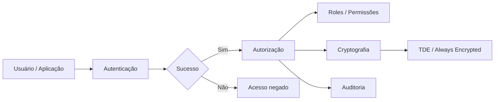
```mermaid
flowchart LR
    A[Usuário / Aplicação] --> B[Autenticação]
    B --> C{Sucesso}
    C -->|Sim| D[Autorização]
    C -->|Não| E[Acesso negado]
    D --> F[Roles / Permissões]
    D --> G[Cryptografia]
    G --> H[TDE / Always Encrypted]
    D --> I[Auditoria]
```

Exemplo (criar role e conceder permissão):

```sql
CREATE ROLE app_readonly;
GRANT SELECT ON SCHEMA::dbo TO app_readonly;
EXEC sp_addrolemember 'app_readonly', 'usuario_app';
```

### 4. Backup e Recuperação

Tipos principais de backup:

- Full: captura todo o banco.
- Differential: captura mudanças desde o último full.
- Transaction log (ou incremental): permite point-in-time recovery.

Recovery models (SQL Server): SIMPLE, BULK_LOGGED, FULL — definem comportamento de logging e possibilidade de restauração ponto-a-ponto.

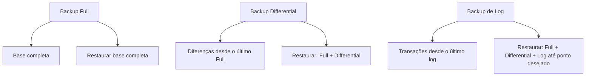
```mermaid
flowchart TD
    A[Backup Full] --> B[Base completa]
    A --> C[Restaurar base completa]
    D[Backup Differential] --> E[Diferenças desde o último Full]
    D --> F[Restaurar: Full + Differential]
    G[Backup de Log] --> H[Transações desde o último log]
    G --> I[Restaurar: Full + Differential + Log até ponto desejado]
```

Exemplo (SQL Server): backup full e log

```sql
BACKUP DATABASE MeuBanco TO DISK = 'C:\backups\MeuBanco_full.bak' WITH FORMAT;
BACKUP LOG MeuBanco TO DISK = 'C:\backups\MeuBanco_log.trn';
```

Políticas: definir frequência de backups, retenção e testar restores regularmente.

### 5. Logging

O logging garante durabilidade e recuperação. Padrões comuns:

- Transaction log (SQL Server): registro sequencial de operações que permite rollback e recuperação.
- Write-Ahead Logging (WAL): garantir que modificações de log sejam escritas antes das páginas de dados.
- Rollback/Redo: durante recovery, o motor aplica redo e undo conforme necessário.

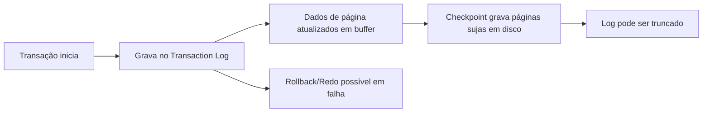
```mermaid
flowchart LR
    A[Transação inicia] --> B[Grava no Transaction Log]
    B --> C[Dados de página atualizados em buffer]
    C --> D[Checkpoint grava páginas sujas em disco]
    D --> E[Log pode ser truncado]
    B --> F[Rollback/Redo possível em falha]
```

Impacto operacional: gerenciamento do tamanho do log, checkpoints e truncation (dependem do recovery model).

### 6. Otimização de Consultas

O otimizador transforma SQL em um plano de execução. Elementos relevantes:

- Estatísticas: informações sobre distribuição de dados que guiam o otimizador.
- Índices: permitem seeks vs scans; escolha de chaves e includes influencia planos.
- Hints e reescrita de consultas: quando necessário para forçar planos.

Exemplo: ver plano estimado/executado no SSMS; usar `SET STATISTICS IO ON` para medir I/O.

```sql
SET STATISTICS IO ON;
SELECT * FROM Pedidos WHERE ClienteId = 123;
SET STATISTICS IO OFF;
```

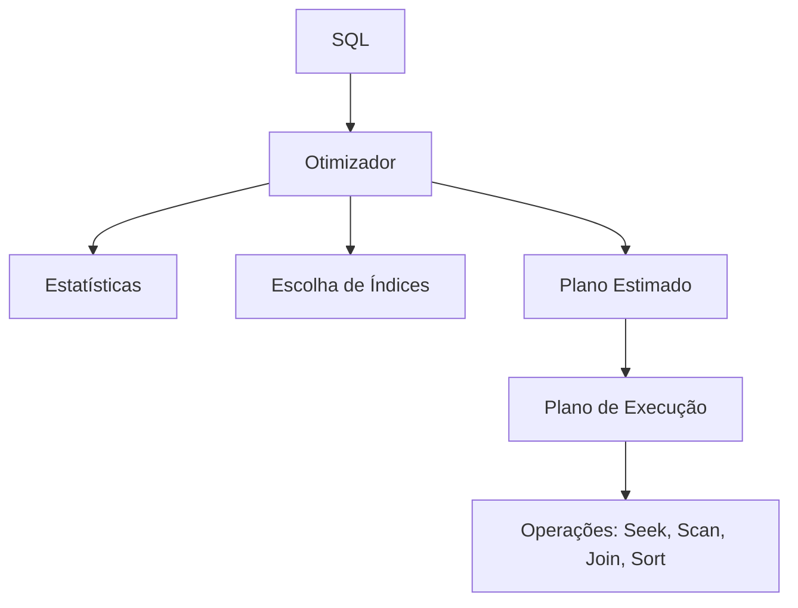
```mermaid
flowchart TD
    A[SQL] --> B[Otimizador]
    B --> C[Estatísticas]
    B --> D[Escolha de Índices]
    B --> E[Plano Estimado]
    E --> F[Plano de Execução]
    F --> G[Operações: Seek, Scan, Join, Sort]
```

### 7. Performance Tuning

Atividades típicas:

- Identificar gargalos com wait stats, DMVs e Query Store.
- Criar/ajustar índices (incluindo índices filtrados e índices columnstore para analytics).
- Particionamento para gerenciar I/O e manutenção.
- Compressão de dados e escolha de tipos adequados.

Ferramentas: `sys.dm_exec_query_stats`, `sys.dm_db_index_physical_stats`, Performance Monitor, Query Store.

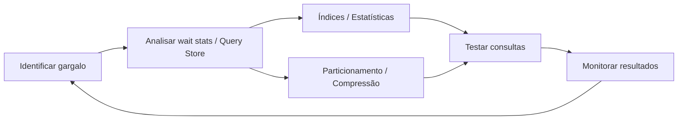
```mermaid
flowchart LR
    A[Identificar gargalo] --> B[Analisar wait stats / Query Store]
    B --> C[Índices / Estatísticas]
    B --> D[Particionamento / Compressão]
    C --> E[Testar consultas]
    D --> E
    E --> F[Monitorar resultados]
    F --> A
```

### 8. Replicação

Modelos de replicação:

- Snapshot: envia cópia completa periodicamente — simples, sem latência mínima.
- Transacional: replica mudanças continuamente (baixo latency) — bom para sincronização OLTP.
- Replicação física (log shipping, Always On Availability Groups): cópias redundantes para alta disponibilidade.
- Replicação lógica: replicação de dados a nível lógico (geral) e tipos de publicação/assinatura.

Escolha baseada em requisitos de RTO/RPO, consistência e topologia.

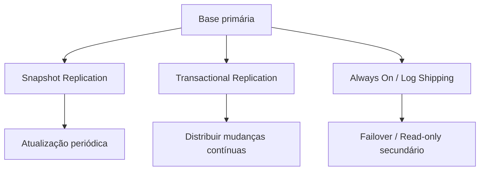
```mermaid
flowchart TB
    A[Base primária] --> B[Snapshot Replication]
    A --> C[Transactional Replication]
    A --> D[Always On / Log Shipping]
    C --> E[Distribuir mudanças contínuas]
    D --> F[Failover / Read-only secundário]
    B --> G[Atualização periódica]
```

### 9. Suporte a aplicações avançadas

Funcionalidades modernas que um SGBD pode oferecer:

- JSON / XML: armazenamento e consulta de documentos (ex.: `OPENJSON`, `FOR JSON` no SQL Server).
- Spatial: tipos e funções geoespaciais (ex.: `geometry`, `geography`).
- Full-Text Search: índices de texto para buscas linguísticas.
- Stored Procedures e Triggers: lógica próxima aos dados (cuidado com complexidade e manutenção).

Exemplo JSON (SQL Server):

```sql
SELECT * FROM Clientes
WHERE JSON_VALUE(DocumentoJson, '$.tipo') = 'CPF';
```

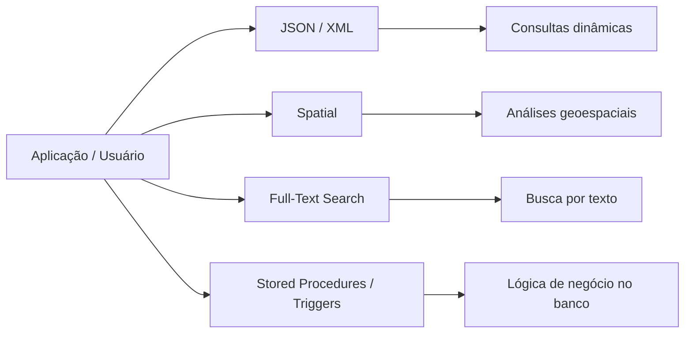
```mermaid
flowchart LR
    A[Aplicação / Usuário] --> B[JSON / XML]
    A --> C[Spatial]
    A --> D[Full-Text Search]
    A --> E[Stored Procedures / Triggers]
    B --> F[Consultas dinâmicas]
    C --> G[Análises geoespaciais]
    D --> H[Busca por texto]
    E --> I[Lógica de negócio no banco]
```

### 10. Data Warehouse

Conceitos principais:

- ETL/ELT: extrair, transformar e carregar dados para o armazém.
- OLTP × OLAP: transacional vs analítico (latência, agregação e schema diferentes).
- Modelos: Star schema (fatos e dimensões), Snowflake.
- Slowly Changing Dimensions (SCD) para lidar com mudanças históricas.

Processos típicos: carga inicial (bulk), atualizações incrementais, atualização de estatísticas e manutenção de agregações.

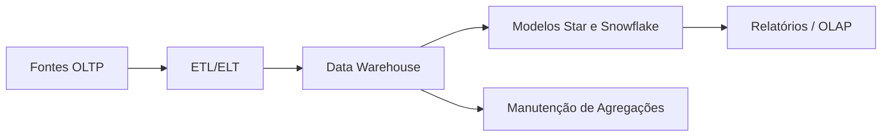
```mermaid
flowchart LR
    A[Fontes OLTP] --> B[ETL/ELT]
    B --> C[Data Warehouse]
    C --> D[Modelos Star e Snowflake]
    D --> E[Relatórios / OLAP]
    C --> F[Manutenção de Agregações]
```

### 11. Data Mining

Definição e aplicações:

- Técnicas: clustering, classification, association rules, and anomaly detection.
- Ferramentas: bibliotecas e serviços que integraram-se a SGBDs (ex.: SQL Server Analysis Services histórico; atualmente integração com R/Python e ferramentas externas).

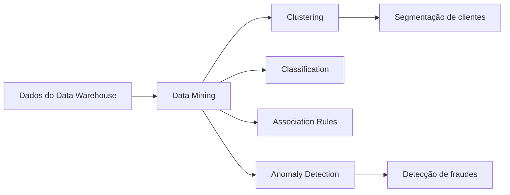
```mermaid
flowchart LR
    A[Dados do Data Warehouse] --> B[Data Mining]
    B --> C[Clustering]
    B --> D[Classification]
    B --> E[Association Rules]
    B --> F[Anomaly Detection]
    F --> G[Detecção de fraudes]
    C --> H[Segmentação de clientes]
```

Exemplo de uso: gerar clusters de clientes para segmentação de marketing.

### 12. Machine Learning

Integração com SGBD:

- Treinar modelos usando dados diretamente no banco (SQL Server Machine Learning Services integra R/Python).
- Operacionalizar modelos: scoring em tempo real via procedures ou serviços externos.

Boas práticas: preparar dados no banco, extrair features, treinar fora do horário crítico e implantar modelos de forma controlada.

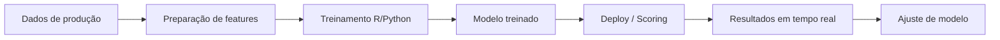
```mermaid
flowchart LR
    A[Dados de produção] --> B[Preparação de features]
    B --> C[Treinamento R/Python]
    C --> D[Modelo treinado]
    D --> E[Deploy / Scoring]
    E --> F[Resultados em tempo real]
    F --> G[Ajuste de modelo]
```

### 13. Business Intelligence

Componentes:

- ETL/ELT para alimentar modelos analíticos.
- Cubos/Modelos semânticos e camadas de apresentação.
- Ferramentas de visualização: Power BI, Tableau, etc.

Padrões: criação de uma camada semântica, tabelas agregadas e índices/columnstore para acelerar relatórios.

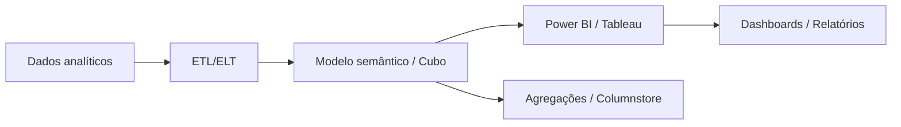
```mermaid
flowchart LR
    A[Dados analíticos] --> B[ETL/ELT]
    B --> C[Modelo semântico / Cubo]
    C --> D[Power BI / Tableau]
    D --> E[Dashboards / Relatórios]
    C --> F[Agregações / Columnstore]
```

### 14. Exercícios Propostos

1. Explique o modelo ACID e dê um exemplo de como cada propriedade é garantida pelo SGBD.

2. Configure um plano de backup para um banco com alta criticidade (descreva full/diff/log e frequência).

3. Dado um workload OLTP com lentidão em consultas por cliente, descreva um processo de diagnóstico e as possíveis soluções (índices, estatísticas, reescrita de query).

4. Modele um Star Schema simples para vendas (fato Vendas e dimensões Cliente, Produto, Tempo) e escreva uma query que calcule vendas por mês e categoria.

5. Compare `SELECT INTO` e `CREATE TABLE` + `INSERT` e descreva quando cada abordagem é mais adequada.

### 15. Referências

- Elmasri, R. & Navathe, S. — Fundamentals of Database Systems.
- Silberschatz, A.; Korth, H. F.; Sudarshan, S. — Database System Concepts.
- Date, C. J. — An Introduction to Database Systems.
- Microsoft Docs — SQL Server documentation: https://docs.microsoft.com/sql
- Brent Ozar, SQLServerCentral, SQLskills — blogs e artigos técnicos.


<div class="page-break"></div>

# Parte 03 — Prático Inicial de Banco de Dados

## Prático Inicial - Banco de Dados

**Professor:** Dr. Fábio Leite  
**Instituição:** Universidade Estadual da Paraíba — UEPB, Campina Grande, PB  

> **SGBDs abordados:** SQL Server · PostgreSQL  

---

### Sumário

1. [Instalação dos SGBDs](#1-instalação-dos-sgbds)  
2. [Criação de Banco de Dados](#2-criação-de-banco-de-dados)  
3. [Esquemas e Tabelas](#3-esquemas-e-tabelas)  
4. [Operações DML](#4-operações-dml)  

---

### 1. Instalação dos SGBDs

> 📋 **Antes de começar:** Verifique se o seu computador tem pelo menos **4 GB de RAM** e **10 GB de espaço livre em disco**. Feche outros programas pesados durante a instalação.

---

#### 1.1 SQL Server — Windows

O SQL Server é instalado em duas etapas: primeiro o **servidor de banco de dados**, depois o **SQL Server Management Studio (SSMS)**, que é a interface gráfica usada para interagir com ele.

---

##### Parte A — Instalar o SQL Server

**Passo 1 — Baixar o instalador**

1. Abra o navegador e acesse: **https://www.microsoft.com/pt-br/sql-server/sql-server-downloads**
2. Role a página até a seção **"Ou escolha uma edição gratuita especializada"**.
3. Clique em **"Baixar agora"** abaixo de **Developer**.
   - A edição Developer é gratuita e tem todos os recursos da versão paga — destinada a desenvolvimento e aprendizado.
4. O arquivo `SQL2022-SSEI-Dev.exe` (ou similar) será baixado. Salve na pasta **Downloads**.

**Passo 2 — Executar o instalador**

1. Dê um duplo clique no arquivo baixado.
2. Se o Windows exibir *"Deseja permitir que este aplicativo faça alterações no seu dispositivo?"*, clique em **Sim**.
3. Uma janela com três opções aparecerá. Clique em **Básico**.
4. Na tela de **Termos de Licença**, clique em **Aceitar**.
5. Mantenha o local de instalação padrão e clique em **Instalar**.
6. Aguarde entre 5 e 15 minutos.
7. Quando aparecer **"A instalação foi concluída com êxito!"**, **anote ou tire print** do campo **CADEIA DE CONEXÃO**, que será parecido com:
   ```
   Server=localhost;Database=master;Trusted_Connection=True;
   ```

8. Não feche essa janela ainda.

---

##### Parte B — Instalar o SSMS (interface gráfica)

**Passo 3 — Baixar e instalar o SSMS**

1. Na janela de conclusão da etapa anterior, clique em **"Instalar SSMS"**. O navegador abrirá a página de download.
   - Caso a janela já tenha sido fechada, acesse: **https://aka.ms/ssmsfullsetup**
2. Clique no link de download do SSMS (ex.: **"Baixar o SSMS 20.x"**).
3. Execute o arquivo `SSMS-Setup-PTB.exe` baixado. Clique em **Sim** se solicitado.
4. Clique em **Instalar** e aguarde de 5 a 10 minutos.
5. Ao final, clique em **Fechar**. **Reinicie o computador** se o instalador solicitar.

**Passo 4 — Abrir o SSMS e conectar ao servidor**

1. Abra o menu **Iniciar**, digite **SSMS** e clique no programa.
2. A janela **"Conectar ao Servidor"** abrirá automaticamente. Preencha:
   - **Tipo de servidor:** `Mecanismo de Banco de Dados` *(já vem preenchido)*
   - **Nome do servidor:** `localhost`
   - **Autenticação:** `Autenticação do Windows`
3. Clique em **Conectar**.
4. O painel **Object Explorer** aparecerá à esquerda com o servidor conectado.

> ✅ **Verificando a instalação**
>
> 1. Clique em **Nova Consulta** na barra de ferramentas (ou `Ctrl + N`).
> 2. Na área de texto, digite:
>    ```sql
>    SELECT @@VERSION;
>    ```
> 3. Clique em **Executar** (botão ▶ ou `F5`).
> 4. Na aba **Resultados** (parte inferior), deve aparecer a versão do SQL Server. ✅

**Problemas comuns — SQL Server**

| Problema | Causa provável | Solução |
|----------|----------------|---------|
| SSMS não conecta | Serviço do SQL Server parado | Busque **"Gerenciador de Configurações do SQL Server"** no menu Iniciar. Verifique se **SQL Server (MSSQLSERVER)** está **Em Execução**. Se não estiver, clique com botão direito → **Iniciar**. |
| Mensagem "Login falhou" | Tipo de autenticação errado | Escolha **Autenticação do Windows**, não SQL Server. |
| Instalador trava ou fecha | Pouco espaço em disco | Verifique se há pelo menos 10 GB livres no disco C: e execute o instalador como Administrador (botão direito → *Executar como administrador*). |

---

#### 1.2 SQL Server — Linux

> ⚠️ O SQL Server não tem suporte completo para Ubuntu/Debian em ambiente didático. **Alunos com Linux devem usar o PostgreSQL** (seção 1.4).

---

#### 1.3 PostgreSQL — Windows

**Passo 1 — Baixar o instalador**

1. Acesse: **https://www.postgresql.org/download/windows**
2. Clique em **"Download the installer"**.
3. Na tabela, localize a versão mais recente (ex.: **16.x**) e clique no ícone de download na coluna **Windows x86-64**.
4. O arquivo `postgresql-16.x-windows-x64.exe` será baixado.

**Passo 2 — Executar o instalador**

1. Dê duplo clique no arquivo. Clique em **Sim** se solicitado.
2. **Boas-vindas:** clique em **Next**.
3. **Diretório de instalação:** mantenha o padrão. Clique em **Next**.
4. **Componentes:** mantenha todos marcados (PostgreSQL Server, pgAdmin 4, Stack Builder, Command Line Tools). Clique em **Next**.
5. **Diretório de dados:** mantenha o padrão. Clique em **Next**.
6. **Senha do superusuário:** defina uma senha para o usuário `postgres`.
   - ⚠️ **ANOTE ESSA SENHA.** Sem ela você não conseguirá acessar o banco. Sugestão: `postgres123`.
7. **Porta:** mantenha `5432`. Clique em **Next**.
8. **Locale:** mantenha o padrão. Clique em **Next** → **Next** → aguarde a instalação.
9. Ao final, **desmarque** *"Launch Stack Builder at exit"* e clique em **Finish**.

**Passo 3 — Abrir o pgAdmin 4 e conectar**

1. Abra o menu **Iniciar**, digite **pgAdmin** e clique em **pgAdmin 4**.
2. O pgAdmin abrirá no navegador padrão (é um aplicativo web local). Aguarde carregar.
3. Na primeira abertura, defina uma **senha mestra do pgAdmin** (protege o próprio pgAdmin) e clique em **OK**.
4. No painel esquerdo (**Browser**), expanda **Servers** → clique em **PostgreSQL 16**.
5. Digite a senha definida no Passo 2. Marque **Save Password**. Clique em **OK**.
6. O servidor aparecerá conectado.

**Passo 4 — Abrir o Query Tool**

1. Expanda **Servers → PostgreSQL 16 → Databases → postgres**.
2. Clique com botão direito em **postgres** → **Query Tool**.
3. Uma aba com área de texto abrirá — é aqui onde você escreverá os comandos SQL.

> ✅ **Verificando a instalação**
>
> 1. Na área de texto do Query Tool, digite:
>    ```sql
>    SELECT version();
>    ```
> 2. Clique em **▶ Execute** (ou `F5`).
> 3. Na aba **Data Output** (parte inferior), deve aparecer a versão do PostgreSQL. ✅

**Problemas comuns — PostgreSQL (Windows)**

| Problema | Causa provável | Solução |
|----------|----------------|---------|
| pgAdmin não abre | Falha no serviço | Reinicie o computador e tente novamente. |
| Erro de senha ao conectar | Senha digitada errada | Confirme a senha criada na instalação. Se esqueceu, será necessário reinstalar. |
| pgAdmin não conecta ao servidor | Serviço parado | `Win + R` → `services.msc` → localize **postgresql-x64-16** → botão direito → **Iniciar**. |
| Porta 5432 ocupada | Outro serviço usando a porta | Reinstale usando a porta `5433` e lembre de configurar o pgAdmin com essa porta. |

---

#### 1.4 PostgreSQL — Linux (Ubuntu / Debian)

No Linux, o PostgreSQL é instalado pelo **Terminal** usando o gerenciador de pacotes `apt`.

**Passo 1 — Abrir o Terminal**

Pressione `Ctrl + Alt + T`, ou busque por **Terminal** no menu de aplicativos.

**Passo 2 — Atualizar o sistema**

```bash
sudo apt update
```

O sistema pedirá sua senha de usuário (a mesma do login). Digite e pressione Enter.

**Passo 3 — Instalar o PostgreSQL**

```bash
sudo apt install postgresql postgresql-contrib -y
```

Aguarde o download e a instalação.

**Passo 4 — Verificar se o serviço está rodando**

```bash
sudo systemctl status postgresql
```

Você verá algo parecido com:

```
● postgresql.service - PostgreSQL RDBMS
     Active: active (running) since ...
```

A linha **`Active: active (running)`** confirma que está funcionando. Pressione `Q` para sair.

**Passo 5 — Definir a senha do usuário postgres**

```bash
sudo -i -u postgres
```

O prompt mudará. Agora abra o console do PostgreSQL:

```bash
psql
```

O prompt mudará para `postgres=#`. Defina a senha:

```sql
ALTER USER postgres PASSWORD 'postgres123';
```

> Troque `postgres123` pela senha que preferir. **Anote essa senha.**

Saia do psql e volte ao seu usuário:

```bash
\q
exit
```

**Passo 6 — Instalar o pgAdmin 4**

Execute os comandos abaixo **um de cada vez** no terminal:

```bash
curl -fsS https://www.pgadmin.org/static/packages_pgadmin_org.pub | sudo gpg --dearmor -o /usr/share/keyrings/packages-pgadmin-org.gpg
```

```bash
sudo sh -c 'echo "deb [signed-by=/usr/share/keyrings/packages-pgadmin-org.gpg] https://ftp.postgresql.org/pub/pgadmin/pgadmin4/apt/$(lsb_release -cs) pgadmin4 main" > /etc/apt/sources.list.d/pgadmin4.list'
```

```bash
sudo apt update && sudo apt install pgadmin4-desktop -y
```

Após a instalação, o **pgAdmin 4** aparecerá no menu de aplicativos.

**Passo 7 — Conectar ao servidor no pgAdmin 4**

1. Abra o **pgAdmin 4** pelo menu de aplicativos.
2. Defina a **senha mestra** na primeira abertura. Clique em **OK**.
3. Clique com botão direito em **Servers** → **Register** → **Server**.
4. Aba **General** → **Name:** `PostgreSQL Local`
5. Aba **Connection** → preencha:
   - **Host:** `localhost`
   - **Port:** `5432`
   - **Username:** `postgres`
   - **Password:** a senha do Passo 5 (ex.: `postgres123`)
   - Marque **Save password**
6. Clique em **Save**. O servidor aparecerá conectado.

> ✅ **Verificando a instalação (Linux)**
>
> **Pelo pgAdmin:** expanda **Servers → PostgreSQL Local → Databases → postgres** → clique com botão direito → **Query Tool** → execute:
> ```sql
> SELECT version();
> ```
>
> **Pelo Terminal:**
> ```bash
> psql -U postgres -c "SELECT version();"
> ```
> Digite a senha quando solicitado.

**Problemas comuns — PostgreSQL (Linux)**

| Problema | Causa provável | Solução |
|----------|----------------|---------|
| `sudo: apt: command not found` | Distro diferente | Use `dnf` no lugar de `apt` (Fedora/RHEL). |
| `psql: error: connection refused` | Serviço parado | `sudo systemctl start postgresql` |
| Erro de autenticação no psql | Método `peer` ativo | Sempre acesse com `sudo -i -u postgres` antes de rodar `psql`. |
| pgAdmin não instala | `curl` ausente | Execute `sudo apt install curl -y` e repita o Passo 6. |

---

### 2. Criação de Banco de Dados

Um **banco de dados** é o contêiner principal onde todos os objetos (tabelas, esquemas, views) serão armazenados. Veja como criá-lo em cada SGBD.

#### 🗄 SQL Server

**Via SSMS (interface gráfica):**

1. No painel *Object Explorer*, clique com botão direito em **Databases**.
2. Selecione **New Database...**.
3. Digite o nome do banco (ex.: `BancoDeTestes`) e clique em **OK**.

**Via SQL (T-SQL):**
```sql
-- Criar banco de dados
CREATE DATABASE BancoDeTestes;

-- Selecionar o banco para uso
USE BancoDeTestes;

-- Verificar bancos existentes
SELECT name FROM sys.databases;
```

---

#### 🐘 PostgreSQL

**Via pgAdmin (interface gráfica):**

1. Expanda o servidor no painel esquerdo do pgAdmin.
2. Clique com botão direito em **Databases** → **Create** → **Database...**.
3. Preencha o campo **Database** com o nome (ex.: `banco_testes`) e clique em **Save**.

**Via SQL:**
```sql
-- Criar banco de dados
CREATE DATABASE banco_testes;

-- Conectar ao banco (no psql terminal)
\c banco_testes

-- Listar bancos existentes
\l

-- Ou via SQL padrão:
SELECT datname FROM pg_database;
```

> 💡 **Convenção de nomes:**  
> No SQL Server é comum usar **PascalCase** (ex.: `BancoDeTestes`).  
> No PostgreSQL, prefira **snake_case** com letras minúsculas (ex.: `banco_testes`), pois o sistema converte identificadores para minúsculas por padrão.

---

### 3. Esquemas e Tabelas

Um **esquema (schema)** é um agrupamento lógico de objetos dentro de um banco de dados — funciona como uma "pasta" que organiza tabelas, views e outros objetos.  
As **tabelas** são onde os dados são efetivamente armazenados, em linhas e colunas.

---

#### 3.1 Principais Tipos de Dados

| Tipo             | SQL Server              | PostgreSQL        | Descrição                     |
|------------------|-------------------------|-------------------|-------------------------------|
| Inteiro          | `INT`                   | `INTEGER`         | Números inteiros               |
| Inteiro longo    | `BIGINT`                | `BIGINT`          | Inteiros grandes               |
| Decimal          | `DECIMAL(p,s)`          | `NUMERIC(p,s)`    | Número com casas decimais      |
| Texto fixo       | `CHAR(n)`               | `CHAR(n)`         | Texto de tamanho fixo          |
| Texto variável   | `VARCHAR(n)`            | `VARCHAR(n)`      | Texto até *n* caracteres       |
| Texto longo      | `NVARCHAR(MAX)`         | `TEXT`            | Texto sem limite definido      |
| Data             | `DATE`                  | `DATE`            | Apenas data (AAAA-MM-DD)       |
| Data e hora      | `DATETIME`              | `TIMESTAMP`       | Data e hora                    |
| Booleano         | `BIT` (0 ou 1)          | `BOOLEAN`         | Verdadeiro / Falso             |

---

#### 3.2 Criando Esquemas

##### 🗄 SQL Server
```sql
-- Criar esquemas
CREATE SCHEMA Academico;
CREATE SCHEMA Financeiro;

-- Listar esquemas existentes
SELECT name FROM sys.schemas;
```

##### 🐘 PostgreSQL
```sql
-- Criar esquemas
CREATE SCHEMA academico;
CREATE SCHEMA financeiro;

-- Listar esquemas existentes
SELECT schema_name FROM information_schema.schemata;
```

---

#### 3.3 Criando Tabelas

As tabelas a seguir são as mesmas usadas no material teórico da disciplina: **Departamento**, **Empregado** e **Dependente**.

##### 🗄 SQL Server
```sql
USE BancoDeTestes;

-- Tabela Departamento
CREATE TABLE Academico.Departamento (
    CodDepto  INT           NOT NULL,
    Nome      VARCHAR(100)  NOT NULL,
    CONSTRAINT PK_Departamento PRIMARY KEY (CodDepto)
);

-- Tabela Empregado
CREATE TABLE Academico.Empregado (
    CodEmp    INT           NOT NULL,
    Nome      VARCHAR(100)  NOT NULL,
    CodDepto  INT           NOT NULL,
    CONSTRAINT PK_Empregado  PRIMARY KEY (CodEmp),
    CONSTRAINT FK_Emp_Depto  FOREIGN KEY (CodDepto)
        REFERENCES Academico.Departamento(CodDepto)
);

-- Tabela Dependente
CREATE TABLE Academico.Dependente (
    CodDep    INT           NOT NULL,
    Nome      VARCHAR(100)  NOT NULL,
    CodEmp    INT           NOT NULL,
    CONSTRAINT PK_Dependente PRIMARY KEY (CodDep),
    CONSTRAINT FK_Dep_Emp    FOREIGN KEY (CodEmp)
        REFERENCES Academico.Empregado(CodEmp)
);
```

##### 🐘 PostgreSQL
```sql
-- Garantir que está no banco certo
\c banco_testes

-- Tabela Departamento
CREATE TABLE academico.departamento (
    cod_depto  INTEGER      NOT NULL,
    nome       VARCHAR(100) NOT NULL,
    CONSTRAINT pk_departamento PRIMARY KEY (cod_depto)
);

-- Tabela Empregado
CREATE TABLE academico.empregado (
    cod_emp    INTEGER      NOT NULL,
    nome       VARCHAR(100) NOT NULL,
    cod_depto  INTEGER      NOT NULL,
    CONSTRAINT pk_empregado  PRIMARY KEY (cod_emp),
    CONSTRAINT fk_emp_depto  FOREIGN KEY (cod_depto)
        REFERENCES academico.departamento(cod_depto)
);

-- Tabela Dependente
CREATE TABLE academico.dependente (
    cod_dep    INTEGER      NOT NULL,
    nome       VARCHAR(100) NOT NULL,
    cod_emp    INTEGER      NOT NULL,
    CONSTRAINT pk_dependente PRIMARY KEY (cod_dep),
    CONSTRAINT fk_dep_emp    FOREIGN KEY (cod_emp)
        REFERENCES academico.empregado(cod_emp)
);
```

> 🔑 **Constraints importantes:**  
> - `PRIMARY KEY` — identifica unicamente cada linha  
> - `NOT NULL` — o campo não pode ficar vazio  
> - `FOREIGN KEY` — garante a integridade referencial entre tabelas  

---

### 4. Operações DML

**DML (Data Manipulation Language)** é o conjunto de comandos SQL usado para manipular os dados dentro das tabelas. As quatro operações fundamentais são:

| Comando | Operação | Descrição |
|---------|----------|-----------|
| `INSERT` | Inserção | Adiciona novas linhas à tabela |
| `SELECT` | Consulta | Recupera dados da tabela |
| `UPDATE` | Atualização | Modifica dados existentes |
| `DELETE` | Remoção | Remove linhas da tabela |

> ⚠️ Os exemplos a seguir usam as tabelas **Departamento**, **Empregado** e **Dependente** criadas no Módulo 3. Execute os INSERTs antes dos SELECTs, UPDATEs e DELETEs.

---

#### 4.1 INSERT — Inserindo Dados

O `INSERT` adiciona uma nova linha à tabela. A ordem dos valores deve corresponder à ordem das colunas declaradas.

**Sintaxe:**
```sql
INSERT INTO esquema.Tabela (coluna1, coluna2, ...)
VALUES (valor1, valor2, ...);
```

##### 🗄 SQL Server
```sql
USE BancoDeTestes;

-- Inserindo Departamentos
INSERT INTO Academico.Departamento (CodDepto, Nome) VALUES (1, 'D1');
INSERT INTO Academico.Departamento (CodDepto, Nome) VALUES (2, 'D2');
INSERT INTO Academico.Departamento (CodDepto, Nome) VALUES (3, 'D3');

-- Inserindo Empregados
INSERT INTO Academico.Empregado (CodEmp, Nome, CodDepto) VALUES (1, 'José',  3);
INSERT INTO Academico.Empregado (CodEmp, Nome, CodDepto) VALUES (2, 'Maria', 2);
INSERT INTO Academico.Empregado (CodEmp, Nome, CodDepto) VALUES (3, 'João',  2);
INSERT INTO Academico.Empregado (CodEmp, Nome, CodDepto) VALUES (4, 'João',  1);
INSERT INTO Academico.Empregado (CodEmp, Nome, CodDepto) VALUES (5, 'Pedro', 3);
INSERT INTO Academico.Empregado (CodEmp, Nome, CodDepto) VALUES (6, 'Ana',   2);

-- Inserindo Dependentes
INSERT INTO Academico.Dependente (CodDep, Nome, CodEmp) VALUES (1, 'Francisco', 3);
INSERT INTO Academico.Dependente (CodDep, Nome, CodEmp) VALUES (2, 'Juliana',   3);
INSERT INTO Academico.Dependente (CodDep, Nome, CodEmp) VALUES (3, 'Juliana',   4);
INSERT INTO Academico.Dependente (CodDep, Nome, CodEmp) VALUES (4, 'Manuel',    1);
INSERT INTO Academico.Dependente (CodDep, Nome, CodEmp) VALUES (5, 'Miguel',    3);
INSERT INTO Academico.Dependente (CodDep, Nome, CodEmp) VALUES (6, 'Hugo',      2);
INSERT INTO Academico.Dependente (CodDep, Nome, CodEmp) VALUES (7, 'Marcos',    6);
INSERT INTO Academico.Dependente (CodDep, Nome, CodEmp) VALUES (8, 'Daniela',   1);
INSERT INTO Academico.Dependente (CodDep, Nome, CodEmp) VALUES (9, 'Marieta',   2);
```

##### 🐘 PostgreSQL
```sql
\c banco_testes

-- Inserindo Departamentos
INSERT INTO academico.departamento (cod_depto, nome) VALUES (1, 'D1');
INSERT INTO academico.departamento (cod_depto, nome) VALUES (2, 'D2');
INSERT INTO academico.departamento (cod_depto, nome) VALUES (3, 'D3');

-- Inserindo Empregados
INSERT INTO academico.empregado (cod_emp, nome, cod_depto) VALUES (1, 'José',  3);
INSERT INTO academico.empregado (cod_emp, nome, cod_depto) VALUES (2, 'Maria', 2);
INSERT INTO academico.empregado (cod_emp, nome, cod_depto) VALUES (3, 'João',  2);
INSERT INTO academico.empregado (cod_emp, nome, cod_depto) VALUES (4, 'João',  1);
INSERT INTO academico.empregado (cod_emp, nome, cod_depto) VALUES (5, 'Pedro', 3);
INSERT INTO academico.empregado (cod_emp, nome, cod_depto) VALUES (6, 'Ana',   2);

-- Inserindo Dependentes
INSERT INTO academico.dependente (cod_dep, nome, cod_emp) VALUES (1, 'Francisco', 3);
INSERT INTO academico.dependente (cod_dep, nome, cod_emp) VALUES (2, 'Juliana',   3);
INSERT INTO academico.dependente (cod_dep, nome, cod_emp) VALUES (3, 'Juliana',   4);
INSERT INTO academico.dependente (cod_dep, nome, cod_emp) VALUES (4, 'Manuel',    1);
INSERT INTO academico.dependente (cod_dep, nome, cod_emp) VALUES (5, 'Miguel',    3);
INSERT INTO academico.dependente (cod_dep, nome, cod_emp) VALUES (6, 'Hugo',      2);
INSERT INTO academico.dependente (cod_dep, nome, cod_emp) VALUES (7, 'Marcos',    6);
INSERT INTO academico.dependente (cod_dep, nome, cod_emp) VALUES (8, 'Daniela',   1);
INSERT INTO academico.dependente (cod_dep, nome, cod_emp) VALUES (9, 'Marieta',   2);
```

> 💡 **Atenção à ordem dos INSERTs:** sempre insira primeiro na tabela **pai** antes da **filha**. No exemplo, Departamento → Empregado → Dependente, pois as FKs dependem dessa ordem.

---

#### 4.2 SELECT — Consultando Dados

O `SELECT` é o comando mais utilizado em SQL. Permite recuperar dados de uma ou mais tabelas.

**Sintaxe básica:**
```sql
SELECT coluna1, coluna2
FROM esquema.Tabela
WHERE condição;
```

##### 🗄 SQL Server · 🐘 PostgreSQL *(sintaxe idêntica)*

```sql
-- Selecionar todas as colunas de uma tabela
SELECT * FROM Academico.Departamento;

-- Selecionar colunas específicas
SELECT CodEmp, Nome FROM Academico.Empregado;

-- Filtrar com WHERE
SELECT * FROM Academico.Empregado
WHERE CodDepto = 2;

-- Filtrar com múltiplas condições
SELECT * FROM Academico.Empregado
WHERE CodDepto = 2 AND Nome = 'Maria';

-- Ordenar resultados (ASC = crescente, DESC = decrescente)
SELECT * FROM Academico.Empregado
ORDER BY Nome ASC;

-- Contar registros
SELECT COUNT(*) AS TotalEmpregados
FROM Academico.Empregado;

-- JOIN: combinar dados de duas tabelas
SELECT e.CodEmp, e.Nome AS Empregado, d.Nome AS Departamento
FROM Academico.Empregado e
JOIN Academico.Departamento d ON e.CodDepto = d.CodDepto;

-- JOIN triplo: empregado, departamento e seus dependentes
SELECT e.Nome AS Empregado, d.Nome AS Departamento, dep.Nome AS Dependente
FROM Academico.Empregado e
JOIN Academico.Departamento d   ON e.CodDepto = d.CodDepto
JOIN Academico.Dependente   dep ON dep.CodEmp  = e.CodEmp
ORDER BY e.Nome;
```

> 💡 **Dica:** No PostgreSQL, substitua `Academico.` por `academico.` e os nomes de colunas/tabelas por snake_case (ex.: `cod_emp`, `empregado`).

---

#### 4.3 UPDATE — Atualizando Dados

O `UPDATE` modifica valores em linhas já existentes. **Sempre use `WHERE`** para não atualizar a tabela inteira por acidente.

**Sintaxe:**
```sql
UPDATE esquema.Tabela
SET coluna1 = novo_valor
WHERE condição;
```

##### 🗄 SQL Server
```sql
-- Alterar o departamento de um empregado
UPDATE Academico.Empregado
SET CodDepto = 1
WHERE CodEmp = 2;

-- Alterar o nome de um departamento
UPDATE Academico.Departamento
SET Nome = 'Tecnologia'
WHERE CodDepto = 1;

-- Verificar o resultado
SELECT * FROM Academico.Empregado WHERE CodEmp = 2;
SELECT * FROM Academico.Departamento WHERE CodDepto = 1;
```

##### 🐘 PostgreSQL
```sql
-- Alterar o departamento de um empregado
UPDATE academico.empregado
SET cod_depto = 1
WHERE cod_emp = 2;

-- Alterar o nome de um departamento
UPDATE academico.departamento
SET nome = 'Tecnologia'
WHERE cod_depto = 1;

-- Verificar o resultado
SELECT * FROM academico.empregado WHERE cod_emp = 2;
SELECT * FROM academico.departamento WHERE cod_depto = 1;
```

> ⚠️ **CUIDADO:** Um `UPDATE` sem `WHERE` atualiza **todas** as linhas da tabela. Execute sempre com cautela.

---

#### 4.4 DELETE — Removendo Dados

O `DELETE` remove linhas de uma tabela. Assim como o `UPDATE`, **sempre use `WHERE`** para não apagar todos os registros.

**Sintaxe:**
```sql
DELETE FROM esquema.Tabela
WHERE condição;
```

##### 🗄 SQL Server
```sql
-- Remover um dependente específico
DELETE FROM Academico.Dependente
WHERE CodDep = 9;

-- Remover todos os dependentes de um empregado
DELETE FROM Academico.Dependente
WHERE CodEmp = 3;

-- Verificar o resultado
SELECT * FROM Academico.Dependente;
```

##### 🐘 PostgreSQL
```sql
-- Remover um dependente específico
DELETE FROM academico.dependente
WHERE cod_dep = 9;

-- Remover todos os dependentes de um empregado
DELETE FROM academico.dependente
WHERE cod_emp = 3;

-- Verificar o resultado
SELECT * FROM academico.dependente;
```

> ⚠️ **CUIDADO com FKs:** Não é possível deletar um registro pai enquanto existirem registros filhos referenciando-o. No exemplo, para deletar um Empregado, seus Dependentes devem ser removidos primeiro.

> 💡 **Diferença entre DELETE e TRUNCATE:**
> - `DELETE FROM Tabela WHERE ...` — remove linhas específicas, pode ser desfeito com ROLLBACK.
> - `TRUNCATE TABLE Tabela` — remove **todas** as linhas de uma vez, mais rápido, mas não pode ser filtrado.


---

*Universidade Estadual da Paraíba — UEPB | Prof. Dr. Fábio Leite | fabioleite@servidor.uepb.edu.br | +55 83 99657-7959*


<div class="page-break"></div>

# Parte 04 — Projeto Conceitual e Modelagem Entidade-Relacionamento

## PROJETO CONCEITUAL E MODELAGEM ENTIDADE E RELACIONAMENTOS
*Apresentação: Fábio Leite*

### AGENDA

1.  Propósito
2.  Projeto conceitual
3.  Modelo E/R e notações
4.  Elementos e Conceitos

    a. Entidades e tipos de entidades

    b. Atributos e tipos de atributos

    c. Relacionamento e cardinalidade

5.  Notações
6.  Modelagem na prática

## PROPÓSITO
**Esquema conceitual** é o estágio onde os requisitos de dados são documentados e transformados em uma representação estruturada, usando um modelo de dados conceitual de alto nível (como o MER/ER). Ele serve como uma descrição concisa e formal dos requisitos de dados.

O projeto conceitual envolve a identificação dos componentes básicos:

  * **Entidades e Relacionamentos:** Quais são os tipos de entidade (e seus atributos) e os tipos de relacionamento no negócio.
  
  * **Informações Persistidas:** O projeto conceitual visa identificar os tipos de dados, relacionamentos e restrições que precisam ser armazenados no banco de dados.
  
  * **Expressão em Alto Nível e Comunicação:** Modelos como o MER/ER são utilizados por serem expressivos e simples, o que promove uma melhor comunicação no projeto entre projetistas e usuários.
  
  * **Restrições de Integridade:** São especificadas como parte do esquema conceitual (ex: chaves, cardinalidade, participação), permitindo que projetistas se concentrem na especificação das propriedades do mundo real que o banco deve modelar.


### Projeto conceitual

* Quais são as entidades e os relacionamentos no negócio?

O projeto conceitual utiliza o Modelo Entidade-Relacionamento (MER) para representar os requisitos de dados. Entidades (conceitos no mundo real) e Relacionamentos (associações entre entidades) são os construtos fundamentais. Nesta fase, são definidos os tipos de Entidade (e seus atributos) e os tipos de Relacionamento.

* Quais informações devem ser persistidas no banco?

O projeto conceitual deve mapear as informações cruciais para o negócio, que serão representadas pelos Atributos dos tipos de entidade e relacionamento. O objetivo é identificar não apenas o que será armazenado, mas também como será estruturado: quais são os valores de domínio, se os atributos são simples ou compostos, monovalorados ou multivalorados, e se são armazenados ou derivados.

* Quais são as restrições de integridade?

O esquema conceitual deve especificar as restrições que definem a validade dos dados. No MER, as principais restrições são: 

1. Chaves: Definição dos atributos-chave para identificar univocamente cada entidade. 
2. Cardinalidade: Especifica o número máximo de participações de uma entidade em um relacionamento (ex: 1:1, 1:N, M:N). 
3. Participação: Define se a participação em um relacionamento é total (obrigatória) ou parcial (opcional).

* O esquema do banco de dados pode ser representado de forma gráfico

O Diagrama Entidade-Relacionamento (Diagrama ER) é a notação gráfica padrão utilizada pelo MER. Essa representação visual utiliza símbolos (retângulos para entidades, losangos para relacionamentos, elipses para atributos) para exibir o esquema conceitual de forma intuitiva, facilitando a compreensão.

* Podemos transformar MER em esquemas lógicos

O processo é chamado de Mapeamento do Modelo Conceitual para o Modelo Lógico (ou Projeto Lógico). As regras de mapeamento são bem definidas, especialmente para transformar o Diagrama ER em um conjunto de Esquemas de Relação (tabelas) no Modelo Relacional, que é o modelo lógico mais comum.


## ENGENHARIA DE SOFTWARE

<div style="display: flex; gap: 20px;" align="center">
    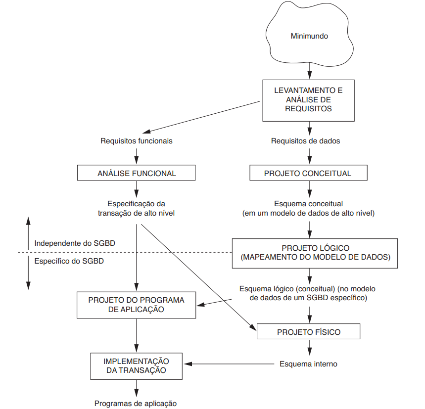
    
</div>

A primeira imagem acima representa o panorama das **Fases do Projeto de Banco de Dados**, que começa com a Coleta e Análise de Requisitos e avança para o Projeto Conceitual. Este fluxograma estabelece a ordem e a relação entre as etapas (Conceitual, Lógica e Física), guiando o desenvolvedor desde a descrição das necessidades do usuário até a implementação no SGBD.

Já na segunda imagem, exemplifica a fase de **Projeto Conceitual**, sendo um Diagrama ER/EER (Modelo Entidade-Relacionamento/Estendido). Utiliza-se essa notação gráfica de alto nível para formalizar a estrutura do banco de dados, mostrando os tipos de entidade, os atributos, os relacionamentos e as restrições que governam os dados (como a cardinalidade). Esta representação é crucial por ser independente de qualquer SGBD e servir como a especificação formal que será traduzida para o esquema lógico na fase seguinte.

---

## ELEMENTOS
### Entidades
O conceito de Entidade no MER refere-se a **algo do mundo real** com existência independente, seja ela **física ou conceitual**. O que é modelado é o Tipo de Entidade, a descrição abstrata de um conjunto de instâncias que compartilham os mesmos Atributos e estrutura. As entidades são puramente estruturais, focando no estado dos dados sem incluir **comportamentos (métodos)** como na programação orientada a objetos. Os atributos definem a informação da entidade e **possuem um domínio (conjunto de valores válidos)**. Um **Atributo-Chave** é crucial para identificar unicamente cada entidade. Os atributos são classificados como: **simples ou compostos** (ex: Endereço), monovalorados ou multivalorados (ex: Telefones), e armazenados ou derivados (ex: Idade). Todos esses detalhes devem ser formalmente registrados no **Dicionário de Dados.**

### Entidades fracas

* São entidades que dependem da existência de outras ou de identificação de outra entidade
* Instância subordinada e dominante
    * Ex.: "Dependente e cliente"

<table border="0">
  <tr>
    <td valign="top" style="width: 25%;">
      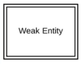
    </td>
    <td valign="top" style="width: 75%; padding-left: 15px;">
      *Entidades fracas dependem de algum outro tipo de entidade. Elas não possuem chaves primárias e não têm significância no diagrama sem sua entidade primária.*
    </td>
  </tr>
</table>

### Exemplos

<div align="center">
    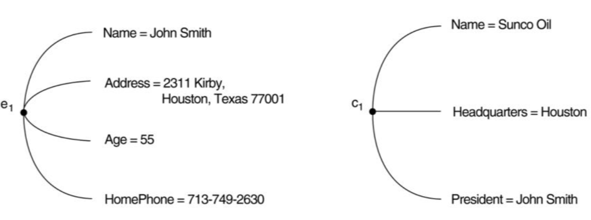
</div>
<div align="center">
  Duas entidades, empregado e1 e empresa c1, e seus atributos.
</div>


### 
<div align="center">
    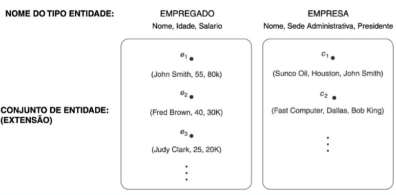
</div>
<div align="center">
  Dois tipos de entidade, EMPREGADO e EMPRESA, e algumas entidades-membro de cada um.
</div>


### Tipos de atributos

* **Atributos compostos**
    * Podem ser divididos em subpartes menores, que representam atributos básicos com significados independentes
    * Ex.: Endereço (cidade, estado, CEP, bairro, etc...)
* **Atributos simples**
    * São indivisíveis ou atômicos
* **Atributos Monovalorados e Multivalorados**
    * Valor único para cada entidade
    * Diversos valores para cada entidade
    * Ex.: Cor do carro, números de telefone


<div align="center">
    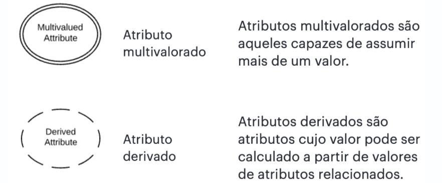
</div>


### Notação para diagramas ER:
<div align="center">
    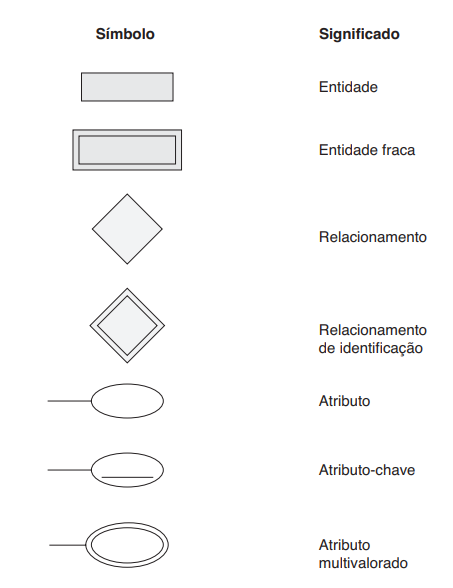
</div>

<div align="center">
    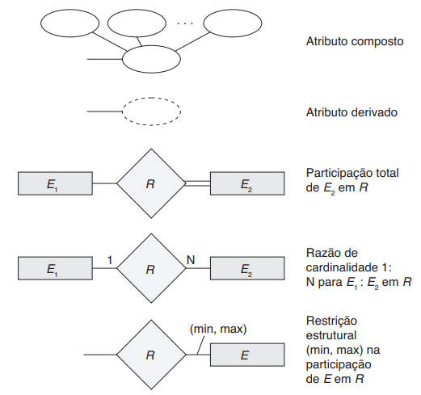
</div>


### Tipos de atributos

* **Armazenados e derivados**

Classificação que diferencia se o valor é guardado explicitamente (Armazenado) ou se é calculado/obtido a partir do valor de outros atributos relacionados (Derivado). O valor de um atributo derivado não é armazenado no banco de dados, mas pode ser determinado (calculado) a partir de um atributo armazenado, como no seu exemplo: *a Idade é derivada da Data de Nascimento*
    
* **Atributos complexos**
    * Atributos multivalorados organizados e agrupados

---
**Chaves** são um conjunto mínimo de atributos que identificam unicamente uma entidade num conjunto

* **Chave primária**

É uma das Chaves Candidatas que é escolhida pelo projetista do banco de dados para ser o identificador principal da relação. É o identificador mais importante, usado para referências e indexação.

* **Chave candidata**

É uma Superchave mínima. Mínima significa que se você remover qualquer atributo do conjunto, o restante dos atributos não será mais uma Superchave (perde a propriedade de unicidade).

* **Chaves compostas** 

Qualquer chave (Superchave, Candidata ou Primária) que consiste em dois ou mais atributos. Muitas vezes usada em tabelas resultantes de relacionamentos Muitos-para-Muitos.

* **Integridade de chaves** (Identificação, imutável, não reutilização)


### RELACIONAMENTOS

* É uma associação entre duas entidades
* Uma função que mapeia elementos de um tipo a outro
    * Ex. Um cliente *aluga* uma fita

<div align="center">
    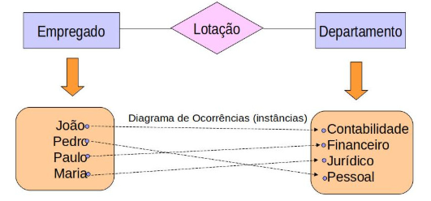
</div>


Garantimos que o Banco de Dados, que possui:

* Um conjunto de objetos classificados como pessoas (entidade EMPREGADO)
* Um conjunto de objetos classificados como departamentos (entidade DEPARTAMENTO)
* **Um conjuntos de associações, que ligam um departamento a uma pessoa.** (relacionamento LOTAÇÃO). --> tais associações são definidas por relacionamentos e implementadas de alguma forma no banco de dados.

---


<div align="center">
    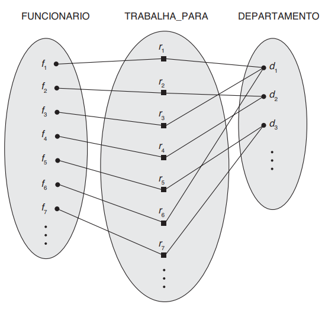
</div>


A imagem acima é uma visualização direta do Conjunto de Relacionamento, ilustrando como as associações ocorrem na prática no banco de dados. O losango central, que representa o Tipo de Relacionamento TRABALHA_PARA, define a regra de conexão entre as entidades FUNCIONARIO e DEPARTAMENTO. As linhas que partem do losango e unem instâncias específicas, como o funcionário $f_1$ ao departamento $d_1$, são as Instâncias de Relacionamento individuais. O diagrama, portanto, mostra a totalidade dos fatos registrados no sistema, agrupando visualmente os funcionários ($f_1, f_3, f_6$, etc.) sob seus respectivos departamentos, demonstrando o conjunto de relacionamento completo.

### Cardinalidade

É uma propriedade importante que diz respeito a **quantas (máxima e mínima) ocorrências** de uma entidade podem estar associadas a uma determinada ocorrência através do relacionamento

**Cardinalidade Mínima:** é o **número mínimo** de ocorrências de entidade associadas a uma ocorrência da entidade em questão através do relacionamento

**Cardinalidade Máxima:** é o **número máximo** de ocorrências de entidade associadas a uma ocorrência da entidade em questão através do relacionamento

### Tipos de Cardinalidade 

<table border="0">
  <tr>
    <td valign="top" style="width: 40%;">
      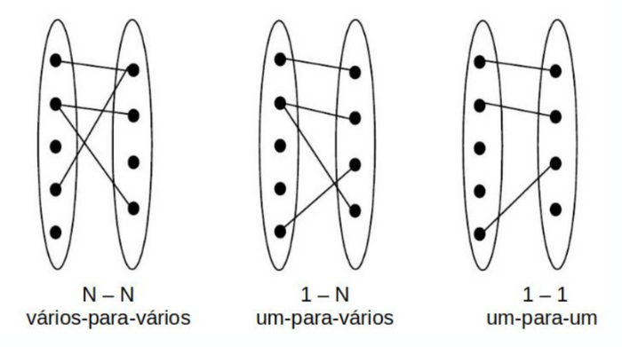
      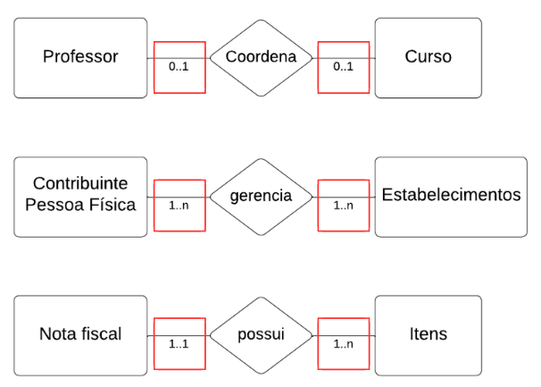
    </td>
    <td valign="top" style="width: 75%; padding-left: 15px;">
      <ul>
        <li>Muitos para muitos</li>
        <li>Um para Um</li>
        <li>Muitos para Um</li>
        <li>Um para Muitos</li>
      </ul>
    </td>
  </tr>
</table>

### Cardinalidade Notação "Pé-de-galinha"

Símbolos e notação de diagramas ER:
<div align="center">
    
</div>

----
Exemplo de diagrama com uso das cardinalidades:
<div align="center">
    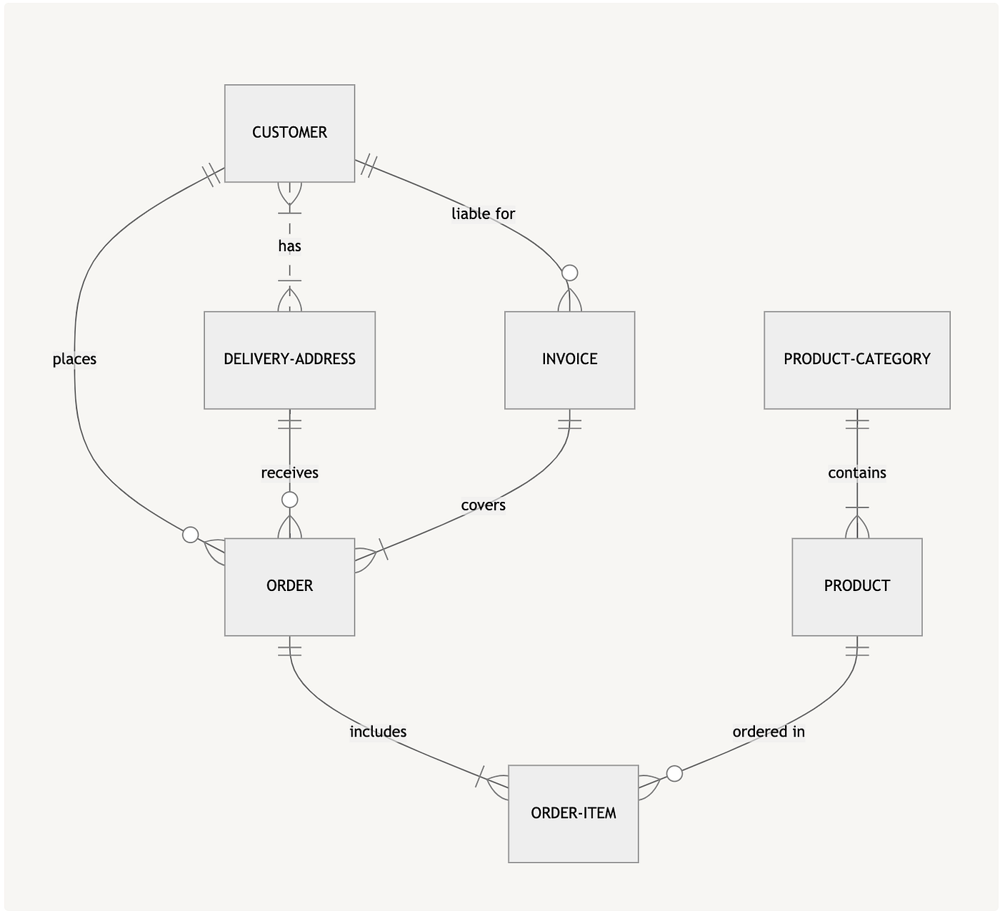
</div>


---
## RESTRIÇÕES DE INTEGRIDADE

* Delimitam o comportamento dos relacionamentos
    * Ex. Todo empregado deve estar num departamento
    * Todo dependente deve ter um cliente associado
* Cardinalidade
    * O número de instância que participam do relacionamento
* Totalidade
    * Obrigatoriedade da ocorrência das instâncias nos relacionamentos


## PRINCÍPIOS DE MODELAGEM CONCEITUAL

* Quando um conceito deveria ser modelado como entidade ou atributo?

Atributos descrevem propriedades de entidades. Se um conceito for significativo o suficiente para ter seus próprios atributos ou participar de múltiplos relacionamentos, ele deve ser uma Entidade. Caso contrário, é um Atributo.

* Quando um conceito deve ser modelado como relacionamento ou entidade

Um Relacionamento pode ser elevado a uma Entidade (chamada de Entidade de Relacionamento ou Entidade Associativa). Isso é necessário quando o relacionamento possui seus próprios atributos (Ex.: o relacionamento TRABALHA_PARA pode ter o atributo Data_de_Início) ou quando ele precisa participar em outros relacionamentos.

* Identificar relacionamentos binários e ternários
    * **Relacionamento Binário**: Envolve apenas dois tipos de entidade (Ex.: $E_1$ se relaciona com $E_2$). São os mais comuns e preferidos.
    * **Relacionamento Ternário**: Envolve três tipos de entidade (Ex.: FORNECEDOR, PEÇA, PROJETO em um relacionamento FORNECE).
* Restrições e regras de entidades
* Muita semântica deve ser capturada
* Algumas restrições não podem ser capturadas no modelo E/R
* Evitar redundância em seus projetos
* Problema do endereço (entidade ou atributos?)

## NOTAÇÕES

Existem diferentes representações/notações (ou "padronizações") para desenvolvimento de diagramas. Alguns modelos mais usados na literatura são:

* Notação de Barker **Barker's Notation**
* Notação de CHEN **Chen Notation**
* IDEF1X **IDEF1X Notation**
* Notação das Setas **Arrow Notation**
* UML **UML Notation**
* Notação "pé-de-galinha" **Crow's Foot Notation**

Neste [link](https://medium.com/@ericgcc/dont-get-wrong-explained-guide-to-choosing-a-database-design-notation-for-erd-in-a-while-7747925a7531) podemos encontrar um resumo sobre as notações mais utilizadas.

* É comum também encontrarmos autores, softwares, ferramentas cases, ides, etc. que usam notação própria ou uma mistura das notações mais conhecidas. Portanto, ao procurarem modelos ou ao estudarem material adicional podem encontrar exemplos de modelos ER que são construídos com símbolos de mais de uma dessas notações.
* Nesse outro [link](https://medium.com/@ericgcc/dont-get-wrong-explained-guide-to-choosing-a-database-design-notation-for-erd-in-a-while-7747925a7531)
 encontramos uma análise das notações Chen, Chen-alternativa, James Martin (IE ou Pé de Galinha), UML, Barker e IDEF1X (essa é só mencionada...veja porque...) mostrando softwares que possibilitam o design de cada uma delas.

<div align="center">
    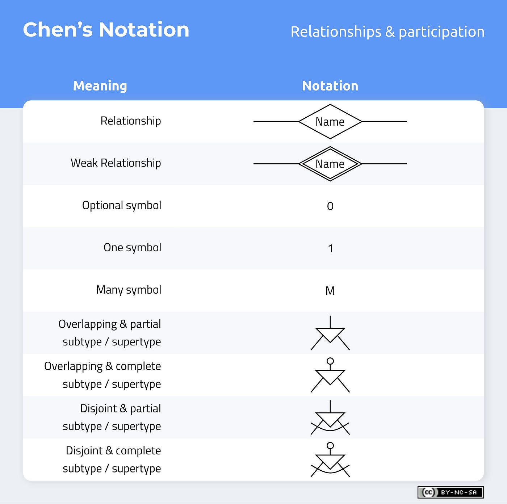
</div>


## ER-EXTENDIDO
<table border="0">
  <tr>
    <td valign="top" style="width: 40%;">
      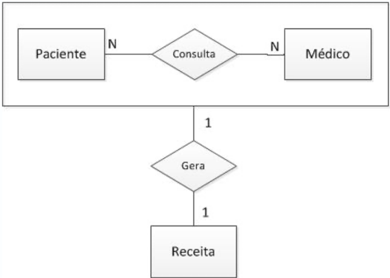
    </td>
    <td valign="top" style="width: 75%; padding-left: 15px;">
      <ul>
        <li>Herança</li>
        <li>Agregação </li>
        <li>Relacionamentos ternários e dependentes</li>
      </ul>
    </td>
  </tr>
</table>


---
### James Martin

* A notação James Martin tem o objetivo de produzir diagramas enxutos;
* O diagrama possui mais simbolismos;
* Apenas relacionamentos binários são aceitos


<div align="center">
    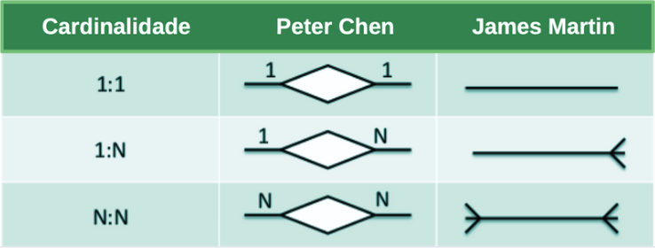
</div>
 
---

<table border="0" style="width: 70%; margin: 0 auto;">
  <tr>
    <td valign="top" style="width: 60%;">
      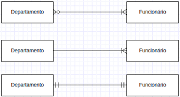
    </td>
    <td valign="top" style="width: 60%; padding-left: 15px;">
      <ul>
        <li>Cardinalidade <strong>N:N</strong></li>
        <li>Cardinalidade <strong>1:N</strong></li>
        <li>Cardinalidade <strong>1:1</strong></li>
      </ul>
    </td>
  </tr>
</table>


### Resumo / James Martin
<div align="center">
    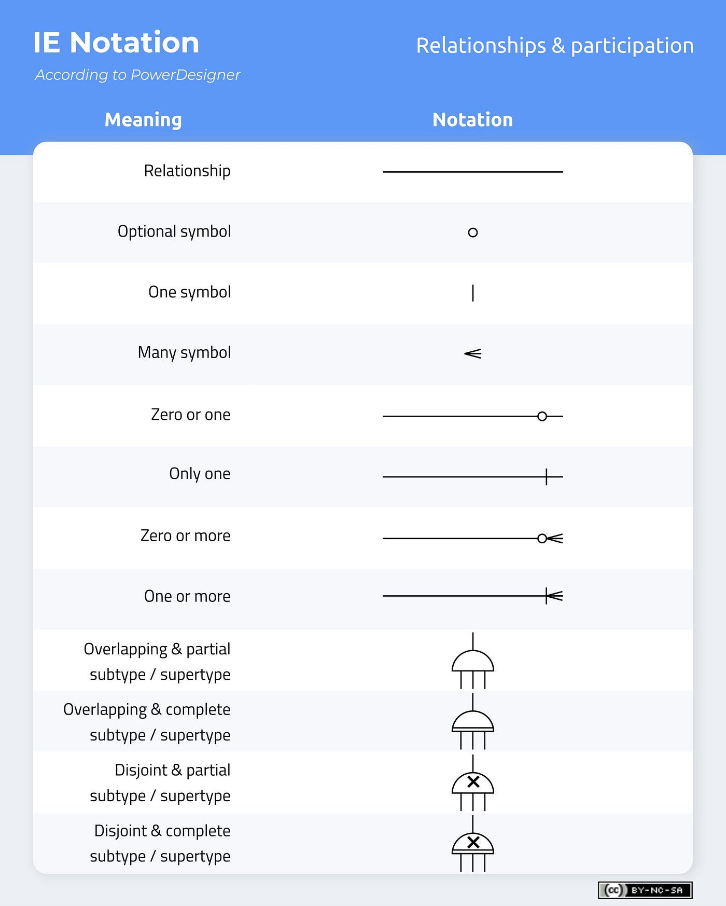
</div>


## CONTATO

* **Telefone:** +55 83 996577959 
* **E-mail:** fabioleite@servidor.uepb.edu.br 
* **Endereço:** Universidade Estadual da Paraíba, Campus I - Campina Grande, PB


<div class="page-break"></div>

# Parte 05 — Exercícios de Modelagem Entidade-Relacionamento

## Exercícios de Modelagem Entidade-Relacionamento

A seguir estão exercícios práticos de modelagem entidade-relacionamento (MER) com base em cenários da fiscalização tributária, especialmente envolvendo EFD, NF-e e itens de NF-e.

### 1. Identificação de entidades

Considere o cenário abaixo:

- Uma empresa emite notas fiscais eletrônicas (NF-e).
- Cada NF-e possui vários itens.
- A Escrituração Fiscal Digital (EFD) registra documentos fiscais de uma empresa em determinado período.

#### Exercício 1
Liste as entidades principais que deveriam existir nesse cenário e indique pelo menos dois atributos para cada uma.

Exemplo de resposta esperada:

- `CONTRIBUINTE` — `id_contribuinte`, `cnpj`, `razao_social`
- `NFE` — `id_nfe`, `chave_acesso`, `valor_total`
- `ITEM_NFE` — `id_item`, `descricao`, `valor_item`
- `EFD` — `id_efd`, `periodo`, `data_inicial`, `data_final`

---

### 2. Definição de relacionamentos

#### Exercício 2
Represente, em linguagem natural, os relacionamentos entre as entidades abaixo:

- Um contribuinte emite várias NF-e.
- Cada NF-e possui vários itens.
- Uma EFD pode registrar várias NF-e ou documentos fiscais.

Resposta esperada:

- Um `CONTRIBUINTE` emite uma ou muitas `NFE`.
- Uma `NFE` possui um ou muitos `ITEM_NFE`.
- Uma `EFD` registra uma ou muitas `NFE`.

---

### 3. Transformação para modelo ER

#### Exercício 3
Desenhe o modelo ER simplificado para este cenário usando cardinalidade:

- `CONTRIBUINTE` 1:N `NFE`
- `NFE` 1:N `ITEM_NFE`
- `EFD` 1:N `NFE`

Dica: utilize o conceito de:

- um para muitos;
- muitos para muitos apenas quando houver necessidade real de uma tabela associativa.

---

### 4. Modelagem de atributos e chaves

#### Exercício 4
Para a entidade `NFE`, defina:

- uma chave primária;
- uma chave candidata;
- pelo menos dois atributos obrigatórios;
- um atributo opcional.

Exemplo:

- `id_nfe` → chave primária
- `chave_acesso` → chave candidata
- `data_emissao` → atributo obrigatório
- `observacao` → atributo opcional

---

### 5. Exercício com tabelas fiscais reais

#### Exercício 5
Considere as seguintes entidades:

- `EFD_0000` — cabeçalho da escrituração fiscal
- `EFD_C100` — documentos fiscais registrados na EFD
- `EFD_C170` — itens dos documentos fiscais

Elabore o relacionamento entre elas e justifique sua resposta.

Resposta esperada:

- `EFD_0000` 1:N `EFD_C100`
- `EFD_C100` 1:N `EFD_C170`

Isso ocorre porque uma escrituração possui vários registros de documentos e cada documento possui vários itens.

---

### 6. Exercício de normalização simples

#### Exercício 6
Considere a seguinte tabela:

`NFE` com os atributos: `id_nfe`, `chave_acesso`, `emitente`, `valor_total`, `item_descricao`, `item_valor`

Identifique o problema de modelagem e proponha uma estrutura melhor.

Resposta esperada:

- A tabela mistura informações da NF-e com informações dos itens.
- O ideal é separar em duas entidades: `NFE` e `ITEM_NFE`.

---

### 7. Exercício de criação de diagrama Mermaid

#### Exercício 7
Crie um diagrama Mermaid com as entidades:

- `CONTRIBUINTE`
- `NFE`
- `ITEM_NFE`
- `EFD`

E especifique as cardinalidades entre elas.

Exemplo de estrutura inicial:

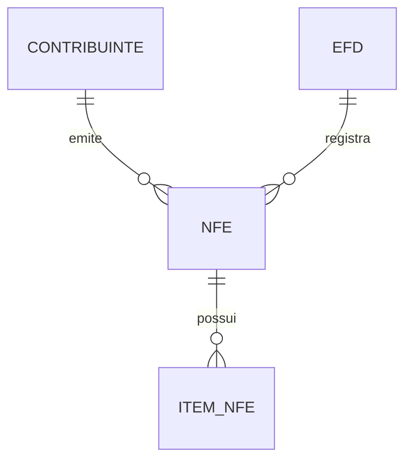
```mermaid
erDiagram
    CONTRIBUINTE ||--o{ NFE : emite
    NFE ||--o{ ITEM_NFE : possui
    EFD ||--o{ NFE : registra
```

---

### 8. Exercício de interpretação

#### Exercício 8
Leia a seguinte situação:

> Uma NF-e foi cadastrada, mas um de seus itens foi inserido sem referenciar corretamente a nota.

Quais problemas isso pode causar na fiscalização tributária?

Resposta esperada:

- inconsistência entre os dados;
- dificuldade de cruzamento entre NF-e e EFD;
- erros em relatórios e auditoria;
- risco de apuração tributária incorreta.

---

### 9. Exercício de conclusão

#### Exercício 9
Elabore um modelo conceitual simplificado para um sistema de fiscalização tributária que deve armazenar:

- contribuintes;
- notas fiscais eletrônicas;
- itens de NF-e;
- escrituração fiscal digital.

Seu modelo deve conter:

- entidades;
- atributos;
- relacionamentos;
- cardinalidades.

---

### 10. Gabarito resumido

- `CONTRIBUINTE` 1:N `NFE`
- `NFE` 1:N `ITEM_NFE`
- `EFD` 1:N `NFE` ou `EFD` 1:N `EFD_C100`
- `EFD_C100` 1:N `EFD_C170`
- A separação entre cabeçalho e detalhe é essencial para evitar redundância e facilitar a auditoria.

