# 03.07 – Serviços de um SGBD

> **Observação:** Este capítulo apresenta os principais serviços oferecidos por um Sistema Gerenciador de Banco de Dados (SGBD).

## Conteúdo

1. Introdução
2. Persistência
3. Segurança
4. Backup e recuperação de falhas
5. Logging
6. Otimização de consultas
7. Performance Tuning
8. Replicação
9. Suporte a aplicações avançadas
10. Data Warehouse
11. Data Mining
12. Machine Learning
13. Business Intelligence
14. Exercícios Propostos
15. Referências

---

# Introdução

Um SGBD moderno oferece muito mais do que armazenamento de dados. Entre seus serviços estão persistência, segurança, recuperação de falhas, otimização de consultas, replicação, suporte analítico e integração com BI e Machine Learning.

> **Este arquivo é um modelo estruturado para o capítulo.** Expanda cada seção conforme o material do curso.

## 2. Persistência

Persistência refere-se à forma como os dados são armazenados de maneira durável em disco e recuperados pelo SGBD. Componentes importantes:

- Storage engine: gerencia páginas (8 KB no SQL Server), extents (conjunto de páginas) e alocação de espaço.
- Transações e ACID: Atomicidade, Consistência, Isolamento e Durabilidade garantem integridade mesmo em falhas.
- MVCC vs locking: mecanismos para controlar concorrência e visibilidade de versões.

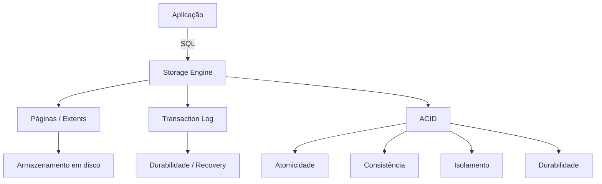

Exemplo prático (SQL Server): transação com rollback/commit

```sql
BEGIN TRANSACTION;
INSERT INTO Clientes (Nome, Email) VALUES ('Ana', 'ana@exemplo.com');
-- validar alterações
IF (@@ERROR = 0)
	COMMIT TRANSACTION;
ELSE
	ROLLBACK TRANSACTION;
```

Boas práticas: projetar transações curtas, escolher esquema de armazenamento adequado (heap vs clustered), e manter estatísticas atualizadas.

## 3. Segurança

Segurança em SGBD cobre autenticação, autorização, criptografia e auditoria.

- Autenticação: login de usuários (Windows Auth vs SQL Auth no SQL Server).
- Autorização: permissões (GRANT/REVOKE), roles e separation of duties.
- Roles: agrupar permissões (ex.: db_datareader, db_datawriter, custom roles).
- Criptografia: TDE (Transparent Data Encryption) para dados em disco; Always Encrypted para proteger colunas sensíveis; TLS para conexões.
- Auditoria: uso de logs, SQL Audit/Extended Events para rastrear atividades.

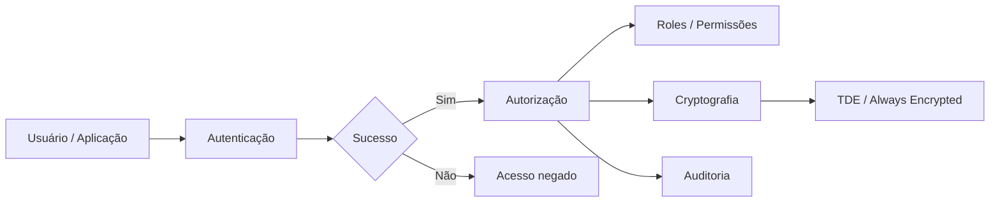

Exemplo (criar role e conceder permissão):

```sql
CREATE ROLE app_readonly;
GRANT SELECT ON SCHEMA::dbo TO app_readonly;
EXEC sp_addrolemember 'app_readonly', 'usuario_app';
```

## 4. Backup e Recuperação

Tipos principais de backup:

- Full: captura todo o banco.
- Differential: captura mudanças desde o último full.
- Transaction log (ou incremental): permite point-in-time recovery.

Recovery models (SQL Server): SIMPLE, BULK_LOGGED, FULL — definem comportamento de logging e possibilidade de restauração ponto-a-ponto.

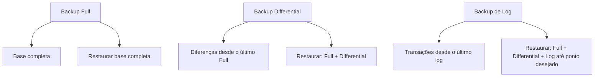

Exemplo (SQL Server): backup full e log

```sql
BACKUP DATABASE MeuBanco TO DISK = 'C:\backups\MeuBanco_full.bak' WITH FORMAT;
BACKUP LOG MeuBanco TO DISK = 'C:\backups\MeuBanco_log.trn';
```

Políticas: definir frequência de backups, retenção e testar restores regularmente.

## 5. Logging

O logging garante durabilidade e recuperação. Padrões comuns:

- Transaction log (SQL Server): registro sequencial de operações que permite rollback e recuperação.
- Write-Ahead Logging (WAL): garantir que modificações de log sejam escritas antes das páginas de dados.
- Rollback/Redo: durante recovery, o motor aplica redo e undo conforme necessário.

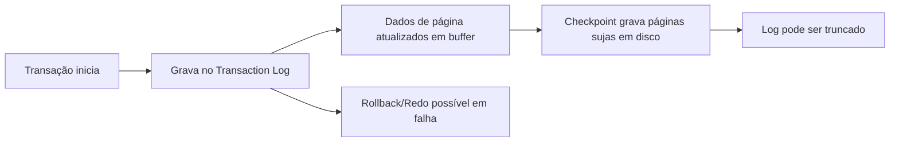

Impacto operacional: gerenciamento do tamanho do log, checkpoints e truncation (dependem do recovery model).

## 6. Otimização de Consultas

O otimizador transforma SQL em um plano de execução. Elementos relevantes:

- Estatísticas: informações sobre distribuição de dados que guiam o otimizador.
- Índices: permitem seeks vs scans; escolha de chaves e includes influencia planos.
- Hints e reescrita de consultas: quando necessário para forçar planos.

Exemplo: ver plano estimado/executado no SSMS; usar `SET STATISTICS IO ON` para medir I/O.

```sql
SET STATISTICS IO ON;
SELECT * FROM Pedidos WHERE ClienteId = 123;
SET STATISTICS IO OFF;
```

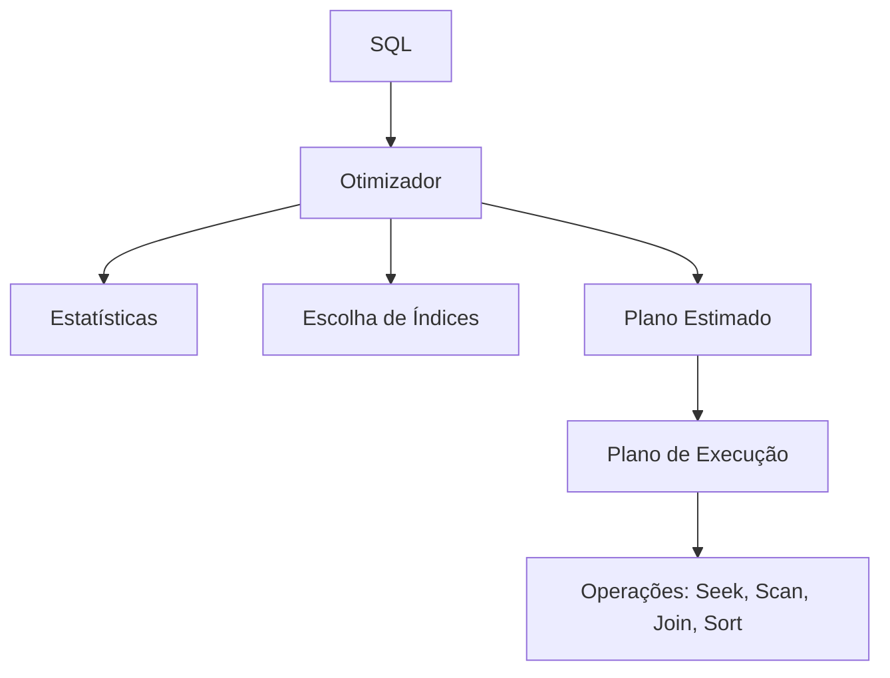

## 7. Performance Tuning

Atividades típicas:

- Identificar gargalos com wait stats, DMVs e Query Store.
- Criar/ajustar índices (incluindo índices filtrados e índices columnstore para analytics).
- Particionamento para gerenciar I/O e manutenção.
- Compressão de dados e escolha de tipos adequados.

Ferramentas: `sys.dm_exec_query_stats`, `sys.dm_db_index_physical_stats`, Performance Monitor, Query Store.

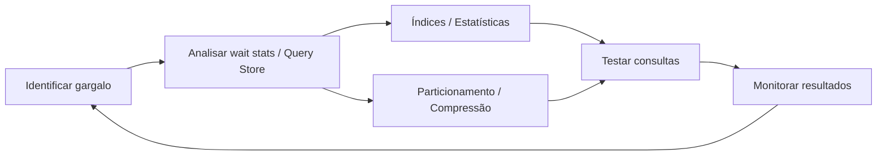

## 8. Replicação

Modelos de replicação:

- Snapshot: envia cópia completa periodicamente — simples, sem latência mínima.
- Transacional: replica mudanças continuamente (baixo latency) — bom para sincronização OLTP.
- Replicação física (log shipping, Always On Availability Groups): cópias redundantes para alta disponibilidade.
- Replicação lógica: replicação de dados a nível lógico (geral) e tipos de publicação/assinatura.

Escolha baseada em requisitos de RTO/RPO, consistência e topologia.

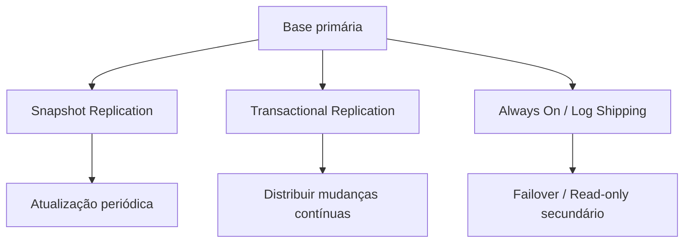

## 9. Suporte a aplicações avançadas

Funcionalidades modernas que um SGBD pode oferecer:

- JSON / XML: armazenamento e consulta de documentos (ex.: `OPENJSON`, `FOR JSON` no SQL Server).
- Spatial: tipos e funções geoespaciais (ex.: `geometry`, `geography`).
- Full-Text Search: índices de texto para buscas linguísticas.
- Stored Procedures e Triggers: lógica próxima aos dados (cuidado com complexidade e manutenção).

Exemplo JSON (SQL Server):

```sql
SELECT * FROM Clientes
WHERE JSON_VALUE(DocumentoJson, '$.tipo') = 'CPF';
```

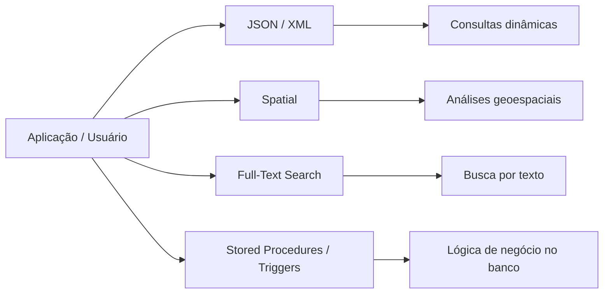

## 10. Data Warehouse

Conceitos principais:

- ETL/ELT: extrair, transformar e carregar dados para o armazém.
- OLTP × OLAP: transacional vs analítico (latência, agregação e schema diferentes).
- Modelos: Star schema (fatos e dimensões), Snowflake.
- Slowly Changing Dimensions (SCD) para lidar com mudanças históricas.

Processos típicos: carga inicial (bulk), atualizações incrementais, atualização de estatísticas e manutenção de agregações.

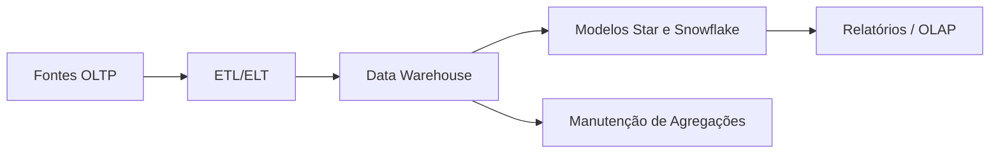

## 11. Data Mining

Definição e aplicações:

- Técnicas: clustering, classification, association rules, and anomaly detection.
- Ferramentas: bibliotecas e serviços que integraram-se a SGBDs (ex.: SQL Server Analysis Services histórico; atualmente integração com R/Python e ferramentas externas).

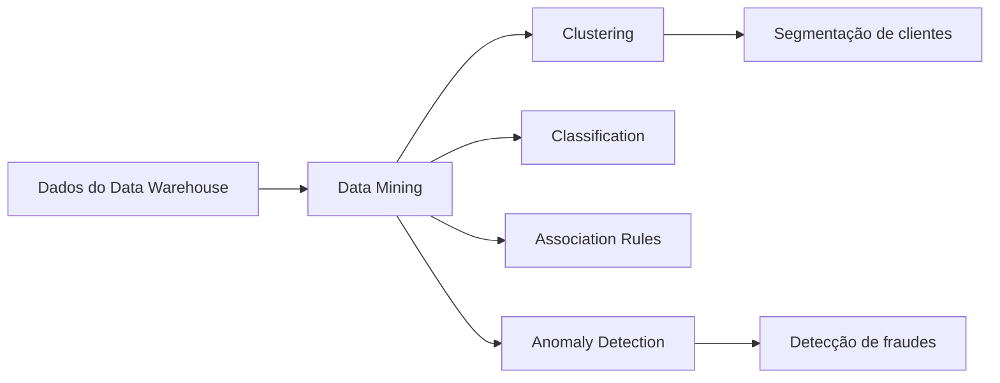

Exemplo de uso: gerar clusters de clientes para segmentação de marketing.

## 12. Machine Learning

Integração com SGBD:

- Treinar modelos usando dados diretamente no banco (SQL Server Machine Learning Services integra R/Python).
- Operacionalizar modelos: scoring em tempo real via procedures ou serviços externos.

Boas práticas: preparar dados no banco, extrair features, treinar fora do horário crítico e implantar modelos de forma controlada.

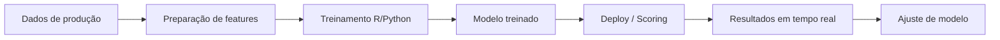

## 13. Business Intelligence

Componentes:

- ETL/ELT para alimentar modelos analíticos.
- Cubos/Modelos semânticos e camadas de apresentação.
- Ferramentas de visualização: Power BI, Tableau, etc.

Padrões: criação de uma camada semântica, tabelas agregadas e índices/columnstore para acelerar relatórios.

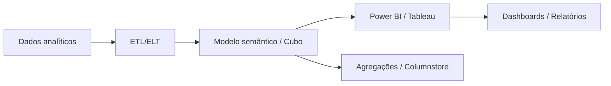

## 14. Exercícios Propostos

1. Explique o modelo ACID e dê um exemplo de como cada propriedade é garantida pelo SGBD.

2. Configure um plano de backup para um banco com alta criticidade (descreva full/diff/log e frequência).

3. Dado um workload OLTP com lentidão em consultas por cliente, descreva um processo de diagnóstico e as possíveis soluções (índices, estatísticas, reescrita de query).

4. Modele um Star Schema simples para vendas (fato Vendas e dimensões Cliente, Produto, Tempo) e escreva uma query que calcule vendas por mês e categoria.

5. Compare `SELECT INTO` e `CREATE TABLE` + `INSERT` e descreva quando cada abordagem é mais adequada.

## 15. Referências

- Elmasri, R. & Navathe, S. — Fundamentals of Database Systems.
- Silberschatz, A.; Korth, H. F.; Sudarshan, S. — Database System Concepts.
- Date, C. J. — An Introduction to Database Systems.
- Microsoft Docs — SQL Server documentation: https://docs.microsoft.com/sql
- Brent Ozar, SQLServerCentral, SQLskills — blogs e artigos técnicos.

