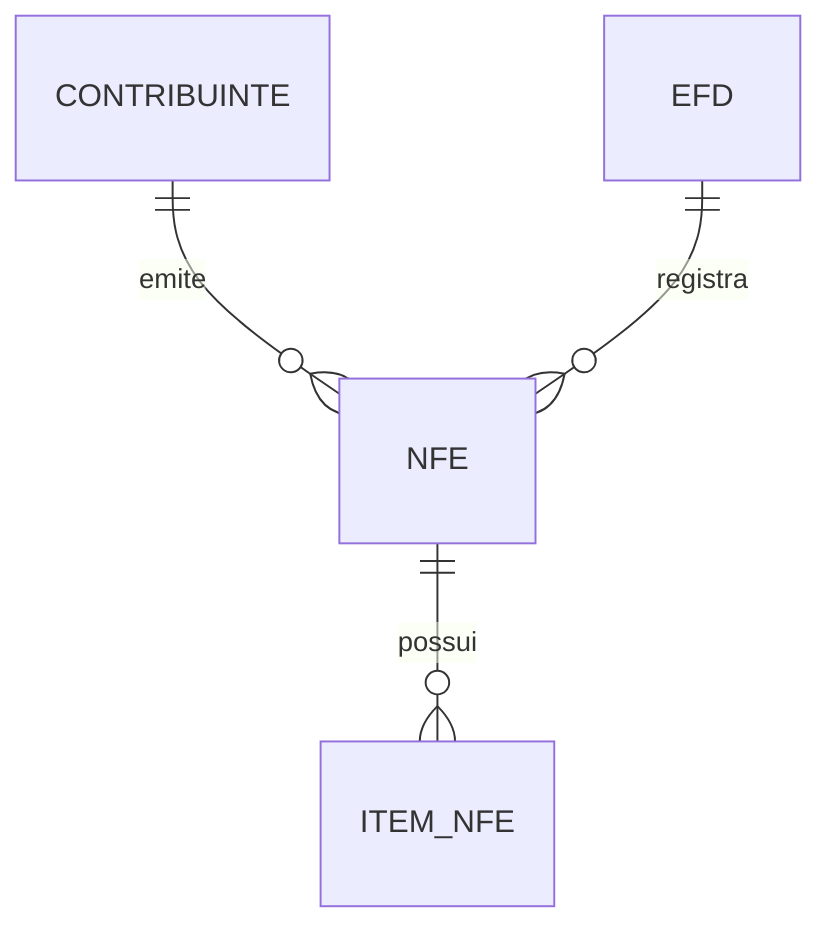

# Exercícios de Modelagem Entidade-Relacionamento

A seguir estão exercícios práticos de modelagem entidade-relacionamento (MER) com base em cenários da fiscalização tributária, especialmente envolvendo EFD, NF-e e itens de NF-e.

## 1. Identificação de entidades

Considere o cenário abaixo:

- Uma empresa emite notas fiscais eletrônicas (NF-e).
- Cada NF-e possui vários itens.
- A Escrituração Fiscal Digital (EFD) registra documentos fiscais de uma empresa em determinado período.

### Exercício 1
Liste as entidades principais que deveriam existir nesse cenário e indique pelo menos dois atributos para cada uma.

Exemplo de resposta esperada:
- `CONTRIBUINTE` — `id_contribuinte`, `cnpj`, `razao_social`
- `NFE` — `id_nfe`, `chave_acesso`, `valor_total`
- `ITEM_NFE` — `id_item`, `descricao`, `valor_item`
- `EFD` — `id_efd`, `periodo`, `data_inicial`, `data_final`

---

## 2. Definição de relacionamentos

### Exercício 2
Represente, em linguagem natural, os relacionamentos entre as entidades abaixo:

- Um contribuinte emite várias NF-e.
- Cada NF-e possui vários itens.
- Uma EFD pode registrar várias NF-e ou documentos fiscais.

Resposta esperada:
- Um `CONTRIBUINTE` emite uma ou muitas `NFE`.
- Uma `NFE` possui um ou muitos `ITEM_NFE`.
- Uma `EFD` registra uma ou muitas `NFE`.

---

## 3. Transformação para modelo ER

### Exercício 3
Desenhe o modelo ER simplificado para este cenário usando cardinalidade:

- `CONTRIBUINTE` 1:N `NFE`
- `NFE` 1:N `ITEM_NFE`
- `EFD` 1:N `NFE`

Dica: utilize o conceito de:
- um para muitos;
- muitos para muitos apenas quando houver necessidade real de uma tabela associativa.

---

## 4. Modelagem de atributos e chaves

### Exercício 4
Para a entidade `NFE`, defina:
- uma chave primária;
- uma chave candidata;
- pelo menos dois atributos obrigatórios;
- um atributo opcional.

Exemplo:
- `id_nfe` → chave primária
- `chave_acesso` → chave candidata
- `data_emissao` → atributo obrigatório
- `observacao` → atributo opcional

---

## 5. Exercício com tabelas fiscais reais

### Exercício 5
Considere as seguintes entidades:
- `EFD_0000` — cabeçalho da escrituração fiscal
- `EFD_C100` — documentos fiscais registrados na EFD
- `EFD_C170` — itens dos documentos fiscais

Elabore o relacionamento entre elas e justifique sua resposta.

Resposta esperada:
- `EFD_0000` 1:N `EFD_C100`
- `EFD_C100` 1:N `EFD_C170`

Isso ocorre porque uma escrituração possui vários registros de documentos e cada documento possui vários itens.

---

## 6. Exercício de normalização simples

### Exercício 6
Considere a seguinte tabela:

`NFE` com os atributos: `id_nfe`, `chave_acesso`, `emitente`, `valor_total`, `item_descricao`, `item_valor`

Identifique o problema de modelagem e proponha uma estrutura melhor.

Resposta esperada:
- A tabela mistura informações da NF-e com informações dos itens.
- O ideal é separar em duas entidades: `NFE` e `ITEM_NFE`.

---

## 7. Exercício de criação de diagrama Mermaid

### Exercício 7
Crie um diagrama Mermaid com as entidades:
- `CONTRIBUINTE`
- `NFE`
- `ITEM_NFE`
- `EFD`

E especifique as cardinalidades entre elas.

Exemplo de estrutura inicial:

---

## 8. Exercício de interpretação

### Exercício 8
Leia a seguinte situação:

> Uma NF-e foi cadastrada, mas um de seus itens foi inserido sem referenciar corretamente a nota.

Quais problemas isso pode causar na fiscalização tributária?

Resposta esperada:
- inconsistência entre os dados;
- dificuldade de cruzamento entre NF-e e EFD;
- erros em relatórios e auditoria;
- risco de apuração tributária incorreta.

---

## 9. Exercício de conclusão

### Exercício 9
Elabore um modelo conceitual simplificado para um sistema de fiscalização tributária que deve armazenar:
- contribuintes;
- notas fiscais eletrônicas;
- itens de NF-e;
- escrituração fiscal digital.

Seu modelo deve conter:
- entidades;
- atributos;
- relacionamentos;
- cardinalidades.

---

## 10. Gabarito resumido

- `CONTRIBUINTE` 1:N `NFE`
- `NFE` 1:N `ITEM_NFE`
- `EFD` 1:N `NFE` ou `EFD` 1:N `EFD_C100`
- `EFD_C100` 1:N `EFD_C170`
- A separação entre cabeçalho e detalhe é essencial para evitar redundância e facilitar a auditoria.
