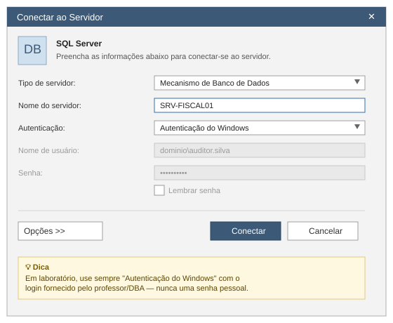
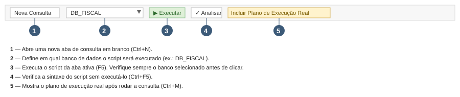
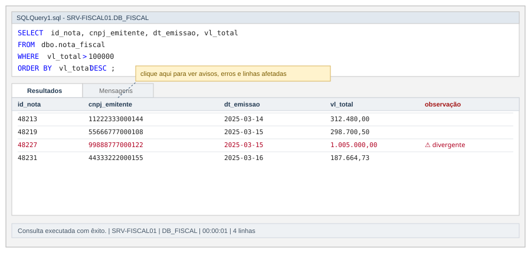

# Introdução ao Ambiente do SQL Server Management Studio (SSMS)

**Professor:** Dr. Fábio Leite
**Instituição:** Universidade Estadual da Paraíba — UEPB, Campina Grande, PB
**Módulo:** 01 — Fundamentos de Banco de Dados
**Pré-requisito:** SQL Server e SSMS instalados — ver [03 introducao-pratico.md](03%20introducao-pratico.md)

---

## Sumário

1. [Apresentação e objetivos](#1-apresentação-e-objetivos)
2. [O cenário condutor: a auditoria da nota fiscal](#2-o-cenário-condutor-a-auditoria-da-nota-fiscal)
3. [Abrindo o SSMS e conectando ao servidor](#3-abrindo-o-ssms-e-conectando-ao-servidor)
4. [Tour pelo ambiente do SSMS](#4-tour-pelo-ambiente-do-ssms)
5. [Personalizando o ambiente de trabalho](#5-personalizando-o-ambiente-de-trabalho)
6. [Roteiro prático guiado](#6-roteiro-prático-guiado)
7. [Exercícios propostos](#7-exercícios-propostos)
8. [Checklist de fixação](#8-checklist-de-fixação)
9. [Glossário](#9-glossário)
10. [Referências](#10-referências)

---

## 1. Apresentação e objetivos

O **SQL Server Management Studio (SSMS)** é a principal ferramenta gráfica para administrar e consultar bancos de dados SQL Server. Antes de escrever a primeira consulta, é preciso saber **onde** cada coisa fica na tela: onde estão as tabelas, onde se digita um script, onde aparece o resultado e onde aparecem os erros.

Ao final deste roteiro, você será capaz de:

- abrir o SSMS e conectar-se a uma instância de servidor;
- identificar e nomear corretamente cada painel da janela principal (Pesquisador de Objetos, Editor de Consultas, Resultados, Mensagens, Barra de Status);
- criar uma nova consulta, executá-la e interpretar o resultado;
- navegar pela árvore de objetos de um banco de dados para localizar tabelas e colunas;
- aplicar pequenos ajustes de personalização que tornam o dia a dia mais produtivo.

Todo o roteiro é conduzido por um **exemplo único**, descrito a seguir, para que cada clique tenha um propósito concreto em vez de ser um exercício abstrato.

---

## 2. O cenário condutor: a auditoria da nota fiscal

> Ao longo de toda a apostila usaremos a mesma história. Sempre que um passo pedir para "executar uma consulta", ele estará avançando essa investigação.

Você é **auditor(a) fiscal** e acabou de receber a tarefa de revisar as notas fiscais eletrônicas (NF-e) emitidas por contribuintes de grande porte no último trimestre. A equipe de TI já disponibilizou, na instância `SRV-FISCAL01`, um banco de dados chamado **`DB_FISCAL`**, com (entre outras) duas tabelas principais:

| Tabela | Conteúdo |
|---|---|
| `dbo.contribuinte` | Cadastro das empresas (CNPJ, razão social, regime tributário) |
| `dbo.nota_fiscal` | Notas fiscais emitidas (valor total, data de emissão, contribuinte emitente) |

**A pergunta que você precisa responder usando o SSMS:** *existe alguma nota fiscal com valor muito acima do padrão do contribuinte, que mereça ser sinalizada para análise mais profunda?*

Esse é o fio condutor: cada seção deste roteiro te aproxima de abrir o SSMS, encontrar essas tabelas e rodar a consulta que responde a essa pergunta.

---

## 3. Abrindo o SSMS e conectando ao servidor

1. No menu **Iniciar** do Windows, digite `SSMS` e abra o **Microsoft SQL Server Management Studio**.
2. A janela **"Conectar ao Servidor"** aparece automaticamente (Figura 1). Preencha:
   - **Tipo de servidor:** `Mecanismo de Banco de Dados`
   - **Nome do servidor:** `SRV-FISCAL01` (em laboratório, normalmente `localhost`)
   - **Autenticação:** `Autenticação do Windows` — use sempre o login institucional fornecido, nunca uma senha pessoal.
3. Clique em **Conectar**.



*Figura 1 — Diálogo inicial de conexão. É aqui que você informa **a quem** (servidor) e **como** (autenticação) o SSMS deve se conectar.*

> ⚠️ **Problema comum:** se aparecer *"Não foi possível estabelecer conexão"*, confirme o nome do servidor com o professor/DBA e verifique se o serviço `SQL Server (MSSQLSERVER)` está em execução (Gerenciador de Configurações do SQL Server).

---

## 4. Tour pelo ambiente do SSMS

Depois de conectado, a janela principal do SSMS se abre com vários painéis. A Figura 2 mostra o layout completo já usado com nosso cenário fiscal.


*Figura 2 — Visão geral: (1) barra de menus e ferramentas no topo, (2) Pesquisador de Objetos à esquerda, (3) Editor de Consultas no centro-superior, (4) grade de Resultados no centro-inferior.*

### 4.1 Barra de menus e barra de ferramentas

Logo abaixo do título da janela ficam o **menu** (Arquivo, Editar, Exibir, Consulta, Projeto, Ferramentas, Janela, Ajuda) e a **barra de ferramentas**, com os botões usados a cada poucos segundos de trabalho. A Figura 3 detalha os mais importantes.



*Figura 3 — Botões essenciais: nova consulta, seletor do banco de dados ativo, executar, analisar sintaxe e plano de execução real.*

> 🎯 **Aplicando ao cenário:** antes de consultar `dbo.nota_fiscal`, confira sempre o item **2** (seletor de banco) — se estiver em `master` em vez de `DB_FISCAL`, a consulta falhará ou, pior, será executada no banco errado.

### 4.2 Pesquisador de Objetos (*Object Explorer*)

É o painel em árvore à esquerda (item 2 da Figura 2). Nele você navega por:

```
SRV-FISCAL01 (SQL Server 16.0)
 └─ Bancos de Dados
     └─ DB_FISCAL
         └─ Tabelas
             ├─ dbo.contribuinte
             └─ dbo.nota_fiscal
                 ├─ Colunas
                 │   ├─ [PK] id_nota
                 │   ├─ cnpj_emitente
                 │   ├─ dt_emissao
                 │   └─ vl_total
                 └─ Índices
```

Para **encontrar a tabela do nosso cenário**: expanda `DB_FISCAL` → `Tabelas` → `dbo.nota_fiscal` → `Colunas`. É assim que você confirma o nome exato das colunas antes de escrever uma consulta — evita erros de digitação e economiza tempo.

> 💡 Clique com o botão direito sobre `dbo.nota_fiscal` → **Selecionar as 1000 Linhas Principais** para gerar automaticamente um `SELECT` de exemplo — ótimo atalho para quem está começando.

### 4.3 Editor de Consultas

É a área de texto onde os comandos T-SQL são digitados (item 3 da Figura 2). Cada aba aberta é uma consulta independente, identificada pelo nome do arquivo (`SQLQuery1.sql`) e pelo servidor/banco ao qual está conectada — informação sempre visível no topo da aba.

Para abrir uma nova aba: clique em **Nova Consulta** (Ctrl+N) — item 1 da Figura 3.

### 4.4 Painel de Resultados e Mensagens

Depois de executar uma consulta (F5), o resultado aparece na parte inferior, dividido em duas abas (Figura 4):

- **Resultados** — a grade com as linhas retornadas (o que a consulta *achou*).
- **Mensagens** — avisos, erros de sintaxe e o número de linhas afetadas (o que o SQL Server *tem a dizer* sobre a execução).



*Figura 4 — Consulta buscando notas fiscais de alto valor. A linha destacada em vermelho é exatamente o tipo de registro que a auditoria deveria examinar.*

> 🔎 **Lendo o resultado do cenário:** a nota `48227`, do CNPJ `99888777000122`, aparece com valor muito acima das demais (R$ 1.005.000,00). Isso não prova irregularidade sozinho, mas é o tipo de **divergência estatística** que justifica abrir um caso de análise mais aprofundada — exatamente a pergunta feita na seção 2.

### 4.5 Barra de status

A faixa cinza no rodapé da janela mostra, da esquerda para a direita: se a consulta teve êxito, o servidor conectado, o banco de dados ativo, o tempo de execução e o número de linhas retornadas. É a primeira coisa a olhar quando uma consulta "não aparenta ter feito nada".

---

## 5. Personalizando o ambiente de trabalho

Pequenos ajustes economizam tempo ao longo do curso:

| O que ajustar | Caminho no menu | Por quê |
|---|---|---|
| Numeração de linhas no editor | `Ferramentas → Opções → Editor de Texto → Transact-SQL → Geral` → marcar *Números de linha* | Facilita apontar erros ("erro na linha 12") |
| Tamanho da fonte | `Ferramentas → Opções → Ambiente → Fontes e Cores` | Legibilidade em projetor/sala de aula |
| Nome de exibição da conexão | Clicar com o botão direito no servidor no Object Explorer → *Registered Servers* | Útil quando há vários servidores (produção, homologação, treinamento) |
| Confirmação antes de salvar em produção | `Ferramentas → Opções → Editor de Consultas → Execução` → *SET ROWCOUNT* e afins | Evita rodar scripts pesados sem querer |

**Atalhos de teclado essenciais:**

| Atalho | Ação |
|---|---|
| `Ctrl + N` | Nova consulta |
| `F5` (ou `Ctrl + E`) | Executar a consulta |
| `Ctrl + F5` | Analisar sintaxe sem executar |
| `Ctrl + K, Ctrl + C` | Comentar linhas selecionadas |
| `Ctrl + K, Ctrl + U` | Descomentar linhas selecionadas |
| `Ctrl + Shift + U` / `L` | Maiúsculas / minúsculas na seleção |
| `Ctrl + M` | Incluir plano de execução real |

---

## 6. Roteiro prático guiado

Siga os passos abaixo na sua máquina, usando a base `DB_FISCAL` (ou a base de exemplo fornecida pelo professor).

**Passo 1 — Conectar**
Abra o SSMS e conecte-se ao servidor indicado em aula (seção 3).

**Passo 2 — Localizar as tabelas do cenário**
No Pesquisador de Objetos, expanda até enxergar `dbo.contribuinte` e `dbo.nota_fiscal` (seção 4.2). Anote os nomes exatos das colunas de `dbo.nota_fiscal`.

**Passo 3 — Nova consulta**
Clique em **Nova Consulta**, confirme que o seletor de banco está em `DB_FISCAL`.

**Passo 4 — Primeira exploração**
```sql
-- Quantas notas fiscais existem na base?
SELECT COUNT(*) AS total_notas
FROM dbo.nota_fiscal;
```
Execute com `F5` e observe a barra de status.

**Passo 5 — Responder à pergunta da auditoria**
```sql
-- Notas com valor muito acima da média geral
SELECT id_nota, cnpj_emitente, dt_emissao, vl_total
FROM dbo.nota_fiscal
WHERE vl_total > (
    SELECT AVG(vl_total) * 3 FROM dbo.nota_fiscal
)
ORDER BY vl_total DESC;
```

**Passo 6 — Interpretar**
Abra a aba **Mensagens** e confira quantas linhas foram retornadas. Depois volte para **Resultados** e observe se alguma nota chama atenção pelo valor — como a nota destacada na Figura 4.

**Passo 7 — Documentar**
Clique com o botão direito no resultado → **Salvar Resultados Como...** para exportar as notas suspeitas em `.csv`, como evidência inicial do caso.

---

## 7. Exercícios propostos

1. Conecte-se ao servidor e, usando apenas o Pesquisador de Objetos (sem escrever SQL), diga quantas colunas tem a tabela `dbo.contribuinte` e quais são seus tipos de dados.
2. Escreva uma consulta que liste as notas fiscais de um único contribuinte (filtrando por `cnpj_emitente`), ordenadas da mais recente para a mais antiga.
3. Modifique a consulta do **Passo 5** trocando o multiplicador `3` por `2` e depois por `5`. O que acontece com o número de linhas retornadas? Explique por que isso é útil para calibrar um critério de auditoria.
4. Provoque intencionalmente um erro de sintaxe (por exemplo, escreva `SELCT` em vez de `SELECT`) e descreva onde e como o SSMS informa o problema.
5. Exporte o resultado do exercício 2 para `.csv` usando o menu de contexto da grade de resultados.

---

## 8. Checklist de fixação

- [ ] Sei abrir o SSMS e conectar usando Autenticação do Windows.
- [ ] Sei identificar, sem ajuda, os quatro painéis principais da janela (menu/toolbar, Object Explorer, Editor, Resultados).
- [ ] Sei localizar uma tabela e suas colunas pelo Pesquisador de Objetos.
- [ ] Sei abrir uma nova consulta, executá-la e ler o resultado na aba **Resultados**.
- [ ] Sei onde encontrar mensagens de erro na aba **Mensagens**.
- [ ] Sei exportar um resultado de consulta para `.csv`.

---

## 9. Glossário

| Termo | Definição |
|---|---|
| **SSMS** | SQL Server Management Studio — ferramenta gráfica de administração e consulta do SQL Server |
| **Instância** | Um "servidor" SQL Server instalado, identificado por um nome (ex.: `SRV-FISCAL01`) |
| **Pesquisador de Objetos** (*Object Explorer*) | Painel em árvore que lista bancos, tabelas, views e demais objetos |
| **T-SQL** | Transact-SQL, o dialeto SQL usado pelo SQL Server |
| **Grade de Resultados** | Tabela exibida após a execução de uma consulta, com as linhas retornadas |

---

## 10. Referências

- Microsoft Learn — [SQL Server Management Studio (SSMS)](https://learn.microsoft.com/pt-br/sql/ssms/sql-server-management-studio-ssms)
- Microsoft Learn — [Tutorial: Conectar-se e consultar o SQL Server com o SSMS](https://learn.microsoft.com/pt-br/sql/ssms/tutorials/tutorial-getting-started-with-management-studio-relational)
- Conteúdo relacionado neste curso: [03 introducao-pratico.md](03%20introducao-pratico.md) (instalação) e [Módulo 2 — SQL Server Administrativo](<../modulo 04/02_sql_adm/MODULO~1.MD>) (aprofundamento para auditores)
