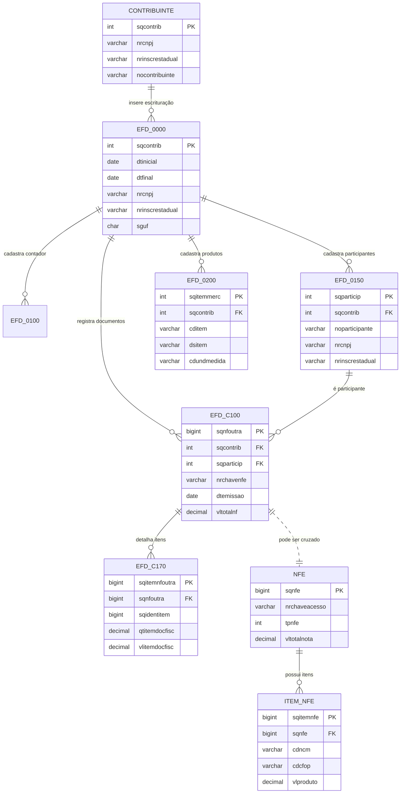

# 01 — Visão geral do BDFisc

## Objetivo

Apresentar a arquitetura lógica do banco de dados fiscal e mostrar como as principais entidades se relacionam.

## Diagrama geral

## Como interpretar

- A base do modelo começa em EFD_0000, que representa a abertura da escrituração.
- A entidade EFD_0150 registra participantes envolvidos na operação fiscal.
- A entidade EFD_0200 organiza a base de produtos e mercadorias.
- EFD_C100 representa o documento fiscal em nível de cabeçalho.
- EFD_C170 detalha cada item do documento.
- NFE e ITEM_NFE formam o núcleo das notas eletrônicas.

## Conclusão

O BDFisc pode ser entendido como um conjunto de camadas:

1. cadastro e identificação;
2. documentos fiscais;
3. itens e mercadorias;
4. cruzamento entre escrituração e notas eletrônicas.

Essa visão é essencial para a auditoria tributária e para a análise de dados fiscais em ambiente analítico.
