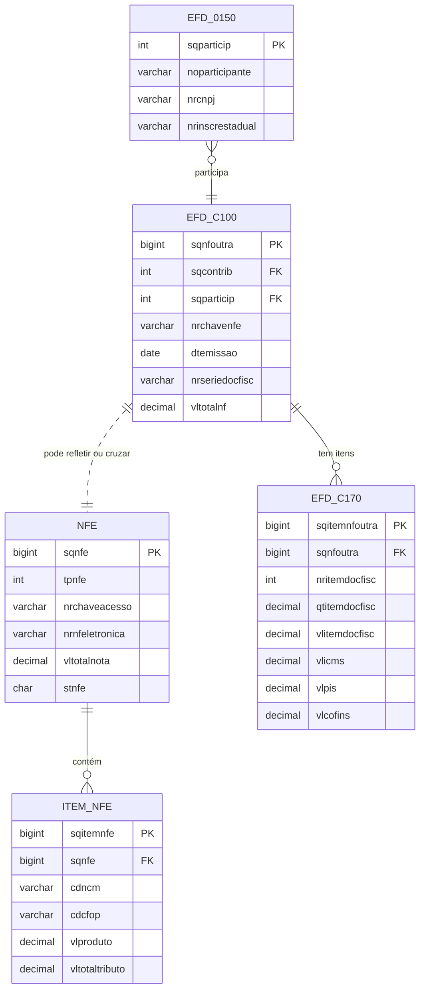

# 02 — Documentos fiscais e notas eletrônicas

## Visão do fluxo de documentos

## Comentário didático

### NF-e

- NFE representa a nota eletrônica em nível de cabeçalho.
- Guarda dados como chave de acesso, data de emissão, valor total e status.

### Item da NF-e

- ITEM_NFE é a decomposição da NF-e em linhas de produtos ou serviços.
- Geralmente há um para cada item vendido, com código, CFOP, quantidade e valor.

### EFD – documento de saída

- EFD_C100 guarda o registro do documento fiscal em nível de documento.
- EFD_C170 detalha cada item desse documento.
- Isso permite comparar o que foi registrado na EFD com o que consta na NF-e.

## Relação entre NF-e e EFD

A auditoria fiscal geralmente faz a seguinte checagem:

- A NF-e tem valores por item.
- A EFD também registra documentos e itens de saída.
- O cruzamento identifica divergências de valor, CFOP, data, participante ou tributação.

## Pergunta de aula

Qual a diferença entre a entidade que representa o documento fiscal e a entidade que representa seus itens? Resposta curta: a primeira responde “o que é o documento?” e a segunda responde “o que foi vendido dentro dele?”.
