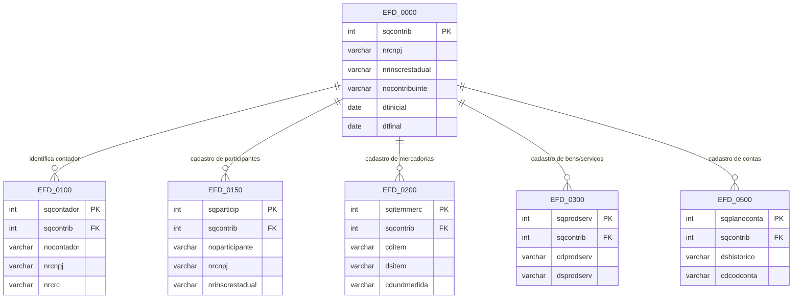

# 03 — Seções principais da EFD

## Estrutura lógica da escrituração

## Função das seções

### EFD_0000

- Registro de abertura da escrituração.
- Define o contribuinte, o período de apuração e a UF.

### EFD_0100

- Cadastro do contador ou responsável pela escrituração.
- Muito importante para atribuição técnica e rastreabilidade.

### EFD_0150

- Cadastro de participantes do negócio.
- Inclui clientes, fornecedores, tomadores e prestadores.

### EFD_0200 / EFD_0300

- Representam a base de mercadorias e serviços cadastrados.
- Permitem padronizar o item na análise fiscal.

### EFD_0500

- Registra contas e eventos contábeis e fiscais.
- Complementa o contexto da escrituração.

## Objetivo didático

Essas tabelas funcionam como o “cadastro mestre” da EFD. Sem elas, o banco teria dificuldade de contextualizar documentos, participantes e produtos.
