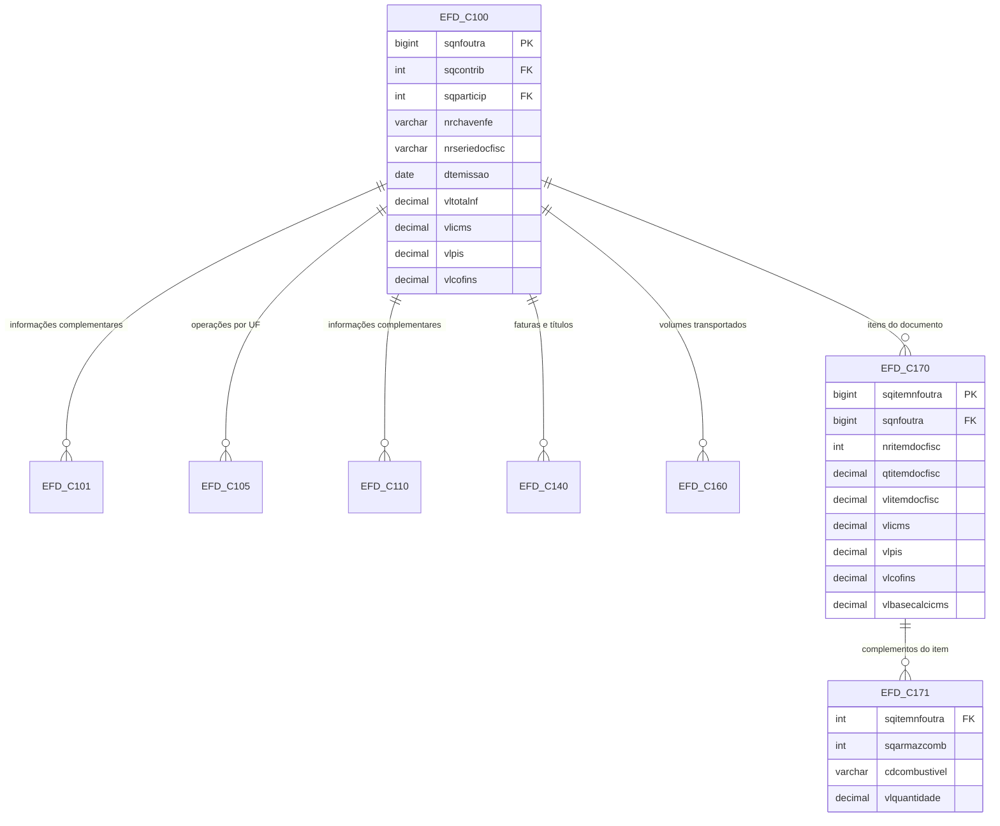

# 04 — Blocos C100 e C170 da EFD

## Bloco de cabeçalho e detalhe

## Interpretação

### EFD_C100

- É o registro de cabeçalho do documento fiscal.
- Inclui dados do emissor, destinatário, chave da NF-e, emissões e totais tributários.

### EFD_C170

- Contém os itens do documento fiscal.
- É onde ficam as quantidades, valores e tributos por produto/serviço.

### Registros complementares

- C101, C105, C110, C140, C160 e C171 complementam informações de acordo com a natureza da operação.
- Isso mostra que o modelo fiscal não é linear: há blocos específicos dependendo do tipo de documento e do contexto tributário.

## Exemplo de regra de negócio

Para um documento de saída:

1. o registro de cabeçalho entra em EFD_C100;
2. cada linha do documento entra em EFD_C170;
3. detalhes adicionais podem ser anexados em registros tipo C171, C140 ou C160.

Assim, a modelagem representa a estrutura real de documentos fiscais complexos.
