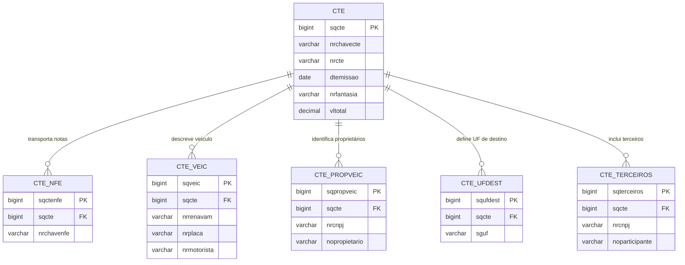

# 05 — CTe e estruturas auxiliares

## Visão do modelo de transporte

## Comentário

O CTe é um documento complementar ligado ao transporte de cargas. Ele não substitui a NF-e, mas pode transportar ou referenciar documentos fiscais gerados no processo logístico.

A estrutura do modelo mostra que o banco não é somente de documentos fiscais internos: ele também registra carga, transporte, locais e terceiros envolvidos no fluxo.
