# 06 — Relações cruzadas e visão integradora

## Diagrama integrador

```mermaid
erDiagram
    EFD_0000 ||--o{ EFD_0150 : "cadastro de participantes"
    EFD_0150 ||--o{ EFD_C100 : "participa de documentos"
    EFD_C100 ||--o{ EFD_C170 : "detalha itens"
    EFD_0200 ||--o{ EFD_C170 : "descreve mercadoria"
    EFD_C100 ||..|| NFE : "cruzamento documental"
    NFE ||--o{ ITEM_NFE : "possui itens"
    CTE ||--o{ CTE_NFE : "carrega documentos fiscais"

    EFD_0000 {
        int sqcontrib PK
        varchar nrcnpj
        date dtinicial
        date dtfinal
    }

    EFD_0150 {
        int sqparticip PK
        int sqcontrib FK
        varchar noparticipante
        varchar nrcnpj
    }

    EFD_C100 {
        bigint sqnfoutra PK
        int sqcontrib FK
        int sqparticip FK
        varchar nrchavenfe
        date dtemissao
        decimal vltotalnf
    }

    EFD_C170 {
        bigint sqitemnfoutra PK
        bigint sqnfoutra FK
        decimal qtitemdocfisc
        decimal vlitemdocfisc
    }

    EFD_0200 {
        int sqitemmerc PK
        int sqcontrib FK
        varchar cditem
        varchar dsitem
    }

    NFE {
        bigint sqnfe PK
        varchar nrchaveacesso
        decimal vltotalnota
    }

    ITEM_NFE {
        bigint sqitemnfe PK
        bigint sqnfe FK
        varchar cdncm
        varchar cdcfop
        decimal vlproduto
    }

    CTE {
        bigint sqcte PK
        varchar nrchavecte
        date dtemissao
    }

    CTE_NFE {
        bigint sqctenfe PK
        bigint sqcte FK
        varchar nrchavenfe
    }
```

## Fluxo de análise

1. O contribuinte abre a escrituração em EFD_0000.
2. Os participantes e produtos são cadastrados em EFD_0150 e EFD_0200.
3. Os documentos são registrados em EFD_C100.
4. Cada item do documento entra em EFD_C170.
5. NF-e e ITEM_NFE representam o mesmo fluxo de documento eletrônico.
6. CTE complementa a cadeia logística e de transporte.

## Uso em curso

Esse diagrama ajuda a mostrar que o banco fiscal pode ser visto como um ecossistema de informação:

- cadastros de domínio;
- documentos principais;
- itens e tributos;
- logística e transporte;
- relacionamento entre escrituração e NF-e.

## Dica para aula

Ao ensinar, peça ao aluno para responder: “Qual a diferença entre um documento fiscal de saída e o item desse documento?”

A resposta correta é: o primeiro é o registro do documento; o segundo descreve o conteúdo quantitativo e tributário desse documento.
