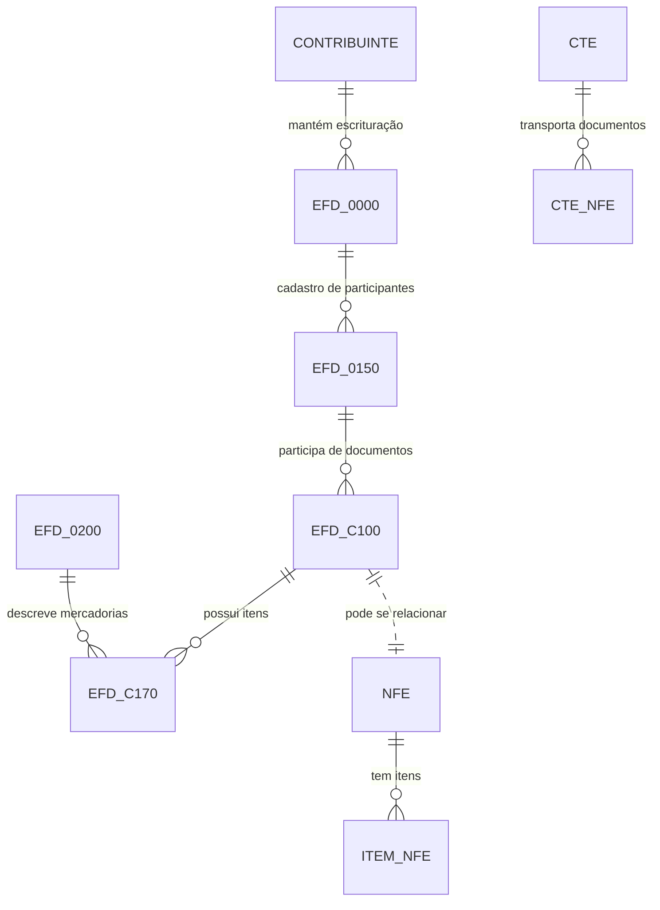

# Modelagem didática do BDFisc

Este conjunto de arquivos organiza a modelagem do banco BDFisc em pequenos blocos didáticos, com foco em:

- visão geral do banco;
- documentos fiscais e notas eletrônicas;
- seções da EFD;
- blocos de detalhe e itens;
- relações entre documentos, participantes e operações fiscais.

> Observação: os scripts do repositório definem as tabelas de forma muito rica, mas nem sempre com FKs explícitas. Por isso, esta modelagem funciona como uma representação lógica e didática, útil para ensino, documentação e análise de relacionamento.

## Estrutura dos arquivos

- [01-visao-geral.md](01-visao-geral.md) — visão macro do banco e principais entidades.
- [02-documentos-fiscais.md](02-documentos-fiscais.md) — NF-e, itens, EFD e documentos fiscais de saída.
- [03-efd-secoes-principais.md](03-efd-secoes-principais.md) — cabeçalho e cadastro de participantes/mercadorias.
- [04-efd-blocos-c100-c170.md](04-efd-blocos-c100-c170.md) — blocos de documentos e itens da EFD.
- [05-cte-e-apoio.md](05-cte-e-apoio.md) — CTe e estruturas complementares.
- [06-relacoes-cruzadas.md](06-relacoes-cruzadas.md) — visão integradora de cruzamento entre EFD, NF-e e CTe.

## Visão rápida

## Diagrama visual do modelo

> Arquivo original do Draw.io: [bdfisc_modelo_chen_drawio.xml](bdfisc_modelo_chen_drawio.xml)

## Entidades centrais

- EFD_0000: abertura da escrituração fiscal.
- EFD_0150: cadastro de participantes.
- EFD_0200: cadastro de mercadorias/serviços.
- EFD_C100: cabeçalho de documentos fiscais.
- EFD_C170: itens dos documentos fiscais.
- NFE: notas fiscais eletrônicas.
- ITEM_NFE: itens de cada nota.
- CTE: conhecimento de transporte.

## Uso didático

Este material foi pensado para estudo em sala, apresentação de arquitetura e explicação de estrutura lógica de dados fiscais. Ele pode ser usado como base para:

- explicação de modelagem relacional;
- aula de normalização e integração de dados fiscais;
- conexão entre EFD, NF-e e auditoria tributária;
- elaboração de relatórios de auditoria e conformidade.
