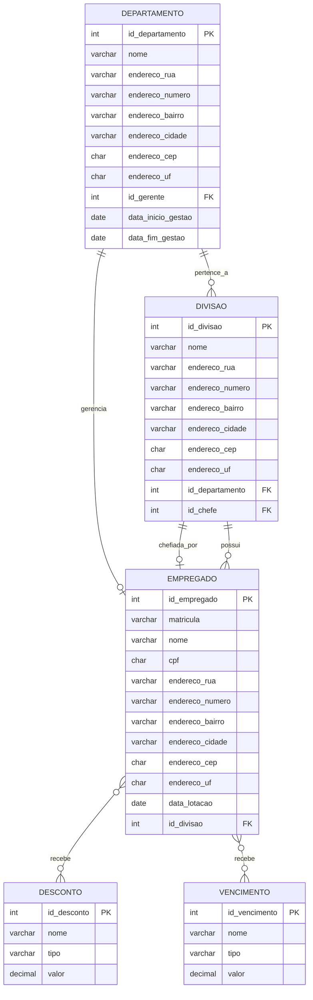

# Modelo ER do banco Curso_BD_M4

## 1. Visão geral

Este modelo foi extraído do esquema real do banco `Curso_BD_M4` no SQL Server e representa a estrutura conceitual principal do domínio administrativo de recursos humanos e organização da empresa.

A modelagem considera a notação de Peter Chen e Elmasri & Navathe, com cardinalidades mínimas e máximas, seguindo o padrão de leitura `look-across`.

## 2. Entidades principais

- `DEPARTAMENTO`
- `DIVISAO`
- `EMPREGADO`
- `DESCONTO`
- `VENCIMENTO`
- `EMPREGADO_DESCONTO` (associação entre empregado e desconto)
- `EMPREGADO_VENCIMENTO` (associação entre empregado e vencimento)

> Observação: o banco também possui tabelas auxiliares de apoio (`tab_empregado_insercao`, `tab_Folha_pgto_Departamento`, `tab_resumo_depto` e outras), mas a estrutura conceitual normalizada do sistema é representada pelas entidades acima.

## 3. Notação e cardinalidade

A seguir, a leitura das cardinalidades segue o padrão `look-across` (leitura atravessando o relacionamento):

- `1..1` = obrigatório e único
- `0..1` = opcional e único
- `0..N` = opcional e múltiplo
- `1..N` = obrigatório e múltiplo

### 3.1 Relacionamentos principais

| Relacionamento | Cardinalidade mínima/máxima | Interpretação |
|---|---|---|
| `EMPREGADO` — `trabalha_em` — `DIVISAO` | `EMPREGADO: 1..1` e `DIVISAO: 0..N` | Cada empregado pertence a exatamente uma divisão; cada divisão pode ter zero ou muitos empregados. |
| `DIVISAO` — `pertence_a` — `DEPARTAMENTO` | `DIVISAO: N` e `DEPARTAMENTO: 1..1` | Cada divisão pertence a um departamento; cada departamento pode ter zero ou muitas divisões. |
| `DEPARTAMENTO` — `gerencia` — `EMPREGADO` | `DEPARTAMENTO: 0..1` e `EMPREGADO: 0..N` | Cada departamento pode ter zero ou um gerente; um empregado pode gerir zero ou muitos departamentos. |
| `DIVISAO` — `chefiada_por` — `EMPREGADO` | `DIVISAO: 0..1` e `EMPREGADO: 0..N` | Cada divisão pode ter zero ou um chefe; um empregado pode chefiar zero ou muitas divisões. |
| `EMPREGADO` — `recebe` — `DESCONTO` | `EMPREGADO: 0..N` e `DESCONTO: 0..N` | Associação muitos-para-muitos por meio da tabela `EMPREGADO_DESCONTO`. |
| `EMPREGADO` — `recebe` — `VENCIMENTO` | `EMPREGADO: 0..N` e `VENCIMENTO: 0..N` | Associação muitos-para-muitos por meio da tabela `EMPREGADO_VENCIMENTO`. |

## 4. Diagrama conceitual (Peter Chen / Elmasri)



## 5. Versão textual em estilo Peter Chen

```
+-------------------+            +-------------------+
| DEPARTAMENTO      |            | DIVISAO           |
|-------------------| 0..N       |-------------------|
| id_departamento   |<-----------| id_divisao        |
| nome              |            | nome              |
| endereco_rua      |            | endereco_rua      |
| endereco_numero   |            | endereco_numero   |
| endereco_bairro   |            | endereco_bairro   |
| endereco_cidade   |            | endereco_cidade   |
| endereco_cep      |            | endereco_cep      |
| endereco_uf       |            | endereco_uf       |
| id_gerente        |            | id_departamento   |
| data_inicio_gestao|            | id_chefe          |
| data_fim_gestao   |            +-------------------+
+-------------------+
          |
          | 0..1
          |
          v
+-------------------+            +-------------------+
| EMPREGADO         |            | DESCONTO          |
|-------------------| 0..N       |-------------------|
| id_empregado      |<---------->| id_desconto       |
| matricula         |            | nome              |
| nome              |            | tipo              |
| cpf               |            | valor             |
| endereco_rua      |            +-------------------+
| endereco_numero   |
| endereco_bairro   |            +-------------------+
| endereco_cidade   |            | VENCIMENTO        |
| endereco_cep      |            |-------------------|
| endereco_uf       |            | id_vencimento     |
| data_lotacao      |            | nome              |
| id_divisao        |            | tipo              |
+-------------------+            | valor             |
                                 +-------------------+
```

## 6. Dicionário de dados

### 6.1 DEPARTAMENTO

| Coluna | Tipo | PK | FK | Null | Descrição |
|---|---|---|---|---|---|
| id_departamento | int | Sim | Não | Não | Identificador único do departamento |
| nome | varchar(100) | Não | Não | Não | Nome do departamento |
| endereco_rua | varchar(150) | Não | Não | Sim | Rua do endereço |
| endereco_numero | varchar(4) | Não | Não | Sim | Número do endereço |
| endereco_bairro | varchar(100) | Não | Não | Sim | Bairro |
| endereco_cidade | varchar(100) | Não | Não | Sim | Cidade |
| endereco_cep | char(8) | Não | Não | Sim | CEP |
| endereco_uf | char(2) | Não | Não | Sim | UF |
| id_gerente | int | Não | `EMPREGADO.id_empregado` | Sim | Gerente do departamento |
| data_inicio_gestao | date | Não | Não | Sim | Início do período de gestão |
| data_fim_gestao | date | Não | Não | Sim | Fim do período de gestão |

### 6.2 DIVISAO

| Coluna | Tipo | PK | FK | Null | Descrição |
|---|---|---|---|---|---|
| id_divisao | int | Sim | Não | Não | Identificador da divisão |
| nome | varchar(100) | Não | Não | Não | Nome da divisão |
| endereco_rua | varchar(150) | Não | Não | Sim | Rua do endereço |
| endereco_numero | varchar(4) | Não | Não | Sim | Número do endereço |
| endereco_bairro | varchar(100) | Não | Não | Sim | Bairro |
| endereco_cidade | varchar(100) | Não | Não | Sim | Cidade |
| endereco_cep | char(8) | Não | Não | Sim | CEP |
| endereco_uf | char(2) | Não | Não | Sim | UF |
| id_departamento | int | Não | `DEPARTAMENTO.id_departamento` | Não | Departamento ao qual a divisão pertence |
| id_chefe | int | Não | `EMPREGADO.id_empregado` | Sim | Chefe da divisão |

### 6.3 EMPREGADO

| Coluna | Tipo | PK | FK | Null | Descrição |
|---|---|---|---|---|---|
| id_empregado | int | Sim | Não | Não | Identificador do empregado |
| matricula | varchar(20) | Não | Não | Não | Matrícula funcional |
| nome | varchar(150) | Não | Não | Não | Nome do empregado |
| cpf | char(11) | Não | Não | Não | CPF |
| endereco_rua | varchar(150) | Não | Não | Sim | Rua do endereço |
| endereco_numero | varchar(4) | Não | Não | Sim | Número do endereço |
| endereco_bairro | varchar(100) | Não | Não | Sim | Bairro |
| endereco_cidade | varchar(100) | Não | Não | Sim | Cidade |
| endereco_cep | char(8) | Não | Não | Sim | CEP |
| endereco_uf | char(2) | Não | Não | Sim | UF |
| data_lotacao | date | Não | Não | Sim | Data de lotação |
| id_divisao | int | Não | `DIVISAO.id_divisao` | Não | Divisão à qual o empregado pertence |

### 6.4 DESCONTO

| Coluna | Tipo | PK | FK | Null | Descrição |
|---|---|---|---|---|---|
| id_desconto | int | Sim | Não | Não | Identificador do tipo de desconto |
| nome | varchar(100) | Não | Não | Não | Nome do desconto |
| tipo | varchar(50) | Não | Não | Não | Tipo de benefício ou desconto |
| valor | decimal(10,2) | Não | Não | Não | Valor do desconto |

### 6.5 VENCIMENTO

| Coluna | Tipo | PK | FK | Null | Descrição |
|---|---|---|---|---|---|
| id_vencimento | int | Sim | Não | Não | Identificador do tipo de vencimento |
| nome | varchar(100) | Não | Não | Não | Nome do vencimento |
| tipo | varchar(50) | Não | Não | Não | Tipo de remuneração |
| valor | decimal(10,2) | Não | Não | Não | Valor do vencimento |

### 6.6 EMPREGADO_DESCONTO

| Coluna | Tipo | PK | FK | Null | Descrição |
|---|---|---|---|---|---|
| id_empregado | int | Sim | `EMPREGADO.id_empregado` | Não | Identifica o empregado |
| id_desconto | int | Sim | `DESCONTO.id_desconto` | Não | Identifica o desconto aplicado |

### 6.7 EMPREGADO_VENCIMENTO

| Coluna | Tipo | PK | FK | Null | Descrição |
|---|---|---|---|---|---|
| id_empregado | int | Sim | `EMPREGADO.id_empregado` | Não | Identifica o empregado |
| id_vencimento | int | Sim | `VENCIMENTO.id_vencimento` | Não | Identifica o vencimento referente |

## 7. Resumo das regras de negócio

1. Cada `EMPREGADO` pertence a uma `DIVISAO`.
2. Cada `DIVISAO` pertence a um `DEPARTAMENTO`.
3. Cada `DEPARTAMENTO` pode ter zero ou um gerente.
4. Cada `DIVISAO` pode ter zero ou um chefe.
5. Um empregado pode receber vários descontos e vários vencimentos.
6. O relacionamento entre empregado e descontos/vencimentos é representado por tabelas associativas (`EMPREGADO_DESCONTO` e `EMPREGADO_VENCIMENTO`).

## 8. Arquivo Draw.io

O mesmo modelo foi exportado em um arquivo `.drawio` para edição visual no diagrams.net:

- [curso_bd_m4_modelagem_chen.drawio](curso_bd_m4_modelagem_chen.drawio)

## 9. Observações do modelo físico vs. conceitual

A modelagem acima está em nível conceitual e lógico, uso didático de banco de dados. No nível físico, o SQL Server utiliza chaves estrangeiras e tabelas de associação para materializar as cardinalidades muitas-para-muitas. O padrão de modelagem acima busca refletir corretamente a estrutura real do banco sem perder a clareza didática.
