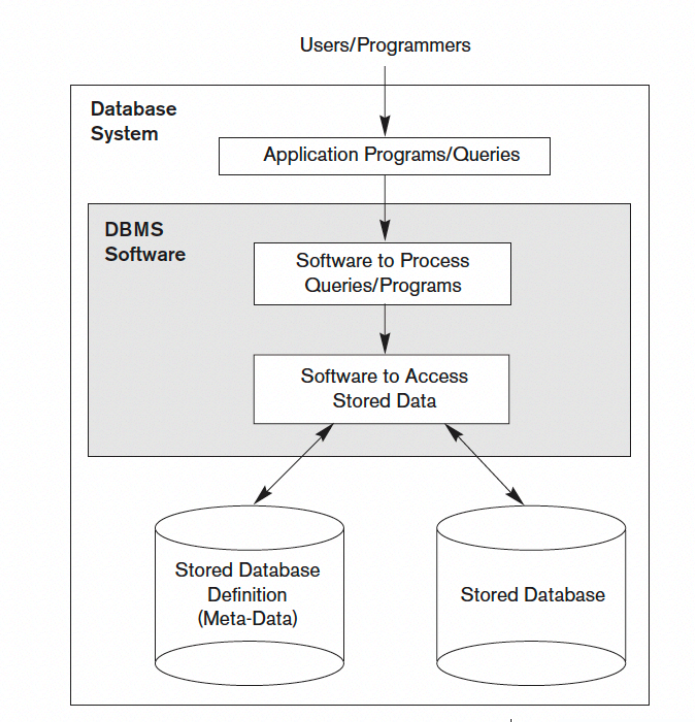
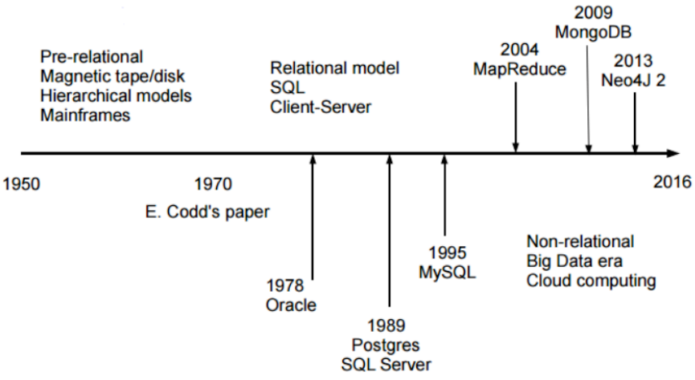
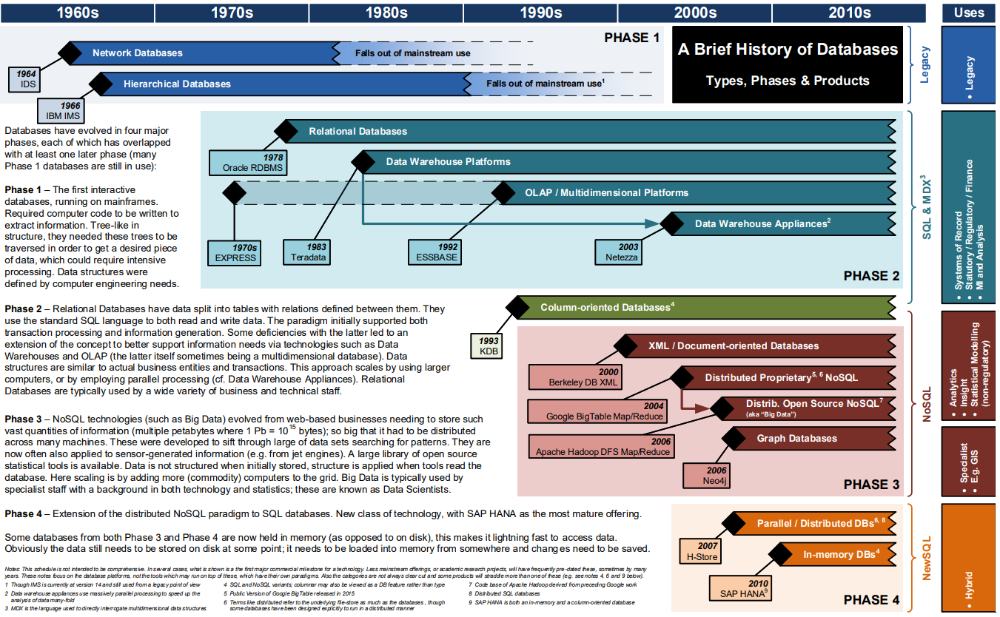
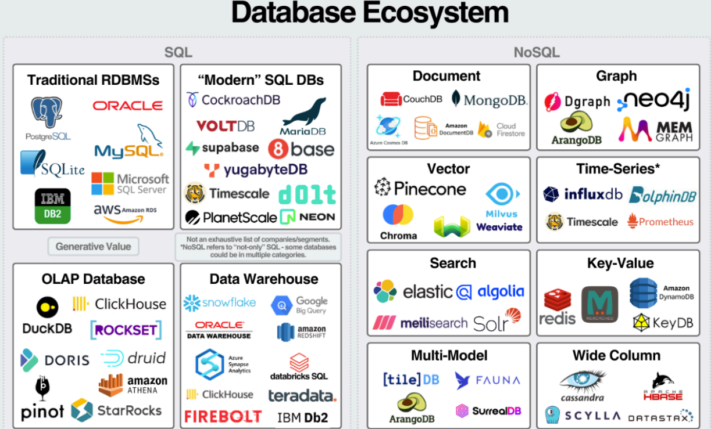
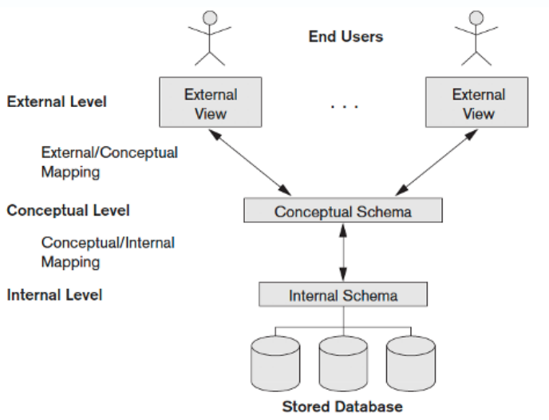
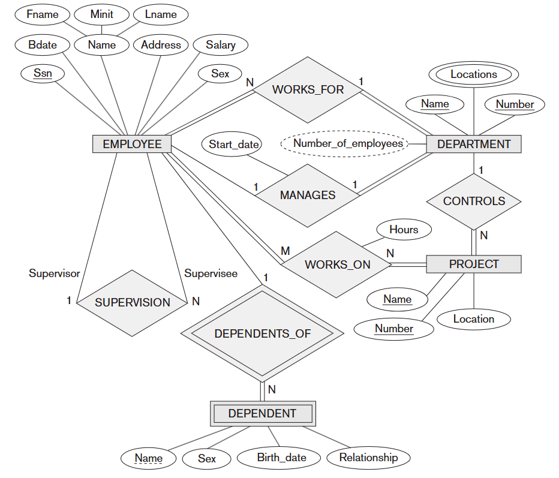

# INTRODUÇÃO A BANCOS DE DADOS
*Apresentação: Dr. Fábio Leite*

# BANCO DE DADOS
* Por que usar?

* Quais as vantagens e desvantagens?

Banco de dados é uma coleção de **dados estruturados e relacionados**.
O termo "estruturado" se refere a um formato bem definido e organizado. O SGBD (Sistema de Gerenciamento de Banco de Dados) é o software que permite aos usuários criar e manter essa coleção de dados. A característica "relacionado" é fundamental: os dados devem possuir um significado implícito e lógico, representando fatos conhecidos do "mundo real" que foram registrados.

Embora um banco de dados possa ser teoricamente não-computadorizado, o foco principal é em bancos de dados computadorizados. O SGBD, ao gerenciar esses **dados armazenados eletronicamente**, utiliza estruturas de armazenamento eficientes e mecanismos de controle para garantir que eles sejam manipulados de forma segura, correta e rápida.

Ele permite o gerenciamento eficiente de grandes volumes de informações, facilitando a **inserção, consulta, atualização e remoção de dados**.
 Estas quatro operações (inserção, consulta, atualização e remoção) são conhecidas coletivamente como as operações básicas de manipulação de dados. 

O SGBD facilita essas operações ao fornecer:
- **Linguagens de Consulta:** Como o SQL, que são de alto nível e fáceis de usar para os usuários finais e programadores.
- **Otimização:** O SGBD utiliza otimizadores de consulta e índices para garantir que a consulta e a recuperação (busca) dos dados sejam realizadas de forma a minimizar o tempo de resposta, mesmo em grandes volumes.

# ELEMENTOS DE UM SGBD

O SGBD lida com diversos **Usuários e Programas** (os Atores, como o DBA, Designers e Usuários Finais) que acessam o sistema para executar suas requisições. 

O ponto central dessa interação é a **Consulta (Query)**. Estas requisições são processadas pelo Processador de Consultas, que tem a função de analisar a sintaxe (geralmente SQL), traduzir e otimizar a solicitação, gerando um plano de execução eficiente para máxima performance na recuperação dos dados. Sendo assim, são tratadas por todos os elementos do SGBD para retornar o que foi requerido.

Para alterações seguras, o SGBD utiliza **Transações**, que são unidades de execução regidas pelas propriedades ACID: Atomicidade (ou completa, ou desfeita), Consistência (mantém o estado válido), Isolamento (execução independente) e Durabilidade (alterações permanentes). O SGBD garante o cumprimento do ACID por meio de seus módulos de Controle de Concorrência e Recuperação de falhas.

    

# PROJETO DE BANCO DE DADOS

* **Definir** um banco de dados envolve especificar: 
    * Tipos de dados 
    * Estruturas 
    * Restrições sobre os dados armazenados 

* **Construir** um banco de dados é a fase de implementação do esquema, utilizando a Linguagem de Definição de Dados (DDL) para criar a estrutura. Em seguida, os dados são armazenados no meio físico, com o SGBD controlando esses detalhes para abstrair o usuário dos pormenores de armazenamento.
* **Manipular** os dados é a execução das operações básicas de Inserção, Remoção, Modificação e Recuperação (Consultas). Essa manipulação é feita através da Linguagem de Manipulação de Dados (DML), permitindo a recuperação da informação (incluindo a geração de relatórios) e garantindo a evolução segura dos dados mantidos por meio de Transações ACID.

# FORMAS DE ACESSO OFERECIDAS PELO SGBD

Um **SGBD** provê acesso aos dados de forma:
* **Eficiente**: O SGBD usa estruturas de armazenamento eficientes e um Otimizador de Consultas para o acesso rápido aos dados.
* **Confiável:** O sistema impõe Restrições de Integridade e usa subsistemas de Recuperação e Backup para proteger a base contra falhas, garantindo a durabilidade e a validade dos dados.
* **Conveniente:** O SGBD oferece abstração da visão física e usa linguagens de alto nível (DML) para simplificar a interação do usuário.
* **Acesso concorrente e multi-usuários:** Esta é uma função vital do SGBD, gerenciada pelo Sistema de Controle de Concorrência para garantir o Isolamento das transações e permitir que múltiplos usuários trabalhem ao mesmo tempo.
* **Massiva e persistente:** O SGBD é inerentemente projetado para lidar com grandes volumes de dados (massivo) e garantir que as alterações confirmadas sejam permanentes (persistente).

# SERVIÇOS DE UM SGBD

Sendo assim, os principais serviços são:
* Persistência
* Segurança
* Backup e recuperação de falhas
* Otimização de consultas
* Logging
* Performance Tunning
* Replicação
* Suporte a aplicações avançadas:
    * Data warehouse e mining
    * Machine learning
    * Business Intelligence

# HISTORIA DE SGBDS

A história dos Sistemas Gerenciadores de Banco de Dados (SGBDs) começou na década de 1950 com o ineficiente Processamento de Arquivos individualizados. A necessidade de centralizar dados levou à criação dos primeiros SGBDs de Primeira Geração nos anos 1960 (Modelos Hierárquico e de Rede). A verdadeira revolução veio nos anos 1970 com o Modelo Relacional de E.F. Codd, dando origem aos SGBDs de Segunda Geração, que utilizam tabelas e a linguagem SQL, separando a lógica dos dados do seu armazenamento físico. A evolução continuou com os modelos Objeto-Relacionais nos anos 80/90 (Terceira Geração) e, mais recentemente, com o surgimento dos sistemas NoSQL, que oferecem alta escalabilidade para lidar com o volume e a variedade do Big Data moderno.

    
    

---

# CLASSIFICAÇÃO QUANTO AO PROPÓSITO

## PRODUÇÃO 
* Bancos de dados que armazenam os dados para manter as aplicações e sistemas funcionando.
* É conhecido como **Online Transaction Processing (OLTP)**.
* Podem ser **relacionais, NoSQL, Graph DB, entre outros**.

## ANALÍTICO
* Bancos de dados para análise e apoio à tomada de decisão.
* São **Fontes de dados para modelos de ML** (Machine Learning).
* Podem ser: **Data warehouses, Data Lakes ou Lakehouses**.

## OPERACIONAL (MONITORAMENTO)
* Bancos de dados montados para provê suporte à aplicações de **monitoramento, logs, segurança, entre outros**.
* Podem ser: **key-value stores, time series, logs + search DBs**.

## TIPOS DE PLAYERS NO MERCADO 

    

# NÍVEIS DE ABSTRAÇÃO

O SGBD utiliza uma arquitetura de três esquemas para garantir a independência de dados, separando as diferentes formas como o banco de dados é visto e implementado.

* **Visões do usuário**
    * **Módulos do sistema:** O SGBD permite que cada grupo de usuários (como programadores ou usuários finais) tenha uma visão personalizada do banco de dados, que é apenas uma parte do banco de dados real.
    * **Linguagem voltada aos stakeholders:** As visões escondem dados irrelevantes e a complexidade do banco de dados real (o Esquema Conceitual), garantindo que cada usuário acesse apenas o que é necessário para sua aplicação, o que é crucial para a segurança e a conveniência.

* **Conceitual**
    * **Entidades e relacionamentos entre os dados:** Este esquema descreve a estrutura do banco de dados inteiro para uma comunidade de usuários.
    * **Visão simplificada:** É uma visão totalmente lógica da base de dados. Ela descreve quais dados são armazenados e os relacionamentos entre eles, e todas as restrições de integridade que devem ser aplicadas. Este nível é independente tanto do armazenamento físico quanto das visões externas dos usuários.

* **Físico**
    * **Nível de implementação no SGBD** Este nível especifica a organização física dos dados armazenados.
    * **Estruturas de dados, registros, arquivos, índices, etc..** Ele detalha como os dados são realmente armazenados e gerenciados.

    

# PRINCÍPIO DA INDEPENDÊNCIA DE DADOS

*"Deve ser possível que esquemas de dados possam mudar sem afetar as definições de esquemas de níveis superiores."*

Edgar F. Codd

---

## Independência física de dados

* Capacidade de modificar o **esquema físico** sem a necessidade de reescrever os programas aplicativos que usam a base. As modificações no nível físico são ocasionalmente necessárias para melhorar o desempenho ou estruturas internas.

## Independência lógica de dados

* Capacidade de modificar o **esquema conceitual** sem a necessidade de reescrever os programas que acessam os dados. As modificações no nível conceitual são necessárias quanto a **estrutura lógica** do banco de dados é alterada.

## PRINCÍPIO DA INDEPENDÊNCIA DE DADOS 

**Modelo Conceitual**

* **Descrição de maneira independente ao SGBD**, ou seja, define os dados a serem registrados no BD, porém sem se importar com a implementação que se dará ao BD.
* Uma das técnicas mais utilizadas dentre os profissionais da área é a **abordagem entidade-relacionamento (ER)**, onde o modelo é representado graficamente através do **Diagrama Entidade-Relacionamento (DER)**.

**Modelo Lógico**

* Descreve o BD no nível do SGBD, ou seja, depende do tipo particular de SGBD que será usado. O tipo de SGBD que o modelo lógico trata é se o mesmo é relacional, orientado a objetos, hierárquico, etc.

    

<h2 id="tabelas-do-modelo-relacional">TABELAS DO MODELO RELACIONAL</h2>
<table style="width:100%; border: none; border-collapse: collapse;">
<tr>
<td style="width:25%; vertical-align: top; padding: 10px; border: none;">
<h4>Departamento</h4>
      
| CodDepto | Nome |
| :---: | :---: |
| 1 | D1 |
| 2 | D2 |
| 3 | D3 |

</td>
<td style="width:35%; vertical-align: top; padding: 10px; border: none;">
<h4>Empregado</h4>
      
| CodEmp | Nome | CodDepto |
| :---: | :---: | :---: |
| 1 | José | 3 |
| 2 | Maria | 2 |
| 3 | João | 2 |
| 4 | João | 1 |
| 5 | Pedro | 3 |
| 6 | Ana | 2 |

</td>
<td style="width:40%; vertical-align: top; padding: 10px; border: none;">
<h4>Dependente</h4>
      
| CodDep | Nome | CodEmp |
| :---: | :---: | :---: |
| 1 | Francisco | 3 |
| 2 | Juliana | 3 |
| 3 | Juliana | 4 |
| 4 | Manuel | 1 |
| 5 | Miguel | 3 |
| 6 | Hugo | 2 |
| 7 | Marcos | 6 |
| 8 | Daniela | 1 |
| 9 | Marieta | 2 |
</td>
  </tr>
</table>

# VANTAGENS DE USAR SGBDS

* Controle de redundância
* Restrição de acesso desautorizado
* Armazenamento Persistente para objetos dos programas
* Estruturas de armazenamento e técnicas de buscas para processamento eficiente de consultas
* Backup e restauração
* Múltiplas interfaces de usuários
* Representação de relacionamentos complexos entre os dados
* Garantia de restrições de integridade
* Permite inferência e ações automáticas usando regras e gatilhos

# DESVANTAGENS DE USAR SGBDS

* Controle de redundância
* Restrição de acesso desautorizado
* Armazenamento Persistente para objetos dos programas
* Estruturas de armazenamento e técnicas de buscas para processamento eficiente de consultas
* Backup e restauração
* Múltiplas interfaces de usuários
* Representação de relacionamentos complexos entre os dados
* Garantia de restrições de integridade
* Permite inferência e ações automáticas usando regras e gatilhos

# REFERÊNCIAS BIBLIOGRÁFICAS

* **ELMASRI, Ramez; NAVATHE, Shamkant.** *Fundamentals of Database Systems*. 7th ed., 2021. 
* **GAMES, Pete; THOMAS.COM.** *A Brief History of Databases: Types, Phases & Products*. (2017-2018). Disponível sob Licença Creative Commons Attribution 4.0 International. 

# CONTATO

* **Telefone:** +55 83 996577959 
* **E-mail:** fabioleite@servidor.uepb.edu.br 
* **Endereço:** Universidade Estadual da Paraíba, Campus I - Campina Grande, PB

