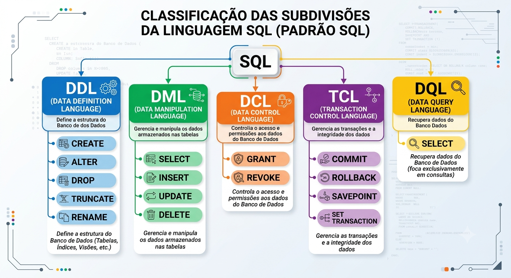

# Módulo: Comandos SQL — Classificação e Fundamentos em T-SQL (SQL Server)

**Curso:** Banco de Dados Relacionais aplicado à Administração Tributária
**Público-alvo:** Profissionais da Secretaria de Estado da Fazenda da Paraíba (SEFAZ-PB)
**SGBD utilizado:** Microsoft SQL Server (T-SQL) — ferramenta: SQL Server Management Studio (SSMS)
**Carga horária sugerida:** 4 horas (2h teoria + 2h prática)

---

## Sumário

1. [Objetivos do Módulo](#1-objetivos-do-módulo)
2. [O que é SQL e o Padrão ANSI/ISO](#2-o-que-é-sql-e-o-padrão-ansiiso)
3. [Classificação das Subdivisões da Linguagem SQL](#3-classificação-das-subdivisões-da-linguagem-sql)
4. [DDL — Data Definition Language](#4-ddl--data-definition-language)
5. [DML — Data Manipulation Language](#5-dml--data-manipulation-language)
6. [DQL — Data Query Language](#6-dql--data-query-language)
7. [DCL — Data Control Language](#7-dcl--data-control-language)
8. [TCL — Transaction Control Language](#8-tcl--transaction-control-language)
9. [Tabela-Resumo Comparativa](#9-tabela-resumo-comparativa)
10. [Cenário Integrado: Um Fluxo Fiscal Completo](#10-cenário-integrado-um-fluxo-fiscal-completo)
11. [Boas Práticas em Ambiente de Produção Fiscal](#11-boas-práticas-em-ambiente-de-produção-fiscal)
12. [Glossário](#12-glossário)
13. [Referências](#13-referências)

---

## 1. Objetivos do Módulo

Ao final deste módulo, o participante será capaz de:

- Reconhecer as cinco subdivisões clássicas da linguagem SQL (DDL, DML, DQL, DCL, TCL) e identificar a qual grupo pertence cada comando.
- Explicar, com exemplos do domínio fiscal, a finalidade de cada comando dentro do T-SQL do SQL Server.
- Diferenciar comandos que alteram a **estrutura** do banco (DDL) dos que alteram os **dados** (DML), dos que apenas **consultam** (DQL), dos que controlam **acesso** (DCL) e dos que controlam **transações** (TCL).
- Compreender particularidades do T-SQL que vão além do padrão ANSI ilustrado na figura de referência (ex.: `DENY`, `SAVE TRANSACTION`, `TRUNCATE TABLE`, `MERGE`).
- Usar essa classificação como mapa mental para navegar o restante do curso.

---

## 2. O que é SQL e o Padrão ANSI/ISO

**SQL (Structured Query Language)** é a linguagem declarativa padronizada (ANSI X3.135 e ISO/IEC 9075) para definir, manipular, consultar e controlar dados em bancos de dados relacionais. "Declarativa" significa que o usuário descreve **o que** deseja obter ou alterar, e o *otimizador de consultas* do SGBD decide **como** executar essa operação da forma mais eficiente.

O **T-SQL (Transact-SQL)** é o dialeto de SQL implementado pela Microsoft no SQL Server (e no Azure SQL Database). Ele segue o núcleo do padrão ANSI, mas adiciona:

- Extensões procedurais (`IF`, `WHILE`, `BEGIN...END`, variáveis `@variavel`, cursores).
- Objetos programáveis (procedures, functions, triggers) com sintaxe própria.
- Comandos e cláusulas específicas (`TOP`, `OUTPUT`, `MERGE`, `TRY...CATCH`, `THROW`, `sp_rename`, `sp_help`).
- Metadados acessíveis via *system views* (`sys.tables`, `sys.columns`) e *Dynamic Management Views* (DMVs).

Este módulo usa a figura abaixo — que resume a classificação padrão da linguagem SQL — como ponto de partida, sempre trazendo a leitura específica do T-SQL para cada grupo.

---

## 3. Classificação das Subdivisões da Linguagem SQL



A figura organiza os comandos SQL em cinco grupos funcionais, todos derivados da mesma linguagem-mãe (`SQL`):

| Sigla | Nome completo | Função central |
|---|---|---|
| **DDL** | Data Definition Language | Define e altera a **estrutura** do banco de dados (tabelas, índices, views, schemas) |
| **DML** | Data Manipulation Language | Manipula os **dados** armazenados nas tabelas (inserir, atualizar, excluir e — em muitas classificações — consultar) |
| **DQL** | Data Query Language | Subconjunto do DML dedicado **exclusivamente** à consulta de dados (`SELECT`), sem alterar nada |
| **DCL** | Data Control Language | Controla **permissões e acesso** aos objetos do banco |
| **TCL** | Transaction Control Language | Controla o **agrupamento e a integridade** de operações em transações |

> **Nota sobre o `SELECT` aparecer em dois grupos:** a figura mostra `SELECT` tanto em DML quanto em DQL. Isso não é um erro — reflete uma divergência de nomenclatura entre autores. O padrão ANSI original trata `SELECT` como parte do DML, por histórico da linguagem; didaticamente, porém, muitos materiais (como o desta figura) separam o `SELECT` em um grupo próprio (DQL) porque ele **não modifica dado nenhum**, ao contrário de `INSERT`/`UPDATE`/`DELETE`. Na documentação oficial da Microsoft para T-SQL, `SELECT` é listado junto aos demais comandos de "Data Manipulation Language (DML)" — por isso, ao longo deste módulo, tratamos DQL como uma **especialização conceitual** do DML, útil para o raciocínio didático, mas não como uma categoria separada na referência oficial do produto.

---

## 4. DDL — Data Definition Language

**Função:** definir, alterar e remover a **estrutura** dos objetos do banco de dados — tabelas, colunas, índices, views, schemas, constraints. Comandos DDL não manipulam linhas de dados diretamente; eles manipulam o *metadado* (o "esqueleto") do banco.

**Característica importante em SQL Server:** a maioria dos comandos DDL é **transacional** (diferente de outros SGBDs, como o MySQL/InnoDB em certas configurações) — ou seja, um `CREATE TABLE` ou `ALTER TABLE` dentro de uma transação pode ser desfeito com `ROLLBACK`, exceto operações que envolvem arquivos físicos (ex.: `CREATE DATABASE`) ou que exigem `GO` (fim de lote) para serem finalizadas antes da próxima instrução usar o objeto criado.

### 4.1 `CREATE` — criar objetos

Cria tabelas, views, índices, schemas, procedures, functions, triggers, entre outros.

```sql
CREATE SCHEMA fiscal;
GO

CREATE TABLE fiscal.contribuinte (
    id_contribuinte     INT IDENTITY(1,1) PRIMARY KEY,
    cnpj                CHAR(14) NOT NULL UNIQUE,
    razao_social         VARCHAR(150) NOT NULL,
    regime_tributario   VARCHAR(30) NOT NULL,
    data_cadastro       DATETIME2 DEFAULT SYSUTCDATETIME()
);
```

**Notas T-SQL:**
- `IDENTITY(seed, increment)` é a forma nativa do SQL Server de gerar chaves substitutas autoincrementais (equivalente ao `AUTO_INCREMENT` do MySQL ou `SERIAL` do PostgreSQL).
- `GO` não é um comando T-SQL propriamente dito — é um separador de lote (*batch*) interpretado pelo SSMS/`sqlcmd`; ele garante que o `CREATE SCHEMA` seja concluído antes de o próximo lote referenciá-lo.
- Sempre qualificar objetos pelo schema (`fiscal.contribuinte`, não apenas `contribuinte`) evita ambiguidade e é boa prática em bases fiscais com múltiplos domínios (`fiscal`, `staging`, `auditoria`).

### 4.2 `ALTER` — alterar estrutura existente

Modifica um objeto já criado sem precisar recriá-lo do zero.

```sql
ALTER TABLE fiscal.contribuinte
ADD telefone_contato VARCHAR(20) NULL;

ALTER TABLE fiscal.contribuinte
ALTER COLUMN razao_social VARCHAR(200) NOT NULL;
```

**Notas T-SQL:** cada subcomando (`ADD`, `DROP COLUMN`, `ALTER COLUMN`, `ADD CONSTRAINT`) tem regras próprias de bloqueio e reescrita de página de dados — relevante em tabelas fiscais de grande volume (ver módulo específico de `ALTER TABLE`, [02 Alter_table_sqlserver.md](02%20Alter_table_sqlserver.md)).

### 4.3 `DROP` — remover objetos definitivamente

Remove a estrutura **e todos os dados** do objeto, de forma irreversível fora de uma transação explícita.

```sql
DROP TABLE fiscal.contribuinte_temp;
DROP INDEX ix_contribuinte_cnpj ON fiscal.contribuinte;
```

**Cuidado:** `DROP TABLE` remove a definição inteira (colunas, constraints, índices, triggers associados). Em produção fiscal, deve ser precedido de backup ou de confirmação em ambiente de homologação.

### 4.4 `TRUNCATE` — esvaziar uma tabela rapidamente

Remove **todas as linhas** de uma tabela, mas preserva a estrutura (colunas, índices, constraints).

```sql
TRUNCATE TABLE staging.stg_nfe_bulk;
```

**Notas T-SQL:**
- `TRUNCATE TABLE` é minimamente registrado no log de transações (ao contrário de `DELETE`), sendo muito mais rápido para esvaziar tabelas de staging entre cargas.
- Reinicia o contador `IDENTITY` para o valor de semente original.
- Não pode ser usado se a tabela for referenciada por uma `FOREIGN KEY` ativa de outra tabela, nem dispara `DELETE TRIGGER`.
- Embora a figura classifique `TRUNCATE` como DDL (por afetar a tabela como um todo, sem filtro `WHERE`), ele é funcionalmente um comando de remoção de dados — outra evidência de que os limites entre DDL/DML nem sempre são absolutos.

### 4.5 `RENAME` — renomear objetos

O padrão ANSI prevê `RENAME`, mas o **T-SQL não tem esse comando na sua forma pura**. Em SQL Server, renomear é feito pela *stored procedure* de sistema `sp_rename`:

```sql
EXEC sp_rename 'fiscal.contribuinte.razao_social', 'nome_empresarial', 'COLUMN';
EXEC sp_rename 'fiscal.contribuinte_temp', 'contribuinte_backup';
```

**Cuidado T-SQL:** `sp_rename` não atualiza automaticamente referências em procedures, views ou textos de definição que citam o nome antigo — é preciso revisar dependências (`sys.sql_expression_dependencies`) após o rename.

---

## 5. DML — Data Manipulation Language

**Função:** manipular os **dados** armazenados nas tabelas — inserir, atualizar e excluir linhas. Diferente do DDL, o DML opera sobre o **conteúdo**, não sobre a estrutura, e cada instrução pode ser desfeita com `ROLLBACK` enquanto a transação não for confirmada (`COMMIT`).

### 5.1 `INSERT` — inserir novos registros

```sql
INSERT INTO fiscal.contribuinte (cnpj, razao_social, regime_tributario)
VALUES ('12345678000190', 'Comercial Fiscal LTDA', 'Simples Nacional');
```

**Variações relevantes em T-SQL:** `INSERT ... SELECT` (inserir a partir de uma consulta), `INSERT ... VALUES` com múltiplas linhas, `SELECT INTO` (cria a tabela e insere em um só comando), `BULK INSERT` (carga em massa a partir de arquivo), `INSERT ... OUTPUT` (retorna as linhas inseridas). Esses variantes são detalhados no módulo de inserção de dados ([02 insercao de dados](02%20insercao%20de%20dados/)).

### 5.2 `UPDATE` — atualizar registros existentes

```sql
UPDATE fiscal.contribuinte
SET regime_tributario = 'Lucro Presumido'
WHERE id_contribuinte = 42;
```

**Cuidado crítico:** um `UPDATE` sem cláusula `WHERE` atualiza **todas as linhas** da tabela. Em bases fiscais, é boa prática testar o filtro antes com um `SELECT` equivalente, e envolver a operação em uma transação explícita para permitir `ROLLBACK` em caso de erro.

### 5.3 `DELETE` — excluir registros

```sql
DELETE FROM fiscal.contribuinte
WHERE id_contribuinte = 42;
```

**Notas T-SQL:**
- `DELETE` é totalmente registrado no log de transações (linha a linha) e dispara `DELETE TRIGGER`s, ao contrário do `TRUNCATE`.
- Suporta `OUTPUT` para capturar as linhas excluídas (útil para auditoria fiscal antes da exclusão definitiva).
- Assim como o `UPDATE`, exige atenção redobrada ao `WHERE` — a ausência do filtro apaga a tabela inteira, linha a linha.

### 5.4 `MERGE` — combinar inserção, atualização e exclusão (extensão T-SQL)

Não presente na figura (que segue o núcleo ANSI clássico), mas um comando central no T-SQL moderno para cargas de *upsert*:

```sql
MERGE fiscal.contribuinte AS destino
USING staging.stg_contribuinte AS origem
    ON destino.cnpj = origem.cnpj
WHEN MATCHED THEN
    UPDATE SET destino.razao_social = origem.razao_social
WHEN NOT MATCHED THEN
    INSERT (cnpj, razao_social, regime_tributario)
    VALUES (origem.cnpj, origem.razao_social, origem.regime_tributario);
```

Muito usado em rotinas de consolidação de tabelas de staging para tabelas fiscais definitivas.

---

## 6. DQL — Data Query Language

**Função:** consultar e recuperar dados **sem alterar** o estado do banco. Na figura, é representada por um único comando:

### 6.1 `SELECT` — consultar dados

```sql
SELECT
    c.razao_social,
    c.regime_tributario,
    COUNT(n.id_nfe) AS total_notas_emitidas
FROM fiscal.contribuinte AS c
LEFT JOIN fiscal.nota_fiscal AS n
    ON n.id_contribuinte_emitente = c.id_contribuinte
GROUP BY c.razao_social, c.regime_tributario
ORDER BY total_notas_emitidas DESC;
```

**Por que o `SELECT` merece destaque próprio:** é o comando mais usado no dia a dia de qualquer analista fiscal — é através dele que se cruzam notas fiscais, contribuintes, itens e apurações. Em T-SQL, o `SELECT` ganha cláusulas e recursos extensos além do padrão ANSI:

- `TOP (n)` — limita o número de linhas retornadas (equivalente ao `LIMIT` de outros SGBDs).
- Funções de janela (`OVER`, `PARTITION BY`, `ROW_NUMBER()`, `RANK()`) — essenciais para análises fiscais comparativas (ex.: ranking de contribuintes por valor emitido).
- `STRING_AGG`, `FOR JSON`, `FOR XML` — formatação de saída.
- CTEs (`WITH nome AS (...)`) — organização de consultas complexas em blocos nomeados.
- `APPLY` (`CROSS APPLY` / `OUTER APPLY`) — junção com subconsultas correlacionadas por linha.

**Por que separar DQL do DML, na prática:** o `SELECT` **não precisa** de `COMMIT`/`ROLLBACK` porque não modifica dados — ele apenas lê. Isso justifica, do ponto de vista didático, tratá-lo em um grupo à parte, mesmo que a documentação oficial do T-SQL o liste dentro do DML.

---

## 7. DCL — Data Control Language

**Função:** controlar **quem pode fazer o quê** dentro do banco de dados — conceder, revogar ou negar permissões sobre objetos (tabelas, views, schemas, procedures) para usuários, logins ou roles. Crítico em ambientes fiscais, onde o princípio do menor privilégio é obrigatório por política de segurança da informação.

### 7.1 `GRANT` — conceder permissão

```sql
GRANT SELECT ON fiscal.contribuinte TO auditor_fiscal;
GRANT INSERT, UPDATE ON staging.stg_nfe_bulk TO carga_dados;
```

### 7.2 `REVOKE` — remover uma permissão previamente concedida

```sql
REVOKE INSERT ON staging.stg_nfe_bulk FROM carga_dados;
```

`REVOKE` apenas **remove** uma permissão concedida (ou uma negação explícita) — não impede que o usuário obtenha o mesmo privilégio por outro caminho (ex.: por pertencer a uma role que tem `GRANT`).

### 7.3 `DENY` — negar permissão explicitamente (extensão T-SQL)

Não aparece na figura (o ANSI clássico só prevê `GRANT`/`REVOKE`), mas é um comando central do modelo de segurança do SQL Server:

```sql
DENY DELETE ON fiscal.contribuinte TO auditor_fiscal;
```

**Diferença crucial:** `DENY` tem **precedência absoluta** sobre qualquer `GRANT`, inclusive os herdados de roles. Se um usuário recebe `GRANT DELETE` via uma role e `DENY DELETE` diretamente (ou por outra role), a negação sempre prevalece. É a ferramenta correta para bloquear uma ação de forma inequívoca — por exemplo, impedir que qualquer analista, mesmo com papéis amplos, exclua registros de notas fiscais já apuradas.

| Comando | Efeito | Precedência |
|---|---|---|
| `GRANT` | Concede a permissão | Normal |
| `DENY` | Nega a permissão explicitamente | **Sempre vence** sobre `GRANT` |
| `REVOKE` | Remove um `GRANT` ou `DENY` anterior (volta ao estado "não definido") | Neutro |

---

## 8. TCL — Transaction Control Language

**Função:** controlar o agrupamento de instruções DML/DDL em **transações** — unidades atômicas de trabalho que seguem as propriedades **ACID** (Atomicidade, Consistência, Isolamento, Durabilidade). Fundamental em rotinas fiscais que envolvem múltiplas tabelas (ex.: gravar uma nota fiscal e seus itens só deve "valer" se ambas as gravações forem bem-sucedidas).

### 8.1 `BEGIN TRANSACTION` — iniciar uma transação explícita

```sql
BEGIN TRANSACTION;
```

Em T-SQL, toda instrução já roda dentro de uma transação implícita autocommit por padrão; `BEGIN TRANSACTION` abre uma transação **explícita**, que só se confirma com `COMMIT`.

### 8.2 `COMMIT` — confirmar a transação

```sql
COMMIT TRANSACTION;
```

Torna permanentes todas as alterações feitas desde o último `BEGIN TRANSACTION`.

### 8.3 `ROLLBACK` — desfazer a transação

```sql
ROLLBACK TRANSACTION;
```

Desfaz todas as alterações desde o início da transação (ou até um `SAVEPOINT`, ver abaixo). Essencial em blocos `TRY...CATCH` para reverter uma carga fiscal parcialmente executada quando ocorre erro.

### 8.4 `SAVEPOINT` / `SAVE TRANSACTION` — ponto de salvamento intermediário

Na figura aparece como `SAVEPOINT` (nome ANSI); em T-SQL, a sintaxe correspondente é `SAVE TRANSACTION`:

```sql
BEGIN TRANSACTION;

INSERT INTO fiscal.nota_fiscal (...) VALUES (...);
SAVE TRANSACTION antes_dos_itens;

INSERT INTO fiscal.item_nota_fiscal (...) VALUES (...);
-- se falhar, desfaz só os itens, mantendo a nota fiscal já gravada:
ROLLBACK TRANSACTION antes_dos_itens;

COMMIT TRANSACTION;
```

### 8.5 `SET TRANSACTION` — configurar o nível de isolamento

Controla como a transação enxerga alterações concorrentes de outras sessões:

```sql
SET TRANSACTION ISOLATION LEVEL READ COMMITTED;
-- outras opções em T-SQL: READ UNCOMMITTED, REPEATABLE READ,
-- SERIALIZABLE, SNAPSHOT
```

**Nota T-SQL:** em SQL Server, a forma mais comum no dia a dia é `SET TRANSACTION ISOLATION LEVEL <nível>` no início da sessão/rotina, e não como parte de cada `BEGIN TRANSACTION`. O nível `SNAPSHOT` (baseado em versionamento de linhas) é uma extensão que reduz bloqueios em relatórios fiscais concorrentes com cargas de dados.

### 8.6 `XACT_ABORT` — comportamento de erro em lote (extensão T-SQL)

```sql
SET XACT_ABORT ON;
BEGIN TRANSACTION;
    -- qualquer erro de execução aqui cancela e desfaz automaticamente
    -- toda a transação, sem exigir ROLLBACK manual no CATCH
COMMIT TRANSACTION;
```

Recomendado em rotinas fiscais críticas para garantir que um erro não deixe a transação "pendurada" aberta.

---

## 9. Tabela-Resumo Comparativa

| Grupo | Altera estrutura? | Altera dados? | Precisa de `COMMIT`? | Comandos principais (T-SQL) |
|---|---|---|---|---|
| **DDL** | Sim | Não (exceto efeitos colaterais como `TRUNCATE`) | Em geral sim (transacional) | `CREATE`, `ALTER`, `DROP`, `TRUNCATE`, `sp_rename` |
| **DML** | Não | Sim | Sim | `INSERT`, `UPDATE`, `DELETE`, `MERGE` |
| **DQL** | Não | Não | Não se aplica | `SELECT` |
| **DCL** | Não (metadado de segurança) | Não | Não se aplica | `GRANT`, `REVOKE`, `DENY` |
| **TCL** | — | Controla o efeito de DML/DDL | É a própria finalidade | `BEGIN TRANSACTION`, `COMMIT`, `ROLLBACK`, `SAVE TRANSACTION`, `SET TRANSACTION` |

---

## 10. Cenário Integrado: Um Fluxo Fiscal Completo

O exemplo a seguir combina os cinco grupos em uma única rotina — típica de um processo de cadastro e emissão fiscal:

```sql
-- DDL: garante que a tabela de destino existe
CREATE TABLE IF NOT EXISTS fiscal.nota_fiscal (
    id_nfe              INT IDENTITY(1,1) PRIMARY KEY,
    chave_acesso        NVARCHAR(44) NOT NULL UNIQUE,
    id_contribuinte_emitente INT NOT NULL REFERENCES fiscal.contribuinte(id_contribuinte),
    valor_total         DECIMAL(15,2) NOT NULL,
    situacao            VARCHAR(20) NOT NULL DEFAULT 'ATIVA'
);

-- DCL: só quem tem esse papel pode inserir notas fiscais
GRANT INSERT ON fiscal.nota_fiscal TO role_emissao_fiscal;
DENY DELETE ON fiscal.nota_fiscal TO role_emissao_fiscal;

-- TCL + DML: gravação atômica da nota fiscal
SET XACT_ABORT ON;
BEGIN TRANSACTION;

    INSERT INTO fiscal.nota_fiscal (chave_acesso, id_contribuinte_emitente, valor_total)
    VALUES ('35200714200166000187550010000000015123456789', 42, 1580.90);

COMMIT TRANSACTION;

-- DQL: conferência do que foi gravado
SELECT TOP (10) *
FROM fiscal.nota_fiscal
ORDER BY id_nfe DESC;
```

---

## 11. Boas Práticas em Ambiente de Produção Fiscal

- **DDL:** planejar `ALTER TABLE`/`DROP` em janelas de manutenção; testar em homologação antes de aplicar em bases com histórico fiscal real.
- **DML:** sempre escrever e validar o `WHERE` de um `UPDATE`/`DELETE` primeiro como um `SELECT`, antes de executar a alteração.
- **DQL:** evitar `SELECT *` em relatórios fiscais — listar colunas explicitamente melhora performance e legibilidade.
- **DCL:** seguir o princípio do menor privilégio; usar `DENY` para bloqueios que não podem ser sobrescritos por roles amplas.
- **TCL:** usar `TRY...CATCH` combinado com `SET XACT_ABORT ON` e `ROLLBACK` em toda rotina que grave em mais de uma tabela relacionada (ex.: nota fiscal + itens).

---

## 12. Glossário

| Termo | Definição |
|---|---|
| **ACID** | Atomicidade, Consistência, Isolamento, Durabilidade — propriedades que garantem a confiabilidade de uma transação |
| **Batch (lote)** | Conjunto de instruções T-SQL enviadas juntas ao servidor, delimitado por `GO` no SSMS |
| **DMV** | *Dynamic Management View* — view de sistema que expõe metadados e estado interno do SQL Server |
| **Metadado** | Dado que descreve a estrutura do banco (nomes de tabelas, colunas, tipos), e não o conteúdo das linhas |
| **Role** | Papel de segurança que agrupa permissões e pode ser atribuído a múltiplos usuários/logins |
| **Transação implícita/explícita** | Implícita: cada instrução isolada é autocommit; explícita: iniciada com `BEGIN TRANSACTION` e finalizada manualmente |

---

## 13. Referências

- **Microsoft Learn — Transact-SQL Reference (Database Engine)**: referência oficial e completa de todos os comandos T-SQL, organizados por categoria (`docs.microsoft.com/sql/t-sql`).
- **Microsoft Learn — Data Definition Language (DDL) Statements**: página oficial que lista os comandos DDL suportados pelo SQL Server.
- **Microsoft Learn — Data Manipulation Language (DML) Statements**: página oficial que lista `INSERT`, `UPDATE`, `DELETE`, `MERGE` e também `SELECT`.
- **Microsoft Learn — GRANT, DENY, REVOKE (Transact-SQL)**: documentação do modelo de permissões e precedência entre os três comandos de DCL.
- **Microsoft Learn — Transactions (Database Engine)**: conceitos de `BEGIN/COMMIT/ROLLBACK TRANSACTION`, `SAVE TRANSACTION` e níveis de isolamento.
- **ISO/IEC 9075 (SQL Standard)**: norma internacional que define o núcleo da linguagem SQL sobre o qual o T-SQL se apoia.
- **Itzik Ben-Gan — "T-SQL Fundamentals"** (Microsoft Press): referência aprofundada sobre a lógica de processamento de consultas em T-SQL.
- Consulte também o resumo de referências gerais do curso em [01.16-Resumo-Referencias.md](01_DDL_CREATE_ALTER/01.16-Resumo-Referencias.md).
