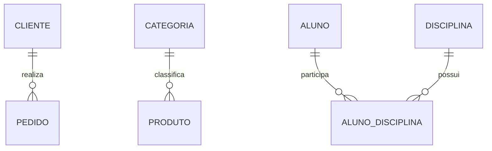
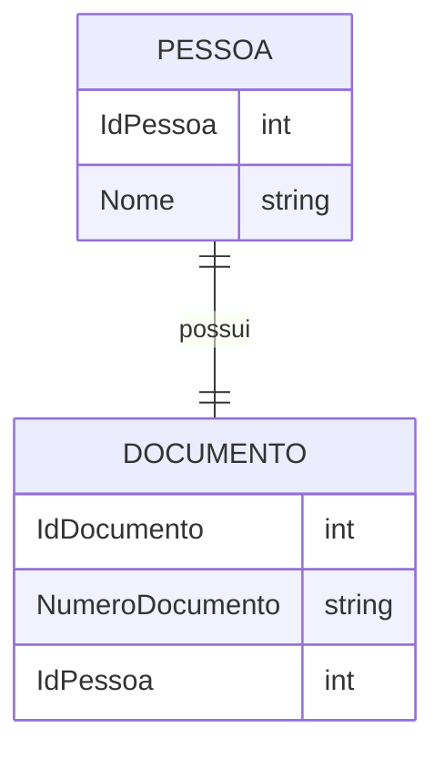
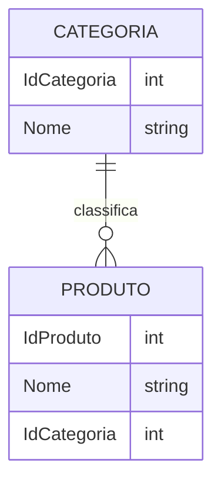
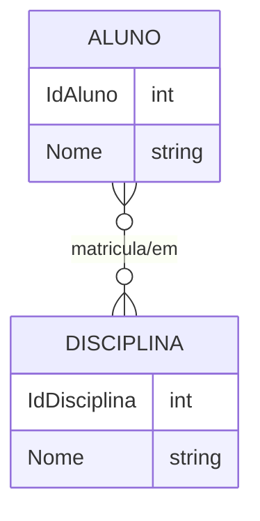
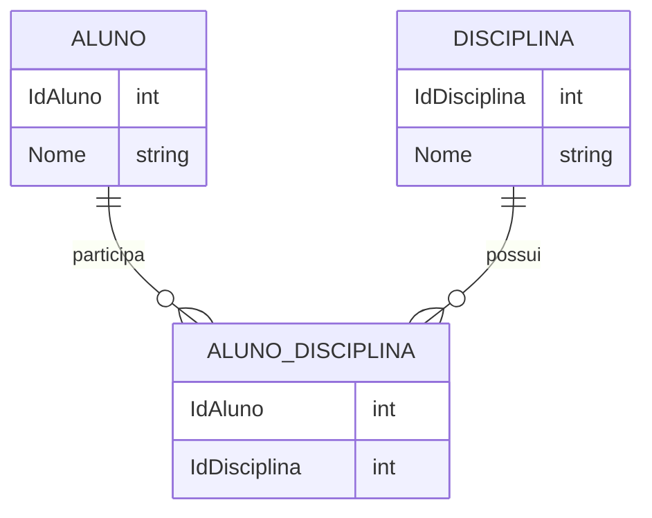
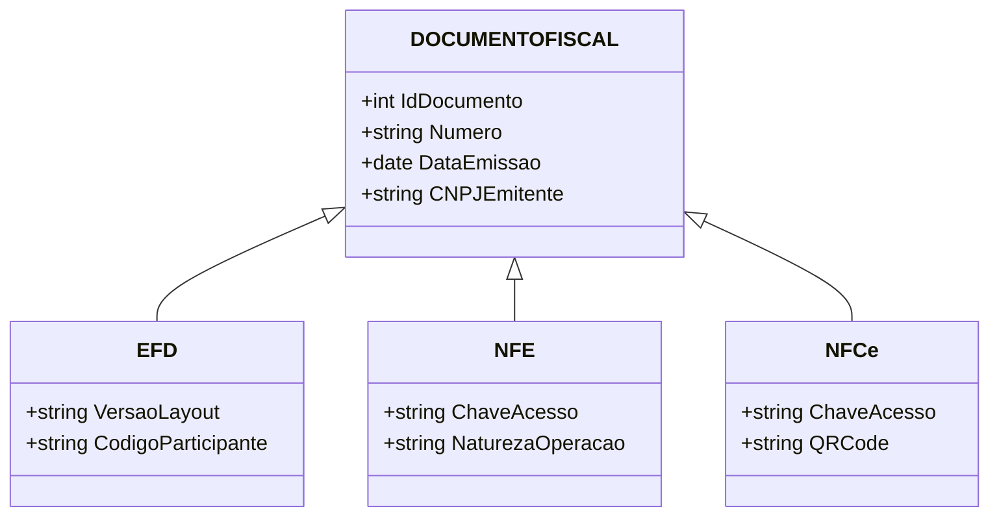

# 5.7 Relacionamentos

## Conceito
Os relacionamentos definem como as tabelas de um banco de dados se conectam entre si. Eles são fundamentais para representar a realidade do negócio e garantir a integridade dos dados.

## FOREIGN KEY
Uma FOREIGN KEY é uma coluna ou conjunto de colunas em uma tabela que referencia a PRIMARY KEY de outra tabela. Ela estabelece um vínculo entre os registros e impede que sejam criados valores inconsistentes.

### Exemplo de construção
```sql
CREATE TABLE Clientes (
    IdCliente INT PRIMARY KEY,
    Nome VARCHAR(100) NOT NULL
);

CREATE TABLE Pedidos (
    IdPedido INT PRIMARY KEY,
    IdCliente INT,
    CONSTRAINT FK_Pedidos_Clientes
        FOREIGN KEY (IdCliente) REFERENCES Clientes(IdCliente)
);
```

## Ações ao excluir ou atualizar dados

### CASCADE
A ação CASCADE faz com que alterações ou exclusões em uma tabela pai sejam refletidas automaticamente nas linhas relacionadas da tabela filha.

```sql
CREATE TABLE Pedidos (
    IdPedido INT PRIMARY KEY,
    IdCliente INT,
    CONSTRAINT FK_Pedidos_Clientes
        FOREIGN KEY (IdCliente) REFERENCES Clientes(IdCliente)
        ON DELETE CASCADE
        ON UPDATE CASCADE
);
```

### SET NULL
A ação SET NULL define o valor da chave estrangeira como NULL quando o registro relacionado for removido ou alterado.

```sql
CREATE TABLE Pedidos (
    IdPedido INT PRIMARY KEY,
    IdCliente INT NULL,
    CONSTRAINT FK_Pedidos_Clientes
        FOREIGN KEY (IdCliente) REFERENCES Clientes(IdCliente)
        ON DELETE SET NULL
        ON UPDATE SET NULL
);
```

### NO ACTION
A ação NO ACTION impede a exclusão ou atualização do registro pai se houver dependências na tabela filha.

```sql
CREATE TABLE Pedidos (
    IdPedido INT PRIMARY KEY,
    IdCliente INT,
    CONSTRAINT FK_Pedidos_Clientes
        FOREIGN KEY (IdCliente) REFERENCES Clientes(IdCliente)
        ON DELETE NO ACTION
        ON UPDATE NO ACTION
);
```

## Restrições e integridade
As constraints ajudam a manter a consistência dos dados. Relacionamentos bem definidos evitam registros órfãos e preservam a lógica do modelo.

## Desempenho
Relacionamentos corretos melhoram a organização do banco e facilitam consultas com JOIN. No entanto, relações excessivamente complexas ou tabelas mal indexadas podem prejudicar o desempenho.

## Diagrama entidade-relacionamento (DER)
A seguir, um exemplo simples de diagrama ER em Mermaid mostrando a cardinalidade dos principais relacionamentos:


### Legenda
- 1 para 1: um registro de uma tabela está associado a um único registro da outra.
- 1 para N: um registro de uma tabela pode estar associado a vários registros da outra.
- N para N: vários registros de uma tabela podem se relacionar com vários registros da outra, geralmente por meio de uma tabela associativa.

## Tipos de relacionamentos

### 1:1
Um relacionamento 1:1 ocorre quando um registro de uma tabela está associado a no máximo um registro de outra tabela.

```sql
CREATE TABLE Pessoas (
    IdPessoa INT PRIMARY KEY,
    Nome VARCHAR(100) NOT NULL
);

CREATE TABLE Documentos (
    IdDocumento INT PRIMARY KEY,
    IdPessoa INT UNIQUE,
    NumeroDocumento VARCHAR(20),
    CONSTRAINT FK_Documentos_Pessoas
        FOREIGN KEY (IdPessoa) REFERENCES Pessoas(IdPessoa)
);
```



### 1:N
Um relacionamento 1:N ocorre quando um registro de uma tabela pode estar associado a vários registros de outra tabela.

```sql
CREATE TABLE Categorias (
    IdCategoria INT PRIMARY KEY,
    Nome VARCHAR(100) NOT NULL
);

CREATE TABLE Produtos (
    IdProduto INT PRIMARY KEY,
    Nome VARCHAR(100) NOT NULL,
    IdCategoria INT,
    CONSTRAINT FK_Produtos_Categorias
        FOREIGN KEY (IdCategoria) REFERENCES Categorias(IdCategoria)
);
```



### N:N
Um relacionamento N:N acontece quando vários registros de uma tabela podem estar relacionados a vários registros de outra tabela.

```sql
CREATE TABLE Alunos (
    IdAluno INT PRIMARY KEY,
    Nome VARCHAR(100) NOT NULL
);

CREATE TABLE Disciplinas (
    IdDisciplina INT PRIMARY KEY,
    Nome VARCHAR(100) NOT NULL
);

CREATE TABLE AlunosDisciplinas (
    IdAluno INT,
    IdDisciplina INT,
    PRIMARY KEY (IdAluno, IdDisciplina),
    CONSTRAINT FK_AlunosDisciplinas_Alunos
        FOREIGN KEY (IdAluno) REFERENCES Alunos(IdAluno),
    CONSTRAINT FK_AlunosDisciplinas_Disciplinas
        FOREIGN KEY (IdDisciplina) REFERENCES Disciplinas(IdDisciplina)
);
```





## Tabela associativa
A tabela associativa resolve relacionamentos N:N, armazenando a ligação entre os registros das duas tabelas.

```sql
CREATE TABLE PedidoProduto (
    IdPedido INT,
    IdProduto INT,
    Quantidade INT NOT NULL,
    PRIMARY KEY (IdPedido, IdProduto),
    CONSTRAINT FK_PedidoProduto_Pedido
        FOREIGN KEY (IdPedido) REFERENCES Pedidos(IdPedido),
    CONSTRAINT FK_PedidoProduto_Produto
        FOREIGN KEY (IdProduto) REFERENCES Produtos(IdProduto)
);
```

## Auto-relacionamento
Um auto-relacionamento ocorre quando uma tabela se relaciona com ela mesma.

```sql
CREATE TABLE Funcionarios (
    IdFuncionario INT PRIMARY KEY,
    Nome VARCHAR(100) NOT NULL,
    IdGerente INT NULL,
    CONSTRAINT FK_Funcionarios_Gerente
        FOREIGN KEY (IdGerente) REFERENCES Funcionarios(IdFuncionario)
);
```

## Hierarquia e herança
Em modelos de dados, uma hierarquia pode representar uma relação de generalização/especialização, em que uma entidade genérica possui subclasses específicas. Um exemplo clássico é o de documentos fiscais.

### Exemplo: Documento Fiscal, EFD, NFE e NFCe
A tabela DocumentoFiscal representa a entidade geral. As tabelas EFD, NFE e NFCe representam especializações desse tipo de documento, cada uma com atributos próprios.

### Modelo conceitual
- DocumentoFiscal: IdDocumento, Numero, DataEmissao, CNPJEmitente
- EFD: IdDocumento, VersaoLayout, CodigoParticipante
- NFE: IdDocumento, ChaveAcesso, NaturezaOperacao
- NFCe: IdDocumento, ChaveAcesso, QRCode



> Na herança apresentada, as subclasses EFD, NFE e NFCe são disjuntas, ou seja, um documento fiscal pode ser de apenas um tipo específico. Além disso, não é permitida herança múltipla, pois uma instância não pode pertencer simultaneamente a duas subclasses diferentes.

### Implementação em SQL com herança
Uma forma comum de representar essa herança é usar uma tabela pai com os atributos comuns e tabelas filhas com os atributos específicos, ligadas pela chave primária/estrangeira.

```sql
CREATE TABLE DocumentoFiscal (
    IdDocumento INT PRIMARY KEY,
    Numero VARCHAR(20) NOT NULL,
    DataEmissao DATE NOT NULL,
    CNPJEmitente VARCHAR(14) NOT NULL
);

CREATE TABLE EFD (
    IdDocumento INT PRIMARY KEY,
    VersaoLayout VARCHAR(20) NOT NULL,
    CodigoParticipante VARCHAR(20),
    CONSTRAINT FK_EFD_DocumentoFiscal
        FOREIGN KEY (IdDocumento) REFERENCES DocumentoFiscal(IdDocumento)
);

CREATE TABLE NFE (
    IdDocumento INT PRIMARY KEY,
    ChaveAcesso VARCHAR(44) NOT NULL,
    NaturezaOperacao VARCHAR(100),
    CONSTRAINT FK_NFE_DocumentoFiscal
        FOREIGN KEY (IdDocumento) REFERENCES DocumentoFiscal(IdDocumento)
);

CREATE TABLE NFCe (
    IdDocumento INT PRIMARY KEY,
    ChaveAcesso VARCHAR(44) NOT NULL,
    QRCode VARCHAR(200),
    CONSTRAINT FK_NFCe_DocumentoFiscal
        FOREIGN KEY (IdDocumento) REFERENCES DocumentoFiscal(IdDocumento)
);
```

### Observação
Essa estrutura representa uma herança de tipo "uma tabela para a superclasse e uma tabela para cada subclasse", que é uma forma bastante utilizada em bancos relacionais para modelar generalização e especialização.

## Boas práticas
- Use FOREIGN KEY para garantir integridade referencial.
- Escolha o tipo de relacionamento de acordo com a regra de negócio.
- Relacionamentos N:N devem ser implementados com tabela associativa.
- Defina ações como CASCADE, SET NULL ou NO ACTION com cuidado.
- Crie índices nas colunas usadas em joins e chaves estrangeiras.
