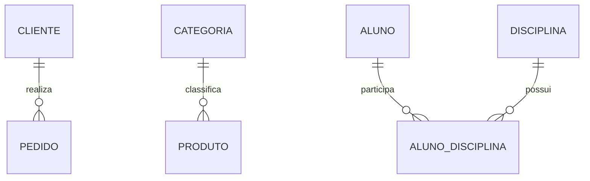
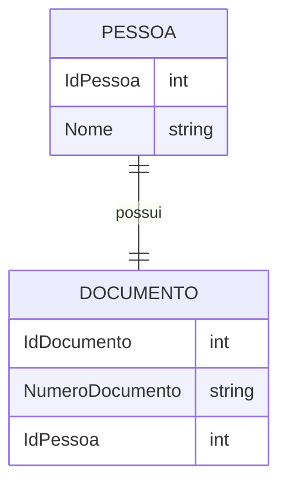
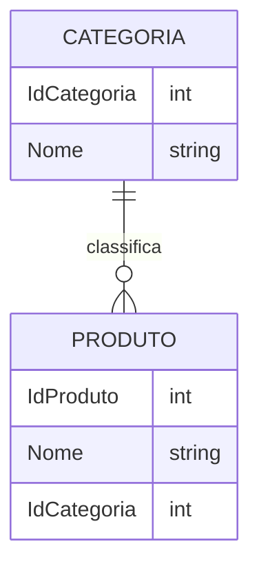
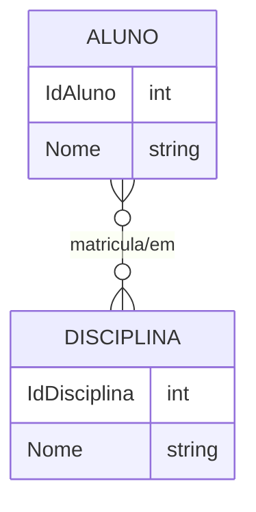
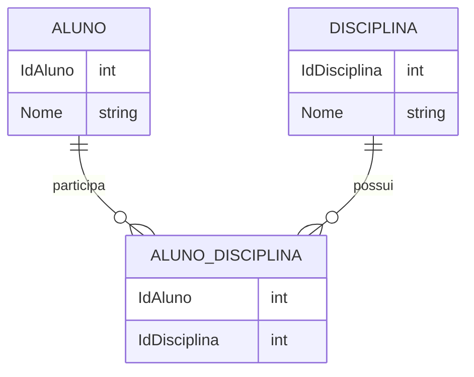
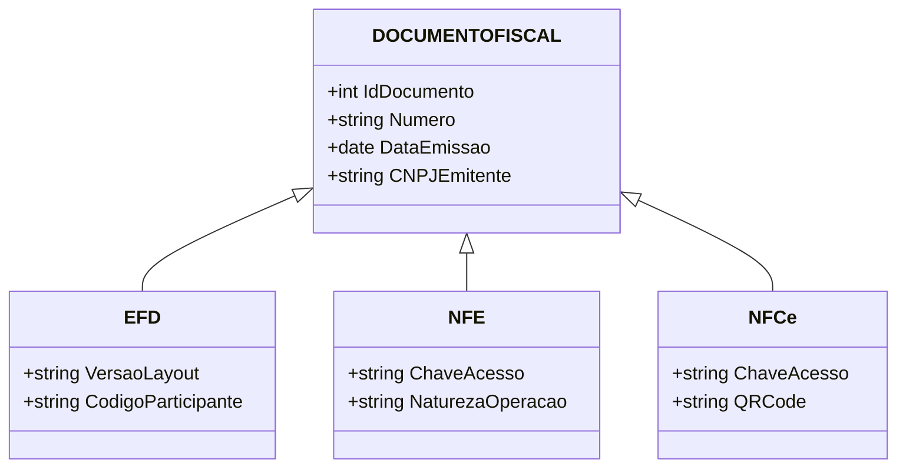

# Apostila Completa — Modelagem Física, DDL e ALTER TABLE no SQL Server
## Módulo 01 — Banco de Dados Relacionais

Este documento reúne, em um único arquivo, todo o conteúdo do diretório `01_DDL_CREATE_ALTER`, organizado na mesma sequência numérica dos arquivos originais, seguido dos roteiros de exercícios práticos e dos roteiros de auditoria fiscal (schema `fisc`).


<div class="page-break"></div>

# Parte 01 — 1.1 Introdução à Modelagem Física

## 1.1 Introdução à Modelagem Física

### O que é?
A modelagem física transforma o modelo lógico em estruturas implementáveis no SGBD.

### Fluxo
```
Requisitos → DER → Modelo Lógico → Modelo Físico → SQL Server
```

### Objetivos

- Definir tabelas.
- Escolher tipos de dados.
- Definir restrições.
- Otimizar armazenamento.

### Estudo de caso
Sistema acadêmico contendo tabelas Aluno, Curso, Professor e Matrícula.

### Exercício
Explique a diferença entre modelo lógico e físico.


<div class="page-break"></div>

# Parte 02 — 1.2 CREATE DATABASE

## 1.2 CREATE DATABASE

### Conceito
Cria um novo banco de dados.

```sql
CREATE DATABASE Universidade;
```

### Exemplo avançado

```sql
CREATE DATABASE Universidade
ON PRIMARY
(
 NAME='Universidade',
 FILENAME='C:\Dados\Universidade.mdf',
 SIZE=100MB,
 FILEGROWTH=50MB
)
LOG ON
(
 NAME='Universidade_Log',
 FILENAME='C:\Dados\Universidade.ldf',
 SIZE=50MB
);
```

### Aplicações

- Novos projetos.
- Ambientes de desenvolvimento.
- Testes.

### Boas práticas
Separar dados e logs em discos distintos.


<div class="page-break"></div>

# Parte 03 — 1.3 Schemas

## 1.3 Schemas

### Conceito
Schemas organizam objetos e facilitam segurança.

```sql
CREATE SCHEMA Academico;
GO

CREATE TABLE Academico.Aluno
(
 IdAluno INT PRIMARY KEY,
 Nome VARCHAR(100)
);
```

### Vantagens

- Organização.
- Controle de permissões.
- Modularização.

### Exemplo
Schemas: Academico, Financeiro e RH.


<div class="page-break"></div>

# Parte 04 — 1.4 CREATE TABLE

## 1.4 CREATE TABLE

### Conceito

O comando `CREATE TABLE` define a estrutura física de uma tabela no SQL Server: colunas, tipos, restrições, valores padrão e opções de armazenamento. No contexto da fiscalização tributária, ele é usado para organizar dados de EFD, NF-e, itens de NF-e e demais registros fiscais.

### Sintaxe básica
```sql
CREATE TABLE [schema].[Tabela] (
	Coluna1 Tipo [NULL | NOT NULL] [CONSTRAINT ...],
	Coluna2 Tipo [NULL | NOT NULL] [IDENTITY(...)] [DEFAULT ...],
	..., 
	[CONSTRAINT <nome> PRIMARY KEY (col1 [, col2...])],
	[CONSTRAINT <nome> FOREIGN KEY (col) REFERENCES OutraTabela(col)],
	[CONSTRAINT <nome> UNIQUE (col)],
	[CONSTRAINT <nome> CHECK (predicado)]
) [ON <filegroup | partition_scheme(column)>]
```

### Explicação dos componentes

- `table_name`: é o nome da tabela a ser criada.
- `col_name`: identifica cada coluna da tabela.
- `type`: define o tipo de dado da coluna (por exemplo `INT`, `VARCHAR`, `DATE`, `DECIMAL`).
- `NULL / NOT NULL`: indica se a coluna aceita ou exige valor.
- `DEFAULT`: define um valor padrão quando nenhum valor for informado.
- `IDENTITY`: gera valores automáticos para colunas numéricas.
- `CONSTRAINT`: define regras de integridade, como chave primária, chave estrangeira, unicidade e validação.

### Exemplo simples: tabela de abertura da EFD

```sql
CREATE TABLE dbo.EFD_0000 (
	sqcontrib INT NOT NULL,
	nrcnpj VARCHAR(14) NOT NULL,
	nrinscrestadual VARCHAR(14) NULL,
	sguf CHAR(2) NOT NULL,
	dtinicial DATE NOT NULL,
	dtfinal DATE NOT NULL,
	stregistro INT NOT NULL DEFAULT 1,
	CONSTRAINT PK_EFD_0000 PRIMARY KEY (sqcontrib)
);
```

Essa tabela representa o cabeçalho da Escrituração Fiscal Digital e armazena os dados principais do contribuinte e do período de apuração.

### Constraints (restrições) em exemplos fiscais

- `PRIMARY KEY`: identifica unicamente cada registro.
- `UNIQUE`: evita duplicidade de valores como chave de acesso de NF-e.
- `FOREIGN KEY`: garante vínculo entre tabelas, como NF-e e itens de NF-e.
- `CHECK`: valida regras de negócio, como status da NF-e.

Exemplo com constraints:

```sql
CREATE TABLE dbo.NFE (
	sqnfe BIGINT NOT NULL,
	tpnfe INT NOT NULL,
	nrchaveacesso VARCHAR(44) NOT NULL,
	vltotalnota DECIMAL(16,2) NOT NULL,
	stnfe CHAR(1) NOT NULL,
	CONSTRAINT PK_NFE PRIMARY KEY (sqnfe, tpnfe),
	CONSTRAINT UQ_NFE_CHAVE UNIQUE (nrchaveacesso),
	CONSTRAINT CK_NFE_STATUS CHECK (stnfe IN ('A','C','D','I','O','U'))
);

CREATE TABLE dbo.ITEM_NFE (
	sqitemnfe BIGINT IDENTITY(1,1) PRIMARY KEY,
	sqnfe BIGINT NOT NULL,
	tpnfe INT NOT NULL,
	cdncm VARCHAR(10) NULL,
	vlproduto DECIMAL(16,2) NOT NULL,
	CONSTRAINT FK_ITEM_NFE_NFE FOREIGN KEY (sqnfe, tpnfe)
		REFERENCES dbo.NFE (sqnfe, tpnfe)
);
```

Nesse exemplo, a tabela `ITEM_NFE` depende da tabela `NFE`, preservando a integridade referencial entre os itens e a nota fiscal.

### Tipos especiais de tabela

- Tabelas temporárias: `#Temp` (local) e `##GlobalTemp` (global).
- Table variables: `DECLARE @T TABLE(...)` para escopo de batch/procedimento.
- Memory-optimized tables: `WITH (MEMORY_OPTIMIZED = ON)` — para cargas especiais em memória.

### Particionamento e filegroups

- Para grandes volumes de dados fiscais, é comum planejar partições por período, como mês ou ano.
- O uso de `filegroups` pode ajudar a organizar bases com alta volumetria.

### SELECT INTO vs CREATE + INSERT

- `SELECT INTO NewTable FROM ...` cria uma nova tabela automaticamente a partir de um `SELECT`.
- `CREATE TABLE` + `INSERT INTO` oferece mais controle sobre tipos, constraints e índices.

#### Exemplo 1: criar tabela temporária para dados de NF-e

```sql
SELECT sqnfe, nrchaveacesso, vltotalnota
INTO dbo.StagingNFE
FROM dbo.NFE
WHERE stnfe = 'A';
```

#### Exemplo 2: criar tabela de staging para registros da EFD

```sql
CREATE TABLE dbo.StagingEFD_C100 (
	sqnfoutra BIGINT NOT NULL,
	sqcontrib INT NOT NULL,
	nrchavenfe VARCHAR(44) NULL,
	vltotalnf DECIMAL(16,2) NOT NULL,
	CONSTRAINT PK_StagingEFD_C100 PRIMARY KEY (sqnfoutra)
);

INSERT INTO dbo.StagingEFD_C100 (sqnfoutra, sqcontrib, nrchavenfe, vltotalnf)
SELECT sqnfoutra, sqcontrib, nrchavenfe, vltotalnf
FROM dbo.EFD_C100;
```

Essa abordagem é útil em processos de integração, ETL, auditoria e análise de dados fiscais.

### Índices, compressão e columnstore

- A `CREATE TABLE` normalmente declara a chave primária; índices adicionais podem ser criados depois.
- Para consultas analíticas sobre EFD e NF-e, pode ser interessante criar índices em colunas como período, chave de acesso ou status.

```sql
CREATE NONCLUSTERED INDEX IX_NFE_STATUS ON dbo.NFE(stnfe);
```

### Boas práticas

- Escolha tipos de dados adequados, como `VARCHAR` para códigos e `DECIMAL` para valores monetários.
- Use chaves primárias estáveis e, quando possível, numéricas.
- Nomeie constraints com prefixos como `PK_`, `FK_`, `UQ_` e `CK_`.
- Evite criar muitos índices em tabelas com alto volume de escrita.
- Planeje particionamento para bases fiscais com muitos registros ao longo do tempo.

### Exemplo completo: tabela de documentos da EFD

```sql
CREATE TABLE dbo.EFD_C100 (
	sqnfoutra BIGINT NOT NULL,
	sqcontrib INT NOT NULL,
	nrchavenfe VARCHAR(44) NULL,
	vltotalnf DECIMAL(16,2) NOT NULL,
	CONSTRAINT PK_EFD_C100 PRIMARY KEY (sqnfoutra),
	CONSTRAINT FK_EFD_C100_EFD FOREIGN KEY (sqcontrib)
		REFERENCES dbo.EFD_0000 (sqcontrib)
);
```

### Considerações sobre alterações (ALTER TABLE)

- Alterar uma coluna para `NOT NULL` exige que os dados já estejam preenchidos.
- Operações que modificam estrutura de tabelas grandes podem demandar planejamento e testes em ambiente de staging.

---

Esse conteúdo agora usa exemplos diretamente ligados à fiscalização tributária, com foco em EFD, NF-e e itens de NF-e.


<div class="page-break"></div>

# Parte 05 — 1.5 Tipos de Dados

## 1.5 Tipos de Dados

### Objetivo
Selecionar o tipo mais adequado para cada informação, considerando precisão, espaço ocupado e semântica do dado.

### Categorias de tipos no SQL Server

#### 1. Tipos numéricos
Os tipos numéricos armazenam valores inteiros, decimais e financeiros.

| Tipo | Descrição | Exemplo |
|------|-----------|---------|
| TINYINT | Inteiro pequeno (0 a 255) | `TINYINT` |
| SMALLINT | Inteiro pequeno | `SMALLINT` |
| INT | Inteiro padrão | `INT` |
| BIGINT | Inteiro grande | `BIGINT` |
| DECIMAL / NUMERIC | Números com precisão fixa | `DECIMAL(10,2)` |
| FLOAT | Número de ponto flutuante | `FLOAT` |
| REAL | Número de ponto flutuante menor | `REAL` |
| MONEY | Valores monetários | `MONEY` |
| SMALLMONEY | Valor monetário menor | `SMALLMONEY` |

#### 2. Tipos de texto e caracteres
Utilizados para armazenar cadeias de caracteres.

| Tipo | Descrição | Exemplo |
|------|-----------|---------|
| CHAR(n) | Texto fixo com tamanho definido | `CHAR(10)` |
| VARCHAR(n) | Texto variável | `VARCHAR(100)` |
| VARCHAR(MAX) | Texto variável de tamanho grande | `VARCHAR(MAX)` |
| NCHAR(n) | Texto Unicode fixo | `NCHAR(10)` |
| NVARCHAR(n) | Texto Unicode variável | `NVARCHAR(100)` |
| NVARCHAR(MAX) | Texto Unicode variável de grande porte | `NVARCHAR(MAX)` |
| TEXT | Tipo legado para texto grande | `TEXT` |
| NTEXT | Tipo legado para texto Unicode | `NTEXT` |

#### 3. Tipos de data e hora
Armazenam valores temporais.

| Tipo | Descrição | Exemplo |
|------|-----------|---------|
| DATE | Apenas data | `DATE` |
| TIME | Apenas hora | `TIME` |
| DATETIME | Data e hora com menor precisão | `DATETIME` |
| DATETIME2 | Data e hora com maior precisão | `DATETIME2` |
| SMALLDATETIME | Data e hora com precisão menor | `SMALLDATETIME` |
| DATETIMEOFFSET | Data e hora com fuso horário | `DATETIMEOFFSET` |

#### 4. Tipos binários
Armazenam dados em formato binário.

| Tipo | Descrição | Exemplo |
|------|-----------|---------|
| BINARY(n) | Dados binários fixos | `BINARY(8)` |
| VARBINARY(n) | Dados binários variáveis | `VARBINARY(200)` |
| VARBINARY(MAX) | Dados binários grandes | `VARBINARY(MAX)` |
| IMAGE | Tipo legado para dados binários grandes | `IMAGE` |

#### 1. Tipo lógico
Representa valores verdadeiros ou falsos.

| Tipo | Descrição | Exemplo |
|------|-----------|---------|
| BIT | Valor booleano (0 ou 1) | `BIT` |

#### 6. Tipos especiais
Tipos utilizados para identificar, representar valores únicos ou dados específicos.

| Tipo | Descrição | Exemplo |
|------|-----------|---------|
| UNIQUEIDENTIFIER | Identificador global único (GUID) | `UNIQUEIDENTIFIER` |
| XML | Dados em formato XML | `XML` |
| SQL_VARIANT | Pode armazenar valores de diferentes tipos | `SQL_VARIANT` |
| HIERARCHYID | Representa uma posição em uma hierarquia | `HIERARCHYID` |
| GEOGRAPHY | Dados geográficos espaciais | `GEOGRAPHY` |
| GEOMETRY | Dados geométricos espaciais | `GEOMETRY` |

### Exemplo completo

```sql
CREATE TABLE Produto
(
    Id INT,
    Nome VARCHAR(100),
    Preco DECIMAL(10,2),
    DataCadastro DATETIME2,
    Ativo BIT,
    CodigoInterno UNIQUEIDENTIFIER,
    Descricao XML
);
```

### Boas práticas

- Escolher sempre o menor tipo capaz de armazenar o valor.
- Usar `VARCHAR` e `NVARCHAR` conforme a necessidade de Unicode.
- Para textos com caracteres latinos básicos, como português, `VARCHAR` costuma ser suficiente e ocupa menos espaço que `NVARCHAR`.
- Usar `NVARCHAR` quando houver necessidade de armazenar caracteres Unicode, como acentos, letras de outros alfabetos, emojis ou textos multilíngues.
- Escolher `CHAR` apenas quando o tamanho do texto for fixo e previsível, como códigos, siglas, estados, CPF, CEP ou identificadores com comprimento definido.
- Evitar `VARCHAR` para valores que sempre tenham o mesmo tamanho, se a estrutura do dado exigir comprimento fixo; nesse caso, `CHAR` pode ser mais adequado.
- Preferir `DATE`, `TIME` e `DATETIME2` em vez de tipos mais antigos, como `DATETIME`.
- Evitar `TEXT`, `NTEXT` e `IMAGE` em novos projetos, pois são tipos legados.
- Considerar o uso de tipos espaciais e hierárquicos somente quando houver necessidade específica.


<div class="page-break"></div>

# Parte 06 — 1.6 Constraints

## 1.6 Constraints

### Conceito
Constraints são regras aplicadas às colunas ou tabelas para garantir a integridade, consistência e qualidade dos dados armazenados no banco.

### Principais constraints

#### PRIMARY KEY
A constraint PRIMARY KEY identifica de forma única cada linha da tabela. Uma coluna com essa restrição não pode ter valores nulos e não pode repetir.

```sql
CREATE TABLE Cliente
(
    IdCliente INT PRIMARY KEY,
    Nome VARCHAR(100) NOT NULL
);
```

#### FOREIGN KEY
A constraint FOREIGN KEY cria um relacionamento entre duas tabelas, garantindo que o valor informado em uma coluna exista na tabela referenciada.

```sql
CREATE TABLE Pedido
(
    IdPedido INT PRIMARY KEY,
    IdCliente INT,
    CONSTRAINT FK_Pedido_Cliente FOREIGN KEY (IdCliente)
        REFERENCES Cliente(IdCliente)
);
```

#### NOT NULL
A constraint NOT NULL obriga que uma coluna sempre receba um valor, impedindo registros incompletos.

```sql
CREATE TABLE Produto
(
    IdProduto INT PRIMARY KEY,
    Nome VARCHAR(100) NOT NULL
);
```

#### UNIQUE
A constraint UNIQUE garante que os valores de uma coluna ou conjunto de colunas não se repitam na tabela.

```sql
CREATE TABLE Cliente
(
    IdCliente INT PRIMARY KEY,
    CPF CHAR(11) UNIQUE,
    Email VARCHAR(100) UNIQUE
);
```

#### CHECK
A constraint CHECK valida se os valores informados atendem a uma condição específica.

```sql
CREATE TABLE Pessoa
(
    IdPessoa INT PRIMARY KEY,
    Idade INT CHECK (Idade >= 18),
    Salario DECIMAL(10,2) CHECK (Salario > 0)
);
```

#### DEFAULT
A constraint DEFAULT define um valor automaticamente preenchido quando nenhum valor for informado na inserção.

```sql
CREATE TABLE Pedido
(
    IdPedido INT PRIMARY KEY,
    DataCadastro DATE DEFAULT GETDATE(),
    Status VARCHAR(20) DEFAULT 'PENDENTE'
);
```

### Exemplo completo

```sql
CREATE TABLE Cliente
(
    IdCliente INT PRIMARY KEY,
    Nome VARCHAR(100) NOT NULL,
    CPF CHAR(11) UNIQUE,
    Idade INT CHECK (Idade >= 18),
    DataCadastro DATE DEFAULT GETDATE()
);
```

### Benefícios

- Evita dados inválidos.
- Implementa regras de negócio diretamente no banco.
- Mantém a integridade referencial entre tabelas.
- Reduz a necessidade de validações manuais no aplicativo.

### Boas práticas

- Use PRIMARY KEY para identificar de forma única cada registro.
- Defina FOREIGN KEY sempre que houver relacionamento entre tabelas.
- Aplique NOT NULL em colunas essenciais para evitar registros incompletos.
- Use UNIQUE para campos que devem ser exclusivos, como CPF, e-mail ou código.
- Aplique CHECK para regras simples e claras, como faixa de idade ou valores positivos.
- Use DEFAULT para preencher valores padrão e reduzir a repetição de código nas inserções.
- Evite criar constraints demais sem necessidade; cada regra deve ter um propósito claro.


<div class="page-break"></div>

# Parte 07 — 1.7 Relacionamentos

## 1.7 Relacionamentos

### Conceito
Os relacionamentos definem como as tabelas de um banco de dados se conectam entre si. Eles são fundamentais para representar a realidade do negócio e garantir a integridade dos dados.

### FOREIGN KEY
Uma FOREIGN KEY é uma coluna ou conjunto de colunas em uma tabela que referencia a PRIMARY KEY de outra tabela. Ela estabelece um vínculo entre os registros e impede que sejam criados valores inconsistentes.

#### Exemplo de construção
```sql
CREATE TABLE Clientes (
    IdCliente INT PRIMARY KEY,
    Nome VARCHAR(100) NOT NULL
);

CREATE TABLE Pedidos (
    IdPedido INT PRIMARY KEY,
    IdCliente INT,
    CONSTRAINT FK_Pedidos_Clientes
        FOREIGN KEY (IdCliente) REFERENCES Clientes(IdCliente)
);
```

### Ações ao excluir ou atualizar dados

#### CASCADE
A ação CASCADE faz com que alterações ou exclusões em uma tabela pai sejam refletidas automaticamente nas linhas relacionadas da tabela filha.

```sql
CREATE TABLE Pedidos (
    IdPedido INT PRIMARY KEY,
    IdCliente INT,
    CONSTRAINT FK_Pedidos_Clientes
        FOREIGN KEY (IdCliente) REFERENCES Clientes(IdCliente)
        ON DELETE CASCADE
        ON UPDATE CASCADE
);
```

#### SET NULL
A ação SET NULL define o valor da chave estrangeira como NULL quando o registro relacionado for removido ou alterado.

```sql
CREATE TABLE Pedidos (
    IdPedido INT PRIMARY KEY,
    IdCliente INT NULL,
    CONSTRAINT FK_Pedidos_Clientes
        FOREIGN KEY (IdCliente) REFERENCES Clientes(IdCliente)
        ON DELETE SET NULL
        ON UPDATE SET NULL
);
```

#### NO ACTION
A ação NO ACTION impede a exclusão ou atualização do registro pai se houver dependências na tabela filha.

```sql
CREATE TABLE Pedidos (
    IdPedido INT PRIMARY KEY,
    IdCliente INT,
    CONSTRAINT FK_Pedidos_Clientes
        FOREIGN KEY (IdCliente) REFERENCES Clientes(IdCliente)
        ON DELETE NO ACTION
        ON UPDATE NO ACTION
);
```

### Restrições e integridade
As constraints ajudam a manter a consistência dos dados. Relacionamentos bem definidos evitam registros órfãos e preservam a lógica do modelo.

### Desempenho
Relacionamentos corretos melhoram a organização do banco e facilitam consultas com JOIN. No entanto, relações excessivamente complexas ou tabelas mal indexadas podem prejudicar o desempenho.

### Diagrama entidade-relacionamento (DER)
A seguir, um exemplo simples de diagrama ER em Mermaid mostrando a cardinalidade dos principais relacionamentos:


#### Legenda

- 1 para 1: um registro de uma tabela está associado a um único registro da outra.
- 1 para N: um registro de uma tabela pode estar associado a vários registros da outra.
- N para N: vários registros de uma tabela podem se relacionar com vários registros da outra, geralmente por meio de uma tabela associativa.

### Tipos de relacionamentos

#### 1:1
Um relacionamento 1:1 ocorre quando um registro de uma tabela está associado a no máximo um registro de outra tabela.

```sql
CREATE TABLE Pessoas (
    IdPessoa INT PRIMARY KEY,
    Nome VARCHAR(100) NOT NULL
);

CREATE TABLE Documentos (
    IdDocumento INT PRIMARY KEY,
    IdPessoa INT UNIQUE,
    NumeroDocumento VARCHAR(20),
    CONSTRAINT FK_Documentos_Pessoas
        FOREIGN KEY (IdPessoa) REFERENCES Pessoas(IdPessoa)
);
```



#### 1:N
Um relacionamento 1:N ocorre quando um registro de uma tabela pode estar associado a vários registros de outra tabela.

```sql
CREATE TABLE Categorias (
    IdCategoria INT PRIMARY KEY,
    Nome VARCHAR(100) NOT NULL
);

CREATE TABLE Produtos (
    IdProduto INT PRIMARY KEY,
    Nome VARCHAR(100) NOT NULL,
    IdCategoria INT,
    CONSTRAINT FK_Produtos_Categorias
        FOREIGN KEY (IdCategoria) REFERENCES Categorias(IdCategoria)
);
```



#### N:N
Um relacionamento N:N acontece quando vários registros de uma tabela podem estar relacionados a vários registros de outra tabela.

```sql
CREATE TABLE Alunos (
    IdAluno INT PRIMARY KEY,
    Nome VARCHAR(100) NOT NULL
);

CREATE TABLE Disciplinas (
    IdDisciplina INT PRIMARY KEY,
    Nome VARCHAR(100) NOT NULL
);

CREATE TABLE AlunosDisciplinas (
    IdAluno INT,
    IdDisciplina INT,
    PRIMARY KEY (IdAluno, IdDisciplina),
    CONSTRAINT FK_AlunosDisciplinas_Alunos
        FOREIGN KEY (IdAluno) REFERENCES Alunos(IdAluno),
    CONSTRAINT FK_AlunosDisciplinas_Disciplinas
        FOREIGN KEY (IdDisciplina) REFERENCES Disciplinas(IdDisciplina)
);
```





### Tabela associativa
A tabela associativa resolve relacionamentos N:N, armazenando a ligação entre os registros das duas tabelas.

```sql
CREATE TABLE PedidoProduto (
    IdPedido INT,
    IdProduto INT,
    Quantidade INT NOT NULL,
    PRIMARY KEY (IdPedido, IdProduto),
    CONSTRAINT FK_PedidoProduto_Pedido
        FOREIGN KEY (IdPedido) REFERENCES Pedidos(IdPedido),
    CONSTRAINT FK_PedidoProduto_Produto
        FOREIGN KEY (IdProduto) REFERENCES Produtos(IdProduto)
);
```

### Auto-relacionamento
Um auto-relacionamento ocorre quando uma tabela se relaciona com ela mesma.

```sql
CREATE TABLE Funcionarios (
    IdFuncionario INT PRIMARY KEY,
    Nome VARCHAR(100) NOT NULL,
    IdGerente INT NULL,
    CONSTRAINT FK_Funcionarios_Gerente
        FOREIGN KEY (IdGerente) REFERENCES Funcionarios(IdFuncionario)
);
```

### Hierarquia e herança
Em modelos de dados, uma hierarquia pode representar uma relação de generalização/especialização, em que uma entidade genérica possui subclasses específicas. Um exemplo clássico é o de documentos fiscais.

#### Exemplo: Documento Fiscal, EFD, NFE e NFCe
A tabela DocumentoFiscal representa a entidade geral. As tabelas EFD, NFE e NFCe representam especializações desse tipo de documento, cada uma com atributos próprios.

#### Modelo conceitual

- DocumentoFiscal: IdDocumento, Numero, DataEmissao, CNPJEmitente
- EFD: IdDocumento, VersaoLayout, CodigoParticipante
- NFE: IdDocumento, ChaveAcesso, NaturezaOperacao
- NFCe: IdDocumento, ChaveAcesso, QRCode



> Na herança apresentada, as subclasses EFD, NFE e NFCe são disjuntas, ou seja, um documento fiscal pode ser de apenas um tipo específico. Além disso, não é permitida herança múltipla, pois uma instância não pode pertencer simultaneamente a duas subclasses diferentes.

#### Implementação em SQL com herança
Uma forma comum de representar essa herança é usar uma tabela pai com os atributos comuns e tabelas filhas com os atributos específicos, ligadas pela chave primária/estrangeira.

```sql
CREATE TABLE DocumentoFiscal (
    IdDocumento INT PRIMARY KEY,
    Numero VARCHAR(20) NOT NULL,
    DataEmissao DATE NOT NULL,
    CNPJEmitente VARCHAR(14) NOT NULL
);

CREATE TABLE EFD (
    IdDocumento INT PRIMARY KEY,
    VersaoLayout VARCHAR(20) NOT NULL,
    CodigoParticipante VARCHAR(20),
    CONSTRAINT FK_EFD_DocumentoFiscal
        FOREIGN KEY (IdDocumento) REFERENCES DocumentoFiscal(IdDocumento)
);

CREATE TABLE NFE (
    IdDocumento INT PRIMARY KEY,
    ChaveAcesso VARCHAR(44) NOT NULL,
    NaturezaOperacao VARCHAR(100),
    CONSTRAINT FK_NFE_DocumentoFiscal
        FOREIGN KEY (IdDocumento) REFERENCES DocumentoFiscal(IdDocumento)
);

CREATE TABLE NFCe (
    IdDocumento INT PRIMARY KEY,
    ChaveAcesso VARCHAR(44) NOT NULL,
    QRCode VARCHAR(200),
    CONSTRAINT FK_NFCe_DocumentoFiscal
        FOREIGN KEY (IdDocumento) REFERENCES DocumentoFiscal(IdDocumento)
);
```

#### Observação
Essa estrutura representa uma herança de tipo "uma tabela para a superclasse e uma tabela para cada subclasse", que é uma forma bastante utilizada em bancos relacionais para modelar generalização e especialização.

### Boas práticas

- Use FOREIGN KEY para garantir integridade referencial.
- Escolha o tipo de relacionamento de acordo com a regra de negócio.
- Relacionamentos N:N devem ser implementados com tabela associativa.
- Defina ações como CASCADE, SET NULL ou NO ACTION com cuidado.
- Crie índices nas colunas usadas em joins e chaves estrangeiras.


<div class="page-break"></div>

# Parte 08 — Capítulo 08 – Índices no Microsoft SQL Server


## Capítulo 08 – Índices no Microsoft SQL Server

> Baseado na implementação do Microsoft SQL Server e nas práticas recomendadas da Microsoft.

### Objetivos

- Compreender o funcionamento dos índices.
- Escolher o tipo adequado para cada cenário.
- Interpretar planos de execução.
- Manter índices eficientes.

---

## 1. O que são índices no SQL Server

Índices são estruturas de dados mantidas pelo Storage Engine para localizar linhas com menor custo de E/S, reduzindo leituras e tempo de resposta.

**Aplicabilidade**

- Sistemas OLTP
- ERP
- Sistemas acadêmicos
- Auditoria fiscal

Exemplo:

```sql
CREATE INDEX IX_Aluno_Nome
ON dbo.Aluno(Nome);
```

---

## 2. Como o Storage Engine utiliza os índices

O otimizador escolhe entre **Index Seek**, **Index Scan** ou **Table Scan** conforme estatísticas, seletividade e custo estimado.

**Aplicabilidade**

- Otimização de consultas
- Diagnóstico de desempenho

---

## 3. Heap Tables

Heap é uma tabela sem Clustered Index.

```sql
CREATE TABLE LogEventos
(
 Id INT,
 Mensagem VARCHAR(200)
);
```

**Aplicabilidade**

- Tabelas de staging
- Cargas temporárias (ETL)

---

## 4. Clustered Index

Organiza fisicamente as páginas de dados pela chave.

```sql
CREATE CLUSTERED INDEX CX_Pedido
ON dbo.Pedido(DataPedido);
```

**Aplicabilidade**

- Consultas por intervalo
- Chaves sequenciais
- Grandes tabelas OLTP

---

## 1. Nonclustered Index

Estrutura separada contendo chave e ponteiro para os dados.

```sql
CREATE NONCLUSTERED INDEX IX_Cliente_CPF
ON dbo.Cliente(CPF);
```

**Aplicabilidade**

- Pesquisas frequentes
- Colunas usadas em WHERE

---

## 6. INCLUDE

Inclui colunas adicionais sem fazer parte da chave.

```sql
CREATE INDEX IX_Pedido_Data
ON dbo.Pedido(DataPedido)
INCLUDE (ValorTotal, Status);
```

**Aplicabilidade**

- Covering Index
- Evitar Key Lookup

---

## 7. Filtered Index

Indexa apenas subconjuntos de dados.

```sql
CREATE INDEX IX_Ativos
ON dbo.Cliente(Ativo)
WHERE Ativo=1;
```

**Aplicabilidade**

- Tabelas com poucos registros ativos
- Melhora desempenho e reduz espaço

---

## 8. XML Index

Otimiza consultas sobre colunas XML.

```sql
CREATE PRIMARY XML INDEX PXML_Documento
ON dbo.NotaFiscal(XMLDocumento);
```

**Aplicabilidade**

- Documentos XML
- NF-e
- Configurações

---

## 9. Spatial Index

Utilizado com tipos GEOGRAPHY e GEOMETRY.

```sql
CREATE SPATIAL INDEX SIX_Mapa
ON dbo.Cidades(Localizacao);
```

**Aplicabilidade**

- GIS
- Logística
- Rastreamento

---

## 10. Columnstore Index

Armazena dados por coluna.

```sql
CREATE CLUSTERED COLUMNSTORE INDEX CCI_Vendas
ON dbo.FatoVendas;
```

**Aplicabilidade**

- Data Warehouse
- BI
- Consultas analíticas

---

## 11. Estatísticas

Estatísticas auxiliam o otimizador na estimativa de cardinalidade.

```sql
UPDATE STATISTICS dbo.Cliente;
```

**Aplicabilidade**

- Melhor escolha de plano
- Consultas complexas

---

## 12. Plano de Execução

Ative o plano no SSMS (**Include Actual Execution Plan**) ou:

```sql
SET STATISTICS IO ON;
SET STATISTICS TIME ON;
```

**Aplicabilidade**

- Identificar gargalos
- Comparar índices

---

## 13. Missing Indexes

SQL Server identifica índices potencialmente úteis.

```sql
SELECT *
FROM sys.dm_db_missing_index_details;
```

**Aplicabilidade**

- Otimização orientada por evidências

---

## 14. DMVs para análise

Exemplo:

```sql
SELECT *
FROM sys.dm_db_index_usage_stats;
```

Outras úteis:

- sys.dm_db_index_physical_stats
- sys.indexes

**Aplicabilidade**

- Monitoramento
- Auditoria de desempenho

---

## 15. REBUILD

Reconstrói completamente o índice.

```sql
ALTER INDEX ALL
ON dbo.Cliente
REBUILD;
```

**Aplicabilidade**

- Alta fragmentação (>30%)

---

## 16. REORGANIZE

Desfragmentação online.

```sql
ALTER INDEX ALL
ON dbo.Cliente
REORGANIZE;
```

**Aplicabilidade**

- Fragmentação moderada (5%–30%)

---

## 17. FILLFACTOR

Reserva espaço nas páginas.

```sql
CREATE INDEX IX_Produto
ON dbo.Produto(Nome)
WITH (FILLFACTOR = 80);
```

**Aplicabilidade**

- Tabelas com muitas inserções/atualizações

---

## 18. Compressão

Compressão de linhas e páginas.

```sql
ALTER INDEX ALL
ON dbo.FatoVendas
REBUILD WITH (DATA_COMPRESSION = PAGE);
```

**Aplicabilidade**

- Grandes volumes
- Data Warehouse
- Economia de armazenamento

---

## Boas práticas

- Indexe colunas utilizadas em JOIN, WHERE e ORDER BY.
- Evite excesso de índices.
- Atualize estatísticas.
- Monitore fragmentação.
- Analise planos de execução antes de criar novos índices.

## Exercícios

1. Crie um Clustered Index para a tabela Pedido.
2. Crie um Nonclustered Index com INCLUDE.
3. Compare Heap e Clustered Index.
4. Consulte as DMVs de uso de índices.
5. Execute REORGANIZE e REBUILD e compare os resultados.


<div class="page-break"></div>

# Parte 09 — Performance

## Performance

### Objetivos

- Apresentar os principais fatores que impactam desempenho no SQL Server.
- Fornecer comandos e técnicas práticas para diagnóstico e otimização.
- Sugerir boas práticas de modelagem, indexação e manutenção.

### Introdução

Performance em bancos relacionais depende de decisões de modelagem, índices, estatísticas, configuração do servidor e do armazenamento. Neste capítulo focamos em SQL Server (Engine) e nas recomendações e tutoriais oficiais da Microsoft, trazendo exemplos práticos (DMVs, T-SQL e manutenção).

### Fundamentação teórica

- Motor de armazenamento: páginas (8 KB), extents (8 páginas). Entender como dados são alocados ajuda a explicar fragmentação e I/O.
- Planos de execução: o otimizador gera planos baseados em estatísticas; escolhas ruins de índice ou estatísticas defasadas produzem scans e operações caras.
- Tipos de índice: clustered, nonclustered, filtered, columnstore e coluna clusterizada; cada um atende cenários distintos.

### Arquitetura e funcionamento (SQL Server)

- Buffer pool: memória onde páginas são mantidas para reduzir I/O. Tamanho e pressão de memória afetam performance.
- Tempdb: área compartilhada para operações de classificação, hashing e objetos temporários; seu dimensionamento e layout influenciam concorrência.
- Locking & latching: isolamento e contenção impactam throughput; escolha de níveis de isolamento e uso de snapshot isolation pode mitigar bloqueios.

### Sintaxe e comandos úteis (DMVs e manutenção)

- Ver planos de execução estimado/real: use o Management Studio ou inclua `SET STATISTICS IO ON; SET STATISTICS TIME ON;` e visualize o plano.
- Ver índices fragmentados:

```sql
SELECT dbschemas.[name] AS SchemaName,
	   dbtables.[name] AS TableName,
	   dbindexes.[name] AS IndexName,
	   indexstats.avg_fragmentation_in_percent,
	   indexstats.page_count
FROM sys.dm_db_index_physical_stats(DB_ID(), NULL, NULL, NULL, 'LIMITED') indexstats
JOIN sys.tables dbtables ON dbtables.[object_id] = indexstats.object_id
JOIN sys.schemas dbschemas ON dbtables.[schema_id] = dbschemas.[schema_id]
JOIN sys.indexes dbindexes ON dbindexes.[object_id] = indexstats.object_id AND dbindexes.index_id = indexstats.index_id
WHERE indexstats.page_count > 100
ORDER BY indexstats.avg_fragmentation_in_percent DESC;
```

- Detectar índices faltantes (sugestões):

```sql
SELECT migs.avg_user_impact, mid.statement, mid.equality_columns, mid.inequality_columns, mid.included_columns
FROM sys.dm_db_missing_index_groups mig
JOIN sys.dm_db_missing_index_group_stats migs ON migs.group_handle = mig.index_group_handle
JOIN sys.dm_db_missing_index_details mid ON mig.index_handle = mid.index_handle
ORDER BY migs.avg_user_impact DESC;
```

- Rebuild / Reorganize índices:

```sql
-- Rebuild (mais completo)
ALTER INDEX ALL ON dbo.SuaTabela REBUILD;
-- Reorganize (online, menos intrusivo)
ALTER INDEX ALL ON dbo.SuaTabela REORGANIZE;
```

- Atualizar estatísticas:

```sql
UPDATE STATISTICS dbo.SuaTabela (NomeDaEstatistica) WITH FULLSCAN;
-- ou para todas as estatísticas
EXEC sp_updatestats;
```

### Exemplos básicos

- Criar índice clusterizado:

```sql
CREATE CLUSTERED INDEX IX_Tabela_PK ON dbo.Tabela(Chave);
```

- Criar índice não-clusterizado com included columns (cobertura):

```sql
CREATE NONCLUSTERED INDEX IX_Tabela_Col ON dbo.Tabela(ColA)
INCLUDE (ColB, ColC);
```

### Exemplos intermediários

- Usar `Query Store` para comparar planos:

```sql
ALTER DATABASE CURRENT SET QUERY_STORE = ON;
-- Depois consulte views do Query Store para identificar regressões
SELECT TOP 50 qsqt.query_sql_text, qsrs.count_executions, qsrs.avg_duration
FROM sys.query_store_query_text qsqt
JOIN sys.query_store_query qsq ON qsq.query_text_id = qsqt.query_text_id
JOIN sys.query_store_plan qsp ON qsp.query_id = qsq.query_id
JOIN sys.query_store_runtime_stats qsrs ON qsrs.plan_id = qsp.plan_id
ORDER BY qsrs.avg_duration DESC;
```

- Controlar parameter sniffing: usar `OPTIMIZE FOR UNKNOWN` ou compiled hints quando necessário.

### Exemplos avançados

- Columnstore para analytics (reduz I/O para grandes cargas):

```sql
CREATE CLUSTERED COLUMNSTORE INDEX CCI_YourTable ON dbo.YourTable;
```

- Particionamento para gerenciar grandes tabelas e manutenção por partition-switch:

```sql
CREATE PARTITION FUNCTION PF_Mes (datetime) AS RANGE RIGHT FOR VALUES ('2024-01-01','2024-02-01');
-- criar partition scheme e criar tabela particionada
```

### Aplicações em projetos reais

- Data warehouse: columnstore, compressão, batch loading e manutenção de estatísticas; foco em scans eficientes.
- OLTP de alta concorrência: índices estreitos e estáveis, transações curtas, otimização de tempdb e monitoramento de waits.

### Boas práticas (resumo)

- Escolha tipos de dados corretos: `varchar` vs `nvarchar` somente quando precisar de Unicode; prefira `datetime2` para maior precisão.
- Crie `CLUSTERED INDEX` em uma chave estável, estreita e seletiva.
- Use `INCLUDE` para evitar lookups em queries frequentes.
- Monitore `wait stats`, `dm_exec_query_stats`, `Query Store` e `sys.dm_db_index_physical_stats`.
- Agende manutenção: rebuild para índices com fragmentação alta (> 30%) e reorganize entre 5–30%.
- Habilite `AUTO_UPDATE_STATISTICS` e considere `FULLSCAN` para estatísticas críticas depois de cargas massivas.

### Erros comuns

- Criar muitos índices em tabelas com alto volume de escrita (impacto em INSERT/UPDATE/DELETE).
- Usar tipos muito largos como chave clusterizada (aumenta tamanho de nonclustered).
- Ignorar `tempdb` e sua contenção em operações concorrentes.
- Confiar apenas em recomendações automáticas sem análise do plano (DMVs podem sugerir índices redundantes).

### Exercícios resolvidos (sugestões)

1) Dada a tabela `Vendas(IdVenda, DataVenda, ClienteId, Valor)` crie um índice que acelere consultas por `ClienteId` e `DataVenda` e explique por quê.

Resposta: criar um índice nonclustered em `(ClienteId, DataVenda)` com `INCLUDE(Valor)` para cobrir a consulta, porque a busca filtra por cliente e intervalo de data e o include evita lookup para `Valor`.

```sql
CREATE NONCLUSTERED INDEX IX_Vendas_Cliente_Data ON dbo.Vendas(ClienteId, DataVenda)
INCLUDE (Valor);
```

2) Diagnostique forwarding records e proponha solução (comandos já apresentados acima para `dm_db_index_physical_stats` e `ALTER TABLE ... REBUILD`).

3) Quando usar `COLUMNSTORE` e como medir ganho: aplicar em tabelas de fato com leituras massivas e comparar tempo de consulta com/sem columnstore.

---

Se desejar, posso adaptar esses exemplos ao schema do seu projeto, incluir imagens/diagramas de fluxo de I/O ou adicionar um roteiro passo-a-passo de diagnóstico (checklist) para executar em um servidor SQL Server. Quer que eu adicione o checklist no final do arquivo?


<div class="page-break"></div>

# Parte 10 — Módulo: Alteração de Tabelas em Bancos de Dados Relacionais (ALTER TABLE)

## Módulo: Alteração de Tabelas em Bancos de Dados Relacionais (ALTER TABLE)

**Curso:** Banco de Dados Relacionais aplicado à Administração Tributária
**Público-alvo:** Profissionais da Secretaria de Estado da Fazenda da Paraíba (SEFAZ-PB)
**SGBD utilizado:** Microsoft SQL Server (T-SQL) — ferramenta: SQL Server Management Studio (SSMS)
**Carga horária sugerida:** 8 horas (4h teoria + 4h prática)

---

### Sumário

1. [Objetivos do Módulo](#1-objetivos-do-módulo)
2. [Por que Alterar Tabelas em Produção é Diferente de Criar do Zero](#2-por-que-alterar-tabelas-em-produção-é-diferente-de-criar-do-zero)
3. [Visão Geral do Comando ALTER TABLE](#3-visão-geral-do-comando-alter-table)
4. [Adicionando Colunas (ADD)](#4-adicionando-colunas-add)
5. [Removendo Colunas (DROP COLUMN)](#5-removendo-colunas-drop-column)
6. [Alterando Tipo e Definição de Coluna (ALTER COLUMN)](#6-alterando-tipo-e-definição-de-coluna-alter-column)
7. [Renomeando Colunas e Tabelas (sp_rename)](#7-renomeando-colunas-e-tabelas-sp_rename)
8. [Adicionando e Removendo Constraints](#8-adicionando-e-removendo-constraints)
9. [Constraints "Não Confiáveis": WITH NOCHECK e o Otimizador](#9-constraints-não-confiáveis-with-nocheck-e-o-otimizador)
10. [Cuidados Operacionais em Bases de Produção Fiscal](#10-cuidados-operacionais-em-bases-de-produção-fiscal)
11. [Roteiro Prático Completo](#11-roteiro-prático-completo)
12. [Exercícios Práticos](#12-exercícios-práticos)
13. [Glossário](#13-glossário)
14. [Referências](#14-referências)

---

### 1. Objetivos do Módulo

Ao final deste módulo, o participante será capaz de:

- Utilizar o comando `ALTER TABLE` para adicionar, remover e modificar colunas de uma tabela já existente e populada com dados reais.
- Renomear colunas e tabelas usando o procedimento `sp_rename`, entendendo suas limitações.
- Adicionar e remover `CONSTRAINT`s (`CHECK`, `DEFAULT`, `UNIQUE`, `FOREIGN KEY`, `PRIMARY KEY`) em tabelas que já contêm dados, tratando eventuais violações existentes.
- Compreender a diferença entre uma constraint **confiável (trusted)** e **não confiável (not trusted)**, e por que isso importa para a integridade e para o desempenho de consultas fiscais.
- Reconhecer os riscos operacionais de executar `ALTER TABLE` em tabelas fiscais de grande volume (bloqueios, reescrita de dados, indisponibilidade), e as boas práticas para mitigá-los.

---

### 2. Por que Alterar Tabelas em Produção é Diferente de Criar do Zero

Nos módulos anteriores, sempre criamos as tabelas do zero, já com a estrutura final definida. Na vida real de um sistema fiscal em operação, isso quase nunca acontece — o esquema do banco **evolui continuamente**, motivado por:

- **Mudanças na legislação tributária**: uma nova obrigação acessória passa a exigir a captura de um dado que antes não era registrado (ex.: informar o regime de tributação do contribuinte).
- **Correções de modelagem**: um campo foi definido pequeno demais, ou com o tipo de dado errado, e precisa ser ajustado sem perder o histórico já armazenado.
- **Descontinuação de funcionalidades**: um campo deixa de fazer sentido e precisa ser removido, mas a tabela já tem milhões de linhas com dados reais.
- **Novos relacionamentos**: um cruzamento de dados que não existia antes passa a ser necessário, exigindo uma nova chave estrangeira.

**A diferença fundamental:** ao criar uma tabela nova (`CREATE TABLE`), não há dados existentes para se preocupar. Ao **alterar** uma tabela já populada (`ALTER TABLE`), toda mudança precisa responder a uma pergunta adicional: **"o que acontece com os dados que já estão lá?"** Uma coluna nova `NOT NULL` precisa de um valor para as linhas existentes; uma nova `CHECK` pode ser violada por dados históricos; reduzir o tamanho de uma coluna pode truncar informação já gravada. Este módulo trata exatamente desse cuidado adicional.

---

### 3. Visão Geral do Comando ALTER TABLE

| Operação | Sintaxe básica em T-SQL | Uso típico |
|---|---|---|
| Adicionar coluna | `ALTER TABLE t ADD coluna tipo` | Nova informação exigida por lei |
| Remover coluna | `ALTER TABLE t DROP COLUMN coluna` | Campo obsoleto |
| Alterar tipo/nulidade de coluna | `ALTER TABLE t ALTER COLUMN coluna novo_tipo [NULL\|NOT NULL]` | Corrigir tamanho, tipo ou obrigatoriedade |
| Renomear coluna ou tabela | `EXEC sp_rename 'objeto', 'novo_nome', 'COLUMN'` | Corrigir nomenclatura |
| Adicionar constraint | `ALTER TABLE t ADD CONSTRAINT nome ...` | Nova regra de integridade |
| Remover constraint | `ALTER TABLE t DROP CONSTRAINT nome` | Regra revogada ou substituída |
| Habilitar/desabilitar constraint | `ALTER TABLE t NOCHECK/CHECK CONSTRAINT nome` | Suspender temporariamente uma regra |

Todas essas variações partem da mesma palavra-chave (`ALTER TABLE`), seguida do nome da tabela e da ação específica desejada.

---

### 4. Adicionando Colunas (ADD)

#### 4.1 Coluna simples, permitindo NULO

A forma mais simples de adicionar uma coluna: como as linhas existentes não têm valor para o novo atributo, ele **precisa aceitar `NULL`** (a menos que se use `DEFAULT`, como veremos a seguir).

**Cenário fiscal:** a Secretaria decide passar a registrar um telefone de contato adicional do contribuinte, mas essa informação será preenchida aos poucos, à medida que os contribuintes atualizarem seus cadastros.

```sql
ALTER TABLE contribuinte
ADD telefone_contato_adicional VARCHAR(20) NULL;
```

#### 4.2 Coluna obrigatória (NOT NULL) com valor padrão para linhas já existentes

Quando a nova coluna deve ser **obrigatória**, é preciso informar um `DEFAULT` — caso contrário, o SQL Server não saberia o que colocar nas linhas que já existem.

**Cenário fiscal:** uma resolução da SEFAZ-PB passa a exigir que todo contribuinte tenha seu **regime de tributação** classificado (`SIMPLES_NACIONAL`, `LUCRO_PRESUMIDO`, `LUCRO_REAL`). Por padrão, todo contribuinte já cadastrado deve ser inicialmente classificado como `LUCRO_PRESUMIDO` (regime mais comum), sujeito à correção posterior caso-a-caso.

```sql
ALTER TABLE contribuinte
ADD regime_tributario VARCHAR(20) NOT NULL
    CONSTRAINT df_contribuinte_regime DEFAULT ('LUCRO_PRESUMIDO');
```

> **Como isso funciona internamente:** ao executar este comando **com um valor constante** de `DEFAULT` (como `'LUCRO_PRESUMIDO'`), o SQL Server (a partir da versão 2012) realiza essa operação como uma **mudança apenas de metadados** — ou seja, ele **não precisa reescrever fisicamente** todas as linhas da tabela para preencher o valor padrão, tornando a operação quase instantânea, mesmo em tabelas com milhões de linhas. Isso deixa de ser verdade se o `DEFAULT` for uma expressão não determinística (como `GETDATE()` ou `NEWID()`), caso em que o SQL Server **precisa, sim, reescrever cada linha** — discutiremos isso com mais detalhe na seção 10.

Em seguida, é comum também adicionar uma `CHECK` para restringir o domínio do novo campo (assunto do módulo de Restrições e Integridade):

```sql
ALTER TABLE contribuinte
ADD CONSTRAINT ck_contribuinte_regime
    CHECK (regime_tributario IN ('SIMPLES_NACIONAL','LUCRO_PRESUMIDO','LUCRO_REAL'));
```

#### 4.3 Adicionando várias colunas de uma vez

É possível adicionar mais de uma coluna em um único comando `ALTER TABLE`, separando-as por vírgula:

```sql
ALTER TABLE auto_infracao
ADD
    id_unidade_fiscal      INT           NULL,
    data_ultima_atualizacao   DATETIME2     NOT NULL CONSTRAINT df_auto_data_atualizacao DEFAULT (SYSDATETIME());
```

---

### 5. Removendo Colunas (DROP COLUMN)

Remover uma coluna é uma operação **destrutiva e irreversível** (os dados daquela coluna são perdidos) — deve ser tratada com o mesmo cuidado que uma exclusão de dados.

#### 5.1 O problema das dependências

Antes de remover uma coluna, é preciso verificar se ela está associada a alguma **constraint** (`DEFAULT`, `CHECK`, `UNIQUE`, `FOREIGN KEY`) ou é referenciada por algum **índice**, **view** ou **coluna computada**. O SQL Server **não remove automaticamente** essas dependências — é preciso removê-las explicitamente antes de remover a coluna.

**Cenário fiscal:** a Secretaria decide descontinuar o campo `situacao_cadastral_anterior` da tabela `contribuinte`, um campo textual mantido por compatibilidade com um sistema legado que não é mais usado.

**Passo 1 — Verificar dependências** (constraints associadas à coluna):

```sql
-- Localiza constraints DEFAULT associadas à coluna
SELECT dc.name AS nome_constraint, dc.type_desc
FROM sys.default_constraints dc
JOIN sys.columns c
    ON c.object_id = dc.parent_object_id AND c.column_id = dc.parent_column_id
WHERE dc.parent_object_id = OBJECT_ID('contribuinte')
  AND c.name = 'situacao_cadastral_anterior';

-- Localiza constraints CHECK associadas à coluna
SELECT cc.name AS nome_constraint
FROM sys.check_constraints cc
WHERE cc.parent_object_id = OBJECT_ID('contribuinte')
  AND cc.definition LIKE '%situacao_cadastral_anterior%';
```

**Passo 2 — Remover as dependências encontradas, e só então a coluna:**

```sql
ALTER TABLE contribuinte DROP CONSTRAINT df_situacao_cadastral_anterior;  -- exemplo de nome encontrado no passo 1
GO

ALTER TABLE contribuinte DROP COLUMN situacao_cadastral_anterior;
GO
```

> **Boa prática antes de qualquer `DROP COLUMN` em produção:** faça um `SELECT` de amostra dos dados da coluna antes de excluí-la, e considere exportar um backup lógico (ex.: para uma tabela de arquivo morto) se houver qualquer dúvida sobre a necessidade futura daquele dado — especialmente em contexto fiscal, onde certas informações podem ter valor probatório ou de auditoria mesmo após deixarem de ser usadas operacionalmente.

---

### 6. Alterando Tipo e Definição de Coluna (ALTER COLUMN)

`ALTER COLUMN` permite mudar o **tipo de dado**, o **tamanho** ou a **obrigatoriedade** (`NULL`/`NOT NULL`) de uma coluna existente.

#### 6.1 Aumentando o tamanho de uma coluna de texto

**Cenário fiscal:** a razão social de determinados contribuintes (especialmente holdings e consórcios) começou a ultrapassar o limite de 150 caracteres originalmente previsto.

```sql
ALTER TABLE contribuinte
ALTER COLUMN razao_social VARCHAR(250) NOT NULL;
```

> **Aumentar** o tamanho de uma coluna de texto ou o número de dígitos de uma coluna numérica é uma operação **segura** — nenhum dado existente pode ser "grande demais" para o novo tamanho, já que o novo limite é maior que o anterior.

#### 6.2 Reduzindo o tamanho de uma coluna — risco de truncamento

**Cenário (a evitar sem verificação prévia):** reduzir `descricao` de `tipo_infracao` de `VARCHAR(200)` para `VARCHAR(100)`.

```sql
-- Antes de reduzir, é OBRIGATÓRIO verificar se algum dado já ultrapassa o novo limite:
SELECT id_tipo_infracao, descricao, LEN(descricao) AS tamanho_atual
FROM tipo_infracao
WHERE LEN(descricao) > 100;
```

Se a consulta acima retornar alguma linha, o comando `ALTER COLUMN` para `VARCHAR(100)` **falhará** com um erro de truncamento de dados — o que é, na verdade, um comportamento **desejável**: o SQL Server protege você de perder dados silenciosamente. **Nunca** reduza o tamanho de uma coluna em produção sem antes rodar essa verificação.

#### 6.3 Alterando a obrigatoriedade (NULL → NOT NULL)

**Cenário fiscal:** o campo `data_encerramento` de `ordem_servico_fiscalizacao`, inicialmente opcional (`NULL`, pois a fiscalização podia estar em andamento), agora precisa se tornar obrigatório para ordens de serviço já concluídas — mas apenas depois de garantir que nenhuma ordem "concluída" ficou, por erro, sem data de encerramento.

```sql
-- Passo 1: localizar inconsistências antes de tornar a coluna obrigatória
SELECT id_ordem_servico
FROM ordem_servico_fiscalizacao
WHERE status = 'CONCLUIDA' AND data_encerramento IS NULL;

-- Passo 2 (após corrigir/preencher as exceções encontradas): alterar a coluna
ALTER TABLE ordem_servico_fiscalizacao
ALTER COLUMN data_encerramento DATE NOT NULL;
```

> **Atenção:** `ALTER COLUMN ... NOT NULL` falhará imediatamente se existir **qualquer** linha com `NULL` na coluna, independentemente da condição de negócio (`status = 'CONCLUIDA'`) que motivou a mudança — o SQL Server não sabe distinguir "NULO porque ainda está em andamento" de "NULO por erro"; cabe ao desenvolvedor investigar e decidir caso a caso antes de rodar o comando.

> **Redigitar a definição completa da coluna:** repare que, em T-SQL, `ALTER COLUMN` sempre exige que você **redeclare o tipo de dado inteiro** da coluna (`DATE`, no exemplo acima), mesmo que você só queira mudar a obrigatoriedade. Não é possível alterar apenas a nulidade sem repetir o tipo.

---

### 7. Renomeando Colunas e Tabelas (sp_rename)

O SQL Server **não** possui uma cláusula `ALTER TABLE ... RENAME COLUMN` (diferentemente de outros SGBDs). A renomeação é feita através do procedimento de sistema **`sp_rename`**.

#### 7.1 Renomeando uma coluna

**Cenário fiscal:** a coluna `situacao` existe em várias tabelas (`nfe`, `nfce`, `cte`, `auto_infracao`), o que gera ambiguidade em relatórios que unem essas tabelas. Decide-se renomear `nfe.situacao` para `situacao_nfe`, tornando o nome autoexplicativo.

```sql
EXEC sp_rename 'nfe.situacao', 'situacao_nfe', 'COLUMN';
```

#### 7.2 Renomeando uma tabela

```sql
EXEC sp_rename 'efd_registro_c100', 'efd_documento_fiscal_c100';
```

#### 7.3 Cuidados ao renomear

- **`sp_rename` não atualiza automaticamente** o código de *views*, *stored procedures*, *triggers* ou aplicações que referenciam o nome antigo — isso é responsabilidade do desenvolvedor. Após renomear, é indispensável localizar e corrigir todas as referências:

```sql
-- Localizar objetos que mencionam o nome antigo em sua definição
SELECT DISTINCT o.name, o.type_desc
FROM sys.sql_modules m
JOIN sys.objects o ON o.object_id = m.object_id
WHERE m.definition LIKE '%situacao%' AND o.type IN ('V','P','TR','FN');
```

- **Nomes de constraints não são renomeados junto** — se uma `CHECK` se chama `ck_nfe_situacao` e referenciava a coluna antiga, o nome da constraint **continua o mesmo** após o `sp_rename` da coluna (apenas a coluna muda de nome); considere renomear a constraint também, por clareza, usando `sp_rename` novamente com o parâmetro `'OBJECT'`.
- Microsoft recomenda cautela redobrada com `sp_rename` em bases de produção — a orientação oficial é preferir, sempre que possível, planejar a nomenclatura correta desde a criação da tabela, reservando a renomeação para correções pontuais e bem testadas em ambiente de homologação antes de aplicar em produção.

---

### 8. Adicionando e Removendo Constraints

#### 8.1 Adicionando uma constraint a uma tabela já populada

Como estudado no módulo de Restrições e Integridade, adicionar uma `CHECK` ou `FOREIGN KEY` a uma tabela **já populada** exige que os dados existentes **satisfaçam** a nova regra — caso contrário, o SQL Server rejeita o comando.

**Cenário fiscal:** decide-se impor a regra de que o `valor_multa_aplicado` de um `auto_infracao` nunca pode ser inferior à metade do `valor_multa_base` do tipo de infração correspondente (uma regra de dosimetria mínima).

```sql
-- Passo 1: detectar violações ANTES de tentar criar a constraint
SELECT a.id_auto_infracao, a.valor_multa_aplicado, t.valor_multa_base
FROM auto_infracao a
JOIN tipo_infracao t ON t.id_tipo_infracao = a.id_tipo_infracao
WHERE a.valor_multa_aplicado < (t.valor_multa_base * 0.5);
```

Se essa consulta retornar linhas, existem duas estratégias possíveis:

**Estratégia A — Corrigir os dados primeiro (preferível):**
```sql
-- Após analisar caso a caso e decidir a correção adequada (exemplo simplificado):
UPDATE auto_infracao
SET valor_multa_aplicado = (SELECT t.valor_multa_base * 0.5
                             FROM tipo_infracao t
                             WHERE t.id_tipo_infracao = auto_infracao.id_tipo_infracao)
WHERE id_auto_infracao IN (/* lista de IDs identificados no passo 1, após validação manual */);
```

**Estratégia B — "Perdoar" os dados antigos, aplicando a regra só daqui para frente (uso excepcional):**
```sql
ALTER TABLE auto_infracao WITH NOCHECK
ADD CONSTRAINT ck_auto_multa_minima
    CHECK (valor_multa_aplicado >= 0.5 * (SELECT 1)); -- CHECK simples não pode ter subconsulta; ver nota abaixo
```

> **Nota técnica importante:** uma `CHECK CONSTRAINT` em T-SQL **não pode conter uma subconsulta** referenciando outra tabela (diferentemente do que o exemplo conceitual acima sugere) — o `CHECK` só pode avaliar expressões sobre colunas da **própria linha** da própria tabela. Regras que dependem de **outra tabela** (como comparar `valor_multa_aplicado` com `tipo_infracao.valor_multa_base`) exigem uma **TRIGGER**, no mesmo padrão estudado no módulo de Restrições e Integridade. O exemplo acima foi propositalmente simplificado para introduzir a cláusula `WITH NOCHECK`; veja a versão tecnicamente correta, com `TRIGGER`, no Roteiro Prático (seção 11).

#### 8.2 Removendo uma constraint

```sql
ALTER TABLE auto_infracao
DROP CONSTRAINT ck_auto_multa_minima;
```

> Para remover uma `FOREIGN KEY` ou `PRIMARY KEY`, a sintaxe é idêntica — `DROP CONSTRAINT` seguido do nome dado à constraint na criação.

---

### 9. Constraints "Não Confiáveis": WITH NOCHECK e o Otimizador

A cláusula `WITH NOCHECK`, usada na seção anterior, tem uma implicação que vai **além** de simplesmente "pular a verificação dos dados existentes" — ela também marca a constraint como **"não confiável" (not trusted)** no catálogo do SQL Server.

#### 9.1 O que significa uma constraint "não confiável"

Quando uma constraint é `NOT TRUSTED`:

- O SQL Server **não pode garantir** que todos os dados da tabela realmente respeitam aquela regra (afinal, os dados antigos nunca foram verificados).
- O **otimizador de consultas** deixa de usar aquela constraint como base para certas otimizações — por exemplo, o otimizador poderia, em uma `FOREIGN KEY` confiável, evitar verificar novamente a existência do "pai" em determinadas consultas (sabendo que a integridade já está garantida); com uma constraint não confiável, essa otimização é desabilitada.
- Isso pode ter **impacto real de desempenho** em relatórios de fiscalização que dependem de junções pesadas entre tabelas grandes.

#### 9.2 Verificando quais constraints estão "não confiáveis"

```sql
-- CHECK constraints não confiáveis
SELECT name, is_not_trusted
FROM sys.check_constraints
WHERE is_not_trusted = 1;

-- FOREIGN KEY constraints não confiáveis
SELECT name, is_not_trusted
FROM sys.foreign_keys
WHERE is_not_trusted = 1;
```

#### 9.3 Tornando uma constraint confiável novamente

Se, em um momento posterior, os dados antigos forem corrigidos (ou se a Secretaria decidir validar retroativamente), é possível **revalidar** a constraint sem precisar recriá-la:

```sql
ALTER TABLE auto_infracao
WITH CHECK CHECK CONSTRAINT ck_auto_multa_minima;
```

> Sim, `CHECK CHECK` está correto — a primeira palavra-chave (`WITH CHECK`) indica que a operação deve **validar** os dados; a segunda (`CHECK CONSTRAINT`) é o verbo que indica "habilitar a constraint" (em oposição a `NOCHECK CONSTRAINT`, que a desabilita). Após este comando, se todos os dados passarem na validação, a constraint volta a ser `is_not_trusted = 0`.

> **Recomendação para bases fiscais:** `WITH NOCHECK` deve ser tratado como uma **exceção temporária e documentada**, nunca como prática padrão. Toda constraint marcada como não confiável representa um ponto cego na garantia de integridade dos dados — em um contexto de auditoria e fiscalização, isso é particularmente delicado, pois significa que a própria base de dados da SEFAZ-PB pode conter, sem alarme algum, registros que violam suas próprias regras de negócio.

---

### 10. Cuidados Operacionais em Bases de Produção Fiscal

#### 10.1 Operações de metadados × operações de reescrita de dados

Nem todo `ALTER TABLE` tem o mesmo custo. É importante que o profissional saiba distinguir:

| Tipo de operação | Custo típico | Exemplos |
|---|---|---|
| **Somente metadados** (rápida, quase instantânea) | Baixo, independente do tamanho da tabela | Adicionar coluna `NULL`; adicionar coluna `NOT NULL` com `DEFAULT` de valor **constante** (SQL Server 2012+); aumentar tamanho de `VARCHAR` |
| **Reescrita de dados** (proporcional ao tamanho da tabela) | Alto em tabelas grandes | Reduzir tamanho de coluna; mudar tipo de dado incompatível (ex.: `VARCHAR` para `INT`); adicionar coluna `NOT NULL` com `DEFAULT` **não determinístico** (`GETDATE()`, `NEWID()`); reconstruir índice após `ALTER COLUMN` |

> Em uma tabela fiscal com dezenas de milhões de linhas (por exemplo, um histórico plurianual de NF-e), a diferença entre uma operação de metadados e uma de reescrita pode significar a diferença entre **milissegundos** e **horas** de execução — e, mais importante, entre **nenhum bloqueio perceptível** e uma **tabela inacessível** durante toda a operação.

#### 10.2 Bloqueios (locking) durante o ALTER TABLE

A maioria das operações de `ALTER TABLE` exige um bloqueio exclusivo de *schema* (`Sch-M`) sobre a tabela durante sua execução — o que significa que **nenhuma outra sessão consegue ler ou escrever** naquela tabela enquanto o comando roda, mesmo que a alteração em si seja rápida. Em uma tabela muito usada (como `nfe`, consultada o tempo todo por auditores e sistemas de cruzamento fiscal), isso pode gerar uma fila de bloqueios (*blocking*) que afeta toda a operação da Secretaria.

**Boas práticas recomendadas:**

- Executar alterações estruturais em **janelas de manutenção**, fora do horário de maior uso.
- Testar previamente a operação em ambiente de **homologação**, com um volume de dados representativo, para estimar o tempo de execução real.
- Sempre que possível, envolver a alteração em uma transação explícita (`BEGIN TRANSACTION` / `COMMIT`), permitindo um `ROLLBACK` controlado em caso de problema — embora, para operações de metadados simples, isso raramente seja necessário.
- Realizar **backup** antes de alterações estruturais relevantes, especialmente `DROP COLUMN` (operação destrutiva).
- Em versões Enterprise do SQL Server, algumas operações de índice e de reconstrução podem ser executadas com a opção `ONLINE = ON`, reduzindo (mas não eliminando totalmente) o impacto de bloqueio — vale consultar a equipe de infraestrutura sobre a edição do SQL Server em uso antes de assumir essa possibilidade.

#### 10.3 Ordem recomendada de execução em uma mudança de esquema

1. Testar em homologação.
2. Verificar dependências (constraints, índices, views, procedures) e volume de dados afetado.
3. Rodar consultas de **detecção de violação** (como nas seções 6.2, 6.3 e 8.1) antes de qualquer `ALTER COLUMN` ou `ADD CONSTRAINT` restritiva.
4. Executar a alteração em janela de manutenção, com backup recente disponível.
5. Validar o resultado (`sys.columns`, `sys.check_constraints`, contagem de linhas) após a execução.
6. Atualizar a documentação do esquema e comunicar a mudança às equipes que consultam aquela tabela.

---

### 11. Roteiro Prático Completo

**Objetivo:** aplicar, em sequência, todas as técnicas estudadas neste módulo sobre o banco `curso_integridade_fiscal`.

```sql
USE curso_integridade_fiscal;
GO

-- 1. ADICIONANDO COLUNA COM DEFAULT (metadados apenas, valor constante)
ALTER TABLE contribuinte
ADD regime_tributario VARCHAR(20) NOT NULL
    CONSTRAINT df_contribuinte_regime DEFAULT ('LUCRO_PRESUMIDO');
GO

ALTER TABLE contribuinte
ADD CONSTRAINT ck_contribuinte_regime
    CHECK (regime_tributario IN ('SIMPLES_NACIONAL','LUCRO_PRESUMIDO','LUCRO_REAL'));
GO

-- 2. VERIFICANDO DEPENDÊNCIAS ANTES DE REMOVER UMA COLUNA HIPOTÉTICA
-- (supondo que 'contribuinte' tenha uma coluna obsoleta 'sistema_legado_id')
ALTER TABLE contribuinte ADD sistema_legado_id INT NULL;   -- criada apenas para fins didáticos deste roteiro
GO

SELECT dc.name AS nome_constraint
FROM sys.default_constraints dc
JOIN sys.columns c ON c.object_id = dc.parent_object_id AND c.column_id = dc.parent_column_id
WHERE dc.parent_object_id = OBJECT_ID('contribuinte') AND c.name = 'sistema_legado_id';
GO

ALTER TABLE contribuinte DROP COLUMN sistema_legado_id;
GO

-- 3. AUMENTANDO O TAMANHO DE UMA COLUNA DE TEXTO (operação segura)
ALTER TABLE contribuinte
ALTER COLUMN razao_social VARCHAR(250) NOT NULL;
GO

-- 4. VERIFICANDO VIOLAÇÕES ANTES DE TORNAR UMA COLUNA OBRIGATÓRIA
SELECT id_ordem_servico
FROM ordem_servico_fiscalizacao
WHERE status = 'CONCLUIDA' AND data_encerramento IS NULL;
GO
-- (Corrigir manualmente eventuais exceções encontradas antes de prosseguir)

ALTER TABLE ordem_servico_fiscalizacao
ALTER COLUMN data_encerramento DATE NOT NULL;
GO

-- 5. RENOMEANDO UMA COLUNA AMBÍGUA
EXEC sp_rename 'nfe.situacao', 'situacao_nfe', 'COLUMN';
GO

-- 6. REGRA DE NEGÓCIO ENTRE TABELAS: TRIGGER (não CHECK) para validar multa mínima
CREATE TRIGGER trg_valida_multa_minima
ON auto_infracao
AFTER INSERT, UPDATE
AS
BEGIN
    SET NOCOUNT ON;

    IF EXISTS (
        SELECT 1
        FROM inserted i
        JOIN tipo_infracao t ON t.id_tipo_infracao = i.id_tipo_infracao
        WHERE i.valor_multa_aplicado < (t.valor_multa_base * 0.5)
    )
    BEGIN
        RAISERROR('Valor de multa aplicado abaixo do mínimo permitido (50%% da multa-base).', 16, 1);
        ROLLBACK TRANSACTION;
    END
END;
GO

-- 7. ADICIONANDO UMA FK COM WITH NOCHECK (cenário: dados históricos "perdoados")
ALTER TABLE auto_infracao
ADD id_unidade_fiscal INT NULL;
GO

ALTER TABLE auto_infracao WITH NOCHECK
ADD CONSTRAINT fk_auto_unidade_fiscal
    FOREIGN KEY (id_unidade_fiscal) REFERENCES unidade_fiscal (id_unidade_fiscal);
GO

-- Verificando se a FK ficou marcada como não confiável
SELECT name, is_not_trusted FROM sys.foreign_keys WHERE name = 'fk_auto_unidade_fiscal';
GO

-- Preenchendo os dados históricos e revalidando a constraint
-- UPDATE auto_infracao SET id_unidade_fiscal = ... WHERE ...   (preenchimento real, fora do escopo deste roteiro)

ALTER TABLE auto_infracao
WITH CHECK CHECK CONSTRAINT fk_auto_unidade_fiscal;
GO

SELECT name, is_not_trusted FROM sys.foreign_keys WHERE name = 'fk_auto_unidade_fiscal';
GO
```

---

### 12. Exercícios Práticos

#### Exercício 1 — Adicionando uma coluna obrigatória com DEFAULT
A SEFAZ-PB passou a exigir que toda `nfe` registre um campo `canal_recepcao` (`WEBSERVICE`, `CONTINGENCIA`, `IMPORTACAO_LOTE`), com valor padrão `'WEBSERVICE'` para as notas já existentes.
a) Escreva o `ALTER TABLE` que adiciona essa coluna como `NOT NULL` com o `DEFAULT` apropriado.
b) Adicione, em seguida, uma `CHECK` restringindo o domínio aos três valores previstos.
c) Essa operação, no seu banco, seria classificada como "somente metadados" ou "reescrita de dados"? Justifique com base na seção 10.1.

#### Exercício 2 — Removendo uma coluna com segurança
A tabela `cte` possui um campo `observacoes_internas_obsoleto`, não utilizado há anos.
a) Escreva as consultas de verificação de dependências (constraints `DEFAULT` e `CHECK`) antes de removê-la.
b) Escreva o `ALTER TABLE ... DROP COLUMN` correspondente.
c) Que cuidado adicional (fora do próprio comando SQL) você recomendaria antes de executar essa remoção em produção?

#### Exercício 3 — Reduzindo o tamanho de uma coluna com segurança
Um colega quer reduzir `nfce.chave_acesso` de `CHAR(44)` para `CHAR(40)`, por engano.
a) Escreva a consulta que você rodaria **antes** de aceitar essa mudança, para verificar se ela é segura.
b) Com base no que você sabe sobre o layout da NF-e/NFC-e (módulos anteriores), essa alteração deveria ser aprovada? Justifique.

#### Exercício 4 — Renomeação e suas consequências
Você precisa renomear a tabela `efd_registro_c100` para `efd_documento_fiscal`.
a) Escreva o comando `sp_rename` correspondente.
b) Escreva uma consulta que ajude a localizar *views*, *procedures* ou *triggers* que ainda mencionem o nome antigo da tabela, para correção manual.
c) Por que o `sp_rename`, sozinho, não é suficiente para garantir que o sistema continue funcionando corretamente após a renomeação?

#### Exercício 5 — Constraint entre tabelas: por que não um CHECK?
Um colega tenta escrever o seguinte comando e recebe um erro do SQL Server:

```sql
ALTER TABLE efd_registro_c170
ADD CONSTRAINT ck_item_cfop_valido
    CHECK (cfop IN (SELECT cfop_valido FROM tabela_cfop_vigente));
```

a) Por que este comando falha?
b) Qual mecanismo (estudado neste módulo e no de Restrições e Integridade) deveria ser usado para implementar essa regra corretamente?

#### Exercício 6 — Diagnosticando uma constraint não confiável
Após um `ALTER TABLE ... WITH NOCHECK ADD CONSTRAINT`, um colega reclama que um relatório de cruzamento entre `auto_infracao` e `unidade_fiscal` ficou mais lento do que antes.
a) Escreva a consulta que verifica se a `FOREIGN KEY` envolvida está marcada como `is_not_trusted`.
b) Explique, em suas próprias palavras, a relação entre esse "não confiável" e a lentidão observada.
c) Descreva os passos necessários para corrigir a situação, incluindo qualquer preparação de dados que possa ser necessária antes.

#### Exercício 7 (Desafio) — Planejando uma mudança de esquema completa
A Secretaria decidiu que o campo `valor_frete` de `cte`, atualmente `NUMERIC(15,2)`, deve passar a ser `NUMERIC(18,2)` (para suportar operações de frete internacional de valores muito altos), e que essa coluna deve se tornar obrigatoriamente maior ou igual a zero (`CHECK`) — regra que, hoje, **não** existe na tabela.
Escreva o **plano completo** de execução dessa mudança, na ordem correta, incluindo:

- As consultas de verificação que devem ser rodadas antes de cada alteração.
- Os comandos `ALTER TABLE` necessários.
- Uma justificativa de por que essa sequência específica (e não outra) minimiza o risco de falha ou de dados inconsistentes.

---

### 13. Glossário

| Termo | Definição |
|---|---|
| **DDL (Data Definition Language)** | Subconjunto de comandos SQL que definem/alteram a estrutura do banco (`CREATE`, `ALTER`, `DROP`) |
| **Operação de metadados** | Alteração de esquema que não exige reescrever fisicamente os dados existentes, sendo executada quase instantaneamente |
| **Operação de reescrita de dados** | Alteração de esquema cujo custo é proporcional ao volume de dados da tabela |
| **Bloqueio de schema (Sch-M)** | Tipo de bloqueio exclusivo aplicado durante alterações estruturais, impedindo acesso concorrente à tabela |
| **Constraint confiável (trusted)** | Constraint cuja validade o SQL Server garante para todos os dados da tabela, podendo ser usada pelo otimizador de consultas |
| **Constraint não confiável (not trusted)** | Constraint adicionada com `WITH NOCHECK` sobre dados não verificados, ou cuja validade não pôde ser confirmada |
| **sp_rename** | Procedimento de sistema usado para renomear tabelas, colunas e outros objetos no SQL Server |
| **Janela de manutenção** | Período de baixa utilização do sistema, reservado para alterações estruturais de maior risco |

---

### 14. Referências

- Documentação oficial da Microsoft — "ALTER TABLE (Transact-SQL)": https://learn.microsoft.com/sql/t-sql/statements/alter-table-transact-sql
- Documentação oficial da Microsoft — "sp_rename (Transact-SQL)": https://learn.microsoft.com/sql/relational-databases/system-stored-procedures/sp-rename-transact-sql
- Documentação oficial da Microsoft — "Disable Foreign Key Constraints and Check Constraints": https://learn.microsoft.com/sql/relational-databases/tables/disable-foreign-key-constraints-and-check-constraints
- Documentação oficial da Microsoft — "sys.check_constraints" e "sys.foreign_keys" (catálogo do sistema): https://learn.microsoft.com/sql/relational-databases/system-catalog-views/sys-check-constraints-transact-sql
- ELMASRI, R.; NAVATHE, S. *Sistemas de Banco de Dados*. 7ª ed. Pearson.

---

*Material elaborado para uso interno no curso de Banco de Dados Relacionais — Módulo Alteração de Tabelas (ALTER TABLE) — SEFAZ-PB.*


<div class="page-break"></div>

# Parte 11 — Resumo e Referências


## Resumo e Referências

Esta seção reúne referências úteis sobre Microsoft SQL Server: documentação oficial, tutoriais, livros, artigos técnicos e ferramentas. Use como ponto de partida para estudo e consultas rápidas.

### Documentação e tutoriais oficiais

- **Microsoft Learn — SQL Server**: documentação e módulos práticos da Microsoft para administração, performance, segurança e desenvolvimento. (procure por "SQL Server" em Microsoft Learn)
- **SQL Server Docs (Microsoft Docs)**: referência completa do T-SQL, DMVs, administração e arquitetura — `docs.microsoft.com/sql`.
- **Tutorials: Import and Export Data, Backup and Restore, Performance Tuning** — guias oficiais e step-by-step no site da Microsoft.

### Livros recomendados

- **Microsoft SQL Server 2019: A Beginner's Guide** — autor: Dusan Petkovic (ou equivalente atualizado) — bom para introdução e administração básica.
- **Pro SQL Server Internals** — autoria de Dmitri Korotky e outros (ou *Inside SQL Server* de Kalen Delaney em edições mais antigas) — cobertura profunda de arquitetura e internals.
- **SQL Server Execution Plans** — Grant Fritchey — foco em leitura e interpretação de planos de execução.
- **High Performance SQL Server: The Practical Guide** — exemplo de títulos práticos sobre performance e tuning (procure edições atualizadas para SQL Server 2016/2019/2022).

### Artigos, blogs e comunidades

- **SQLServerCentral** — artigos, scripts e fóruns práticos sobre administração e desenvolvimento.
- **Brent Ozar** — blog e cursos sobre performance, arquitetura e troubleshooting (brentozar.com).
- **Paul Randal / SQLskills** — artigos e cursos avançados, foco em internals, storage e recuperação.
- **Stack Overflow** — dúvidas técnicas e soluções práticas (tag `sql-server`).

### Ferramentas úteis

- **SQL Server Management Studio (SSMS)** — ferramenta oficial para administração e análise.
- **Azure Data Studio** — editor multiplataforma com extensões para notebooks e performance insights.
- **SQL Server Profiler / Extended Events** — tracing e captura de eventos (preferir Extended Events em versões modernas).
- **Query Store** — recurso interno do SQL Server para capturar planos e executar análises de regressão.
- **DBCC, DMV views** — `sys.dm_exec_query_stats`, `sys.dm_db_index_physical_stats`, `sys.dm_db_missing_index_details`, etc.

### Referências acadêmicas e cursos

- **Microsoft Learn Paths**: cursos gratuitos sobre administração, performance tuning e segurança do SQL Server.
- **Pluralsight / Udemy**: cursos de práticos sobre T-SQL, indexing e troubleshooting (procure instrutores reconhecidos como Brent Ozar, Itzik Ben-Gan, Kalen Delaney).

### Busca e leitura recomendada

- Ao pesquisar um problema, comece pela documentação oficial (`docs.microsoft.com/sql`) e pelos DMVs relacionados; depois verifique blogs especializados (Brent Ozar, SQLskills) e respostas técnicas no Stack Overflow.

### Como citar

- Para citações em trabalhos, prefira a documentação oficial da Microsoft e livros reconhecidos (ex.: Kalen Delaney, Grant Fritchey). Indique edição e ano ao referenciar.

---

Se quiser, eu: 

- converto essas referências em uma bibliografia formatada (APA/ABNT), 
- adiciono links diretos e exemplos de leitura rápida (3 artigos essenciais), ou 
- incluo um checklist de leitura para iniciantes/intermediários/avançados. Qual prefere? 


<div class="page-break"></div>

# Parte 12 — Roteiro de Exercícios — Modelagem Física para Fiscalização Tributária

## Roteiro de Exercícios — Modelagem Física para Fiscalização Tributária

Este roteiro conecta os conceitos de modelagem física em SQL Server ao contexto de fiscalização tributária, com foco em EFD, NF-e, integridade referencial e desempenho.

### 1. Projeto inicial do banco fiscal

1. Defina o banco de dados para armazenar os dados fiscais de uma SEFAZ, incluindo EFD e NF-e.
2. Escreva o comando `CREATE DATABASE` com:
   - nome do banco;
   - definição de arquivos de dados e log (`PRIMARY`, `LOG ON`);
   - tamanho inicial e filegrowth.
3. Explique por escrito por que é recomendável separar os arquivos de dados e de log em discos distintos em um ambiente fiscal.

### 2. Organização por schemas

1. Crie três schemas: `dbo`, `fiscal` e `staging`.
2. Para cada schema, descreva o papel no projeto:
   - `fiscal` para tabelas finais de EFD e NF-e;
   - `staging` para carga inicial e validação;
   - `dbo` para objetos auxiliares e administração.
3. Escreva um exemplo de comando `CREATE SCHEMA` e uma tabela `CREATE TABLE` dentro de cada schema.

### 3. Definição de tabelas físicas

1. Crie as seguintes tabelas com `CREATE TABLE` no SQL Server:
   - `fiscal.EFD_0000`
   - `fiscal.EFD_C100`
   - `fiscal.NFE`
   - `fiscal.ITEM_NFE`
2. Para cada coluna, escolha o tipo de dado mais adequado:
   - `CNPJ` → `CHAR(14)` ou `VARCHAR(14)`;
   - `chave de acesso NF-e` → `CHAR(44)`;
   - valores monetários → `DECIMAL(16,2)`;
   - datas → `DATE` ou `DATETIME2`;
   - identificadores → `INT` ou `BIGINT`.
3. Inclua `NOT NULL` nas colunas obrigatórias e `NULL` apenas onde houver justificativa.

### 4. Implementação de constraints fiscais

1. Aplique `PRIMARY KEY` em cada tabela para garantir unicidade.
2. Defina `FOREIGN KEY` para:
   - `EFD_C100(sqcontrib)` → `EFD_0000(sqcontrib)`;
   - `ITEM_NFE(sqnfe, tpnfe)` → `NFE(sqnfe, tpnfe)`.
3. Adicione `UNIQUE` em campos críticos:
   - `NFE(nrchaveacesso)`.
4. Crie `CHECK` para regras fiscais, por exemplo:
   - `stnfe IN ('A','C','D','I','O','U')`;
   - `vltotalnota >= 0`;
   - `uf` válida entre as UFs brasileiras.
5. Use `DEFAULT` para valores padrão como `stregistro`, `DataCadastro` ou `Status`.

### 5. Relacionamentos e ações referenciais

1. Identifique a cardinalidade entre as tabelas:
   - `NFE` e `ITEM_NFE` → 1:N;
   - `EFD_0000` e `EFD_C100` → 1:N.
2. Explique qual ação referencial é mais adequada para cada relacionamento:
   - `ON DELETE NO ACTION` para evitar exclusão acidental;
   - `ON UPDATE NO ACTION` para manter consistência;
   - quando `SET NULL` pode ser aceitável.
3. Justifique por que `ON DELETE CASCADE` deve ser usado com muito cuidado em bases fiscais.

### 6. Índices para consultas fiscais

1. Crie índices não clusterizados em colunas usadas em auditorias:
   - `nrchaveacesso`, `sqcontrib`, `dtinicial`, `dtfinal`, `stnfe`, `tpnfe`.
2. Escreva um exemplo de `CREATE NONCLUSTERED INDEX` para otimizar consultas de NF-e por status e período.
3. Explique em poucas linhas como um índice melhora consultas de cruzamento de EFD e NF-e.

### 7. Tabela de staging e validação de carga

1. Crie uma tabela de staging para importação de registros de EFD e NF-e.
2. Mostre o `CREATE TABLE` da tabela de staging com tipos genéricos e sem constraints rígidas.
3. Escreva uma rotina SQL (ou pseudo-SQL) para:
   - validar os dados de staging;
   - inserir apenas registros válidos nas tabelas finais.

### 8. Análise de dados com falhas intencionais

1. Insira registros demonstrando erros comuns:
   - `NULL` em campo obrigatório;
   - duplicidade de chave única;
   - valor negativo em campo monetário.
2. Explique quais constraints impedem cada erro.
3. Ajuste os dados e reimporte corretamente.

### 9. Caso prático de fiscalização tributária

1. Modele uma solução para o cenário:
   - “Empresa envia EFD de julho com NF-e cancelada e itens não relacionados.”
2. Crie as tabelas e constraints necessárias para detectar:
   - itens de NF-e sem nota correspondente;
   - notas com soma de itens diferente do valor total;
   - NF-e com status inválido.
3. Escreva consultas de validação para cada tipo de inconsistência.

### 10. Entrega final

1. Entregue os scripts SQL:
   - `CREATE DATABASE`;
   - `CREATE SCHEMA`;
   - `CREATE TABLE`;
   - `ALTER TABLE` para constraints/índices se necessário.
2. Inclua explicações breves sobre:
   - escolha de tipos de dados;
   - uso de schemas;
   - lógica das constraints;
   - impacto do índice no desempenho.
3. Inclua pelo menos duas consultas SQL de auditoria fiscal.


<div class="page-break"></div>

# Parte 13 — Respostas passo a passo — Modelagem Física para Fiscalização Tributária

## Respostas passo a passo — Modelagem Física para Fiscalização Tributária

Este documento contém as respostas e explicações passo a passo para o `roteiro-exercicios-modelagem-fisica.md` presente no mesmo diretório. Cada seção traz o raciocínio por trás das escolhas (tipos, constraints, índices, ações referenciais), exemplos SQL e justificativas aplicadas ao contexto de fiscalização tributária.

---

### 1. Projeto inicial do banco fiscal

Decisão principal:

- Nome do banco: `SEFAZ_FISCAL` (exemplo). Objetivo: deixar explícito o propósito.
- Separei arquivos de dados e log para reduzir contenção I/O e possibilitar políticas distintas de backup/retention.

Comando exemplo:

```sql
CREATE DATABASE SEFAZ_FISCAL
ON PRIMARY (
  NAME = 'SEFAZ_FISCAL_DATA',
  FILENAME = 'C:\Dados\SEFAZ_FISCAL.mdf',
  SIZE = 500MB,
  FILEGROWTH = 100MB
)
LOG ON (
  NAME = 'SEFAZ_FISCAL_LOG',
  FILENAME = 'D:\Logs\SEFAZ_FISCAL.ldf',
  SIZE = 200MB,
  FILEGROWTH = 50MB
);
```

Justificativa:

- Dados e logs em discos distintos reduzem latência e o risco de perda simultânea por falha no disco; logs em disco com melhor throughput melhoram recuperação e checkpoints.
- Tamanhos iniciais evitam autogrowth frequente em cargas grandes (EFD/NF-e).

---

### 2. Organização por schemas

Decisões:

- `fiscal`: tabelas finais (EFD, NFE, ITEM_NFE).
- `staging`: área para cargas/importações; sem constraints rígidas para permitir ingestão rápida.
- `auditoria`: tabelas de logs e histórico; acessos restritos.

Exemplos:

```sql
CREATE SCHEMA fiscal;
CREATE SCHEMA staging;
CREATE SCHEMA auditoria;

CREATE TABLE staging.raw_nfe (
  raw_line NVARCHAR(MAX),
  import_dt DATETIME2 DEFAULT SYSUTCDATETIME()
);
```

Justificativa:

- Schemas organizam responsabilidades e facilitam GRANT/REVOKE. Em fiscal, separar staging evita que processos de ingestão afetem as tabelas finais e facilita rollback/retentativa.

---

### 3. Definição de tabelas físicas

Decisões gerais de tipo:

- Identificadores sequenciais: `BIGINT` quando esperado grande volume; `INT` quando volume controlado.
- Chave de acesso NF-e: `CHAR(44)` (tamanho fixo evita espaço extra e melhora comparação).
- CNPJ: `CHAR(14)` (campo fixo sem formatação) ou `VARCHAR(14)` se quiser armazenar com pontuação.
- Valores monetários: `DECIMAL(16,2)` para evitar erros de arredondamento.
- Datas: `DATE` quando só data; `DATETIME2` para timestamp precisos.

Exemplo de criação (simplificado):

```sql
CREATE TABLE fiscal.EFD_0000 (
  sqcontrib INT NOT NULL PRIMARY KEY,
  nrcnpj CHAR(14) NOT NULL,
  sguf CHAR(2) NOT NULL,
  dtinicial DATE NOT NULL,
  dtfinal DATE NOT NULL,
  stregistro TINYINT NOT NULL DEFAULT 1
);

CREATE TABLE fiscal.NFE (
  sqnfe BIGINT NOT NULL,
  tpnfe INT NOT NULL,
  nrchaveacesso CHAR(44) NOT NULL,
  vltotalnota DECIMAL(16,2) NOT NULL,
  stnfe CHAR(1) NOT NULL,
  dtemissao DATE NOT NULL,
  CONSTRAINT PK_NFE PRIMARY KEY (sqnfe, tpnfe),
  CONSTRAINT UQ_NFE_CHAVE UNIQUE (nrchaveacesso)
);

CREATE TABLE fiscal.ITEM_NFE (
  sqitemnfe BIGINT IDENTITY(1,1) PRIMARY KEY,
  sqnfe BIGINT NOT NULL,
  tpnfe INT NOT NULL,
  cdncm VARCHAR(10) NULL,
  vlproduto DECIMAL(16,2) NOT NULL,
  CONSTRAINT FK_ITEM_NFE_NFE FOREIGN KEY (sqnfe, tpnfe)
    REFERENCES fiscal.NFE (sqnfe, tpnfe)
);

CREATE TABLE fiscal.EFD_C100 (
  sqnfoutra BIGINT NOT NULL PRIMARY KEY,
  sqcontrib INT NOT NULL,
  nrchavenfe CHAR(44) NULL,
  vltotalnf DECIMAL(16,2) NOT NULL,
  CONSTRAINT FK_EFD_C100_EFD FOREIGN KEY (sqcontrib)
    REFERENCES fiscal.EFD_0000 (sqcontrib)
);
```

Justificativa:

- Chaves compostas em `NFE` (`sqnfe, tpnfe`) permitem diferenciar tipos/partições de notas quando necessário.
- `CHAR(44)` para chave de acesso garante comparação rápida e uso eficiente de índices.
- `IDENTITY` em `ITEM_NFE` facilita referência a itens individuais.

---

### 4. Implementação de constraints fiscais

Decisões sobre constraints:

- `PRIMARY KEY` para garantir unicidade e performance de joins.
- `FOREIGN KEY` para integridade referencial: evita itens órfãos.
- `UNIQUE` na chave de acesso impede duplicidade de nota eletrônica.
- `CHECK` para regras simples de negócio (status, valores não-negativos, UFs válidas).
- `DEFAULT` para facilitar inserções e manter valores esperados.

Exemplos de `CHECK` e `DEFAULT`:

```sql
ALTER TABLE fiscal.NFE
ADD CONSTRAINT CK_NFE_STATUS CHECK (stnfe IN ('A','C','D','I','O','U'));

ALTER TABLE fiscal.NFE
ADD CONSTRAINT CK_NFE_VALOR CHECK (vltotalnota >= 0);

ALTER TABLE fiscal.EFD_0000
ADD CONSTRAINT CK_EFD_UF CHECK (sguf IN ('PB','SP','RJ', /*...*/ 'AC'));
```

Justificativa:

- `CHECK` executa validação no banco, evitando que regras simples sejam deixadas apenas na aplicação; isso é crucial em ambientes onde múltiplos ingestores alimentam o DB.
- Evitar regras complexas em `CHECK` que exijam joins; usar procedures/triggers para validações multi-linha.

---

### 5. Relacionamentos e ações referenciais

Decisões sobre ações `ON DELETE` / `ON UPDATE`:

- Padrão recomendado: `ON DELETE NO ACTION` / `ON UPDATE NO ACTION`.
- Motivo: em fiscalização, excluir registros pode destruir evidências; preferir proibir exclusões encadeadas.
- `ON DELETE SET NULL` pode ser usado em tabelas de histórico/archival onde referenciamento pode ser quebrado sem perda total do registro.
- `ON DELETE CASCADE` é arriscado em tabelas fiscais principais porque exclusões em cascata podem apagar grandes volumes e evidências.

Exemplo:

```sql
ALTER TABLE fiscal.ITEM_NFE
ADD CONSTRAINT FK_ITEM_NFE_NFE
  FOREIGN KEY (sqnfe, tpnfe) REFERENCES fiscal.NFE(sqnfe, tpnfe)
  ON DELETE NO ACTION ON UPDATE NO ACTION;
```

Justificativa:

- Protege integridade histórica e garante que exclusões sejam ações deliberadas, não automáticas.

---

### 6. Índices para consultas fiscais

Decisões de indexação:

- Índices em colunas frequentemente filtradas: `nrchaveacesso`, `sqcontrib`, `dtemissao`, `stnfe`.
- Índices compostos quando consultas filtram por múltiplas colunas (por ex.: `WHERE nrchaveacesso = ? AND stnfe = ?`).
- Evitar índices excessivos em tabelas com alta taxa de escrita (inserções em lote), equilibrando leitura x escrita.

Exemplo de índice:

```sql
CREATE NONCLUSTERED INDEX IX_NFE_CHAVE_STATUS ON fiscal.NFE (nrchaveacesso, stnfe);
CREATE NONCLUSTERED INDEX IX_EFD_CONTRIB_PERIODO ON fiscal.EFD_0000 (sqcontrib, dtinicial, dtfinal);
```

Justificativa:

- Índices melhoram velocidade de busca para auditorias e cruzamentos; índices cobrem consultas críticas, reduzindo leituras de página.
- Para cargas massivas (ETL), planejar criação de índices após carga inicial ou usar índices desabilitados/filtrados.

---

### 7. Tabela de staging e validação de carga

Decisões:

- `staging` recebe dados tal quais, sem constraints, para permitir ingestão rápida.
- Validações (scripts/procedures) aplicam regras e movem apenas registros válidos para schemas finais.

Exemplo de `staging` e rotina simples:

```sql
CREATE TABLE staging.nfe_raw (
  raw_id BIGINT IDENTITY(1,1) PRIMARY KEY,
  nrchave NVARCHAR(100),
  vltotal NVARCHAR(50),
  imported_dt DATETIME2 DEFAULT SYSUTCDATETIME()
);

-- Pseudo-rotina de validação:
-- 1. Converter tipos (CHAR->CHAR, DECIMAL->DECIMAL)
-- 2. Verificar consistência (chave duplicada, formatos)
-- 3. Inserir em fiscal.NFE somente registros validados

INSERT INTO fiscal.NFE (sqnfe, tpnfe, nrchaveacesso, vltotalnota, stnfe, dtemissao)
SELECT NEXT VALUE FOR seq_nfe, 1, SUBSTRING(nrchave,1,44), TRY_CAST(vltotal AS DECIMAL(16,2)), 'A', CAST(imported_dt AS DATE)
FROM staging.nfe_raw r
WHERE ISDATE(r.imported_dt) = 1
  AND LEN(r.nrchave) = 44
  AND TRY_CAST(vltotal AS DECIMAL(16,2)) IS NOT NULL
  AND NOT EXISTS (SELECT 1 FROM fiscal.NFE n WHERE n.nrchaveacesso = SUBSTRING(r.nrchave,1,44));
```

Justificativa:

- Separar ingestão e validação reduz retrabalho; `TRY_CAST`/`ISDATE` ajudam a filtrar linhas inválidas.

---

### 8. Análise de dados com falhas intencionais

Exemplos de inserts com erros e explicação das failures:

1) NULL em campo obrigatório:

```sql
-- tenta inserir sem nrchaveacesso (NOT NULL)
INSERT INTO fiscal.NFE (sqnfe, tpnfe, vltotalnota, stnfe, dtemissao)
VALUES (1001, 1, 100.00, 'A', '2026-07-01');
-- Falha: nrchaveacesso é NOT NULL/UNIQUE => constraint falha
```

2) Duplicidade de chave única:

```sql
-- se já existe nrchaveacesso = 'ABC' então:
INSERT INTO fiscal.NFE (sqnfe, tpnfe, nrchaveacesso, vltotalnota, stnfe, dtemissao)
VALUES (1002,1,'ABC',200.00,'A','2026-07-02');
-- Falha: UNIQUE constraint UQ_NFE_CHAVE
```

3) Valor negativo:

```sql
INSERT INTO fiscal.NFE (sqnfe, tpnfe, nrchaveacesso, vltotalnota, stnfe, dtemissao)
VALUES (1003,1,'DEF',-50.00,'A','2026-07-03');
-- Falha: CHECK CK_NFE_VALOR (vltotalnota >= 0)
```

Correção:

- Ajustar os dados na tabela `staging` ou via `UPDATE` antes de mover para tabelas finais; então reexecutar o `INSERT`.

---

### 9. Caso prático de fiscalização tributária

Objetivo: detectar itens sem nota, notas com soma de itens divergente e NF-e com status inválido.

Consultas exemplo:

1) Itens sem nota correspondente:

```sql
SELECT i.sqitemnfe, i.sqnfe, i.tpnfe
FROM fiscal.ITEM_NFE i
LEFT JOIN fiscal.NFE n
  ON n.sqnfe = i.sqnfe AND n.tpnfe = i.tpnfe
WHERE n.sqnfe IS NULL;
```

2) Notas com soma dos itens diferente do valor total:

```sql
SELECT n.sqnfe, n.tpnfe, n.vltotalnota, SUM(i.vlproduto) AS soma_itens
FROM fiscal.NFE n
JOIN fiscal.ITEM_NFE i
  ON i.sqnfe = n.sqnfe AND i.tpnfe = n.tpnfe
GROUP BY n.sqnfe, n.tpnfe, n.vltotalnota
HAVING SUM(i.vlproduto) <> n.vltotalnota;
```

3) NF-e com status inválido (fora do conjunto esperado):

```sql
SELECT * FROM fiscal.NFE WHERE stnfe NOT IN ('A','C','D','I','O','U');
```

Justificativa:

- Essas consultas são diretas e eficientes se houver índices em `sqnfe/tpnfe`, `nrchaveacesso` e `stnfe`.
- Resultados servem como evidência para processos de auditoria e gatilhos de investigação.

---

### 10. Entrega final — checklist e justificativas

O aluno deve entregar:

- `CREATE DATABASE` e rationale (I/O e backup);
- `CREATE SCHEMA` e explicação de separação de responsabilidades;
- `CREATE TABLE` com tipos escolhidos e justificativas para cada coluna;
- Constraints (`PK`, `FK`, `UNIQUE`, `CHECK`, `DEFAULT`) com justificativas de negócio;
- Índices (exemplos e justificativas de custo/benefício);
- Scripts de validação (staging -> final) e consultas de auditoria.

Observações finais:

- Prefira tipos fixos (`CHAR`) para chaves padronizadas (CNPJ, chave NF-e) quando não houver formatação variável, para economizar espaço e melhorar performance.
- Use `DECIMAL` para valores monetários, nunca `FLOAT` ou `REAL`.
- Planeje particionamento por período (ano/mês) em tabelas que crescem sem limites (EFD/NF-e), para manutenção e consultas performáticas.
- Documente todas as decisões em comentários nos scripts SQL para rastreabilidade.

---

Arquivo associado: `roteiro-exercicios-modelagem-fisica.md` (enunciado).

Se quiser, gero a versão em PDF deste arquivo de respostas.


<div class="page-break"></div>

# Parte 14 — Roteiro Prático para Auditores — Crédito de ICMS via CFOP Indevido de Substituição Tributária

## Roteiro Prático para Auditores — Crédito de ICMS via CFOP Indevido de Substituição Tributária (schema `fisc`)

**Banco de trabalho:** `933000081200000173202662_20260127_104141`
**Schema:** `fisc`
**Tabelas escolhidas:** `FISC.TB_126_PR_ENTRADAS_CREDITO_C190_CFOP_SUBST_TRIBUT_MERCADORIAS_REVENDA_01` a `_04`
**Procedure que as alimenta:** `dbo.[126_PR_ENTRADAS_CREDITO_C190_CFOP_SUBST_TRIBUT_MERCADORIAS_REVENDA]`
**Origem:** procedure existente no banco (não versionada nos scripts do repositório — extraída via `OBJECT_DEFINITION`)

### 1. Existe tabela do schema `fisc` sobre CFOP indevido? Sim

O schema `fisc` desse banco tem um conjunto de tabelas dedicado exatamente a isso: a família **`TB_126`**, que audita **entradas em que a empresa tomou crédito próprio de ICMS sob um CFOP reservado para mercadoria sujeita à Substituição Tributária (ST)** — quando isso ocorre com mercadoria destinada à revenda, o crédito é, em regra, indevido, porque o ICMS daquela mercadoria já foi retido antes, pelo substituto tributário.

Outras tabelas do schema também tocam em CFOP (`TB_224/225/226_PR_SPED_VALORES_TOTAIS_POR_CFOP*`, `TB_534_PR_EFD_REGISTRO_C190_ANALITICO...CFOP...`), mas são apenas extrações de totais por CFOP — não fazem a análise de indevido. A `TB_126` é a única que efetivamente cruza CFOP x ICMS declarado x documento fiscal para apontar a irregularidade.

### 2. A regra fiscal por trás da consulta

Existe um grupo de CFOPs cujo significado é "esta mercadoria já teve o ICMS retido por substituição tributária em etapa anterior da cadeia":

| CFOP entrada | CFOP saída/devolução | Significado |
|---|---|---|
| 1403 | 2403 | Compra para comercialização, mercadoria sujeita ao regime de ST |
| 1407 | 2407 | Compra para uso ou consumo, mercadoria sujeita ao regime de ST |
| 1409 | 2409 | Compra de bem para o ativo imobilizado, mercadoria sujeita ao regime de ST |
| 1411 | 2411 | Devolução de venda de mercadoria sujeita ao regime de ST |
| 1415 | 2415 | Recebimento com fim específico de exportação, mercadoria sujeita ao regime de ST |

Quando uma nota é escriturada com um desses CFOPs, o **ICMS próprio (`VLICMS`)** do item — e o valor correspondente lançado no registro `C190` da EFD — deveria ser, em geral, **zero**: o imposto já foi recolhido antecipadamente pelo substituto. Se o registro mostra `VLICMS > 0` num CFOP desse grupo, é sinal de que a empresa apropriou crédito próprio sobre um imposto que não deveria compor sua apuração — daí "CFOP indevido".

### 3. O que a procedure oficial faz (e por que ela é grande)

A procedure `dbo.[126_PR_ENTRADAS_CREDITO_C190_CFOP_SUBST_TRIBUT_MERCADORIAS_REVENDA]` recebe `@ANO`, `@PERIODO_DECLARACAO` e `@RELATORIO`. Com `@RELATORIO = 99999` ela:

1. Filtra no registro `EFD_C190` os lançamentos com CFOP dentro do grupo de ST acima e `VLICMS > 0`.
2. Reconstrói, a partir de `EFD_0000` + `EFD_C100`, quais documentos (`SQNFOUTRA`) correspondem a notas **emitidas pela própria empresa auditada** (`TIPO_EMISSAO = 'P'`) e quais são **notas de terceiros escrituradas** (`TIPO_EMISSAO = 'T'`), casando por chave de acesso ou, na ausência dela, por data de emissão + valor + número + série.
3. Junta esses documentos aos itens da NF-e (`ITEM_NFE`, para notas próprias) ou ao registro `EFD_C170` (para notas de terceiros), trazendo CST, base de cálculo, alíquota e valores de ICMS/ICMS-ST por item.
4. Para os CFOPs de devolução (1411/2411), busca a **nota fiscal original referenciada** (`NFE_REF` → `NFE`) para comparar o ICMS da devolução com o da nota que está sendo devolvida.
5. Enriquece com dados de emitente e destinatário (`NFE_HI`, `TPHINFE = 2` emitente / `3` destinatário).
6. Grava o resultado em 4 tabelas de granularidade crescente.

#### Estrutura das 4 tabelas de saída

| Tabela | Granularidade | Principais colunas |
|---|---|---|
| `_01` | Resumo por período | `REG0_PERIODO_DECLARACAO`, `TOTAL_C190_VL_ICMS` |
| `_02` | Registro `C190` por nota/CFOP | `NF_CHAVE_ACESSO`, `C190_CFOP`, `C190_VL_ICMS`, `C190_VL_BC_ICMS_ST`, `C190_VL_ICMS_ST` |
| `_03` | Item de NF-e própria | `ITEMNF_CFOP`, `ITEMNF_VLICMS`, `ALERTA_DEVOLUCAO`, `NF_REF_CHAVE_ACESSO`, `NF_REF_VICMS`, emitente/destinatário |
| `_04` | Item de EFD C170 (nota de terceiro) | `C170_CFOP`, `C170_VL_ICMS`, `ALERTA_DEVOLUCAO`, `NF_REF_*`, emitente/destinatário |

#### Executando a procedure oficial

```sql
USE [933000081200000173202662_20260127_104141];
GO
EXEC dbo.[126_PR_ENTRADAS_CREDITO_C190_CFOP_SUBST_TRIBUT_MERCADORIAS_REVENDA]
     @RELATORIO = 99999;              -- gera as 4 tabelas
GO
EXEC dbo.[126_PR_ENTRADAS_CREDITO_C190_CFOP_SUBST_TRIBUT_MERCADORIAS_REVENDA]
     @ANO = 2021, @PERIODO_DECLARACAO = '05/2021';   -- lê o resultado já gerado, filtrado por período
```

**Aviso operacional:** ao executar `@RELATORIO = 99999` neste ambiente de treino, a procedure falha com:

```
Msg 208, Level 16, State 1
Nome de objeto 'BI_DW_CORPORATIVO_FISC.DBO.TBCAD_CONTRIBUINTE' inválido.
```

Ela depende de um banco corporativo vinculado (`BI_DW_CORPORATIVO_FISC`) — cadastro de contribuintes e tabela de legislação de CFOP — que só existe no ambiente de produção da SEFAZ, não neste laboratório. Ou seja: **as tabelas `TB_126_01..04` deste banco estão vazias** e não podem ser recriadas por aqui. Isso não impede o roteiro: as tabelas-fonte (`dbo.NFE`, `dbo.ITEM_NFE`, `dbo.NFE_HI`, `dbo.NFE_REF`) estão carregadas e com dado real, então o passo a passo abaixo reproduz a mesma lógica de auditoria com consultas autocontidas.

### 4. Passo a passo do auditor (consultas autocontidas, testadas neste banco)

#### Passo 1 — Panorama: quantos itens existem por CFOP de ST e quantos têm ICMS próprio cobrado

```sql
SELECT
    I.cdcfop,
    COUNT(*)                                            AS qtd_itens,
    SUM(CASE WHEN I.vlicms > 0 THEN 1 ELSE 0 END)       AS itens_com_icms_proprio,
    FORMAT(SUM(I.vlicms), 'N2', 'pt-BR')                AS soma_vlicms
FROM dbo.NFE N
INNER JOIN dbo.ITEM_NFE I ON N.sqnfe = I.sqnfe AND N.tpnfe = I.tpnfe
WHERE I.cdcfop IN (1403,1407,1409,1411,1415,2403,2407,2409,2411,2415)
  AND N.tpoperacao = '0'          -- entrada
  AND N.stnfe IN ('A','O')        -- autorizada (dentro ou fora do prazo)
GROUP BY I.cdcfop
ORDER BY I.cdcfop;
```

Isso já separa os CFOPs sem ocorrência dos que têm itens com `vlicms > 0` — candidatos a crédito indevido.

#### Passo 2 — Listar os itens suspeitos com o documento fiscal

```sql
SELECT
    N.nrchaveacesso,
    N.dhemissao,
    I.cdcfop,
    I.cdcst,
    I.vlbasecalcicms,
    I.vlicms,
    I.vlbasecalcicmsst,
    I.vlicmsst,
    I.vlproduto
FROM dbo.NFE N
INNER JOIN dbo.ITEM_NFE I ON N.sqnfe = I.sqnfe AND N.tpnfe = I.tpnfe
WHERE I.cdcfop IN (1403,1407,1409,1411,1415,2403,2407,2409,2411,2415)
  AND N.tpoperacao = '0' AND N.stnfe IN ('A','O')
  AND I.vlicms > 0
ORDER BY I.vlicms DESC;
```

#### Passo 3 — Drill-down com emitente e destinatário

```sql
SELECT
    N.nrchaveacesso,
    N.dhemissao,
    I.cdcfop,
    I.vlicms,
    EM.norazaosocial AS emitente,
    COALESCE(EM.nrcnpj, EM.nrcpf) AS doc_emitente,
    EM.sguf           AS uf_emitente,
    DE.norazaosocial  AS destinatario,
    DE.sguf           AS uf_destinatario
FROM dbo.NFE N
INNER JOIN dbo.ITEM_NFE I ON N.sqnfe = I.sqnfe AND N.tpnfe = I.tpnfe
LEFT JOIN dbo.NFE_HI EM ON EM.sqnfe = N.sqnfe AND EM.tpnfe = N.tpnfe AND EM.tphinfe = 2
LEFT JOIN dbo.NFE_HI DE ON DE.sqnfe = N.sqnfe AND DE.tpnfe = N.tpnfe AND DE.tphinfe = 3
WHERE I.cdcfop IN (1403,1407,1409,1411,1415,2403,2407,2409,2411,2415)
  AND N.tpoperacao = '0' AND N.stnfe IN ('A','O') AND I.vlicms > 0
ORDER BY I.vlicms DESC;
```

#### Passo 4 — Para devolução (1411/2411), cruzar com a nota original referenciada

Igual à `TB_126_03/04` original: a devolução deve referenciar a nota de venda anterior; o ICMS da devolução deve ser compatível com o da nota original.

```sql
SELECT
    N.nrchaveacesso   AS chave_devolucao,
    I.cdcfop,
    I.vlicms          AS icms_item_devolucao,
    R.nrchaveacesso   AS chave_nf_referenciada,
    ORIG.vlicms       AS icms_nf_original,
    ORIG.vlicmsst     AS icmsst_nf_original
FROM dbo.NFE N
INNER JOIN dbo.ITEM_NFE I ON N.sqnfe = I.sqnfe AND N.tpnfe = I.tpnfe
INNER JOIN dbo.NFE_REF R ON R.sqnfe = N.sqnfe AND R.tpnfe = N.tpnfe
LEFT JOIN dbo.NFE ORIG ON ORIG.nrchaveacesso = R.nrchaveacesso
WHERE I.cdcfop IN (1411, 2411)
  AND N.tpoperacao = '0' AND N.stnfe IN ('A','O')
ORDER BY I.vlicms DESC;
```

Se `icms_nf_original` for muito maior que zero e a devolução (`icms_item_devolucao`) também cobrar ICMS próprio, é forte indício de duplicidade: o imposto já retido na venda original não deveria gerar novo crédito próprio na devolução.

#### Passo 5 — Ranking de emitentes por valor total potencialmente indevido

```sql
SELECT
    EM.norazaosocial AS emitente,
    COALESCE(EM.nrcnpj, EM.nrcpf) AS doc_emitente,
    EM.sguf,
    COUNT(*) AS qtd_itens,
    FORMAT(SUM(I.vlicms), 'N2', 'pt-BR') AS total_icms_indevido
FROM dbo.NFE N
INNER JOIN dbo.ITEM_NFE I ON N.sqnfe = I.sqnfe AND N.tpnfe = I.tpnfe
LEFT JOIN dbo.NFE_HI EM ON EM.sqnfe = N.sqnfe AND EM.tpnfe = N.tpnfe AND EM.tphinfe = 2
WHERE I.cdcfop IN (1403,1407,1409,1411,1415,2403,2407,2409,2411,2415)
  AND N.tpoperacao = '0' AND N.stnfe IN ('A','O') AND I.vlicms > 0
GROUP BY EM.norazaosocial, COALESCE(EM.nrcnpj, EM.nrcpf), EM.sguf
ORDER BY SUM(I.vlicms) DESC;
```

Prioriza a diligência: poucos emitentes costumam concentrar a maior parte do valor.

#### Passo 6 — Evolução mensal (para saber se é caso isolado ou recorrente)

```sql
SELECT
    FORMAT(N.dhemissao, 'yyyy-MM') AS mes_emissao,
    I.cdcfop,
    COUNT(*) AS qtd_itens,
    FORMAT(SUM(I.vlicms), 'N2', 'pt-BR') AS total_icms
FROM dbo.NFE N
INNER JOIN dbo.ITEM_NFE I ON N.sqnfe = I.sqnfe AND N.tpnfe = I.tpnfe
WHERE I.cdcfop IN (1403,1407,1409,1411,1415,2403,2407,2409,2411,2415)
  AND N.tpoperacao = '0' AND N.stnfe IN ('A','O') AND I.vlicms > 0
GROUP BY FORMAT(N.dhemissao, 'yyyy-MM'), I.cdcfop
ORDER BY mes_emissao, I.cdcfop;
```

### 5. Interpretando o achado — quando é realmente indevido

`VLICMS > 0` num CFOP de ST **não é prova automática de irregularidade**; antes de lavrar qualquer apontamento, o auditor deve descartar hipóteses legítimas:

- Operação com **redução de base de cálculo** ou benefício fiscal que ainda preveja parcela de ICMS próprio;
- Item com **CST** que indique tributação parcial (nem toda mercadoria do documento está, de fato, sob ST);
- Erro de **preenchimento do emitente** (CFOP errado na nota, mas ICMS calculado corretamente pela operação real) — nesse caso a irregularidade é do emitente, não necessariamente crédito indevido do destinatário;
- Valor residual pequeno compatível com arredondamento.

Por isso o Passo 3 (emitente/destinatário) e o Passo 4 (nota referenciada) são obrigatórios antes de qualquer conclusão — o Passo 1 e 2 servem só para triagem.

### 6. Entrega

1. Resultado do Passo 1 (panorama por CFOP) do período sob análise.
2. Lista de documentos do Passo 2/3 com valor de ICMS próprio indevido, ordenada por valor.
3. Para cada CFOP de devolução com achado, o cruzamento do Passo 4 com a nota original.
4. Ranking do Passo 5 com os 5 emitentes de maior valor.
5. Parecer por escrito: para os 3 maiores achados, indicar se há indício real de crédito indevido ou se alguma hipótese do item 5 explica o valor.


<div class="page-break"></div>

# Parte 15 — Roteiro Prático para Auditores — Painel de Inconsistências Fiscais

## Roteiro Prático para Auditores — Painel de Inconsistências Fiscais (schema `fisc`)

**Banco de trabalho:** `933000081200000173202662_20260127_104141`
**Schema:** `fisc`
**Tabela escolhida:** `FISC.TB_100_PR_SUMARIO_DADOS_CONSULTAS_INCONSISTENCIAS_01`
**Procedure que a alimenta:** `dbo.[100_PR_SUMARIO_DADOS_CONSULTAS_INCONSISTENCIAS]`
**Origem:** [`SET ANSI_NULLS ON.sql`](SET%20ANSI_NULLS%20ON.sql)

### Por que essa tabela

Dentro do schema `fisc` desse banco existem dezenas de tabelas `TB_<código>_PR_<descrição>`, cada uma o resultado de uma consulta de auditoria fiscal específica (créditos indevidos, saídas sem lançamento, divergências de EFD, CT-e, CIAP, FAIN etc.). A `TB_100` é a única tabela do schema cuja *stored procedure* de criação está disponível por completo no repositório — e é justamente um **painel de triagem**: ela varre a existência e o conteúdo de todas as demais tabelas `PR_1xx` e produz um resumo de uma linha por consulta, indicando se há ou não dado para o auditor analisar. É o ponto de entrada natural do trabalho de campo: em vez de abrir 30+ tabelas uma a uma, o auditor lê primeiro o sumário e prioriza.

### 1. Estrutura da tabela

```sql
CREATE TABLE FISC.TB_100_PR_SUMARIO_DADOS_CONSULTAS_INCONSISTENCIAS_01 (
    NUMERO_CONSULTA    INTEGER      NOT NULL,  -- código do programa de auditoria (101, 111, 133...)
    DESCRICAO_CONSULTA VARCHAR(100) NOT NULL,  -- nome da consulta/tabela de origem
    INFOR_DADOS        NVARCHAR(40) NOT NULL   -- 'CONSULTA CONTEM DADOS PARA ANALISE' ou 'CONSULTA NAO CONTEM DADOS PARA ANALISE'
);
```

Não há chave primária declarada — a tabela é reconstruída (`DROP` + `CREATE`) a cada execução da procedure, então cada rodada reflete o estado atual dos dados carregados no banco.

### 2. Como o sumário é gerado

A procedure `dbo.[100_PR_SUMARIO_DADOS_CONSULTAS_INCONSISTENCIAS]` recebe um parâmetro `@RELATORIO`:

- `@RELATORIO = 99999` → recria a `TB_100` e, para cada uma das ~34 tabelas `PR_1xx`, verifica com `OBJECT_ID(...) IS NOT NULL` se a tabela existe; se existir, conta as linhas (`COUNT(*)`) e insere no sumário se contém ou não dado.
- `@RELATORIO IS NULL` → apenas faz `SELECT * FROM FISC.TB_100_...01 ORDER BY NUMERO_CONSULTA`, ou seja, reaproveita o sumário já gerado.

Execução típica em campo:

```sql
USE [933000081200000173202662_20260127_104141];
GO
EXEC dbo.[100_PR_SUMARIO_DADOS_CONSULTAS_INCONSISTENCIAS] @RELATORIO = 99999; -- gera o sumário
EXEC dbo.[100_PR_SUMARIO_DADOS_CONSULTAS_INCONSISTENCIAS];                   -- só lê o sumário já gerado
```

Alguns códigos (115 e 118) têm **duas tabelas de apoio** (`_01` e `_02`); nesses casos a procedure soma as contagens das duas antes de decidir o status. Isso é pista de que a mesma inconsistência foi originalmente separada em duas consultas complementares (ex.: uma para bens do ativo fixo, outra para consumo).

### 3. Catálogo dos programas de auditoria referenciados

| Código | Descrição | Área fiscal |
|---|---|---|
| 101 | Ausência de apresentação de EFD | Obrigação acessória |
| 102 | Ausência de sequencial dentro da série de NFC-e | Numeração de documentos |
| 103 | Ausência de sequencial dentro da série de NF-e | Numeração de documentos |
| 111 | Entradas lançadas C100 com valor contábil a menor | Entradas / créditos |
| 112 | Entradas lançadas com crédito a maior (C190) | Entradas / créditos |
| 113 | Entrada de nota cancelada lançada como autorizada (C100) | Entradas / créditos |
| 114 | Entradas de notas lançadas em mais de um período (C100) | Entradas / créditos |
| 115 | Apropriação de crédito indevido — uso/consumo x ativo fixo | Entradas / créditos |
| 116–117 | Entradas: créditos de saídas não tributadas — itens para análise / extração selecionada | Entradas / créditos |
| 118 | Entradas: crédito de CT-e com itens de NF-e próprios/terceiros | CT-e |
| 119 | Entradas: crédito de CT-e com frete CIF sobre NF de saída | CT-e |
| 120 | Entradas: crédito de CT-e com itens NF-e próprios/terceiros e substituição tributária | CT-e |
| 121 | Entradas: crédito de CT-e — tomador do frete é outro contribuinte | CT-e |
| 122 | Entradas: crédito de CT-e lançado a maior (D190) | CT-e |
| 123 | Entradas: CT-e cancelado lançado como autorizado (D100) | CT-e |
| 125 | Entradas: crédito E111 (ICMS garantido) x confronto de pagamento | Apuração |
| 126 | Entradas: crédito C190 em CFOP de substituição tributária — mercadoria para revenda | Entradas / créditos |
| 133 | Saídas destinadas a pessoa física com possível vínculo a empresa na Paraíba | Saídas / simulação de PF |
| 134 | Saídas lançadas C190 com débito de ICMS a menor | Saídas / débitos |
| 135 | Saídas lançadas com valor contábil a maior (C100) | Saídas / débitos |
| 136 | Saídas com uso de alíquota interestadual em operação interna | Saídas / débitos |
| 137 | Saídas autorizadas lançadas como canceladas (C100) | Saídas / débitos |
| 138–139 | Saídas: itens para análise / extração de itens selecionados | Saídas / débitos |
| 141 | Saídas CT-e lançadas D190 com débito de ICMS a menor | CT-e |
| 142 | Saída de CT-e autorizado lançado como cancelado (D100) | CT-e |
| 143 | Saída de sucata para indústria com pagamento de ICMS diferido | Saídas / benefício fiscal |
| 144 | Saída de sucata para outra UF com pagamento de ICMS diferido | Saídas / benefício fiscal |
| 151 | Apuração: divergência de transporte de débitos/créditos do E111 para E110 | Apuração EFD |
| 152 | Apuração: divergência de transporte — saldo credor | Apuração EFD |
| 153 | Apuração: divergência de transporte do valor de ICMS (entradas/saídas) para E110 | Apuração EFD |
| 154 | Apuração: créditos de CIAP (E111) sem informação no bloco G | CIAP |
| 156 | Apuração: crédito FAIN com saldo credor em conta corrente | Benefício fiscal (FAIN) |
| 157 | Apuração: valor de recolhimento mínimo — atacadista TARE | Benefício fiscal (TARE) |
| 171 | Falta de lançamento ou divergência de NF na EFD acessória | Obrigação acessória |
| 172 | Falta de lançamento de NF na EFD — obrigação principal, entradas | Obrigação acessória |
| 173 | Falta de lançamento de NF na EFD — obrigação principal, saídas | Obrigação acessória |
| 174 | Falta de lançamento de CT-e (D100) — obrigação principal, saídas | Obrigação acessória |

### 4. Passo a passo do auditor

#### Passo 1 — Gerar e ler o sumário

```sql
EXEC dbo.[100_PR_SUMARIO_DADOS_CONSULTAS_INCONSISTENCIAS] @RELATORIO = 99999;

SELECT NUMERO_CONSULTA, DESCRICAO_CONSULTA, INFOR_DADOS
FROM FISC.TB_100_PR_SUMARIO_DADOS_CONSULTAS_INCONSISTENCIAS_01
ORDER BY NUMERO_CONSULTA;
```

#### Passo 2 — Priorizar o que tem achado

```sql
SELECT NUMERO_CONSULTA, DESCRICAO_CONSULTA
FROM FISC.TB_100_PR_SUMARIO_DADOS_CONSULTAS_INCONSISTENCIAS_01
WHERE INFOR_DADOS = 'CONSULTA CONTEM DADOS PARA ANALISE'
ORDER BY NUMERO_CONSULTA;
```

Isso reduz o trabalho de campo às tabelas que realmente têm inconsistência — nem toda consulta terá dado em todo período de apuração.

#### Passo 3 — Classificar por área antes de aprofundar

```sql
SELECT
    CASE
        WHEN NUMERO_CONSULTA IN (101,171,172,173,174)        THEN 'Obrigação acessória / EFD'
        WHEN NUMERO_CONSULTA IN (102,103)                     THEN 'Numeração de documentos'
        WHEN NUMERO_CONSULTA BETWEEN 118 AND 123               THEN 'CT-e'
        WHEN NUMERO_CONSULTA BETWEEN 111 AND 126               THEN 'Entradas / créditos'
        WHEN NUMERO_CONSULTA BETWEEN 133 AND 144               THEN 'Saídas / débitos'
        WHEN NUMERO_CONSULTA BETWEEN 151 AND 157               THEN 'Apuração / benefício fiscal'
        ELSE 'Outros'
    END AS area_fiscal,
    COUNT(*) AS qtde_consultas,
    SUM(CASE WHEN INFOR_DADOS = 'CONSULTA CONTEM DADOS PARA ANALISE' THEN 1 ELSE 0 END) AS com_achado
FROM FISC.TB_100_PR_SUMARIO_DADOS_CONSULTAS_INCONSISTENCIAS_01
GROUP BY
    CASE
        WHEN NUMERO_CONSULTA IN (101,171,172,173,174)        THEN 'Obrigação acessória / EFD'
        WHEN NUMERO_CONSULTA IN (102,103)                     THEN 'Numeração de documentos'
        WHEN NUMERO_CONSULTA BETWEEN 118 AND 123               THEN 'CT-e'
        WHEN NUMERO_CONSULTA BETWEEN 111 AND 126               THEN 'Entradas / créditos'
        WHEN NUMERO_CONSULTA BETWEEN 133 AND 144               THEN 'Saídas / débitos'
        WHEN NUMERO_CONSULTA BETWEEN 151 AND 157               THEN 'Apuração / benefício fiscal'
        ELSE 'Outros'
    END
ORDER BY com_achado DESC;
```

Ajuda a decidir se a diligência do dia foca em créditos indevidos de entrada, em saídas subfaturadas, ou em obrigação acessória.

#### Passo 4 — Drill-down na tabela de detalhe

Para cada código com achado, existe a tabela de detalhe correspondente. Exemplo com o código 133 (saídas para pessoa física com possível vínculo a empresa):

```sql
SELECT TOP 50 *
FROM FISC.TB_133_PR_SAIDAS_DESTINADAS_PESSOA_FISICA_COM_POSSIBILIDADE_DE_VINCULACAO_A_EMPRESA_NA_PARAIBA_01;
```

Regra prática: o nome da tabela de detalhe é sempre `FISC.TB_<mesmo número>_<mesma descrição da linha do sumário>_01` (e `_02` quando o código tiver duas partes, como 115 e 118).

#### Passo 5 — Registrar o achado

Para cada consulta com `'CONSULTA CONTEM DADOS PARA ANALISE'`, documentar: quantidade de registros, contribuinte(s) envolvido(s), período de apuração e valor estimado de ICMS em risco — informação que normalmente já está nas colunas `VL_*` de cada tabela de detalhe.

### 5. Exercício de revisão de qualidade — "auditando o próprio painel"

Antes de confiar no sumário, vale a pena revisar a procedure com o mesmo rigor que se audita o contribuinte. O script contém pelo menos duas inconsistências reais, boas para prática de leitura crítica de código:

1. **Linha ~169** — no ramo `ELSE` do código 126, quando a tabela `FISC.TB_126_...` não existe, a procedure insere `SELECT 125, '126_PR_ENTRADAS_CREDITO_C190_...'` — usa o número **125** com a descrição do código **126** (erro de copiar/colar). Resultado: o sumário pode reportar duas linhas com `NUMERO_CONSULTA = 125` e nenhuma com `126` nesse cenário.
2. **Linha ~509** — no bloco do código 154, a existência é verificada na tabela `..._01`, mas a contagem é feita na tabela `..._02` (`SELECT COUNT(*) FROM FISC.TB_154_..._02 WHERE ALERTA_CIAP = 'POSSIVEL CREDITO DO CIAP'`). Se `_01` existir mas `_02` não, a consulta falha ou usa uma tabela que não foi validada.

**Tarefa para o auditor/DBA:** localizar esses dois trechos em [`SET ANSI_NULLS ON.sql`](SET%20ANSI_NULLS%20ON.sql), explicar por escrito o impacto de cada um sobre a confiabilidade do sumário, e propor a correção (`SELECT 126, ...` no primeiro caso; alinhar tabela verificada e tabela consultada no segundo).

### 6. Entrega

1. Print da execução do Passo 1 (sumário completo ordenado por `NUMERO_CONSULTA`).
2. Lista priorizada do Passo 2, com pelo menos 3 códigos aprofundados via Passo 4.
3. Tabela do Passo 3 (contagem de achados por área fiscal).
4. Relato por escrito dos dois bugs do item 5, com a correção proposta em SQL.
