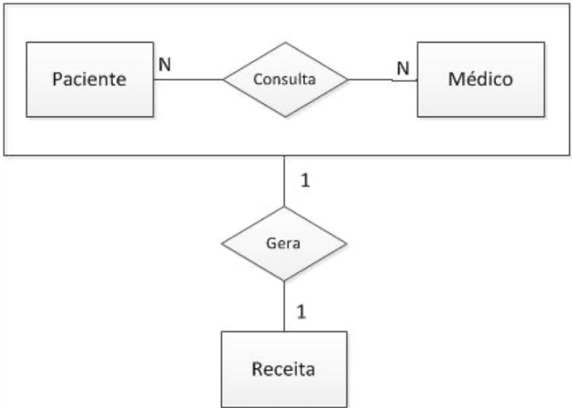

# INTRODUÇÃO A MODELEGEM DE DADOS
*Apresentação: Fábio Leite*

## AGENDA

1.  Propósito
2.  Projeto conceitual
3.  Modelo E/R e notações
4.  Elementos e Conceitos

    a. Entidades e tipos de entidades

    b. Atributos e tipos de atributos

    c. Relacionamento e cardinalidade
5.  Notações
6.  Modelagem na prática

# PROPÓSITO
**Esquema conceitual** é o estágio onde os requisitos de dados são documentados e transformados em uma representação estruturada, usando um modelo de dados conceitual de alto nível (como o MER/ER). Ele serve como uma descrição concisa e formal dos requisitos de dados.

O projeto conceitual envolve a identificação dos componentes básicos:

  * **Entidades e Relacionamentos:** Quais são os tipos de entidade (e seus atributos) e os tipos de relacionamento no negócio.
  
  * **Informações Persistidas:** O projeto conceitual visa identificar os tipos de dados, relacionamentos e restrições que precisam ser armazenados no banco de dados.
  
  * **Expressão em Alto Nível e Comunicação:** Modelos como o MER/ER são utilizados por serem expressivos e simples, o que promove uma melhor comunicação no projeto entre projetistas e usuários.
  
  * **Restrições de Integridade:** São especificadas como parte do esquema conceitual (ex: chaves, cardinalidade, participação), permitindo que projetistas se concentrem na especificação das propriedades do mundo real que o banco deve modelar.

## Projeto conceitual
* Quais são as entidades e os relacionamentos no negócio?

O projeto conceitual utiliza o Modelo Entidade-Relacionamento (MER) para representar os requisitos de dados. Entidades (conceitos no mundo real) e Relacionamentos (associações entre entidades) são os construtos fundamentais. Nesta fase, são definidos os tipos de Entidade (e seus atributos) e os tipos de Relacionamento.

* Quais informações devem ser persistidas no banco?

O projeto conceitual deve mapear as informações cruciais para o negócio, que serão representadas pelos Atributos dos tipos de entidade e relacionamento. O objetivo é identificar não apenas o que será armazenado, mas também como será estruturado: quais são os valores de domínio, se os atributos são simples ou compostos, monovalorados ou multivalorados, e se são armazenados ou derivados.

* Quais são as restrições de integridade?

O esquema conceitual deve especificar as restrições que definem a validade dos dados. No MER, as principais restrições são: 
1. Chaves: Definição dos atributos-chave para identificar univocamente cada entidade. 
2. Cardinalidade: Especifica o número máximo de participações de uma entidade em um relacionamento (ex: 1:1, 1:N, M:N). 
3. Participação: Define se a participação em um relacionamento é total (obrigatória) ou parcial (opcional).

* O esquema do banco de dados pode ser representado de forma gráfico

O Diagrama Entidade-Relacionamento (Diagrama ER) é a notação gráfica padrão utilizada pelo MER. Essa representação visual utiliza símbolos (retângulos para entidades, losangos para relacionamentos, elipses para atributos) para exibir o esquema conceitual de forma intuitiva, facilitando a compreensão.

* Podemos transformar MER em esquemas lógicos

O processo é chamado de Mapeamento do Modelo Conceitual para o Modelo Lógico (ou Projeto Lógico). As regras de mapeamento são bem definidas, especialmente para transformar o Diagrama ER em um conjunto de Esquemas de Relação (tabelas) no Modelo Relacional, que é o modelo lógico mais comum.

# ENGENHARIA DE SOFTWARE

    
    

A primeira imagem acima representa o panorama das **Fases do Projeto de Banco de Dados**, que começa com a Coleta e Análise de Requisitos e avança para o Projeto Conceitual. Este fluxograma estabelece a ordem e a relação entre as etapas (Conceitual, Lógica e Física), guiando o desenvolvedor desde a descrição das necessidades do usuário até a implementação no SGBD.

Já na segunda imagem, exemplifica a fase de **Projeto Conceitual**, sendo um Diagrama ER/EER (Modelo Entidade-Relacionamento/Estendido). Utiliza-se essa notação gráfica de alto nível para formalizar a estrutura do banco de dados, mostrando os tipos de entidade, os atributos, os relacionamentos e as restrições que governam os dados (como a cardinalidade). Esta representação é crucial por ser independente de qualquer SGBD e servir como a especificação formal que será traduzida para o esquema lógico na fase seguinte.

---

# ELEMENTOS
## Entidades
O conceito de Entidade no MER refere-se a **algo do mundo real** com existência independente, seja ela **física ou conceitual**. O que é modelado é o Tipo de Entidade, a descrição abstrata de um conjunto de instâncias que compartilham os mesmos Atributos e estrutura. As entidades são puramente estruturais, focando no estado dos dados sem incluir **comportamentos (métodos)** como na programação orientada a objetos. Os atributos definem a informação da entidade e **possuem um domínio (conjunto de valores válidos)**. Um **Atributo-Chave** é crucial para identificar unicamente cada entidade. Os atributos são classificados como: **simples ou compostos** (ex: Endereço), monovalorados ou multivalorados (ex: Telefones), e armazenados ou derivados (ex: Idade). Todos esses detalhes devem ser formalmente registrados no **Dicionário de Dados.**

## Entidades fracas

* São entidades que dependem da existência de outras ou de identificação de outra entidade
* Instância subordinada e dominante
    * Ex.: "Dependente e cliente"

<table border="0">
  <tr>
    <td valign="top" style="width: 25%;">
      
    </td>
    <td valign="top" style="width: 75%; padding-left: 15px;">
      *Entidades fracas dependem de algum outro tipo de entidade. Elas não possuem chaves primárias e não têm significância no diagrama sem sua entidade primária.*
    </td>
  </tr>
</table>

## Exemplos

    

  Duas entidades, empregado e1 e empresa c1, e seus atributos.

## 

    

  Dois tipos de entidade, EMPREGADO e EMPRESA, e algumas entidades-membro de cada um.

## Tipos de atributos
* **Atributos compostos**
    * Podem ser divididos em subpartes menores, que representam atributos básicos com significados independentes
    * Ex.: Endereço (cidade, estado, CEP, bairro, etc...)
* **Atributos simples**
    * São indivisíveis ou atômicos
* **Atributos Monovalorados e Multivalorados**
    * Valor único para cada entidade
    * Diversos valores para cada entidade
    * Ex.: Cor do carro, números de telefone

    

## Notação para diagramas ER:

    

    

## Tipos de atributos
* **Armazenados e derivados**

Classificação que diferencia se o valor é guardado explicitamente (Armazenado) ou se é calculado/obtido a partir do valor de outros atributos relacionados (Derivado). O valor de um atributo derivado não é armazenado no banco de dados, mas pode ser determinado (calculado) a partir de um atributo armazenado, como no seu exemplo: *a Idade é derivada da Data de Nascimento*
    
* **Atributos complexos**
    * Atributos multivalorados organizados e agrupados

---
**Chaves** são um conjunto mínimo de atributos que identificam unicamente uma entidade num conjunto

* **Chave primária**

É uma das Chaves Candidatas que é escolhida pelo projetista do banco de dados para ser o identificador principal da relação. É o identificador mais importante, usado para referências e indexação.
* **Chave candidata**

É uma Superchave mínima. Mínima significa que se você remover qualquer atributo do conjunto, o restante dos atributos não será mais uma Superchave (perde a propriedade de unicidade).
* **Chaves compostas** 

Qualquer chave (Superchave, Candidata ou Primária) que consiste em dois ou mais atributos. Muitas vezes usada em tabelas resultantes de relacionamentos Muitos-para-Muitos.
* **Integridade de chaves** (Identificação, imutável, não reutilização)

## RELACIONAMENTOS

* É uma associação entre duas entidades
* Uma função que mapeia elementos de um tipo a outro
    * Ex. Um cliente *aluga* uma fita

    

Garantimos que o Banco de Dados, que possui:
* Um conjunto de objetos classificados como pessoas (entidade EMPREGADO)
* Um conjunto de objetos classificados como departamentos (entidade DEPARTAMENTO)
* **Um conjuntos de associações, que ligam um departamento a uma pessoa.** (relacionamento LOTAÇÃO). --> tais associações são definidas por relacionamentos e implementadas de alguma forma no banco de dados.

---

    

A imagem acima é uma visualização direta do Conjunto de Relacionamento, ilustrando como as associações ocorrem na prática no banco de dados. O losango central, que representa o Tipo de Relacionamento TRABALHA_PARA, define a regra de conexão entre as entidades FUNCIONARIO e DEPARTAMENTO. As linhas que partem do losango e unem instâncias específicas, como o funcionário $f_1$ ao departamento $d_1$, são as Instâncias de Relacionamento individuais. O diagrama, portanto, mostra a totalidade dos fatos registrados no sistema, agrupando visualmente os funcionários ($f_1, f_3, f_6$, etc.) sob seus respectivos departamentos, demonstrando o conjunto de relacionamento completo.

## Cardinalidade

É uma propriedade importante que diz respeito a **quantas (máxima e mínima) ocorrências** de uma entidade podem estar associadas a uma determinada ocorrência através do relacionamento

**Cardinalidade Mínima:** é o **número mínimo** de ocorrências de entidade associadas a uma ocorrência da entidade em questão através do relacionamento

**Cardinalidade Máxima:** é o **número máximo** de ocorrências de entidade associadas a uma ocorrência da entidade em questão através do relacionamento

## Tipos de Cardinalidade 

<table border="0">
  <tr>
    <td valign="top" style="width: 50%;">
      
      
    </td>
    <td valign="top" style="width: 75%; padding-left: 15px;">
      <ul>
        <li>Muitos para muitos</li>
        <li>Um para Um</li>
        <li>Muitos para Um</li>
        <li>Um para Muitos</li>
      </ul>
    </td>
  </tr>
</table>

## Cardinalidade Notação "Pé-de-galinha"

Símbolos e notação de diagramas ER:

    

----
Exemplo de diagrama com uso das cardinalidades:

    

---
# RESTRIÇÕES DE INTEGRIDADE
* Delimitam o comportamento dos relacionamentos
    * Ex. Todo empregado deve estar num departamento
    * Todo dependente deve ter um cliente associado
* Cardinalidade
    * O número de instância que participam do relacionamento
* Totalidade
    * Obrigatoriedade da ocorrência das instâncias nos relacionamentos

# PRINCÍPIOS DE MODELAGEM CONCEITUAL

* Quando um conceito deveria ser modelado como entidade ou atributo?

Atributos descrevem propriedades de entidades. Se um conceito for significativo o suficiente para ter seus próprios atributos ou participar de múltiplos relacionamentos, ele deve ser uma Entidade. Caso contrário, é um Atributo.
* Quando um conceito deve ser modelado como relacionamento ou entidade

Um Relacionamento pode ser elevado a uma Entidade (chamada de Entidade de Relacionamento ou Entidade Associativa). Isso é necessário quando o relacionamento possui seus próprios atributos (Ex.: o relacionamento TRABALHA_PARA pode ter o atributo Data_de_Início) ou quando ele precisa participar em outros relacionamentos.
* Identificar relacionamentos binários e ternários
    * **Relacionamento Binário**: Envolve apenas dois tipos de entidade (Ex.: $E_1$ se relaciona com $E_2$). São os mais comuns e preferidos.
    * **Relacionamento Ternário**: Envolve três tipos de entidade (Ex.: FORNECEDOR, PEÇA, PROJETO em um relacionamento FORNECE).
* Restrições e regras de entidades
* Muita semântica deve ser capturada
* Algumas restrições não podem ser capturadas no modelo E/R
* Evitar redundância em seus projetos
* Problema do endereço (entidade ou atributos?)

# NOTAÇÕES

Existem diferentes representações/notações (ou "padronizações") para desenvolvimento de diagramas. Alguns modelos mais usados na literatura são:

* Notação de Barker **Barker's Notation**
* Notação de CHEN **Chen Notation**
* IDEF1X **IDEF1X Notation**
* Notação das Setas **Arrow Notation**
* UML **UML Notation**
* Notação "pé-de-galinha" **Crow's Foot Notation**

Neste [link](https://medium.com/@ericgcc/dont-get-wrong-explained-guide-to-choosing-a-database-design-notation-for-erd-in-a-while-7747925a7531) podemos encontrar um resumo sobre as notações mais utilizadas.

* É comum também encontrarmos autores, softwares, ferramentas cases, ides, etc. que usam notação própria ou uma mistura das notações mais conhecidas. Portanto, ao procurarem modelos ou ao estudarem material adicional podem encontrar exemplos de modelos ER que são construídos com símbolos de mais de uma dessas notações.
* Nesse outro [link](https://medium.com/@ericgcc/dont-get-wrong-explained-guide-to-choosing-a-database-design-notation-for-erd-in-a-while-7747925a7531)
 encontramos uma análise das notações Chen, Chen-alternativa, James Martin (IE ou Pé de Galinha), UML, Barker e IDEF1X (essa é só mencionada...veja porque...) mostrando softwares que possibilitam o design de cada uma delas.

    

# ER-EXTENDIDO
<table border="0">
  <tr>
    <td valign="top" style="width: 40%;">
      
    </td>
    <td valign="top" style="width: 75%; padding-left: 15px;">
      <ul>
        <li>Herança</li>
        <li>Agregação </li>
        <li>Relacionamentos ternários e dependentes</li>
      </ul>
    </td>
  </tr>
</table>

# NOTAÇÕES 
Neste link podemos encontrar um resumo sobre as notações mais utilizadas.
* É comum também encontrarmos autores, softwares, ferramentas cases, ides, etc. que usam notação própria ou uma mistura das notações mais conhecidas. Portanto, ao procurarem modelos ou ao estudarem material adicional podem encontrar exemplos de modelos ER que são construídos com símbolos de mais de uma dessas notações.
* Nesse outro link encontramos uma análise das notações Chen, Chen-alternativa, James Martin (IE ou Pé de Galinha), UML e Barker's mostrando softwares que possibilitam o design de cada uma delas.

---
## James Martin
* A notação James Martin tem o objetivo de produzir diagramas enxutos;
* O diagrama possui mais simbolismos;
* Apenas relacionamentos binários são aceitos

    

 
---
<table border="0">
  <tr>
    <td valign="top" style="width: 50%;">
      
    </td>
    <td valign="top" style="width: 75%; padding-left: 15px;">
      <ul>
        <li>Cardinalidade <strong>N:N</strong></li>
        <li>Cardinalidade <strong>1:N</strong></li>
        <li>Cardinalidade <strong>1:1</strong></li>
      </ul>
    </td>
  </tr>
</table>

## Resumo / James Martin

    

# CONTATO
* **Telefone:** +55 83 996577959 
* **E-mail:** fabioleite@servidor.uepb.edu.br 
* **Endereço:** Universidade Estadual da Paraíba, Campus I - Campina Grande, PB
