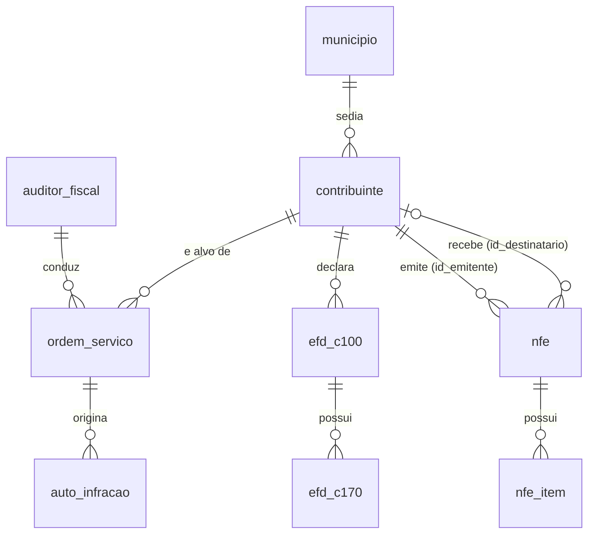

# Apostila — Introdução à Linguagem SQL: Consultas (Queries) em Transact-SQL

**Curso de Banco de Dados Relacional aplicado à Fiscalização Tributária**
**Módulo 9 — Recuperação de Dados (Basic Retrieval Queries)**

**SGBD: Microsoft SQL Server (T-SQL) — Ferramenta: SQL Server Management Studio (SSMS)**
**Banco de dados: `curso_integridade_fiscal`**

**Objetivos do módulo:**

1. **Compreender os conceitos fundamentais de recuperação da informação através de consultas SQL.**
2. **Especificar de maneira prática consultas SQL que envolva operações de seleção, projeção e filtragem de dados.**
3. **Permitir que o aluno possa compreender a linguagem SQL, através de uma abordagem prática, utilizando MS SQL Server ;**
4. **Compreender conceitos relacionados a projeto de banco e dados.**

---

## Referencial bibliográfico do módulo


| Obra                                                                                   | Trecho utilizado                                  | Papel neste módulo                                                                                                                                                                                                                                                                               |
| ---------------------------------------------------------------------------------------- | --------------------------------------------------- | --------------------------------------------------------------------------------------------------------------------------------------------------------------------------------------------------------------------------------------------------------------------------------------------------- |
| ELMASRI, R.; NAVATHE, S. B.*Fundamentals of Database Systems*. 7. ed. Pearson, 2015.   | **Seção 6.3 — Basic Retrieval Queries in SQL** | Fundamentação formal: a instrução SELECT-FROM-WHERE como realização da álgebra relacional, tratamento de tabelas como multiconjuntos, ambiguidade e renomeação de atributos, casamento de padrões e ordenação.                                                                        |
| PETKOVIC, D.*Microsoft SQL Server 2019: A Beginner's Guide*. 7. ed. McGraw-Hill, 2020. | **Capítulo 6 — Queries**                        | Sequência didática e sintaxe específica do Transact-SQL: cláusulas do SELECT, funções agregadas, GROUP BY/HAVING, ORDER BY, operadores de conjunto, expressão CASE, subconsultas, tabelas temporárias, operador de junção, subconsultas correlacionadas e expressões de tabela (CTEs). |

> **Nota sobre a sequência.** Este material segue a ordem do Capítulo 6 de Petkovic (2020), que vai do SELECT simples até as expressões de tabela comuns, e utiliza a Seção 6.3 de Elmasri e Navathe (2015) para dar o embasamento teórico de cada construção. Toda a sintaxe apresentada é **Transact-SQL** (Microsoft SQL Server). Onde o padrão ANSI/ISO SQL diverge do T-SQL, o fato é assinalado explicitamente.

---

## 1. Apresentação e objetivos

### 1.1 Por que consultas importam para o auditor fiscal

Os módulos anteriores deste curso trataram de **definir** e **alimentar** estruturas de dados: modelagem, mapeamento MER→relacional, restrições de integridade, `BULK INSERT`, `ALTER TABLE`, `UPDATE` e `DELETE`. Este módulo trata da operação que ocupa a maior parte do tempo real de trabalho de um servidor da administração tributária: **extrair informação de dados já existentes**.

Na prática da fiscalização, praticamente toda pergunta relevante é uma consulta:

- Quais contribuintes do regime normal emitiram notas fiscais com CFOP de saída interestadual acima de determinado valor no período?
- Quais chaves de acesso de NF-e autorizadas **não** aparecem escrituradas no bloco C da EFD do contribuinte?
- Quais itens escriturados na EFD divergem, em valor ou em alíquota, do item correspondente no XML da NF-e?
- Qual auditor conduziu ordens de serviço que resultaram em autos de infração acima da média da regional?

Cada uma dessas perguntas é uma instrução `SELECT`. A qualidade do trabalho fiscal depende diretamente da capacidade de formulá-las corretamente — e, sobretudo, de **saber o que a consulta não está dizendo** (linhas perdidas por junção interna indevida, comparações silenciosamente falsas por causa de `NULL`, duplicações causadas por junção com tabela-filha).

### 1.2 Objetivos de aprendizagem

Ao final deste módulo, o participante deverá ser capaz de:

1. Explicar a instrução `SELECT` como implementação das operações de **seleção (σ)**, **projeção (π)** e **junção (⋈)** da álgebra relacional (ELMASRI; NAVATHE, 2015, seç. 6.3).
2. Escrever consultas de recuperação básica com `SELECT`, `FROM`, `WHERE`, `ORDER BY`, incluindo aliases, expressões e `DISTINCT`.
3. Aplicar corretamente os operadores de comparação, lógicos, `IN`, `BETWEEN`, `LIKE` e o tratamento de valores `NULL` sob **lógica de três valores**.
4. Produzir consultas de sumarização com funções agregadas, `GROUP BY` e `HAVING`, distinguindo o filtro de linhas do filtro de grupos.
5. Combinar conjuntos de resultados com `UNION`, `INTERSECT` e `EXCEPT`.
6. Escrever subconsultas simples, subconsultas com `IN`, `ANY`/`ALL` e subconsultas correlacionadas com `EXISTS`/`NOT EXISTS`.
7. Dominar todas as formas de junção — interna, externa (esquerda, direita, completa), cruzada, auto-junção e semi/antijunção — e usá-las em **cruzamentos entre documentos fiscais**.
8. Estruturar consultas complexas com tabelas temporárias, tabelas derivadas e **CTEs** (`WITH`), inclusive recursivas.
9. Ler uma consulta na **ordem lógica de processamento** das cláusulas, e não na ordem em que ela é escrita.

### 1.3 Pré-requisitos

Módulos 1 a 8 do curso. Espera-se familiaridade com os conceitos de relação, tupla, atributo, chave primária, chave estrangeira e integridade referencial, bem como com a conexão ao servidor pelo SSMS.

---

## 2. O banco de dados de referência

Todos os exemplos e exercícios deste módulo utilizam o banco `curso_integridade_fiscal`, o mesmo dos módulos anteriores. Antes de iniciar, execute no SSMS:

```sql
USE curso_integridade_fiscal;
GO
```

### 2.1 Visão geral do esquema

O esquema representa, de forma simplificada porém realista, o núcleo informacional de uma Secretaria de Estado da Fazenda: o **cadastro** de contribuintes, os **documentos fiscais eletrônicos** recebidos (NF-e e seus itens), a **escrituração digital** entregue pelo contribuinte (EFD, blocos C100 e C170) e a **atividade de fiscalização** (auditores, ordens de serviço e autos de infração).



> **Leitura do diagrama.** Todas as relações são 1:N (cardinalidade `||--o{`). A única exceção é o segundo vínculo entre `contribuinte` e `nfe`: como `nfe.id_destinatario` é anulável (venda a consumidor não identificado), essa relação é opcional do lado de `contribuinte` (`|o--o{`) — cada NF-e tem **zero ou um** contribuinte destinatário, além de, obrigatoriamente, **um** contribuinte emitente.

### 2.2 Dicionário de dados resumido

**`municipio`** — municípios do estado e das UFs de origem/destino.


| Coluna          | Tipo          | Observação                                                                   |
| ----------------- | --------------- | -------------------------------------------------------------------------------- |
| `id_municipio`  | `INT`         | PK                                                                             |
| `cod_ibge`      | `CHAR(7)`     | código IBGE                                                                   |
| `nome`          | `VARCHAR(80)` |                                                                                |
| `uf`            | `CHAR(2)`     |                                                                                |
| `regiao_fiscal` | `VARCHAR(40)` | gerência regional responsável; pode ser`NULL` para municípios de outras UFs |

**`contribuinte`** — cadastro de contribuintes do ICMS.


| Coluna                  | Tipo            | Observação                                     |
| ------------------------- | ----------------- | -------------------------------------------------- |
| `id_contribuinte`       | `INT`           | PK                                               |
| `cnpj`                  | `CHAR(14)`      | somente dígitos,`UNIQUE`                        |
| `razao_social`          | `VARCHAR(120)`  |                                                  |
| `nome_fantasia`         | `VARCHAR(120)`  | pode ser`NULL`                                   |
| `id_municipio`          | `INT`           | FK →`municipio`                                 |
| `regime_tributario`     | `VARCHAR(20)`   | `'NORMAL'`, `'SIMPLES'`, `'MEI'`, `'ISENTO'`     |
| `situacao_cadastral`    | `VARCHAR(20)`   | `'ATIVO'`, `'SUSPENSO'`, `'BAIXADO'`, `'INAPTO'` |
| `data_inicio_atividade` | `DATE`          |                                                  |
| `cnae_principal`        | `CHAR(7)`       |                                                  |
| `faturamento_declarado` | `DECIMAL(15,2)` | último exercício; pode ser`NULL`               |

**`nfe`** — cabeçalho das notas fiscais eletrônicas.


| Coluna            | Tipo            | Observação                                                         |
| ------------------- | ----------------- | ---------------------------------------------------------------------- |
| `id_nfe`          | `INT`           | PK                                                                   |
| `chave_acesso`    | `CHAR(44)`      | `UNIQUE`                                                             |
| `numero`          | `INT`           |                                                                      |
| `serie`           | `SMALLINT`      |                                                                      |
| `data_emissao`    | `DATE`          |                                                                      |
| `id_emitente`     | `INT`           | FK →`contribuinte`                                                  |
| `id_destinatario` | `INT`           | FK →`contribuinte`; `NULL` em vendas a consumidor não identificado |
| `tipo_operacao`   | `CHAR(1)`       | `'0'` entrada, `'1'` saída                                          |
| `valor_total`     | `DECIMAL(15,2)` |                                                                      |
| `valor_icms`      | `DECIMAL(15,2)` |                                                                      |
| `situacao`        | `VARCHAR(20)`   | `'AUTORIZADA'`, `'CANCELADA'`, `'DENEGADA'`, `'INUTILIZADA'`         |

**`nfe_item`** — itens (produtos/serviços) de cada NF-e.


| Coluna             | Tipo            | Observação                         |
| -------------------- | ----------------- | -------------------------------------- |
| `id_item`          | `INT`           | PK                                   |
| `id_nfe`           | `INT`           | FK →`nfe`                           |
| `num_item`         | `SMALLINT`      | ordem do item no documento           |
| `cod_produto`      | `VARCHAR(30)`   | código interno do emitente          |
| `descricao`        | `VARCHAR(150)`  |                                      |
| `ncm`              | `CHAR(8)`       |                                      |
| `cfop`             | `CHAR(4)`       |                                      |
| `cst_icms`         | `CHAR(3)`       |                                      |
| `quantidade`       | `DECIMAL(15,4)` |                                      |
| `valor_unitario`   | `DECIMAL(15,4)` |                                      |
| `valor_total_item` | `DECIMAL(15,2)` |                                      |
| `aliquota_icms`    | `DECIMAL(5,2)`  | pode ser`NULL` quando não tributado |
| `valor_icms_item`  | `DECIMAL(15,2)` |                                      |

**`efd_c100`** — registro C100 da Escrituração Fiscal Digital (documento fiscal escriturado).


| Coluna             | Tipo            | Observação                                        |
| -------------------- | ----------------- | ----------------------------------------------------- |
| `id_c100`          | `INT`           | PK                                                  |
| `id_contribuinte`  | `INT`           | FK →`contribuinte` (declarante)                    |
| `periodo_apuracao` | `CHAR(6)`       | `AAAAMM`                                            |
| `ind_oper`         | `CHAR(1)`       | `'0'` entrada/aquisição, `'1'` saída/prestação |
| `cod_situacao`     | `CHAR(2)`       | `'00'` documento regular, `'02'` cancelado, etc.    |
| `num_doc`          | `INT`           |                                                     |
| `serie`            | `VARCHAR(3)`    |                                                     |
| `chave_acesso`     | `CHAR(44)`      | pode ser`NULL` em documentos não eletrônicos      |
| `data_emissao`     | `DATE`          |                                                     |
| `valor_documento`  | `DECIMAL(15,2)` |                                                     |
| `valor_icms`       | `DECIMAL(15,2)` |                                                     |

**`efd_c170`** — registro C170: itens do documento escriturado.


| Coluna                   | Tipo            | Observação    |
| -------------------------- | ----------------- | ----------------- |
| `id_c170`                | `INT`           | PK              |
| `id_c100`                | `INT`           | FK →`efd_c100` |
| `num_item`               | `SMALLINT`      |                 |
| `cod_item`               | `VARCHAR(30)`   |                 |
| `descricao_complementar` | `VARCHAR(150)`  | pode ser`NULL`  |
| `ncm`                    | `CHAR(8)`       |                 |
| `cfop`                   | `CHAR(4)`       |                 |
| `cst_icms`               | `CHAR(3)`       |                 |
| `quantidade`             | `DECIMAL(15,4)` |                 |
| `valor_item`             | `DECIMAL(15,2)` |                 |
| `aliquota_icms`          | `DECIMAL(5,2)`  |                 |
| `valor_icms_item`        | `DECIMAL(15,2)` |                 |

**`auditor_fiscal`** — quadro de auditores.


| Coluna                 | Tipo           | Observação                                                              |
| ------------------------ | ---------------- | --------------------------------------------------------------------------- |
| `matricula`            | `INT`          | PK                                                                        |
| `nome`                 | `VARCHAR(120)` |                                                                           |
| `cargo`                | `VARCHAR(40)`  | `'AUDITOR'`, `'SUPERVISOR'`, `'GERENTE'`                                  |
| `regiao_fiscal`        | `VARCHAR(40)`  |                                                                           |
| `data_admissao`        | `DATE`         |                                                                           |
| `matricula_supervisor` | `INT`          | FK →`auditor_fiscal` (auto-relacionamento); `NULL` no topo da hierarquia |

**`ordem_servico`** — OS de fiscalização.


| Coluna              | Tipo          | Observação                                                             |
| --------------------- | --------------- | -------------------------------------------------------------------------- |
| `id_os`             | `INT`         | PK                                                                       |
| `numero_os`         | `VARCHAR(20)` | `UNIQUE`                                                                 |
| `id_contribuinte`   | `INT`         | FK →`contribuinte`                                                      |
| `matricula_auditor` | `INT`         | FK →`auditor_fiscal`                                                    |
| `tipo_fiscalizacao` | `VARCHAR(40)` | `'MALHA FISCAL'`, `'AUDITORIA PLENA'`, `'MONITORAMENTO'`, `'DILIGENCIA'` |
| `data_abertura`     | `DATE`        |                                                                          |
| `data_conclusao`    | `DATE`        | `NULL` enquanto em andamento                                             |
| `situacao`          | `VARCHAR(20)` | `'ABERTA'`, `'EM ANDAMENTO'`, `'CONCLUIDA'`, `'CANCELADA'`               |

**`auto_infracao`** — autos lavrados.


| Coluna              | Tipo            | Observação                                                                                                      |
| --------------------- | ----------------- | ------------------------------------------------------------------------------------------------------------------- |
| `id_auto`           | `INT`           | PK                                                                                                                |
| `numero_auto`       | `VARCHAR(20)`   | `UNIQUE`                                                                                                          |
| `id_os`             | `INT`           | FK →`ordem_servico`                                                                                              |
| `id_contribuinte`   | `INT`           | FK →`contribuinte`                                                                                               |
| `data_lavratura`    | `DATE`          |                                                                                                                   |
| `dispositivo_legal` | `VARCHAR(80)`   |                                                                                                                   |
| `valor_principal`   | `DECIMAL(15,2)` |                                                                                                                   |
| `valor_multa`       | `DECIMAL(15,2)` |                                                                                                                   |
| `situacao`          | `VARCHAR(25)`   | `'LAVRADO'`, `'IMPUGNADO'`, `'JULGADO PROCEDENTE'`, `'JULGADO IMPROCEDENTE'`, `'PAGO'`, `'INSCRITO DIVIDA ATIVA'` |

> **Convenção adotada nos exemplos.** Toda consulta é apresentada com um enunciado em linguagem natural (a "pergunta do auditor"), a consulta em T-SQL e, quando pertinente, um comentário sobre armadilhas ou variações. As tabelas são referenciadas com aliases curtos e mnemônicos (`c` para contribuinte, `n` para nfe, `i` para nfe_item, `a` para auto_infracao, `os` para ordem_servico).

---

## 3. A instrução SELECT

### 3.1 Forma geral e correspondência com a álgebra relacional

Elmasri e Navathe (2015, seç. 6.3.1) apresentam a forma básica da instrução de recuperação como o "mapeamento SELECT-FROM-WHERE":

```
SELECT   <lista de atributos>
FROM     <lista de tabelas>
WHERE    <condição>;
```

A correspondência com a álgebra relacional é direta e deve ser memorizada, porque ela orienta o raciocínio:


| Cláusula SQL | Operação da álgebra relacional           | Significado                               |
| --------------- | --------------------------------------------- | ------------------------------------------- |
| `SELECT`      | **projeção** π                           | escolhe**colunas**                        |
| `FROM`        | **produto cartesiano** × / **junção** ⋈ | escolhe as**tabelas** e como combiná-las |
| `WHERE`       | **seleção** σ                            | escolhe**linhas**                         |

Ou seja, a consulta

```sql
SELECT razao_social, cnpj
FROM   contribuinte
WHERE  situacao_cadastral = 'INAPTO';
```

equivale a π<sub>razao_social, cnpj</sub>(σ<sub>situacao_cadastral = 'INAPTO'</sub>(contribuinte)).

> **Atenção à terminologia.** A palavra `SELECT` do SQL corresponde à **projeção** da álgebra, e não à operação de *seleção*. É uma infelicidade histórica da linguagem, apontada por Elmasri e Navathe, que confunde iniciantes com frequência.

A forma completa suportada pelo Transact-SQL, na sequência exposta por Petkovic (2020, cap. 6), é:

```sql
SELECT   [ALL | DISTINCT] [TOP (n) [PERCENT] [WITH TIES]] <lista_de_seleção>
[INTO    <nova_tabela>]
FROM     <origem_de_dados>            -- tabelas, junções, tabelas derivadas
[WHERE   <condição_de_linha>]
[GROUP BY <lista_de_agrupamento>]
[HAVING  <condição_de_grupo>]
[ORDER BY <lista_de_ordenação> [ASC | DESC]]
[OFFSET n ROWS FETCH NEXT m ROWS ONLY];
```

Apenas `SELECT` e `FROM` são obrigatórios — e, no T-SQL, mesmo o `FROM` pode ser omitido quando não há origem de dados (`SELECT GETDATE();`).

### 3.2 A cláusula FROM e a origem dos dados

```sql
-- Todas as colunas e todas as linhas da tabela de contribuintes
SELECT * FROM contribuinte;
```

O asterisco significa "todos os atributos da(s) relação(ões) do `FROM`, na ordem em que foram declarados" (ELMASRI; NAVATHE, 2015, seç. 6.3.3). É extremamente útil na exploração inicial de uma base desconhecida — o primeiro comando que se dá ao receber um novo conjunto de dados de arrecadação — e igualmente inadequado em consultas de produção, por três razões:

1. traz colunas desnecessárias, aumentando tráfego e custo de I/O;
2. torna o resultado sensível a `ALTER TABLE` posteriores (uma coluna nova aparece sem aviso);
3. impede que o otimizador use índices de cobertura.

**Boa prática fiscal:** explore com `SELECT *`, entregue com lista explícita de colunas.

### 3.3 A lista de seleção: colunas, expressões e aliases

A lista de seleção não se restringe a nomes de colunas; aceita **expressões** e **funções**.

```sql
-- Pergunta: qual a carga tributária efetiva declarada em cada NF-e de saída?
SELECT chave_acesso,
       valor_total,
       valor_icms,
       (valor_icms / NULLIF(valor_total, 0)) * 100 AS percentual_icms
FROM   nfe
WHERE  tipo_operacao = '1';
```

Três pontos merecem destaque:

- **`AS` define um alias de coluna.** Sem ele, a coluna calculada aparece com o cabeçalho `(No column name)` no SSMS. O alias pode ser escrito entre colchetes quando contiver espaços: `AS [Percentual de ICMS]`.
- **`NULLIF(valor_total, 0)`** evita a divisão por zero: a função retorna `NULL` quando os dois argumentos são iguais, e qualquer divisão por `NULL` resulta em `NULL` — que o T-SQL exibe como vazio, em vez de abortar o lote com erro.
- O T-SQL admite ainda a sintaxe `alias = expressão`, equivalente e comum em código legado: `SELECT percentual_icms = valor_icms / valor_total ...`.

**Renomeação (aliasing) de tabelas.** Elmasri e Navathe (2015, seç. 6.3.2) discutem o problema dos **nomes de atributo ambíguos**: quando duas tabelas do `FROM` possuem colunas homônimas, é obrigatório qualificar a referência. O alias de tabela resolve isso e encurta a consulta:

```sql
SELECT n.chave_acesso,
       n.valor_total,
       c.razao_social AS emitente
FROM   nfe AS n
       INNER JOIN contribuinte AS c ON c.id_contribuinte = n.id_emitente;
```

O alias de tabela é **obrigatório** — e não apenas conveniente — nas auto-junções (seção 11.6), em que a mesma tabela aparece duas vezes no `FROM`.

### 3.4 DISTINCT: tabelas como conjuntos e como multiconjuntos

Este é um dos pontos teóricos mais importantes da Seção 6.3 de Elmasri e Navathe (subseção 6.3.4, *Tables as Sets in SQL*). Na álgebra relacional, uma relação é um **conjunto**: não há tuplas duplicadas. O SQL, por decisão de projeto, trata as tabelas como **multiconjuntos (bags)**: o resultado de uma consulta *pode* conter linhas repetidas, e por padrão as mantém (`ALL` é o default).

```sql
-- Quantas linhas? Uma por NF-e emitida (com repetição de CFOP)
SELECT cfop FROM nfe_item;

-- Quantas linhas? Uma por CFOP distinto efetivamente utilizado
SELECT DISTINCT cfop FROM nfe_item;
```

A eliminação de duplicatas é custosa (exige ordenação ou hash), razão pela qual o SQL não a faz automaticamente. O `DISTINCT` aplica-se à **linha inteira** projetada, não a uma coluna isolada:

```sql
-- Pares distintos NCM + CFOP praticados
SELECT DISTINCT ncm, cfop
FROM   nfe_item
ORDER BY ncm, cfop;
```

> **Armadilha frequente na fiscalização.** Ao juntar `contribuinte` com `nfe`, cada contribuinte aparece tantas vezes quantas forem suas notas. Analistas iniciantes "corrigem" isso com `DISTINCT`, o que mascara o problema real: a consulta deveria ter usado agregação (seção 8) ou uma semijunção com `EXISTS` (seção 12). Um `DISTINCT` inesperado é quase sempre sintoma de modelagem equivocada da consulta.

### 3.5 TOP, OFFSET-FETCH e amostragem

Recurso específico do T-SQL, muito usado quando se quer inspecionar uma base grande ou selecionar os "maiores casos" para priorização de malha fiscal:

```sql
-- Os 10 autos de infração de maior valor principal
SELECT TOP (10) numero_auto, data_lavratura, valor_principal
FROM   auto_infracao
ORDER BY valor_principal DESC;

-- Os 5% maiores
SELECT TOP (5) PERCENT numero_auto, valor_principal
FROM   auto_infracao
ORDER BY valor_principal DESC;

-- Incluindo empates na última posição
SELECT TOP (10) WITH TIES numero_auto, valor_principal
FROM   auto_infracao
ORDER BY valor_principal DESC;
```

`TOP` **sem** `ORDER BY` retorna linhas arbitrárias — nunca use-o assim para selecionar "os maiores".

A alternativa padronizada (ANSI SQL:2008, disponível desde o SQL Server 2012), útil para paginação de relatórios:

```sql
SELECT numero_auto, valor_principal
FROM   auto_infracao
ORDER BY valor_principal DESC
OFFSET 20 ROWS FETCH NEXT 10 ROWS ONLY;   -- 3ª página de 10 registros
```

`OFFSET ... FETCH` exige `ORDER BY`.

### 3.6 SELECT INTO e a criação de tabelas de trabalho

Petkovic (2020, cap. 6) apresenta o `INTO` como uma das cláusulas do `SELECT`. Ele materializa o resultado em uma **nova tabela**, criada automaticamente com os tipos inferidos:

```sql
-- Cria a tabela de trabalho com os contribuintes selecionados para a malha
SELECT c.id_contribuinte, c.cnpj, c.razao_social, c.regime_tributario
INTO   malha_2025_selecionados
FROM   contribuinte AS c
WHERE  c.situacao_cadastral = 'ATIVO'
  AND  c.regime_tributario  = 'NORMAL';
```

A tabela de destino **não pode existir previamente**. Chaves, índices e restrições **não** são copiados — apenas colunas, tipos, nulidade e a propriedade `IDENTITY`, quando houver.

> **Nota sobre `IDENTITY` e `SEQUENCE`.** Petkovic trata, ainda no Capítulo 6, dos geradores de valores sequenciais. Em consultas, o ponto relevante é: se a coluna de origem tem `IDENTITY`, o `SELECT INTO` propaga essa propriedade para a nova tabela — o que costuma ser indesejado em tabelas de trabalho. Para evitá-lo, force uma expressão sobre a coluna, por exemplo `SELECT id_contribuinte + 0 AS id_contribuinte`. A função `NEXT VALUE FOR <sequência>` também pode ser usada na lista de seleção para numerar linhas a partir de um objeto `SEQUENCE`, embora, para numeração dentro do resultado, `ROW_NUMBER()` seja o caminho natural.

### 3.7 A expressão CASE

`CASE` introduz lógica condicional na lista de seleção, no `WHERE`, no `GROUP BY` e no `ORDER BY`. Existem duas formas.

**Forma simples** (comparação de igualdade com uma expressão):

```sql
SELECT numero_auto,
       situacao,
       CASE situacao
            WHEN 'PAGO'                  THEN 'ENCERRADO'
            WHEN 'JULGADO IMPROCEDENTE'  THEN 'ENCERRADO'
            WHEN 'INSCRITO DIVIDA ATIVA' THEN 'COBRANCA'
            ELSE 'EM DISCUSSAO'
       END AS fase_processual
FROM   auto_infracao;
```

**Forma pesquisada** (condições booleanas arbitrárias, avaliadas em ordem):

```sql
-- Classificação de risco do contribuinte por porte declarado
SELECT c.razao_social,
       c.faturamento_declarado,
       CASE WHEN c.faturamento_declarado IS NULL       THEN 'NAO INFORMADO'
            WHEN c.faturamento_declarado <   360000    THEN 'MICROEMPRESA'
            WHEN c.faturamento_declarado <  4800000    THEN 'PEQUENO PORTE'
            WHEN c.faturamento_declarado < 78000000    THEN 'MEDIO PORTE'
            ELSE 'GRANDE PORTE'
       END AS porte
FROM   contribuinte AS c;
```

A avaliação é **sequencial**: a primeira condição verdadeira encerra a expressão. Sem `ELSE`, o resultado é `NULL` quando nenhuma condição se satisfaz.

**Padrão de alto valor prático: agregação condicional (tabela cruzada).**

```sql
-- Uma linha por contribuinte, com entradas e saídas em colunas separadas
SELECT n.id_emitente,
       SUM(CASE WHEN n.tipo_operacao = '1' THEN n.valor_total ELSE 0 END) AS total_saidas,
       SUM(CASE WHEN n.tipo_operacao = '0' THEN n.valor_total ELSE 0 END) AS total_entradas,
       COUNT(CASE WHEN n.situacao = 'CANCELADA' THEN 1 END)               AS qtd_canceladas,
       CAST(COUNT(CASE WHEN n.situacao = 'CANCELADA' THEN 1 END) AS DECIMAL(10,2))
            / NULLIF(COUNT(*), 0) * 100                                   AS pct_cancelamento
FROM   nfe AS n
WHERE  n.data_emissao >= '2025-01-01' AND n.data_emissao < '2026-01-01'
GROUP BY n.id_emitente
HAVING COUNT(*) >= 100
ORDER BY pct_cancelamento DESC;
```

Percentual de cancelamento anormalmente elevado é indício clássico de emissão para simulação de operação ou de manipulação de estoque — o tipo de indicador que alimenta a seleção de contribuintes para fiscalização.

> Note o uso de `COUNT(CASE WHEN ... THEN 1 END)` **sem `ELSE`**: as linhas que não satisfazem a condição produzem `NULL` e, como `COUNT(coluna)` ignora nulos, não são contadas. Escrever `ELSE 0` aqui seria um erro — contaria todas as linhas.

---

## 4. A cláusula WHERE

A cláusula `WHERE` implementa a **seleção (σ)**: cada linha candidata é submetida a uma condição booleana e só é preservada quando o resultado é **TRUE** (não basta "não ser falso" — ver seção 4.6).

### 4.1 Operadores de comparação


| Operador     | Significado          | Exemplo                         |
| -------------- | ---------------------- | --------------------------------- |
| `=`          | igual                | `regime_tributario = 'SIMPLES'` |
| `<>` ou `!=` | diferente            | `situacao <> 'CANCELADA'`       |
| `<`, `>`     | menor, maior         | `valor_total > 50000`           |
| `<=`, `>=`   | menor/maior ou igual | `data_emissao >= '2025-01-01'`  |

O operador padrão para desigualdade é `<>`; `!=` é aceito pelo T-SQL, mas `<>` é preferível por portabilidade.

```sql
-- NF-e de saída de valor elevado emitidas no 1º semestre de 2025
SELECT chave_acesso, data_emissao, valor_total
FROM   nfe
WHERE  tipo_operacao = '1'
  AND  situacao      = 'AUTORIZADA'
  AND  data_emissao >= '2025-01-01'
  AND  data_emissao <  '2025-07-01'
  AND  valor_total  > 100000.00;
```

> **Formato de data.** Em T-SQL, use sempre o literal ISO `'AAAA-MM-DD'` (ou `'AAAAMMDD'`, que é imune a qualquer configuração de `SET LANGUAGE`/`DATEFORMAT`). Escrever `'01/07/2025'` é fonte recorrente de erro em ambientes com collation e idioma mistos.

> **Intervalos de data.** Repare no padrão `>= início AND < dia_seguinte_ao_fim`. Ele é preferível a `BETWEEN` quando a coluna é `DATETIME`/`DATETIME2`, pois `BETWEEN '2025-01-01' AND '2025-06-30'` exclui os documentos emitidos ao longo do dia 30 (que têm hora > 00:00:00).

### 4.2 Operadores lógicos e precedência

`AND`, `OR` e `NOT` combinam condições. A **precedência** é: `NOT` > `AND` > `OR`. Essa regra é responsável por uma classe inteira de consultas fiscais silenciosamente erradas:

```sql
-- ERRADO: retorna todos os contribuintes do Simples de qualquer situação,
-- mais os contribuintes ativos do regime normal.
SELECT razao_social
FROM   contribuinte
WHERE  regime_tributario = 'NORMAL' AND situacao_cadastral = 'ATIVO'
   OR  regime_tributario = 'SIMPLES';

-- CORRETO: contribuintes ativos, de qualquer um dos dois regimes.
SELECT razao_social
FROM   contribuinte
WHERE  (regime_tributario = 'NORMAL' OR regime_tributario = 'SIMPLES')
  AND  situacao_cadastral = 'ATIVO';
```

**Regra prática:** sempre que `AND` e `OR` coexistirem na mesma cláusula, parentetize explicitamente.

### 4.3 IN e NOT IN

`IN` testa pertinência a um conjunto de valores; equivale a uma cadeia de `OR`.

```sql
-- Itens com CFOP de venda (interna e interestadual)
SELECT id_nfe, num_item, cfop, valor_total_item
FROM   nfe_item
WHERE  cfop IN ('5101', '5102', '6101', '6102');

-- Autos ainda passíveis de discussão administrativa
SELECT numero_auto, situacao
FROM   auto_infracao
WHERE  situacao NOT IN ('PAGO', 'JULGADO IMPROCEDENTE');
```

> **Advertência crítica sobre `NOT IN` e `NULL`.** Se a lista (ou a subconsulta) contiver um único `NULL`, `NOT IN` **não retorna nenhuma linha**. Isso ocorre porque `x NOT IN (a, b, NULL)` expande para `x <> a AND x <> b AND x <> NULL`, e a última comparação é UNKNOWN, o que torna todo o `AND` UNKNOWN. É a causa número um de "consultas de cruzamento que retornam vazio" em trabalhos de malha fiscal. Prefira `NOT EXISTS` (seção 12.2) sempre que a lista provier de uma subconsulta sobre coluna anulável.

### 4.4 BETWEEN

`BETWEEN` define um intervalo **fechado nos dois extremos**:

```sql
-- Autos lavrados no exercício de 2025
SELECT numero_auto, data_lavratura, valor_principal
FROM   auto_infracao
WHERE  data_lavratura BETWEEN '2025-01-01' AND '2025-12-31';

-- Faixa de faturamento sujeita a monitoramento diferenciado
SELECT razao_social, faturamento_declarado
FROM   contribuinte
WHERE  faturamento_declarado BETWEEN 3600000.00 AND 4800000.00;
```

`x BETWEEN a AND b` é apenas açúcar sintático para `x >= a AND x <= b`. `NOT BETWEEN` inverte a condição.

### 4.5 LIKE: casamento de padrões

Elmasri e Navathe tratam do casamento de padrões na subseção 6.3.5. O T-SQL oferece quatro curingas:


| Curinga | Significado                                                          |
| --------- | ---------------------------------------------------------------------- |
| `%`     | qualquer cadeia de zero ou mais caracteres                           |
| `_`     | exatamente um caractere qualquer                                     |
| `[ ]`   | um caractere pertencente ao conjunto/intervalo —**extensão T-SQL** |
| `[^ ]`  | um caractere**não** pertencente ao conjunto — **extensão T-SQL**  |

```sql
-- Razões sociais que contenham "COMERCIO"
SELECT razao_social
FROM   contribuinte
WHERE  razao_social LIKE '%COMERCIO%';

-- Contribuintes cuja razão social começa por A, B ou C
SELECT razao_social
FROM   contribuinte
WHERE  razao_social LIKE '[A-C]%';

-- NCM do capítulo 22 (bebidas): 8 dígitos iniciando por 22
SELECT DISTINCT ncm, descricao
FROM   nfe_item
WHERE  ncm LIKE '22%';

-- Chaves de acesso emitidas na UF 25 (PB) em 2025, mês 03:
-- posições 1-2 = cUF, 3-6 = AAMM da emissão
SELECT chave_acesso
FROM   nfe
WHERE  chave_acesso LIKE '252503%';

-- Descrições de item com possível preenchimento genérico/abusivo
SELECT id_nfe, num_item, descricao
FROM   nfe_item
WHERE  descricao LIKE '%DIVERSOS%'
   OR  descricao LIKE '%MERCADORIA%'
   OR  descricao LIKE 'PROD%'
   OR  LEN(LTRIM(RTRIM(descricao))) <= 3;
```

Para pesquisar o **caractere curinga literalmente**, use `ESCAPE`:

```sql
-- Dispositivos legais que citem literalmente o caractere '%'
SELECT numero_auto, dispositivo_legal
FROM   auto_infracao
WHERE  dispositivo_legal LIKE '%!%%' ESCAPE '!';
```

> **Desempenho.** `LIKE 'ABC%'` pode usar índice (busca por prefixo); `LIKE '%ABC%'` **nunca** usa, forçando varredura completa. Em tabelas de itens de NF-e com dezenas de milhões de linhas, essa diferença é de segundos para minutos.

### 4.6 Valores NULL e a lógica de três valores

Um `NULL` significa "valor desconhecido, indisponível ou inaplicável". No esquema do curso, `nfe.id_destinatario` é `NULL` em vendas a consumidor não identificado; `ordem_servico.data_conclusao` é `NULL` enquanto a OS está em andamento; `municipio.regiao_fiscal` é `NULL` para municípios de outras UFs.

O SQL avalia condições sob **lógica de três valores**: TRUE, FALSE e UNKNOWN. Qualquer comparação com `NULL` produz UNKNOWN, e o `WHERE` só deixa passar linhas cujo resultado seja **TRUE**.

**Tabelas-verdade (ELMASRI; NAVATHE, 2015, seç. 6.3 e cap. 5):**


| `AND`       | TRUE    | FALSE | UNKNOWN |
| ------------- | --------- | ------- | --------- |
| **TRUE**    | TRUE    | FALSE | UNKNOWN |
| **FALSE**   | FALSE   | FALSE | FALSE   |
| **UNKNOWN** | UNKNOWN | FALSE | UNKNOWN |


| `OR`        | TRUE | FALSE   | UNKNOWN |
| ------------- | ------ | --------- | --------- |
| **TRUE**    | TRUE | TRUE    | TRUE    |
| **FALSE**   | TRUE | FALSE   | UNKNOWN |
| **UNKNOWN** | TRUE | UNKNOWN | UNKNOWN |


| `NOT`   | resultado |
| --------- | ----------- |
| TRUE    | FALSE     |
| FALSE   | TRUE      |
| UNKNOWN | UNKNOWN   |

Consequência prática:

```sql
-- NÃO FUNCIONA: nunca retorna linhas
SELECT numero_os FROM ordem_servico WHERE data_conclusao = NULL;

-- CORRETO
SELECT numero_os FROM ordem_servico WHERE data_conclusao IS NULL;      -- em andamento
SELECT numero_os FROM ordem_servico WHERE data_conclusao IS NOT NULL;  -- concluídas
```

Um ponto ainda mais sutil, e comum em cruzamentos fiscais:

```sql
-- Esta consulta NÃO lista todas as notas que não sejam do destinatário 500:
-- as notas com id_destinatario NULL (consumidor não identificado) ficam de fora.
SELECT chave_acesso FROM nfe WHERE id_destinatario <> 500;

-- Se a intenção era incluí-las, seja explícito:
SELECT chave_acesso
FROM   nfe
WHERE  id_destinatario <> 500 OR id_destinatario IS NULL;
```

**Funções T-SQL de tratamento de nulos:**

```sql
SELECT razao_social,
       ISNULL(nome_fantasia, razao_social)                AS nome_exibicao,
       COALESCE(nome_fantasia, razao_social, 'SEM NOME')  AS nome_exibicao_2,
       ISNULL(faturamento_declarado, 0)                   AS faturamento
FROM   contribuinte;
```

`ISNULL` é específico do T-SQL e aceita dois argumentos; `COALESCE` é ANSI, aceita *n* argumentos e retorna o primeiro não nulo. Prefira `COALESCE`.

> **NULL não é zero, nem cadeia vazia.** Um `valor_icms` `NULL` em uma NF-e significa "não informado"; um `valor_icms` igual a zero significa "informado como zero" (operação isenta, por exemplo). Essa distinção é materialmente relevante em um auto de infração: no primeiro caso há falha de escrituração; no segundo, há declaração de não incidência a ser examinada quanto ao mérito.

---

## 5. Funções escalares úteis na análise fiscal

Não fazem parte do núcleo teórico das consultas, mas são indispensáveis na prática. Apresentam-se aqui apenas as de uso mais frequente no domínio fiscal.

### 5.1 Cadeias de caracteres

```sql
SELECT cnpj,
       LEN(cnpj)                                  AS tamanho,
       LEFT(cnpj, 8)                              AS raiz_cnpj,       -- matriz/filiais
       SUBSTRING(cnpj, 9, 4)                      AS ordem_filial,
       RIGHT(cnpj, 2)                             AS dv,
       UPPER(LTRIM(RTRIM(razao_social)))          AS razao_normalizada,
       REPLACE(REPLACE(razao_social, '.', ''), '-', '') AS razao_sem_pontuacao
FROM   contribuinte;
```

Decomposição da **chave de acesso** da NF-e (44 dígitos), operação corriqueira em auditoria:

```sql
SELECT chave_acesso,
       SUBSTRING(chave_acesso,  1,  2) AS cuf,          -- UF do emitente
       SUBSTRING(chave_acesso,  3,  2) AS ano_emissao,  -- AA
       SUBSTRING(chave_acesso,  5,  2) AS mes_emissao,  -- MM
       SUBSTRING(chave_acesso,  7, 14) AS cnpj_emitente,
       SUBSTRING(chave_acesso, 21,  2) AS modelo,       -- 55 = NF-e, 65 = NFC-e
       SUBSTRING(chave_acesso, 23,  3) AS serie,
       SUBSTRING(chave_acesso, 26,  9) AS numero_nf,
       SUBSTRING(chave_acesso, 35,  1) AS tipo_emissao,
       SUBSTRING(chave_acesso, 36,  8) AS codigo_numerico,
       RIGHT(chave_acesso, 1)          AS dv
FROM   nfe;
```

Essa decomposição permite um teste de consistência elementar e muito produtivo: o CNPJ embutido na chave **deve** coincidir com o CNPJ do emitente cadastrado (ver seção 16.3).

### 5.2 Datas

```sql
SELECT numero_os,
       data_abertura,
       YEAR(data_abertura)                                  AS ano,
       MONTH(data_abertura)                                 AS mes,
       DATENAME(MONTH, data_abertura)                       AS nome_mes,
       DATEDIFF(DAY, data_abertura, COALESCE(data_conclusao, GETDATE())) AS dias_em_curso,
       DATEADD(DAY, 30, data_abertura)                      AS prazo_30_dias,
       FORMAT(data_abertura, 'yyyyMM')                      AS periodo_apuracao,
       EOMONTH(data_abertura)                               AS ultimo_dia_mes
FROM   ordem_servico;
```

`FORMAT` é elegante, porém lento em grandes volumes (usa CLR); em tabelas grandes prefira `CONVERT(CHAR(6), data, 112)` ou aritmética com `YEAR`/`MONTH`.

### 5.3 Numéricas e de conversão

```sql
SELECT ROUND(valor_total, 2)                       AS valor_arredondado,
       ABS(valor_icms - valor_total * 0.18)        AS diferenca_absoluta,
       CAST(valor_total AS DECIMAL(15,2))          AS valor_convertido,
       CONVERT(VARCHAR(20), data_emissao, 103)     AS data_br   -- dd/mm/aaaa
FROM   nfe;
```

> **Cuidado com divisão inteira.** `SELECT 7/2;` retorna `3` no T-SQL, porque ambos os operandos são inteiros. Em cálculos de percentual sobre contagens, converta antes: `CAST(qtd_autuados AS DECIMAL(10,2)) / qtd_total`.

---

## 6. A cláusula ORDER BY

A ordenação é a última etapa lógica da consulta e a única que garante a sequência das linhas no resultado. **Sem `ORDER BY`, a ordem das linhas é indefinida** — não confie na ordem "natural" observada em um teste.

```sql
-- Autos por valor decrescente e, em caso de empate, por data mais recente
SELECT numero_auto, data_lavratura, valor_principal
FROM   auto_infracao
ORDER BY valor_principal DESC, data_lavratura DESC;
```

Formas admitidas de referência à coluna de ordenação:

```sql
SELECT razao_social, faturamento_declarado AS faturamento
FROM   contribuinte
ORDER BY faturamento DESC;          -- pelo ALIAS (permitido: ORDER BY é o último passo lógico)

ORDER BY 2 DESC;                     -- pela POSIÇÃO ordinal — legal, porém desaconselhado
```

Elmasri e Navathe (2015, seç. 6.3.6) observam que a ordenação pode ser feita por atributo não presente na lista de seleção — o que o T-SQL permite, exceto quando há `DISTINCT` ou `UNION`.

**Nulos na ordenação.** No SQL Server, `NULL` é considerado o **menor** valor: aparece primeiro em `ASC` e por último em `DESC`. O T-SQL não implementa `NULLS FIRST`/`NULLS LAST`; emula-se assim:

```sql
-- Ordenar por faturamento decrescente, jogando os não informados para o fim
SELECT razao_social, faturamento_declarado
FROM   contribuinte
ORDER BY CASE WHEN faturamento_declarado IS NULL THEN 1 ELSE 0 END,
         faturamento_declarado DESC;
```

---

## 7. Ordem lógica de processamento das cláusulas

Este é o conceito organizador de todo o módulo. A consulta é **escrita** em uma ordem e **processada** conceitualmente em outra:


| Passo | Cláusula              | O que faz                                             | Aliases da lista de seleção já existem? |
| ------- | ------------------------ | ------------------------------------------------------- | -------------------------------------------- |
| 1     | `FROM` / `JOIN`        | monta o conjunto de linhas de trabalho                | não                                       |
| 2     | `WHERE`                | filtra**linhas** individuais                          | não                                       |
| 3     | `GROUP BY`             | agrupa as linhas remanescentes                        | não                                       |
| 4     | `HAVING`               | filtra**grupos**                                      | não                                       |
| 5     | `SELECT`               | projeta colunas, avalia expressões, aplica`DISTINCT` | passam a existir aqui                      |
| 6     | `ORDER BY`             | ordena o resultado final                              | **sim**                                    |
| 7     | `TOP` / `OFFSET-FETCH` | limita as linhas retornadas                           | sim                                        |

Duas consequências que respondem a 90% das dúvidas de iniciantes:

1. **Não se pode usar um alias da lista de seleção no `WHERE`, `GROUP BY` ou `HAVING`** — no momento em que essas cláusulas são avaliadas, o alias ainda não existe. Repita a expressão, ou encapsule a consulta em uma tabela derivada/CTE (seção 14).
2. **Não se pode usar função agregada no `WHERE`** — a agregação só ocorre no passo 3. Filtros sobre agregados vão no `HAVING`.

```sql
-- ERRO: "Nome de coluna 'percentual_icms' inválido"
SELECT valor_icms / NULLIF(valor_total,0) AS percentual_icms
FROM   nfe
WHERE  percentual_icms < 0.05;

-- CORRETO (repetindo a expressão)
SELECT valor_icms / NULLIF(valor_total,0) AS percentual_icms
FROM   nfe
WHERE  valor_icms / NULLIF(valor_total,0) < 0.05;

-- CORRETO (com tabela derivada — mais legível)
SELECT *
FROM  (SELECT chave_acesso,
              valor_icms / NULLIF(valor_total,0) AS percentual_icms
       FROM   nfe) AS d
WHERE d.percentual_icms < 0.05;
```

---

## 8. Agregação: funções agregadas, GROUP BY e HAVING

### 8.1 Funções agregadas

Petkovic (2020, cap. 6) classifica as funções agregadas em *convenientes* (as do padrão), *estatísticas* e *definidas pelo usuário*. As essenciais:


| Função                 | Retorna                                 | Ignora`NULL`?                           |
| -------------------------- | ----------------------------------------- | ----------------------------------------- |
| `COUNT(*)`               | número de linhas do grupo              | não (conta a linha)                    |
| `COUNT(coluna)`          | número de valores**não nulos**        | **sim**                                 |
| `COUNT(DISTINCT coluna)` | número de valores distintos não nulos | sim                                     |
| `SUM(coluna)`            | soma                                    | sim                                     |
| `AVG(coluna)`            | média aritmética                      | **sim** (divide pelo nº de não nulos) |
| `MIN` / `MAX`            | menor / maior valor                     | sim                                     |
| `STDEV` / `VAR`          | desvio-padrão / variância amostrais   | sim                                     |

```sql
-- Panorama geral dos autos de infração lavrados em 2025
SELECT COUNT(*)                    AS qtd_autos,
       COUNT(DISTINCT id_contribuinte) AS qtd_contribuintes_autuados,
       SUM(valor_principal)        AS total_principal,
       SUM(valor_multa)            AS total_multa,
       AVG(valor_principal)        AS media_principal,
       MIN(valor_principal)        AS menor,
       MAX(valor_principal)        AS maior,
       STDEV(valor_principal)      AS desvio_padrao
FROM   auto_infracao
WHERE  data_lavratura >= '2025-01-01' AND data_lavratura < '2026-01-01';
```

> **`AVG` e os nulos: uma diferença que muda a conclusão do relatório.** Se 100 contribuintes existem e apenas 60 declararam faturamento, `AVG(faturamento_declarado)` divide por **60**, não por 100. Se a intenção era tratar o não declarado como zero, escreva `AVG(COALESCE(faturamento_declarado, 0))` — ou, o que é mais honesto em um relatório fiscal, informe as duas medidas e a quantidade de omissos.

> **`COUNT(*)` versus `COUNT(coluna)`.** `SELECT COUNT(*), COUNT(id_destinatario) FROM nfe;` devolve números diferentes: a diferença entre eles é exatamente a quantidade de notas emitidas a consumidor não identificado. Essa é, aliás, uma consulta de interesse fiscal por si só.

### 8.2 GROUP BY

`GROUP BY` particiona as linhas em grupos; as funções agregadas passam a operar **por grupo**.

```sql
-- Total emitido por contribuinte no período
SELECT n.id_emitente,
       COUNT(*)             AS qtd_notas,
       SUM(n.valor_total)   AS total_emitido,
       SUM(n.valor_icms)    AS total_icms
FROM   nfe AS n
WHERE  n.situacao = 'AUTORIZADA'
  AND  n.data_emissao >= '2025-01-01' AND n.data_emissao < '2026-01-01'
GROUP BY n.id_emitente
ORDER BY total_emitido DESC;
```

**A regra de ouro do `GROUP BY`:** toda coluna que aparece na lista de seleção deve, obrigatoriamente, ou constar do `GROUP BY`, ou estar dentro de uma função agregada. O SQL Server é rigoroso quanto a isso (diferentemente do MySQL em modo permissivo) e emite o erro *"Column ... is invalid in the select list because it is not contained in either an aggregate function or the GROUP BY clause"*.

```sql
-- Agrupamento por mais de uma coluna: arrecadação potencial por regime e município
SELECT c.regime_tributario,
       m.nome              AS municipio,
       COUNT(DISTINCT c.id_contribuinte) AS qtd_contribuintes,
       SUM(n.valor_icms)   AS icms_destacado
FROM   contribuinte AS c
       INNER JOIN municipio AS m ON m.id_municipio = c.id_municipio
       INNER JOIN nfe       AS n ON n.id_emitente  = c.id_contribuinte
WHERE  n.situacao = 'AUTORIZADA'
GROUP BY c.regime_tributario, m.nome
ORDER BY c.regime_tributario, icms_destacado DESC;
```

> **Extensões de agrupamento.** O T-SQL oferece `WITH ROLLUP`, `WITH CUBE` e `GROUPING SETS` para produzir subtotais e totais gerais na mesma consulta (`GROUP BY c.regime_tributario, m.nome WITH ROLLUP`). São recursos de apoio a relatórios gerenciais, tratados em detalhe no módulo de Business Intelligence; registre-se aqui apenas sua existência.

### 8.3 HAVING

`HAVING` filtra **grupos**, depois de a agregação ter sido calculada. É a diferença conceitual mais cobrada em avaliações:

- `WHERE` → filtra linhas **antes** de agrupar;
- `HAVING` → filtra grupos **depois** de agregar.

```sql
-- Contribuintes com mais de 500 notas autorizadas e ICMS destacado médio inferior a 4%
SELECT n.id_emitente,
       COUNT(*)                                        AS qtd_notas,
       SUM(n.valor_total)                              AS total_emitido,
       SUM(n.valor_icms)                               AS total_icms,
       SUM(n.valor_icms) / NULLIF(SUM(n.valor_total),0) * 100 AS pct_icms
FROM   nfe AS n
WHERE  n.situacao = 'AUTORIZADA'                 -- filtro de LINHA
  AND  n.tipo_operacao = '1'
GROUP BY n.id_emitente
HAVING COUNT(*) > 500                            -- filtro de GRUPO
   AND SUM(n.valor_icms) / NULLIF(SUM(n.valor_total),0) < 0.04
ORDER BY total_emitido DESC;
```

Essa consulta é, essencialmente, um **indicador de malha fiscal**: alto volume de saídas com carga tributária destacada anormalmente baixa.

> **Eficiência.** Sempre que um filtro puder ser expresso no `WHERE`, coloque-o lá: reduzir linhas antes de agrupar é muito mais barato do que descartar grupos depois. Use `HAVING` exclusivamente para condições que dependam do resultado da agregação.

### 8.4 Agregação e nulos: os grupos "NULL"

Ao contrário do `WHERE`, o `GROUP BY` **não** descarta nulos: todas as linhas com `NULL` na coluna de agrupamento formam **um único grupo**.

```sql
-- Notas por destinatário: o grupo NULL reúne as vendas a consumidor não identificado
SELECT id_destinatario, COUNT(*) AS qtd
FROM   nfe
GROUP BY id_destinatario
ORDER BY qtd DESC;
```

---

## 9. Operadores de conjunto

### 9.1 UNION, INTERSECT e EXCEPT

Elmasri e Navathe (2015, seç. 6.3.4) apresentam esses operadores como o ponto em que o SQL retoma a semântica de **conjunto**: por padrão, todos eles **eliminam duplicatas**. Exigem que as consultas combinadas tenham o mesmo número de colunas e tipos compatíveis (**compatibilidade de união**).


| Operador    | Resultado                           | Duplicatas                  |
| ------------- | ------------------------------------- | ----------------------------- |
| `UNION`     | linhas de A ou de B                 | eliminadas                  |
| `UNION ALL` | linhas de A e de B                  | **mantidas** (mais rápido) |
| `INTERSECT` | linhas presentes em A**e** em B     | eliminadas                  |
| `EXCEPT`    | linhas de A que**não** estão em B | eliminadas                  |

```sql
-- Relação unificada de CNPJs sob acompanhamento: autuados OU com OS aberta
SELECT c.cnpj, c.razao_social
FROM   contribuinte AS c INNER JOIN auto_infracao AS a ON a.id_contribuinte = c.id_contribuinte
UNION
SELECT c.cnpj, c.razao_social
FROM   contribuinte AS c INNER JOIN ordem_servico AS os ON os.id_contribuinte = c.id_contribuinte
WHERE  os.situacao IN ('ABERTA', 'EM ANDAMENTO');
```

```sql
-- Chaves de acesso presentes na base de NF-e E também escrituradas na EFD
SELECT chave_acesso FROM nfe   WHERE situacao = 'AUTORIZADA'
INTERSECT
SELECT chave_acesso FROM efd_c100 WHERE chave_acesso IS NOT NULL;

-- Chaves AUTORIZADAS que NÃO foram escrituradas: omissão de escrituração
SELECT chave_acesso FROM nfe   WHERE situacao = 'AUTORIZADA'
EXCEPT
SELECT chave_acesso FROM efd_c100 WHERE chave_acesso IS NOT NULL;

-- Chaves escrituradas que NÃO existem como NF-e autorizada:
-- documento inexistente, cancelado ou inidôneo escriturado
SELECT chave_acesso FROM efd_c100 WHERE chave_acesso IS NOT NULL
EXCEPT
SELECT chave_acesso FROM nfe WHERE situacao = 'AUTORIZADA';
```

Esses três blocos são o **núcleo do cruzamento NF-e × EFD** e serão retomados, com o detalhamento por contribuinte e período, na seção 16.

Regras de sintaxe:

- `ORDER BY` só pode aparecer **uma vez**, ao final de toda a expressão, e refere-se aos nomes de coluna da **primeira** consulta;
- os nomes das colunas do resultado são os da primeira consulta;
- `INTERSECT` tem precedência sobre `UNION` e `EXCEPT`; use parênteses quando combinar mais de dois operadores.

> **`UNION` vs. `UNION ALL`.** Se você sabe que os conjuntos são disjuntos — por exemplo, entradas e saídas —, use `UNION ALL`: ele evita a ordenação/hash de deduplicação e costuma ser várias vezes mais rápido em tabelas de documentos fiscais.

> **`EXCEPT`/`INTERSECT` e `NULL`.** Diferentemente da comparação `=`, esses operadores tratam `NULL` como valor comparável a si mesmo (semântica de "não distinto"). Duas linhas com `NULL` na mesma posição são consideradas iguais. É por isso que `EXCEPT` é uma alternativa segura ao `NOT IN` quando há nulos envolvidos.

---

## 10. Subconsultas (subqueries)

Uma **subconsulta** é uma instrução `SELECT` aninhada dentro de outra instrução, delimitada por parênteses. Petkovic (2020, cap. 6) organiza o assunto em três grupos, conforme o operador que recebe o resultado da subconsulta: operadores de comparação, operador `IN` e operadores `ANY`/`ALL`. Este capítulo trata das subconsultas **não correlacionadas** — aquelas que podem ser executadas isoladamente, sem depender da consulta externa. As correlacionadas são objeto da seção 12.

Uma subconsulta pode aparecer:

- na cláusula `WHERE` ou `HAVING` (o caso mais comum);
- na lista de seleção (subconsulta escalar);
- na cláusula `FROM` (tabela derivada — seção 14).

### 10.1 Subconsultas com operadores de comparação

Nesse caso a subconsulta deve retornar **exatamente uma linha e uma coluna** (subconsulta escalar). Se retornar mais de uma linha, o SQL Server aborta com o erro *"Subquery returned more than 1 value"*.

```sql
-- NF-e cujo valor supera a média geral do período
SELECT chave_acesso, valor_total
FROM   nfe
WHERE  situacao = 'AUTORIZADA'
  AND  valor_total > (SELECT AVG(valor_total)
                      FROM   nfe
                      WHERE  situacao = 'AUTORIZADA');
```

```sql
-- Autos lavrados no mesmo dia do maior auto do exercício
SELECT numero_auto, data_lavratura, valor_principal
FROM   auto_infracao
WHERE  data_lavratura = (SELECT MAX(data_lavratura)
                         FROM   auto_infracao
                         WHERE  valor_principal = (SELECT MAX(valor_principal)
                                                   FROM   auto_infracao));
```

**Subconsulta escalar na lista de seleção** — útil para comparar cada linha com um valor de referência:

```sql
SELECT c.razao_social,
       c.faturamento_declarado,
       (SELECT AVG(faturamento_declarado) FROM contribuinte) AS media_geral,
       c.faturamento_declarado - (SELECT AVG(faturamento_declarado) FROM contribuinte)
            AS desvio_em_relacao_a_media
FROM   contribuinte AS c
WHERE  c.situacao_cadastral = 'ATIVO';
```

### 10.2 Subconsultas com IN

Aqui a subconsulta pode retornar **várias linhas** (mas sempre uma única coluna).

```sql
-- Contribuintes que possuem ao menos um auto de infração lavrado
SELECT c.cnpj, c.razao_social
FROM   contribuinte AS c
WHERE  c.id_contribuinte IN (SELECT a.id_contribuinte FROM auto_infracao AS a);

-- Contribuintes situados em municípios da 1ª Gerência Regional
SELECT c.cnpj, c.razao_social
FROM   contribuinte AS c
WHERE  c.id_municipio IN (SELECT m.id_municipio
                          FROM   municipio AS m
                          WHERE  m.regiao_fiscal = '1A GERENCIA REGIONAL');

-- NF-e que contenham ao menos um item de NCM do capítulo 22 (bebidas)
SELECT n.chave_acesso, n.data_emissao, n.valor_total
FROM   nfe AS n
WHERE  n.id_nfe IN (SELECT i.id_nfe FROM nfe_item AS i WHERE i.ncm LIKE '22%');
```

**`NOT IN` e o problema dos nulos — retomada obrigatória.**

```sql
-- PERIGOSO: se qualquer nfe.id_destinatario for NULL, o resultado é VAZIO
SELECT c.razao_social
FROM   contribuinte AS c
WHERE  c.id_contribuinte NOT IN (SELECT n.id_destinatario FROM nfe AS n);

-- CORREÇÃO MÍNIMA: eliminar os nulos da subconsulta
SELECT c.razao_social
FROM   contribuinte AS c
WHERE  c.id_contribuinte NOT IN (SELECT n.id_destinatario
                                 FROM   nfe AS n
                                 WHERE  n.id_destinatario IS NOT NULL);

-- SOLUÇÃO RECOMENDADA: NOT EXISTS (imune a nulos) — ver seção 12.2
SELECT c.razao_social
FROM   contribuinte AS c
WHERE  NOT EXISTS (SELECT 1 FROM nfe AS n WHERE n.id_destinatario = c.id_contribuinte);
```

Em trabalhos de malha fiscal, cuja essência é justamente perguntar "o que está em A e **não** está em B", essa é a diferença entre uma listagem correta e um relatório vazio entregue como se fosse "nenhuma inconsistência encontrada".

### 10.3 Subconsultas com ANY e ALL

Combinam um operador de comparação com um conjunto de valores.


| Construção             | Verdadeira quando…                    | Equivalente      |
| -------------------------- | ---------------------------------------- | ------------------ |
| `x > ANY (subconsulta)`  | x for maior que**pelo menos um** valor | `x > MIN(...)`   |
| `x > ALL (subconsulta)`  | x for maior que**todos** os valores    | `x > MAX(...)`   |
| `x = ANY (subconsulta)`  | x for igual a algum valor              | `x IN (...)`     |
| `x <> ALL (subconsulta)` | x for diferente de todos               | `x NOT IN (...)` |

`SOME` é sinônimo de `ANY` no padrão e no T-SQL.

```sql
-- Autos cujo valor principal supera TODOS os autos lavrados na fiscalização de monitoramento
SELECT a.numero_auto, a.valor_principal
FROM   auto_infracao AS a
WHERE  a.valor_principal > ALL (SELECT a2.valor_principal
                                FROM   auto_infracao AS a2
                                       INNER JOIN ordem_servico AS os ON os.id_os = a2.id_os
                                WHERE  os.tipo_fiscalizacao = 'MONITORAMENTO');

-- Contribuintes cujo faturamento declarado supera ao menos um dos
-- faturamentos dos contribuintes autuados no exercício
SELECT c.razao_social, c.faturamento_declarado
FROM   contribuinte AS c
WHERE  c.faturamento_declarado > ANY (SELECT c2.faturamento_declarado
                                      FROM   contribuinte AS c2
                                             INNER JOIN auto_infracao AS a
                                                     ON a.id_contribuinte = c2.id_contribuinte
                                      WHERE  c2.faturamento_declarado IS NOT NULL);
```

> **Advertência sobre `> ALL` e nulos.** Se a subconsulta de um `> ALL` retornar qualquer `NULL`, a condição jamais será TRUE (a comparação com o `NULL` é UNKNOWN, e `ALL` exige TRUE para todos). Na prática, é quase sempre mais claro e mais seguro escrever `> (SELECT MAX(...) ...)`, deixando explícita a intenção.

### 10.4 Subconsultas no HAVING

```sql
-- Auditores cuja soma de valores autuados supera a média por auditor
SELECT os.matricula_auditor, SUM(a.valor_principal) AS total_autuado
FROM   ordem_servico AS os
       INNER JOIN auto_infracao AS a ON a.id_os = os.id_os
GROUP BY os.matricula_auditor
HAVING SUM(a.valor_principal) > (SELECT AVG(total_por_auditor)
                                 FROM  (SELECT SUM(a2.valor_principal) AS total_por_auditor
                                        FROM   ordem_servico AS os2
                                               INNER JOIN auto_infracao AS a2 ON a2.id_os = os2.id_os
                                        GROUP BY os2.matricula_auditor) AS t);
```

---

## 11. O operador de junção (JOIN)

A junção é a operação que dá sentido ao modelo relacional: os dados são decompostos em relações distintas na modelagem e **recompostos na consulta**. Para o auditor, junção é literalmente o **cruzamento de bases**.

### 11.1 Produto cartesiano e a origem da junção

Elmasri e Navathe (2015, seç. 6.3.2) alertam que, quando se listam duas tabelas no `FROM` **sem condição de junção**, o resultado é o produto cartesiano: cada linha da primeira combinada com cada linha da segunda.

```sql
-- CROSS JOIN explícito: 100 contribuintes × 4 tipos de fiscalização = 400 linhas
SELECT c.razao_social, t.tipo
FROM   contribuinte AS c
       CROSS JOIN (VALUES ('MALHA FISCAL'), ('AUDITORIA PLENA'),
                          ('MONITORAMENTO'), ('DILIGENCIA')) AS t(tipo);
```

O produto cartesiano tem usos legítimos (gerar combinações contribuinte × período para um calendário de obrigações, por exemplo), mas o produto cartesiano **acidental** — resultado de esquecer a condição no `WHERE` — é o erro mais destrutivo em consultas fiscais: 1 milhão de NF-e × 50 mil contribuintes produz 50 bilhões de linhas e derruba a sessão.

### 11.2 Sintaxe antiga e sintaxe explícita

```sql
-- Sintaxe "theta join" implícita (condição no WHERE) — SQL-89, ainda válida
SELECT n.chave_acesso, c.razao_social
FROM   nfe AS n, contribuinte AS c
WHERE  n.id_emitente = c.id_contribuinte;

-- Sintaxe explícita (SQL-92) — RECOMENDADA
SELECT n.chave_acesso, c.razao_social
FROM   nfe AS n
       INNER JOIN contribuinte AS c ON c.id_contribuinte = n.id_emitente;
```

As duas produzem o mesmo plano de execução, mas a sintaxe explícita é obrigatória na prática profissional por três motivos: separa visualmente a **condição de junção** (`ON`) da **condição de filtro** (`WHERE`); impede o produto cartesiano acidental (o `INNER JOIN` sem `ON` é erro de sintaxe); e é a única forma de escrever junções externas de modo não ambíguo.

> **Nota histórica.** Os operadores `*=` e `=*`, usados no SQL Server antigo para junção externa, foram **removidos** do produto. Se você os encontrar em consultas herdadas, é código a ser reescrito.

### 11.3 Junção natural e junção theta

A **junção natural** (⋈) da álgebra relacional junta pelas colunas de mesmo nome e elimina a coluna duplicada. O T-SQL **não implementa** `NATURAL JOIN` — e isso é uma vantagem, pois a junção natural é frágil: basta alguém acrescentar uma coluna homônima em uma das tabelas para a consulta mudar de significado silenciosamente. No T-SQL, escreve-se sempre a condição.

A **junção theta** é a junção com condição arbitrária, não necessariamente de igualdade:

```sql
-- Itens de NF-e cujo valor unitário está fora da faixa de referência do NCM
SELECT i.id_nfe, i.num_item, i.ncm, i.valor_unitario, r.valor_min, r.valor_max
FROM   nfe_item AS i
       INNER JOIN referencia_preco AS r
               ON r.ncm = i.ncm
              AND (i.valor_unitario < r.valor_min OR i.valor_unitario > r.valor_max);
```

(Supondo uma tabela auxiliar `referencia_preco` de pauta fiscal — o padrão é o que importa: o `ON` admite qualquer predicado.)

### 11.4 Junção interna (INNER JOIN)

Retorna somente as linhas que **encontram par** nos dois lados.

```sql
-- Documentos fiscais com identificação de emitente e destinatário
SELECT n.chave_acesso,
       n.data_emissao,
       n.valor_total,
       ce.razao_social AS emitente,
       cd.razao_social AS destinatario
FROM   nfe AS n
       INNER JOIN contribuinte AS ce ON ce.id_contribuinte = n.id_emitente
       INNER JOIN contribuinte AS cd ON cd.id_contribuinte = n.id_destinatario
WHERE  n.situacao = 'AUTORIZADA';
```

Repare que `contribuinte` aparece **duas vezes**, com aliases distintos, em papéis distintos (emitente e destinatário). Note também um efeito colateral relevante: como a junção com `cd` é **interna**, as notas emitidas a consumidor não identificado (`id_destinatario IS NULL`) **desaparecem do resultado**. Se a intenção era contá-las, é preciso `LEFT JOIN`.

**Junção de mais de duas tabelas** — o caminho completo da fiscalização:

```sql
-- Autos de infração com contribuinte, município, auditor responsável e tipo de OS
SELECT a.numero_auto,
       a.data_lavratura,
       a.valor_principal + a.valor_multa AS valor_total_auto,
       c.cnpj,
       c.razao_social,
       m.nome                            AS municipio,
       af.nome                           AS auditor,
       os.tipo_fiscalizacao
FROM   auto_infracao  AS a
       INNER JOIN ordem_servico  AS os ON os.id_os          = a.id_os
       INNER JOIN contribuinte   AS c  ON c.id_contribuinte = a.id_contribuinte
       INNER JOIN municipio      AS m  ON m.id_municipio    = c.id_municipio
       INNER JOIN auditor_fiscal AS af ON af.matricula      = os.matricula_auditor
WHERE  a.data_lavratura >= '2025-01-01'
ORDER BY valor_total_auto DESC;
```

### 11.5 Junções externas (OUTER JOIN)

Preservam as linhas **sem par** de um dos lados (ou de ambos), preenchendo com `NULL` as colunas da tabela sem correspondência. São a ferramenta central da detecção de **ausências** — e detectar ausência é a essência do trabalho de malha fiscal.


| Tipo                 | Preserva                              |
| ---------------------- | --------------------------------------- |
| `LEFT [OUTER] JOIN`  | todas as linhas da tabela à esquerda |
| `RIGHT [OUTER] JOIN` | todas as linhas da tabela à direita  |
| `FULL [OUTER] JOIN`  | todas as linhas de ambas              |

```sql
-- Todos os contribuintes ativos, com a quantidade de autos (inclusive os que têm zero)
SELECT c.cnpj,
       c.razao_social,
       COUNT(a.id_auto)                  AS qtd_autos,
       COALESCE(SUM(a.valor_principal),0) AS total_autuado
FROM   contribuinte AS c
       LEFT JOIN auto_infracao AS a ON a.id_contribuinte = c.id_contribuinte
WHERE  c.situacao_cadastral = 'ATIVO'
GROUP BY c.cnpj, c.razao_social
ORDER BY total_autuado DESC;
```

> Note `COUNT(a.id_auto)` e **não** `COUNT(*)`: para um contribuinte sem autos, a junção externa produz uma linha com todas as colunas de `a` nulas, e `COUNT(*)` contaria essa linha, devolvendo 1 em vez de 0.

**O padrão antijunção (`LEFT JOIN` + `IS NULL`)** — encontrar o que existe de um lado e não do outro:

```sql
-- NF-e AUTORIZADAS que não foram escrituradas na EFD: omissão de escrituração
SELECT n.chave_acesso,
       n.data_emissao,
       n.valor_total,
       c.cnpj,
       c.razao_social
FROM   nfe AS n
       INNER JOIN contribuinte AS c  ON c.id_contribuinte = n.id_emitente
       LEFT  JOIN efd_c100     AS e  ON e.chave_acesso    = n.chave_acesso
WHERE  n.situacao      = 'AUTORIZADA'
  AND  n.tipo_operacao = '1'
  AND  n.data_emissao >= '2025-01-01' AND n.data_emissao < '2025-02-01'
  AND  e.id_c100 IS NULL           -- não houve correspondência na EFD
ORDER BY n.valor_total DESC;
```

> **Erro clássico:** colocar a condição da tabela externa no `WHERE` em vez do `ON`. Em um `LEFT JOIN`, escrever `WHERE e.periodo_apuracao = '202501'` **anula a junção externa**, porque as linhas sem par têm `e.periodo_apuracao` nulo e são descartadas pelo `WHERE` — a consulta se comporta como um `INNER JOIN`. Filtros sobre a tabela preservada vão no `WHERE`; filtros sobre a tabela **opcional** vão no `ON`:

```sql
-- CORRETO: o filtro de período aplica-se à busca do par, não ao resultado
FROM   nfe AS n
       LEFT JOIN efd_c100 AS e
              ON e.chave_acesso = n.chave_acesso
             AND e.periodo_apuracao = '202501'
WHERE  n.situacao = 'AUTORIZADA'
  AND  e.id_c100 IS NULL;
```

**`FULL OUTER JOIN`** — a visão simétrica das divergências, útil para conciliar duas bases inteiras:

```sql
-- Conciliação NF-e × EFD: mostra os três casos de uma só vez
SELECT COALESCE(n.chave_acesso, e.chave_acesso) AS chave,
       n.valor_total       AS valor_nfe,
       e.valor_documento   AS valor_efd,
       CASE WHEN e.id_c100 IS NULL THEN 'NAO ESCRITURADA'
            WHEN n.id_nfe  IS NULL THEN 'ESCRITURADA SEM NF-E CORRESPONDENTE'
            WHEN n.valor_total <> e.valor_documento THEN 'DIVERGENCIA DE VALOR'
            ELSE 'CONCILIADA'
       END AS resultado_cruzamento
FROM   nfe AS n
       FULL OUTER JOIN efd_c100 AS e ON e.chave_acesso = n.chave_acesso
WHERE  COALESCE(n.situacao, 'AUTORIZADA') = 'AUTORIZADA';
```

### 11.6 Auto-junção (self-join)

A tabela é junta a si mesma; os aliases são **obrigatórios**.

```sql
-- Hierarquia funcional: cada auditor e seu supervisor
SELECT a.matricula,
       a.nome        AS auditor,
       a.cargo,
       s.nome        AS supervisor
FROM   auditor_fiscal AS a
       LEFT JOIN auditor_fiscal AS s ON s.matricula = a.matricula_supervisor
ORDER BY supervisor, auditor;
```

Aplicação fiscal típica — **operações circulares / triangulação**:

```sql
-- Pares de contribuintes que emitem notas um para o outro no mesmo período:
-- indício de operação circular (simulação de circulação de mercadoria)
SELECT n1.id_emitente     AS contribuinte_a,
       n1.id_destinatario AS contribuinte_b,
       COUNT(DISTINCT n1.id_nfe) AS notas_de_a_para_b,
       COUNT(DISTINCT n2.id_nfe) AS notas_de_b_para_a,
       SUM(n1.valor_total)       AS valor_a_para_b
FROM   nfe AS n1
       INNER JOIN nfe AS n2
               ON n2.id_emitente     = n1.id_destinatario
              AND n2.id_destinatario = n1.id_emitente
              AND ABS(DATEDIFF(DAY, n1.data_emissao, n2.data_emissao)) <= 30
WHERE  n1.situacao = 'AUTORIZADA' AND n2.situacao = 'AUTORIZADA'
  AND  n1.id_emitente < n1.id_destinatario     -- evita listar o par duas vezes
GROUP BY n1.id_emitente, n1.id_destinatario
HAVING COUNT(DISTINCT n1.id_nfe) >= 3 AND COUNT(DISTINCT n2.id_nfe) >= 3
ORDER BY valor_a_para_b DESC;
```

A condição `n1.id_emitente < n1.id_destinatario` é o truque padrão para eliminar a duplicação simétrica de pares em auto-junções.

### 11.7 Semijunção e antijunção

A **semijunção** retorna as linhas de A que possuem par em B, **sem** trazer as colunas de B e **sem** multiplicar linhas. A **antijunção** retorna as que não possuem par. Em T-SQL, ambas se escrevem com `EXISTS`/`NOT EXISTS` (seção 12) — e é justamente por não multiplicar linhas que elas são preferíveis ao `INNER JOIN` quando só interessa a existência.

```sql
-- SEMIJUNÇÃO: contribuintes que emitiram ao menos uma nota de bebidas
-- (cada contribuinte aparece UMA vez, sem necessidade de DISTINCT)
SELECT c.cnpj, c.razao_social
FROM   contribuinte AS c
WHERE  EXISTS (SELECT 1
               FROM   nfe AS n
                      INNER JOIN nfe_item AS i ON i.id_nfe = n.id_nfe
               WHERE  n.id_emitente = c.id_contribuinte
                 AND  i.ncm LIKE '22%');
```

---

## 12. Subconsultas correlacionadas, EXISTS e NOT EXISTS

### 12.1 Subconsultas correlacionadas

Uma subconsulta é **correlacionada** quando faz referência a uma coluna da consulta externa. Conceitualmente, ela é reavaliada para cada linha da consulta externa — e, portanto, **não pode** ser executada isoladamente.

```sql
-- NF-e cujo valor supera a média das notas DAQUELE MESMO emitente
SELECT n.chave_acesso, n.id_emitente, n.valor_total
FROM   nfe AS n
WHERE  n.situacao = 'AUTORIZADA'
  AND  n.valor_total > (SELECT AVG(n2.valor_total)
                        FROM   nfe AS n2
                        WHERE  n2.id_emitente = n.id_emitente   -- <== correlação
                          AND  n2.situacao    = 'AUTORIZADA');
```

Compare com o exemplo da seção 10.1: lá a média era **geral**; aqui é **por emitente**. A diferença está apenas na linha de correlação, e ela muda inteiramente o sentido fiscal da consulta — de "notas grandes do estado" para "notas atípicas para o padrão do próprio contribuinte", que é um indicador muito mais útil.

```sql
-- O maior auto de infração de cada contribuinte
SELECT a.id_contribuinte, a.numero_auto, a.valor_principal, a.data_lavratura
FROM   auto_infracao AS a
WHERE  a.valor_principal = (SELECT MAX(a2.valor_principal)
                            FROM   auto_infracao AS a2
                            WHERE  a2.id_contribuinte = a.id_contribuinte);
```

### 12.2 EXISTS e NOT EXISTS

`EXISTS` é um predicado que testa apenas se a subconsulta retorna **alguma** linha; devolve TRUE ou FALSE, nunca UNKNOWN. Por isso é **imune ao problema dos nulos** que afeta `NOT IN`.

Convenção: escreve-se `SELECT 1` dentro do `EXISTS`, pois a lista de seleção é irrelevante — o otimizador nem a avalia.

```sql
-- Contribuintes ATIVOS que NÃO entregaram EFD do período 202501:
-- omissos de obrigação acessória
SELECT c.cnpj, c.razao_social, c.regime_tributario
FROM   contribuinte AS c
WHERE  c.situacao_cadastral = 'ATIVO'
  AND  c.regime_tributario  = 'NORMAL'
  AND  NOT EXISTS (SELECT 1
                   FROM   efd_c100 AS e
                   WHERE  e.id_contribuinte  = c.id_contribuinte
                     AND  e.periodo_apuracao = '202501');
```

```sql
-- Contribuintes que emitiram NF-e no período mas nada escrituraram como saída:
-- omissão total de saídas
SELECT c.cnpj, c.razao_social
FROM   contribuinte AS c
WHERE  EXISTS (SELECT 1 FROM nfe AS n
               WHERE  n.id_emitente = c.id_contribuinte
                 AND  n.situacao    = 'AUTORIZADA'
                 AND  n.data_emissao >= '2025-01-01' AND n.data_emissao < '2025-02-01')
  AND  NOT EXISTS (SELECT 1 FROM efd_c100 AS e
                   WHERE  e.id_contribuinte  = c.id_contribuinte
                     AND  e.periodo_apuracao = '202501'
                     AND  e.ind_oper         = '1');
```

Este último exemplo mostra a força expressiva do par `EXISTS`/`NOT EXISTS`: a consulta lê-se quase literalmente como o enunciado da hipótese de infração.

### 12.3 Junção ou subconsulta? Um critério de decisão

Petkovic (2020, cap. 6) dedica uma subseção específica a essa pergunta. O critério prático:


| Situação                                           | Escolha recomendada                                               |
| ------------------------------------------------------ | ------------------------------------------------------------------- |
| Preciso de**colunas** da segunda tabela no resultado | `JOIN`                                                            |
| Preciso apenas saber se**existe** correspondência   | `EXISTS` (semijunção)                                           |
| Preciso do que**não** tem correspondência          | `NOT EXISTS` (ou `LEFT JOIN ... IS NULL`)                         |
| Comparação com um**valor agregado** único         | subconsulta escalar                                               |
| Comparação com um agregado**por linha** da externa | subconsulta correlacionada, ou`JOIN` com tabela derivada agregada |
| A subconsulta seria reavaliada milhões de vezes     | tabela derivada/CTE agregada +`JOIN`                              |

Ponto essencial: **`JOIN` pode multiplicar linhas; `EXISTS` nunca.** Se você juntou `contribuinte` com `nfe` apenas para saber quem emitiu notas, obteve uma linha por nota e precisará de `DISTINCT` — sinal de que o `EXISTS` era a construção correta.

Quanto ao desempenho, em SQL Server moderno `IN`, `EXISTS` e `INNER JOIN` semanticamente equivalentes costumam gerar **o mesmo plano de execução**. A escolha é, portanto, primordialmente de **clareza e correção semântica**, não de velocidade.

---

## 13. Tabelas temporárias

Petkovic (2020, cap. 6) apresenta as tabelas temporárias como recurso de decomposição de consultas complexas. Elas materializam resultados intermediários no banco `tempdb`.


| Tipo                | Sintaxe                  | Visibilidade                 | Duração                                        |
| --------------------- | -------------------------- | ------------------------------ | -------------------------------------------------- |
| Local               | `#nome`                  | apenas a sessão que a criou | até o fim da sessão/escopo                     |
| Global              | `##nome`                 | todas as sessões            | até a última sessão que a referencia terminar |
| Variável de tabela | `DECLARE @t TABLE (...)` | o lote/procedimento          | fim do lote                                      |

```sql
-- Etapa 1: consolidar as saídas escrituradas por contribuinte no período
SELECT e.id_contribuinte,
       SUM(e.valor_documento) AS total_escriturado,
       SUM(e.valor_icms)      AS icms_escriturado,
       COUNT(*)               AS qtd_documentos
INTO   #efd_saidas
FROM   efd_c100 AS e
WHERE  e.periodo_apuracao = '202501'
  AND  e.ind_oper         = '1'
  AND  e.cod_situacao     = '00'
GROUP BY e.id_contribuinte;

-- Etapa 2: consolidar as saídas efetivamente emitidas (NF-e autorizadas)
SELECT n.id_emitente AS id_contribuinte,
       SUM(n.valor_total) AS total_emitido,
       SUM(n.valor_icms)  AS icms_emitido,
       COUNT(*)           AS qtd_notas
INTO   #nfe_saidas
FROM   nfe AS n
WHERE  n.situacao      = 'AUTORIZADA'
  AND  n.tipo_operacao = '1'
  AND  n.data_emissao >= '2025-01-01' AND n.data_emissao < '2025-02-01'
GROUP BY n.id_emitente;

-- Etapa 3: confronto
SELECT c.cnpj,
       c.razao_social,
       COALESCE(nf.total_emitido, 0)      AS emitido,
       COALESCE(ef.total_escriturado, 0)  AS escriturado,
       COALESCE(nf.total_emitido, 0) - COALESCE(ef.total_escriturado, 0) AS diferenca
FROM   contribuinte AS c
       LEFT JOIN #nfe_saidas AS nf ON nf.id_contribuinte = c.id_contribuinte
       LEFT JOIN #efd_saidas AS ef ON ef.id_contribuinte = c.id_contribuinte
WHERE  COALESCE(nf.total_emitido, 0) <> COALESCE(ef.total_escriturado, 0)
ORDER BY ABS(COALESCE(nf.total_emitido,0) - COALESCE(ef.total_escriturado,0)) DESC;

-- Encerramento: liberar tempdb
DROP TABLE #efd_saidas, #nfe_saidas;
```

**Quando usar tabela temporária em vez de CTE:**

- o resultado intermediário é **grande** e será referenciado **mais de uma vez** (a CTE é reavaliada a cada referência; a tabela temporária é calculada uma vez);
- é útil **indexar** o intermediário (`CREATE INDEX` sobre `#tabela` é possível; sobre CTE, não);
- o trabalho é exploratório e se deseja **inspecionar** o intermediário entre etapas — situação corriqueira na instrução de um procedimento fiscal.

Use CTE quando o intermediário é lógico, referenciado uma única vez, e a legibilidade é o objetivo principal.

> **Boa prática:** verifique a existência antes de criar, para poder reexecutar o script no SSMS sem erro:
>
> ```sql
> IF OBJECT_ID('tempdb..#efd_saidas') IS NOT NULL DROP TABLE #efd_saidas;
> ```

---

## 14. Expressões de tabela: tabelas derivadas e CTEs

### 14.1 Tabelas derivadas

Uma **tabela derivada** é uma subconsulta na cláusula `FROM`. Exige alias obrigatório.

```sql
-- Contribuintes cuja carga tributária destacada está abaixo da média do seu município
SELECT c.razao_social, m.nome AS municipio, p.pct_icms, med.pct_medio_municipio
FROM  (SELECT n.id_emitente,
              SUM(n.valor_icms) / NULLIF(SUM(n.valor_total),0) AS pct_icms
       FROM   nfe AS n
       WHERE  n.situacao = 'AUTORIZADA' AND n.tipo_operacao = '1'
       GROUP BY n.id_emitente) AS p
      INNER JOIN contribuinte AS c ON c.id_contribuinte = p.id_emitente
      INNER JOIN municipio    AS m ON m.id_municipio    = c.id_municipio
      INNER JOIN
      (SELECT c2.id_municipio,
              AVG(n2.valor_icms / NULLIF(n2.valor_total,0)) AS pct_medio_municipio
       FROM   nfe AS n2
              INNER JOIN contribuinte AS c2 ON c2.id_contribuinte = n2.id_emitente
       WHERE  n2.situacao = 'AUTORIZADA' AND n2.tipo_operacao = '1'
       GROUP BY c2.id_municipio) AS med ON med.id_municipio = c.id_municipio
WHERE p.pct_icms < med.pct_medio_municipio * 0.5
ORDER BY p.pct_icms;
```

Funciona, mas é difícil de ler. É exatamente o problema que as CTEs resolvem.

### 14.2 Common Table Expressions (CTE)

A CTE, introduzida pela cláusula `WITH`, nomeia um resultado intermediário e o torna referenciável na consulta seguinte. A mesma consulta acima, reescrita:

```sql
WITH carga_por_contribuinte AS (
    SELECT n.id_emitente,
           SUM(n.valor_icms) / NULLIF(SUM(n.valor_total),0) AS pct_icms
    FROM   nfe AS n
    WHERE  n.situacao = 'AUTORIZADA' AND n.tipo_operacao = '1'
    GROUP BY n.id_emitente
),
carga_por_municipio AS (
    SELECT c.id_municipio,
           AVG(cc.pct_icms) AS pct_medio_municipio
    FROM   carga_por_contribuinte AS cc            -- uma CTE pode referenciar a anterior
           INNER JOIN contribuinte AS c ON c.id_contribuinte = cc.id_emitente
    GROUP BY c.id_municipio
)
SELECT c.cnpj,
       c.razao_social,
       m.nome                        AS municipio,
       cc.pct_icms                   AS carga_do_contribuinte,
       cm.pct_medio_municipio        AS carga_media_municipio
FROM   carga_por_contribuinte AS cc
       INNER JOIN contribuinte        AS c  ON c.id_contribuinte = cc.id_emitente
       INNER JOIN municipio           AS m  ON m.id_municipio    = c.id_municipio
       INNER JOIN carga_por_municipio AS cm ON cm.id_municipio   = c.id_municipio
WHERE  cc.pct_icms < cm.pct_medio_municipio * 0.5
ORDER BY cc.pct_icms;
```

Regras de sintaxe do T-SQL:

- a instrução imediatamente **anterior** ao `WITH` deve terminar com ponto e vírgula (daí o hábito de escrever `;WITH`);
- várias CTEs são separadas por vírgula e podem referenciar as anteriores;
- a CTE existe apenas durante a execução da instrução seguinte — não é um objeto persistente;
- uma CTE pode ser usada por `SELECT`, `INSERT`, `UPDATE`, `DELETE` e `MERGE`.

> **Nota de desempenho.** A CTE **não** é materializada: se referenciada três vezes, é executada três vezes. Quando o intermediário é caro e reutilizado, prefira tabela temporária (seção 13).

### 14.3 CTE recursiva

A CTE recursiva percorre estruturas hierárquicas. É composta por um **membro âncora**, um `UNION ALL` e um **membro recursivo** que referencia a própria CTE.

```sql
-- Cadeia hierárquica completa a partir do gerente (topo)
WITH hierarquia AS (
    -- Âncora: quem não tem supervisor
    SELECT a.matricula, a.nome, a.cargo, a.matricula_supervisor,
           0 AS nivel,
           CAST(a.nome AS VARCHAR(1000)) AS caminho
    FROM   auditor_fiscal AS a
    WHERE  a.matricula_supervisor IS NULL

    UNION ALL

    -- Recursivo: subordinados do nível anterior
    SELECT s.matricula, s.nome, s.cargo, s.matricula_supervisor,
           h.nivel + 1,
           CAST(h.caminho + ' > ' + s.nome AS VARCHAR(1000))
    FROM   auditor_fiscal AS s
           INNER JOIN hierarquia AS h ON h.matricula = s.matricula_supervisor
)
SELECT REPLICATE('    ', nivel) + nome AS estrutura,
       cargo, nivel, caminho
FROM   hierarquia
ORDER BY caminho
OPTION (MAXRECURSION 100);
```

Aplicação fiscal: **rastreamento de cadeia de circulação de mercadoria** (quem vendeu para quem, em quantos níveis), útil na investigação de simulação e de interposição de pessoas.

```sql
-- Cadeia de operações a partir de um contribuinte suspeito (até 5 níveis)
WITH cadeia AS (
    SELECT n.id_emitente, n.id_destinatario, n.valor_total, 1 AS nivel
    FROM   nfe AS n
    WHERE  n.id_emitente = 1001 AND n.situacao = 'AUTORIZADA'

    UNION ALL

    SELECT n.id_emitente, n.id_destinatario, n.valor_total, c.nivel + 1
    FROM   nfe AS n
           INNER JOIN cadeia AS c ON c.id_destinatario = n.id_emitente
    WHERE  n.situacao = 'AUTORIZADA' AND c.nivel < 5
)
SELECT nivel,
       id_emitente,
       id_destinatario,
       COUNT(*)          AS qtd_operacoes,
       SUM(valor_total)  AS valor
FROM   cadeia
GROUP BY nivel, id_emitente, id_destinatario
ORDER BY nivel, valor DESC
OPTION (MAXRECURSION 0);   -- 0 = sem limite; use com cautela
```

> **Atenção.** `MAXRECURSION` protege contra recursão infinita (o padrão é 100 níveis). Em grafos de operações comerciais, que podem conter ciclos, sempre limite o nível explicitamente no membro recursivo, como no exemplo (`c.nivel < 5`).

---

## 15. Erros frequentes e lista de verificação

Antes de entregar qualquer consulta que fundamente um procedimento fiscal, percorra esta lista:


| #  | Verificação                                                  | Por quê                                                                   |
| ---- | ---------------------------------------------------------------- | ---------------------------------------------------------------------------- |
| 1  | Toda junção tem condição`ON` completa?                     | evita produto cartesiano e multiplicação de valores em`SUM`              |
| 2  | Colunas anuláveis foram tratadas com`IS NULL`/`COALESCE`?     | comparações com`NULL` são UNKNOWN e somem do resultado                  |
| 3  | Há`NOT IN` sobre coluna anulável?                            | troque por`NOT EXISTS`                                                     |
| 4  | O`LEFT JOIN` tem filtro da tabela opcional no `WHERE`?         | isso o converte silenciosamente em`INNER JOIN`; mova para o `ON`           |
| 5  | `COUNT(*)` foi usado após `LEFT JOIN`?                        | conta a linha vazia; use`COUNT(coluna_da_tabela_direita)`                  |
| 6  | `AND`/`OR` misturados sem parênteses?                         | precedência de`AND` sobre `OR` altera o conjunto retornado                |
| 7  | Há`DISTINCT` "para resolver" duplicatas?                      | provável junção indevida; revise o modelo da consulta                   |
| 8  | Filtros de linha estão no`WHERE` (e não no `HAVING`)?        | desempenho                                                                 |
| 9  | Intervalos de data usam`>= início AND < dia seguinte`?        | `BETWEEN` perde registros com componente de hora                           |
| 10 | Há`TOP` sem `ORDER BY`?                                       | o resultado é arbitrário                                                 |
| 11 | A soma agregada duplica valores por junção com tabela-filha? | agregue antes (CTE) e junte depois                                         |
| 12 | Os valores monetários usam`DECIMAL` (não `FLOAT`)?           | `FLOAT` introduz erro de arredondamento inaceitável em lançamento fiscal |

**O erro nº 11 merece demonstração, por ser o mais insidioso:**

```sql
-- ERRADO: o valor da nota é somado uma vez POR ITEM
SELECT n.id_emitente,
       SUM(n.valor_total)      AS total_notas,     -- INFLADO
       SUM(i.valor_total_item) AS total_itens
FROM   nfe AS n
       INNER JOIN nfe_item AS i ON i.id_nfe = n.id_nfe
GROUP BY n.id_emitente;

-- CORRETO: agregar cada nível separadamente e depois combinar
WITH tot_nota AS (
    SELECT id_emitente, SUM(valor_total) AS total_notas
    FROM   nfe WHERE situacao = 'AUTORIZADA'
    GROUP BY id_emitente
),
tot_item AS (
    SELECT n.id_emitente, SUM(i.valor_total_item) AS total_itens
    FROM   nfe AS n INNER JOIN nfe_item AS i ON i.id_nfe = n.id_nfe
    WHERE  n.situacao = 'AUTORIZADA'
    GROUP BY n.id_emitente
)
SELECT tn.id_emitente, tn.total_notas, ti.total_itens,
       tn.total_notas - ti.total_itens AS diferenca_cabecalho_itens
FROM   tot_nota AS tn
       INNER JOIN tot_item AS ti ON ti.id_emitente = tn.id_emitente
WHERE  ABS(tn.total_notas - ti.total_itens) > 0.01;
```

Como bônus, a versão correta é ela própria um **teste de consistência interna do documento fiscal**: a soma dos itens deve reproduzir o valor total da nota (ressalvados frete, seguro e despesas acessórias).

---

## 16. Casos aplicados: cruzamentos entre documentos fiscais

Esta seção consolida as construções estudadas em cinco rotinas completas de cruzamento, do tipo efetivamente utilizado em malha fiscal.

### 16.1 Omissão de escrituração de saídas (NF-e autorizada × EFD C100)

**Hipótese:** o contribuinte emitiu NF-e de saída autorizada e não a escriturou na EFD do período correspondente.

```sql
DECLARE @periodo CHAR(6)  = '202501';
DECLARE @ini     DATE     = '2025-01-01';
DECLARE @fim     DATE     = '2025-02-01';

WITH nfe_periodo AS (
    SELECT n.id_nfe, n.chave_acesso, n.id_emitente, n.data_emissao,
           n.numero, n.serie, n.valor_total, n.valor_icms
    FROM   nfe AS n
    WHERE  n.situacao      = 'AUTORIZADA'
      AND  n.tipo_operacao = '1'
      AND  n.data_emissao >= @ini AND n.data_emissao < @fim
)
SELECT c.cnpj,
       c.razao_social,
       c.regime_tributario,
       m.nome                 AS municipio,
       np.chave_acesso,
       np.numero,
       np.serie,
       np.data_emissao,
       np.valor_total,
       np.valor_icms          AS icms_nao_escriturado
FROM   nfe_periodo  AS np
       INNER JOIN contribuinte AS c ON c.id_contribuinte = np.id_emitente
       INNER JOIN municipio    AS m ON m.id_municipio    = c.id_municipio
WHERE  NOT EXISTS (SELECT 1
                   FROM   efd_c100 AS e
                   WHERE  e.chave_acesso     = np.chave_acesso
                     AND  e.id_contribuinte  = np.id_emitente
                     AND  e.periodo_apuracao = @periodo
                     AND  e.cod_situacao     = '00')
ORDER BY np.valor_icms DESC;
```

**Sumarização para priorização das ordens de serviço:**

```sql
WITH omissoes AS (
    SELECT n.id_emitente, n.chave_acesso, n.valor_total, n.valor_icms
    FROM   nfe AS n
    WHERE  n.situacao = 'AUTORIZADA' AND n.tipo_operacao = '1'
      AND  n.data_emissao >= '2025-01-01' AND n.data_emissao < '2025-02-01'
      AND  NOT EXISTS (SELECT 1 FROM efd_c100 AS e
                       WHERE e.chave_acesso = n.chave_acesso
                         AND e.periodo_apuracao = '202501'
                         AND e.cod_situacao = '00')
)
SELECT c.cnpj,
       c.razao_social,
       COUNT(*)             AS qtd_documentos_omitidos,
       SUM(o.valor_total)   AS valor_total_omitido,
       SUM(o.valor_icms)    AS icms_potencial,
       CASE WHEN SUM(o.valor_icms) >= 100000 THEN 'PRIORIDADE ALTA'
            WHEN SUM(o.valor_icms) >=  20000 THEN 'PRIORIDADE MEDIA'
            ELSE 'PRIORIDADE BAIXA'
       END AS classificacao
FROM   omissoes AS o
       INNER JOIN contribuinte AS c ON c.id_contribuinte = o.id_emitente
GROUP BY c.cnpj, c.razao_social
HAVING SUM(o.valor_icms) > 1000
ORDER BY icms_potencial DESC;
```

### 16.2 Divergência de valores entre a NF-e e a escrituração

**Hipótese:** o documento foi escriturado, porém com valor ou ICMS divergente do documento eletrônico autorizado.

```sql
SELECT c.cnpj,
       c.razao_social,
       n.chave_acesso,
       n.data_emissao,
       n.valor_total          AS valor_nfe,
       e.valor_documento      AS valor_efd,
       n.valor_total - e.valor_documento AS diferenca_valor,
       n.valor_icms           AS icms_nfe,
       e.valor_icms           AS icms_efd,
       n.valor_icms - e.valor_icms       AS diferenca_icms,
       CASE WHEN ABS(n.valor_total - e.valor_documento) > 0.01
             AND ABS(n.valor_icms  - e.valor_icms)     > 0.01 THEN 'VALOR E ICMS'
            WHEN ABS(n.valor_total - e.valor_documento) > 0.01 THEN 'SOMENTE VALOR'
            ELSE 'SOMENTE ICMS'
       END AS tipo_divergencia
FROM   nfe AS n
       INNER JOIN efd_c100    AS e ON e.chave_acesso    = n.chave_acesso
       INNER JOIN contribuinte AS c ON c.id_contribuinte = n.id_emitente
WHERE  n.situacao      = 'AUTORIZADA'
  AND  e.cod_situacao  = '00'
  AND (ABS(n.valor_total - e.valor_documento) > 0.01
    OR ABS(n.valor_icms  - e.valor_icms)      > 0.01)
ORDER BY ABS(n.valor_icms - e.valor_icms) DESC;
```

**Divergência no nível do item (NF-e item × EFD C170)** — cruzamento mais fino, que detecta alteração de NCM, CFOP ou alíquota na escrituração:

```sql
SELECT c.razao_social,
       n.chave_acesso,
       i.num_item,
       i.descricao,
       i.ncm             AS ncm_nfe,
       c170.ncm          AS ncm_efd,
       i.cfop            AS cfop_nfe,
       c170.cfop         AS cfop_efd,
       i.aliquota_icms   AS aliq_nfe,
       c170.aliquota_icms AS aliq_efd,
       i.valor_total_item AS valor_nfe,
       c170.valor_item    AS valor_efd
FROM   nfe       AS n
       INNER JOIN nfe_item    AS i    ON i.id_nfe        = n.id_nfe
       INNER JOIN efd_c100    AS e    ON e.chave_acesso  = n.chave_acesso
       INNER JOIN efd_c170    AS c170 ON c170.id_c100    = e.id_c100
                                     AND c170.num_item   = i.num_item
       INNER JOIN contribuinte AS c   ON c.id_contribuinte = n.id_emitente
WHERE  n.situacao     = 'AUTORIZADA'
  AND  e.cod_situacao = '00'
  AND (i.ncm  <> c170.ncm
    OR i.cfop <> c170.cfop
    OR ABS(COALESCE(i.aliquota_icms,0) - COALESCE(c170.aliquota_icms,0)) > 0.01
    OR ABS(i.valor_total_item - c170.valor_item) > 0.01)
ORDER BY c.razao_social, n.chave_acesso, i.num_item;
```

### 16.3 Consistência interna da chave de acesso

**Hipótese:** a chave de acesso do documento não é compatível com o CNPJ do emitente cadastrado ou com a data de emissão declarada — indício de documento adulterado ou de erro de captura.

```sql
SELECT n.chave_acesso,
       c.cnpj                              AS cnpj_cadastrado,
       SUBSTRING(n.chave_acesso, 7, 14)    AS cnpj_na_chave,
       n.data_emissao,
       SUBSTRING(n.chave_acesso, 3, 4)     AS aamm_na_chave,
       FORMAT(n.data_emissao, 'yyMM')      AS aamm_da_emissao,
       CASE WHEN SUBSTRING(n.chave_acesso, 7, 14) <> c.cnpj
                 THEN 'CNPJ DIVERGENTE'
            WHEN SUBSTRING(n.chave_acesso, 3, 4) <> FORMAT(n.data_emissao, 'yyMM')
                 THEN 'PERIODO DIVERGENTE'
            WHEN LEN(n.chave_acesso) <> 44
                 THEN 'TAMANHO INVALIDO'
       END AS inconsistencia
FROM   nfe AS n
       INNER JOIN contribuinte AS c ON c.id_contribuinte = n.id_emitente
WHERE  LEN(n.chave_acesso) <> 44
   OR  SUBSTRING(n.chave_acesso, 7, 14) <> c.cnpj
   OR  SUBSTRING(n.chave_acesso, 3, 4)  <> FORMAT(n.data_emissao, 'yyMM');
```

### 16.4 Indicadores de risco por contribuinte (painel de seleção)

Consolida em uma única linha por contribuinte os principais indicadores usados na seleção para fiscalização.

```sql
WITH base AS (
    SELECT n.id_emitente,
           COUNT(*)                                                     AS qtd_notas,
           SUM(CASE WHEN n.situacao = 'CANCELADA' THEN 1 ELSE 0 END)     AS qtd_canceladas,
           SUM(CASE WHEN n.situacao = 'AUTORIZADA' THEN n.valor_total ELSE 0 END) AS valor_autorizado,
           SUM(CASE WHEN n.situacao = 'AUTORIZADA' THEN n.valor_icms  ELSE 0 END) AS icms_autorizado,
           SUM(CASE WHEN n.id_destinatario IS NULL THEN 1 ELSE 0 END)    AS qtd_consumidor_nao_ident
    FROM   nfe AS n
    WHERE  n.tipo_operacao = '1'
      AND  n.data_emissao >= '2025-01-01' AND n.data_emissao < '2026-01-01'
    GROUP BY n.id_emitente
),
escrituracao AS (
    SELECT e.id_contribuinte,
           COUNT(DISTINCT e.periodo_apuracao) AS periodos_entregues,
           SUM(e.valor_documento)             AS total_escriturado
    FROM   efd_c100 AS e
    WHERE  e.periodo_apuracao BETWEEN '202501' AND '202512'
      AND  e.ind_oper = '1' AND e.cod_situacao = '00'
    GROUP BY e.id_contribuinte
)
SELECT c.cnpj,
       c.razao_social,
       c.regime_tributario,
       m.nome                                   AS municipio,
       b.qtd_notas,
       CAST(b.qtd_canceladas AS DECIMAL(10,2)) / NULLIF(b.qtd_notas,0) * 100 AS pct_cancelamento,
       b.valor_autorizado,
       b.icms_autorizado / NULLIF(b.valor_autorizado,0) * 100               AS carga_efetiva_pct,
       COALESCE(esc.periodos_entregues, 0)      AS periodos_efd_entregues,
       12 - COALESCE(esc.periodos_entregues, 0) AS periodos_omissos,
       COALESCE(esc.total_escriturado, 0)       AS total_escriturado,
       b.valor_autorizado - COALESCE(esc.total_escriturado, 0) AS diferenca_emitido_escriturado,
       c.faturamento_declarado,
       CASE WHEN c.faturamento_declarado IS NOT NULL
             AND b.valor_autorizado > c.faturamento_declarado * 1.2
            THEN 'EMISSAO SUPERIOR AO FATURAMENTO DECLARADO'
            ELSE '' END AS alerta_faturamento
FROM   base AS b
       INNER JOIN contribuinte  AS c   ON c.id_contribuinte  = b.id_emitente
       INNER JOIN municipio     AS m   ON m.id_municipio     = c.id_municipio
       LEFT  JOIN escrituracao  AS esc ON esc.id_contribuinte = c.id_contribuinte
WHERE  c.situacao_cadastral = 'ATIVO'
ORDER BY diferenca_emitido_escriturado DESC;
```

### 16.5 Produtividade da fiscalização

```sql
-- Desempenho por auditor: OS concluídas, tempo médio e valores autuados
SELECT af.matricula,
       af.nome                                       AS auditor,
       af.regiao_fiscal,
       COUNT(DISTINCT os.id_os)                      AS os_total,
       COUNT(DISTINCT CASE WHEN os.situacao = 'CONCLUIDA' THEN os.id_os END) AS os_concluidas,
       COUNT(DISTINCT CASE WHEN os.data_conclusao IS NULL THEN os.id_os END) AS os_em_curso,
       AVG(CAST(DATEDIFF(DAY, os.data_abertura, os.data_conclusao) AS DECIMAL(10,2))) AS dias_medios,
       COUNT(a.id_auto)                              AS autos_lavrados,
       COALESCE(SUM(a.valor_principal + a.valor_multa), 0) AS valor_total_autuado
FROM   auditor_fiscal AS af
       LEFT JOIN ordem_servico AS os ON os.matricula_auditor = af.matricula
       LEFT JOIN auto_infracao AS a  ON a.id_os              = os.id_os
WHERE  af.cargo = 'AUDITOR'
GROUP BY af.matricula, af.nome, af.regiao_fiscal
HAVING COUNT(DISTINCT os.id_os) > 0
ORDER BY valor_total_autuado DESC;
```

> Repare no uso combinado de `LEFT JOIN` (para não perder auditores sem autos), `COUNT(DISTINCT ... CASE ...)` (para contar OS sem duplicá-las pela junção com os autos) e `COALESCE` (para exibir zero em vez de vazio). Os três recursos, juntos, resolvem os problemas apontados nos itens 5 e 11 da lista de verificação.

---

## 17. Tabelas-resumo de referência rápida

### 17.1 Cláusulas do SELECT


| Cláusula      | Função                                          | Obrigatória?                      |
| ---------------- | --------------------------------------------------- | ------------------------------------ |
| `SELECT`       | projeção de colunas e expressões               | sim                                |
| `DISTINCT`     | elimina linhas duplicadas do resultado            | não                               |
| `TOP (n)`      | limita as primeiras n linhas (usar com`ORDER BY`) | não                               |
| `INTO`         | materializa o resultado em nova tabela            | não                               |
| `FROM`         | origem dos dados; junções                       | quase sempre                       |
| `WHERE`        | filtro de linhas                                  | não                               |
| `GROUP BY`     | agrupamento para agregação                      | não                               |
| `HAVING`       | filtro de grupos                                  | não (exige`GROUP BY` ou agregado) |
| `ORDER BY`     | ordenação do resultado                          | não                               |
| `OFFSET/FETCH` | paginação (exige`ORDER BY`)                     | não                               |

### 17.2 Operadores do WHERE


| Categoria    | Operadores                                              |
| -------------- | --------------------------------------------------------- |
| Comparação | `=`, `<>`, `<`, `>`, `<=`, `>=`                         |
| Lógicos     | `AND`, `OR`, `NOT` (precedência: `NOT` > `AND` > `OR`) |
| Conjunto     | `IN`, `NOT IN`, `ANY`/`SOME`, `ALL`                     |
| Intervalo    | `BETWEEN`, `NOT BETWEEN`                                |
| Padrão      | `LIKE`, `NOT LIKE` (`%`, `_`, `[ ]`, `[^ ]`, `ESCAPE`)  |
| Nulidade     | `IS NULL`, `IS NOT NULL`                                |
| Existência  | `EXISTS`, `NOT EXISTS`                                  |

### 17.3 Funções agregadas


| Função              | Ignora NULL | Observação             |
| ----------------------- | ------------- | -------------------------- |
| `COUNT(*)`            | não        | conta linhas             |
| `COUNT(col)`          | sim         | conta valores presentes  |
| `COUNT(DISTINCT col)` | sim         | conta valores distintos  |
| `SUM`, `AVG`          | sim         | apenas tipos numéricos  |
| `MIN`, `MAX`          | sim         | numérico, data ou texto |
| `STDEV`, `VAR`        | sim         | estatísticas amostrais  |

### 17.4 Tipos de junção


| Tipo          | Sintaxe                  | Retorna                                |
| --------------- | -------------------------- | ---------------------------------------- |
| Interna       | `INNER JOIN ... ON`      | somente os pares                       |
| Esquerda      | `LEFT JOIN ... ON`       | todos da esquerda + pares              |
| Direita       | `RIGHT JOIN ... ON`      | todos da direita + pares               |
| Completa      | `FULL JOIN ... ON`       | todos de ambos os lados                |
| Cruzada       | `CROSS JOIN`             | produto cartesiano                     |
| Auto-junção | mesma tabela com aliases | relacionamentos internos               |
| Semijunção  | `WHERE EXISTS (...)`     | linhas de A com par em B, sem duplicar |
| Antijunção  | `WHERE NOT EXISTS (...)` | linhas de A sem par em B               |

### 17.5 Operadores de conjunto


| Operador    | Resultado | Duplicatas |
| ------------- | ----------- | ------------ |
| `UNION`     | A ∪ B    | eliminadas |
| `UNION ALL` | A ∪ B    | mantidas   |
| `INTERSECT` | A ∩ B    | eliminadas |
| `EXCEPT`    | A − B    | eliminadas |

### 17.6 Ordem lógica de processamento

`FROM/JOIN` → `WHERE` → `GROUP BY` → `HAVING` → `SELECT` → `DISTINCT` → `ORDER BY` → `TOP/OFFSET-FETCH`

### 17.7 Equivalências com a álgebra relacional


| Álgebra relacional   | SQL                                    |
| ----------------------- | ---------------------------------------- |
| σ<sub>cond</sub>(R)  | `SELECT * FROM R WHERE cond`           |
| π<sub>A,B</sub>(R)   | `SELECT DISTINCT A, B FROM R`          |
| R × S                | `SELECT * FROM R CROSS JOIN S`         |
| R ⋈<sub>cond</sub> S | `SELECT * FROM R INNER JOIN S ON cond` |
| R ∪ S                | `SELECT ... UNION SELECT ...`          |
| R ∩ S                | `SELECT ... INTERSECT SELECT ...`      |
| R − S                | `SELECT ... EXCEPT SELECT ...`         |
| ρ<sub>S</sub>(R)     | `FROM R AS S`                          |

### 17.8 Funções escalares, formatação de valores e CASE

**Texto (`VARCHAR`/`CHAR`)**


| Função                     | Retorna                                           | Exemplo                          |
| ------------------------------ | --------------------------------------------------- | ---------------------------------- |
| `LEN(s)`                     | número de caracteres                             | `LEN(cnpj)`                      |
| `LEFT(s, n)` / `RIGHT(s, n)` | os primeiros/últimos*n* caracteres               | `LEFT(cnpj, 8)`                  |
| `SUBSTRING(s, inicio, tam)`  | trecho da cadeia a partir de`inicio`              | `SUBSTRING(chave_acesso, 7, 14)` |
| `UPPER(s)` / `LOWER(s)`      | cadeia em maiúsculas/minúsculas                 | `UPPER(razao_social)`            |
| `LTRIM(s)` / `RTRIM(s)`      | remove espaços à esquerda/direita               | `LTRIM(RTRIM(descricao))`        |
| `REPLACE(s, de, para)`       | substitui todas as ocorrências de`de` por `para` | `REPLACE(razao_social, '.', '')` |

**Data**


| Função                          | Retorna                                                                | Exemplo                           |
| ----------------------------------- | ------------------------------------------------------------------------ | ----------------------------------- |
| `YEAR(d)` / `MONTH(d)` / `DAY(d)` | parte numérica da data                                                | `YEAR(data_abertura)`             |
| `DATENAME(parte, d)`              | parte da data por extenso                                              | `DATENAME(MONTH, data_abertura)`  |
| `DATEDIFF(parte, d1, d2)`         | diferença entre duas datas, na unidade`parte`                         | `DATEDIFF(DAY, d1, d2)`           |
| `DATEADD(parte, n, d)`            | soma/subtrai um intervalo à data                                      | `DATEADD(DAY, 30, data_abertura)` |
| `EOMONTH(d)`                      | último dia do mês de`d`                                              | `EOMONTH(data_abertura)`          |
| `GETDATE()`                       | data/hora atual do servidor                                            | `GETDATE()`                       |
| `FORMAT(d, 'formato')`            | data formatada como texto — elegante, porém lenta em grandes volumes | `FORMAT(d, 'yyyyMM')`             |

**Numérico e conversão**


| Função                          | Retorna                                                                    | Exemplo                                        |
| ----------------------------------- | ---------------------------------------------------------------------------- | ------------------------------------------------ |
| `ROUND(n, casas)`                 | número arredondado                                                        | `ROUND(valor_total, 2)`                        |
| `ABS(n)`                          | valor absoluto                                                             | `ABS(valor_icms - esperado)`                   |
| `CAST(expr AS tipo)`              | conversão de tipo — padrão ANSI                                         | `CAST(valor_total AS DECIMAL(15,2))`           |
| `CONVERT(tipo, expr, estilo)`     | conversão de tipo com código de formato — extensão T-SQL               | `CONVERT(VARCHAR(20), d, 103)` → `dd/mm/aaaa` |
| `TRY_CONVERT(tipo, expr, estilo)` | como`CONVERT`, mas retorna `NULL` em vez de erro quando a conversão falha | `TRY_CONVERT(DATE, data_texto, 23)`            |

**Tratamento de NULL**


| Função                      | Argumentos   | Observação                                                                               |
| ------------------------------- | -------------- | -------------------------------------------------------------------------------------------- |
| `ISNULL(expr, substituto)`    | exatamente 2 | específico do T-SQL                                                                       |
| `COALESCE(expr1, expr2, ...)` | *n*          | ANSI; retorna o primeiro não nulo — preferível a`ISNULL`                                |
| `NULLIF(expr1, expr2)`        | 2            | retorna`NULL` quando os dois argumentos são iguais — usado para evitar divisão por zero |

**A expressão `CASE`**


| Forma              | Sintaxe                                                | Uso típico                                                                                                   |
| -------------------- | -------------------------------------------------------- | --------------------------------------------------------------------------------------------------------------- |
| Simples            | `CASE expr WHEN valor THEN resultado ... ELSE ... END` | recodificar um conjunto fechado de valores                                                                    |
| Pesquisada         | `CASE WHEN condição THEN resultado ... ELSE ... END` | condições arbitrárias, faixas,`IS NULL`                                                                    |
| Dentro de agregado | `SUM(CASE WHEN cond THEN valor ELSE 0 END)`            | soma ou contagem condicional (colunas dinâmicas)                                                             |
| `COUNT` sem `ELSE` | `COUNT(CASE WHEN cond THEN 1 END)`                     | conta só as linhas em que`cond` é verdadeira — as demais viram `NULL` e são ignoradas por `COUNT(coluna)` |

> Todas as funções e exemplos desta seção estão detalhados, com aplicação ao domínio fiscal, nas seções 5 (Funções escalares úteis na análise fiscal) e 9.2 (A expressão CASE).

---

## 18. Exercícios

> As respostas comentadas estão no arquivo **`gabarito_apostila_sql_queries_tsql.md`**. Resolva antes de consultar. Todas as questões referem-se ao banco `curso_integridade_fiscal` e ao esquema descrito na seção 2.

### Bloco A — Conceitual (sem escrever SQL)

**A1.** Explique por que a cláusula `SELECT` do SQL corresponde à operação de **projeção** da álgebra relacional, e não à operação de *seleção*. Qual cláusula implementa a seleção?

**A2.** Uma relação, na teoria relacional, é um conjunto. Por que o SQL trata as tabelas como multiconjuntos? Que palavra-chave restaura a semântica de conjunto e qual é o custo dessa decisão?

**A3.** Descreva, em uma frase cada, a diferença entre `WHERE` e `HAVING`. Em seguida, explique por que um filtro que poderia estar em qualquer um dos dois deve preferencialmente ficar no `WHERE`.

**A4.** Um analista escreveu `WHERE data_conclusao = NULL` para localizar ordens de serviço em andamento e não obteve nenhuma linha, embora existam 320 OS abertas. Explique o que aconteceu, usando os conceitos de lógica de três valores.

**A5.** Explique por que `NOT IN` combinado com uma subconsulta sobre coluna anulável pode retornar um conjunto vazio, e por que `NOT EXISTS` não sofre do mesmo problema.

**A6.** Ordene as cláusulas a seguir na ordem **lógica** de processamento e justifique por que um alias definido no `SELECT` pode ser usado no `ORDER BY` mas não no `WHERE`: `ORDER BY`, `SELECT`, `FROM`, `HAVING`, `WHERE`, `GROUP BY`.

**A7.** Qual a diferença entre `COUNT(*)` e `COUNT(id_destinatario)` na tabela `nfe`? Que informação de interesse fiscal a diferença entre os dois números representa?

**A8.** Em que situação uma tabela temporária (`#tabela`) é preferível a uma CTE? Cite duas razões técnicas.

**A9.** Explique por que, em um `LEFT JOIN`, colocar uma condição sobre a tabela da direita na cláusula `WHERE` produz resultado diferente de colocá-la na cláusula `ON`.

**A10.** Um relatório soma `nfe.valor_total` em uma consulta que junta `nfe` com `nfe_item`, e o total apurado é quatro vezes maior que o esperado. Explique a causa e descreva a correção.

### Bloco B — Consultas básicas (SELECT, WHERE, ORDER BY)

**B1.** Liste CNPJ, razão social e data de início de atividade de todos os contribuintes do regime `'NORMAL'` com situação cadastral `'ATIVO'`, em ordem alfabética de razão social.

**B2.** Liste as NF-e autorizadas emitidas entre 01/03/2025 e 31/03/2025 com valor total superior a R$ 50.000,00, exibindo chave de acesso, data de emissão e valor, da maior para a menor.

**B3.** Liste os CFOP distintos efetivamente utilizados nos itens de NF-e, em ordem crescente.

**B4.** Liste razão social e nome fantasia dos contribuintes, exibindo a razão social quando o nome fantasia não estiver preenchido. Nomeie a coluna resultante como `nome_exibicao`.

**B5.** Liste os contribuintes cuja razão social contenha a palavra `'DISTRIBUIDORA'` ou termine com `'LTDA'`.

**B6.** Liste os 15 autos de infração de maior valor total (principal + multa), exibindo número do auto, data de lavratura e o valor total calculado.

**B7.** Liste as NF-e autorizadas emitidas a consumidor não identificado (sem destinatário informado) com valor superior a R$ 10.000,00.

**B8.** Para cada NF-e de saída autorizada, calcule o percentual de ICMS sobre o valor total, exibindo apenas as notas em que esse percentual seja inferior a 2%. Trate a possibilidade de valor total igual a zero.

**B9.** Liste as ordens de serviço em andamento (sem data de conclusão) com mais de 90 dias corridos desde a abertura, exibindo número da OS, data de abertura e a quantidade de dias decorridos.

**B10.** Liste os itens de NF-e cuja descrição tenha 3 caracteres ou menos após a remoção de espaços em branco nas extremidades — indício de preenchimento genérico.

### Bloco C — Agregação (funções agregadas, GROUP BY, HAVING)

**C1.** Apure a quantidade de NF-e, o valor total e o ICMS total das notas autorizadas de saída emitidas em 2025.

**C2.** Para cada regime tributário, apure a quantidade de contribuintes ativos e o faturamento declarado médio.

**C3.** Para cada município, apure a quantidade de contribuintes e o valor total autuado, ordenando pelo valor autuado decrescente.

**C4.** Para cada emitente, apure a quantidade de notas autorizadas e o valor total emitido em 2025, exibindo apenas os que emitiram mais de 1.000 notas.

**C5.** Para cada período de apuração da EFD, apure a quantidade de contribuintes declarantes e o valor total escriturado de saídas regulares (`ind_oper = '1'`, `cod_situacao = '00'`).

**C6.** Para cada NCM, apure a quantidade de itens, a quantidade total comercializada e o valor unitário médio, exibindo apenas os NCM com mais de 100 ocorrências.

**C7.** Para cada tipo de fiscalização, apure a quantidade de ordens de serviço, o percentual de OS concluídas e o valor médio autuado por OS.

**C8.** Identifique os emitentes cujo percentual de notas canceladas em 2025 supere 15%, considerando apenas emitentes com pelo menos 100 notas no período. Exiba o percentual com duas casas decimais.

**C9.** Para cada contribuinte, apure o total de saídas emitidas e o total de entradas registradas em NF-e, em colunas separadas, usando agregação condicional.

**C10.** Liste os auditores cuja soma de valores autuados seja superior à média de valores autuados por auditor.

### Bloco D — Operadores de conjunto e CASE

**D1.** Produza a relação unificada de CNPJs que possuem auto de infração **ou** ordem de serviço aberta, sem repetições.

**D2.** Liste as chaves de acesso de NF-e autorizadas que **não** constam da EFD, usando `EXCEPT`.

**D3.** Liste as chaves de acesso escrituradas na EFD que **não** correspondem a NF-e autorizada, usando `EXCEPT`. Que hipótese de infração esse resultado sugere?

**D4.** Classifique os contribuintes por porte segundo o faturamento declarado (microempresa < 360 mil; pequeno porte < 4,8 milhões; médio porte < 78 milhões; acima disso, grande porte; não informado quando nulo) e conte quantos há em cada faixa.

**D5.** Classifique os autos de infração em `'ENCERRADO'`, `'COBRANCA'` e `'EM DISCUSSAO'` conforme a situação, e apure o valor total em cada fase.

**D6.** Usando `UNION ALL`, produza uma listagem única de movimentações do contribuinte de `id_contribuinte = 1001`, contendo tanto as NF-e emitidas quanto os registros escriturados na EFD, com uma coluna `origem` indicando a procedência de cada linha.

### Bloco E — Subconsultas

**E1.** Liste as NF-e cujo valor total supera a média geral das notas autorizadas.

**E2.** Liste os contribuintes que possuem ao menos um auto de infração, usando `IN`.

**E3.** Liste os contribuintes que **nunca** figuraram como destinatários de NF-e, escrevendo a consulta de duas formas: com `NOT IN` (protegido contra nulos) e com `NOT EXISTS`.

**E4.** Liste as NF-e que contenham ao menos um item com CST de ICMS iniciando por `'04'` (isento ou não tributado).

**E5.** Liste os autos de infração cujo valor principal seja superior ao de **todos** os autos oriundos de fiscalizações do tipo `'MONITORAMENTO'`.

**E6.** Para cada NF-e autorizada, exiba a chave de acesso, o valor total e o valor médio das notas do mesmo emitente, listando somente as notas cujo valor supere o dobro dessa média (subconsulta correlacionada).

**E7.** Liste, para cada contribuinte, o maior auto de infração lavrado contra ele (número, data e valor).

### Bloco F — Junções

**F1.** Liste as NF-e autorizadas com a razão social do emitente e do destinatário. Garanta que as notas a consumidor não identificado também apareçam.

**F2.** Liste todos os contribuintes ativos com a quantidade de autos de infração recebidos, incluindo os que não têm nenhum.

**F3.** Liste os autos de infração com CNPJ e razão social do contribuinte, nome do auditor responsável, tipo de fiscalização e município.

**F4.** Liste os auditores e seus respectivos supervisores (auto-junção), incluindo os auditores sem supervisor.

**F5.** Liste as NF-e autorizadas de saída de janeiro de 2025 que não possuem correspondência na EFD, usando o padrão `LEFT JOIN` + `IS NULL`.

**F6.** Usando `FULL OUTER JOIN` entre `nfe` e `efd_c100`, produza uma conciliação que classifique cada chave como `'NAO ESCRITURADA'`, `'ESCRITURADA SEM NF-E'`, `'DIVERGENCIA DE VALOR'` ou `'CONCILIADA'`.

**F7.** Identifique pares de contribuintes que emitiram notas um para o outro, no mesmo intervalo de 30 dias, com pelo menos 3 notas em cada sentido (indício de operação circular).

**F8.** Liste os itens de NF-e com a razão social do emitente, o município e a região fiscal, restringindo a NCM do capítulo 22 e valor de item superior a R$ 5.000,00.

### Bloco G — EXISTS, correlacionadas e expressões de tabela

**G1.** Liste os contribuintes ativos do regime normal que **não** entregaram EFD referente ao período `'202501'`.

**G2.** Liste os contribuintes que emitiram NF-e autorizadas de saída em janeiro/2025 mas não escrituraram **nenhuma** saída na EFD do mesmo período.

**G3.** Usando CTE, calcule a carga tributária efetiva (ICMS ÷ valor total) por contribuinte e liste aqueles cuja carga seja inferior a 50% da carga média do seu município.

**G4.** Usando CTE recursiva, exiba a hierarquia funcional completa dos auditores, com nível e caminho hierárquico.

**G5.** Usando tabelas temporárias, consolide as saídas emitidas (NF-e) e as saídas escrituradas (EFD) do período `'202501'` por contribuinte e liste as diferenças superiores a R$ 1.000,00 em valor absoluto.

**G6.** Usando CTE, compare o somatório dos itens (`nfe_item`) com o valor total do cabeçalho (`nfe`) por emitente, listando os casos em que houver divergência superior a R$ 0,01.

### Bloco H — Desafios integradores

**H1.** Construa um painel de risco por contribuinte para o exercício de 2025, contendo: quantidade de notas, percentual de cancelamento, carga tributária efetiva, quantidade de períodos de EFD omissos, diferença entre o emitido e o escriturado e uma classificação de prioridade (`'ALTA'`, `'MEDIA'`, `'BAIXA'`) baseada no ICMS potencialmente omitido. Ordene pela prioridade e pelo valor.

**H2.** Elabore uma consulta de cruzamento **no nível do item** que aponte divergências de NCM, CFOP, alíquota ou valor entre `nfe_item` e `efd_c170`, exibindo lado a lado os valores das duas fontes e uma coluna que descreva o tipo de divergência.

**H3.** Detecte NF-e cuja chave de acesso seja internamente inconsistente: CNPJ embutido diferente do CNPJ do emitente cadastrado, período (AAMM) divergente da data de emissão, ou comprimento diferente de 44 caracteres.

**H4.** Elabore um relatório de produtividade da fiscalização por região fiscal, contendo: quantidade de auditores, OS abertas, OS concluídas, tempo médio de conclusão em dias, quantidade de autos e valor total autuado. Inclua as regiões sem nenhum auto lavrado.

**H5.** Identifique contribuintes cujo valor total de NF-e emitidas em 2025 supere em mais de 20% o faturamento declarado, exibindo ambos os valores e o percentual de excesso. Justifique, em duas linhas de comentário na própria consulta, por que esse indicador é relevante e quais são suas limitações como prova.

**H6.** Uma consulta de malha fiscal entregue por um colega retorna zero linhas, embora se saiba que há omissões no período. O código é:

```sql
SELECT c.razao_social
FROM   contribuinte AS c
WHERE  c.id_contribuinte NOT IN (SELECT n.id_destinatario FROM nfe AS n)
   AND c.situacao_cadastral = 'ATIVO';
```

Diagnostique o defeito, explique a causa e apresente duas correções distintas.

---

## 19. Referências

ELMASRI, Ramez; NAVATHE, Shamkant B. **Fundamentals of Database Systems**. 7. ed. Hoboken: Pearson, 2015. (Capítulo 6, especialmente a Seção 6.3 — *Basic Retrieval Queries in SQL*; Capítulo 5 — *The Relational Data Model and Relational Database Constraints*; Capítulo 8 — *The Relational Algebra and Relational Calculus*.)

PETKOVIC, Dusan. **Microsoft SQL Server 2019: A Beginner's Guide**. 7. ed. New York: McGraw-Hill Education, 2020. (Capítulo 6 — *Queries*.)

MICROSOFT. **Transact-SQL Reference (Database Engine)**. Documentação oficial do produto. Disponível na documentação técnica da Microsoft.

BRASIL. **Ajuste SINIEF 07/2005** e alterações posteriores (Nota Fiscal Eletrônica — NF-e).

BRASIL. **Guia Prático da Escrituração Fiscal Digital — EFD ICMS/IPI**. (Registros do Bloco C, em especial C100 e C170.)

---

*Material didático produzido para o Curso de Banco de Dados Relacional aplicado à Fiscalização Tributária — Secretaria de Estado da Fazenda da Paraíba.*
