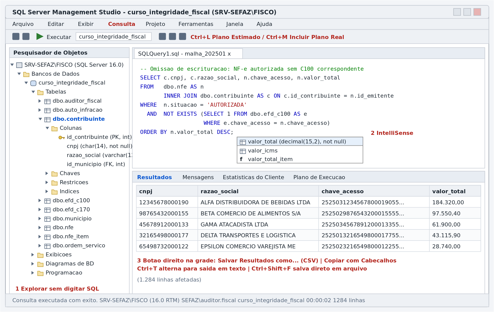
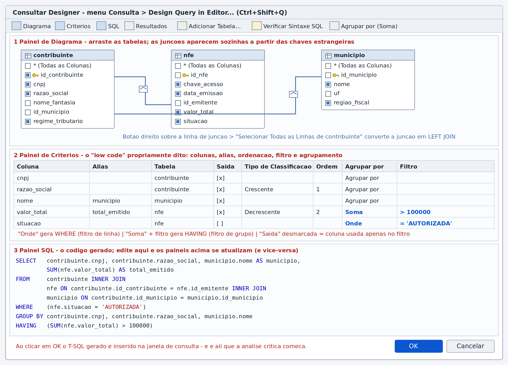
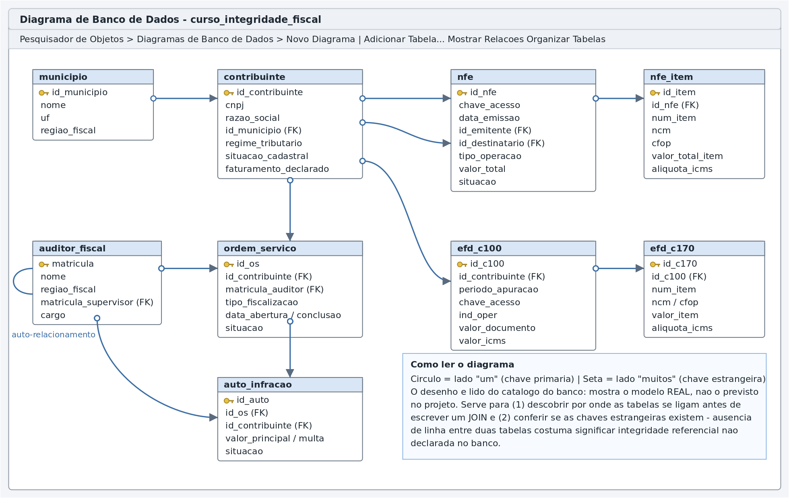
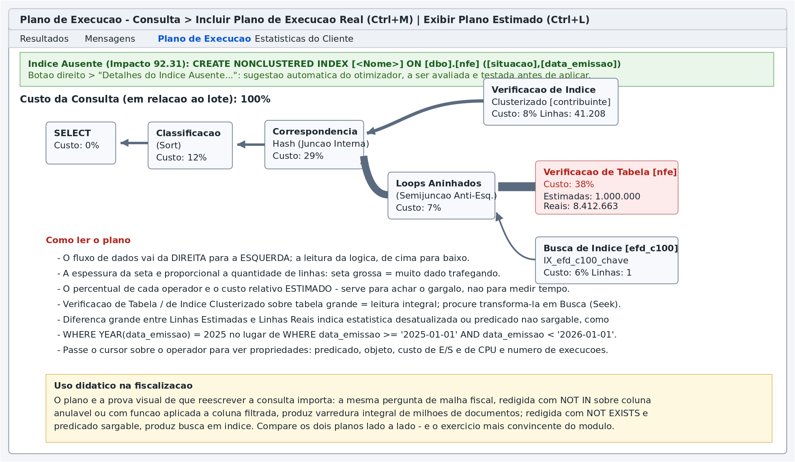
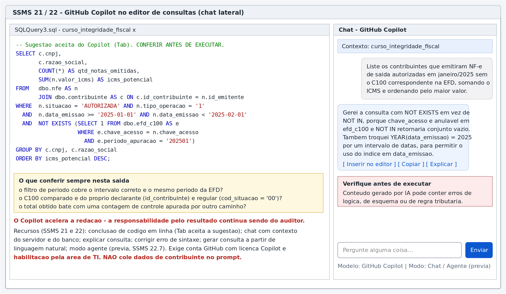
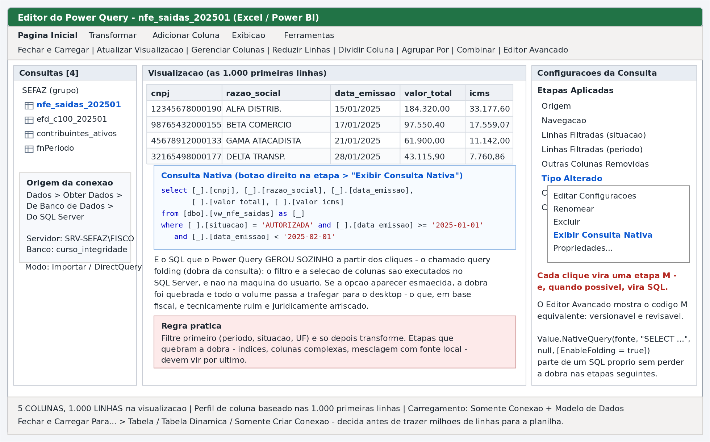
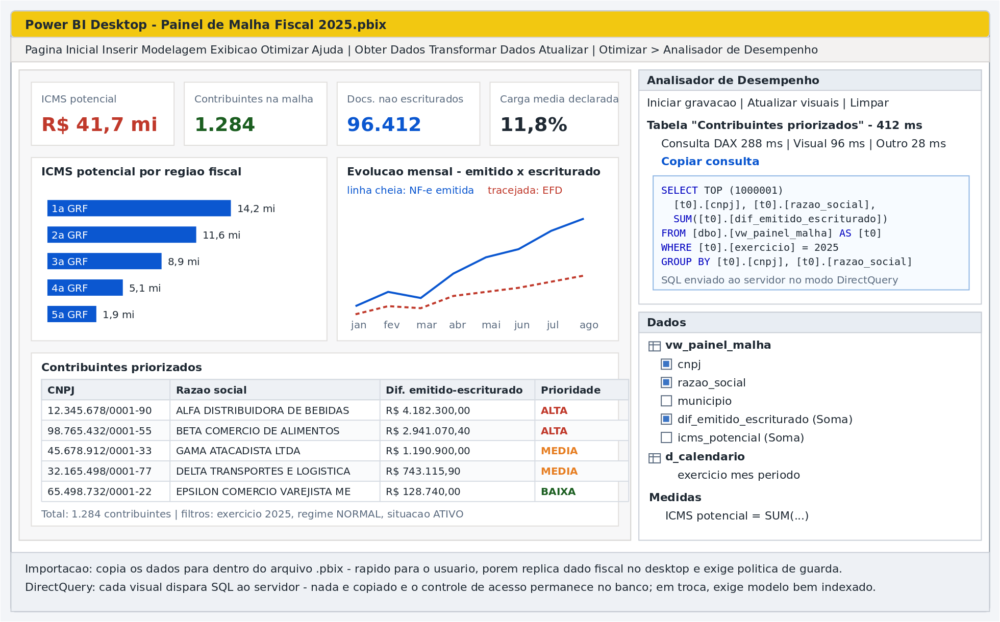
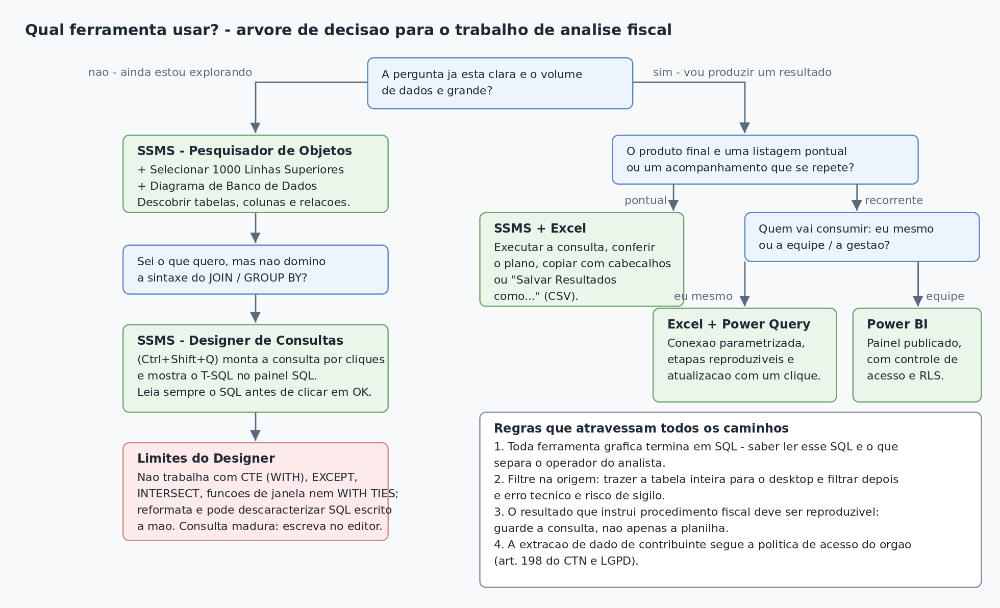

# Apostila — Ferramentas Gráficas para Análise com SQL

**Curso de Banco de Dados Relacional aplicado à Fiscalização Tributária**
**Módulo 10 — Recursos *low code* do SQL Server Management Studio, do Excel/Power Query e do Power BI**
**SGBD: Microsoft SQL Server (T-SQL) — Banco: `curso_integridade_fiscal`**

---

## Sumário

1. Apresentação e objetivos
2. O princípio que organiza o módulo: toda interface gráfica termina em SQL
3. A janela do SSMS
4. Explorar sem digitar: Pesquisador de Objetos, scripts automáticos e grades editáveis
5. O Designer de Consultas (*Query Designer*)
6. O Designer de Exibições (*View Designer*)
7. Diagramas de Banco de Dados
8. Produtividade no editor: modelos, trechos, IntelliSense e atalhos
9. O que fazer com o resultado: grade, texto, arquivo e exportação
10. Planos de execução gráficos e estatísticas
11. GitHub Copilot no SSMS
12. Excel + Power Query
13. Power BI Desktop
14. Quadro comparativo e árvore de decisão
15. Governança, sigilo fiscal e boas práticas
16. Exercícios
17. Referências

> **Sobre as figuras.** As oito figuras deste módulo estão na pasta `figuras/`, em `.png` (para inserir em documentos) e em `.svg` (vetorial, para projeção e impressão). São **representações esquemáticas** das telas, elaboradas para fins didáticos: reproduzem a disposição dos painéis e os pontos que interessam à aula, sem serem capturas do ambiente de produção — o que também evita expor dados de contribuintes em material de curso. O arquivo `gerar_figuras.py` reproduz e permite adaptar todas elas.

---

## 1. Apresentação e objetivos

### 1.1 Por que este módulo existe

O Módulo 9 tratou da linguagem SQL: como escrever a consulta. Este módulo trata de **como chegar até ela** — e de como distribuir o resultado — usando os recursos gráficos que o SQL Server Management Studio (SSMS) e as ferramentas Microsoft de análise oferecem.

Há duas razões práticas para isso na administração tributária:

1. **Curva de aprendizagem.** Servidores que dominam o negócio fiscal, mas não a sintaxe, produzem consultas corretas muito mais cedo quando montam a estrutura por cliques e leem o T-SQL gerado. A interface funciona como um tradutor: o auditor pensa em termos de "quero contribuinte, nota, município, somar valor e filtrar situação"; a ferramenta devolve `SELECT ... INNER JOIN ... GROUP BY ... HAVING`.
2. **Ciclo completo do trabalho.** Uma análise fiscal não termina no `SELECT`: ela vira listagem para a ordem de serviço, planilha para conferência, painel de acompanhamento para a gerência. Excel/Power Query e Power BI são o destino natural desse resultado — e ambos, sem que o usuário perceba, também geram SQL.

### 1.2 Objetivos de aprendizagem

Ao final do módulo, o participante deverá ser capaz de:

1. Explorar um banco desconhecido pelo Pesquisador de Objetos e gerar scripts a partir de menus de contexto.
2. Construir consultas com junções, agrupamento, ordenação e filtros no **Designer de Consultas**, e **ler criticamente** o T-SQL produzido.
3. Reconhecer as **limitações** do construtor gráfico e identificar quando passar a escrever a consulta à mão.
4. Ler um **diagrama de banco de dados** para descobrir caminhos de junção e conferir a existência de chaves estrangeiras.
5. Interpretar um **plano de execução gráfico** o suficiente para distinguir varredura de busca e detectar predicados não *sargable*.
6. Usar os recursos de produtividade do editor (modelos, trechos, IntelliSense, formatação, atalhos) e exportar resultados com segurança.
7. Utilizar o **Copilot no SSMS** como assistente de redação, mantendo a responsabilidade técnica e o sigilo fiscal.
8. Conectar **Excel/Power Query** e **Power BI** ao SQL Server, verificar o *query folding* e escolher entre Importação e DirectQuery.
9. Escolher a ferramenta adequada a cada situação e aplicar as regras de governança de dados fiscais.

### 1.3 Pré-requisitos

Módulos 1 a 9. É indispensável o domínio dos conceitos do Módulo 9 (junções, agregação, `WHERE` × `HAVING`, `NULL`), porque **a interface gráfica não protege contra erro conceitual** — ela apenas o produz mais depressa.

---

## 2. O princípio que organiza o módulo

> **Toda ferramenta gráfica de análise termina em SQL.**
> O Designer de Consultas escreve `SELECT`. O Power Query, quando bem usado, traduz cliques em `SELECT`. O Power BI em DirectQuery envia `SELECT` a cada visual. A diferença entre o operador e o analista não está em qual botão aperta, mas em **saber ler o SQL que o botão gerou**.

Três consequências práticas orientam todo o restante:

| Consequência | Implicação para o trabalho fiscal |
|---|---|
| O SQL gerado é sempre visível | Nenhuma consulta deve instruir procedimento fiscal sem que seu SQL tenha sido lido e compreendido |
| O SQL gerado é frequentemente subótimo | A GUI monta o que é sintaticamente correto, não o que é eficiente; para volume grande, revise |
| O SQL gerado é reproduzível | Guarde o script, não apenas a planilha: é o que permite refazer a apuração e sustentá-la em impugnação |

---

## 3. A janela do SSMS



**Figura 1 — Áreas da janela do SSMS.** À esquerda, o Pesquisador de Objetos; ao centro, o editor de consultas com realce de sintaxe e IntelliSense; abaixo, o painel de resultados com suas abas (Resultados, Mensagens, Estatísticas do Cliente, Plano de Execução).

Quatro áreas concentram o trabalho:

| Área | Atalho | Para que serve na prática fiscal |
|---|---|---|
| Pesquisador de Objetos | `F8` | Descobrir tabelas, colunas, tipos, chaves e índices de uma base recebida |
| Editor de Consultas | `Ctrl+N` | Escrever e executar T-SQL |
| Painel de Resultados | `Ctrl+R` alterna | Conferir a saída, os planos e as estatísticas |
| Barra de status | — | Confirmar **em qual servidor e em qual banco** a consulta está rodando |

> **Hábito de segurança.** Antes de executar qualquer coisa, confira na barra de status e no seletor da barra de ferramentas o servidor e o banco ativos. Rodar em produção uma consulta pensada para o ambiente de estudos é um acidente comum — e, quando a instrução não é um `SELECT`, é um acidente caro.

### 3.1 Versões e o que muda entre elas

O SSMS é distribuído separadamente do mecanismo de banco de dados e evolui em ritmo próprio:

| Versão | Marco relevante |
|---|---|
| 18.0 | Removeu os Diagramas de Banco de Dados |
| 18.1 | **Restaurou** os Diagramas de Banco de Dados após reação da comunidade |
| 21 | Primeira versão de 64 bits baseada no shell do Visual Studio 2022; introduziu o Copilot |
| 22.x | Baseada no Visual Studio 2026; conclusão de código e chat do Copilot em disponibilidade geral (22.4.1, março/2026) |
| 22.7 (jun/2026) | Formatação nativa de T-SQL, modo agente do Copilot e comparação gráfica de esquema, em prévia |

Os recursos *low code* clássicos — Designer de Consultas, Designer de Exibições, Diagramas, Modelos — permanecem disponíveis em todas essas versões. Confirme a versão instalada em **Ajuda ▸ Sobre**, porque a redação exata dos menus varia.

---

## 4. Explorar sem digitar

### 4.1 Pesquisador de Objetos

O Pesquisador expõe a estrutura completa do banco em árvore. Para o auditor que recebe uma base nova, a sequência produtiva é sempre a mesma:

1. **Tabelas** — quais entidades existem e como se chamam;
2. **Colunas** — tipos, nulidade e o que é chave (`PK`, `FK` aparecem ao lado do nome);
3. **Chaves** — quais relacionamentos foram efetivamente declarados;
4. **Índices** — o que está indexado (indica por onde é barato filtrar);
5. **Exibições** — o que a área de TI já preparou como visão consolidada.

Dois recursos pouco conhecidos e muito úteis:

- **Detalhes do Pesquisador de Objetos** (`F7`): abre um painel em forma de lista com colunas de metadados (data de criação, número de linhas, espaço em disco). Permite ordenar as tabelas por quantidade de linhas — a maneira mais rápida de descobrir onde estão os grandes volumes antes de escrever a primeira consulta.
- **Filtro** (botão direito sobre a pasta ▸ *Filtro* ▸ *Configurações de Filtro*): em bancos com centenas de objetos, filtrar por nome contendo `efd` ou `nfe` economiza rolagem.

### 4.2 Scripts gerados por menu

Botão direito sobre uma tabela ▸ **Script da Tabela como** ▸ `SELECT em` / `INSERT em` / `UPDATE em` / `CREATE em` ▸ *Nova Janela do Editor de Consultas*.

O SSMS escreve o comando com **todas as colunas nomeadas e qualificadas**. É o caminho mais rápido para obter a lista completa de colunas sem digitação — e, portanto, para abandonar o `SELECT *` sem esforço:

```sql
-- Gerado por: Script da Tabela como > SELECT em
SELECT TOP (1000) [id_nfe]
      ,[chave_acesso]
      ,[numero]
      ,[serie]
      ,[data_emissao]
      ,[id_emitente]
      ,[id_destinatario]
      ,[tipo_operacao]
      ,[valor_total]
      ,[valor_icms]
      ,[situacao]
  FROM [curso_integridade_fiscal].[dbo].[nfe];
```

O mesmo menu gera o `CREATE TABLE` completo — útil para documentar em um relatório de auditoria de sistemas a estrutura exata que existia na data da diligência.

### 4.3 Selecionar 1000 Linhas Superiores e Editar 200 Linhas Superiores

- **Selecionar 1000 Linhas Superiores** executa imediatamente um `SELECT TOP (1000)`. É a inspeção inicial de conteúdo: formatos de data, presença de nulos, padrões de preenchimento, uso de maiúsculas nas razões sociais.
- **Editar 200 Linhas Superiores** abre uma grade **editável**. Em ambiente de produção fiscal, isso deve ser encarado com reserva: altera dados sem registro de script e sem transação explícita. Seu valor didático é outro — nessa janela, o menu **Consultar Designer** habilita os mesmos painéis do construtor gráfico da seção 5, aplicados à tabela aberta.

> **Recomendação para a SEFAZ.** Em bases de produção, o perfil de acesso do auditor deve ser somente leitura. A grade editável não deve ser o caminho de correção de dado algum: correções se fazem por script versionado, com `BEGIN TRAN`, conferência e `COMMIT` — como visto no Módulo 8.

---

## 5. O Designer de Consultas (*Query Designer*)

É o recurso *low code* central do SSMS: constrói consultas por arrastar-e-soltar e por marcação em grade.



**Figura 2 — Os painéis do Designer de Consultas.** No topo, o painel de diagrama com as tabelas e as junções; no meio, o painel de critérios; embaixo, o painel SQL com o código gerado.

### 5.1 Como abrir

| Caminho | Observação |
|---|---|
| Menu **Consulta ▸ Design Query in Editor…** (`Ctrl+Shift+Q`) | Principal. A consulta montada é inserida na janela do editor ao clicar em OK |
| Selecionar um trecho de SQL no editor e pressionar `Ctrl+Shift+Q` | Abre o designer **já com a consulta selecionada** carregada — excelente para *entender* uma consulta herdada visualmente |
| Grade de **Editar 200 Linhas Superiores** ▸ menu **Consultar Designer ▸ Painel** | Habilita os painéis Diagrama/Critérios/SQL sobre a tabela aberta |
| **Novo Modo de Exibição** (seção 6) | O mesmo designer, com destino em `CREATE VIEW` |

### 5.2 Os quatro painéis

| Painel | Função | Gera |
|---|---|---|
| **Diagrama** | Escolher tabelas e definir junções | `FROM` e `JOIN … ON` |
| **Critérios** | Escolher colunas, alias, ordenação, agrupamento e filtros | `SELECT`, `WHERE`, `GROUP BY`, `HAVING`, `ORDER BY` |
| **SQL** | Exibir e editar o código | a consulta inteira |
| **Resultados** | Executar e conferir | — |

Os painéis são **bidirecionais**: editar o SQL atualiza o diagrama e a grade; alterar a grade reescreve o SQL. Alterne a exibição pelos quatro primeiros botões da barra do designer.

### 5.3 Receita de uso — cruzamento contribuinte × NF-e × município

1. **Adicionar Tabela…** e incluir `contribuinte`, `nfe` e `municipio`. As junções aparecem automaticamente quando existem chaves estrangeiras declaradas — se **não** aparecerem, é sinal de que a FK não existe no banco (ver seção 7); nesse caso, arraste a coluna de uma tabela sobre a coluna correspondente da outra para criar a junção manualmente.
2. No diagrama, **marque as caixas de seleção** das colunas desejadas. Cada marcação cria uma linha no painel de critérios.
3. No painel de critérios, preencha:
   - **Alias** — nome de exibição da coluna (`total_emitido`);
   - **Saída** — desmarque quando a coluna servir apenas para filtrar;
   - **Tipo de Classificação / Ordem** — geram o `ORDER BY`;
   - **Agrupar por** — muda a natureza da consulta (ver 5.4);
   - **Filtro** — gera `WHERE` ou `HAVING`, conforme o caso.
4. Confira o painel SQL. **Sempre.**
5. **Verificar Sintaxe SQL** e, então, **OK**.

### 5.4 O mapa GUI → SQL (a tabela que interessa memorizar)

Ao acionar o botão **Agrupar por (Σ)**, o painel de critérios ganha a coluna "Agrupar por", cujos valores se traduzem assim:

| Valor na coluna "Agrupar por" | T-SQL gerado | Efeito |
|---|---|---|
| `Agrupar por` | coluna entra no `GROUP BY` | define o nível de agregação |
| `Soma`, `Média`, `Contagem`, `Mín`, `Máx`, `Contagem Distinta` | `SUM()`, `AVG()`, `COUNT()`, `MIN()`, `MAX()`, `COUNT(DISTINCT …)` | agrega |
| `Onde` | condição vai para o **`WHERE`** | filtra **linhas**, antes de agrupar |
| `Expressão` | expressão livre na lista de seleção | cálculos |
| filtro em coluna com função agregada | condição vai para o **`HAVING`** | filtra **grupos** |

Esse quadro é a materialização visual da distinção `WHERE` × `HAVING` estudada no Módulo 9: na interface, é literalmente a diferença entre escrever o filtro em uma linha marcada como `Onde` e em uma linha marcada como `Soma`.

### 5.5 Junções externas pela interface

Clique com o botão direito **sobre a linha de junção** no diagrama:

| Opção marcada | Resultado |
|---|---|
| nenhuma | `INNER JOIN` |
| *Selecionar Todas as Linhas de `contribuinte`* | `LEFT OUTER JOIN` (preserva a tabela da esquerda) |
| *Selecionar Todas as Linhas de `nfe`* | `RIGHT OUTER JOIN` |
| ambas | `FULL OUTER JOIN` |

O losango sobre a linha muda de desenho conforme a escolha, indicando o lado preservado. É a forma mais rápida de montar o padrão de **antijunção** (`LEFT JOIN` + filtro `É Nulo` na chave da tabela da direita) que sustenta toda a malha fiscal de omissões.

> **Cuidado com o filtro na tabela opcional.** Ao montar um `LEFT JOIN` pela interface e digitar um filtro sobre coluna da tabela da direita, o designer o coloca no `WHERE` — o que, como visto no Módulo 9 (seção 11.5), **anula a junção externa**. Nesse caso é preciso corrigir manualmente no painel SQL, movendo a condição para o `ON`. É um dos pontos em que a interface leva ao erro se o conceito não estiver claro.

### 5.6 Limitações do Designer — quando parar de usá-lo

O construtor gráfico é uma ferramenta de aprendizagem e de montagem inicial, não um ambiente de produção. Ele **não** trabalha com:

- **CTEs** (`WITH …`), inclusive recursivas;
- operadores de conjunto `UNION`, `INTERSECT`, `EXCEPT`;
- **funções de janela** (`ROW_NUMBER`, `SUM() OVER`);
- `TOP … WITH TIES`, `OFFSET/FETCH`;
- variáveis (`DECLARE @periodo …`), lote com `GO`, comentários que ele preserve fielmente;
- consultas com subconsultas complexas — aceita algumas, mas com frequência as reescreve.

Além disso, ele **reformata** o SQL: identação, parênteses e quebras de linha são refeitos, e comentários podem ser perdidos. Abrir uma consulta madura no designer é um bom modo de descaracterizá-la.

> **Regra prática:** monte no designer, refine no editor. Uma vez que a consulta ganhe CTE, função de janela ou operador de conjunto, ela deixou de ser objeto do construtor gráfico.

---

## 6. O Designer de Exibições (*View Designer*)

Pesquisador de Objetos ▸ **Exibições** ▸ botão direito ▸ **Nova Exibição…** abre o mesmo designer, com destino em `CREATE VIEW`.

Uma exibição (`VIEW`) é uma consulta nomeada e armazenada. Para a fiscalização, o valor é grande:

- **padroniza** definições que não podem variar entre auditores — o que conta como "saída autorizada", o que é "documento regular" na EFD;
- **simplifica** o consumo por Excel e Power BI, que passam a enxergar uma tabela única em vez de cinco junções;
- **protege**, quando combinada com permissões: concede-se acesso à exibição, não às tabelas de base.

```sql
-- Exibição-padrão do curso, usada pelas ferramentas de análise
CREATE VIEW dbo.vw_nfe_saidas AS
SELECT n.id_nfe,
       n.chave_acesso,
       n.data_emissao,
       n.valor_total,
       n.valor_icms,
       n.situacao,
       c.id_contribuinte,
       c.cnpj,
       c.razao_social,
       c.regime_tributario,
       m.nome         AS municipio,
       m.regiao_fiscal
FROM   dbo.nfe          AS n
       INNER JOIN dbo.contribuinte AS c ON c.id_contribuinte = n.id_emitente
       INNER JOIN dbo.municipio    AS m ON m.id_municipio    = c.id_municipio
WHERE  n.tipo_operacao = '1';
```

> Exibições comuns **não** melhoram desempenho por si sós — são substituídas textualmente na consulta que as usa. Ganho de desempenho exige exibição **indexada** (`WITH SCHEMABINDING` + índice clusterizado), assunto de outro módulo.

---

## 7. Diagramas de Banco de Dados



**Figura 3 — Diagrama do banco `curso_integridade_fiscal`.** Cada caixa é uma tabela; cada linha, uma chave estrangeira, com o símbolo de chave no lado "um" e a seta no lado "muitos".

Pesquisador de Objetos ▸ **Diagramas de Banco de Dados** ▸ botão direito ▸ **Novo Diagrama de Banco de Dados** ▸ adicionar as tabelas de interesse.

Para o trabalho fiscal, o diagrama responde a duas perguntas que antecedem qualquer consulta:

1. **Por onde estas tabelas se ligam?** — o caminho de junção fica visível, e com ele a resposta sobre quantos `JOIN` serão necessários para ir de `auto_infracao` até `municipio`.
2. **A integridade referencial existe de fato?** — se duas tabelas que logicamente se relacionam não têm linha entre si, a FK **não foi declarada**. Isso significa que o banco aceita `id_contribuinte` órfão em `efd_c100`, e que o cruzamento pode perder linhas silenciosamente. Achado desse tipo é, ele próprio, resultado de auditoria de sistemas.

Observações operacionais:

- Exige que o banco tenha um proprietário válido; se o SSMS reclamar de "objetos de diagrama de banco de dados", peça ao administrador que execute a instalação de suporte a diagramas.
- Recursos úteis do menu de contexto: *Nomes de Coluna* (alterna entre nome apenas e nome+tipo), *Organizar Tabelas*, *Copiar Diagrama para a Área de Transferência* (para colar no relatório) e *Gerar Script de Alteração*.
- **Atenção:** o diagrama é uma superfície de *edição*. Arrastar uma coluna ou apagar uma linha pode gerar alteração real de esquema. Em produção, abra-o para ler — e feche sem salvar.

---

## 8. Produtividade no editor

Não é *low code* no sentido estrito, mas reduz drasticamente a digitação.

| Recurso | Como acionar | Uso na fiscalização |
|---|---|---|
| **Pesquisador de Modelos** | `Ctrl+Alt+T` | Modelos prontos de `CREATE`, `ALTER`, backup etc. |
| **Preencher parâmetros do modelo** | `Ctrl+Shift+M` | Abre caixa de diálogo para substituir os `<parâmetro, tipo, valor>` do modelo |
| **Trechos (snippets)** | `Ctrl+K, Ctrl+X` | Inserir esqueletos de `SELECT`, `INSERT`, `BEGIN TRAN` |
| **Circundar com** | `Ctrl+K, Ctrl+S` | Envolver a seleção em `BEGIN…END`, `IF`, `WHILE` |
| **IntelliSense** | automático; `Ctrl+Espaço` força | Completar nomes de tabelas e colunas; `Ctrl+Shift+R` atualiza o cache local após um `ALTER TABLE` |
| **Comentar / descomentar** | `Ctrl+K, Ctrl+C` / `Ctrl+K, Ctrl+U` | Testar variações da consulta |
| **Formatar documento** | `Ctrl+K, Ctrl+D` (SSMS 22.7+, prévia) | Padronizar a identação do T-SQL |
| **Analisar (sem executar)** | `Ctrl+F5` | Validar sintaxe antes de rodar consulta pesada |
| **Executar / Cancelar** | `F5` / `Alt+Break` | — |
| **Alternar resultado grade/texto/arquivo** | `Ctrl+D` / `Ctrl+T` / `Ctrl+Shift+F` | — |

**Modelos personalizados são um instrumento de padronização institucional.** Um modelo de "consulta de malha fiscal" com o cabeçalho de identificação (matrícula, número da OS, período, base legal) e a estrutura da consulta garante que toda extração fique documentada:

```sql
-- =========================================================
-- Ordem de Servico....: <numero_os, varchar(20), OS-2025-00000>
-- Auditor.............: <matricula, int, 0>
-- Periodo de apuracao.: <periodo, char(6), 202501>
-- Objeto..............: <objetivo, varchar(200), descrever a hipotese verificada>
-- Data de extracao....: (preenchida na execucao)
-- =========================================================
SELECT ...
```

---

## 9. O que fazer com o resultado

| Necessidade | Caminho | Cuidado |
|---|---|---|
| Conferir na tela | Resultados em Grade (`Ctrl+D`) | — |
| Colar em e-mail/documento | Botão direito ▸ *Copiar com Cabeçalhos* (`Ctrl+Shift+C`) | Confira se o destinatário pode receber o dado |
| Gerar arquivo para o processo | Botão direito ▸ *Salvar Resultados como…* (CSV) | CSV não guarda tipos: valores e datas podem ser reinterpretados pelo Excel |
| Resultado grande e recorrente | Assistente de **Importação e Exportação de Dados** | Permite destino Excel, CSV ou outro banco |
| Dados para instruir auto de infração | Script de `INSERT` via *Gerar Scripts ▸ Tipos de dados a serem gerados: Somente dados* | Produz evidência reprodutível |
| Publicar para a equipe | Exibição + Power BI (seção 13) | Aplique segurança em nível de linha |

> **Armadilha do CSV com CNPJ.** Ao abrir no Excel um CSV com a coluna `cnpj`, os zeros à esquerda desaparecem e a coluna vira número. Isso já invalidou muitos cruzamentos. Soluções: importar pelo Power Query definindo o tipo como texto (seção 12), ou exportar a coluna já formatada com máscara no próprio SQL.

---

## 10. Planos de execução gráficos



**Figura 4 — Plano de execução real, com sugestão de índice ausente.** O fluxo de dados corre da direita para a esquerda; a espessura das setas é proporcional ao número de linhas.

| Recurso | Atalho | O que entrega |
|---|---|---|
| Exibir Plano de Execução Estimado | `Ctrl+L` | Plano previsto, **sem** executar a consulta |
| Incluir Plano de Execução Real | `Ctrl+M` | Plano com contagens reais, após executar |
| Estatísticas do Cliente | `Shift+Alt+S` | Comparação entre execuções (tempo, pacotes, linhas) |
| Estatísticas de Consulta Dinâmica | menu Consulta | Animação do fluxo durante a execução — excelente em sala de aula |

**O mínimo a saber ler:**

1. **Busca (Seek)** usa índice para ir direto às linhas; **Verificação (Scan)** lê tudo. Em tabelas de documentos fiscais com milhões de linhas, a diferença decide se a consulta roda em segundos ou em horas.
2. **Setas grossas** significam muitas linhas trafegando entre operadores — procure filtrar antes.
3. **Estimadas × Reais** muito diferentes indicam estatísticas desatualizadas ou predicado que impede o uso de índice, tipicamente por aplicar função à coluna filtrada (`YEAR(data_emissao) = 2025`, `LEFT(cnpj,8) = '12345678'`).
4. A faixa verde de **índice ausente** é sugestão automática do otimizador: útil como pista, jamais aplicada diretamente em produção sem avaliação de impacto em gravação e espaço.

> **Exercício demonstrativo clássico.** Execute lado a lado, com `Ctrl+M` ligado, a versão com `NOT IN` sobre coluna anulável e a versão com `NOT EXISTS` da mesma consulta de omissão de escrituração (Módulo 9, seção 16.1). Compare custo relativo, operadores e número de leituras. Nada convence mais rápido sobre a importância da forma de escrever.

---

## 11. GitHub Copilot no SSMS



**Figura 5 — Chat do Copilot ao lado do editor, com o contexto do servidor e do banco.**

### 11.1 O que oferece

- **Conclusão de código em linha:** sugere o restante da instrução enquanto se digita; `Tab` aceita.
- **Chat com contexto de servidor e banco:** conhece os nomes de tabelas e colunas do banco conectado, o que reduz sugestões inventadas.
- **Explicar consulta:** descreve em linguagem natural o que um `SELECT` herdado faz — útil para revisar consultas de terceiros.
- **Corrigir erro:** propõe correção a partir da mensagem de erro.
- **Modo agente** (prévia, SSMS 22.7): recebe um objetivo e executa passos — inclusive executar consultas e ler planos — mediante aprovação.

Disponibilidade: chat e conclusões em disponibilidade geral desde o SSMS 22.4.1 (março/2026); exige conta GitHub com licença Copilot e habilitação pela área de TI.

### 11.2 Como usar com proveito

Prompts vagos produzem SQL genérico. Prompts que citam **tabelas, colunas, período e regra** produzem SQL utilizável:

> "Usando `nfe` e `efd_c100`, liste os contribuintes que emitiram NF-e de saída autorizadas em janeiro/2025 sem o C100 correspondente (mesma `chave_acesso`, `periodo_apuracao` = '202501', `cod_situacao` = '00'), somando `valor_icms` e ordenando pelo maior valor."

### 11.3 Limites e governança — leitura obrigatória

1. **Não cole dados de contribuinte no prompt.** Nome, CNPJ, chave de acesso e valores são dados protegidos pelo sigilo fiscal (art. 198 do CTN) e pela LGPD. Descreva o esquema e a regra, nunca o conteúdo.
2. **O resultado é sugestão, não parecer.** A responsabilidade técnica pela consulta que instrui um procedimento fiscal é do servidor que a executa.
3. **Erros típicos a procurar:** filtro de período fora do intervalo pretendido; junção pela coluna errada quando há nomes parecidos (`id_emitente` × `id_destinatario`); esquecimento de `cod_situacao` ou de `situacao`; uso de `NOT IN` onde caberia `NOT EXISTS`.
4. **Valide por contagem de controle.** Antes de aceitar o resultado, apure o mesmo número por outro caminho — total do período, contagem por outra chave, amostra conferida manualmente.
5. **Política institucional prevalece.** Verifique se o uso de assistentes de IA sobre bases fiscais está autorizado no órgão antes de habilitar o recurso.

---

## 12. Excel + Power Query

O Power Query é o motor de conexão e transformação embutido no Excel (aba **Dados**) e no Power BI. É a ferramenta *low code* mais usada pelo auditor — e a menos compreendida, porque a maioria a utiliza sem saber que ela **escreve SQL**.



**Figura 6 — Editor do Power Query.** À esquerda, as consultas; ao centro, a visualização e o SQL gerado ("Consulta Nativa"); à direita, a lista de Etapas Aplicadas, onde o menu de contexto revela a opção *Exibir Consulta Nativa*.

### 12.1 Conectar

**Dados ▸ Obter Dados ▸ De Banco de Dados ▸ Do SQL Server**

| Campo | Preenchimento | Observação |
|---|---|---|
| Servidor | `SRV-SEFAZ\FISCO` | instância nomeada usa contrabarra |
| Banco de dados | `curso_integridade_fiscal` | opcional, mas recomendável |
| Modo de conectividade | **Importar** ou **DirectQuery** | ver 13.1 |
| Instrução SQL (opcional) | um `SELECT` próprio | ver a advertência em 12.3 |
| Credenciais | Windows (integrada) | preferível ao usuário e senha do banco |

Em seguida, o **Navegador** lista tabelas e exibições. Escolha `vw_nfe_saidas` (seção 6) e clique em **Transformar Dados** — e não em *Carregar*: o objetivo é filtrar **antes** de trazer.

### 12.2 Query folding: o conceito central

Cada clique no editor vira uma **Etapa Aplicada** em linguagem M. Quando a etapa é traduzível para SQL, o Power Query a envia ao servidor em vez de executá-la na máquina do usuário. Esse mecanismo se chama **query folding** (dobra da consulta).

Para verificar: **botão direito sobre a etapa ▸ Exibir Consulta Nativa**.

| Situação | Significado |
|---|---|
| A opção aparece habilitada | a dobra está intacta até ali; o SQL exibido é o que será executado no servidor |
| A opção aparece **esmaecida** | a dobra foi quebrada em alguma etapa anterior; daí em diante tudo é processado no desktop |

Por que isso é decisivo em base fiscal: sem dobra, uma tabela de dezenas de milhões de itens de NF-e trafega inteira pela rede e é processada na estação de trabalho — lento, instável e, do ponto de vista de sigilo, indefensável.

**Etapas que costumam preservar a dobra:** filtrar linhas, remover/renomear colunas, alterar tipo, mesclar com outra consulta da **mesma** fonte, agrupar, ordenar.
**Etapas que costumam quebrá-la:** adicionar índice, coluna personalizada com função M sem equivalente em SQL, mesclar com fonte local (planilha), `Table.Buffer`.

**Regra de ouro:** *filtre primeiro, transforme depois.*

### 12.3 SQL próprio sem perder a dobra

Digitar um `SELECT` no campo "Instrução SQL" da conexão funciona, mas historicamente **interrompe** a dobra: tudo o que vier depois é processado localmente. A alternativa, no Editor Avançado, é declarar explicitamente que a consulta nativa pode ser dobrada:

```m
let
    Fonte = Sql.Database("SRV-SEFAZ\FISCO", "curso_integridade_fiscal"),
    Consulta = Value.NativeQuery(
        Fonte,
        "SELECT cnpj, razao_social, data_emissao, valor_total, valor_icms
           FROM dbo.vw_nfe_saidas
          WHERE situacao = 'AUTORIZADA'
            AND data_emissao >= @ini AND data_emissao < @fim",
        [ini = DataInicial, fim = DataFinal],
        [EnableFolding = true]
    )
in
    Consulta
```

Note ainda a **parametrização**: `DataInicial` e `DataFinal` são parâmetros do Power Query (aba *Página Inicial ▸ Gerenciar Parâmetros*). Com eles, a mesma pasta de trabalho serve a qualquer período — basta alterar o parâmetro e atualizar, sem editar consulta alguma. É o que transforma uma extração pontual em rotina de acompanhamento.

### 12.4 Cuidados específicos com dado fiscal

| Problema | Prevenção |
|---|---|
| CNPJ perde zeros à esquerda | defina o tipo da coluna como **Texto** logo na primeira etapa de tipo |
| Chave de acesso vira notação científica | idem — 44 dígitos são texto, nunca número |
| Valores com separador trocado | confira a Localidade em *Tipo Alterado ▸ Usando Localidade* (Português-Brasil) |
| Perfil de coluna enganoso | o rodapé mostra estatística das **1.000 primeiras linhas**; para conclusões, use *Perfil de coluna baseado no conjunto de dados inteiro* |
| Planilha gigante e lenta | carregue como **Somente Criar Conexão** + Modelo de Dados, e analise por Tabela Dinâmica |

---

## 13. Power BI Desktop



**Figura 7 — Painel de malha fiscal no Power BI Desktop, com o Analisador de Desempenho exibindo o SQL enviado ao servidor.**

### 13.1 Importação × DirectQuery

| Critério | Importação | DirectQuery |
|---|---|---|
| Onde ficam os dados | copiados para dentro do arquivo `.pbix` | permanecem no SQL Server |
| Desempenho de interação | muito rápido (motor em memória) | depende do servidor e dos índices |
| Atualização | agendada / manual | a cada interação com o visual |
| Volume | limitado pela memória | adequado a volumes grandes |
| **Sigilo fiscal** | o arquivo passa a **conter** dados de contribuintes — exige política de guarda, criptografia e controle de compartilhamento | nada é copiado; o controle de acesso permanece no banco |
| Recursos de modelagem | completos | restrições em DAX e em transformações |

> **Recomendação para a SEFAZ.** Para painéis institucionais com dado individualizado de contribuinte, prefira **DirectQuery** sobre exibições preparadas, combinado com **segurança em nível de linha** (RLS) por região fiscal ou por perfil. Importação fica reservada a agregados que não identifiquem o contribuinte.

### 13.2 Ver o SQL que o Power BI gera

**Exibição ▸ Analisador de Desempenho ▸ Iniciar gravação ▸ Atualizar visuais**. Cada visual passa a listar seu tempo; em DirectQuery, o link **Copiar consulta** entrega o SQL efetivamente enviado ao servidor. É o instrumento para (a) entender por que um visual está lento e (b) auditar exatamente o que o painel consulta.

### 13.3 Boas práticas de modelo

1. **Não use uma consulta gigante como fonte única.** Modele em tabelas de fato (`vw_painel_malha`) e dimensões (`d_calendario`, `d_contribuinte`), com relacionamentos.
2. **Crie a tabela calendário** e marque-a como tabela de datas: é o que faz funcionar comparação entre períodos.
3. **Medidas em DAX, não colunas calculadas**, sempre que possível.
4. **Nomeie para o usuário final**: `ICMS potencial`, e não `sum_dif_emitido_escriturado`.
5. **Documente a regra** de cada indicador em uma página do próprio relatório — quem lê o painel precisa saber o que significa "prioridade alta".

---

## 14. Quadro comparativo e árvore de decisão

| Ferramenta | Escreve SQL? | Melhor para | Limite principal |
|---|---|---|---|
| Pesquisador de Objetos | gera scripts | explorar estrutura, obter listas de colunas | não consulta dados |
| Selecionar 1000 Linhas | sim (`TOP`) | primeira inspeção de conteúdo | amostra, não análise |
| **Designer de Consultas** | **sim, e mostra** | montar `JOIN`/`GROUP BY` sem decorar sintaxe | sem CTE, conjunto, janela; reformata o código |
| Designer de Exibições | sim (`CREATE VIEW`) | padronizar definições e simplificar o consumo | mesmas limitações do designer |
| Diagramas de BD | não | entender o modelo e as FKs | é superfície de edição: risco de alterar |
| Plano de execução | não | diagnosticar desempenho | exige interpretação |
| Copilot no SSMS | sim (por IA) | rascunhar e explicar consultas | pode errar; restrições de sigilo |
| Excel + Power Query | sim (dobra) | extração recorrente e parametrizada | quebra de dobra derruba o desempenho |
| Power BI | sim (DirectQuery) | painel para a equipe e a gestão | exige modelagem e governança |



**Figura 8 — Árvore de decisão: qual ferramenta usar em cada situação.**

---

## 15. Governança, sigilo fiscal e boas práticas

A facilidade da interface gráfica amplia o alcance de quem a usa — não a sua competência legal. Cinco regras devem acompanhar todo o módulo:

1. **Acesso pelo perfil, não pela ferramenta.** O que o auditor pode ver é definido pelas permissões concedidas no banco. Nenhuma ferramenta gráfica cria autorização; se ela mostra o dado, é porque o perfil permite — e o registro de acesso existe.
2. **Sigilo fiscal (art. 198 do CTN) e LGPD.** Dado individualizado de contribuinte só circula no estrito interesse da administração tributária. Isso vale para a planilha exportada, para o `.pbix` importado e para o texto colado em um prompt de IA.
3. **Minimize a cópia.** Prefira filtrar na origem, publicar por DirectQuery e trabalhar sobre exibições. Cada cópia em desktop é uma superfície de risco a mais.
4. **Reprodutibilidade.** Guarde a consulta (script `.sql` ou a etapa M), a data e a hora da extração e o parâmetro de período. A planilha isolada não prova como o número foi obtido — e é o "como" que sustenta o auto de infração em impugnação.
5. **Conferência independente.** Todo resultado que fundamente procedimento fiscal deve ser conferido por um segundo caminho: contagem de controle, amostra manual ou consulta escrita de forma diferente por outro servidor.

---

## 16. Exercícios

> Resolva no ambiente do curso, sobre o banco `curso_integridade_fiscal`. As respostas comentadas estão em **`gabarito_ferramentas_graficas_sql.md`**.

### Bloco A — Exploração pelo SSMS

**A1.** Usando apenas o Pesquisador de Objetos (sem escrever SQL), descubra e anote: (a) quantas tabelas o banco possui; (b) quais colunas de `nfe` aceitam nulo; (c) quais índices existem em `efd_c100`.

**A2.** Pelo painel **Detalhes do Pesquisador de Objetos** (`F7`), ordene as tabelas por número de linhas e identifique as três maiores. Justifique, em duas linhas, por que essa informação deve preceder a redação de qualquer cruzamento.

**A3.** Gere, por menu de contexto, o script `SELECT` completo da tabela `nfe_item` e o `CREATE TABLE` de `efd_c170`. Explique uma situação de auditoria em que o segundo script é, ele próprio, evidência.

**A4.** Use *Selecionar 1000 Linhas Superiores* em `contribuinte` e relacione três características do preenchimento dos dados que só se percebem olhando (por exemplo: padronização de maiúsculas, presença de nulos, formato do CNPJ).

### Bloco B — Designer de Consultas

**B1.** No Designer (`Ctrl+Shift+Q`), monte uma consulta que liste CNPJ, razão social e município dos contribuintes ativos do regime normal, ordenada por razão social. Copie o SQL gerado e compare-o com o que você escreveria à mão: aponte duas diferenças de estilo.

**B2.** Acrescente a tabela `nfe` e produza, ainda pelo Designer: quantidade de notas autorizadas e soma do valor total por contribuinte, apenas para quem tem mais de 100 notas. Identifique, no painel de critérios, exatamente onde nasceu o `GROUP BY` e onde nasceu o `HAVING`.

**B3.** Converta a junção com `nfe` em junção externa pela interface, de modo que contribuintes sem nota apareçam. Registre qual opção do menu de contexto você marcou e qual cláusula mudou no SQL.

**B4.** Ainda no Designer, tente montar uma consulta que use `EXCEPT` entre as chaves de acesso de `nfe` e de `efd_c100`. Descreva o que acontece e explique por quê.

**B5.** Abra no Designer (selecionando o texto e pressionando `Ctrl+Shift+Q`) a consulta da seção 16.1 do Módulo 9 (omissão de escrituração, com `NOT EXISTS`). O que o Designer faz com ela? Que lição isso traz sobre o momento de abandonar o construtor gráfico?

**B6.** Monte pela interface um `LEFT JOIN` entre `nfe` e `efd_c100` e adicione o filtro `periodo_apuracao = '202501'` na linha de `efd_c100`. Execute. O resultado é o esperado? Corrija no painel SQL e explique a correção.

### Bloco C — Exibições e diagramas

**C1.** Crie, pelo **Designer de Exibições**, a exibição `vw_autos_por_auditor` com: matrícula e nome do auditor, região fiscal, quantidade de autos e valor total autuado. Salve e consulte-a com um `SELECT` simples.

**C2.** Monte um diagrama contendo `contribuinte`, `nfe`, `nfe_item`, `efd_c100` e `efd_c170`. Identifique visualmente o caminho de junção entre `nfe_item` e `efd_c170` e escreva o `FROM` correspondente.

**C3.** Verifique no diagrama se existe chave estrangeira entre `efd_c100.chave_acesso` e `nfe.chave_acesso`. Explique o significado prático da resposta para o cruzamento de malha fiscal.

### Bloco D — Planos de execução

**D1.** Com `Ctrl+M` ligado, execute as duas versões da consulta de contribuintes sem NF-e como destinatários — uma com `NOT IN` (protegida com `IS NOT NULL`) e outra com `NOT EXISTS`. Compare custo relativo, operadores e leituras.

**D2.** Execute `SELECT ... WHERE YEAR(data_emissao) = 2025` e depois a versão com intervalo de datas. Identifique no plano a mudança de Verificação para Busca e explique o conceito de predicado *sargable*.

**D3.** Localize no plano uma sugestão de índice ausente. Redija um parágrafo, como se fosse para a área de TI, argumentando a favor ou contra a criação desse índice — considerando impacto em gravação e em espaço.

### Bloco E — Excel, Power Query e Power BI

**E1.** Conecte o Excel a `vw_nfe_saidas`, filtre janeiro/2025 e situação `AUTORIZADA` pelo editor do Power Query e verifique, pela opção *Exibir Consulta Nativa*, o SQL gerado. Transcreva-o.

**E2.** Acrescente uma etapa que quebre a dobra (por exemplo, *Adicionar Coluna de Índice*) e verifique novamente. Descreva o que mudou e por que isso importa em uma tabela com dezenas de milhões de linhas.

**E3.** Parametrize a consulta com `DataInicial` e `DataFinal` e demonstre a troca de período sem editar a consulta.

**E4.** Importe a coluna `cnpj` sem definir o tipo como texto e observe o resultado. Corrija e explique o risco fiscal de não ter percebido o problema.

**E5.** No Power BI, construa um visual de tabela sobre `vw_painel_malha`, ative o **Analisador de Desempenho** e copie o SQL gerado. Compare o SQL do modo Importação com o do modo DirectQuery.

**E6.** Escreva meia página comparando Importação e DirectQuery **do ponto de vista do sigilo fiscal**, e recomende um dos dois para um painel com CNPJ e valores individualizados, justificando.

### Bloco F — Integração e julgamento profissional

**F1.** Escolha uma das rotinas de cruzamento do Módulo 9 (seção 16) e descreva o percurso completo pelas ferramentas: onde começaria, o que faria em cada uma e como entregaria o resultado. Justifique cada escolha pela árvore de decisão da Figura 8.

**F2.** Um colega apresenta uma planilha com 4.200 contribuintes "omissos de EFD", produzida por Power Query, sem guardar a consulta. Liste cinco perguntas que você faria antes de instaurar procedimentos com base nela.

**F3.** Redija, em até uma página, um procedimento interno de uso de ferramentas gráficas de análise pela sua repartição, contemplando: perfis de acesso, guarda de arquivos extraídos, uso de assistentes de IA e reprodutibilidade das apurações.

---

## 17. Referências

MICROSOFT. **Open the Query and View Designer (Visual Database Tools)**. Microsoft Learn. Disponível em: <https://learn.microsoft.com/en-us/ssms/visual-db-tools/open-the-query-and-view-designer-visual-database-tools>.

MICROSOFT. **Work with Database Diagrams (Visual Database Tools)**. Microsoft Learn. Disponível em: <https://learn.microsoft.com/en-us/sql/ssms/visual-db-tools/work-with-database-diagrams-visual-database-tools>.

MICROSOFT. **SSMS Query Editor**. Microsoft Learn. Disponível em: <https://learn.microsoft.com/en-us/ssms/f1-help/database-engine-query-editor-sql-server-management-studio>.

MICROSOFT. **What is GitHub Copilot in SQL Server Management Studio?** Microsoft Learn. Disponível em: <https://learn.microsoft.com/en-us/ssms/copilot/copilot-in-ssms-overview>.

MICROSOFT. **Get started — GitHub Copilot in SQL Server Management Studio**. Microsoft Learn. Disponível em: <https://learn.microsoft.com/en-us/ssms/github-copilot/get-started>.

MICROSOFT. **SQL Server Management Studio (SSMS) 22.4.1 and GitHub Copilot in SSMS (Generally Available)**. Microsoft Fabric Blog, mar. 2026. Disponível em: <https://blog.fabric.microsoft.com/en/blog/sql-server-management-studio-ssms-22-4-1-and-github-copilot-in-ssms-generally-available>.

MICROSOFT. **Understanding query evaluation and query folding in Power Query**. Microsoft Learn. Disponível em: <https://learn.microsoft.com/en-us/power-query/query-folding-basics>.

MICROSOFT. **Query folding on native queries — Power Query**. Microsoft Learn. Disponível em: <https://learn.microsoft.com/en-us/power-query/native-query-folding>.

MICROSOFT. **Import data from a database using native database query**. Microsoft Learn. Disponível em: <https://learn.microsoft.com/en-us/power-query/native-database-query>.

PETKOVIC, Dusan. **Microsoft SQL Server 2019: A Beginner's Guide**. 7. ed. New York: McGraw-Hill Education, 2020.

ELMASRI, Ramez; NAVATHE, Shamkant B. **Fundamentals of Database Systems**. 7. ed. Hoboken: Pearson, 2015.

BRASIL. **Lei nº 5.172/1966 (Código Tributário Nacional)**, art. 198 — sigilo fiscal.

BRASIL. **Lei nº 13.709/2018 (Lei Geral de Proteção de Dados Pessoais)**.

---

*Material didático produzido para o Curso de Banco de Dados Relacional aplicado à Fiscalização Tributária — Secretaria de Estado da Fazenda da Paraíba.*
